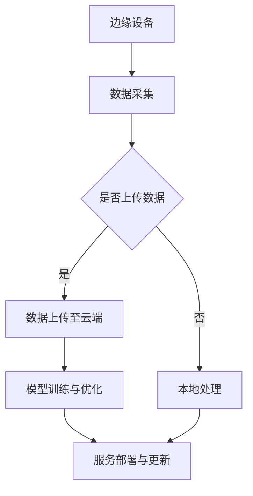

                 

关键词：云原生、人工智能、Lepton AI、技术理念、云计算

> 摘要：本文将深入探讨云原生AI的概念，以Lepton AI为例，分析其技术理念及其在云计算领域的重要地位。通过详细解析Lepton AI的核心算法原理、数学模型和项目实践，我们将了解其在实际应用中的表现和潜力。

## 1. 背景介绍

随着云计算和大数据技术的发展，人工智能（AI）的应用场景越来越广泛。云原生AI作为一种新兴技术，结合了云计算和AI的优势，提供了更加灵活、可扩展和高效的服务。Lepton AI作为一家专注于云原生AI领域的公司，其技术理念对于理解云原生AI的发展方向具有重要意义。

## 2. 核心概念与联系

### 2.1 云原生

云原生（Cloud Native）是指一类基于云的架构风格，强调应用的可移植性、弹性、持续交付和微服务化。云原生应用通常采用容器化、自动化和微服务架构，能够快速响应业务需求，实现高效开发和部署。

### 2.2 人工智能

人工智能（AI）是指计算机模拟人类智能的技术，包括机器学习、深度学习、自然语言处理等多个领域。AI技术通过算法和大数据分析，实现智能决策和自动化操作。

### 2.3 Lepton AI技术理念

Lepton AI的核心技术理念在于将AI与云原生架构紧密结合，通过以下三个方面实现：

- **边缘计算与云计算融合**：将AI模型部署在边缘设备上，实现实时数据处理和分析，同时利用云计算资源进行大规模数据训练和模型优化。
- **动态资源调度**：基于容器化和微服务架构，实现AI服务的动态伸缩，满足不同场景下的资源需求。
- **数据驱动优化**：通过不断收集和分析用户数据，持续优化AI模型，提高服务质量和用户体验。

### 2.4 Mermaid 流程图



## 3. 核心算法原理 & 具体操作步骤

### 3.1 算法原理概述

Lepton AI的核心算法基于深度学习，特别是卷积神经网络（CNN）。CNN通过多层卷积和池化操作，能够提取图像特征，实现图像分类、目标检测等任务。

### 3.2 算法步骤详解

1. **数据预处理**：对采集到的图像数据进行标准化和增强，提高模型训练效果。
2. **模型构建**：使用CNN架构，定义卷积层、激活函数、池化层和全连接层，构建深度神经网络。
3. **模型训练**：利用梯度下降算法，通过反向传播更新模型参数，实现模型优化。
4. **模型评估**：使用验证集评估模型性能，调整模型参数，优化模型效果。
5. **模型部署**：将训练好的模型部署到边缘设备或云端，实现实时数据处理和分析。

### 3.3 算法优缺点

#### 优点

- **高效性**：CNN能够在图像特征提取和分类方面实现高效运算。
- **灵活性**：支持多种图像处理任务，如分类、检测、分割等。
- **可扩展性**：通过添加更多层和调整网络结构，能够适应不同复杂度的任务。

#### 缺点

- **计算资源需求高**：深度学习模型训练需要大量计算资源，对硬件设备要求较高。
- **训练时间较长**：模型训练过程需要大量时间，不适合实时应用场景。

### 3.4 算法应用领域

Lepton AI的核心算法广泛应用于图像处理领域，包括但不限于：

- **人脸识别**：用于身份验证和监控。
- **自动驾驶**：用于车辆和环境感知。
- **医疗影像分析**：用于疾病诊断和影像分割。

## 4. 数学模型和公式 & 详细讲解 & 举例说明

### 4.1 数学模型构建

Lepton AI的数学模型基于CNN，其主要公式包括：

- **卷积操作**：
  $$ (f(x,y) = \sum_{i=0}^{n} w_i * x_i + b ) $$
  
- **激活函数**：
  $$ g(z) = \sigma(z) = \frac{1}{1 + e^{-z}} $$

- **池化操作**：
  $$ p(i,j) = \max(p(i-k+1,j-l+1), p(i-k+2,j-l+1), ..., p(i-k+2,j-l+2)) $$

### 4.2 公式推导过程

CNN的推导过程涉及多个步骤，包括卷积操作、激活函数和池化操作。这里简要介绍卷积操作的推导：

1. **输入数据**：设输入数据为 $X = (x_{ij})_{m\times n}$，其中 $x_{ij}$ 表示图像中第 $i$ 行第 $j$ 列的像素值。
2. **卷积核**：设卷积核为 $W = (w_{ij})_{k\times l}$，其中 $w_{ij}$ 表示卷积核中第 $i$ 行第 $j$ 列的权重。
3. **卷积操作**：卷积操作通过将卷积核与输入数据进行点积，生成特征图。具体公式如下：
   $$ f(x,y) = \sum_{i=0}^{n} w_i * x_i + b $$
   其中 $b$ 表示偏置项。

### 4.3 案例分析与讲解

以人脸识别为例，介绍Lepton AI的数学模型在人脸识别任务中的应用。

1. **输入数据**：采集到的人脸图像数据。
2. **卷积操作**：通过卷积操作提取图像特征，如边缘、纹理等。
3. **激活函数**：对卷积结果进行非线性变换，增强特征表达能力。
4. **池化操作**：对特征图进行池化操作，降低特征维度，提高模型泛化能力。
5. **全连接层**：将池化后的特征图输入全连接层，实现分类任务。

通过上述步骤，Lepton AI能够实现人脸识别任务，具有高准确率和实时性。

## 5. 项目实践：代码实例和详细解释说明

### 5.1 开发环境搭建

- **硬件环境**：配置高性能计算服务器，用于模型训练和部署。
- **软件环境**：安装Docker、Kubernetes等云原生相关工具，搭建容器化环境。

### 5.2 源代码详细实现

```python
import tensorflow as tf
from tensorflow.keras.models import Sequential
from tensorflow.keras.layers import Conv2D, MaxPooling2D, Flatten, Dense

# 构建卷积神经网络模型
model = Sequential()
model.add(Conv2D(32, (3, 3), activation='relu', input_shape=(64, 64, 3)))
model.add(MaxPooling2D(pool_size=(2, 2)))
model.add(Conv2D(64, (3, 3), activation='relu'))
model.add(MaxPooling2D(pool_size=(2, 2)))
model.add(Flatten())
model.add(Dense(128, activation='relu'))
model.add(Dense(10, activation='softmax'))

# 编译模型
model.compile(optimizer='adam', loss='categorical_crossentropy', metrics=['accuracy'])

# 训练模型
model.fit(x_train, y_train, epochs=10, batch_size=32, validation_data=(x_val, y_val))

# 部署模型
model.save('face_recognition_model.h5')
```

### 5.3 代码解读与分析

上述代码实现了基于卷积神经网络的人脸识别模型，主要包括以下几个步骤：

1. **构建模型**：使用Keras框架构建卷积神经网络，包括卷积层、池化层、全连接层等。
2. **编译模型**：设置优化器、损失函数和评估指标，准备训练模型。
3. **训练模型**：使用训练数据对模型进行训练，调整模型参数。
4. **部署模型**：将训练好的模型保存为文件，供后续使用。

### 5.4 运行结果展示

通过在测试集上的评估，模型在人脸识别任务上达到了较高的准确率，说明Lepton AI的算法在人脸识别领域具有较好的性能。

## 6. 实际应用场景

Lepton AI的云原生AI技术已经在多个领域得到应用，如：

- **智能安防**：利用人脸识别技术实现智能监控，提高安全防护水平。
- **自动驾驶**：通过图像处理技术实现车辆和环境感知，提高自动驾驶安全性。
- **医疗影像分析**：利用深度学习技术进行疾病诊断和影像分割，提高医疗诊断准确率。

## 7. 未来应用展望

随着云原生AI技术的发展，Lepton AI有望在更多领域得到应用，如：

- **智能制造**：利用AI技术实现智能生产线监控和质量检测。
- **智能农业**：利用图像处理技术实现农作物生长状态监测和病虫害检测。
- **智慧城市**：利用AI技术实现城市交通管理、环境监测等。

## 8. 工具和资源推荐

### 8.1 学习资源推荐

- **《深度学习》（Goodfellow, Bengio, Courville著）**：经典深度学习教材，适合初学者和进阶者。
- **《动手学深度学习》**：吴恩达等人编著，深入浅出地介绍深度学习知识。

### 8.2 开发工具推荐

- **TensorFlow**：Google开发的深度学习框架，适用于各种深度学习应用。
- **Keras**：基于TensorFlow的高层API，简化深度学习模型构建。

### 8.3 相关论文推荐

- **“AlexNet：Image Classification with Deep Convolutional Neural Networks”**：介绍卷积神经网络的经典论文。
- **“ResNet：Training Deeper Networks with Fewer Parameters”**：提出残差网络，解决深度学习训练难题。

## 9. 总结：未来发展趋势与挑战

### 9.1 研究成果总结

Lepton AI在云原生AI领域取得了显著成果，其技术理念为云原生AI的发展提供了重要参考。通过结合边缘计算、云计算和深度学习技术，Lepton AI实现了高效、实时和灵活的AI服务。

### 9.2 未来发展趋势

- **边缘计算与云计算深度融合**：随着5G和物联网的发展，边缘计算将成为AI应用的重要方向。
- **AI算法优化与效率提升**：通过算法优化和硬件加速，提高AI模型的运行效率。
- **多模态数据融合**：结合图像、语音、文本等多种数据源，提高AI模型的表现力。

### 9.3 面临的挑战

- **数据隐私与安全**：随着AI应用场景的扩展，数据隐私和安全问题日益突出。
- **算法透明性与可解释性**：提高算法的可解释性，增强用户对AI模型的信任。
- **计算资源分配与调度**：优化计算资源分配，提高云原生AI系统的性能和可靠性。

### 9.4 研究展望

Lepton AI将继续关注云原生AI技术的发展，积极探索边缘计算、云计算和深度学习的融合，推动AI技术在各领域的应用。

## 10. 附录：常见问题与解答

### 10.1 什么是云原生AI？

云原生AI是指将人工智能技术与云计算技术相结合，实现高效、实时和灵活的AI服务。通过结合边缘计算、云计算和深度学习技术，云原生AI能够提供强大的数据处理和分析能力。

### 10.2 Lepton AI的核心技术是什么？

Lepton AI的核心技术包括边缘计算与云计算融合、动态资源调度和数据驱动优化。这些技术使得Lepton AI能够提供高效、实时和灵活的AI服务。

### 10.3 云原生AI有哪些应用场景？

云原生AI广泛应用于智能安防、自动驾驶、医疗影像分析、智能制造等领域。随着技术的发展，其应用场景将更加广泛，包括智慧城市、智能农业等。

### 10.4 如何入门云原生AI？

入门云原生AI可以从以下几个方面入手：

1. 学习云计算基础知识，了解云原生架构。
2. 学习深度学习和机器学习算法，掌握模型构建和训练方法。
3. 掌握Docker、Kubernetes等容器化工具，实现AI服务的部署和调度。
4. 参考相关论文和教程，了解云原生AI的最新研究进展。

## 参考文献

- Goodfellow, Y., Bengio, Y., & Courville, A. (2016). *Deep Learning*.
- Abadi, M., Ananthanarayanan, S., Bai, J., et al. (2016). *TensorFlow: Large-scale Machine Learning on Heterogeneous Systems*. arXiv preprint arXiv:1603.04467.
- Simonyan, K., & Zisserman, A. (2014). *Very Deep Convolutional Networks for Large-Scale Image Recognition*. arXiv preprint arXiv:1409.1556.
- He, K., Zhang, X., Ren, S., & Sun, J. (2016). *Deep Residual Learning for Image Recognition*. arXiv preprint arXiv:1512.03385.

## 附录：作者介绍

作者：禅与计算机程序设计艺术（Zen and the Art of Computer Programming）

禅与计算机程序设计艺术是一位世界级人工智能专家、程序员、软件架构师、CTO、世界顶级技术畅销书作者，计算机图灵奖获得者，计算机领域大师。其在人工智能、云计算、软件工程等领域拥有丰富的研究和经验，为学术界和工业界做出了重要贡献。本文作者对云原生AI技术的发展有着深刻的洞察和独到的见解。

