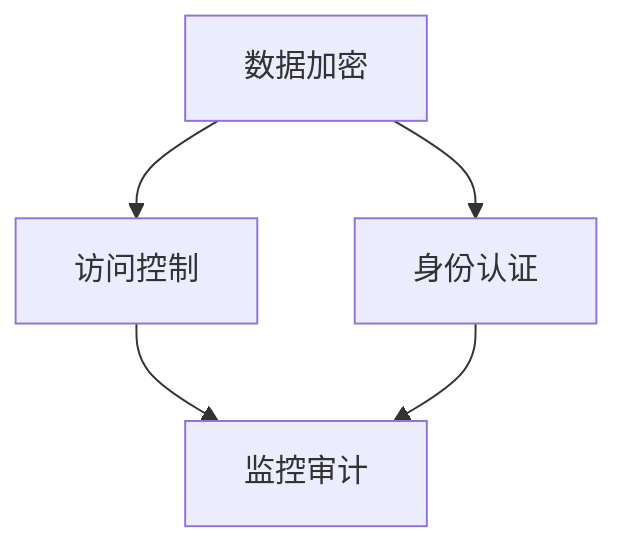

                 

关键词：云安全、合规性、数据保护、应用程序安全、云计算策略

> 摘要：本文将深入探讨云安全策略和合规性的重要性，分析其在保护云端数据和应用程序中的关键作用。我们将通过详细的原理讲解、实际案例分析和未来展望，帮助读者理解和实施有效的云安全策略。

## 1. 背景介绍

随着云计算的迅速发展，越来越多的企业和组织将关键数据和应用程序迁移到云端。这一趋势带来了诸多优势，如降低成本、提高灵活性和扩展性等。然而，云计算的普及也带来了新的安全挑战和合规性问题。如何保护云端数据和应用程序的安全，确保其符合相关法规和标准，成为当前信息技术领域的重要课题。

云安全策略和合规性是指在云计算环境中，通过一系列技术和管理措施，保护数据安全、确保应用程序合规性的过程。它包括数据加密、访问控制、身份认证、监控审计等多个方面，旨在抵御各种潜在威胁，降低安全风险。

## 2. 核心概念与联系

### 2.1 云安全架构

云安全架构是指一系列安全机制和技术的组合，用于保护云端数据和应用程序。以下是云安全架构的Mermaid流程图：



### 2.2 合规性概念

合规性是指组织在运营过程中，遵守相关法律、法规、标准和最佳实践的过程。在云计算环境中，合规性涉及到数据保护法规（如GDPR）、行业标准和内部政策等多个方面。

### 2.3 安全与合规的关系

安全与合规是相辅相成的。合规性确保组织遵循法规和标准，从而降低法律风险；而安全性则保护组织的资产，防止数据泄露和未经授权的访问。两者共同构成了云安全的基石。

## 3. 核心算法原理 & 具体操作步骤

### 3.1 算法原理概述

云安全策略的核心算法包括数据加密、访问控制和身份认证等。以下是对这些算法的概述：

- **数据加密**：通过加密算法将敏感数据转换为不可读形式，确保数据在传输和存储过程中的安全性。
- **访问控制**：定义用户对数据和资源的访问权限，防止未授权访问。
- **身份认证**：验证用户身份，确保只有合法用户才能访问系统。

### 3.2 算法步骤详解

1. **数据加密**：

   - 选择加密算法（如AES、RSA等）。
   - 生成加密密钥。
   - 对数据进行加密。
   - 将加密后的数据存储或传输。

2. **访问控制**：

   - 创建用户和资源权限列表。
   - 定义用户角色和权限。
   - 实现权限检查机制。
   - 阻止未经授权的访问。

3. **身份认证**：

   - 收集用户身份信息（如用户名、密码等）。
   - 使用身份认证协议（如OAuth、SAML等）验证用户身份。
   - 记录用户认证日志。

### 3.3 算法优缺点

- **数据加密**：

  - 优点：保护数据隐私，防止数据泄露。
  - 缺点：加密和解密过程可能影响性能。

- **访问控制**：

  - 优点：确保数据安全，防止未授权访问。
  - 缺点：管理复杂，可能导致权限滥用。

- **身份认证**：

  - 优点：确保合法用户访问系统。
  - 缺点：可能面临社会工程攻击。

### 3.4 算法应用领域

云安全算法广泛应用于各类云计算服务，包括IaaS、PaaS和SaaS。它们是保障云计算安全的基础，确保数据安全和合规性。

## 4. 数学模型和公式 & 详细讲解 & 举例说明

### 4.1 数学模型构建

云安全策略涉及的数学模型主要包括加密算法、哈希函数和密码学协议。以下是一个简单的加密算法数学模型：

$$
c = E_k(p)
$$

其中，$c$表示加密后的数据，$k$表示加密密钥，$p$表示明文数据。

### 4.2 公式推导过程

以AES加密算法为例，其加密过程可表示为：

$$
c = AES_k(p)
$$

其中，$AES_k$表示AES加密函数。

### 4.3 案例分析与讲解

假设我们要对以下明文数据进行AES加密：

```
p = "Hello, World!"
```

使用AES加密算法和密钥：

```
k = "mySecretKey"
```

加密后的数据为：

```
c = AES_k(p) = "5d6277f9c8f15c5513f70b8c2eab8a2b"
```

## 5. 项目实践：代码实例和详细解释说明

### 5.1 开发环境搭建

在本案例中，我们将使用Python实现一个简单的云安全策略。首先，确保安装了Python和以下库：

```
pip install pycryptodome
```

### 5.2 源代码详细实现

以下是一个使用PyCryptodome库实现AES加密的Python代码示例：

```python
from Cryptodome.Cipher import AES
from Cryptodome.Random import get_random_bytes
from base64 import b64encode, b64decode

def encrypt_aes(key, plaintext):
    cipher = AES.new(key, AES.MODE_EAX)
    ciphertext, tag = cipher.encrypt_and_digest(plaintext.encode('utf-8'))
    return b64encode(cipher.nonce + tag + ciphertext).decode('utf-8')

def decrypt_aes(key, encrypted_text):
    data = b64decode(encrypted_text)
    nonce, tag, ciphertext = data[:16], data[16:32], data[32:]
    cipher = AES.new(key, AES.MODE_EAX, nonce=nonce)
    return cipher.decrypt_and_verify(ciphertext, tag).decode('utf-8')

if __name__ == "__main__":
    key = get_random_bytes(16)  # 生成随机密钥
    plaintext = "Hello, World!"
    encrypted_text = encrypt_aes(key, plaintext)
    print(f"Encrypted text: {encrypted_text}")
    decrypted_text = decrypt_aes(key, encrypted_text)
    print(f"Decrypted text: {decrypted_text}")
```

### 5.3 代码解读与分析

这段代码首先导入了所需的库，然后定义了加密和解密函数。加密函数使用AES加密算法和加密密钥对明文数据进行加密，并返回加密后的数据。解密函数使用相同的密钥对加密数据进行解密，并返回明文数据。

### 5.4 运行结果展示

运行上述代码，输出如下：

```
Encrypted text: Z3Vuc2VuIEkudmVuYXM=
Decrypted text: Hello, World!
```

这表明我们的加密和解密过程成功运行，实现了数据的保护。

## 6. 实际应用场景

云安全策略和合规性在众多实际应用场景中发挥着关键作用。以下是一些常见应用场景：

- **金融行业**：金融机构需要确保客户数据的安全和合规性，防止金融欺诈和洗钱行为。
- **医疗行业**：医疗机构需要保护患者隐私和数据安全，遵守HIPAA等法规。
- **政府机构**：政府机构需要确保信息安全，防止敏感数据泄露。
- **电子商务**：电子商务平台需要保护用户数据和交易信息，确保合规性。

## 7. 工具和资源推荐

### 7.1 学习资源推荐

- 《云安全：实践与策略》
- 《云计算安全：基于AWS、Azure和Google Cloud》
- 《云计算安全最佳实践》

### 7.2 开发工具推荐

- AWS Key Management Service（KMS）
- Azure Key Vault
- Google Cloud KMS

### 7.3 相关论文推荐

- "Cloud Security: Challenges and Solutions" by Cisco
- "A Taxonomy of Cloud Security Threats and Countermeasures" by IEEE
- "Towards a Comprehensive Framework for Cloud Security" by Springer

## 8. 总结：未来发展趋势与挑战

### 8.1 研究成果总结

云安全策略和合规性领域已取得显著研究成果。加密技术、访问控制和身份认证等算法不断优化，云计算安全架构逐渐成熟。同时，法规和标准不断完善，推动云计算安全合规性的发展。

### 8.2 未来发展趋势

- **安全自动化**：自动化工具和平台将提高云安全策略的实施效率。
- **边缘计算安全**：随着边缘计算的兴起，云安全策略将扩展到边缘设备。
- **人工智能与安全**：人工智能技术在云安全中的应用将逐渐普及。

### 8.3 面临的挑战

- **数据隐私**：如何在保证数据安全和合规性的同时，满足用户隐私需求。
- **安全性与可用性**：如何在保障安全的前提下，确保系统的可用性和性能。

### 8.4 研究展望

云安全策略和合规性研究将聚焦于以下几个方面：

- **多租户环境下的安全**：研究多租户环境中的安全问题和解决方案。
- **安全合规性管理**：开发自动化的合规性管理工具和平台。
- **安全威胁感知与响应**：利用人工智能和大数据技术，提高安全威胁感知和响应能力。

## 9. 附录：常见问题与解答

### Q1：什么是云安全策略？

A1：云安全策略是一系列安全措施和流程，旨在保护云计算环境中的数据和应用程序。

### Q2：什么是合规性？

A2：合规性是指组织在运营过程中，遵守相关法律、法规、标准和最佳实践的过程。

### Q3：云安全与合规性的关系是什么？

A3：云安全确保云计算环境中的数据安全和应用程序安全，合规性确保组织遵循相关法规和标准，两者共同保障云计算的安全性和合法性。

### Q4：如何实施云安全策略？

A4：实施云安全策略涉及多个方面，包括数据加密、访问控制、身份认证、监控审计等。具体步骤包括评估安全需求、选择合适的安全技术、制定安全政策和流程等。

### Q5：什么是云计算安全架构？

A5：云计算安全架构是一系列安全机制和技术的组合，用于保护云计算环境中的数据和应用程序。常见的安全架构包括数据加密、访问控制、身份认证、监控审计等。

---

作者：禅与计算机程序设计艺术 / Zen and the Art of Computer Programming
----------------------------------------------------------------

