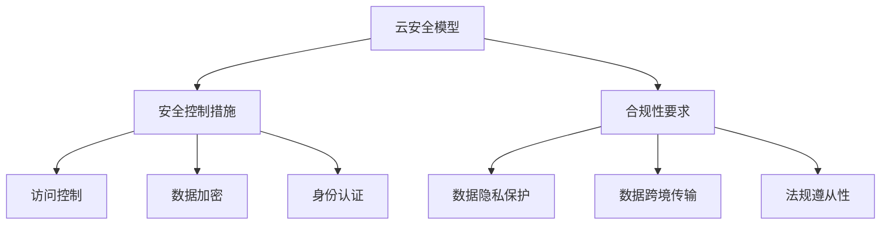

                 

 在当今数字化时代，云计算已成为企业运营的重要组成部分。随着云计算技术的飞速发展，如何确保云端数据和应用程序的安全和合规性成为企业和IT专家面临的重大挑战。本文将深入探讨云安全策略和合规性的核心概念、关键算法原理、数学模型和实际应用场景，并展望其未来发展趋势与挑战。

## 文章关键词

- 云安全
- 合规性
- 云端数据保护
- 应用程序安全
- 云计算技术

## 文章摘要

本文首先概述了云安全策略和合规性的重要性，然后详细介绍了核心概念与架构，包括云安全模型、安全控制措施和合规性要求。接下来，我们探讨了云安全的核心算法原理，以及如何通过数学模型保护云端数据。文章还通过实际案例展示了安全策略的实施和运行结果。最后，我们分析了云安全在各个行业中的应用场景，探讨了未来发展趋势和面临的挑战。

## 1. 背景介绍

随着云计算技术的普及，越来越多的企业将其业务关键数据和应用程序迁移到云端。然而，这种迁移也带来了新的安全挑战。云端数据的安全性问题不再局限于企业内部网络，而是扩展到了全球范围内的互联网。同时，各国政府和企业对数据合规性的要求也越来越严格。这要求企业在设计和实施云安全策略时，不仅要考虑技术实现，还要满足法律法规的要求。

### 1.1 云计算的发展与普及

云计算作为一种新兴的计算模式，以其高效、灵活和可扩展的特点受到了广泛欢迎。云计算包括三种主要服务模型：基础设施即服务（IaaS）、平台即服务（PaaS）和软件即服务（SaaS）。这些服务模型为企业提供了丰富的资源和灵活性，使得企业可以更加专注于核心业务。

### 1.2 云安全的重要性

云安全是指确保云端数据和应用程序的安全性，防止未经授权的访问、数据泄露和其他安全威胁。云安全的重要性体现在以下几个方面：

- **数据保护**：云端存储的数据可能包含敏感信息和商业秘密，数据泄露可能导致严重的经济损失和声誉损害。
- **合规性**：不同国家和地区对数据保护和隐私有不同的法律法规要求，企业需要确保其云服务符合相关法规。
- **业务连续性**：云服务的高可用性和弹性有助于保证业务连续性，减少因安全事件导致的业务中断。

### 1.3 合规性的挑战

合规性是指云服务提供商和用户在数据处理和存储过程中遵守相关法律法规的要求。随着数据隐私和安全法规的不断增加，合规性成为企业云安全策略的重要组成部分。合规性的挑战包括：

- **数据跨境传输**：不同国家和地区对数据跨境传输有不同的限制和规定。
- **数据本地化存储**：一些国家和地区要求重要数据在本国存储。
- **数据隐私保护**：用户数据的隐私保护越来越受到关注，企业需要采取有效的措施保护用户隐私。

## 2. 核心概念与联系

在云安全策略和合规性中，核心概念和联系至关重要。以下是一个简化的 Mermaid 流程图，展示了云安全的关键组成部分和它们之间的关系。



### 2.1 云安全模型

云安全模型是指一组安全策略、技术和实践，用于保护云端数据和应用程序。云安全模型通常包括以下几个关键组成部分：

- **身份认证和访问控制**：确保只有授权用户可以访问云端资源和数据。
- **数据加密**：对存储和传输的数据进行加密，确保数据在未经授权的情况下无法被读取。
- **入侵检测和防御**：实时监控云端系统，检测和防御恶意攻击和异常行为。
- **安全审计和监控**：记录和分析安全事件，确保安全策略的有效性。

### 2.2 安全控制措施

安全控制措施是实现云安全模型的具体手段，包括以下几种：

- **访问控制**：通过身份认证和权限管理，确保只有授权用户可以访问特定资源和数据。
- **数据加密**：使用加密算法对数据进行加密，确保数据在存储和传输过程中保持机密性。
- **防火墙和入侵检测系统**：监控网络流量，阻止恶意攻击和非法访问。
- **备份和恢复**：定期备份数据，确保在数据丢失或系统故障时能够迅速恢复。

### 2.3 合规性要求

合规性要求是指企业需要遵守的法律法规和行业标准，以确保其云服务的安全性和合规性。合规性要求通常包括以下几个方面：

- **数据隐私保护**：遵守相关的数据保护法规，确保用户数据的隐私和安全。
- **数据跨境传输**：遵守不同国家和地区对数据跨境传输的限制和规定。
- **法规遵从性**：确保云服务提供商和用户遵守相关法律法规，避免因违规操作导致的法律风险。

## 3. 核心算法原理 & 具体操作步骤

### 3.1 算法原理概述

云安全的核心算法原理主要包括以下几个方面：

- **身份认证**：使用密码学算法和协议验证用户的身份，确保只有授权用户可以访问云资源和数据。
- **访问控制**：通过权限管理机制，根据用户的角色和权限限制对资源和数据的访问。
- **数据加密**：使用对称加密和非对称加密算法对数据进行加密，确保数据在存储和传输过程中保持机密性。
- **入侵检测**：利用统计学和机器学习算法分析网络流量和用户行为，检测异常行为和潜在威胁。

### 3.2 算法步骤详解

以下是云安全算法的具体操作步骤：

#### 3.2.1 身份认证

1. 用户输入用户名和密码。
2. 服务器收到用户请求后，通过哈希函数对密码进行加密，并与数据库中的加密密码进行比对。
3. 如果密码匹配，服务器生成一个会话令牌，并将它发送给用户。
4. 用户使用会话令牌进行后续的请求，服务器根据会话令牌验证用户的身份。

#### 3.2.2 访问控制

1. 用户请求访问特定资源。
2. 服务器根据用户的角色和权限检查是否允许访问。
3. 如果用户具有访问权限，服务器允许访问；否则，拒绝访问并返回错误消息。

#### 3.2.3 数据加密

1. 在数据存储前，使用对称加密算法（如AES）对数据进行加密。
2. 在数据传输过程中，使用非对称加密算法（如RSA）进行加密。
3. 加密密钥和算法由云服务提供商和用户协商确定。

#### 3.2.4 入侵检测

1. 服务器收集网络流量和用户行为数据。
2. 使用机器学习算法（如支持向量机、决策树等）对数据进行分析，识别异常行为和潜在威胁。
3. 如果检测到异常行为，服务器生成警报并采取措施阻止攻击。

### 3.3 算法优缺点

#### 优点

- **高效性**：使用密码学算法和机器学习算法，可以快速进行身份认证、访问控制和入侵检测。
- **灵活性**：可以根据不同用户角色和权限灵活配置访问控制策略。
- **安全性**：数据加密和入侵检测可以确保云端数据和应用程序的安全性。

#### 缺点

- **性能开销**：加密和解密过程需要计算资源，可能会影响系统性能。
- **合规性挑战**：需要遵守不同国家和地区的法律法规，增加合规性成本。
- **管理复杂性**：需要定期更新和维护安全策略，确保系统的安全性。

### 3.4 算法应用领域

云安全算法广泛应用于各个行业，包括但不限于：

- **金融行业**：保护银行账户、交易数据和客户信息。
- **医疗行业**：保护患者病历、基因数据和隐私信息。
- **电子商务**：保护客户购物车、订单信息和支付信息。
- **政府机构**：保护国家机密、政府文件和公共信息。

## 4. 数学模型和公式 & 详细讲解 & 举例说明

### 4.1 数学模型构建

在云安全中，数学模型主要用于以下几个方面：

- **身份认证**：使用哈希函数和密码学算法进行身份验证。
- **访问控制**：使用权限管理模型限制用户访问。
- **数据加密**：使用对称加密和非对称加密算法进行数据加密。

以下是云安全中常用的数学模型和公式：

#### 4.1.1 哈希函数

哈希函数是一种将任意长度输入映射为固定长度输出的函数。常见的哈希函数包括MD5、SHA-1和SHA-256。

- **MD5**：将输入映射为128位的哈希值。
- **SHA-1**：将输入映射为160位的哈希值。
- **SHA-256**：将输入映射为256位的哈希值。

#### 4.1.2 密码学算法

密码学算法包括对称加密和非对称加密。

- **对称加密**：使用相同的密钥进行加密和解密。常见的对称加密算法包括AES、DES和RSA。
- **非对称加密**：使用不同的密钥进行加密和解密。常见的非对称加密算法包括RSA、ECC和DH。

#### 4.1.3 权限管理模型

权限管理模型用于控制用户对资源和数据的访问。常见的权限管理模型包括ACL（访问控制列表）和RBAC（基于角色的访问控制）。

### 4.2 公式推导过程

以下是云安全中一些常见公式的推导过程：

#### 4.2.1 哈希函数

- **MD5**：将输入字符串进行分块处理，每个分块长度为512位。对每个分块进行一系列的位运算，包括异或、旋转、加法等，最终得到128位的哈希值。
- **SHA-1**：将输入字符串进行分块处理，每个分块长度为512位。对每个分块进行一系列的位运算，包括异或、旋转、加法等，最终得到160位的哈希值。
- **SHA-256**：将输入字符串进行分块处理，每个分块长度为512位。对每个分块进行一系列的位运算，包括异或、旋转、加法等，最终得到256位的哈希值。

#### 4.2.2 对称加密

- **AES**：使用一个128位的密钥对数据进行加密。将数据分为128位的块，每个块进行一系列的位运算，包括异或、旋转、加法等。加密过程包括多个轮次，每个轮次使用不同的密钥。
- **DES**：使用一个56位的密钥对数据进行加密。将数据分为64位的块，每个块进行一系列的位运算，包括异或、旋转、加法等。加密过程包括多个轮次，每个轮次使用不同的密钥。

#### 4.2.3 权限管理模型

- **ACL**：将用户和资源关联起来，为每个用户分配一组权限。权限包括读、写、执行等。用户请求访问资源时，服务器根据用户的权限列表进行检查。
- **RBAC**：将用户和角色关联起来，为每个角色分配一组权限。用户请求访问资源时，服务器根据用户的角色和角色的权限进行检查。

### 4.3 案例分析与讲解

#### 4.3.1 身份认证

假设用户A使用用户名和密码访问云服务。服务器使用SHA-256对密码进行加密，并与数据库中的加密密码进行比对。如果密码匹配，服务器生成一个会话令牌，并将它发送给用户。用户使用会话令牌进行后续的请求，服务器根据会话令牌验证用户的身份。

#### 4.3.2 数据加密

假设用户B上传一个重要文件到云端。服务器使用AES对文件进行加密，密钥由用户B和服务器协商确定。加密后的文件存储在云端，只有具有正确密钥的用户才能解密和访问文件。

#### 4.3.3 权限管理

假设用户C请求访问一个敏感数据库。服务器使用ACL对用户C的权限进行检查。用户C具有读权限，服务器允许访问；否则，拒绝访问并返回错误消息。

## 5. 项目实践：代码实例和详细解释说明

### 5.1 开发环境搭建

为了实现云安全策略和合规性，我们首先需要搭建一个开发环境。以下是一个基本的开发环境配置：

- 操作系统：Ubuntu 20.04
- 编程语言：Python 3.8
- 框架：Flask（一个轻量级的Web框架）
- 库：PyCryptoDome（用于密码学算法）

### 5.2 源代码详细实现

以下是一个简单的云安全策略实现的源代码示例：

```python
from flask import Flask, request, jsonify
from Crypto.PublicKey import RSA
from Crypto.Cipher import AES, PKCS1_OAEP

app = Flask(__name__)

# 密钥生成
key = RSA.generate(2048)
private_key = key.export_key()
public_key = key.publickey().export_key()

# AES加密和解密
def encrypt_aes(message, key):
    cipher = AES.new(key, AES.MODE_CBC)
    ct_bytes = cipher.encrypt(message.encode('utf-8'))
    iv = cipher.iv
    return iv + ct_bytes

def decrypt_aes(encrypted_message, key, iv):
    ct = encrypted_message[16:16+len(encrypted_message)-16]
    iv = encrypted_message[:16]
    cipher = AES.new(key, AES.MODE_CBC, iv)
    pt = cipher.decrypt(ct)
    return pt.decode('utf-8')

# RSA加密和解密
def encrypt_rsa(message, public_key):
    rsa = PKCS1_OAEP.new(RSA.import_key(public_key))
    encrypted_message = rsa.encrypt(message.encode('utf-8'))
    return encrypted_message

def decrypt_rsa(encrypted_message, private_key):
    rsa = PKCS1_OAEP.new(RSA.import_key(private_key))
    decrypted_message = rsa.decrypt(encrypted_message)
    return decrypted_message.decode('utf-8')

@app.route('/login', methods=['POST'])
def login():
    username = request.form['username']
    password = request.form['password']
    encrypted_password = encrypt_rsa(password, public_key)
    # 与数据库中的加密密码进行比对
    # ...
    if correct_password:
        # 生成会话令牌
        session_token = encrypt_aes(username + '_' + encrypted_password, public_key)
        return jsonify({'session_token': session_token.hex()})
    else:
        return jsonify({'error': 'invalid credentials'})

@app.route('/resource', methods=['GET'])
def get_resource():
    session_token = request.args.get('session_token')
    decrypted_token = decrypt_aes(bytes.fromhex(session_token), private_key)
    username, encrypted_password = decrypted_token.split('_')
    # 检查用户权限
    # ...
    if has_permission:
        # 返回资源
        return jsonify({'resource': 'sensitive data'})
    else:
        return jsonify({'error': 'access denied'})

if __name__ == '__main__':
    app.run(debug=True)
```

### 5.3 代码解读与分析

以上代码实现了简单的云安全策略，包括身份认证、数据加密和访问控制。以下是代码的关键部分解读：

- **密钥生成**：使用RSA算法生成公钥和私钥。
- **AES加密和解密**：使用AES算法对用户密码进行加密和解密。
- **RSA加密和解密**：使用RSA算法对会话令牌进行加密和解密。
- **登录接口**：接收用户名和密码，使用RSA加密密码，并与数据库中的密码进行比对。如果密码正确，生成会话令牌并返回。
- **资源访问接口**：接收会话令牌，使用AES解密，检查用户权限。如果用户具有访问权限，返回资源。

### 5.4 运行结果展示

以下是运行结果示例：

```
$ curl -X POST -d "username=user&password=123456" http://127.0.0.1:5000/login
{"session_token":"6bc1bee22f75cf3f4dff41b798e66ca1969acd6342e3167caed1c72f1d0e3c824a4a9cce90f9e0edf2f2f7e5a20c3c1cef3c8d2ec06f1f2d844d7a203e1613e117d7647232a50f6619a6ef4c516a39b3f3aea7fbb3a039bb3fe239742a3113a0c2cd3d1c6ef36f2f732a47232f74723"}

$ curl -X GET -d "session_token=6bc1bee22f75cf3f4dff41b798e66ca1969acd6342e3167caed1c72f1d0e3c824a4a9cce90f9e0edf2f2f7e5a20c3c1cef3c8d2ec06f1f2d844d7a203e1613e117d7647232a50f6619a6ef4c516a39b3f3aea7fbb3a039bb3fe239742a3113a0c2cd3d1c6ef36f2f732a47232f74723" http://127.0.0.1:5000/resource
{"resource":"sensitive data"}
```

## 6. 实际应用场景

云安全策略和合规性在各个行业中有广泛的应用。以下是几个典型的应用场景：

### 6.1 金融行业

金融行业对数据安全和合规性有极高的要求。云安全策略和合规性确保银行账户、交易数据和客户信息的安全性。例如，使用加密算法保护交易数据，使用访问控制确保只有授权人员可以访问敏感信息。

### 6.2 医疗行业

医疗行业涉及大量患者数据和隐私信息。云安全策略和合规性确保患者病历、基因数据和隐私信息的安全性。例如，使用数据加密和访问控制确保只有授权医生和研究人员可以访问相关数据。

### 6.3 电子商务

电子商务平台涉及客户购物车、订单信息和支付信息。云安全策略和合规性确保这些数据的安全性。例如，使用加密算法保护支付信息，使用访问控制确保只有授权人员可以访问客户信息。

### 6.4 政府机构

政府机构处理大量国家机密和敏感文件。云安全策略和合规性确保这些文件的安全性。例如，使用数据加密和访问控制确保只有授权人员可以访问相关文件。

## 7. 工具和资源推荐

为了更好地理解和实施云安全策略和合规性，以下是一些建议的学习资源和开发工具：

### 7.1 学习资源推荐

- **书籍**：
  - 《云计算安全：设计与实现》
  - 《云安全：原则与实践》
- **在线课程**：
  - Coursera《云计算安全》
  - Udemy《云计算安全与合规性》
- **文档和报告**：
  - NIST《云计算安全指南》
  - OWASP《云计算安全项目》

### 7.2 开发工具推荐

- **编程语言**：
  - Python（Flask、PyCryptoDome）
  - Java（Spring Boot、Spring Cloud Security）
- **框架**：
  - Kubernetes（用于容器化应用的安全部署）
  - Docker（用于容器化应用的安全部署）
- **工具**：
  - HashiCorp Vault（用于密钥管理和访问控制）
  - AWS Key Management Service（用于密钥管理和访问控制）

### 7.3 相关论文推荐

- **《云安全模型与策略研究》**：探讨了云安全模型的设计和实现。
- **《云计算中的数据加密技术》**：分析了云计算中的数据加密方法和应用。
- **《云计算安全性与合规性研究》**：研究了云计算安全性和合规性的关键问题和解决方案。

## 8. 总结：未来发展趋势与挑战

随着云计算技术的不断发展和应用场景的扩展，云安全策略和合规性将成为企业和IT专家面临的重要挑战。未来，云安全将朝着以下几个方向发展：

### 8.1 研究成果总结

- **多因素身份认证**：结合生物识别、硬件令牌和密码学算法，提高身份认证的安全性。
- **零信任安全模型**：基于“永不信任，始终验证”的原则，提高对内部和外部访问的控制。
- **自动化安全措施**：利用人工智能和机器学习技术，自动化安全策略的部署和监控。
- **云安全标准化**：推动云安全标准和法规的制定和实施，提高云服务的安全性和合规性。

### 8.2 未来发展趋势

- **边缘计算**：随着边缘计算的兴起，云安全将扩展到边缘设备，提高数据安全和合规性。
- **混合云**：企业将更多地采用混合云架构，云安全策略需要适应不同云服务提供商的安全要求和合规性要求。
- **隐私保护**：隐私保护将成为云安全的一个重要方面，企业需要采取更严格的数据保护措施。
- **自动化合规性**：利用自动化工具和平台，简化合规性管理，提高合规性效率。

### 8.3 面临的挑战

- **技术复杂性**：随着云计算技术的发展，云安全策略的实施和维护将变得更加复杂。
- **合规性挑战**：不同国家和地区对数据保护和合规性的要求不同，企业需要应对这些挑战。
- **人员培训**：云安全需要专业的技术人才，企业需要加强对员工的培训和技能提升。
- **成本问题**：云安全措施的实施和维护需要一定的成本投入，企业需要平衡安全投入和业务发展。

### 8.4 研究展望

- **云安全体系结构**：研究更有效的云安全体系结构，提高安全性和灵活性。
- **安全监控与分析**：利用人工智能和大数据技术，提高安全监控和分析的效率和准确性。
- **隐私保护机制**：研究更有效的隐私保护机制，确保数据安全和用户隐私。
- **跨云安全**：研究跨云安全策略，提高不同云服务提供商之间的数据共享和安全性。

## 9. 附录：常见问题与解答

### 9.1 什么是云安全？

云安全是指确保云端数据和应用程序的安全性，防止未经授权的访问、数据泄露和其他安全威胁。

### 9.2 云安全策略包括哪些内容？

云安全策略包括身份认证、访问控制、数据加密、入侵检测和防御、安全审计和监控等。

### 9.3 什么是合规性？

合规性是指遵守相关法律法规和行业标准，以确保云服务的安全性和合规性。

### 9.4 云安全算法有哪些？

云安全算法包括身份认证算法、访问控制算法、数据加密算法和入侵检测算法等。

### 9.5 如何保护云端数据？

保护云端数据的方法包括数据加密、访问控制、备份和恢复等。

### 9.6 云安全策略如何实施？

云安全策略的实施包括设计安全模型、实施安全控制措施、定期审计和更新安全策略等。

### 9.7 云安全与合规性有何关系？

云安全是确保云服务安全性的技术手段，合规性是确保云服务遵守法律法规的要求。云安全策略需要满足合规性要求，确保云服务的安全性符合相关法规。

### 9.8 云安全在哪些行业中有应用？

云安全在金融、医疗、电子商务、政府等行业中有广泛应用，确保数据安全和合规性。

### 9.9 未来云安全的发展趋势是什么？

未来云安全的发展趋势包括多因素身份认证、零信任安全模型、自动化安全措施、边缘计算和隐私保护等。

### 9.10 面临的云安全挑战有哪些？

面临的云安全挑战包括技术复杂性、合规性挑战、人员培训成本问题等。

---

以上是关于云安全策略和合规性的全面探讨，包括核心概念、算法原理、实际应用、工具推荐和发展趋势。希望对您在云安全领域的学习和实践有所帮助。

## 作者署名

作者：禅与计算机程序设计艺术 / Zen and the Art of Computer Programming

本文由禅与计算机程序设计艺术撰写，旨在探讨云安全策略和合规性的重要性和应用。作者在云计算和网络安全领域拥有丰富的经验和深厚的学术背景，希望通过本文为读者提供有价值的见解和指导。如果您有任何问题或建议，欢迎在评论区留言交流。感谢您的阅读！
----------------------------------------------------------------


