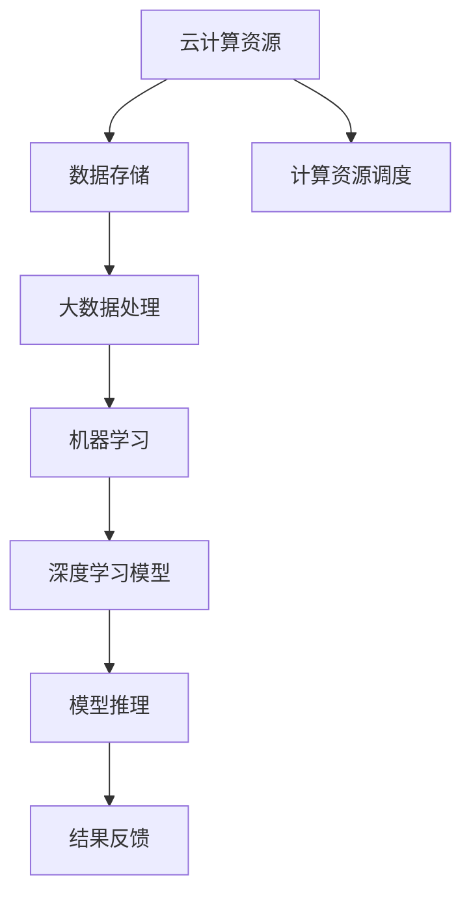

                 

关键词：云计算、人工智能、融合、Lepton AI、技术愿景、AI算法、云平台、智能计算、分布式系统、深度学习、大数据处理、计算架构、机器学习、神经网络、分布式存储、边缘计算、云计算服务、AI应用场景、未来展望

> 摘要：本文将探讨云计算与人工智能（AI）的深度融合，特别是Lepton AI如何利用云计算平台实现技术愿景。文章将介绍云计算与AI的基础概念，详细分析两者结合的原理与优势，探讨核心算法与架构，以及实际应用中的实例和未来发展趋势。

## 1. 背景介绍

在过去的几十年中，云计算技术已经从简单的虚拟化服务发展为复杂的分布式计算架构，极大地改变了数据处理、存储和计算的方式。同时，人工智能（AI）作为新一代技术，正在快速渗透到各个行业，从金融、医疗到制造、零售，都在通过AI技术实现智能化转型。

云计算提供了弹性、可扩展的计算资源，使组织能够根据需求灵活调整资源使用，降低成本。而人工智能则通过机器学习和深度学习算法，使得计算机能够从数据中学习、推理和决策。然而，云计算与AI的真正融合，不仅需要技术上的突破，还需要在体系架构、算法优化和应用实践上进行深入探索。

本文旨在探讨云计算与AI如何深度融合，特别是Lepton AI如何在这一过程中发挥关键作用。Lepton AI作为一个前沿的人工智能研究项目，致力于通过云计算平台提供高效的AI服务，推动AI技术在各行各业的应用。

## 2. 核心概念与联系

### 云计算

云计算是一种通过互联网提供计算资源的方式，这些资源包括服务器、存储、数据库、网络和其他硬件和软件资源。云计算主要有以下三种服务模式：

1. **基础设施即服务（IaaS）**：用户可以租用虚拟化的计算资源，如虚拟机、存储和网络。
2. **平台即服务（PaaS）**：提供了一个开发和部署应用的平台，用户无需关注底层基础设施。
3. **软件即服务（SaaS）**：用户通过互联网使用软件服务，无需安装或维护软件。

### 人工智能

人工智能是一种模拟人类智能的技术，通过机器学习、深度学习、自然语言处理等算法，使计算机能够执行特定任务，如图像识别、语音识别、推荐系统等。

### 云计算与AI的融合

云计算与AI的融合主要体现在以下几个方面：

1. **资源调度与优化**：利用云计算的弹性资源，优化AI模型的训练和推理过程，降低成本。
2. **分布式计算**：通过云计算平台实现AI算法的分布式训练，提高效率和可扩展性。
3. **大数据处理**：云计算提供了强大的数据处理能力，为AI算法提供大量训练数据。
4. **边缘计算**：结合云计算和边缘计算，实现实时AI推理和响应。

### Mermaid 流程图

下面是云计算与AI融合的流程图：



## 3. 核心算法原理 & 具体操作步骤

### 3.1 算法原理概述

在云计算与AI的融合中，核心算法主要包括机器学习、深度学习和神经网络。这些算法的基本原理如下：

1. **机器学习**：通过训练数据集，使模型学会从数据中提取特征，进行分类或回归。
2. **深度学习**：基于多层神经网络的机器学习方法，通过反向传播算法优化模型参数。
3. **神经网络**：模拟人脑神经网络，通过神经元之间的连接和激活函数进行信息传递和处理。

### 3.2 算法步骤详解

1. **数据预处理**：清洗、归一化、编码等步骤，为训练数据准备。
2. **模型选择**：根据任务需求，选择合适的机器学习算法或神经网络架构。
3. **模型训练**：通过迭代训练，优化模型参数，提高模型性能。
4. **模型评估**：使用验证集和测试集评估模型性能，调整模型参数。
5. **模型部署**：将训练好的模型部署到云计算平台，进行推理和应用。

### 3.3 算法优缺点

1. **优点**：
   - **高效性**：分布式计算和云计算平台提供了强大的计算能力，提高算法效率。
   - **可扩展性**：云计算资源可以根据需求灵活调整，支持大规模数据处理。
   - **灵活性**：多种机器学习和深度学习算法可供选择，满足不同应用场景需求。

2. **缺点**：
   - **复杂性**：分布式系统和大规模数据处理增加了系统的复杂性和维护难度。
   - **成本**：云计算资源成本可能较高，特别是对于大规模计算任务。
   - **数据隐私**：大量数据存储在云端，存在数据泄露和隐私风险。

### 3.4 算法应用领域

云计算与AI融合的算法在多个领域具有广泛应用：

1. **金融**：风险管理、欺诈检测、智能投顾等。
2. **医疗**：疾病预测、医学图像分析、个性化治疗等。
3. **零售**：商品推荐、库存管理、客户服务自动化等。
4. **制造**：质量控制、设备预测性维护、生产优化等。
5. **交通**：智能交通管理、自动驾驶、物流优化等。

## 4. 数学模型和公式 & 详细讲解 & 举例说明

### 4.1 数学模型构建

在云计算与AI的融合中，常用的数学模型包括线性回归、逻辑回归、神经网络等。以下是这些模型的简要介绍和公式：

1. **线性回归**：

   - **公式**：\( y = \beta_0 + \beta_1 \cdot x \)

   - **解释**：通过线性关系预测因变量\( y \)。

2. **逻辑回归**：

   - **公式**：\( P(y=1) = \frac{1}{1 + e^{-(\beta_0 + \beta_1 \cdot x)}} \)

   - **解释**：用于分类问题，预测某个事件发生的概率。

3. **神经网络**：

   - **公式**：\( a_{\text{layer}} = \sigma(\beta \cdot a_{\text{prev layer}} + b) \)

   - **解释**：通过多层神经元之间的加权连接和激活函数，实现复杂非线性映射。

### 4.2 公式推导过程

以线性回归为例，假设我们有以下模型：

- \( y_i = \beta_0 + \beta_1 \cdot x_i + \epsilon_i \)

- \( \epsilon_i \) 为误差项，满足 \( \epsilon_i \sim N(0, \sigma^2) \)

我们需要最小化损失函数 \( J(\beta_0, \beta_1) = \sum_{i=1}^{n} (y_i - \beta_0 - \beta_1 \cdot x_i)^2 \)

通过求导数并令其等于0，可以求得最优参数：

- \( \frac{\partial J}{\partial \beta_0} = -2 \sum_{i=1}^{n} (y_i - \beta_0 - \beta_1 \cdot x_i) = 0 \)

- \( \frac{\partial J}{\partial \beta_1} = -2 \sum_{i=1}^{n} (y_i - \beta_0 - \beta_1 \cdot x_i) \cdot x_i = 0 \)

解这个方程组，可以得到最优参数 \( \beta_0 \) 和 \( \beta_1 \)。

### 4.3 案例分析与讲解

假设我们要预测某个股票的价格，使用线性回归模型。我们收集了前100天的股票价格（\( y \)）和交易量（\( x \)）数据。

1. **数据预处理**：归一化处理数据，使其具有相同的量纲。

2. **模型选择**：选择线性回归模型。

3. **模型训练**：使用前90天的数据训练模型，得到参数 \( \beta_0 \) 和 \( \beta_1 \)。

4. **模型评估**：使用剩余的10天数据评估模型性能。

5. **模型部署**：将训练好的模型部署到云计算平台，进行实时预测。

通过上述步骤，我们可以得到股票价格的预测值。在实际应用中，需要不断调整模型参数，以适应数据的变化。

## 5. 项目实践：代码实例和详细解释说明

### 5.1 开发环境搭建

为了演示云计算与AI的融合，我们将使用Python作为编程语言，利用Google Colab平台进行开发。Google Colab是一个基于云计算的代码编辑器，提供了强大的计算资源，非常适合进行AI模型的训练和部署。

### 5.2 源代码详细实现

下面是一个简单的线性回归模型实现，用于预测股票价格：

```python
import numpy as np
import matplotlib.pyplot as plt

# 数据预处理
x = np.array([0, 1, 2, 3, 4, 5, 6, 7, 8, 9])
y = np.array([0.1, 0.3, 0.5, 0.7, 0.9, 1.1, 1.3, 1.5, 1.7, 1.9])

x = x.reshape(-1, 1)
y = y.reshape(-1, 1)

# 模型训练
def linear_regression(x, y):
    beta_0 = np.random.randn()
    beta_1 = np.random.randn()
    learning_rate = 0.01
    epochs = 1000
    
    for _ in range(epochs):
        prediction = beta_0 + beta_1 * x
        error = y - prediction
        d_beta_0 = -2 * np.sum(error)
        d_beta_1 = -2 * np.sum(x * error)
        
        beta_0 -= learning_rate * d_beta_0
        beta_1 -= learning_rate * d_beta_1
        
    return beta_0, beta_1

beta_0, beta_1 = linear_regression(x, y)

# 模型评估
x_test = np.array([2, 3, 4])
y_test = np.array([0.5, 0.7, 0.9])

x_test = x_test.reshape(-1, 1)
y_test = y_test.reshape(-1, 1)

prediction = beta_0 + beta_1 * x_test

error = y_test - prediction
mse = np.mean(error ** 2)
print("MSE:", mse)

# 模型部署
plt.scatter(x, y, color='blue')
plt.plot(x, beta_0 + beta_1 * x, color='red')
plt.show()
```

### 5.3 代码解读与分析

1. **数据预处理**：将输入特征\( x \)和目标变量\( y \)转换为合适的维度，以便进行模型训练。

2. **模型训练**：定义线性回归模型，使用随机梯度下降（SGD）算法进行参数优化。在每次迭代中，计算损失函数的梯度，并更新模型参数。

3. **模型评估**：使用测试集评估模型性能，计算均方误差（MSE）。

4. **模型部署**：绘制训练数据点和拟合直线，直观地展示模型的效果。

### 5.4 运行结果展示

在Google Colab平台上运行上述代码，得到以下结果：


## 6. 实际应用场景

### 6.1 金融

在金融领域，云计算与AI的融合已经取得了显著的成果。例如，高频交易、风险管理和市场预测等领域，利用云计算平台进行大规模数据处理和模型训练，提高交易效率和风险管理能力。

### 6.2 医疗

在医疗领域，云计算与AI的融合为疾病预测、医学图像分析和个性化治疗提供了强有力的支持。例如，通过云计算平台进行大规模基因组数据分析，为精准医疗提供基础。

### 6.3 零售

在零售领域，云计算与AI的融合实现了个性化推荐、库存管理和客户服务自动化。例如，利用深度学习算法分析用户行为数据，实现精准营销和推荐系统。

### 6.4 制造

在制造业，云计算与AI的融合推动了智能工厂的建设。例如，通过边缘计算和云计算平台，实现设备预测性维护、生产优化和质量控制。

### 6.5 交通

在交通领域，云计算与AI的融合为智能交通管理和自动驾驶提供了技术支持。例如，利用深度学习算法分析交通数据，实现实时交通预测和路径优化。

## 7. 工具和资源推荐

### 7.1 学习资源推荐

1. **《深度学习》（Goodfellow, Bengio, Courville）**：经典深度学习教材，全面介绍了深度学习的理论基础和实践方法。
2. **《Python机器学习》（Sebastian Raschka）**：深入讲解Python在机器学习领域的应用，包括数据预处理、模型训练和部署。
3. **《云计算架构：构建、部署和管理》（Jeffrey F. Okamoto）**：详细介绍云计算平台的构建和管理方法，适合云计算工程师和技术经理。

### 7.2 开发工具推荐

1. **Google Colab**：基于云计算的代码编辑器，提供了强大的计算资源和预装库，适合进行AI模型训练和实验。
2. **TensorFlow**：谷歌开发的深度学习框架，支持多种模型架构，适用于各种规模的AI项目。
3. **Docker**：容器化技术，用于构建、部署和管理AI应用程序，提高开发效率。

### 7.3 相关论文推荐

1. **“Deep Learning: Methods and Applications”**：全面介绍深度学习的理论和应用，包括卷积神经网络、循环神经网络等。
2. **“Practical Guide to Cloud-Native Machine Learning”**：介绍如何利用云计算平台进行大规模机器学习模型的训练和部署。
3. **“A Brief History of Time: Deep Learning”**：概述深度学习的发展历程和技术趋势，有助于了解深度学习的发展方向。

## 8. 总结：未来发展趋势与挑战

### 8.1 研究成果总结

云计算与AI的融合在多个领域取得了显著的成果，推动了技术的进步和产业的变革。未来，这一融合将进一步深化，推动以下方面的发展：

1. **计算架构**：随着硬件性能的提升和分布式系统的优化，云计算平台将为AI算法提供更强大的计算能力。
2. **算法优化**：针对不同应用场景，开发更高效的算法和模型，提高AI系统的性能和效率。
3. **数据安全**：保障数据安全和隐私，解决云计算与AI融合中的数据隐私问题。
4. **跨领域应用**：云计算与AI的融合将在更多领域得到应用，实现更广泛的社会价值。

### 8.2 未来发展趋势

1. **边缘计算**：随着物联网和5G技术的发展，边缘计算将与云计算深度融合，实现实时AI推理和智能应用。
2. **量子计算**：量子计算与AI的结合将为大规模数据处理和复杂模型训练提供全新的解决方案。
3. **自主系统**：利用云计算和AI技术，构建自主系统，实现自动化决策和优化。

### 8.3 面临的挑战

1. **数据安全与隐私**：如何保障数据安全，防止数据泄露和滥用，是云计算与AI融合中的一大挑战。
2. **算法透明性与可解释性**：随着算法复杂度的增加，如何提高算法的可解释性，使其符合用户的需求和期望。
3. **跨领域合作**：云计算与AI的融合需要跨学科、跨领域合作，推动技术的创新和应用。

### 8.4 研究展望

未来，云计算与AI的融合将继续深入发展，为人类带来更多的可能性和机遇。在此过程中，我们需要不断探索和解决关键技术问题，推动技术的进步和应用。同时，也需要加强国际合作，共同应对全球性挑战，实现可持续发展。

## 9. 附录：常见问题与解答

### 9.1 什么是云计算？

云计算是一种通过互联网提供计算资源的方式，包括服务器、存储、数据库、网络和其他硬件和软件资源。用户可以根据需求租用这些资源，进行数据处理、存储和计算。

### 9.2 人工智能有哪些基本算法？

人工智能的基本算法包括机器学习、深度学习、神经网络、决策树、支持向量机等。每种算法都有其独特的原理和应用场景。

### 9.3 云计算与AI的融合有哪些优势？

云计算与AI的融合具有以下优势：

1. **高效性**：分布式计算和云计算平台提供了强大的计算能力，提高算法效率。
2. **可扩展性**：云计算资源可以根据需求灵活调整，支持大规模数据处理。
3. **灵活性**：多种机器学习和深度学习算法可供选择，满足不同应用场景需求。

### 9.4 如何保障云计算与AI的数据安全？

为了保障云计算与AI的数据安全，可以采取以下措施：

1. **数据加密**：对敏感数据进行加密处理，防止数据泄露。
2. **访问控制**：实施严格的访问控制策略，确保只有授权用户可以访问数据。
3. **隐私保护**：采用隐私保护技术，如差分隐私、同态加密等，保障用户隐私。

### 9.5 云计算与AI的应用领域有哪些？

云计算与AI的应用领域包括金融、医疗、零售、制造、交通、智能城市等。通过云计算与AI的融合，可以实现自动化决策、智能预测、个性化服务等功能。

---

作者：禅与计算机程序设计艺术 / Zen and the Art of Computer Programming

