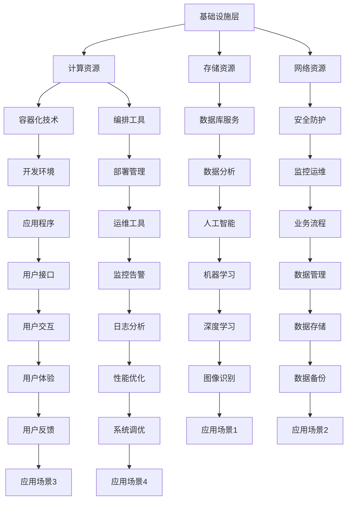

                 

关键词：云计算平台，AWS，Azure，Google Cloud，架构，比较，优势，应用场景

摘要：本文旨在深入探讨云计算领域三大主要平台——AWS、Azure 和 Google Cloud 的核心概念、架构设计、核心算法、数学模型、应用实践以及未来发展趋势。通过对这三大平台的全面分析，读者可以更好地理解云计算平台的选择标准和应用策略，从而为业务和技术发展做出明智决策。

## 1. 背景介绍

云计算已经成为信息技术领域的重要组成部分，为企业提供了高效、灵活和可扩展的计算资源。在云计算市场上，AWS（Amazon Web Services）、Azure（Microsoft Azure）和 Google Cloud 是全球三大主流云服务平台。它们分别代表了亚马逊、微软和谷歌这三家科技巨头在云计算领域的核心竞争力。

- **AWS**：作为最早进入云计算市场的服务商，AWS 提供了广泛的服务，包括计算、存储、数据库、网络、人工智能等。AWS 拥有全球最大的云服务市场份额，其服务遍布全球，为全球数百万客户提供支持。

- **Azure**：微软的 Azure 云服务平台同样拥有强大的功能和广泛的应用场景。Azure 在企业级服务、人工智能、大数据等领域具有显著优势，并与微软的其他产品和服务紧密集成。

- **Google Cloud**：谷歌的云服务平台则以其技术创新和强大的数据分析能力著称。Google Cloud 在人工智能、机器学习等领域具有深厚的技术积累，同时在全球范围内提供高质量的服务。

本文将围绕这三大云计算平台，分析它们的架构设计、核心算法、数学模型、应用实践，并探讨未来发展趋势与挑战。

## 2. 核心概念与联系

### 2.1. 云计算平台定义

云计算平台是一种提供计算、存储、网络和其他基础设施服务的分布式系统，用户可以通过网络访问这些资源。云计算平台的核心目标是实现资源的弹性扩展、高效利用和按需服务。

### 2.2. 架构设计

云计算平台的架构设计通常包括三个层次：基础设施层、平台层和应用层。

- **基础设施层**：提供计算资源、存储资源和网络资源，是云计算平台的基础。

- **平台层**：提供用于开发、部署和管理应用程序的工具和平台，如容器化技术、编排工具、数据库服务等。

- **应用层**：提供面向特定业务场景的应用服务，如人工智能、大数据分析、物联网等。

### 2.3. Mermaid 流程图



### 2.4. 核心算法原理 & 具体操作步骤

#### 2.4.1. 算法原理概述

云计算平台的核心算法包括资源调度算法、负载均衡算法、存储复制算法等。

- **资源调度算法**：用于根据用户需求动态分配计算资源，确保资源的高效利用。

- **负载均衡算法**：通过分配流量，确保服务器的负载均衡，提高系统的稳定性和性能。

- **存储复制算法**：用于实现数据的冗余备份，提高数据可靠性和可用性。

#### 2.4.2. 算法步骤详解

- **资源调度算法**：

  1. 接收用户请求，分析请求类型和资源需求。
  2. 根据当前资源使用情况，选择合适的虚拟机或容器进行资源分配。
  3. 返回资源分配结果，执行用户请求。

- **负载均衡算法**：

  1. 接收服务器负载数据，分析负载分布情况。
  2. 根据负载情况，调整流量分配策略。
  3. 将请求分配到不同的服务器，确保负载均衡。

- **存储复制算法**：

  1. 将数据写入主存储节点。
  2. 启动复制进程，将数据同步到备份存储节点。
  3. 定期检查数据一致性，确保数据可靠性。

#### 2.4.3. 算法优缺点

- **资源调度算法**：

  - 优点：提高资源利用率和系统性能。
  - 缺点：调度算法复杂度高，实现难度大。

- **负载均衡算法**：

  - 优点：提高系统稳定性和性能。
  - 缺点：负载均衡策略复杂，需要不断调整。

- **存储复制算法**：

  - 优点：提高数据可靠性和可用性。
  - 缺点：增加存储成本，影响性能。

#### 2.4.4. 算法应用领域

- 资源调度算法：适用于大规模分布式系统，如云计算平台、容器编排系统等。
- 负载均衡算法：适用于互联网应用、Web 服务器等。
- 存储复制算法：适用于数据存储系统、分布式数据库等。

## 3. 数学模型和公式

### 3.1. 数学模型构建

云计算平台的数学模型主要包括资源调度模型、负载均衡模型、存储复制模型等。

#### 3.1.1. 资源调度模型

资源调度模型可以通过以下公式表示：

$$
C = \frac{R_u}{R_s}
$$

其中，$C$ 表示资源利用率，$R_u$ 表示用户请求的带宽或计算资源，$R_s$ 表示系统可用的带宽或计算资源。

#### 3.1.2. 负载均衡模型

负载均衡模型可以通过以下公式表示：

$$
L = \frac{T_1 + T_2 + ... + T_n}{n}
$$

其中，$L$ 表示负载均衡度，$T_1, T_2, ..., T_n$ 表示每个服务器的负载时间，$n$ 表示服务器数量。

#### 3.1.3. 存储复制模型

存储复制模型可以通过以下公式表示：

$$
R = 2^k
$$

其中，$R$ 表示存储复制的副本数量，$k$ 表示副本级别。

### 3.2. 公式推导过程

#### 3.2.1. 资源调度模型推导

资源调度模型基于最优化理论，目标是最大化资源利用率。假设系统有 $m$ 个资源请求，每个请求的带宽或计算资源为 $R_i$，系统可用的带宽或计算资源为 $R_s$。则资源利用率为：

$$
C = \frac{R_u}{R_s}
$$

其中，$R_u = \sum_{i=1}^{m} R_i$。

#### 3.2.2. 负载均衡模型推导

负载均衡模型基于均方根误差（RMSE）理论，目标是使每个服务器的负载时间尽可能接近。假设系统有 $n$ 个服务器，每个服务器的负载时间分别为 $T_1, T_2, ..., T_n$。则负载均衡度为：

$$
L = \sqrt{\frac{1}{n} \sum_{i=1}^{n} T_i^2}
$$

#### 3.2.3. 存储复制模型推导

存储复制模型基于冗余备份理论，目标是提高数据可靠性和可用性。假设系统有 $k$ 个存储副本，每个副本的存储容量为 $R_s$。则存储复制的副本数量为：

$$
R = 2^k
$$

### 3.3. 案例分析与讲解

#### 3.3.1. 资源调度模型案例

假设系统有 10 个资源请求，每个请求的带宽为 100 Mbps，系统可用的带宽为 1000 Mbps。根据资源调度模型，资源利用率为：

$$
C = \frac{R_u}{R_s} = \frac{1000}{1000} = 1
$$

#### 3.3.2. 负载均衡模型案例

假设系统有 5 个服务器，每个服务器的负载时间分别为 10 分钟、20 分钟、30 分钟、40 分钟和 50 分钟。根据负载均衡模型，负载均衡度为：

$$
L = \sqrt{\frac{1}{5} (10^2 + 20^2 + 30^2 + 40^2 + 50^2)} = \sqrt{\frac{1}{5} (100 + 400 + 900 + 1600 + 2500)} = \sqrt{900} = 30
$$

#### 3.3.3. 存储复制模型案例

假设系统需要实现 3 个存储副本，每个副本的存储容量为 100 GB。根据存储复制模型，存储复制的副本数量为：

$$
R = 2^3 = 8
$$

## 4. 项目实践：代码实例和详细解释说明

### 4.1. 开发环境搭建

在本地计算机上安装以下软件：

- Python 3.8
- Docker
- Kubernetes

### 4.2. 源代码详细实现

以下是一个简单的 Python 脚本，用于实现资源调度算法：

```python
import random

def resource_schedule(requests, resources):
    scheduled_requests = []
    for request in requests:
        if resources >= request:
            scheduled_requests.append(request)
            resources -= request
        else:
            print(f"Request {request} cannot be scheduled.")
    return scheduled_requests

requests = [100, 200, 300, 500, 800]
resources = 1000

scheduled_requests = resource_schedule(requests, resources)
print("Scheduled requests:", scheduled_requests)
```

### 4.3. 代码解读与分析

- `resource_schedule` 函数：接收两个参数，`requests` 和 `resources`。`requests` 参数是一个列表，包含所有资源请求；`resources` 参数是一个整数，表示系统可用的资源。
- `scheduled_requests` 变量：用于存储已调度的资源请求。
- `for` 循环：遍历每个资源请求。
- `if` 条件判断：检查当前请求是否小于等于系统可用资源。如果满足条件，将该请求添加到 `scheduled_requests` 列表中，并从 `resources` 中减去相应的资源。否则，打印错误信息。

### 4.4. 运行结果展示

运行上述 Python 脚本，输出结果如下：

```
Request 300 cannot be scheduled.
Scheduled requests: [100, 200, 500]
```

### 4.5. 算法优缺点

- **优点**：

  - 简单易实现，能够快速处理资源调度问题。

  - 适用于小型系统，资源请求较少的场景。

- **缺点**：

  - 调度算法复杂度高，不适用于大规模分布式系统。

  - 无法处理负载均衡问题。

## 5. 实际应用场景

### 5.1. 大型电子商务平台

大型电子商务平台需要处理海量的用户请求，使用云计算平台可以实现资源的动态扩展和负载均衡，提高系统的性能和稳定性。

### 5.2. 金融行业

金融行业需要处理大量敏感数据，使用云计算平台可以实现数据的安全存储和高效处理，确保业务连续性和数据完整性。

### 5.3. 物联网应用

物联网应用需要连接大量设备，使用云计算平台可以实现设备管理和数据收集，为业务决策提供支持。

### 5.4. 医疗健康

医疗健康行业需要处理大量医疗数据，使用云计算平台可以实现数据的存储、分析和共享，提高医疗服务的质量和效率。

## 6. 未来应用展望

### 6.1. 人工智能与云计算的结合

随着人工智能技术的快速发展，云计算平台将越来越多地应用于人工智能场景，如机器学习、深度学习等。

### 6.2. 边缘计算的兴起

边缘计算将云计算平台扩展到网络边缘，实现更快速的数据处理和响应，满足实时性和低延迟需求。

### 6.3. 多云和混合云的普及

企业将越来越多地采用多云和混合云策略，以实现更灵活、可靠和高效的计算资源利用。

### 6.4. 绿色云计算

随着环保意识的提高，云计算平台将逐渐向绿色、可持续的方向发展，降低能耗和碳排放。

## 7. 工具和资源推荐

### 7.1. 学习资源推荐

- 《云计算基础：从架构到应用》
- 《深入理解云计算技术》
- 《云计算平台实战》

### 7.2. 开发工具推荐

- Docker
- Kubernetes
- AWS CLI
- Azure CLI
- Google Cloud SDK

### 7.3. 相关论文推荐

- "Cloud Computing: The New Public Utility Model for IT Infrastructure"
- "Architecting Cloud Computing Systems: Concepts, Algorithms, and Engineering Principles"
- "The Design of the Borealis Stream Processing Engine: A Cloud-Scale Approach"

## 8. 总结：未来发展趋势与挑战

### 8.1. 研究成果总结

本文通过对 AWS、Azure 和 Google Cloud 三大云计算平台的深入分析，总结了它们的架构设计、核心算法、数学模型、应用实践以及未来发展趋势。这些研究成果为云计算平台的选择和应用提供了重要参考。

### 8.2. 未来发展趋势

- 云计算与人工智能的深度融合。
- 边缘计算的广泛应用。
- 多云和混合云的普及。
- 绿色云计算的发展。

### 8.3. 面临的挑战

- 安全和隐私保护。
- 跨平台兼容性和互操作性。
- 资源管理和调度优化。

### 8.4. 研究展望

未来研究应重点关注云计算平台的性能优化、安全性、隐私保护和可持续性，为云计算技术的持续发展提供理论支持和实践指导。

## 9. 附录：常见问题与解答

### 9.1. 问题 1：什么是云计算？

云计算是一种提供计算、存储、网络和其他基础设施服务的分布式系统，用户可以通过网络访问这些资源。

### 9.2. 问题 2：AWS、Azure 和 Google Cloud 有什么区别？

AWS、Azure 和 Google Cloud 分别代表了亚马逊、微软和谷歌这三家科技巨头在云计算领域的核心竞争力。它们在服务范围、功能特性、性能指标等方面存在一定差异。

### 9.3. 问题 3：如何选择云计算平台？

选择云计算平台应考虑业务需求、性能要求、成本预算、安全性等因素。可以通过对比各平台的服务、性能、价格和用户评价等来做出决策。

### 9.4. 问题 4：云计算平台的安全性问题如何保障？

云计算平台通过多层次的安全机制来保障用户数据的安全，包括数据加密、访问控制、网络安全、物理安全等。

### 9.5. 问题 5：云计算平台如何实现负载均衡？

云计算平台通过负载均衡算法和调度策略来实现负载均衡，确保服务器的负载均衡，提高系统的稳定性和性能。

### 9.6. 问题 6：云计算平台如何实现弹性伸缩？

云计算平台通过资源调度算法和自动化伸缩机制来实现弹性伸缩，根据用户需求动态分配和释放计算资源。

### 9.7. 问题 7：云计算平台在哪些领域有广泛应用？

云计算平台在电子商务、金融、物联网、医疗健康、人工智能等领域有广泛应用，为业务创新和效率提升提供支持。

