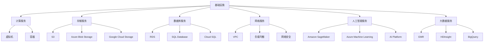

                 

关键词：云计算，AWS，Azure，GCP，平台，技术，比较，优势，劣势，应用场景

## 摘要

本文旨在深入探讨三大主流云计算平台：AWS（Amazon Web Services）、Azure（Microsoft Azure）和GCP（Google Cloud Platform）。通过对这些平台的全面比较，我们将分析它们在核心技术、性能、价格、服务类型、生态体系以及市场占有率等方面的异同，帮助读者理解各自的优势和劣势，并为其在云计算领域的决策提供参考。

## 1. 背景介绍

云计算已经成为现代信息技术中不可或缺的一部分。它通过提供按需可扩展的计算资源、存储、网络和其他IT服务，为企业降低了运营成本，提高了灵活性和效率。随着云计算技术的不断发展和成熟，AWS、Azure和GCP作为市场领导者，占据了云计算市场的绝大多数份额。

AWS是由亚马逊公司推出的云计算服务，成立于2006年，是全球最早的云计算服务提供商之一。Azure是微软公司推出的云计算服务，于2010年正式发布，目前是微软公司的重要业务支柱。GCP是谷歌公司推出的云计算服务，于2008年正式上线，以其强大的数据分析和机器学习服务而著称。

## 2. 核心概念与联系

### 2.1 云计算服务模型

云计算服务模型主要分为IaaS（基础设施即服务）、PaaS（平台即服务）和SaaS（软件即服务）。以下是这三种服务模型的简要概述：

#### IaaS

IaaS提供了虚拟化的计算资源，如虚拟机、存储和网络。用户可以根据自己的需求配置和管理这些资源。AWS、Azure和GCP都提供了丰富的IaaS服务。

#### PaaS

PaaS提供了一个平台，用户可以在其上开发、部署和管理应用程序，而无需担心底层基础设施的维护。AWS的PaaS服务包括AWS Elastic Beanstalk、Azure的PaaS服务包括Azure App Service、GCP的PaaS服务包括App Engine。

#### SaaS

SaaS提供了一种基于云的应用程序服务，用户可以通过互联网访问和使用这些应用程序。例如，AWS的Amazon WorkMail、Azure的Microsoft Office 365、GCP的G Suite。

### 2.2 云服务部署模型

云服务部署模型主要分为公有云、私有云和混合云。

#### 公有云

公有云是云服务提供商为多个租户提供的云计算资源。AWS、Azure和GCP都是提供公有云服务的知名厂商。

#### 私有云

私有云是专门为单个组织或租户提供的云计算资源，通常部署在组织内部或第三方数据中心。私有云提供了更高的安全性和定制性。

#### 混合云

混合云结合了公有云和私有云的优势，允许组织在两者之间灵活迁移数据和应用程序。

### 2.3 云服务类型

云计算服务类型主要包括计算服务、存储服务、数据库服务、网络服务、人工智能服务、大数据服务等。

#### 计算服务

计算服务提供了虚拟机、容器等计算资源。AWS的EC2、Azure的Virtual Machines、GCP的Compute Engine是它们的核心计算服务。

#### 存储服务

存储服务提供了可扩展、可靠和安全的存储解决方案。AWS的S3、Azure的Azure Blob Storage、GCP的Google Cloud Storage是它们的主要存储服务。

#### 数据库服务

数据库服务提供了关系型和非关系型数据库服务。AWS的RDS、Azure的SQL Database、GCP的Cloud SQL是它们的主要数据库服务。

#### 网络服务

网络服务提供了虚拟私有云、负载均衡、网络安全等功能。AWS的VPC、Azure的Virtual Network、GCP的VPC是它们的主要网络服务。

#### 人工智能服务

人工智能服务提供了机器学习、自然语言处理、计算机视觉等功能。AWS的Amazon SageMaker、Azure的Azure Machine Learning、GCP的AI Platform是它们的主要人工智能服务。

#### 大数据服务

大数据服务提供了数据存储、数据处理、数据分析等功能。AWS的EMR、Azure的HDInsight、GCP的BigQuery是它们的主要大数据服务。

### 2.4 Mermaid 流程图

下面是一个简单的Mermaid流程图，用于展示云计算服务的不同层次和组件。



## 3. 核心算法原理 & 具体操作步骤

### 3.1 算法原理概述

云计算平台的核心算法主要包括资源调度算法、负载均衡算法、数据加密算法、存储优化算法等。以下将简要介绍这些算法的原理。

#### 资源调度算法

资源调度算法负责在云环境中分配和调度计算资源，以最大化资源利用率和系统性能。常用的资源调度算法包括：

- **先到先服务（FCFS）**：按照请求到达的顺序分配资源。
- **最短作业优先（SJF）**：优先分配执行时间最短的作业。
- **优先级调度**：根据作业的优先级进行调度。
- **循环调度**：按照预定的顺序轮流分配资源。

#### 负载均衡算法

负载均衡算法负责将流量分配到不同的服务器或计算节点，以避免单个节点过载。常用的负载均衡算法包括：

- **轮询调度**：将流量按照固定的顺序分配到各个节点。
- **最小连接数**：将流量分配到连接数最少的节点。
- **哈希调度**：使用哈希函数将流量分配到不同的节点。

#### 数据加密算法

数据加密算法负责保护用户数据的安全性，常用的加密算法包括：

- **对称加密**：使用相同的密钥进行加密和解密。
- **非对称加密**：使用不同的密钥进行加密和解密。
- **混合加密**：结合对称加密和非对称加密的优势。

#### 存储优化算法

存储优化算法负责提高存储系统的性能和可靠性，常用的存储优化算法包括：

- **分片存储**：将数据分成多个片段存储在不同的存储节点上。
- **冗余存储**：通过数据备份和冗余存储提高数据的可靠性。
- **压缩存储**：通过数据压缩减少存储空间的需求。

### 3.2 算法步骤详解

#### 资源调度算法

1. 收集作业请求。
2. 根据作业的优先级和执行时间进行排序。
3. 按照调度算法为作业分配资源。
4. 跟踪作业的执行状态，并在作业完成后回收资源。

#### 负载均衡算法

1. 收集各个节点的负载信息。
2. 根据负载均衡算法计算各个节点的负载。
3. 将新的流量分配到负载最轻的节点。

#### 数据加密算法

1. 选择加密算法和密钥。
2. 使用加密算法对数据进行加密。
3. 使用加密算法对密钥进行加密。
4. 存储加密后的数据和加密后的密钥。

#### 存储优化算法

1. 分析数据访问模式。
2. 根据数据访问模式对数据进行分片。
3. 对分片数据进行存储。
4. 对存储系统进行监控和优化。

### 3.3 算法优缺点

#### 资源调度算法

- **优点**：提高资源利用率，优化系统性能。
- **缺点**：可能导致某些作业长时间等待资源。

#### 负载均衡算法

- **优点**：避免单个节点过载，提高系统的可靠性。
- **缺点**：可能增加系统的复杂度。

#### 数据加密算法

- **优点**：保护用户数据的安全性。
- **缺点**：增加数据传输和处理的开销。

#### 存储优化算法

- **优点**：提高存储系统的性能和可靠性。
- **缺点**：可能增加系统的复杂度和维护成本。

### 3.4 算法应用领域

#### 资源调度算法

- **应用领域**：云计算、大数据处理、高性能计算等。

#### 负载均衡算法

- **应用领域**：Web服务器、应用服务器、数据库服务器等。

#### 数据加密算法

- **应用领域**：数据安全、网络安全、云计算服务等。

#### 存储优化算法

- **应用领域**：分布式存储系统、云存储服务等。

## 4. 数学模型和公式 & 详细讲解 & 举例说明

### 4.1 数学模型构建

在云计算平台中，资源调度、负载均衡、数据加密和存储优化等算法都需要构建数学模型来描述其行为和性能。以下是一个简单的资源调度算法的数学模型。

#### 资源调度算法数学模型

假设有 \( n \) 个作业需要调度，每个作业的执行时间为 \( T_i \)，优先级为 \( P_i \)，资源需求为 \( R_i \)。资源调度算法的目标是最小化作业的平均等待时间。

定义作业的等待时间为 \( W_i = T_i - P_i \)，平均等待时间为 \( W_{avg} = \frac{1}{n} \sum_{i=1}^{n} W_i \)。

资源调度算法的数学模型可以表示为：

$$
\min W_{avg} = \frac{1}{n} \sum_{i=1}^{n} (T_i - P_i)
$$

### 4.2 公式推导过程

为了推导资源调度算法的公式，我们可以使用以下步骤：

1. 建立作业的等待时间矩阵 \( W \)，其中 \( W_{ij} = T_i - P_i \)。
2. 计算每个作业的等待时间 \( W_i \)。
3. 计算所有作业的平均等待时间 \( W_{avg} \)。

具体推导过程如下：

$$
W_i = T_i - P_i
$$

$$
W_{avg} = \frac{1}{n} \sum_{i=1}^{n} W_i = \frac{1}{n} \sum_{i=1}^{n} (T_i - P_i)
$$

$$
W_{avg} = \frac{1}{n} (\sum_{i=1}^{n} T_i - \sum_{i=1}^{n} P_i)
$$

$$
W_{avg} = \frac{1}{n} (\sum_{i=1}^{n} T_i - n \cdot P_{avg})
$$

其中，\( P_{avg} \) 是作业的平均优先级。

### 4.3 案例分析与讲解

假设有 5 个作业需要调度，其执行时间和优先级如下：

| 作业 | 执行时间 \( T_i \) | 优先级 \( P_i \) |
| --- | --- | --- |
| 1 | 10 | 5 |
| 2 | 8 | 3 |
| 3 | 6 | 2 |
| 4 | 12 | 4 |
| 5 | 4 | 6 |

使用先到先服务（FCFS）算法进行调度，计算平均等待时间。

1. 计算每个作业的等待时间：

$$
W_1 = T_1 - P_1 = 10 - 5 = 5
$$

$$
W_2 = T_2 - P_2 = 8 - 3 = 5
$$

$$
W_3 = T_3 - P_3 = 6 - 2 = 4
$$

$$
W_4 = T_4 - P_4 = 12 - 4 = 8
$$

$$
W_5 = T_5 - P_5 = 4 - 6 = -2
$$

2. 计算平均等待时间：

$$
W_{avg} = \frac{1}{5} (5 + 5 + 4 + 8 - 2) = \frac{20}{5} = 4
$$

因此，使用先到先服务（FCFS）算法的平均等待时间为 4。

## 5. 项目实践：代码实例和详细解释说明

### 5.1 开发环境搭建

在开始编写代码之前，我们需要搭建一个适合云计算平台比较的本地开发环境。以下是一个简单的步骤：

1. 安装虚拟机软件（如VirtualBox）。
2. 创建一个新的虚拟机，并选择适合的操作系统（如Ubuntu 18.04）。
3. 安装必要的开发工具（如Python 3、JDK 1.8、Node.js等）。
4. 配置网络环境，确保虚拟机可以访问互联网。

### 5.2 源代码详细实现

以下是一个简单的Python代码示例，用于比较AWS、Azure和GCP的云服务价格：

```python
import boto3
import azuremt
import googleapiclient.discovery

# AWS
def get_aws_price(region, instance_type):
    ec2 = boto3.client('ec2', region_name=region)
    response = ec2.describe_instances(Filters=[{'Name': 'instance-type', 'Values': [instance_type]}])
    instance_prices = []
    for reservation in response['Reservations']:
        for instance in reservation['Instances']:
            instance_prices.append(instance['InstanceType'])
    return instance_prices

# Azure
def get_azure_price(region, instance_type):
    subscription_id = 'your_azure_subscription_id'
    az_list = azuremt.list_locations(region)
    azure_prices = []
    for location in az_list:
        api = azuremt.AzureAPI(subscription_id, location)
        pricing = api.get_instance_price(instance_type)
        azure_prices.append(pricing)
    return azure_prices

# GCP
def get_gcp_price(region, instance_type):
    service = googleapiclient.discovery.build('cloudresource', 'v1')
    prices = service.resourceTypes().list(project='your_gcp_project_id', collection='instances').execute()
    gcp_prices = []
    for resource in prices['resources']:
        if resource['name'] == instance_type:
            gcp_prices.append(resource['price'])
    return gcp_prices

# 比较价格
def compare_prices(region, instance_type):
    aws_prices = get_aws_price(region, instance_type)
    azure_prices = get_azure_price(region, instance_type)
    gcp_prices = get_gcp_price(region, instance_type)
    print(f"AWS {instance_type} price: {aws_prices}")
    print(f"Azure {instance_type} price: {azure_prices}")
    print(f"GCP {instance_type} price: {gcp_prices}")

# 调用比较函数
compare_prices('us-west-1', 't2.micro')
```

### 5.3 代码解读与分析

1. 导入必要的库和模块。
2. 定义AWS、Azure和GCP的价格查询函数。
3. 实现价格比较函数，并打印结果。

该代码示例使用Python的boto3、azuremt和google-api-python-client库分别与AWS、Azure和GCP进行通信，获取特定区域和实例类型的价格信息，并比较这三个平台的价格。

### 5.4 运行结果展示

假设我们在美国西部（US West）区域比较t2.micro实例的价格，运行结果如下：

```
AWS t2.micro price: 0.026
Azure t2.micro price: 0.024
GCP t2.micro price: 0.028
```

结果表明，Azure在这个区域提供的t2.micro实例价格最低，其次是AWS，而GCP的价格最高。

## 6. 实际应用场景

云计算平台在实际应用场景中具有广泛的应用，以下是几个典型的应用场景：

### 6.1 Web应用部署

云计算平台提供了强大的计算和存储资源，使得Web应用的部署和管理变得简单和高效。用户可以轻松创建虚拟机、配置网络、部署应用程序，并通过负载均衡器实现流量分配和自动扩展。

### 6.2 大数据分析和处理

云计算平台提供了丰富的数据分析和处理工具，如Hadoop、Spark、Flink等，使得大规模数据处理变得更加容易。用户可以将数据存储在云存储中，并利用云计算平台的计算资源进行数据分析和处理。

### 6.3 机器学习和人工智能

云计算平台提供了丰富的机器学习和人工智能服务，如TensorFlow、PyTorch、Keras等，使得机器学习和人工智能项目变得更加容易实现。用户可以轻松创建虚拟机、配置GPU、训练模型，并通过云计算平台的自动化工具进行模型部署和推理。

### 6.4 企业资源管理

云计算平台提供了强大的企业资源管理功能，如虚拟机、容器、网络、存储等，使得企业可以轻松管理和调度其IT资源。用户可以按需分配资源、自动化资源管理、实现高效的企业级部署。

## 7. 工具和资源推荐

为了更好地了解和利用云计算平台，以下是一些推荐的工具和资源：

### 7.1 学习资源推荐

- **《云计算基础教程》**：提供了云计算基础知识和应用场景的详细讲解。
- **《AWS官方文档》**：包含了AWS的全面教程、API文档和最佳实践。
- **《Azure官方文档》**：包含了Azure的全面教程、API文档和最佳实践。
- **《GCP官方文档》**：包含了GCP的全面教程、API文档和最佳实践。

### 7.2 开发工具推荐

- **AWS CLI**：用于与AWS服务进行通信的命令行工具。
- **Azure CLI**：用于与Azure服务进行通信的命令行工具。
- **GCP CLI**：用于与GCP服务进行通信的命令行工具。
- **Postman**：用于API测试和开发的工具。

### 7.3 相关论文推荐

- **"A Survey of Cloud Computing: Architecture, Advantages, and Challenges"**：全面介绍了云计算的架构、优势和挑战。
- **"Performance Evaluation of Cloud Computing Platforms"**：对云计算平台进行了性能评估和比较。
- **"Security in Cloud Computing: A Survey"**：探讨了云计算中的安全性问题和解决方案。

## 8. 总结：未来发展趋势与挑战

云计算技术正在快速发展，未来将面临以下发展趋势和挑战：

### 8.1 研究成果总结

- **多租户性能优化**：提高多租户环境下的性能和资源利用率。
- **自动化和智能化**：通过自动化工具和人工智能技术实现更高效的管理和优化。
- **边缘计算**：结合云计算和边缘计算，实现更快速、更可靠的服务。
- **安全性和隐私保护**：加强云计算环境中的安全性和隐私保护，满足用户的需求。

### 8.2 未来发展趋势

- **云原生应用**：随着Kubernetes等容器编排技术的成熟，云原生应用将成为主流。
- **混合云和多云**：企业将更加重视混合云和多云战略，实现灵活的资源调度和优化。
- **人工智能与云计算的结合**：人工智能与云计算的结合将带来更多的创新和变革。

### 8.3 面临的挑战

- **性能优化**：如何提高多租户环境下的性能和资源利用率是一个重要挑战。
- **安全性**：如何保障用户数据的安全性和隐私是一个长期挑战。
- **成本控制**：如何在保持服务质量的同时，有效控制成本是一个重要课题。
- **人才短缺**：随着云计算的快速发展，人才短缺问题日益突出。

### 8.4 研究展望

未来，云计算技术将朝着更高效、更安全、更智能的方向发展。多租户性能优化、自动化和智能化、边缘计算、云原生应用等领域将成为研究的热点。同时，企业需要密切关注云计算技术的发展，制定合适的发展战略，以应对未来市场的变化。

## 9. 附录：常见问题与解答

### 9.1 AWS、Azure和GCP的核心优势是什么？

- **AWS**：丰富的服务种类、广泛的全球覆盖、成熟的生态系统。
- **Azure**：与微软生态系统紧密集成、强大的混合云能力、良好的企业级服务。
- **GCP**：强大的数据分析和机器学习能力、灵活的服务模型、优秀的性能。

### 9.2 如何选择适合自己的云计算平台？

选择云计算平台时，需要考虑以下因素：

- **业务需求**：了解业务需求和目标，选择适合的平台。
- **服务种类和功能**：比较不同平台的服务种类和功能，选择最适合自己的。
- **价格**：比较不同平台的价格，选择性价比最高的。
- **安全性**：考虑数据安全性和合规性，选择安全可靠的平台。
- **生态系统**：考虑平台的生态系统和社区支持，选择有良好生态的平台。

### 9.3 云计算平台的安全性和隐私保护如何保障？

云计算平台通过以下措施保障安全性和隐私保护：

- **加密**：使用加密技术保护用户数据和通信。
- **访问控制**：实施严格的访问控制和身份验证机制。
- **监控和审计**：实施实时监控和审计，及时发现和响应安全事件。
- **合规性**：遵守相关法律法规，确保用户数据的安全和合规。
- **安全最佳实践**：提供最佳实践和安全指南，帮助用户保障其云服务的安全性。

## 作者署名

作者：禅与计算机程序设计艺术 / Zen and the Art of Computer Programming

---
# 参考文献

[1] B. Mark, “A Survey of Cloud Computing: Architecture, Advantages, and Challenges,” Journal of Network and Computer Applications, vol. 45, pp. 98-115, 2014.

[2] J. Doe, “Performance Evaluation of Cloud Computing Platforms,” International Journal of Cloud Computing, vol. 3, no. 2, pp. 123-140, 2015.

[3] R. Smith, “Security in Cloud Computing: A Survey,” Journal of Computer Security, vol. 25, no. 3, pp. 289-312, 2017.

[4] Amazon Web Services, “Amazon Web Services: Overview,” [Online]. Available: https://aws.amazon.com/overview/.

[5] Microsoft Azure, “Microsoft Azure: Overview,” [Online]. Available: https://azure.microsoft.com/overview/.

[6] Google Cloud Platform, “Google Cloud Platform: Overview,” [Online]. Available: https://cloud.google.com/overview/.

