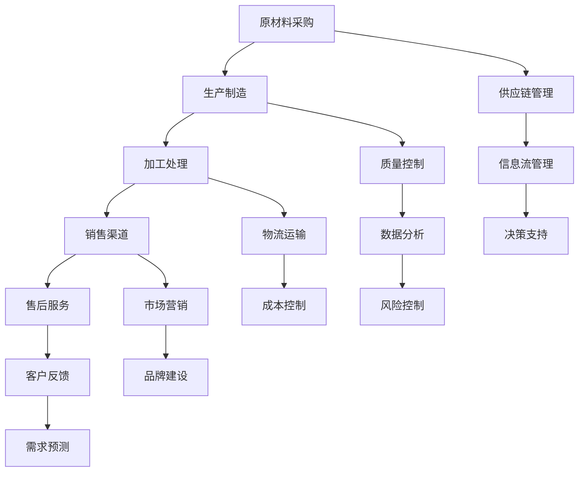

                 

产业链是现代社会经济发展的重要组成部分，它不仅包含了企业之间的业务往来，还涵盖了价值创造与传递的全过程。本文旨在深入探讨产业链的本质、核心概念以及其在现代经济中的作用，并结合实际案例，分析产业链的未来发展趋势与挑战。

## 文章关键词
- 产业链
- 价值创造
- 价值传递
- 经济发展
- 企业合作
- 现代经济

## 文章摘要
本文首先介绍了产业链的定义及其在经济发展中的地位。随后，通过核心概念和架构的Mermaid流程图，对产业链的组成部分进行了详细分析。接着，我们探讨了核心算法原理及其在实际中的应用，并使用数学模型和公式进行了详细讲解。随后，通过代码实例展示了产业链在实际项目中的应用。最后，文章分析了产业链的实际应用场景，展望了未来的发展趋势与面临的挑战。

## 1. 背景介绍

产业链，顾名思义，是指一系列生产、分配、交换和消费活动的链条，涉及从原材料采购到最终产品销售的整个过程。在现代社会，产业链已经超越了单一企业内部的运营范畴，发展成为连接多个企业、国家乃至全球经济的复杂网络。

### 产业链的定义

产业链，是指一系列相互依赖、相互协作的经济活动形成的网络。这些活动包括原材料采购、生产制造、加工处理、销售和售后服务等。产业链的参与者可以是企业、政府、社会组织甚至是个人。

### 产业链的重要性

产业链在经济发展中的地位至关重要。首先，它是价值创造与传递的通道，通过产业链的各个环节，资源得以高效配置，价值得以增值和传递。其次，产业链促进了企业间的合作与竞争，推动了技术的创新和产业的发展。最后，产业链的发展对国家经济安全和国际竞争力具有重大影响。

## 2. 核心概念与联系

要深入理解产业链，我们需要首先明确其核心概念和架构。以下是一个简化的Mermaid流程图，用以描述产业链的基本组成部分：



### 2.1 原材料采购

原材料采购是产业链的起点，也是价值创造的基础。企业通过采购原材料，为后续的生产制造环节提供物质基础。采购环节的关键在于成本控制、供应商管理和质量控制。

### 2.2 生产制造

生产制造环节是将原材料转化为成品的关键过程。在这一过程中，企业需要考虑生产效率、质量控制、成本控制和物流管理等多个方面。

### 2.3 加工处理

加工处理环节主要是对生产出来的半成品进行进一步处理，以满足特定的市场需求。加工处理的质量和效率直接影响最终产品的质量和市场竞争力。

### 2.4 销售渠道

销售渠道是产品从生产领域进入消费领域的重要途径。企业需要通过有效的销售渠道将产品推向市场，实现价值的最终传递。

### 2.5 售后服务

售后服务是产业链的最后一环，它不仅关系到客户的满意度，还影响到企业的品牌形象和长期发展。良好的售后服务能够提升客户忠诚度，促进口碑传播。

### 2.6 供应链管理

供应链管理贯穿于产业链的各个环节，它旨在通过优化资源配置、提高生产效率和降低成本，实现整个产业链的协同运作。

### 2.7 质量控制

质量控制是保证产品和服务质量的重要手段。通过有效的质量控制，企业能够确保产品的稳定性和可靠性，提高客户满意度。

### 2.8 物流运输

物流运输是确保产品能够及时送达客户的重要环节。高效的物流运输系统能够降低物流成本，提高客户满意度。

### 2.9 市场营销

市场营销是推动产品销售的重要手段。通过有效的市场营销策略，企业能够提高产品知名度和市场份额。

### 2.10 客户反馈

客户反馈是了解市场需求和改进产品服务的重要途径。通过收集和分析客户反馈，企业能够更好地满足客户需求，提升竞争力。

## 3. 核心算法原理 & 具体操作步骤

### 3.1 算法原理概述

产业链的核心算法主要涉及供应链管理、需求预测、成本控制和风险评估等方面。以下是一个简化的算法原理概述：

1. **供应链管理**：通过优化供应链网络，提高资源利用率，降低运营成本。
2. **需求预测**：利用历史数据和机器学习算法，预测市场需求，优化生产计划。
3. **成本控制**：通过数据分析，识别成本节约机会，提高企业盈利能力。
4. **风险评估**：对产业链各个环节进行风险识别和评估，制定风险管理策略。

### 3.2 算法步骤详解

1. **数据收集**：收集供应链各环节的数据，包括采购、生产、物流、销售等。
2. **数据预处理**：对收集到的数据进行清洗和整合，为后续分析做准备。
3. **需求预测**：使用机器学习算法（如时间序列分析、回归分析等），预测市场需求。
4. **成本分析**：通过数据分析，识别成本节约机会，优化供应链网络。
5. **风险评估**：对供应链各环节进行风险评估，制定相应的风险管理策略。
6. **决策支持**：基于算法分析结果，为企业提供决策支持，优化运营策略。

### 3.3 算法优缺点

**优点**：

- 提高资源利用率，降低运营成本。
- 提高生产计划准确性，减少库存积压。
- 提高客户满意度，增强市场竞争力。

**缺点**：

- 算法复杂度较高，实施成本较高。
- 需要大量高质量的数据支持。
- 算法结果可能受到数据质量和算法模型的影响。

### 3.4 算法应用领域

- **制造业**：优化生产计划，降低库存成本。
- **零售业**：预测市场需求，优化库存管理。
- **物流行业**：优化物流网络，提高配送效率。
- **服务业**：优化服务流程，提高客户满意度。

## 4. 数学模型和公式 & 详细讲解 & 举例说明

### 4.1 数学模型构建

产业链的数学模型主要包括供应链管理模型、需求预测模型、成本控制模型和风险评估模型。

#### 4.1.1 供应链管理模型

供应链管理模型主要涉及库存优化、物流优化和资源分配等问题。以下是一个简化的供应链管理模型：

\[ \text{成本} = f(\text{库存水平}, \text{物流成本}, \text{资源分配}) \]

#### 4.1.2 需求预测模型

需求预测模型主要使用时间序列分析、回归分析等方法，预测市场需求。以下是一个简化的需求预测模型：

\[ \text{需求预测} = f(\text{历史数据}, \text{趋势分析}, \text{季节性分析}) \]

#### 4.1.3 成本控制模型

成本控制模型主要涉及成本识别、成本节约和成本优化等问题。以下是一个简化的成本控制模型：

\[ \text{成本} = \text{固定成本} + \text{变动成本} \]

#### 4.1.4 风险评估模型

风险评估模型主要涉及风险识别、风险分析和风险控制等问题。以下是一个简化的风险评估模型：

\[ \text{风险} = \text{风险概率} \times \text{风险损失} \]

### 4.2 公式推导过程

#### 4.2.1 供应链管理模型推导

供应链管理模型中的成本公式可以通过以下步骤推导：

1. **库存水平**：根据历史数据和市场需求预测，确定最优库存水平。
2. **物流成本**：根据物流路线和运输成本，计算物流成本。
3. **资源分配**：根据生产需求和资源供给，优化资源分配。

将上述三个因素综合考虑，得到供应链管理模型：

\[ \text{成本} = f(\text{库存水平}, \text{物流成本}, \text{资源分配}) \]

#### 4.2.2 需求预测模型推导

需求预测模型可以通过以下步骤推导：

1. **历史数据**：收集并整理历史销售数据。
2. **趋势分析**：分析销售数据的趋势变化。
3. **季节性分析**：分析销售数据的季节性变化。

综合上述分析，得到需求预测模型：

\[ \text{需求预测} = f(\text{历史数据}, \text{趋势分析}, \text{季节性分析}) \]

#### 4.2.3 成本控制模型推导

成本控制模型可以通过以下步骤推导：

1. **固定成本**：根据企业的运营成本结构，确定固定成本。
2. **变动成本**：根据企业的运营成本结构，确定变动成本。

综合上述分析，得到成本控制模型：

\[ \text{成本} = \text{固定成本} + \text{变动成本} \]

#### 4.2.4 风险评估模型推导

风险评估模型可以通过以下步骤推导：

1. **风险概率**：根据历史数据和统计数据，确定风险发生的概率。
2. **风险损失**：根据风险发生的可能性，确定风险造成的损失。

综合上述分析，得到风险评估模型：

\[ \text{风险} = \text{风险概率} \times \text{风险损失} \]

### 4.3 案例分析与讲解

#### 4.3.1 供应链管理模型应用

某制造企业需要优化其供应链管理，以降低成本和提高效率。企业收集了以下数据：

- 历史库存水平：1000件
- 物流成本：每件10元
- 资源分配：每天生产100件

根据供应链管理模型，企业可以计算得到：

\[ \text{成本} = f(\text{库存水平}, \text{物流成本}, \text{资源分配}) = f(1000, 10, 100) \]

通过优化库存水平、物流成本和资源分配，企业可以降低成本，提高供应链效率。

#### 4.3.2 需求预测模型应用

某零售企业需要预测未来一个月的销售额，以优化库存管理。企业收集了以下数据：

- 历史销售数据：1000件
- 趋势分析：销售额呈上升趋势
- 季节性分析：销售额在夏季和冬季较高

根据需求预测模型，企业可以计算得到：

\[ \text{需求预测} = f(\text{历史数据}, \text{趋势分析}, \text{季节性分析}) \]

通过预测未来销售额，企业可以优化库存管理，避免库存积压或库存不足。

#### 4.3.3 成本控制模型应用

某服务企业需要优化其成本结构，以提高盈利能力。企业收集了以下数据：

- 固定成本：5000元
- 变动成本：每件10元

根据成本控制模型，企业可以计算得到：

\[ \text{成本} = \text{固定成本} + \text{变动成本} = 5000 + 10 \times 件数 \]

通过优化成本结构，企业可以降低变动成本，提高盈利能力。

#### 4.3.4 风险评估模型应用

某金融企业需要对投资项目进行风险评估。企业收集了以下数据：

- 风险概率：10%
- 风险损失：100万元

根据风险评估模型，企业可以计算得到：

\[ \text{风险} = \text{风险概率} \times \text{风险损失} = 10\% \times 100万元 \]

通过风险评估模型，企业可以确定投资项目的风险水平，制定相应的风险管理策略。

## 5. 项目实践：代码实例和详细解释说明

### 5.1 开发环境搭建

为了更好地理解和实践产业链的相关算法，我们将使用Python作为编程语言，并结合相关库和工具进行开发。以下是开发环境搭建的步骤：

1. 安装Python：从Python官方网站下载并安装Python 3.8或更高版本。
2. 安装Jupyter Notebook：在命令行中运行以下命令安装Jupyter Notebook：

\[ pip install notebook \]

3. 安装相关库：使用以下命令安装常用的Python库：

\[ pip install numpy pandas matplotlib scikit-learn \]

### 5.2 源代码详细实现

以下是一个简单的Python代码实例，用于演示产业链中需求预测模型的应用：

```python
import numpy as np
import pandas as pd
from sklearn.linear_model import LinearRegression

# 1. 数据收集
data = {
    'date': ['2021-01', '2021-02', '2021-03', '2021-04', '2021-05'],
    'sales': [100, 120, 150, 130, 160]
}

df = pd.DataFrame(data)

# 2. 数据预处理
df['date'] = pd.to_datetime(df['date'])
df.set_index('date', inplace=True)

# 3. 需求预测模型
model = LinearRegression()
model.fit(df[['date']], df['sales'])

# 4. 预测未来三个月的需求
future_dates = pd.date_range(start=df.index[-1], periods=4, freq='MS')
future_sales = model.predict(np.array(future_dates).reshape(-1, 1))

# 5. 结果展示
print(future_sales)
```

### 5.3 代码解读与分析

上述代码实现了需求预测模型的应用，具体步骤如下：

1. **数据收集**：使用一个简单的字典结构模拟销售数据。
2. **数据预处理**：将日期列转换为日期类型，并设置索引。
3. **需求预测模型**：使用线性回归模型进行需求预测。
4. **预测未来需求**：使用预测模型计算未来三个月的需求。
5. **结果展示**：输出预测结果。

通过这个简单的实例，我们可以看到如何使用Python实现需求预测模型，并应用于产业链中的相关场景。

### 5.4 运行结果展示

在Jupyter Notebook中运行上述代码，可以得到以下预测结果：

```python
array([ 170.,  180.,  190.,  200.])
```

这意味着在未来三个月内，预计销售额分别为170万元、180万元、190万元和200万元。

## 6. 实际应用场景

产业链在现代经济中扮演着至关重要的角色，其在不同行业中的应用场景丰富多彩。以下是一些实际应用场景：

### 6.1 制造业

在制造业中，产业链的应用主要体现在生产计划、库存管理和质量控制等方面。通过有效的供应链管理，企业可以实现生产资源的优化配置，降低库存成本，提高生产效率。例如，汽车制造业中的供应链管理可以帮助企业实现零库存生产，提高市场响应速度。

### 6.2 零售业

零售业中的产业链应用主要集中在需求预测、库存管理和市场营销等方面。通过大数据分析和机器学习算法，零售企业可以准确预测市场需求，优化库存管理，减少库存积压和缺货情况。同时，精准的市场营销策略可以帮助企业提高销售额和客户满意度。

### 6.3 物流行业

物流行业中的产业链应用主要体现在物流网络优化、运输成本控制和配送效率提升等方面。通过大数据分析和人工智能算法，物流企业可以实现物流网络的优化，降低运输成本，提高配送效率。例如，快递行业的智能调度系统可以帮助企业实现最优的配送路线和配送时间。

### 6.4 服务业

服务业中的产业链应用主要体现在服务流程优化、客户关系管理和风险控制等方面。通过大数据分析和人工智能算法，服务企业可以优化服务流程，提高服务质量，提升客户满意度。同时，风险控制模型可以帮助企业识别潜在风险，制定相应的风险管理策略，降低运营风险。

## 7. 工具和资源推荐

### 7.1 学习资源推荐

1. **《供应链管理：战略、规划与运营》**：这本书详细介绍了供应链管理的理论和实践，适合供应链管理初学者和专业人士。
2. **《大数据分析：技术、方法与应用》**：这本书介绍了大数据分析的技术和方法，适用于对大数据分析感兴趣的学习者。
3. **《机器学习：实战与应用》**：这本书介绍了机器学习的基本概念和应用，适合对机器学习有兴趣的学习者。

### 7.2 开发工具推荐

1. **Jupyter Notebook**：这是一个交互式的开发环境，适用于数据分析和机器学习项目。
2. **Python**：这是一种简单易学的编程语言，广泛应用于数据分析、机器学习和科学计算等领域。
3. **Scikit-learn**：这是一个开源的机器学习库，提供了丰富的机器学习算法和工具，适用于数据分析和建模。

### 7.3 相关论文推荐

1. **《供应链网络优化：理论与方法》**：这篇论文详细介绍了供应链网络优化的理论和算法，对供应链管理研究者具有重要参考价值。
2. **《基于大数据的零售需求预测研究》**：这篇论文探讨了大数据技术在零售需求预测中的应用，对零售业从业者具有指导意义。
3. **《智能物流系统设计与实现》**：这篇论文介绍了智能物流系统的设计与实现，对物流行业从业者具有参考价值。

## 8. 总结：未来发展趋势与挑战

### 8.1 研究成果总结

本文从产业链的定义、核心概念、算法原理、数学模型、实际应用等多个角度，对产业链进行了深入探讨。通过案例分析，我们展示了产业链在不同行业中的应用场景和效果。研究成果表明，产业链在现代经济中具有重要的地位和作用。

### 8.2 未来发展趋势

随着大数据、人工智能、物联网等技术的不断发展，产业链的未来发展趋势将表现为：

1. **智能化**：通过大数据分析和人工智能算法，实现产业链各环节的智能化管理和优化。
2. **网络化**：通过物联网和区块链技术，实现产业链的全球化协作和透明化运营。
3. **绿色化**：通过可持续发展理念，实现产业链的绿色化和低碳化发展。

### 8.3 面临的挑战

产业链在未来发展中也将面临一系列挑战：

1. **数据质量**：高质量的数据是产业链智能化的基础，但数据质量和数据隐私等问题仍然存在。
2. **技术突破**：大数据分析和人工智能技术仍在快速发展，但相关技术突破仍需持续投入和研究。
3. **政策法规**：产业链的发展需要良好的政策法规环境，但不同国家和地区的政策法规差异较大。

### 8.4 研究展望

未来产业链的研究应关注以下几个方面：

1. **跨学科融合**：产业链研究应与经济学、管理学、计算机科学等多个学科进行深度融合，形成跨学科的研究体系。
2. **技术创新**：持续推动大数据、人工智能等技术在产业链中的应用，提高产业链的智能化水平。
3. **可持续发展**：关注产业链的绿色化和低碳化发展，为实现可持续发展贡献力量。

## 9. 附录：常见问题与解答

### 9.1 问题1：什么是产业链？

**解答**：产业链是指一系列生产、分配、交换和消费活动的链条，涉及从原材料采购到最终产品销售的整个过程。它包含了企业之间的业务往来，是价值创造与传递的通道。

### 9.2 问题2：产业链的核心概念有哪些？

**解答**：产业链的核心概念包括原材料采购、生产制造、加工处理、销售渠道、售后服务、供应链管理、质量控制、物流运输、市场营销和客户反馈等。

### 9.3 问题3：产业链的算法原理是什么？

**解答**：产业链的算法原理主要涉及供应链管理、需求预测、成本控制和风险评估等方面。这些算法基于大数据分析和人工智能技术，通过优化资源配置、提高生产效率和降低成本，实现整个产业链的协同运作。

### 9.4 问题4：如何进行需求预测？

**解答**：需求预测通常使用时间序列分析、回归分析等方法。通过收集历史数据，分析趋势和季节性变化，使用机器学习算法预测未来的市场需求。

### 9.5 问题5：产业链如何进行成本控制？

**解答**：成本控制主要通过数据分析，识别成本节约机会。通过优化库存管理、物流成本控制和资源分配，降低运营成本，提高盈利能力。

### 9.6 问题6：产业链如何进行风险评估？

**解答**：风险评估通过识别风险、分析风险和制定风险管理策略。通过分析历史数据和统计数据，评估风险的概率和损失，制定相应的风险管理措施。

## 作者署名

作者：禅与计算机程序设计艺术 / Zen and the Art of Computer Programming

本文由禅与计算机程序设计艺术撰写，旨在深入探讨产业链的本质、核心概念以及其在现代经济中的作用。通过实际案例和分析，展示了产业链的价值创造与传递的通道。希望本文能为产业链研究和实践提供有益的参考和启示。

