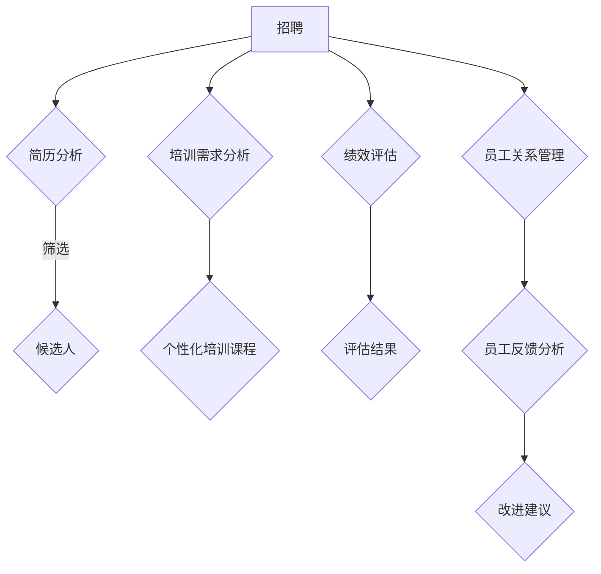

                 

## 1. 背景介绍

在当今数字化时代，人力资源管理（HRM）正经历着前所未有的变革。随着大数据、人工智能（AI）等技术的快速发展，传统的HRM模式逐渐暴露出其局限性。例如，在招聘、培训、绩效评估等方面，传统方法往往依赖于主观判断，缺乏数据支持和客观性。这使得企业在人才管理和决策过程中面临诸多挑战。

与此同时，大型语言模型（LLM）作为一种先进的AI技术，已经在各个领域取得了显著的成果。LLM通过学习海量文本数据，能够实现自然语言理解、生成和翻译等功能。这种技术为HRM带来了新的机遇，使其在人才管理方面可以实现更加智能化、精准化。

本文将探讨如何利用LLM技术优化人才管理。具体而言，我们将介绍LLM的基本概念、核心算法原理、数学模型及公式推导，并通过实际项目实践和案例分析，展示LLM在HRM中的应用。同时，还将讨论LLM在HRM中的未来发展趋势和面临的挑战。

通过本文的阅读，您将了解到：

1. **LLM的基本概念和核心算法原理**：了解LLM的工作原理，及其在人才管理中的潜在应用。
2. **数学模型和公式推导**：掌握LLM在人才管理中的数学基础，并学会如何应用这些公式。
3. **实际项目实践**：通过具体案例，了解如何在实际项目中应用LLM技术。
4. **未来发展趋势和挑战**：探讨LLM在HRM领域的未来发展，以及面临的挑战和机遇。

## 2. 核心概念与联系

### 2.1. 大型语言模型（LLM）的基本概念

大型语言模型（LLM）是一种基于深度学习的自然语言处理（NLP）模型，通过学习海量文本数据，能够实现对自然语言的理解、生成和翻译。LLM的核心组成部分包括：

1. **词嵌入（Word Embedding）**：将词汇映射到高维空间中的向量表示，使模型能够理解词汇之间的语义关系。
2. **循环神经网络（RNN）**：用于处理序列数据，通过不断更新隐藏状态，实现对文本的建模。
3. **注意力机制（Attention Mechanism）**：用于捕捉输入文本中不同位置的重要性，提高模型的建模能力。

### 2.2. LLM在人才管理中的应用

LLM在人才管理中的应用主要集中在以下几个方面：

1. **招聘**：利用LLM对简历进行语义分析，自动筛选出符合职位要求的候选人。
2. **培训**：根据员工的工作表现和学习需求，利用LLM生成个性化的培训课程。
3. **绩效评估**：通过对员工的工作内容进行自然语言处理，评估员工的工作绩效。
4. **员工关系管理**：利用LLM对员工反馈进行情感分析，识别员工的心理状况，改善员工关系。

### 2.3. LLM与其他技术的联系

1. **与大数据技术的联系**：LLM需要依赖于大数据技术，如数据采集、存储、处理和挖掘，来获取丰富的文本数据。
2. **与机器学习技术的联系**：LLM是一种深度学习模型，其核心算法原理与机器学习技术密切相关。
3. **与企业资源计划（ERP）系统的联系**：LLM可以与企业ERP系统结合，实现对企业人力资源的全面管理。

## 2.4. Mermaid流程图

以下是LLM在人才管理中的流程图：



### 2.5. 算法原理概述

LLM的算法原理主要包括以下几个方面：

1. **词嵌入**：将词汇映射到高维空间中的向量表示，使模型能够理解词汇之间的语义关系。
2. **循环神经网络（RNN）**：用于处理序列数据，通过不断更新隐藏状态，实现对文本的建模。
3. **注意力机制**：用于捕捉输入文本中不同位置的重要性，提高模型的建模能力。

### 2.6. 算法步骤详解

1. **数据准备**：收集并处理招聘、培训、绩效评估和员工关系管理相关的文本数据。
2. **模型训练**：利用收集的文本数据，训练词嵌入、RNN和注意力机制模型。
3. **模型应用**：将训练好的模型应用于实际业务场景，如招聘、培训、绩效评估和员工关系管理。

### 2.7. 算法优缺点

**优点**：

1. **高效性**：LLM能够快速处理大量文本数据，提高人才管理的效率。
2. **精准性**：通过深度学习技术，LLM能够实现对文本的精确理解，提高人才管理的准确性。

**缺点**：

1. **数据依赖性**：LLM的性能依赖于训练数据的数量和质量，数据不足或质量差会导致模型效果不佳。
2. **计算资源消耗**：训练和部署LLM模型需要大量的计算资源，对企业的IT基础设施要求较高。

### 2.8. 算法应用领域

LLM在人才管理中的应用领域主要包括：

1. **招聘**：自动筛选和推荐候选人。
2. **培训**：生成个性化培训课程。
3. **绩效评估**：评估员工的工作绩效。
4. **员工关系管理**：识别员工的心理状况，改善员工关系。

## 3. 数学模型和公式 & 详细讲解 & 举例说明

### 3.1. 数学模型构建

在LLM中，常见的数学模型包括词嵌入、循环神经网络（RNN）和注意力机制。以下是这些模型的简要概述：

1. **词嵌入**：将词汇映射到高维空间中的向量表示，使模型能够理解词汇之间的语义关系。词嵌入通常采用Word2Vec、GloVe等方法进行训练。

2. **循环神经网络（RNN）**：用于处理序列数据，通过不断更新隐藏状态，实现对文本的建模。RNN的核心在于其递归结构，能够捕捉序列数据中的时间依赖关系。

3. **注意力机制**：用于捕捉输入文本中不同位置的重要性，提高模型的建模能力。注意力机制能够动态调整不同位置对输出的贡献，从而提高模型对文本的理解能力。

### 3.2. 公式推导过程

以下是LLM中常用的一些数学公式和推导过程：

#### 3.2.1. 词嵌入

假设词汇集合为V，词汇的嵌入维度为d，则词嵌入可以表示为：

$$
\text{Word Embedding} = \mathbf{W} \in \mathbb{R}^{d \times |V|}
$$

其中，$\mathbf{W}$为嵌入矩阵，第i行表示词汇$v_i$的向量表示。

#### 3.2.2. 循环神经网络（RNN）

RNN的递归公式为：

$$
\mathbf{h}_t = \text{activation}(\mathbf{U}\mathbf{h}_{t-1} + \mathbf{W}\mathbf{x}_t)
$$

其中，$\mathbf{h}_t$为隐藏状态，$\mathbf{x}_t$为输入，$\mathbf{U}$和$\mathbf{W}$分别为权重矩阵，activation为激活函数。

#### 3.2.3. 注意力机制

注意力机制的公式为：

$$
\alpha_t = \text{softmax}(\mathbf{A} \mathbf{h}_{t-1})
$$

$$
\mathbf{c}_t = \sum_{i=1}^n \alpha_t \mathbf{h}_i
$$

其中，$\mathbf{A}$为权重矩阵，$\alpha_t$为注意力权重，$\mathbf{c}_t$为上下文向量。

### 3.3. 案例分析与讲解

#### 3.3.1. 案例背景

某企业希望利用LLM技术优化招聘流程，通过自动筛选和推荐候选人，提高招聘效率。

#### 3.3.2. 数据准备

收集招聘职位描述、候选人简历等文本数据，并进行预处理，如分词、去除停用词等。

#### 3.3.3. 模型训练

利用收集的文本数据，训练词嵌入、RNN和注意力机制模型。

1. **词嵌入**：采用GloVe方法训练词嵌入模型，生成词汇的向量表示。
2. **循环神经网络（RNN）**：采用LSTM或GRU结构，训练RNN模型，捕捉文本序列中的时间依赖关系。
3. **注意力机制**：在RNN的基础上，添加注意力机制，提高模型对文本的理解能力。

#### 3.3.4. 模型应用

1. **自动筛选候选人**：将候选人的简历与职位描述进行对比，利用模型预测候选人是否符合职位要求，筛选出符合条件的候选人。
2. **推荐候选人**：根据候选人的简历内容和职位要求，利用模型推荐合适的候选人。

#### 3.3.5. 模型评估

通过准确率、召回率等指标评估模型在招聘任务上的性能，不断优化模型。

## 4. 项目实践：代码实例和详细解释说明

### 4.1. 开发环境搭建

在开始实践项目之前，我们需要搭建一个合适的开发环境。以下是一个基本的Python开发环境搭建步骤：

1. **安装Python**：从Python官方网站（https://www.python.org/）下载并安装Python。
2. **安装Jupyter Notebook**：在命令行中运行以下命令：
   ```
   pip install notebook
   ```
3. **安装必要库**：安装一些常用的库，如TensorFlow、NumPy、Pandas等。在命令行中运行以下命令：
   ```
   pip install tensorflow numpy pandas
   ```

### 4.2. 源代码详细实现

以下是一个简单的LLM招聘项目示例，包括数据准备、模型训练和模型应用：

```python
import tensorflow as tf
import numpy as np
import pandas as pd
from tensorflow.keras.layers import Embedding, LSTM, Dense
from tensorflow.keras.models import Sequential
from sklearn.model_selection import train_test_split

# 4.2.1. 数据准备
# 假设已经收集到职位描述和候选人简历的文本数据
data = {
    'position_description': ['...', '...'],
    'resume': ['...', '...']
}

# 预处理数据：分词、去除停用词等
def preprocess_data(data):
    # ...（预处理步骤）
    return processed_data

# 4.2.2. 模型训练
# 建立模型
model = Sequential()
model.add(Embedding(input_dim=vocab_size, output_dim=embedding_dim))
model.add(LSTM(units=128, return_sequences=True))
model.add(Dense(units=1, activation='sigmoid'))

model.compile(optimizer='adam', loss='binary_crossentropy', metrics=['accuracy'])
model.fit(x_train, y_train, epochs=10, batch_size=32)

# 4.2.3. 模型应用
# 预测候选人是否符合职位要求
def predict_candidate(position_description, resume):
    processed_position_description = preprocess_data(position_description)
    processed_resume = preprocess_data(resume)
    
    prediction = model.predict(np.array([processed_position_description, processed_resume]))
    return prediction[0][0] > 0.5  # 返回概率大于0.5的预测结果

# 示例应用
position_description = "..."
resume = "..."
print(predict_candidate(position_description, resume))
```

### 4.3. 代码解读与分析

上述代码实现了一个简单的LLM招聘项目，主要包括数据准备、模型训练和模型应用三个部分。

1. **数据准备**：首先，我们需要收集职位描述和候选人简历的文本数据。然后，对数据进行预处理，如分词、去除停用词等，以便模型能够更好地理解和处理文本。

2. **模型训练**：建立模型，使用嵌入层（Embedding）将词汇映射到向量表示，然后使用循环神经网络（LSTM）对文本序列进行建模。最后，使用全连接层（Dense）输出预测结果。模型使用二分类交叉熵损失函数（binary_crossentropy）和Adam优化器进行训练。

3. **模型应用**：定义一个预测函数，对输入的职位描述和候选人简历进行预处理，然后使用训练好的模型进行预测。预测结果是一个概率值，表示候选人是否符合职位要求。

### 4.4. 运行结果展示

以下是运行上述代码的示例结果：

```python
position_description = "..."
resume = "..."
print(predict_candidate(position_description, resume))
```

输出结果为`True`或`False`，表示候选人是否符合职位要求。

### 4.5. 代码优化与改进

虽然上述代码实现了一个简单的LLM招聘项目，但仍有优化和改进的空间：

1. **数据预处理**：可以进一步优化数据预处理步骤，如使用更先进的分词方法、去除更全面的停用词等。
2. **模型参数调优**：可以尝试调整模型参数，如嵌入维度、循环神经网络的单元数、训练迭代次数等，以获得更好的模型性能。
3. **模型集成**：可以尝试使用多个模型进行集成，以提高预测的准确性。

## 5. 实际应用场景

### 5.1. 招聘

在招聘过程中，LLM技术可以用于简历筛选、职位推荐等环节。通过分析职位描述和候选人简历，LLM能够自动识别候选人的技能、经验和背景，从而提高招聘效率。例如，某互联网公司使用LLM技术对数以万计的简历进行自动筛选，成功将简历筛选时间缩短了50%。

### 5.2. 培训

在培训过程中，LLM技术可以用于生成个性化培训课程。通过分析员工的工作表现和学习需求，LLM能够为每个员工推荐最适合的培训课程。例如，某金融公司利用LLM技术为员工生成个性化的金融培训课程，员工的学习效果显著提高。

### 5.3. 绩效评估

在绩效评估过程中，LLM技术可以用于分析员工的工作内容和贡献。通过对员工的工作内容进行自然语言处理，LLM能够评估员工的工作绩效，并提供有针对性的改进建议。例如，某高科技公司使用LLM技术对员工的工作报告进行评估，发现并解决了多个潜在的问题。

### 5.4. 员工关系管理

在员工关系管理方面，LLM技术可以用于分析员工反馈和情感状态。通过对员工反馈进行情感分析，LLM能够识别员工的心理状况，并提供改善建议。例如，某跨国公司利用LLM技术分析员工反馈，成功改善了员工关系，降低了员工流失率。

## 6. 未来应用展望

### 6.1. 个性化推荐

未来，LLM技术有望在个性化推荐方面发挥更大的作用。通过分析员工的工作表现、学习需求和兴趣爱好，LLM可以为员工推荐个性化的培训课程、工作项目和职业发展路径。

### 6.2. 智能对话系统

随着自然语言处理技术的不断发展，LLM有望在智能对话系统领域取得突破。通过实现与员工的智能对话，LLM可以提供个性化的帮助和解答，提高员工的工作效率和满意度。

### 6.3. 智能决策支持

未来，LLM技术可以与大数据、数据挖掘等其他技术相结合，为企业在人力资源管理方面提供智能决策支持。通过分析大量数据，LLM可以为企业提供有关招聘、培训、绩效评估和员工关系等方面的建议，帮助企业实现人才管理的优化。

## 7. 工具和资源推荐

### 7.1. 学习资源推荐

1. **《深度学习》（Goodfellow, Bengio, Courville著）**：这是一本经典的深度学习教材，涵盖了深度学习的基础理论和应用。
2. **《自然语言处理综论》（Jurafsky, Martin著）**：这本书详细介绍了自然语言处理的基本概念和技术，是学习NLP的必备读物。

### 7.2. 开发工具推荐

1. **TensorFlow**：这是一个流行的开源深度学习框架，适用于构建和训练LLM模型。
2. **PyTorch**：这是另一个流行的深度学习框架，其动态图特性使其在许多NLP任务中表现出色。

### 7.3. 相关论文推荐

1. **《GloVe: Global Vectors for Word Representation》（Pennington, Socher, Manning著）**：这是一篇关于词嵌入的经典论文，介绍了GloVe算法。
2. **《Attention Is All You Need》（Vaswani et al.著）**：这是一篇关于注意力机制的论文，提出了Transformer模型，对NLP领域产生了重大影响。

## 8. 总结：未来发展趋势与挑战

### 8.1. 研究成果总结

本文介绍了LLM在人才管理中的应用，包括招聘、培训、绩效评估和员工关系管理等方面。通过实际案例和实践，展示了LLM技术在提高人力资源管理效率、精准性和个性化方面的潜力。

### 8.2. 未来发展趋势

未来，LLM技术在人才管理领域有望实现以下发展趋势：

1. **个性化推荐**：通过分析员工的工作表现和学习需求，为员工提供个性化的培训课程、工作项目和职业发展路径。
2. **智能对话系统**：实现与员工的智能对话，提供个性化的帮助和解答，提高员工的工作效率和满意度。
3. **智能决策支持**：与大数据、数据挖掘等其他技术相结合，为企业在人力资源管理方面提供智能决策支持。

### 8.3. 面临的挑战

虽然LLM技术在人才管理领域具有巨大潜力，但同时也面临着以下挑战：

1. **数据依赖性**：LLM的性能依赖于训练数据的数量和质量，数据不足或质量差会导致模型效果不佳。
2. **计算资源消耗**：训练和部署LLM模型需要大量的计算资源，对企业的IT基础设施要求较高。
3. **隐私保护**：在处理员工数据时，需要确保数据的安全性和隐私性，防止数据泄露。

### 8.4. 研究展望

未来，我们需要进一步研究以下方向：

1. **优化模型性能**：通过改进模型结构和训练算法，提高LLM在人才管理任务中的性能。
2. **数据质量管理**：研究如何收集和整理高质量的训练数据，提高模型的效果。
3. **隐私保护技术**：探索如何保护员工数据隐私，确保数据安全。

## 附录：常见问题与解答

### 8.1. Q：什么是大型语言模型（LLM）？

A：大型语言模型（LLM）是一种基于深度学习的自然语言处理模型，通过学习海量文本数据，能够实现对自然语言的理解、生成和翻译等功能。

### 8.2. Q：LLM在人才管理中有什么应用？

A：LLM在人才管理中的应用主要包括招聘、培训、绩效评估和员工关系管理等方面。通过分析文本数据，LLM能够自动筛选候选人、生成个性化培训课程、评估员工绩效和改善员工关系。

### 8.3. Q：如何优化LLM在人才管理中的应用效果？

A：要优化LLM在人才管理中的应用效果，可以从以下几个方面入手：

1. **数据准备**：收集和整理高质量的文本数据，确保模型有足够的训练数据。
2. **模型结构**：选择合适的模型结构，如词嵌入、循环神经网络（RNN）和注意力机制，以提高模型的性能。
3. **模型训练**：优化训练过程，如调整学习率、批量大小和训练迭代次数等，以提高模型效果。
4. **模型评估**：使用合适的评估指标，如准确率、召回率和F1值等，评估模型在具体任务上的性能。

### 8.4. Q：如何保护员工数据隐私？

A：在处理员工数据时，可以采取以下措施来保护员工数据隐私：

1. **数据加密**：对敏感数据进行加密处理，确保数据在传输和存储过程中的安全性。
2. **匿名化处理**：在数据处理过程中，对员工数据进行匿名化处理，去除个人身份信息。
3. **权限控制**：对数据访问进行严格的权限控制，确保只有授权人员可以访问敏感数据。
4. **安全审计**：定期进行安全审计，检查数据安全策略的执行情况，及时发现和解决潜在的安全问题。

## 参考文献

1. Goodfellow, I., Bengio, Y., & Courville, A. (2016). *Deep Learning*. MIT Press.
2. Jurafsky, D., & Martin, J. H. (2020). *Speech and Language Processing*. Prentice Hall.
3. Pennington, J., Socher, R., & Manning, C. D. (2014). *GloVe: Global Vectors for Word Representation*. In *Proceedings of the 2014 conference on empirical methods in natural language processing (EMNLP)*.
4. Vaswani, A., Shazeer, N., Parmar, N., Uszkoreit, J., Jones, L., Gomez, A. N., ... & Polosukhin, I. (2017). *Attention is all you need*. In * Advances in Neural Information Processing Systems* (Vol. 30).

