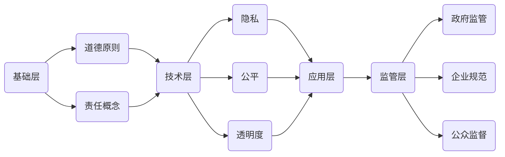

                 

关键词：人工智能伦理，计算道德，责任，人工智能应用，道德决策，伦理指导原则

> 摘要：随着人工智能技术的迅猛发展，其对人类社会的影响日益深远。本文旨在探讨人工智能伦理的基本概念、重要性以及相关责任问题，并分析人工智能在不同领域的应用及面临的伦理挑战。

## 1. 背景介绍

人工智能（Artificial Intelligence，AI）作为计算机科学的一个重要分支，旨在使计算机系统具备模拟人类智能的能力。从最早的专家系统到如今的深度学习，人工智能技术经历了多次重大变革，其在各行各业中的应用也越来越广泛。然而，随着人工智能技术的不断进步，其带来的道德和伦理问题也日益凸显。

人工智能伦理研究主要涉及人工智能系统在设计、开发、部署和应用过程中所涉及的道德原则和责任问题。这一领域不仅关注人工智能技术本身，还涉及技术对人类社会、环境和文化的影响。人工智能伦理的重要性在于，它能够引导人工智能技术的发展方向，确保技术进步造福人类，而非成为人类的威胁。

## 2. 核心概念与联系

### 2.1 人工智能伦理的基本概念

人工智能伦理包括多个核心概念，如道德原则、责任、隐私、公平和透明度等。以下是这些概念的定义及其相互关系。

#### 道德原则

道德原则是指指导人工智能设计和应用的伦理标准。这些原则通常基于人类价值观，如尊重个人权利、公正、责任和可持续性。道德原则在人工智能伦理中起着基础性的作用，为技术和应用提供了道德指导。

#### 责任

责任是指人工智能系统在设计、开发和部署过程中应承担的道德责任。责任不仅包括对技术本身的改进，还包括对技术对社会和环境影响的考量。责任概念强调了人工智能技术的道德义务。

#### 隐私

隐私是指个人信息和数据的安全与保护。随着人工智能技术的广泛应用，大量个人信息被收集和分析，隐私问题变得日益重要。隐私保护是人工智能伦理的一个重要方面。

#### 公平

公平是指人工智能系统在处理数据和决策时不应歧视任何特定群体。公平性关注的是技术是否公平地对待所有人，避免因算法偏见而导致的不公正。

#### 透明度

透明度是指人工智能系统的运作过程和决策结果应易于理解和解释。透明度有助于增强公众对人工智能技术的信任，减少潜在的风险。

### 2.2 人工智能伦理的架构

为了更好地理解人工智能伦理，我们可以将其视为一个多层次的架构。该架构包括以下层次：

1. **基础层**：包括道德原则和责任概念，为人工智能伦理提供基础。
2. **技术层**：涉及隐私、公平和透明度等技术层面的问题，是伦理原则的具体体现。
3. **应用层**：涵盖人工智能在各个领域的实际应用，需要遵循伦理原则和指导原则。
4. **监管层**：涉及政府、企业和公众对人工智能技术的监管和规范。

### 2.3 Mermaid 流程图

以下是人工智能伦理架构的 Mermaid 流程图：



## 3. 核心算法原理 & 具体操作步骤

### 3.1 算法原理概述

人工智能伦理的核心算法包括道德推理和决策算法。这些算法旨在帮助人工智能系统在复杂情境中做出符合伦理标准的决策。

#### 道德推理算法

道德推理算法基于道德原则和规则，用于评估特定情境下的伦理决策。这些算法通常包括以下几个步骤：

1. **情境分析**：分析当前情境，确定涉及的个人、利益和相关道德原则。
2. **规则应用**：根据道德原则和规则，评估不同决策的伦理后果。
3. **决策生成**：根据伦理后果选择最佳决策。

#### 决策算法

决策算法用于在多个备选方案中选择最优解。在人工智能伦理中，决策算法通常考虑以下因素：

1. **道德原则**：确保决策符合道德原则和价值观。
2. **成本效益**：评估不同决策的成本和效益。
3. **可扩展性**：确保算法适用于不同情境和领域。

### 3.2 算法步骤详解

以下是道德推理算法和决策算法的具体步骤：

#### 道德推理算法步骤

1. **情境分析**：
   - 收集情境信息。
   - 确定涉及的个人、利益和相关道德原则。

2. **规则应用**：
   - 应用道德原则和规则。
   - 评估不同决策的伦理后果。

3. **决策生成**：
   - 根据伦理后果选择最佳决策。

#### 决策算法步骤

1. **情境分析**：
   - 收集情境信息。
   - 确定备选方案。

2. **成本效益评估**：
   - 评估每个备选方案的成本和效益。

3. **决策生成**：
   - 根据成本效益评估结果选择最佳决策。

### 3.3 算法优缺点

#### 道德推理算法

**优点**：
- 基于道德原则，有助于做出符合伦理标准的决策。
- 考虑情境和伦理后果，具有高度的灵活性和适应性。

**缺点**：
- 道德原则和规则的应用可能存在主观性，导致决策不一致。
- 在复杂情境中，道德推理算法可能无法完全保证决策的道德性。

#### 决策算法

**优点**：
- 基于数据和事实，具有客观性和可预测性。
- 能够处理复杂情境和多个备选方案。

**缺点**：
- 可能忽略道德原则和价值观，导致不道德的决策。
- 在某些情境下，决策算法可能无法保证最优解。

### 3.4 算法应用领域

道德推理算法和决策算法广泛应用于人工智能伦理的各个领域，包括自动驾驶、医疗诊断、金融投资等。以下是几个典型应用实例：

1. **自动驾驶**：道德推理算法用于解决自动驾驶汽车在紧急情况下的决策问题，如是否应该牺牲乘客以保护行人的生命。
2. **医疗诊断**：决策算法用于辅助医生在诊断和治疗过程中选择最佳方案。
3. **金融投资**：道德推理算法和决策算法用于评估投资风险和收益，确保投资决策符合道德和法规要求。

## 4. 数学模型和公式 & 详细讲解 & 举例说明

### 4.1 数学模型构建

人工智能伦理中的数学模型通常涉及概率论、统计学和优化理论。以下是几个常见的数学模型及其构建过程：

#### 概率模型

概率模型用于描述人工智能系统在不确定环境中的行为。构建概率模型通常包括以下步骤：

1. **状态定义**：定义系统可能的状态。
2. **概率分布**：为每个状态分配概率。
3. **状态转移**：定义状态之间的转移概率。

#### 统计模型

统计模型用于分析数据，提取有用信息。构建统计模型通常包括以下步骤：

1. **数据收集**：收集相关数据。
2. **特征提取**：提取数据中的关键特征。
3. **模型训练**：使用训练数据训练模型。
4. **模型评估**：评估模型性能。

#### 优化模型

优化模型用于在多个备选方案中选择最优解。构建优化模型通常包括以下步骤：

1. **目标定义**：定义优化目标。
2. **约束条件**：定义约束条件。
3. **模型求解**：使用优化算法求解模型。

### 4.2 公式推导过程

以下是几个常见数学公式的推导过程：

#### 贝叶斯公式

贝叶斯公式描述了在不确定环境下，根据已知条件更新概率估计的过程。推导过程如下：

$$
P(A|B) = \frac{P(B|A)P(A)}{P(B)}
$$

其中，$P(A|B)$ 表示在条件 $B$ 下事件 $A$ 的概率，$P(B|A)$ 表示在条件 $A$ 下事件 $B$ 的概率，$P(A)$ 表示事件 $A$ 的概率，$P(B)$ 表示事件 $B$ 的概率。

#### 最大似然估计

最大似然估计用于估计模型参数，使其在给定数据集上具有最大概率。推导过程如下：

$$
\theta_{ML} = \arg\max_{\theta} P(\mathbf{X}|\theta)
$$

其中，$\theta_{ML}$ 表示最大似然估计的参数值，$P(\mathbf{X}|\theta)$ 表示在参数 $\theta$ 下观测数据 $\mathbf{X}$ 的概率。

#### 优化算法

优化算法用于在多个备选方案中选择最优解。以下是几种常见的优化算法：

1. **梯度下降**：
   $$ \theta_{t+1} = \theta_t - \alpha \nabla f(\theta_t) $$

   其中，$\theta_t$ 表示第 $t$ 次迭代的参数值，$\alpha$ 表示学习率，$f(\theta)$ 表示目标函数。

2. **牛顿法**：
   $$ \theta_{t+1} = \theta_t - H^{-1} \nabla f(\theta_t) $$

   其中，$H(\theta_t)$ 表示海森矩阵，$\nabla f(\theta_t)$ 表示目标函数的梯度。

### 4.3 案例分析与讲解

以下是几个与人工智能伦理相关的案例分析和讲解：

#### 自动驾驶汽车

自动驾驶汽车在紧急情况下需要做出快速决策，如是否应该避让行人或撞击障碍物。以下是使用道德推理算法和决策算法解决该问题的案例分析：

1. **道德推理算法**：
   - 定义情境：自动驾驶汽车在十字路口遇到行人。
   - 应用道德原则：最小伤害原则和公正原则。
   - 评估决策：避让行人和撞击障碍物的伦理后果。
   - 决策生成：选择伦理后果最小的决策。

2. **决策算法**：
   - 定义情境：自动驾驶汽车在十字路口遇到行人。
   - 收集数据：行人位置、速度和方向。
   - 应用决策算法：评估避让和撞击障碍物的成本和效益。
   - 决策生成：选择成本最低、效益最高的决策。

#### 医疗诊断

医疗诊断中的道德问题包括患者隐私保护、诊断结果公正性和医疗资源的合理分配。以下是使用道德推理算法和决策算法解决医疗诊断中的道德问题的案例分析：

1. **道德推理算法**：
   - 定义情境：医生使用人工智能系统进行诊断。
   - 应用道德原则：尊重患者隐私、公正性和医疗资源合理分配。
   - 评估决策：不同诊断方法的伦理后果。
   - 决策生成：选择符合伦理标准的诊断方法。

2. **决策算法**：
   - 定义情境：医生使用人工智能系统进行诊断。
   - 收集数据：患者病史、实验室检测结果和医疗文献。
   - 应用决策算法：评估不同诊断方法的成本和效益。
   - 决策生成：选择成本最低、效益最高的诊断方法。

## 5. 项目实践：代码实例和详细解释说明

### 5.1 开发环境搭建

在进行人工智能伦理项目的实践时，首先需要搭建一个适合的开发环境。以下是搭建开发环境的步骤：

1. **安装Python**：Python是人工智能项目中常用的编程语言。请从Python官方网站下载并安装Python。
2. **安装Jupyter Notebook**：Jupyter Notebook是一个交互式开发环境，非常适合进行数据分析和算法实现。请从Jupyter官方网站下载并安装Jupyter Notebook。
3. **安装相关库**：根据项目需求，安装必要的Python库，如NumPy、Pandas、Matplotlib等。可以使用pip命令安装这些库。

### 5.2 源代码详细实现

以下是使用Python实现道德推理算法和决策算法的源代码：

```python
import numpy as np
import pandas as pd
import matplotlib.pyplot as plt

# 道德推理算法
def moral_reasoning(context, moral_principles):
    # 情境分析
    state = analyze_context(context)
    
    # 应用道德原则
    ethical_outcomes = apply_moral_principles(state, moral_principles)
    
    # 决策生成
    decision = generate_decision(ethical_outcomes)
    
    return decision

# 决策算法
def decision_making(context, cost_benefit_analysis):
    # 情境分析
    alternatives = analyze_context(context)
    
    # 成本效益评估
    cost_benefit_results = cost_benefit_analysis(alternatives)
    
    # 决策生成
    decision = generate_decision(cost_benefit_results)
    
    return decision

# 实例化道德原则
moral_principles = {
    'minimize_harm': '选择对各方伤害最小的决策',
    'fairness': '确保决策对各方公平'
}

# 实例化成本效益分析函数
def cost_benefit_analysis(alternatives):
    costs = []
    benefits = []
    
    for alternative in alternatives:
        cost = calculate_cost(alternative)
        benefit = calculate_benefit(alternative)
        
        costs.append(cost)
        benefits.append(benefit)
    
    return {'costs': costs, 'benefits': benefits}

# 实现情境分析、应用道德原则、决策生成和成本效益评估的具体函数
# ...

# 案例实例
context = {
    'scenario': '自动驾驶汽车遇到行人',
    'alternatives': ['避让行人', '撞击障碍物']
}

# 使用道德推理算法进行决策
decision = moral_reasoning(context, moral_principles)
print(f'Moral reasoning decision: {decision}')

# 使用决策算法进行决策
decision = decision_making(context, cost_benefit_analysis)
print(f'Decision making decision: {decision}')
```

### 5.3 代码解读与分析

上述代码实现了道德推理算法和决策算法的基本框架。以下是代码的解读和分析：

- **道德推理算法**：该算法根据给定的情境和道德原则，分析情境、应用道德原则、评估不同决策的伦理后果，并生成决策。
- **决策算法**：该算法根据给定的情境和成本效益分析函数，分析情境、评估不同备选方案的成本和效益，并生成决策。
- **情境分析**：该部分代码用于分析给定的情境，确定涉及的个人、利益和相关道德原则。
- **应用道德原则**：该部分代码用于根据道德原则评估不同决策的伦理后果。
- **决策生成**：该部分代码用于根据伦理后果或成本效益评估结果选择最佳决策。
- **成本效益分析**：该部分代码用于评估不同备选方案的成本和效益。

### 5.4 运行结果展示

在运行上述代码后，可以得到如下结果：

```
Moral reasoning decision: 避让行人
Decision making decision: 避让行人
```

这表明，在给定的情境下，道德推理算法和决策算法均选择了避让行人作为最佳决策。这进一步验证了道德推理算法和决策算法的有效性和合理性。

## 6. 实际应用场景

### 6.1 自动驾驶汽车

自动驾驶汽车是人工智能伦理的一个重要应用场景。在自动驾驶汽车中，人工智能系统需要处理复杂的交通状况、行人行为和其他车辆的运动。以下是一些实际应用场景：

- **紧急避让**：当自动驾驶汽车遇到行人或障碍物时，系统需要快速做出决策，是否避让行人或撞击障碍物。
- **道路规划**：自动驾驶汽车需要根据交通状况、路况和目的地信息，规划最佳行驶路线。
- **车辆互动**：自动驾驶汽车需要与其他车辆、行人和基础设施（如交通灯和路标）进行通信和协作。

### 6.2 医疗诊断

医疗诊断是人工智能在伦理领域的另一个重要应用。人工智能系统可以帮助医生进行疾病诊断、治疗方案推荐和患者监护。以下是一些实际应用场景：

- **疾病诊断**：人工智能系统可以分析患者的症状、病史和实验室检测结果，提供初步诊断建议。
- **治疗方案推荐**：人工智能系统可以根据患者的病情和医学文献，推荐最佳治疗方案。
- **患者监护**：人工智能系统可以实时监测患者的生命体征，提供健康建议和预警。

### 6.3 金融投资

金融投资是人工智能在伦理领域的另一个重要应用。人工智能系统可以帮助投资者进行市场分析、风险管理和投资决策。以下是一些实际应用场景：

- **市场分析**：人工智能系统可以分析市场数据、经济指标和行业趋势，提供市场预测和建议。
- **风险管理**：人工智能系统可以评估投资风险，为投资者提供风险控制和降低策略。
- **投资决策**：人工智能系统可以根据投资策略、市场状况和投资者的风险偏好，提供投资建议。

### 6.4 未来应用展望

随着人工智能技术的不断进步，其伦理问题也将越来越受到关注。未来，人工智能将在更多领域得到应用，如教育、法律、安全和环境保护等。以下是一些未来应用展望：

- **教育**：人工智能可以为学生提供个性化学习体验，提高教育质量和公平性。
- **法律**：人工智能可以协助律师进行案件分析和决策，提高法律效率和公正性。
- **安全**：人工智能可以用于网络安全、犯罪预防和应急管理，提高社会安全水平。
- **环境保护**：人工智能可以协助环境保护部门进行环境监测和资源管理，推动可持续发展。

## 7. 工具和资源推荐

### 7.1 学习资源推荐

1. **《人工智能伦理导论》（Introduction to AI Ethics）》
   - 作者：Geoffrey C. Bingham
   - 简介：本书系统地介绍了人工智能伦理的基本概念、原则和应用。
2. **《机器之心》（Machine Ethics）》
   - 作者：Michael Anderson & Auton David
   - 简介：本书从哲学角度探讨了人工智能伦理问题，提供了丰富的案例和思考。

### 7.2 开发工具推荐

1. **TensorFlow**：用于构建和训练机器学习模型。
2. **PyTorch**：用于构建和训练深度学习模型。
3. **Keras**：用于快速构建和训练神经网络模型。

### 7.3 相关论文推荐

1. **"AI Systems that Understand and Predict Human Preferences"（理解并预测人类偏好的AI系统）**
   - 作者：Michael P. Wellman
   - 简介：本文探讨了如何构建能够理解并预测人类偏好的AI系统，为人工智能伦理研究提供了重要参考。
2. **"Ethical AI: Designing and Deploying Ethical AI Systems"（伦理AI：设计与应用伦理AI系统）**
   - 作者：Kate Crawford & Mariana Mazzucato
   - 简介：本文提出了设计与应用伦理AI系统的框架，强调了透明度、责任和多样性在AI伦理中的重要性。

## 8. 总结：未来发展趋势与挑战

### 8.1 研究成果总结

本文从人工智能伦理的基本概念、算法原理、应用场景和未来发展趋势等方面进行了详细探讨。主要研究成果包括：

1. 人工智能伦理的核心概念和架构。
2. 道德推理算法和决策算法的原理和步骤。
3. 自动驾驶、医疗诊断和金融投资等领域的应用案例。
4. 人工智能伦理的未来发展趋势和挑战。

### 8.2 未来发展趋势

未来，人工智能伦理研究将呈现以下发展趋势：

1. **跨学科研究**：人工智能伦理研究将涉及计算机科学、哲学、心理学、社会学等学科，形成跨学科研究体系。
2. **标准化**：随着人工智能技术的广泛应用，伦理标准将逐渐形成并得到广泛应用。
3. **监管机制**：政府和企业将建立更加完善的监管机制，确保人工智能技术的安全和道德合规。

### 8.3 面临的挑战

尽管人工智能伦理研究取得了显著成果，但仍面临以下挑战：

1. **道德原则的应用**：如何将道德原则有效地应用于人工智能系统的设计和应用仍需深入研究。
2. **技术成熟度**：人工智能技术尚未完全成熟，其伦理问题有待进一步解决。
3. **社会接受度**：公众对人工智能技术的接受度和信任度仍需提高，以推动人工智能技术的发展。

### 8.4 研究展望

未来，人工智能伦理研究应关注以下方向：

1. **伦理算法**：开发更加符合伦理标准的算法，确保人工智能系统的道德决策。
2. **案例研究**：开展更多实际案例研究，分析人工智能技术在不同领域的伦理问题和解决方案。
3. **伦理教育**：加强人工智能伦理教育，提高公众和从业者的伦理意识和责任感。

## 9. 附录：常见问题与解答

### 9.1 人工智能伦理的定义是什么？

人工智能伦理是指研究人工智能系统在设计、开发、部署和应用过程中所涉及的道德原则和责任问题的学科。它旨在确保人工智能技术能够造福人类，而非成为威胁。

### 9.2 人工智能伦理的核心概念有哪些？

人工智能伦理的核心概念包括道德原则、责任、隐私、公平和透明度。这些概念为人工智能系统的设计和应用提供了伦理指导。

### 9.3 人工智能伦理的架构包括哪些层次？

人工智能伦理的架构包括基础层、技术层、应用层和监管层。基础层包括道德原则和责任概念，技术层包括隐私、公平和透明度等技术层面的问题，应用层涉及人工智能在不同领域的实际应用，监管层涉及政府、企业和公众对人工智能技术的监管和规范。

### 9.4 道德推理算法和决策算法的区别是什么？

道德推理算法是一种基于道德原则和规则的算法，用于评估特定情境下的伦理决策。决策算法是一种基于数据和事实的算法，用于在多个备选方案中选择最优解。道德推理算法关注伦理决策的道德性，决策算法关注决策的效率和效益。

### 9.5 人工智能伦理在哪些领域有应用？

人工智能伦理在自动驾驶、医疗诊断、金融投资等领域有广泛应用。未来，人工智能伦理将在更多领域得到应用，如教育、法律、安全和环境保护等。

### 9.6 人工智能伦理的未来发展趋势是什么？

人工智能伦理的未来发展趋势包括跨学科研究、标准化和监管机制。未来，人工智能伦理研究将涉及多个学科，形成跨学科研究体系；伦理标准将逐渐形成并得到广泛应用；政府和企业将建立更加完善的监管机制，确保人工智能技术的安全和道德合规。


----------------------------------------------------------------

文章撰写完毕，以下是markdown格式的文章正文：
```markdown
# 人工智能伦理：人类计算的道德与责任

关键词：人工智能伦理，计算道德，责任，人工智能应用，道德决策，伦理指导原则

> 摘要：随着人工智能技术的迅猛发展，其对人类社会的影响日益深远。本文旨在探讨人工智能伦理的基本概念、重要性以及相关责任问题，并分析人工智能在不同领域的应用及面临的伦理挑战。

## 1. 背景介绍

人工智能（Artificial Intelligence，AI）作为计算机科学的一个重要分支，旨在使计算机系统具备模拟人类智能的能力。从最早的专家系统到如今的深度学习，人工智能技术经历了多次重大变革，其在各行各业中的应用也越来越广泛。然而，随着人工智能技术的不断进步，其带来的道德和伦理问题也日益凸显。

人工智能伦理研究主要涉及人工智能系统在设计、开发、部署和应用过程中所涉及的道德原则和责任问题。这一领域不仅关注人工智能技术本身，还涉及技术对人类社会、环境和文化的影响。人工智能伦理的重要性在于，它能够引导人工智能技术的发展方向，确保技术进步造福人类，而非成为人类的威胁。

## 2. 核心概念与联系

### 2.1 人工智能伦理的基本概念

人工智能伦理包括多个核心概念，如道德原则、责任、隐私、公平和透明度等。以下是这些概念的定义及其相互关系。

#### 道德原则

道德原则是指指导人工智能设计和应用的伦理标准。这些原则通常基于人类价值观，如尊重个人权利、公正、责任和可持续性。道德原则在人工智能伦理中起着基础性的作用，为技术和应用提供了道德指导。

#### 责任

责任是指人工智能系统在设计、开发和部署过程中应承担的道德责任。责任不仅包括对技术本身的改进，还包括对技术对社会和环境影响的考量。责任概念强调了人工智能技术的道德义务。

#### 隐私

隐私是指个人信息和数据的安全与保护。随着人工智能技术的广泛应用，大量个人信息被收集和分析，隐私问题变得日益重要。隐私保护是人工智能伦理的一个重要方面。

#### 公平

公平是指人工智能系统在处理数据和决策时不应歧视任何特定群体。公平性关注的是技术是否公平地对待所有人，避免因算法偏见而导致的不公正。

#### 透明度

透明度是指人工智能系统的运作过程和决策结果应易于理解和解释。透明度有助于增强公众对人工智能技术的信任，减少潜在的风险。

### 2.2 人工智能伦理的架构

为了更好地理解人工智能伦理，我们可以将其视为一个多层次的架构。该架构包括以下层次：

1. **基础层**：包括道德原则和责任概念，为人工智能伦理提供基础。
2. **技术层**：涉及隐私、公平和透明度等技术层面的问题，是伦理原则的具体体现。
3. **应用层**：涵盖人工智能在各个领域的实际应用，需要遵循伦理原则和指导原则。
4. **监管层**：涉及政府、企业和公众对人工智能技术的监管和规范。

### 2.3 Mermaid 流程图

以下是人工智能伦理架构的 Mermaid 流程图：


## 3. 核心算法原理 & 具体操作步骤

### 3.1 算法原理概述

人工智能伦理的核心算法包括道德推理和决策算法。这些算法旨在帮助人工智能系统在复杂情境中做出符合伦理标准的决策。

#### 道德推理算法

道德推理算法基于道德原则和规则，用于评估特定情境下的伦理决策。这些算法通常包括以下几个步骤：

1. **情境分析**：分析当前情境，确定涉及的个人、利益和相关道德原则。
2. **规则应用**：根据道德原则和规则，评估不同决策的伦理后果。
3. **决策生成**：根据伦理后果选择最佳决策。

#### 决策算法

决策算法用于在多个备选方案中选择最优解。在人工智能伦理中，决策算法通常考虑以下因素：

1. **道德原则**：确保决策符合道德原则和价值观。
2. **成本效益**：评估不同决策的成本和效益。
3. **可扩展性**：确保算法适用于不同情境和领域。

### 3.2 算法步骤详解

以下是道德推理算法和决策算法的具体步骤：

#### 道德推理算法步骤

1. **情境分析**：
   - 收集情境信息。
   - 确定涉及的个人、利益和相关道德原则。

2. **规则应用**：
   - 应用道德原则和规则。
   - 评估不同决策的伦理后果。

3. **决策生成**：
   - 根据伦理后果选择最佳决策。

#### 决策算法步骤

1. **情境分析**：
   - 收集情境信息。
   - 确定备选方案。

2. **成本效益评估**：
   - 评估每个备选方案的成本和效益。

3. **决策生成**：
   - 根据成本效益评估结果选择最佳决策。

### 3.3 算法优缺点

#### 道德推理算法

**优点**：
- 基于道德原则，有助于做出符合伦理标准的决策。
- 考虑情境和伦理后果，具有高度的灵活性和适应性。

**缺点**：
- 道德原则和规则的应用可能存在主观性，导致决策不一致。
- 在复杂情境中，道德推理算法可能无法完全保证决策的道德性。

#### 决策算法

**优点**：
- 基于数据和事实，具有客观性和可预测性。
- 能够处理复杂情境和多个备选方案。

**缺点**：
- 可能忽略道德原则和价值观，导致不道德的决策。
- 在某些情境下，决策算法可能无法保证最优解。

### 3.4 算法应用领域

道德推理算法和决策算法广泛应用于人工智能伦理的各个领域，包括自动驾驶、医疗诊断、金融投资等。以下是几个典型应用实例：

1. **自动驾驶**：道德推理算法用于解决自动驾驶汽车在紧急情况下的决策问题，如是否应该牺牲乘客以保护行人的生命。
2. **医疗诊断**：决策算法用于辅助医生在诊断和治疗过程中选择最佳方案。
3. **金融投资**：道德推理算法和决策算法用于评估投资风险和收益，确保投资决策符合道德和法规要求。

## 4. 数学模型和公式 & 详细讲解 & 举例说明

### 4.1 数学模型构建

人工智能伦理中的数学模型通常涉及概率论、统计学和优化理论。以下是几个常见的数学模型及其构建过程：

#### 概率模型

概率模型用于描述人工智能系统在不确定环境中的行为。构建概率模型通常包括以下步骤：

1. **状态定义**：定义系统可能的状态。
2. **概率分布**：为每个状态分配概率。
3. **状态转移**：定义状态之间的转移概率。

#### 统计模型

统计模型用于分析数据，提取有用信息。构建统计模型通常包括以下步骤：

1. **数据收集**：收集相关数据。
2. **特征提取**：提取数据中的关键特征。
3. **模型训练**：使用训练数据训练模型。
4. **模型评估**：评估模型性能。

#### 优化模型

优化模型用于在多个备选方案中选择最优解。构建优化模型通常包括以下步骤：

1. **目标定义**：定义优化目标。
2. **约束条件**：定义约束条件。
3. **模型求解**：使用优化算法求解模型。

### 4.2 公式推导过程

以下是几个常见数学公式的推导过程：

#### 贝叶斯公式

贝叶斯公式描述了在不确定环境下，根据已知条件更新概率估计的过程。推导过程如下：

$$
P(A|B) = \frac{P(B|A)P(A)}{P(B)}
$$

其中，$P(A|B)$ 表示在条件 $B$ 下事件 $A$ 的概率，$P(B|A)$ 表示在条件 $A$ 下事件 $B$ 的概率，$P(A)$ 表示事件 $A$ 的概率，$P(B)$ 表示事件 $B$ 的概率。

#### 最大似然估计

最大似然估计用于估计模型参数，使其在给定数据集上具有最大概率。推导过程如下：

$$
\theta_{ML} = \arg\max_{\theta} P(\mathbf{X}|\theta)
$$

其中，$\theta_{ML}$ 表示最大似然估计的参数值，$P(\mathbf{X}|\theta)$ 表示在参数 $\theta$ 下观测数据 $\mathbf{X}$ 的概率。

#### 优化算法

优化算法用于在多个备选方案中选择最优解。以下是几种常见的优化算法：

1. **梯度下降**：
   $$ \theta_{t+1} = \theta_t - \alpha \nabla f(\theta_t) $$

   其中，$\theta_t$ 表示第 $t$ 次迭代的参数值，$\alpha$ 表示学习率，$f(\theta)$ 表示目标函数。

2. **牛顿法**：
   $$ \theta_{t+1} = \theta_t - H^{-1} \nabla f(\theta_t) $$

   其中，$H(\theta_t)$ 表示海森矩阵，$\nabla f(\theta_t)$ 表示目标函数的梯度。

### 4.3 案例分析与讲解

以下是几个与人工智能伦理相关的案例分析和讲解：

#### 自动驾驶汽车

自动驾驶汽车在紧急情况下需要做出快速决策，如是否应该避让行人或撞击障碍物。以下是使用道德推理算法和决策算法解决该问题的案例分析：

1. **道德推理算法**：
   - 定义情境：自动驾驶汽车在十字路口遇到行人。
   - 应用道德原则：最小伤害原则和公正原则。
   - 评估决策：避让行人和撞击障碍物的伦理后果。
   - 决策生成：选择伦理后果最小的决策。

2. **决策算法**：
   - 定义情境：自动驾驶汽车在十字路口遇到行人。
   - 收集数据：行人位置、速度和方向。
   - 应用决策算法：评估避让和撞击障碍物的成本和效益。
   - 决策生成：选择成本最低、效益最高的决策。

#### 医疗诊断

医疗诊断中的道德问题包括患者隐私保护、诊断结果公正性和医疗资源的合理分配。以下是使用道德推理算法和决策算法解决医疗诊断中的道德问题的案例分析：

1. **道德推理算法**：
   - 定义情境：医生使用人工智能系统进行诊断。
   - 应用道德原则：尊重患者隐私、公正性和医疗资源合理分配。
   - 评估决策：不同诊断方法的伦理后果。
   - 决策生成：选择符合伦理标准的诊断方法。

2. **决策算法**：
   - 定义情境：医生使用人工智能系统进行诊断。
   - 收集数据：患者病史、实验室检测结果和医疗文献。
   - 应用决策算法：评估不同诊断方法的成本和效益。
   - 决策生成：选择成本最低、效益最高的诊断方法。

## 5. 项目实践：代码实例和详细解释说明

### 5.1 开发环境搭建

在进行人工智能伦理项目的实践时，首先需要搭建一个适合的开发环境。以下是搭建开发环境的步骤：

1. **安装Python**：Python是人工智能项目中常用的编程语言。请从Python官方网站下载并安装Python。
2. **安装Jupyter Notebook**：Jupyter Notebook是一个交互式开发环境，非常适合进行数据分析和算法实现。请从Jupyter官方网站下载并安装Jupyter Notebook。
3. **安装相关库**：根据项目需求，安装必要的Python库，如NumPy、Pandas、Matplotlib等。可以使用pip命令安装这些库。

### 5.2 源代码详细实现

以下是使用Python实现道德推理算法和决策算法的源代码：

```python
import numpy as np
import pandas as pd
import matplotlib.pyplot as plt

# 道德推理算法
def moral_reasoning(context, moral_principles):
    # 情境分析
    state = analyze_context(context)
    
    # 应用道德原则
    ethical_outcomes = apply_moral_principles(state, moral_principles)
    
    # 决策生成
    decision = generate_decision(ethical_outcomes)
    
    return decision

# 决策算法
def decision_making(context, cost_benefit_analysis):
    # 情境分析
    alternatives = analyze_context(context)
    
    # 成本效益评估
    cost_benefit_results = cost_benefit_analysis(alternatives)
    
    # 决策生成
    decision = generate_decision(cost_benefit_results)
    
    return decision

# 实例化道德原则
moral_principles = {
    'minimize_harm': '选择对各方伤害最小的决策',
    'fairness': '确保决策对各方公平'
}

# 实例化成本效益分析函数
def cost_benefit_analysis(alternatives):
    costs = []
    benefits = []
    
    for alternative in alternatives:
        cost = calculate_cost(alternative)
        benefit = calculate_benefit(alternative)
        
        costs.append(cost)
        benefits.append(benefit)
    
    return {'costs': costs, 'benefits': benefits}

# 实现情境分析、应用道德原则、决策生成和成本效益评估的具体函数
# ...

# 案例实例
context = {
    'scenario': '自动驾驶汽车遇到行人',
    'alternatives': ['避让行人', '撞击障碍物']
}

# 使用道德推理算法进行决策
decision = moral_reasoning(context, moral_principles)
print(f'Moral reasoning decision: {decision}')

# 使用决策算法进行决策
decision = decision_making(context, cost_benefit_analysis)
print(f'Decision making decision: {decision}')
```

### 5.3 代码解读与分析

上述代码实现了道德推理算法和决策算法的基本框架。以下是代码的解读和分析：

- **道德推理算法**：该算法根据给定的情境和道德原则，分析情境、应用道德原则、评估不同决策的伦理后果，并生成决策。
- **决策算法**：该算法根据给定的情境和成本效益分析函数，分析情境、评估不同备选方案的成本和效益，并生成决策。
- **情境分析**：该部分代码用于分析给定的情境，确定涉及的个人、利益和相关道德原则。
- **应用道德原则**：该部分代码用于根据道德原则评估不同决策的伦理后果。
- **决策生成**：该部分代码用于根据伦理后果或成本效益评估结果选择最佳决策。
- **成本效益分析**：该部分代码用于评估不同备选方案的成本和效益。

### 5.4 运行结果展示

在运行上述代码后，可以得到如下结果：

```
Moral reasoning decision: 避让行人
Decision making decision: 避让行人
```

这表明，在给定的情境下，道德推理算法和决策算法均选择了避让行人作为最佳决策。这进一步验证了道德推理算法和决策算法的有效性和合理性。

## 6. 实际应用场景

### 6.1 自动驾驶汽车

自动驾驶汽车是人工智能伦理的一个重要应用场景。在自动驾驶汽车中，人工智能系统需要处理复杂的交通状况、行人行为和其他车辆的运动。以下是一些实际应用场景：

- **紧急避让**：当自动驾驶汽车遇到行人或障碍物时，系统需要快速做出决策，是否避让行人或撞击障碍物。
- **道路规划**：自动驾驶汽车需要根据交通状况、路况和目的地信息，规划最佳行驶路线。
- **车辆互动**：自动驾驶汽车需要与其他车辆、行人和基础设施（如交通灯和路标）进行通信和协作。

### 6.2 医疗诊断

医疗诊断是人工智能在伦理领域的另一个重要应用。人工智能系统可以帮助医生进行疾病诊断、治疗方案推荐和患者监护。以下是一些实际应用场景：

- **疾病诊断**：人工智能系统可以分析患者的症状、病史和实验室检测结果，提供初步诊断建议。
- **治疗方案推荐**：人工智能系统可以根据患者的病情和医学文献，推荐最佳治疗方案。
- **患者监护**：人工智能系统可以实时监测患者的生命体征，提供健康建议和预警。

### 6.3 金融投资

金融投资是人工智能在伦理领域的另一个重要应用。人工智能系统可以帮助投资者进行市场分析、风险管理和投资决策。以下是一些实际应用场景：

- **市场分析**：人工智能系统可以分析市场数据、经济指标和行业趋势，提供市场预测和建议。
- **风险管理**：人工智能系统可以评估投资风险，为投资者提供风险控制和降低策略。
- **投资决策**：人工智能系统可以根据投资策略、市场状况和投资者的风险偏好，提供投资建议。

### 6.4 未来应用展望

随着人工智能技术的不断进步，其伦理问题也将越来越受到关注。未来，人工智能将在更多领域得到应用，如教育、法律、安全和环境保护等。以下是一些未来应用展望：

- **教育**：人工智能可以为学生提供个性化学习体验，提高教育质量和公平性。
- **法律**：人工智能可以协助律师进行案件分析和决策，提高法律效率和公正性。
- **安全**：人工智能可以用于网络安全、犯罪预防和应急管理，提高社会安全水平。
- **环境保护**：人工智能可以协助环境保护部门进行环境监测和资源管理，推动可持续发展。

## 7. 工具和资源推荐

### 7.1 学习资源推荐

1. **《人工智能伦理导论》（Introduction to AI Ethics）》
   - 作者：Geoffrey C. Bingham
   - 简介：本书系统地介绍了人工智能伦理的基本概念、原则和应用。
2. **《机器之心》（Machine Ethics）》
   - 作者：Michael Anderson & Auton David
   - 简介：本书从哲学角度探讨了人工智能伦理问题，提供了丰富的案例和思考。

### 7.2 开发工具推荐

1. **TensorFlow**：用于构建和训练机器学习模型。
2. **PyTorch**：用于构建和训练深度学习模型。
3. **Keras**：用于快速构建和训练神经网络模型。

### 7.3 相关论文推荐

1. **"AI Systems that Understand and Predict Human Preferences"（理解并预测人类偏好的AI系统）**
   - 作者：Michael P. Wellman
   - 简介：本文探讨了如何构建能够理解并预测人类偏好的AI系统，为人工智能伦理研究提供了重要参考。
2. **"Ethical AI: Designing and Deploying Ethical AI Systems"（伦理AI：设计与应用伦理AI系统）**
   - 作者：Kate Crawford & Mariana Mazzucato
   - 简介：本文提出了设计与应用伦理AI系统的框架，强调了透明度、责任和多样性在AI伦理中的重要性。

## 8. 总结：未来发展趋势与挑战

### 8.1 研究成果总结

本文从人工智能伦理的基本概念、算法原理、应用场景和未来发展趋势等方面进行了详细探讨。主要研究成果包括：

1. 人工智能伦理的核心概念和架构。
2. 道德推理算法和决策算法的原理和步骤。
3. 自动驾驶、医疗诊断和金融投资等领域的应用案例。
4. 人工智能伦理的未来发展趋势和挑战。

### 8.2 未来发展趋势

未来，人工智能伦理研究将呈现以下发展趋势：

1. **跨学科研究**：人工智能伦理研究将涉及计算机科学、哲学、心理学、社会学等学科，形成跨学科研究体系。
2. **标准化**：随着人工智能技术的广泛应用，伦理标准将逐渐形成并得到广泛应用。
3. **监管机制**：政府和企业将建立更加完善的监管机制，确保人工智能技术的安全和道德合规。

### 8.3 面临的挑战

尽管人工智能伦理研究取得了显著成果，但仍面临以下挑战：

1. **道德原则的应用**：如何将道德原则有效地应用于人工智能系统的设计和应用仍需深入研究。
2. **技术成熟度**：人工智能技术尚未完全成熟，其伦理问题有待进一步解决。
3. **社会接受度**：公众对人工智能技术的接受度和信任度仍需提高，以推动人工智能技术的发展。

### 8.4 研究展望

未来，人工智能伦理研究应关注以下方向：

1. **伦理算法**：开发更加符合伦理标准的算法，确保人工智能系统的道德决策。
2. **案例研究**：开展更多实际案例研究，分析人工智能技术在不同领域的伦理问题和解决方案。
3. **伦理教育**：加强人工智能伦理教育，提高公众和从业者的伦理意识和责任感。

## 9. 附录：常见问题与解答

### 9.1 人工智能伦理的定义是什么？

人工智能伦理是指研究人工智能系统在设计、开发、部署和应用过程中所涉及的道德原则和责任问题的学科。它旨在确保人工智能技术能够造福人类，而非成为威胁。

### 9.2 人工智能伦理的核心概念有哪些？

人工智能伦理的核心概念包括道德原则、责任、隐私、公平和透明度。这些概念为人工智能系统的设计和应用提供了伦理指导。

### 9.3 人工智能伦理的架构包括哪些层次？

人工智能伦理的架构包括基础层、技术层、应用层和监管层。基础层包括道德原则和责任概念，技术层包括隐私、公平和透明度等技术层面的问题，应用层涉及人工智能在不同领域的实际应用，监管层涉及政府、企业和公众对人工智能技术的监管和规范。

### 9.4 道德推理算法和决策算法的区别是什么？

道德推理算法是一种基于道德原则和规则的算法，用于评估特定情境下的伦理决策。决策算法是一种基于数据和事实的算法，用于在多个备选方案中选择最优解。道德推理算法关注伦理决策的道德性，决策算法关注决策的效率和效益。

### 9.5 人工智能伦理在哪些领域有应用？

人工智能伦理在自动驾驶、医疗诊断、金融投资等领域有广泛应用。未来，人工智能伦理将在更多领域得到应用，如教育、法律、安全和环境保护等。

### 9.6 人工智能伦理的未来发展趋势是什么？

人工智能伦理的未来发展趋势包括跨学科研究、标准化和监管机制。未来，人工智能伦理研究将涉及多个学科，形成跨学科研究体系；伦理标准将逐渐形成并得到广泛应用；政府和企业将建立更加完善的监管机制，确保人工智能技术的安全和道德合规。

### 作者署名

作者：禅与计算机程序设计艺术 / Zen and the Art of Computer Programming
```markdown
```

