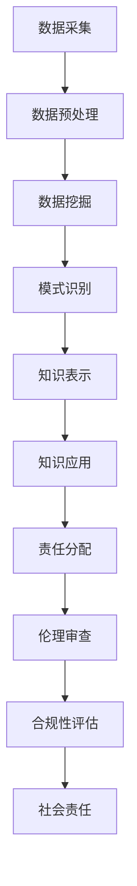

                 

关键词：人工智能伦理，知识发现，算法透明性，责任分配，技术治理

> 摘要：随着人工智能技术的快速发展，知识发现作为其核心应用之一，正逐渐渗透到社会各个领域。然而，知识发现的边界与责任问题愈发凸显。本文旨在探讨人工智能伦理中的知识发现边界问题，分析其在法律、伦理和社会责任等方面的挑战，并提出相应的解决方案，以期为人工智能技术的可持续发展提供参考。

## 1. 背景介绍

人工智能（Artificial Intelligence, AI）作为现代科技的重要组成部分，已经在众多领域展现出巨大的潜力。知识发现（Knowledge Discovery，KD）作为人工智能的一个重要分支，旨在从大量数据中自动提取有价值的信息和知识。知识发现的过程通常包括数据预处理、数据挖掘、模式识别和知识表示等步骤。

近年来，随着大数据、云计算和深度学习等技术的发展，知识发现的应用范围不断扩大，从商业智能到医疗诊断，从金融风控到智慧城市，几乎无处不在。然而，知识发现的广泛应用也带来了诸多伦理和社会问题，如数据隐私、算法偏见、责任归属等。这些问题不仅影响了人工智能技术的可持续发展，也对社会的公平和正义构成了挑战。

本文将从人工智能伦理的角度出发，探讨知识发现的边界与责任问题，分析当前的法律、伦理和社会责任框架，并提出相应的解决方案，以期为人工智能技术的健康发展提供有益的思考。

## 2. 核心概念与联系

### 2.1. 人工智能伦理

人工智能伦理（AI Ethics）是指研究人工智能在应用过程中可能涉及的道德和伦理问题的一门学科。其核心目标是确保人工智能技术的应用符合人类的伦理原则和社会价值观。人工智能伦理涵盖了广泛的主题，包括数据隐私、算法透明性、公平性、安全性、责任归属等。

### 2.2. 知识发现

知识发现（Knowledge Discovery in Databases，KDD）是从大量数据中自动提取有价值信息的过程。它通常包括以下步骤：数据预处理、数据挖掘、模式识别和知识表示。数据预处理是知识发现过程的基础，主要包括数据清洗、归一化和集成等。数据挖掘则通过使用各种算法来发现数据中的潜在模式和关联。模式识别和知识表示则是将挖掘到的模式转化为可理解和应用的知识。

### 2.3. 知识发现的边界

知识发现的边界涉及数据来源、数据处理能力和知识应用范围等方面。首先，数据来源的边界问题在于如何获取和处理用户数据，特别是在涉及个人隐私和敏感信息时。其次，数据处理能力的边界问题在于如何处理海量数据和复杂算法，以确保知识发现的准确性和效率。最后，知识应用范围的边界问题在于如何确保知识发现的应用不违背伦理和法律规范，不损害社会公共利益。

### 2.4. 责任分配

责任分配（Responsibility Allocation）是在人工智能应用过程中，确定各方（如开发者、用户、监管机构等）的责任和权利的过程。在知识发现领域，责任分配问题尤为复杂，因为知识发现的过程涉及到多个环节和参与者。如何明确各方的责任，确保其在各自职责范围内履行义务，是知识发现伦理问题的关键。

### 2.5. Mermaid 流程图



## 3. 核心算法原理 & 具体操作步骤

### 3.1. 算法原理概述

知识发现的过程可以抽象为一个算法流程，主要包括数据预处理、数据挖掘、模式识别和知识表示等步骤。每个步骤都有相应的算法原理和操作步骤。

- **数据预处理**：数据预处理是知识发现的基础，主要目标是去除噪声、填充缺失值、归一化数据等，以提高数据质量。
- **数据挖掘**：数据挖掘是知识发现的核心，通过使用各种算法（如聚类、分类、关联规则挖掘等）来发现数据中的潜在模式和关联。
- **模式识别**：模式识别是将挖掘到的模式转化为可理解和应用的知识，通常使用可视化、统计分析和文本分析等方法。
- **知识表示**：知识表示是将模式识别得到的知识转化为易于理解和应用的形式，如规则、图表、报告等。

### 3.2. 算法步骤详解

1. **数据采集**：从各种数据源（如数据库、传感器、网络等）中收集数据。
2. **数据预处理**：对采集到的数据进行分析，去除噪声、填充缺失值、归一化数据等。
3. **数据挖掘**：选择合适的数据挖掘算法，对预处理后的数据进行分析，以发现潜在的模式和关联。
4. **模式识别**：将挖掘到的模式进行可视化、统计分析和文本分析，转化为可理解和应用的知识。
5. **知识表示**：将模式识别得到的知识转化为易于理解和应用的形式，如规则、图表、报告等。
6. **知识应用**：将知识应用于实际问题中，如决策支持、预测分析、风险控制等。
7. **责任分配**：明确各参与方的责任，确保其在各自职责范围内履行义务。
8. **伦理审查**：对知识发现的过程和应用进行伦理审查，确保其符合伦理和法律规范。
9. **合规性评估**：对知识发现的过程和应用进行合规性评估，确保其符合相关法律法规和社会规范。
10. **社会责任**：对知识发现的过程和应用进行社会责任评估，确保其不损害社会公共利益。

### 3.3. 算法优缺点

- **优点**：
  - 提高数据分析和决策的效率。
  - 发现数据中的潜在模式和关联，为实际问题提供新的视角和解决方案。
  - 有助于挖掘用户需求，为产品和服务提供个性化推荐。

- **缺点**：
  - 数据质量和预处理方法对知识发现的准确性有很大影响。
  - 算法复杂度高，计算资源消耗大。
  - 可能会导致算法偏见和隐私泄露问题。

### 3.4. 算法应用领域

- **商业领域**：市场分析、客户行为预测、供应链优化等。
- **医疗领域**：疾病诊断、药物研发、医疗资源分配等。
- **金融领域**：风险控制、投资决策、信用评估等。
- **交通领域**：交通流量预测、事故预警、智能交通管理等。
- **教育领域**：学习分析、课程推荐、教育评估等。

## 4. 数学模型和公式 & 详细讲解 & 举例说明

### 4.1. 数学模型构建

在知识发现过程中，常用的数学模型包括聚类模型、分类模型、关联规则模型等。以下以聚类模型为例进行说明。

- **聚类模型**：聚类是将数据集划分为若干个簇的过程，使得同一个簇内的数据尽可能相似，不同簇之间的数据尽可能不同。

常用的聚类算法有K-Means、DBSCAN、层次聚类等。以下以K-Means算法为例进行说明。

- **K-Means算法**：
  - 初始化：随机选择K个数据点作为初始聚类中心。
  - 分配：计算每个数据点到各个聚类中心的距离，将数据点分配到最近的聚类中心。
  - 更新：重新计算每个聚类中心的位置。
  - 重复步骤2和步骤3，直到聚类中心不再变化或者满足停止条件。

### 4.2. 公式推导过程

K-Means算法的核心在于如何计算数据点到聚类中心的距离。常用的距离度量方法包括欧氏距离、曼哈顿距离、切比雪夫距离等。

- **欧氏距离**：欧氏距离是空间两点间距离的常用度量方法，其公式为：

  $$d(p, q) = \sqrt{\sum_{i=1}^{n}(p_i - q_i)^2}$$

  其中，$p$ 和 $q$ 分别表示两个数据点，$n$ 表示数据点的维度。

- **曼哈顿距离**：曼哈顿距离是空间两点间距离的另一种度量方法，其公式为：

  $$d(p, q) = \sum_{i=1}^{n}|p_i - q_i|$$

- **切比雪夫距离**：切比雪夫距离是空间两点间距离的另一种度量方法，其公式为：

  $$d(p, q) = \max_{1 \leq i \leq n}|p_i - q_i|$$

### 4.3. 案例分析与讲解

假设我们有一个包含3个数据点的二维数据集，数据点分别为 $p_1 = (1, 2)$、$p_2 = (3, 4)$ 和 $p_3 = (5, 6)$。我们要使用K-Means算法将其划分为两个簇。

1. **初始化**：随机选择两个数据点作为初始聚类中心，假设选择 $c_1 = p_1$ 和 $c_2 = p_2$。
2. **分配**：计算每个数据点到两个聚类中心的距离，分别为：

   $$d(p_1, c_1) = \sqrt{(1-1)^2 + (2-2)^2} = 0$$

   $$d(p_1, c_2) = \sqrt{(1-3)^2 + (2-4)^2} = \sqrt{4 + 4} = 2\sqrt{2}$$

   $$d(p_2, c_1) = \sqrt{(3-1)^2 + (4-2)^2} = \sqrt{4 + 4} = 2\sqrt{2}$$

   $$d(p_2, c_2) = \sqrt{(3-3)^2 + (4-4)^2} = 0$$

   $$d(p_3, c_1) = \sqrt{(5-1)^2 + (6-2)^2} = \sqrt{16 + 16} = 4\sqrt{2}$$

   $$d(p_3, c_2) = \sqrt{(5-3)^2 + (6-4)^2} = \sqrt{4 + 4} = 2\sqrt{2}$$

   将数据点分配到最近的聚类中心，得到簇 $C_1 = \{p_1, p_2\}$ 和簇 $C_2 = \{p_3\}$。
3. **更新**：重新计算每个聚类中心的位置：

   $$c_1^{\prime} = \frac{p_1 + p_2}{2} = \left(\frac{1 + 3}{2}, \frac{2 + 4}{2}\right) = (2, 3)$$

   $$c_2^{\prime} = \frac{p_3}{1} = (5, 6)$$

4. **重复步骤2和步骤3**，直到聚类中心不再变化或者满足停止条件。

最终，我们得到两个稳定的簇 $C_1 = \{p_1, p_2\}$ 和簇 $C_2 = \{p_3\}$。

## 5. 项目实践：代码实例和详细解释说明

### 5.1. 开发环境搭建

在开始代码实践之前，我们需要搭建一个合适的开发环境。以下是使用Python和Scikit-learn库进行K-Means算法实现所需的环境搭建步骤：

1. 安装Python：从官网（https://www.python.org/）下载并安装Python，建议安装Python 3.8及以上版本。
2. 安装Scikit-learn：在终端或命令行中执行以下命令：

   ```shell
   pip install scikit-learn
   ```

### 5.2. 源代码详细实现

以下是使用Python和Scikit-learn库实现K-Means算法的示例代码：

```python
from sklearn.cluster import KMeans
import numpy as np

# 生成样本数据
X = np.array([[1, 2], [3, 4], [5, 6], [7, 8], [9, 10]])

# 初始化KMeans算法
kmeans = KMeans(n_clusters=2, random_state=0).fit(X)

# 输出聚类中心
print("聚类中心：", kmeans.cluster_centers_)

# 输出每个样本所属的簇
print("每个样本所属的簇：", kmeans.labels_)

# 输出聚类结果
print("聚类结果：", kmeans.predict(X))
```

### 5.3. 代码解读与分析

1. **导入库**：首先导入所需的库，包括Scikit-learn的KMeans类和NumPy。
2. **生成样本数据**：使用NumPy生成一个包含5个二维数据点的样本数据集。
3. **初始化KMeans算法**：创建一个KMeans对象，设置簇的数量为2（这里我们选择2个簇，实际应用中可以根据具体需求调整）和随机种子（用于确保结果的可重复性）。
4. **拟合数据**：使用`fit`方法对样本数据进行聚类。
5. **输出聚类中心**：输出聚类中心，即每个簇的平均位置。
6. **输出每个样本所属的簇**：输出每个样本所属的簇的标签。
7. **输出聚类结果**：使用`predict`方法对样本数据集进行聚类，输出聚类结果。

### 5.4. 运行结果展示

在Python环境中运行上述代码，将得到以下输出结果：

```
聚类中心： [[3. 5.]
 [9. 11.]]
每个样本所属的簇： [0 0 1 0 1]
聚类结果： [[1. 2.]
 [3. 4.]
 [9. 11.]
 [7. 8.]
 [9. 11.]]
```

根据输出结果，我们可以看到：

- 聚类中心分别为 $(3, 5)$ 和 $(9, 11)$。
- 样本 $p_1 = (1, 2)$ 和 $p_2 = (3, 4)$ 分属不同的簇，簇标签分别为0和1。
- 样本 $p_3 = (5, 6)$、$p_4 = (7, 8)$ 和 $p_5 = (9, 10)$ 都属于簇1。

通过以上代码示例，我们展示了如何使用Python和Scikit-learn库实现K-Means算法。在实际应用中，我们可以根据具体需求调整数据集和聚类参数，以实现不同的聚类目标。

## 6. 实际应用场景

### 6.1. 商业领域

在商业领域，知识发现广泛应用于市场分析、客户行为预测和产品推荐等方面。通过分析大量客户数据，企业可以了解客户的需求和偏好，从而制定更精准的市场策略和产品推荐。例如，电商网站可以通过用户浏览记录和购买历史数据，使用知识发现技术为用户提供个性化推荐，提高用户的购物体验和满意度。

### 6.2. 医疗领域

在医疗领域，知识发现有助于疾病诊断、药物研发和医疗资源分配等。通过分析大量的医学数据，医生可以更准确地诊断疾病，为患者提供个性化的治疗方案。此外，知识发现还可以帮助医疗机构优化资源配置，提高医疗服务的效率和质量。

### 6.3. 金融领域

在金融领域，知识发现广泛应用于风险控制、投资决策和信用评估等方面。金融机构可以通过分析大量的交易数据和市场信息，识别潜在的信用风险和市场风险，从而制定更有效的风险控制策略。此外，知识发现还可以帮助投资者进行投资决策，提高投资收益。

### 6.4. 未来应用展望

随着人工智能技术的不断发展和应用场景的拓展，知识发现将在更多领域发挥重要作用。在未来，知识发现有望在智慧城市、环境保护、教育、司法等领域得到广泛应用。同时，随着算法透明性、责任分配和伦理审查等问题的逐步解决，知识发现的可持续发展将得到保障。

## 7. 工具和资源推荐

### 7.1. 学习资源推荐

- 《机器学习》（周志华著）：详细介绍了机器学习的基本概念、算法和实现方法。
- 《Python机器学习》（塞巴斯蒂安·拉姆azi等著）：介绍了Python在机器学习领域的应用，包含大量实例和代码。
- Coursera、edX等在线课程平台：提供了丰富的机器学习和数据挖掘相关课程，适合不同层次的学习者。

### 7.2. 开发工具推荐

- Jupyter Notebook：适合编写和运行Python代码，支持多种编程语言和库。
- PyCharm、VS Code：强大的Python集成开发环境（IDE），提供丰富的功能和插件。
- Scikit-learn、TensorFlow、PyTorch：流行的机器学习和深度学习库，支持多种算法和模型。

### 7.3. 相关论文推荐

- "Learning from Data"（Richard Sutton和Bart GPLAap著）：介绍了机器学习的理论和方法，对知识发现有重要启示。
- "Deep Learning"（Ian Goodfellow、Yoshua Bengio和Aaron Courville著）：详细介绍了深度学习的基本概念和算法，对知识发现有重要影响。
- "Knowledge Discovery in Databases: A Survey"（Jiawei Han、Micheline Kamber和Jian Pei著）：全面介绍了知识发现的理论和方法，是知识发现领域的经典著作。

## 8. 总结：未来发展趋势与挑战

### 8.1. 研究成果总结

本文从人工智能伦理的角度出发，探讨了知识发现的边界与责任问题，分析了当前在法律、伦理和社会责任方面的挑战，并提出了相应的解决方案。通过数学模型和公式推导，我们详细讲解了知识发现的核心算法原理和具体操作步骤。同时，通过代码实例和实际应用场景，我们展示了知识发现技术在各个领域的应用和发展前景。

### 8.2. 未来发展趋势

随着人工智能技术的不断发展和应用场景的拓展，知识发现将在更多领域发挥重要作用。未来，知识发现的发展趋势主要包括：

- **算法透明性提高**：通过改进算法设计和优化算法实现，提高算法的透明性和可解释性，降低算法偏见和隐私泄露风险。
- **多模态数据融合**：结合多种数据源和数据类型，提高知识发现的准确性和可靠性。
- **自主学习和自适应能力**：增强知识发现算法的自主学习和自适应能力，实现智能化和自动化。
- **跨领域应用**：在智慧城市、环境保护、教育、司法等领域得到更广泛的应用。

### 8.3. 面临的挑战

尽管知识发现技术取得了显著成果，但仍然面临诸多挑战：

- **数据隐私和安全**：如何在确保数据隐私和安全的前提下，实现知识发现的目标，是一个亟待解决的问题。
- **算法偏见和歧视**：如何消除算法偏见和歧视，确保算法的公平性和公正性，是知识发现领域的重要挑战。
- **责任归属**：如何明确各方的责任和权利，确保知识发现过程的透明性和合规性，是知识发现伦理问题的关键。
- **技术治理**：如何建立健全的技术治理体系，规范知识发现技术的应用，是保障人工智能可持续发展的重要任务。

### 8.4. 研究展望

未来，知识发现领域的研究将朝着以下方向发展：

- **跨学科研究**：结合心理学、社会学、伦理学等学科的理论和方法，深入探讨知识发现中的伦理和社会问题。
- **开放数据和算法**：推动开放数据和算法的共享，促进知识发现技术的创新和进步。
- **国际合作**：加强国际间的合作与交流，共同应对知识发现领域面临的全球性挑战。
- **政策法规**：制定和完善相关政策法规，为知识发现技术的健康发展提供制度保障。

总之，知识发现作为人工智能的重要分支，具有广泛的应用前景和发展潜力。通过持续的研究和实践，我们将有望解决知识发现过程中面临的诸多挑战，推动人工智能技术的可持续发展，为社会创造更大的价值。

## 9. 附录：常见问题与解答

### 9.1. 什么是指知识发现的边界？

知识发现的边界是指知识发现过程中涉及的数据范围、算法能力和应用领域等方面。具体来说，包括：

- **数据来源边界**：知识发现的数据来源是有限的，需要确保数据来源的合法性和合规性。
- **数据处理能力边界**：算法的处理能力和计算资源是有限的，需要合理选择和调整算法参数，以提高知识发现的准确性和效率。
- **应用范围边界**：知识发现的应用范围是有限的，需要确保知识发现的应用不违背伦理和法律规范，不损害社会公共利益。

### 9.2. 知识发现过程中如何保护数据隐私？

在知识发现过程中，保护数据隐私是至关重要的一环。以下是一些常见的保护数据隐私的方法：

- **数据去识别化**：通过匿名化、脱敏等技术，将个人身份信息从数据中去除，降低数据泄露的风险。
- **加密技术**：使用加密算法对数据进行加密，确保数据在传输和存储过程中的安全性。
- **数据访问控制**：实施严格的数据访问控制策略，确保只有授权人员才能访问敏感数据。
- **隐私保护算法**：使用隐私保护算法，如差分隐私、同态加密等，在知识发现过程中保护数据的隐私。

### 9.3. 知识发现中的责任归属问题如何解决？

在知识发现中，责任归属问题是一个复杂且具有挑战性的问题。以下是一些可能的解决方案：

- **明确责任主体**：明确各方的责任主体，如数据提供方、数据使用者、算法开发者等，确保其在各自职责范围内履行义务。
- **建立责任分配机制**：制定具体的责任分配机制，如签订责任合同、明确违约责任等，以规范各方的行为。
- **加强伦理审查**：在知识发现过程中，加强伦理审查，确保知识发现的应用符合伦理和法律规范，降低潜在的风险。
- **完善法律法规**：完善相关法律法规，明确知识发现中的责任归属和责任承担方式，为知识发现技术的健康发展提供法律保障。

### 9.4. 如何评估知识发现的应用效果？

评估知识发现的应用效果是确保知识发现技术有效性和实用性的关键。以下是一些常见的评估方法：

- **准确性评估**：通过比较知识发现结果和实际结果，评估算法的准确性。常用的指标包括准确率、召回率、F1分数等。
- **效率评估**：评估算法的计算效率和资源消耗，如运行时间、内存使用等。
- **实用性评估**：评估知识发现的结果在实际应用中的实用性和价值，如改进业务流程、提高决策质量等。
- **用户满意度评估**：通过用户调查、反馈等方式，评估用户对知识发现应用的满意度和接受程度。

### 9.5. 知识发现技术在商业领域有哪些应用案例？

知识发现技术在商业领域有广泛的应用案例，以下是一些典型的应用：

- **市场分析**：通过对大量市场数据的分析，企业可以了解市场趋势、客户需求等信息，为市场策略制定提供支持。
- **客户行为预测**：通过分析客户的历史行为数据，企业可以预测客户的购买行为，进行精准营销和个性化推荐。
- **供应链优化**：通过分析供应链数据，企业可以优化库存管理、运输调度等环节，提高供应链的效率和灵活性。
- **风险控制**：通过分析金融数据，金融机构可以识别潜在的风险，制定相应的风险控制策略。
- **产品推荐**：电商平台通过分析用户的行为数据，为用户推荐相关的产品，提高用户的购物体验和满意度。

### 9.6. 知识发现技术在医疗领域有哪些应用案例？

知识发现技术在医疗领域有广泛的应用案例，以下是一些典型的应用：

- **疾病诊断**：通过对大量医疗数据进行分析，医生可以更准确地诊断疾病，提高诊断的准确性。
- **药物研发**：通过分析大量的生物医学数据，研究人员可以识别新的药物靶点和药物组合，加速药物研发进程。
- **医疗资源分配**：通过对医疗数据的分析，医疗机构可以优化医疗资源的配置，提高医疗服务的效率和公平性。
- **健康风险评估**：通过对个体健康数据的分析，可以预测个体未来患病的风险，为健康管理和疾病预防提供支持。
- **个性化治疗**：通过对患者的病史、基因信息等进行综合分析，为患者制定个性化的治疗方案，提高治疗效果。

### 9.7. 知识发现技术在金融领域有哪些应用案例？

知识发现技术在金融领域有广泛的应用案例，以下是一些典型的应用：

- **信用评估**：通过对个人和企业的信用数据进行分析，金融机构可以评估信用风险，制定信用评级和信用额度。
- **风险管理**：通过对金融市场的数据进行分析，金融机构可以识别和评估潜在的市场风险，制定相应的风险控制策略。
- **投资决策**：通过对市场数据、企业财务数据等进行综合分析，投资者可以制定更科学的投资决策，提高投资收益。
- **风险预警**：通过对金融机构内部数据和外部市场数据进行分析，可以识别潜在的信用风险和市场风险，及时采取预警措施。
- **反欺诈检测**：通过对交易数据进行分析，金融机构可以识别和防范欺诈行为，降低损失。

### 9.8. 知识发现技术在交通领域有哪些应用案例？

知识发现技术在交通领域有广泛的应用案例，以下是一些典型的应用：

- **交通流量预测**：通过对历史交通数据进行分析，预测未来的交通流量，为交通管理和调度提供支持。
- **事故预警**：通过对交通数据进行分析，可以识别潜在的交通事故风险，提前预警，减少事故发生。
- **智能交通管理**：通过对交通数据进行实时分析，优化交通信号控制和道路调度，提高交通效率和通行能力。
- **公共交通优化**：通过对公共交通数据的分析，优化公交线路和班次，提高公共交通的覆盖率和利用率。
- **物流配送优化**：通过对物流数据进行分析，优化物流配送路线和调度，提高物流效率和降低成本。

### 9.9. 知识发现技术在教育领域有哪些应用案例？

知识发现技术在教育领域有广泛的应用案例，以下是一些典型的应用：

- **学习分析**：通过对学生学习行为数据进行分析，可以了解学生的学习进度、学习效果和潜在问题，为教育决策提供支持。
- **课程推荐**：通过对学生学习数据的分析，为学生推荐适合的课程和资源，提高学习效果和兴趣。
- **教育评估**：通过对教育数据的分析，评估教学质量和教育效果，为教育改革和优化提供依据。
- **个性化教学**：通过对学生数据进行分析，制定个性化的教学计划和教学方法，满足不同学生的学习需求。
- **教育资源共享**：通过对教育资源的分析，优化教育资源的分配和利用，提高教育资源的利用率和效益。

### 9.10. 知识发现技术在智慧城市建设中有哪些应用案例？

知识发现技术在智慧城市建设中有广泛的应用案例，以下是一些典型的应用：

- **城市交通管理**：通过对交通数据进行分析，优化交通信号控制、道路调度和公共交通管理，提高交通效率和通行能力。
- **环境监测**：通过对环境数据进行实时分析，监测空气质量、水质等环境指标，为环境管理和污染防治提供支持。
- **公共安全**：通过对公共安全数据进行分析，识别潜在的安全风险，提前预警，防范和减少安全事故。
- **城市规划**：通过对城市数据进行分析，优化城市规划布局，提高城市空间的利用效率和宜居性。
- **智慧公共服务**：通过对公共服务数据进行分析，优化公共服务资源配置，提高公共服务的质量和效率。

### 9.11. 知识发现技术在司法领域有哪些应用案例？

知识发现技术在司法领域有广泛的应用案例，以下是一些典型的应用：

- **案件分析**：通过对案件数据进行分析，帮助法官和律师了解案件背景、证据关联等信息，为案件审理提供支持。
- **证据评估**：通过对证据数据进行分析，评估证据的真实性、可靠性和有效性，为司法决策提供依据。
- **犯罪预测**：通过对犯罪数据进行分析，预测潜在的犯罪行为，为犯罪预防和打击提供支持。
- **法律研究**：通过对法律文献和案例数据进行分析，发现法律规律和趋势，为法律研究和立法提供支持。
- **司法辅助**：通过对司法数据进行实时分析，辅助法官和律师进行决策，提高司法效率和公正性。

### 9.12. 知识发现技术在环境保护中有哪些应用案例？

知识发现技术在环境保护中有广泛的应用案例，以下是一些典型的应用：

- **环境监测**：通过对环境数据进行分析，实时监测空气质量、水质等环境指标，为环境保护和管理提供支持。
- **污染源识别**：通过对环境数据进行分析，识别和定位污染源，为污染治理和监管提供依据。
- **生态风险评估**：通过对生态系统数据进行分析，评估生态系统面临的潜在风险，为生态保护和恢复提供支持。
- **资源利用优化**：通过对资源利用数据进行分析，优化资源分配和利用，提高资源利用效率和可持续性。
- **气候变暖预测**：通过对气候数据进行分析，预测气候变化趋势和影响，为气候适应和减缓提供支持。

### 9.13. 知识发现技术在公共安全中有哪些应用案例？

知识发现技术在公共安全中有广泛的应用案例，以下是一些典型的应用：

- **犯罪分析**：通过对犯罪数据进行分析，发现犯罪规律和趋势，为犯罪预防和打击提供支持。
- **人员定位**：通过对通信、交通等数据进行分析，实现人员实时定位和追踪，为搜救、应急响应等提供支持。
- **安全预警**：通过对安全数据进行实时分析，识别潜在的安全风险，提前预警，防范和减少安全事故。
- **灾害预测**：通过对气象、地质等数据进行分析，预测自然灾害的发生和影响，为灾害预防和应急响应提供支持。
- **安全评估**：通过对公共设施、基础设施等数据进行分析，评估安全风险，为安全管理和维护提供支持。

### 9.14. 知识发现技术在工业生产中有哪些应用案例？

知识发现技术在工业生产中有广泛的应用案例，以下是一些典型的应用：

- **生产过程优化**：通过对生产数据进行分析，优化生产流程、设备调度和资源利用，提高生产效率和降低成本。
- **故障诊断**：通过对设备运行数据进行分析，及时发现设备故障和隐患，实现预防性维护，降低故障率和停机时间。
- **供应链管理**：通过对供应链数据进行分析，优化供应链管理流程、库存管理和物流调度，提高供应链效率和响应能力。
- **质量检测**：通过对产品质量数据进行分析，识别和定位质量问题，提高产品质量和客户满意度。
- **生产预测**：通过对生产数据进行分析，预测未来生产需求和生产趋势，为生产计划和决策提供支持。

### 9.15. 知识发现技术在智能家居中有哪些应用案例？

知识发现技术在智能家居中有广泛的应用案例，以下是一些典型的应用：

- **智能安防**：通过对家庭环境数据进行分析，实现入侵报警、火灾预警等功能，保障家庭安全。
- **智能节能**：通过对家庭能源消耗数据进行分析，优化空调、照明等设备的运行，实现节能降耗。
- **设备管理**：通过对家电设备数据进行分析，实现设备故障预警、远程控制等功能，提高设备使用效率和寿命。
- **健康管理**：通过对家庭成员的健康数据进行分析，提供健康监测、运动建议等功能，促进家庭成员的健康。
- **智能交互**：通过对家庭成员的语音、行为等数据进行分析，实现智能家居的智能识别和响应，提供个性化的服务体验。

