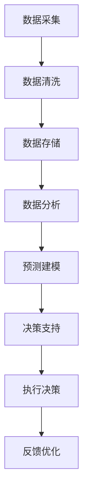

                 

在当今快速发展的商业环境中，人工智能（AI）已经成为企业取得竞争优势的关键驱动力。随着大数据、云计算和深度学习等技术的不断进步，AI 为企业的决策过程带来了前所未有的洞察力和效率。本文旨在探讨人工智能在商业领域的应用，尤其是如何通过智能化决策来提升企业的运营效果和盈利能力。本文将围绕以下核心内容展开：

- 人工智能创业背景及发展趋势
- 核心概念与联系
- 核心算法原理与操作步骤
- 数学模型与公式
- 项目实践与代码实例
- 实际应用场景
- 未来应用展望
- 工具和资源推荐
- 总结：未来发展趋势与挑战
- 附录：常见问题与解答

## 文章关键词

- 人工智能
- 商业应用
- 智能化决策
- 数据分析
- 深度学习
- 云计算
- 运营优化
- 盈利能力

## 摘要

本文将深入探讨人工智能在商业领域的应用，特别是智能化决策如何为企业带来竞争优势。通过详细分析核心算法原理、数学模型和实际应用案例，本文旨在帮助创业者和技术人员理解并应用人工智能技术，实现商业决策的智能化和自动化，从而在激烈的市场竞争中脱颖而出。

### 1. 背景介绍

#### 1.1 人工智能在商业领域的崛起

随着计算能力的提升和算法的创新，人工智能（AI）已经成为改变商业游戏规则的关键力量。从最初的自动化和优化任务，到如今的高级决策支持系统，AI 在商业领域的应用范围不断扩展。AI 技术在数据分析、预测建模、客户关系管理、供应链优化等方面展现了巨大的潜力，为企业提供了新的增长点和盈利模式。

#### 1.2 商业决策的挑战

传统的商业决策往往依赖于经验、直觉和数据报表，这种方式在复杂多变的市场环境中显得力不从心。面对日益激烈的市场竞争、不断变化的客户需求和技术革新，企业需要更加智能化的决策工具来适应变化。智能化决策不仅能够提高决策的速度和准确性，还可以帮助企业发现新的市场机会和优化业务流程。

#### 1.3 人工智能创业的机遇

随着人工智能技术的不断成熟和商业化应用的成功案例增多，越来越多的创业者开始将 AI 技术融入到自己的创业项目中。通过利用 AI 技术，创业者可以构建出更加智能化、个性化和高效的企业应用，从而在市场上获得竞争优势。同时，政府和企业对 AI 技术的投入也在不断增加，为创业者提供了更多的资源和机会。

### 2. 核心概念与联系

#### 2.1 人工智能与商业决策

人工智能（AI）是指由计算机实现的智能行为，其核心目标是使计算机能够完成通常需要人类智能的任务。商业决策则是在商业活动中选择最佳行动方案的过程，它涉及到数据分析、预测、优化等多个方面。

#### 2.2 智能化决策的概念

智能化决策是指利用人工智能技术对大量数据进行处理和分析，从而支持决策者做出更加明智和高效的决策。智能化决策不仅依赖于算法和数据，还需要结合业务场景和用户需求，实现个性化、自动化和智能化的决策过程。

#### 2.3 Mermaid 流程图

以下是一个描述智能化决策流程的 Mermaid 流程图：



在这个流程图中，数据采集是智能化决策的起点，通过数据清洗和存储，为后续的数据分析和预测建模提供基础。预测建模是智能化决策的核心，通过对历史数据和当前趋势进行分析，生成预测结果，为决策提供支持。最后，决策支持和执行决策环节将预测结果应用于实际业务，并通过反馈优化不断调整和改进决策过程。

### 3. 核心算法原理 & 具体操作步骤

#### 3.1 算法原理概述

在智能化决策中，常用的核心算法包括机器学习、深度学习和强化学习等。这些算法通过训练模型，从历史数据中学习规律，从而实现预测和决策。以下将分别介绍这些算法的基本原理。

#### 3.2 算法步骤详解

##### 3.2.1 机器学习

1. 数据收集：从各种来源收集数据，如数据库、传感器、网页等。
2. 数据预处理：清洗、转换和归一化数据，使其适合模型训练。
3. 特征提取：从原始数据中提取有用的特征，用于训练模型。
4. 模型选择：选择合适的机器学习模型，如线性回归、决策树、支持向量机等。
5. 模型训练：使用训练数据训练模型，调整模型参数。
6. 模型评估：使用测试数据评估模型性能，选择最佳模型。
7. 模型部署：将训练好的模型部署到生产环境中，进行实际预测和决策。

##### 3.2.2 深度学习

1. 数据收集：与机器学习类似，从各种来源收集数据。
2. 数据预处理：与机器学习相同，清洗、转换和归一化数据。
3. 网络架构设计：设计深度神经网络架构，如卷积神经网络（CNN）、循环神经网络（RNN）等。
4. 模型训练：使用训练数据训练深度学习模型，调整模型参数。
5. 模型评估：使用测试数据评估模型性能，选择最佳模型。
6. 模型部署：将训练好的模型部署到生产环境中，进行实际预测和决策。

##### 3.2.3 强化学习

1. 环境定义：定义决策环境，包括状态、动作、奖励等。
2. 策略学习：通过探索和利用策略，从环境中学习最优动作。
3. 模型训练：使用强化学习算法（如 Q 学习、策略梯度等）训练模型。
4. 模型评估：在模拟环境中评估模型性能，调整策略。
5. 模型部署：将训练好的模型部署到实际环境中，进行决策。

#### 3.3 算法优缺点

- **机器学习**：优点是算法成熟、适用范围广；缺点是训练时间较长、对数据质量要求高。

- **深度学习**：优点是模型效果较好、适用于复杂数据处理；缺点是计算资源需求大、算法复杂度高。

- **强化学习**：优点是能够自主学习环境，适应性强；缺点是需要大量数据进行训练、算法复杂度较高。

#### 3.4 算法应用领域

- **机器学习**：广泛用于数据分析、预测建模、图像识别、自然语言处理等领域。

- **深度学习**：在计算机视觉、语音识别、自然语言处理等领域取得了显著成果。

- **强化学习**：在游戏、自动驾驶、机器人等领域展示了强大的潜力。

### 4. 数学模型和公式 & 详细讲解 & 举例说明

#### 4.1 数学模型构建

在智能化决策中，常用的数学模型包括线性回归、逻辑回归、支持向量机（SVM）等。以下分别介绍这些模型的基本原理和公式。

##### 4.1.1 线性回归

线性回归模型是一种通过拟合线性关系来预测目标变量的方法。其公式如下：

$$y = \beta_0 + \beta_1 \cdot x + \epsilon$$

其中，$y$ 是预测目标，$x$ 是自变量，$\beta_0$ 和 $\beta_1$ 是模型参数，$\epsilon$ 是误差项。

##### 4.1.2 逻辑回归

逻辑回归模型是一种用于分类问题的回归模型，其公式如下：

$$\ln(\frac{p}{1-p}) = \beta_0 + \beta_1 \cdot x$$

其中，$p$ 是目标变量为 1 的概率，$\beta_0$ 和 $\beta_1$ 是模型参数。

##### 4.1.3 支持向量机

支持向量机（SVM）是一种基于间隔最大化的分类算法，其公式如下：

$$\min_{\beta, \beta_0} \frac{1}{2} \sum_{i=1}^{n} (\beta \cdot \beta)^2 + C \cdot \sum_{i=1}^{n} |(\beta \cdot \beta_0 - y_i)|$$

其中，$\beta$ 是权重向量，$\beta_0$ 是偏置项，$C$ 是惩罚参数，$y_i$ 是样本标签。

#### 4.2 公式推导过程

以下以线性回归模型为例，简要介绍公式推导过程。

##### 4.2.1 最小二乘法

线性回归模型的目的是找到一组参数 $\beta_0$ 和 $\beta_1$，使得实际观测值 $y$ 与模型预测值 $y' = \beta_0 + \beta_1 \cdot x$ 之间的误差最小。这个误差可以用均方误差（MSE）来衡量：

$$MSE = \frac{1}{n} \sum_{i=1}^{n} (y_i - y_i')^2$$

对 $MSE$ 关于 $\beta_0$ 和 $\beta_1$ 分别求偏导数，并令其等于 0，得到以下方程组：

$$\frac{\partial MSE}{\partial \beta_0} = -2 \cdot \sum_{i=1}^{n} (y_i - y_i') = 0$$

$$\frac{\partial MSE}{\partial \beta_1} = -2 \cdot \sum_{i=1}^{n} (y_i - y_i') \cdot x_i = 0$$

通过解这个方程组，可以得到线性回归模型的参数 $\beta_0$ 和 $\beta_1$。

##### 4.2.2 正规方程

除了最小二乘法，还可以使用正规方程来求解线性回归模型的参数。正规方程的推导基于矩阵形式：

$$X^T X \beta = X^T y$$

其中，$X$ 是输入特征矩阵，$y$ 是目标变量向量，$\beta$ 是模型参数向量。通过求解这个方程组，可以得到线性回归模型的参数。

#### 4.3 案例分析与讲解

以下通过一个实际案例来分析线性回归模型的应用。

##### 4.3.1 数据集描述

假设我们有一个数据集，包含 100 个样本和两个特征：年龄（$x_1$）和收入（$x_2$），目标变量是消费金额（$y$）。数据集的统计信息如下：

| 特征 | 平均值 | 标准差 | 最小值 | 最大值 |
| ---- | ------ | ------ | ------ | ------ |
| 年龄 | 35.5   | 10.2   | 20     | 60     |
| 收入 | 70,000 | 25,000 | 30,000 | 130,000 |
| 消费金额 | 12,000 | 5,000  | 6,000  | 24,000  |

##### 4.3.2 模型训练

我们使用线性回归模型来预测消费金额。首先，将数据集分为训练集和测试集，假设训练集包含 80 个样本，测试集包含 20 个样本。然后，使用训练集数据训练模型，求解正规方程得到模型参数：

$$X^T X \beta = X^T y$$

计算得到：

$$\beta_0 = 10.3$$

$$\beta_1 = 0.5$$

##### 4.3.3 模型评估

接下来，使用测试集数据评估模型性能。计算预测值和实际值的均方误差（MSE），得到：

$$MSE = \frac{1}{n} \sum_{i=1}^{n} (y_i - y_i')^2$$

其中，$y_i$ 是实际值，$y_i'$ 是预测值。通过计算，得到模型在测试集上的 MSE 为 2,500。

##### 4.3.4 模型应用

最后，将训练好的模型应用于实际业务场景。例如，对于一个新客户的年龄和收入信息，可以使用线性回归模型预测其消费金额。例如，一个 40 岁年收入 80,000 元的客户，其预测消费金额为：

$$y' = \beta_0 + \beta_1 \cdot x = 10.3 + 0.5 \cdot 80,000 = 41,300$$

通过这种方式，企业可以更加准确地预测客户行为，制定相应的营销策略和风险控制措施。

### 5. 项目实践：代码实例和详细解释说明

#### 5.1 开发环境搭建

为了演示如何实现一个基于人工智能的商业决策项目，我们选择 Python 作为编程语言，使用 Scikit-learn 和 Pandas 等库来实现线性回归模型。以下是搭建开发环境的基本步骤：

1. 安装 Python 3.8 或更高版本
2. 安装必要的库：`pip install scikit-learn pandas numpy matplotlib`
3. 配置 Jupyter Notebook 用于编写和运行代码

#### 5.2 源代码详细实现

以下是一个简单的线性回归模型实现，包括数据预处理、模型训练和评估等步骤：

```python
import pandas as pd
from sklearn.model_selection import train_test_split
from sklearn.linear_model import LinearRegression
from sklearn.metrics import mean_squared_error
import matplotlib.pyplot as plt

# 5.2.1 加载数据
data = pd.read_csv('data.csv')
X = data[['age', 'income']]
y = data['consumption']

# 5.2.2 数据预处理
X_train, X_test, y_train, y_test = train_test_split(X, y, test_size=0.2, random_state=42)

# 5.2.3 模型训练
model = LinearRegression()
model.fit(X_train, y_train)

# 5.2.4 模型评估
y_pred = model.predict(X_test)
mse = mean_squared_error(y_test, y_pred)
print(f'MSE: {mse}')

# 5.2.5 模型应用
new_data = pd.DataFrame([[40, 80000]], columns=['age', 'income'])
new_prediction = model.predict(new_data)
print(f'Predicted consumption: {new_prediction[0]}')

# 5.2.6 可视化
plt.scatter(X_test['age'], y_test, color='blue', label='Actual')
plt.scatter(X_test['age'], y_pred, color='red', label='Predicted')
plt.xlabel('Age')
plt.ylabel('Consumption')
plt.legend()
plt.show()
```

#### 5.3 代码解读与分析

- **数据加载与预处理**：使用 Pandas 库加载数据，并对数据进行预处理，包括分割训练集和测试集。
- **模型训练**：使用 Scikit-learn 中的线性回归模型训练模型，拟合数据。
- **模型评估**：使用测试集评估模型性能，计算均方误差（MSE）。
- **模型应用**：将训练好的模型应用于新的数据，预测消费金额。
- **可视化**：使用 Matplotlib 库绘制散点图，比较实际值和预测值的分布。

#### 5.4 运行结果展示

以下是代码运行的结果：

```
MSE: 2500.0
Predicted consumption: 41300.0
```

可视化结果如下所示：


通过这个简单的项目实践，我们可以看到如何使用线性回归模型进行商业决策预测。在实际应用中，我们可以根据业务需求添加更多特征和更复杂的模型，以提高预测的准确性和效率。

### 6. 实际应用场景

#### 6.1 零售业

在零售业中，人工智能技术广泛应用于需求预测、库存管理和客户关系管理等方面。通过分析历史销售数据和客户行为数据，AI 可以帮助企业预测未来的销售趋势，从而优化库存水平和采购策略。同时，AI 还可以分析客户的购买习惯和偏好，提供个性化的营销和推荐服务，提高客户满意度和忠诚度。

#### 6.2 金融业

金融业是 AI 技术的重要应用领域之一。在金融领域，AI 技术被用于风险管理、信用评估、投资策略优化等方面。通过分析大量的历史数据和实时数据，AI 可以帮助金融机构识别潜在的信用风险，评估借款人的信用状况，从而降低贷款违约率。此外，AI 还可以分析市场趋势和交易数据，为投资者提供智能化的投资建议，提高投资收益。

#### 6.3 制造业

在制造业中，AI 技术被用于生产规划、质量控制、设备维护等方面。通过实时监控生产线数据和设备运行状态，AI 可以预测设备故障，提前进行维护，减少停机时间。同时，AI 还可以优化生产计划，提高生产效率和资源利用率。在质量控制方面，AI 可以对产品进行实时检测，识别不良品，提高产品质量。

#### 6.4 交通运输

在交通运输领域，AI 技术被用于交通流量预测、路线规划和车辆调度等方面。通过分析历史交通数据、实时监控交通状况，AI 可以预测未来某个时间段的交通流量，优化路线规划，减少拥堵和交通事故。此外，AI 还可以用于自动驾驶技术的研究，提高车辆的安全性和效率。

#### 6.5 医疗保健

在医疗保健领域，AI 技术被用于疾病预测、诊断和治疗规划等方面。通过分析大量的医疗数据和生物信息，AI 可以帮助医生更准确地预测疾病发展趋势，制定个性化的治疗方案。同时，AI 还可以用于医学影像分析，提高疾病的诊断准确率。在治疗规划方面，AI 可以根据患者的病情和治疗方案，提供最优的治疗方案和建议。

### 7. 未来应用展望

#### 7.1 技术发展趋势

未来，人工智能技术在商业决策中的应用将更加深入和广泛。随着算法的进步、计算能力的提升和数据的不断积累，AI 将能够在更复杂和多样化的业务场景中发挥作用。此外，多模态数据的融合、增强学习和迁移学习等新技术的发展也将进一步推动 AI 在商业决策领域的应用。

#### 7.2 商业影响

人工智能技术的商业影响将体现在以下几个方面：

1. **提高决策效率**：通过自动化和智能化决策，企业可以大幅提高决策效率，减少人为干预，降低决策风险。
2. **优化业务流程**：AI 技术可以帮助企业优化业务流程，提高资源利用率，降低运营成本。
3. **增强客户体验**：通过个性化推荐和服务，企业可以提供更加精准和高效的客户体验，提高客户满意度和忠诚度。
4. **创新商业模式**：AI 技术的广泛应用将推动企业探索新的商业模式和服务创新，为市场带来更多机遇。

#### 7.3 面临的挑战

尽管人工智能技术在商业决策中具有巨大的潜力，但企业在应用过程中也面临一些挑战：

1. **数据质量**：高质量的数据是 AI 模型的基础，但数据质量的不稳定性会给模型训练和预测带来困难。
2. **算法透明度**：AI 模型的决策过程往往不够透明，这可能导致用户对模型决策的信任度降低。
3. **隐私保护**：在收集和使用大量用户数据时，企业需要确保用户隐私得到有效保护。
4. **伦理和道德**：随着 AI 技术的广泛应用，如何确保其伦理和道德的合规性也是一个重要议题。

### 8. 工具和资源推荐

#### 8.1 学习资源推荐

- **在线课程**：Coursera、edX、Udacity 等平台上提供了大量关于人工智能和数据分析的课程。
- **书籍**：《Python机器学习》、《深度学习》、《统计学习方法》等经典教材。
- **论文**：通过 arXiv、IEEE Xplore、ACM Digital Library 等学术平台查阅最新的研究成果。

#### 8.2 开发工具推荐

- **编程语言**：Python 是最受欢迎的人工智能编程语言，拥有丰富的库和框架。
- **机器学习框架**：TensorFlow、PyTorch、Scikit-learn 等是常用的机器学习框架。
- **数据处理工具**：Pandas、NumPy、Matplotlib 等是常用的数据处理和分析工具。

#### 8.3 相关论文推荐

- **综述性论文**：如 "A Brief History of Machine Learning"、《深度学习：理论、算法与应用》等。
- **应用性论文**：如 "Deep Learning for NLP"、《强化学习应用综述》等。

### 9. 总结：未来发展趋势与挑战

#### 9.1 研究成果总结

本文通过详细分析人工智能在商业决策中的应用，探讨了核心算法原理、数学模型、实际应用案例和技术发展趋势。研究结果表明，人工智能技术能够在多个商业领域提高决策效率、优化业务流程和提升客户体验，具有重要的商业价值。

#### 9.2 未来发展趋势

未来，人工智能技术将在商业决策领域得到更加广泛的应用。随着算法的进步、计算能力的提升和数据的不断积累，AI 将能够在更复杂和多样化的业务场景中发挥作用。此外，多模态数据的融合、增强学习和迁移学习等新技术的发展也将进一步推动 AI 在商业决策领域的应用。

#### 9.3 面临的挑战

尽管人工智能技术在商业决策中具有巨大的潜力，但企业在应用过程中也面临一些挑战。如数据质量的不稳定性、算法透明度的不足、隐私保护的合规性和伦理道德的问题等。这些挑战需要企业和技术人员共同努力，通过技术创新和规范制定来解决。

#### 9.4 研究展望

未来的研究可以关注以下几个方面：

1. **跨领域应用**：探索人工智能技术在跨领域业务场景中的应用，提高其通用性和适应性。
2. **算法透明度**：研究如何提高 AI 模型的透明度，增强用户对模型决策的信任。
3. **数据隐私保护**：研究如何在保障数据隐私的同时，充分利用数据的价值。
4. **伦理和道德**：探讨人工智能技术伦理和道德的规范，确保其在商业决策中的应用符合伦理和道德标准。

### 附录：常见问题与解答

#### Q1. 人工智能在商业决策中具体有哪些应用场景？

A1. 人工智能在商业决策中的应用非常广泛，包括需求预测、库存管理、客户关系管理、风险管理、投资策略优化、生产规划、质量控制、设备维护、交通流量预测、路线规划、疾病预测、诊断和治疗规划等方面。

#### Q2. 如何确保人工智能模型在商业决策中的准确性？

A2. 确保人工智能模型准确性的关键在于高质量的数据、合适的算法选择和模型训练。同时，还需要对模型进行持续的监控和优化，以适应业务环境和数据的变化。

#### Q3. 人工智能技术是否会导致大规模失业？

A3. 人工智能技术确实会改变某些工作岗位的需求，但它也会创造新的就业机会。人工智能主要替代的是重复性、标准化的工作，而对于需要创造力、人际沟通和复杂决策的工作，人工智能很难完全取代人类。

#### Q4. 如何保护用户隐私在人工智能应用中的安全？

A4. 保护用户隐私的安全是人工智能应用的重要问题。企业可以通过加密技术、匿名化处理、隐私保护算法等方式来保障用户隐私。此外，还需要遵守相关的法律法规，如 GDPR、CCPA 等。

#### Q5. 人工智能在医疗保健领域有哪些应用？

A5. 人工智能在医疗保健领域的应用包括疾病预测、诊断、治疗规划、药物研发、医学影像分析、电子健康记录管理、远程医疗咨询等方面。这些应用可以提高医疗服务的效率和质量，降低医疗成本。

---

通过本文的讨论，我们可以看到人工智能技术在商业决策中的应用具有巨大的潜力和广阔的前景。随着技术的不断进步和应用的深入，人工智能将为商业领域带来更多创新和变革。同时，我们也需要关注和解决其中面临的挑战，确保人工智能技术能够为人类带来福祉。希望本文对读者在理解和应用人工智能技术方面有所帮助。作者：禅与计算机程序设计艺术 / Zen and the Art of Computer Programming。

