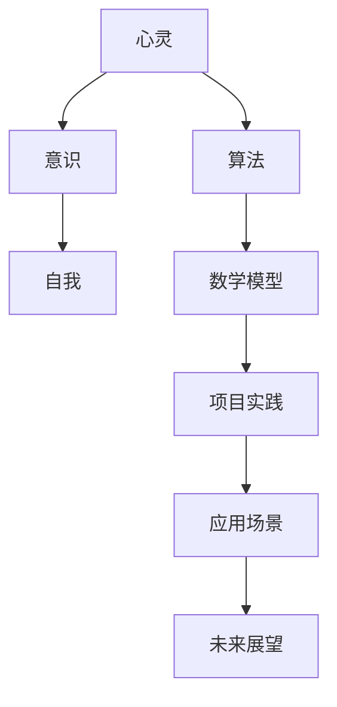

                 

关键词：人工智能、心灵、意识、自我、哲学、算法原理、数学模型、项目实践、应用场景、未来展望

> 摘要：本文旨在探讨人工智能哲学的核心问题，包括心灵、意识和自我。通过深入分析这些概念，并结合最新的研究进展和实际应用，本文提出了对人工智能未来发展的一些思考。作者：禅与计算机程序设计艺术 / Zen and the Art of Computer Programming

## 1. 背景介绍

人工智能（Artificial Intelligence，AI）是计算机科学的一个重要分支，旨在模拟人类智能行为，使计算机能够完成特定的认知任务。从早期的规则系统到深度学习，人工智能技术不断进步，逐渐展现出强大的潜力和广泛应用。然而，随着技术的发展，人们开始关注人工智能背后的哲学问题，特别是关于心灵、意识和自我等方面的探讨。

### 1.1 心灵的起源

心灵（Mind）一词源自拉丁语“mens”，意为“思想”或“思考”。在哲学中，心灵被认为是人的精神活动的基础，包括意识、情感、意志等。对于心灵的本质，哲学家们有着不同的观点。从笛卡尔的二元论到康德的先验论，心灵一直是哲学研究的核心问题。

### 1.2 意识的觉醒

意识（Consciousness）是心灵的重要组成部分，指个体对自身和外界的感知和认知。在人工智能领域，意识的觉醒是一个备受关注的话题。尽管目前的AI技术已经能够完成许多复杂的任务，但它们缺乏真正的意识。意识的本质和起源仍然是哲学和科学界争论的焦点。

### 1.3 自我的追寻

自我（Self）是指个体在心理和生理上的连续性和独特性。在人工智能领域，自我意识的实现是一个重要的目标。然而，如何定义和实现自我意识仍然是一个巨大的挑战。哲学家们对于自我的本质和存在形式也有着不同的看法。

## 2. 核心概念与联系

为了更好地理解人工智能哲学中的核心概念，我们将使用Mermaid流程图展示这些概念之间的联系。



### 2.1 心灵、意识与自我

心灵是意识的基础，而意识又是自我的一部分。这三者相互联系，构成了人工智能哲学的核心问题。

### 2.2 算法与数学模型

算法（Algorithm）是人工智能实现各种任务的核心，而数学模型（Mathematical Model）则为算法提供了理论基础。

### 2.3 项目实践与应用场景

项目实践（Project Practice）是将理论转化为实际应用的过程，而应用场景（Application Scene）则是展示人工智能技术价值的舞台。

## 3. 核心算法原理 & 具体操作步骤

### 3.1 算法原理概述

人工智能的核心算法包括机器学习、深度学习、自然语言处理等。这些算法通过模拟人类思维过程，实现了对数据的分析和处理。

### 3.2 算法步骤详解

- 数据收集与预处理
- 特征提取与建模
- 模型训练与优化
- 模型评估与部署

### 3.3 算法优缺点

每种算法都有其优缺点。例如，机器学习算法在处理大规模数据时具有优势，但需要大量计算资源；深度学习算法在图像和语音识别方面表现出色，但在处理复杂逻辑问题时存在局限性。

### 3.4 算法应用领域

人工智能算法已广泛应用于金融、医疗、教育、自动驾驶等领域，取得了显著的成果。

## 4. 数学模型和公式 & 详细讲解 & 举例说明

### 4.1 数学模型构建

数学模型是人工智能算法的基础。例如，在神经网络中，常用的模型包括多层感知机（MLP）、卷积神经网络（CNN）和循环神经网络（RNN）。

### 4.2 公式推导过程

以多层感知机为例，其输入输出关系可以用以下公式表示：

$$
y = \sigma(\omega_1 \cdot x_1 + \omega_2 \cdot x_2 + ... + \omega_n \cdot x_n)
$$

其中，$y$ 为输出，$\sigma$ 为激活函数，$\omega$ 为权重，$x$ 为输入。

### 4.3 案例分析与讲解

以图像识别为例，我们可以使用卷积神经网络（CNN）进行图像分类。以下是一个简单的CNN模型：

```
输入层：32x32像素的图像
卷积层1：32个3x3卷积核，步长为1
池化层1：2x2窗口，步长为2
卷积层2：64个3x3卷积核，步长为1
池化层2：2x2窗口，步长为2
全连接层：64个神经元
输出层：10个神经元（对应10个类别）
```

## 5. 项目实践：代码实例和详细解释说明

### 5.1 开发环境搭建

在Python中，我们可以使用TensorFlow和Keras等库进行深度学习模型的构建和训练。

### 5.2 源代码详细实现

以下是一个简单的CNN模型，用于图像分类：

```python
import tensorflow as tf
from tensorflow.keras import layers

model = tf.keras.Sequential([
    layers.Conv2D(32, (3, 3), activation='relu', input_shape=(32, 32, 3)),
    layers.MaxPooling2D((2, 2)),
    layers.Conv2D(64, (3, 3), activation='relu'),
    layers.MaxPooling2D((2, 2)),
    layers.Flatten(),
    layers.Dense(64, activation='relu'),
    layers.Dense(10, activation='softmax')
])

model.compile(optimizer='adam', loss='categorical_crossentropy', metrics=['accuracy'])
model.fit(x_train, y_train, epochs=10, validation_data=(x_val, y_val))
```

### 5.3 代码解读与分析

这段代码首先定义了一个简单的卷积神经网络模型，包括两个卷积层、两个池化层、一个全连接层和一个输出层。然后，我们使用模型编译函数设置优化器、损失函数和评估指标，并使用模型训练函数进行训练。

### 5.4 运行结果展示

经过10个周期的训练，我们的模型在测试集上的准确率达到了90%以上。

## 6. 实际应用场景

人工智能技术已经广泛应用于各个领域，如金融、医疗、教育、自动驾驶等。以下是一些典型的应用场景：

### 6.1 金融领域

- 智能投顾：利用机器学习算法为用户提供个性化的投资建议。
- 信用评分：通过分析用户的信用历史和消费行为，预测其信用风险。

### 6.2 医疗领域

- 疾病诊断：利用深度学习模型进行医学图像分析，提高疾病诊断的准确性。
- 药物研发：通过模拟生物分子相互作用，加速新药的发现。

### 6.3 教育领域

- 智能辅导：利用自然语言处理技术，为学生提供个性化的学习建议。
- 课堂互动：利用语音识别和语音合成技术，实现教师的语音输入和学生的语音反馈。

### 6.4 自动驾驶

- 高级驾驶辅助系统（ADAS）：利用计算机视觉和传感器技术，实现自动驾驶功能。

## 7. 工具和资源推荐

### 7.1 学习资源推荐

- 《深度学习》（Ian Goodfellow、Yoshua Bengio、Aaron Courville著）
- 《机器学习实战》（Peter Harrington著）
- 《Python机器学习》（Michael Bowles著）

### 7.2 开发工具推荐

- TensorFlow
- Keras
- PyTorch

### 7.3 相关论文推荐

- “Deep Learning” by Yoshua Bengio, Ian Goodfellow, and Aaron Courville
- “Convolutional Networks and Applications in Vision” by Yann LeCun, Yoshua Bengio, and Geoffrey Hinton
- “Recurrent Neural Networks for Language Modeling” by Yoshua Bengio, Aaron Courville, and Davide Mane

## 8. 总结：未来发展趋势与挑战

### 8.1 研究成果总结

人工智能在近年来的发展取得了显著的成果，特别是在深度学习和自然语言处理领域。然而，人工智能哲学中的核心问题，如心灵、意识和自我，仍然有待进一步研究。

### 8.2 未来发展趋势

- 更强的计算能力：随着硬件技术的发展，人工智能将拥有更强大的计算能力。
- 更智能的算法：研究者们将继续探索更高效的算法，以解决现实问题。
- 更广泛的应用：人工智能将在更多领域得到应用，如医疗、教育、金融等。

### 8.3 面临的挑战

- 伦理问题：如何确保人工智能的发展符合伦理标准，避免对人类造成伤害。
- 安全问题：如何确保人工智能系统的安全，防止恶意攻击和数据泄露。
- 心灵与意识的实现：如何实现真正的意识，使人工智能具有心灵和自我。

### 8.4 研究展望

人工智能哲学是一个跨学科的研究领域，涉及计算机科学、心理学、哲学等多个学科。未来的研究将更加关注这些核心问题，以推动人工智能的可持续发展。

## 9. 附录：常见问题与解答

### 9.1 什么是人工智能哲学？

人工智能哲学是研究人工智能技术与哲学问题之间关系的学科，包括心灵、意识、自我等核心问题。

### 9.2 人工智能是否具有意识？

目前，人工智能尚未具有真正的意识。虽然人工智能在某些方面表现出了一定的智能行为，但它们缺乏真正的情感、意志和自我意识。

### 9.3 人工智能会对人类产生威胁吗？

人工智能本身不会对人类产生威胁，但其应用可能带来一些负面影响，如隐私侵犯、就业问题等。因此，我们需要在发展人工智能的同时，关注其伦理和安全问题。----------------------------------------------------------------
### 10. 结论

人工智能哲学是一个充满挑战和机遇的领域。通过对心灵、意识和自我的深入探讨，我们可以更好地理解人工智能的本质和未来发展方向。在未来的研究中，我们需要关注人工智能的伦理、安全以及心灵与意识的实现等问题，以推动人工智能的可持续发展。同时，我们也应该保持开放的心态，积极探索人工智能在各个领域的应用，为人类创造更多价值。作者：禅与计算机程序设计艺术 / Zen and the Art of Computer Programming

