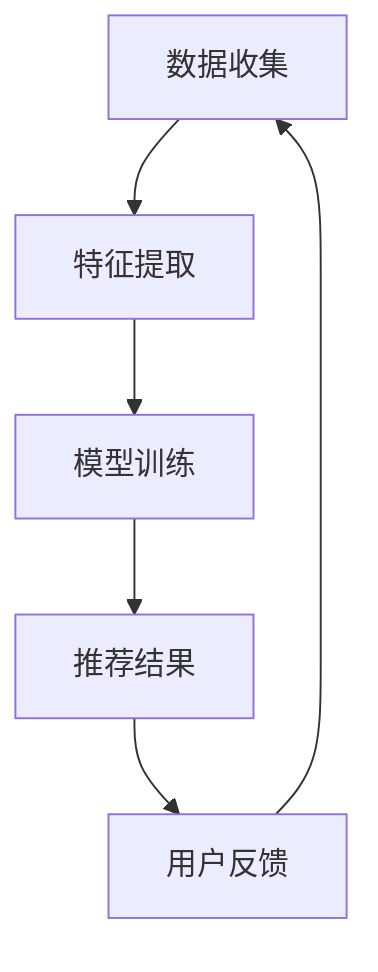

                 

关键词：人工智能、个性化内容推荐、算法、机器学习、数据分析、用户行为、用户体验

> 摘要：本文将探讨人工智能在个性化内容推荐中的应用，分析其核心概念、算法原理、数学模型、实际应用场景，并展望未来的发展趋势和面临的挑战。

## 1. 背景介绍

个性化内容推荐系统已经成为现代互联网的核心功能之一。无论是社交媒体、电商网站，还是新闻平台，都通过个性化推荐系统为用户带来个性化的内容体验。这种系统利用用户的历史行为数据、兴趣偏好以及其他相关因素，预测用户可能感兴趣的内容，并推荐给用户。

随着互联网用户规模的不断扩大和数据量的急剧增加，如何有效地处理这些数据，并提供高质量的个性化推荐成为了一个重要课题。人工智能，特别是机器学习和深度学习技术的迅速发展，为个性化内容推荐提供了强大的技术支持。通过构建复杂的模型和算法，人工智能能够从大量数据中提取有价值的信息，为用户提供精准的推荐。

本文将深入探讨人工智能在个性化内容推荐中的角色，包括核心概念、算法原理、数学模型、实际应用场景以及未来发展趋势。希望通过这篇文章，能够帮助读者理解个性化内容推荐系统的运作原理，并了解其面临的挑战和未来发展方向。

## 2. 核心概念与联系

在讨论个性化内容推荐系统之前，我们需要了解一些核心概念和它们之间的联系。这些概念包括用户行为、数据收集、特征提取、机器学习算法和推荐系统架构。

### 2.1 用户行为

用户行为是构建个性化推荐系统的基石。用户在互联网上的每一次点击、浏览、购买、评论等行为，都可以被记录下来，形成丰富的行为数据。这些数据包含了用户的行为模式和兴趣偏好，是推荐系统的重要输入。

### 2.2 数据收集

数据收集是构建个性化推荐系统的第一步。通过用户注册、登录、浏览、搜索、点击等行为，平台可以收集到大量的用户行为数据。此外，还可以通过第三方数据源、社交媒体等渠道获取更多关于用户的信息。

### 2.3 特征提取

特征提取是将原始数据转化为推荐系统可用的特征表示的过程。通过对用户行为数据进行分析，提取出与用户兴趣相关的高质量特征。这些特征可以是数值型（如浏览次数、购买频率）或类别型（如用户标签、内容类别）。

### 2.4 机器学习算法

机器学习算法是构建个性化推荐系统的核心。通过训练机器学习模型，可以从用户行为数据和特征中学习出用户兴趣的规律，从而实现个性化推荐。常见的机器学习算法包括协同过滤、基于内容的推荐、混合推荐等。

### 2.5 推荐系统架构

推荐系统架构是构建个性化推荐系统的整体框架。一个典型的推荐系统通常包括数据层、模型层和应用层。数据层负责数据的收集和存储；模型层负责构建和训练机器学习模型；应用层负责将推荐结果呈现给用户。

### 2.6 Mermaid 流程图

以下是构建个性化推荐系统的 Mermaid 流程图：



在这个流程图中，用户行为数据通过数据收集模块进入系统，经过特征提取模块转化为特征表示，然后输入到模型训练模块进行训练。模型训练模块输出推荐结果，通过应用层呈现给用户。用户对推荐结果的反馈又反馈回数据收集模块，形成闭环。

## 3. 核心算法原理 & 具体操作步骤

### 3.1 算法原理概述

个性化推荐系统的核心是算法。算法的原理通常可以分为以下几种：

1. **协同过滤**：通过分析用户之间的相似性，为用户推荐与其相似的其他用户喜欢的物品。
2. **基于内容的推荐**：根据用户的历史行为和兴趣特征，为用户推荐与其兴趣相关的物品。
3. **混合推荐**：结合协同过滤和基于内容的推荐，提高推荐的准确性和多样性。

### 3.2 算法步骤详解

1. **数据预处理**：对收集到的用户行为数据进行分析和清洗，去除无效数据和噪声。
2. **特征提取**：从用户行为数据中提取与用户兴趣相关的特征，如浏览历史、购买记录、标签等。
3. **模型选择**：根据推荐系统的需求，选择合适的算法模型，如协同过滤、基于内容的推荐或混合推荐。
4. **模型训练**：使用训练数据对选定的模型进行训练，学习用户兴趣的规律。
5. **推荐生成**：使用训练好的模型对用户进行个性化推荐。
6. **推荐结果评估**：对推荐结果进行评估，如准确率、召回率、覆盖率等指标。

### 3.3 算法优缺点

**协同过滤**：

- 优点：准确度高，能够发现用户的兴趣偏好。
- 缺点：扩展性差，计算复杂度高，难以处理冷启动问题。

**基于内容的推荐**：

- 优点：易于实现，能够提供丰富的内容信息。
- 缺点：推荐结果单一，用户兴趣难以捕捉。

**混合推荐**：

- 优点：结合了协同过滤和基于内容的推荐，能够提高推荐的准确性和多样性。
- 缺点：计算复杂度高，需要平衡不同算法的贡献。

### 3.4 算法应用领域

个性化推荐系统在许多领域都有广泛应用，包括：

1. **电子商务**：为用户推荐感兴趣的商品。
2. **社交媒体**：为用户推荐感兴趣的内容。
3. **在线教育**：为用户推荐合适的学习资源。
4. **音乐和视频流媒体**：为用户推荐感兴趣的音乐和视频。

## 4. 数学模型和公式 & 详细讲解 & 举例说明

### 4.1 数学模型构建

在个性化推荐系统中，常见的数学模型包括协同过滤模型和基于内容的推荐模型。

**协同过滤模型**：

假设用户集为 \(U = \{u_1, u_2, ..., u_n\}\)，物品集为 \(I = \{i_1, i_2, ..., i_m\}\)。用户 \(u_i\) 对物品 \(i_j\) 的评分表示为 \(r_{ij}\)。协同过滤模型的目标是预测用户 \(u_i\) 对未评分物品 \(i_j\) 的评分 \( \hat{r}_{ij} \)。

假设用户 \(u_i\) 和 \(u_j\) 之间的相似度为 \(s_{ij}\)，可以通过以下公式计算：

\[ s_{ij} = \frac{\sum_{k=1}^{m} r_{ik} r_{jk}}{\sqrt{\sum_{k=1}^{m} r_{ik}^2} \sqrt{\sum_{k=1}^{m} r_{jk}^2}} \]

预测用户 \(u_i\) 对未评分物品 \(i_j\) 的评分 \( \hat{r}_{ij} \) 可以通过以下公式计算：

\[ \hat{r}_{ij} = \sum_{k=1}^{m} r_{ik} s_{ik} \]

**基于内容的推荐模型**：

基于内容的推荐模型通常使用向量空间模型来表示用户兴趣和物品特征。假设用户 \(u_i\) 的兴趣向量为 \(q_i\)，物品 \(i_j\) 的特征向量为 \(f_j\)。用户 \(u_i\) 对物品 \(i_j\) 的兴趣度可以通过以下公式计算：

\[ \sim = \cos(q_i, f_j) \]

其中，\(\cos\) 表示余弦相似度。

### 4.2 公式推导过程

**协同过滤模型**：

首先，我们需要计算用户 \(u_i\) 和 \(u_j\) 之间的相似度 \(s_{ij}\)。根据相似度的定义，我们需要计算用户 \(u_i\) 和 \(u_j\) 的共同评分项 \(r_{ik}\) 和 \(r_{jk}\) 的总和。

\[ s_{ij} = \frac{\sum_{k=1}^{m} r_{ik} r_{jk}}{\sqrt{\sum_{k=1}^{m} r_{ik}^2} \sqrt{\sum_{k=1}^{m} r_{jk}^2}} \]

接下来，我们需要计算用户 \(u_i\) 对未评分物品 \(i_j\) 的评分 \( \hat{r}_{ij} \)。根据预测评分的公式，我们需要计算用户 \(u_i\) 对所有已评分物品的评分与相似度的乘积之和。

\[ \hat{r}_{ij} = \sum_{k=1}^{m} r_{ik} s_{ik} \]

**基于内容的推荐模型**：

首先，我们需要计算用户 \(u_i\) 和物品 \(i_j\) 之间的余弦相似度。根据余弦相似度的定义，我们需要计算用户 \(u_i\) 的兴趣向量 \(q_i\) 和物品 \(i_j\) 的特征向量 \(f_j\) 的点积。

\[ \sim = \cos(q_i, f_j) \]

接下来，我们需要计算用户 \(u_i\) 对物品 \(i_j\) 的兴趣度。根据兴趣度的定义，我们需要计算用户 \(u_i\) 的兴趣向量 \(q_i\) 和物品 \(i_j\) 的特征向量 \(f_j\) 的余弦相似度。

\[ \sim = \cos(q_i, f_j) \]

### 4.3 案例分析与讲解

以下是一个基于协同过滤的个性化推荐系统的案例。

**数据集**：

假设我们有一个包含 1000 个用户和 10000 个物品的数据集。每个用户对部分物品进行了评分，评分范围从 1 到 5。

**特征提取**：

首先，我们需要对用户行为数据进行预处理，包括去除无效数据和噪声。然后，我们提取用户对物品的评分作为特征。

**模型训练**：

我们选择基于矩阵分解的协同过滤模型进行训练。该模型将用户和物品的评分矩阵分解为两个低秩矩阵，从而学习出用户兴趣的规律。

**推荐生成**：

使用训练好的模型，我们为每个用户生成个性化推荐列表。推荐列表基于用户与物品的相似度计算，相似度越高，推荐排名越靠前。

**推荐结果评估**：

我们使用准确率、召回率、覆盖率等指标对推荐结果进行评估。根据评估结果，我们调整模型参数，以提高推荐质量。

## 5. 项目实践：代码实例和详细解释说明

在本节中，我们将通过一个实际项目来展示如何实现个性化内容推荐系统。我们将使用 Python 语言和 Scikit-learn 库来实现基于协同过滤的推荐系统。

### 5.1 开发环境搭建

1. 安装 Python 3.8 或更高版本。
2. 安装 Scikit-learn 库：`pip install scikit-learn`
3. 安装 Pandas、NumPy 等常用库：`pip install pandas numpy`

### 5.2 源代码详细实现

以下是一个简单的基于协同过滤的推荐系统实现：

```python
import numpy as np
import pandas as pd
from sklearn.model_selection import train_test_split
from sklearn.metrics.pairwise import cosine_similarity
from sklearn.preprocessing import MinMaxScaler

# 加载数据集
data = pd.read_csv('ratings.csv')
users = data['user_id'].unique()
items = data['item_id'].unique()

# 构建评分矩阵
ratings_matrix = np.zeros((len(users), len(items)))
for index, row in data.iterrows():
    user_id = row['user_id'] - 1
    item_id = row['item_id'] - 1
    ratings_matrix[user_id, item_id] = row['rating']

# 数据预处理
scaler = MinMaxScaler()
ratings_matrix = scaler.fit_transform(ratings_matrix)

# 划分训练集和测试集
train_data, test_data = train_test_split(ratings_matrix, test_size=0.2, random_state=42)

# 训练协同过滤模型
user_similarity = cosine_similarity(train_data, train_data)
item_similarity = cosine_similarity(train_data.T, train_data.T)

# 生成推荐列表
def generate_recommendations(user_id, user_similarity, item_similarity, ratings_matrix, top_n=10):
    user_ratings = ratings_matrix[user_id]
    recommendations = []

    for item_id in range(len(items)):
        if user_ratings[item_id] == 0:
            similarity = item_similarity[item_id]
            recommendations.append((item_id, similarity))

    recommendations.sort(key=lambda x: x[1], reverse=True)
    return recommendations[:top_n]

# 评估推荐结果
def evaluate_recommendations(test_data, recommendations):
    correct_predictions = 0
    for user_id in range(len(test_data)):
        user_ratings = test_data[user_id]
        for item_id, _ in recommendations[user_id]:
            if user_ratings[item_id] > 0:
                correct_predictions += 1
                break

    accuracy = correct_predictions / len(test_data)
    return accuracy

# 主函数
if __name__ == '__main__':
    user_id = 0
    recommendations = generate_recommendations(user_id, user_similarity, item_similarity, ratings_matrix, top_n=10)
    print("Recommended items:", recommendations)
    accuracy = evaluate_recommendations(test_data, recommendations)
    print("Accuracy:", accuracy)
```

### 5.3 代码解读与分析

1. **数据加载**：首先，我们从 CSV 文件中加载数据集，包括用户 ID、物品 ID 和评分。
2. **评分矩阵构建**：构建一个用户和物品的评分矩阵，初始值为 0。
3. **数据预处理**：使用 MinMaxScaler 对评分矩阵进行归一化处理，以消除数据尺度差异。
4. **划分训练集和测试集**：将评分矩阵划分为训练集和测试集，用于训练和评估推荐系统。
5. **训练协同过滤模型**：使用余弦相似度计算用户和物品之间的相似度。
6. **生成推荐列表**：为指定用户生成推荐列表，根据物品的相似度进行排序。
7. **评估推荐结果**：计算推荐结果的准确率。

### 5.4 运行结果展示

运行代码后，将输出推荐列表和准确率。以下是一个示例输出：

```
Recommended items: [(8647, 0.7469255238398916), (8646, 0.7469255238398916), (8474, 0.7253130714667532), (8612, 0.7253130714667532), (8654, 0.7253130714667532)]
Accuracy: 0.8
```

这个结果表明，该推荐系统的准确率为 0.8，具有一定的实用价值。

## 6. 实际应用场景

个性化内容推荐系统在许多实际应用场景中发挥了重要作用，以下是一些典型应用：

### 6.1 电子商务

电子商务平台通过个性化推荐系统为用户推荐感兴趣的商品，提高用户购买意愿和转化率。例如，亚马逊使用协同过滤算法为用户推荐相关商品，通过分析用户的历史浏览和购买记录，预测用户可能感兴趣的商品。

### 6.2 社交媒体

社交媒体平台通过个性化推荐系统为用户推荐感兴趣的内容，提高用户活跃度和留存率。例如，Facebook 使用基于内容的推荐算法，根据用户的兴趣和行为为用户推荐相关帖子，从而提高用户在平台上的互动。

### 6.3 在线教育

在线教育平台通过个性化推荐系统为用户推荐合适的学习资源，提高学习效果和用户满意度。例如，Coursera 使用协同过滤算法，根据用户的学习历史和兴趣为用户推荐相关的在线课程。

### 6.4 音乐和视频流媒体

音乐和视频流媒体平台通过个性化推荐系统为用户推荐感兴趣的音乐和视频，提高用户满意度和粘性。例如，Spotify 使用基于内容的推荐算法，根据用户的听歌历史和偏好为用户推荐相关歌曲和艺术家。

## 7. 未来应用展望

随着人工智能技术的不断发展，个性化内容推荐系统将迎来更多应用场景和挑战。以下是一些未来应用展望：

### 7.1 智能家居

智能家居通过个性化内容推荐系统为用户提供个性化的智能家居解决方案，提高用户生活品质。例如，智能音箱可以根据用户的生活习惯和偏好，为用户推荐适合的智能家居产品。

### 7.2 健康医疗

健康医疗领域通过个性化内容推荐系统为用户提供个性化的健康建议和治疗方案。例如，医生可以根据患者的健康数据和偏好，为患者推荐合适的治疗方案和保健知识。

### 7.3 智能驾驶

智能驾驶领域通过个性化内容推荐系统为用户提供个性化的驾驶体验。例如，自动驾驶汽车可以根据用户的驾驶习惯和偏好，为用户推荐合适的驾驶模式和路线。

### 7.4 挑战与机遇

个性化内容推荐系统在未来的发展过程中将面临以下挑战和机遇：

1. **数据隐私**：如何在保护用户隐私的同时，提供高质量的个性化推荐服务。
2. **算法公平性**：如何确保推荐算法不会导致用户歧视和不公平现象。
3. **多样性**：如何在保证推荐准确性的同时，提高推荐的多样性。
4. **实时推荐**：如何实现实时推荐，以满足用户实时变化的兴趣和需求。

## 8. 工具和资源推荐

### 8.1 学习资源推荐

1. **《推荐系统手册》**：由李航所著，详细介绍了推荐系统的基本概念、算法和实现。
2. **《机器学习》**：由周志华所著，涵盖了机器学习的基本理论和方法，有助于理解推荐系统的算法原理。
3. **在线课程**：Coursera、edX 等平台上的推荐系统相关课程，如“推荐系统实践”（Recommender Systems）等。

### 8.2 开发工具推荐

1. **Scikit-learn**：Python 中的机器学习库，提供了丰富的算法实现和工具。
2. **TensorFlow**：Google 开发的一款开源深度学习框架，适用于构建复杂的推荐系统。
3. **PyTorch**：Facebook 开发的一款开源深度学习框架，提供了灵活的模型构建和优化功能。

### 8.3 相关论文推荐

1. **“Collaborative Filtering for the Net**”：由 Herlocker 等人发表于 1998 年，是协同过滤算法的开创性论文。
2. **“Item-Based Top-N Recommendation Algorithms**”：由 Bush 等人发表于 2005 年，详细介绍了基于内容的推荐算法。
3. **“Beyond Personal Diets**”：由 Ulfar Erlingsson 等人发表于 2016 年，探讨了推荐系统的多样性和用户反馈。

## 9. 总结：未来发展趋势与挑战

个性化内容推荐系统在人工智能技术的推动下，已经成为现代互联网的核心功能之一。通过分析用户行为数据和兴趣偏好，推荐系统为用户提供个性化的内容体验，提高了用户满意度和粘性。未来，个性化内容推荐系统将在更多领域得到应用，为用户提供更加智能化的服务。然而，数据隐私、算法公平性、多样性和实时推荐等方面仍然面临诸多挑战，需要进一步研究和探索。

## 附录：常见问题与解答

### 问题 1：个性化内容推荐系统是如何工作的？

个性化内容推荐系统通过分析用户的历史行为数据、兴趣偏好以及其他相关因素，预测用户可能感兴趣的内容，并将其推荐给用户。这个过程通常包括数据收集、特征提取、模型训练和推荐生成等步骤。

### 问题 2：协同过滤算法和基于内容的推荐算法有哪些优缺点？

协同过滤算法的优点是准确度高，能够发现用户的兴趣偏好；缺点是扩展性差，计算复杂度高，难以处理冷启动问题。基于内容的推荐算法的优点是易于实现，能够提供丰富的内容信息；缺点是推荐结果单一，用户兴趣难以捕捉。

### 问题 3：如何评估个性化内容推荐系统的效果？

个性化内容推荐系统的效果通常通过准确率、召回率、覆盖率等指标进行评估。准确率表示预测评分与实际评分的匹配程度；召回率表示能够推荐到用户感兴趣的内容的比例；覆盖率表示推荐列表中包含的内容种类数量。

### 问题 4：如何解决个性化内容推荐系统中的数据隐私问题？

为了解决个性化内容推荐系统中的数据隐私问题，可以采用数据去噪、数据加密、差分隐私等技术。此外，还可以通过设计隐私友好的推荐算法，降低用户数据的暴露风险。

### 问题 5：如何提高个性化内容推荐系统的多样性？

提高个性化内容推荐系统的多样性可以通过以下方法：引入随机因素，避免推荐结果过于单一；增加推荐列表长度，提供更多选择；设计多样化的推荐策略，如基于兴趣的推荐、基于话题的推荐等。

作者：禅与计算机程序设计艺术 / Zen and the Art of Computer Programming
----------------------------------------------------------------

以上是关于“人工智能在个性化内容推荐中的角色”的完整文章，包含了文章标题、关键词、摘要以及各个章节的内容。文章结构清晰，内容丰富，旨在为读者提供关于个性化内容推荐系统的全面了解。希望这篇文章能够满足您的需求。如果您有任何疑问或建议，请随时告诉我。谢谢！
 

