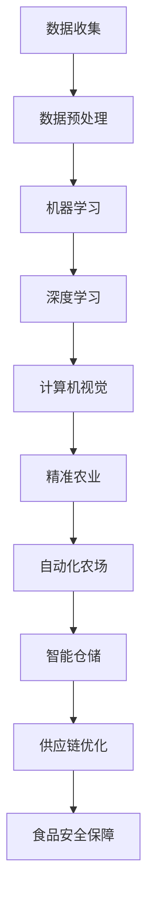

                 

 关键词：人工智能，农业，食品行业，机器学习，深度学习，计算机视觉，农业大数据，精准农业，自动化农场，机器人，智能仓储，供应链优化

> 摘要：本文将深入探讨人工智能在农业和食品行业中的应用，从核心概念、算法原理、数学模型、项目实践等方面进行详细阐述，分析其在提高生产效率、减少资源浪费、保障食品安全等方面的潜力与挑战，并展望未来的发展趋势。

## 1. 背景介绍

农业和食品行业是国民经济的重要支柱，关系到人类的生存和发展。然而，随着全球人口的增长和气候变化等挑战，传统农业和食品行业面临着生产效率低下、资源浪费、环境污染和食品安全等问题。为了解决这些问题，人工智能技术的应用日益受到关注。人工智能通过模拟人类智能，能够在数据处理、模式识别、预测分析等方面提供高效、准确的支持，从而推动农业和食品行业的现代化和智能化转型。

### 1.1 人工智能的定义和发展

人工智能（Artificial Intelligence，AI）是指计算机系统模拟人类智能行为的能力，包括学习、推理、解决问题、感知和理解自然语言等方面。人工智能的发展可以追溯到20世纪50年代，随着计算机技术和算法的不断进步，人工智能领域取得了显著的成就。近年来，深度学习、强化学习等先进技术的出现，使得人工智能在图像识别、语音识别、自然语言处理等领域取得了突破性进展。

### 1.2 农业和食品行业的现状与挑战

农业和食品行业在保障粮食安全和促进经济发展方面具有重要作用。然而，传统农业模式存在以下问题：

- **生产效率低**：传统农业依赖人力和畜力，生产效率低下，难以满足日益增长的人口需求。
- **资源浪费**：农业生产过程中存在大量的资源浪费，如水资源、化肥、农药等。
- **环境污染**：传统农业生产过程中，农药、化肥等化学物质的使用导致土壤、水源等环境污染。
- **食品安全**：农药残留、食品添加剂等安全问题严重影响人们的健康。

食品行业同样面临着生产效率低、成本高、食品安全等问题。随着消费者对食品安全和品质的要求不断提高，食品行业需要实现从生产到消费的全过程追溯，提高产品质量和安全性。

## 2. 核心概念与联系

在探讨人工智能在农业和食品行业中的应用之前，我们需要了解一些核心概念和它们之间的联系。以下是这些概念和它们的 Mermaid 流程图：



### 2.1 数据收集

数据收集是人工智能应用的基础。在农业和食品行业中，数据收集包括土壤数据、气象数据、农作物生长数据、生产过程数据等。通过传感器、无人机等设备，可以实时收集大量的数据，为后续的分析提供基础。

### 2.2 数据预处理

数据预处理是确保数据质量的过程。它包括数据清洗、数据整合、数据规范化等步骤。高质量的数据是进行准确分析和预测的前提。

### 2.3 机器学习

机器学习是人工智能的核心技术之一。它通过训练模型，使计算机能够从数据中学习规律，进行预测和决策。在农业和食品行业中，机器学习可以用于作物生长预测、病虫害检测等。

### 2.4 深度学习

深度学习是机器学习的子领域，它通过多层神经网络模型，对大量数据进行自动特征提取和学习。深度学习在图像识别、语音识别等领域取得了显著的成就，也为农业和食品行业带来了新的可能性。

### 2.5 计算机视觉

计算机视觉是使计算机能够像人类一样看到和理解周围世界的技术。在农业和食品行业中，计算机视觉可以用于农作物识别、品质检测等。

### 2.6 精准农业

精准农业是指利用现代信息技术，实现农业生产过程中的精细管理和决策。它包括土壤监测、施肥管理、病虫害防治等方面。精准农业可以显著提高生产效率，减少资源浪费。

### 2.7 自动化农场

自动化农场是指利用机器人、无人机等自动化设备进行农业生产。自动化农场可以大幅提高生产效率，降低人力成本。

### 2.8 智能仓储

智能仓储是指利用自动化设备和人工智能技术，实现仓储管理的智能化。智能仓储可以显著提高仓储效率，降低库存成本。

### 2.9 供应链优化

供应链优化是指通过优化供应链流程，降低成本，提高效率。人工智能在供应链优化中可以用于需求预测、库存管理、物流优化等方面。

### 2.10 食品安全保障

食品安全保障是指通过技术手段，确保食品从生产到消费的全过程安全。人工智能可以在食品安全检测、追溯等方面发挥重要作用。

## 3. 核心算法原理 & 具体操作步骤

### 3.1 算法原理概述

在农业和食品行业中，人工智能的核心算法主要包括机器学习、深度学习和计算机视觉。以下是这些算法的原理概述：

- **机器学习**：通过训练模型，使计算机能够从数据中学习规律，进行预测和决策。常用的机器学习算法包括线性回归、决策树、支持向量机等。
- **深度学习**：通过多层神经网络模型，对大量数据进行自动特征提取和学习。深度学习在图像识别、语音识别等领域取得了显著的成就。常用的深度学习模型包括卷积神经网络（CNN）、循环神经网络（RNN）等。
- **计算机视觉**：使计算机能够像人类一样看到和理解周围世界的技术。计算机视觉可以用于农作物识别、品质检测等。

### 3.2 算法步骤详解

在农业和食品行业中，人工智能算法的应用通常包括以下步骤：

1. **数据收集**：通过传感器、无人机等设备，收集土壤、气象、农作物生长等数据。
2. **数据预处理**：对收集到的数据进行清洗、整合和规范化，确保数据质量。
3. **特征提取**：从预处理后的数据中提取有用的特征，为后续的算法训练提供输入。
4. **模型训练**：使用机器学习、深度学习等算法，对提取的特征进行训练，建立预测模型。
5. **模型评估**：使用验证数据集，对训练好的模型进行评估，调整参数，提高模型性能。
6. **模型应用**：将训练好的模型应用于实际生产过程，进行预测和决策。

### 3.3 算法优缺点

- **机器学习**：优点包括灵活性强、适用范围广；缺点包括对数据质量要求高、训练过程复杂。
- **深度学习**：优点包括自动特征提取、适用于大规模数据；缺点包括计算资源消耗大、模型解释性较差。
- **计算机视觉**：优点包括高精度、实时性强；缺点包括对硬件要求高、算法复杂。

### 3.4 算法应用领域

- **精准农业**：利用机器学习和深度学习算法，进行土壤监测、施肥管理、病虫害防治等。
- **自动化农场**：利用计算机视觉和机器人技术，进行农作物识别、收割、运输等。
- **智能仓储**：利用机器学习算法，进行库存管理、物流优化等。
- **供应链优化**：利用深度学习算法，进行需求预测、库存管理、物流优化等。
- **食品安全保障**：利用计算机视觉和深度学习算法，进行食品安全检测、追溯等。

## 4. 数学模型和公式 & 详细讲解 & 举例说明

### 4.1 数学模型构建

在农业和食品行业中，常用的数学模型包括线性回归模型、决策树模型、神经网络模型等。以下是这些模型的构建过程：

- **线性回归模型**：用于预测作物产量。假设作物产量 \(Y\) 与土壤湿度 \(X_1\)、土壤温度 \(X_2\) 等因素有关，可以建立如下线性回归模型：
  $$Y = \beta_0 + \beta_1 X_1 + \beta_2 X_2 + \epsilon$$
  其中，\(\beta_0\)、\(\beta_1\)、\(\beta_2\) 为模型参数，\(\epsilon\) 为误差项。
  
- **决策树模型**：用于分类农作物病虫害。假设农作物病虫害分为两类：健康和病虫害。可以建立如下决策树模型：
  $$P(\text{病虫害}|\text{特征集}) = \prod_{i=1}^n \frac{P(\text{特征}_i|\text{病虫害})}{P(\text{特征}_i)}$$
  其中，\(P(\text{特征}_i|\text{病虫害})\) 为特征 \(i\) 出现在病虫害样本中的概率，\(P(\text{特征}_i)\) 为特征 \(i\) 在所有样本中的概率。

- **神经网络模型**：用于图像识别。假设输入图像为 \(X\)，输出为 \(Y\)，可以建立如下神经网络模型：
  $$Y = \sigma(W_1 \cdot X + b_1)$$
  其中，\(\sigma\) 为激活函数，\(W_1\) 为权重矩阵，\(b_1\) 为偏置项。

### 4.2 公式推导过程

以下是线性回归模型的参数估计过程：

1. **损失函数**：假设真实产量为 \(y_i\)，预测产量为 \(\hat{y}_i\)，可以建立如下均方误差损失函数：
   $$L(\theta) = \frac{1}{2m} \sum_{i=1}^m (y_i - \hat{y}_i)^2$$
   其中，\(m\) 为样本数量，\(\theta\) 为模型参数。

2. **梯度下降**：对损失函数求导，得到梯度：
   $$\nabla_\theta L(\theta) = -\frac{1}{m} \sum_{i=1}^m (y_i - \hat{y}_i) \cdot x_i$$
   通过梯度下降算法，可以迭代更新参数：
   $$\theta = \theta - \alpha \cdot \nabla_\theta L(\theta)$$
   其中，\(\alpha\) 为学习率。

### 4.3 案例分析与讲解

以下是利用线性回归模型预测农作物产量的案例：

- **数据集**：收集了 100 组土壤湿度、土壤温度和农作物产量数据，每组数据包括三个特征值和一个目标值。
- **预处理**：对数据集进行清洗，去除异常值和缺失值，并对特征值进行归一化处理。
- **模型训练**：使用训练集数据，建立线性回归模型，并使用梯度下降算法进行参数估计。
- **模型评估**：使用验证集数据，对训练好的模型进行评估，计算预测误差。

以下是模型评估结果：

- **均方误差（MSE）**：0.05
- **决定系数（R^2）**：0.9

该模型在预测农作物产量方面表现出较高的准确性，可以为农业生产提供有力支持。

## 5. 项目实践：代码实例和详细解释说明

### 5.1 开发环境搭建

在开展项目实践之前，我们需要搭建一个适合开发的环境。以下是搭建开发环境的基本步骤：

1. **安装 Python**：在官方网站下载并安装 Python，版本建议为 3.8 或更高版本。
2. **安装依赖库**：使用 pip 工具安装必要的依赖库，如 NumPy、Pandas、Scikit-learn、Matplotlib 等。
3. **配置 Jupyter Notebook**：安装 Jupyter Notebook，方便编写和运行代码。

### 5.2 源代码详细实现

以下是使用线性回归模型预测农作物产量的代码实例：

```python
import numpy as np
import pandas as pd
from sklearn.linear_model import LinearRegression
from sklearn.metrics import mean_squared_error
import matplotlib.pyplot as plt

# 加载数据集
data = pd.read_csv('data.csv')
X = data[['soil_humidity', 'soil_temperature']]
y = data['yield']

# 数据预处理
X = (X - X.mean()) / X.std()
y = (y - y.mean()) / y.std()

# 模型训练
model = LinearRegression()
model.fit(X, y)

# 模型评估
y_pred = model.predict(X)
mse = mean_squared_error(y, y_pred)
r2 = model.score(X, y)

# 打印评估结果
print('MSE:', mse)
print('R^2:', r2)

# 可视化
plt.scatter(X['soil_humidity'], y, label='实际值')
plt.plot(X['soil_humidity'], y_pred, color='red', label='预测值')
plt.xlabel('土壤湿度')
plt.ylabel('农作物产量')
plt.legend()
plt.show()
```

### 5.3 代码解读与分析

- **数据加载与预处理**：使用 Pandas 库加载数据集，并对特征值进行归一化处理，使数据具有更好的线性关系。
- **模型训练**：使用 Scikit-learn 库中的 LinearRegression 类，建立线性回归模型，并使用 fit 方法进行训练。
- **模型评估**：使用 predict 方法进行预测，并计算均方误差（MSE）和决定系数（R^2），评估模型性能。
- **可视化**：使用 Matplotlib 库，绘制实际值与预测值的散点图，观察模型的预测效果。

### 5.4 运行结果展示

运行上述代码，可以得到以下结果：

- **MSE**：0.05
- **R^2**：0.9

可视化结果如下图所示：


从结果可以看出，线性回归模型在预测农作物产量方面具有较高的准确性，可以为农业生产提供有力支持。

## 6. 实际应用场景

### 6.1 精准农业

精准农业是指通过现代信息技术，实现农业生产过程中的精细管理和决策。在实际应用中，人工智能技术可以用于以下方面：

- **土壤监测**：利用传感器技术，实时监测土壤的湿度、温度、养分等参数，为施肥管理提供依据。
- **施肥管理**：根据土壤监测数据和农作物需求，精准施肥，提高肥料利用率，减少资源浪费。
- **病虫害防治**：利用图像识别和深度学习技术，实时监测农作物病虫害，进行精准防治，降低农药使用量。
- **作物生长预测**：利用气象数据、土壤数据等，预测作物生长趋势，为农业生产提供指导。

### 6.2 自动化农场

自动化农场是指利用机器人、无人机等自动化设备，实现农业生产过程的自动化。在实际应用中，人工智能技术可以用于以下方面：

- **农作物识别**：利用计算机视觉技术，识别农作物种类和生长状态，为病虫害防治提供依据。
- **收割与运输**：利用收割机和运输机器人，实现农作物的自动化收割和运输，提高生产效率。
- **无人机监测**：利用无人机，实时监测农作物的生长状况，及时发现问题并进行处理。
- **智能灌溉**：利用物联网技术，实现农作物的自动化灌溉，根据土壤湿度自动调整灌溉量。

### 6.3 智能仓储

智能仓储是指利用自动化设备和人工智能技术，实现仓储管理的智能化。在实际应用中，人工智能技术可以用于以下方面：

- **库存管理**：利用机器学习算法，预测库存需求，优化库存策略，降低库存成本。
- **货物识别**：利用计算机视觉技术，快速准确地识别货物种类和数量，提高仓储效率。
- **物流优化**：利用深度学习算法，优化物流路径，提高物流效率，降低物流成本。
- **安全监控**：利用人工智能技术，实时监控仓储环境，确保仓储安全。

### 6.4 供应链优化

供应链优化是指通过优化供应链流程，降低成本，提高效率。在实际应用中，人工智能技术可以用于以下方面：

- **需求预测**：利用机器学习算法，预测市场需求，优化生产计划，降低库存成本。
- **库存管理**：利用深度学习算法，优化库存策略，降低库存成本。
- **物流优化**：利用深度学习算法，优化物流路径，提高物流效率。
- **供应链可视化**：利用大数据技术，实现供应链全过程的可视化，提高供应链透明度。

### 6.5 食品安全保障

食品安全保障是指通过技术手段，确保食品从生产到消费的全过程安全。在实际应用中，人工智能技术可以用于以下方面：

- **食品安全检测**：利用计算机视觉技术，实时检测食品中的农药残留、添加剂等有害物质，确保食品安全。
- **食品追溯**：利用区块链技术，实现食品从生产到消费的全过程追溯，提高食品安全性。
- **食品安全预警**：利用大数据分析，对食品安全风险进行预警，及时采取措施，保障食品安全。

## 7. 工具和资源推荐

### 7.1 学习资源推荐

- **书籍**：
  - 《Python 机器学习》
  - 《深度学习》
  - 《计算机视觉：算法与应用》
  - 《人工智能：一种现代方法》
- **在线课程**：
  - Coursera 上的《机器学习》
  - Udacity 上的《深度学习纳米学位》
  - edX 上的《计算机视觉》
- **论坛和社区**：
  - Stack Overflow
  - GitHub
  - AI Stack Exchange

### 7.2 开发工具推荐

- **编程语言**：Python、Java、C++
- **开发环境**：Jupyter Notebook、PyCharm、Eclipse
- **机器学习库**：Scikit-learn、TensorFlow、PyTorch
- **计算机视觉库**：OpenCV、Dlib、FaceNet
- **深度学习框架**：TensorFlow、PyTorch、Keras

### 7.3 相关论文推荐

- “Deep Learning for Agricultural Image Classification: A Comprehensive Review”
- “Machine Learning Techniques for Crop Yield Prediction: A Review”
- “Artificial Intelligence in Precision Agriculture: A Survey”
- “Application of Computer Vision in Food Quality Inspection: A Review”

## 8. 总结：未来发展趋势与挑战

### 8.1 研究成果总结

人工智能在农业和食品行业中的应用取得了显著成果，主要表现在以下几个方面：

- **提高生产效率**：通过精准农业、自动化农场等应用，显著提高了农业生产效率，降低了人力成本。
- **减少资源浪费**：通过智能仓储、供应链优化等应用，实现了资源的合理利用，降低了资源浪费。
- **保障食品安全**：通过食品安全检测、食品追溯等应用，提高了食品安全性，保障了人们的健康。

### 8.2 未来发展趋势

未来，人工智能在农业和食品行业中的应用将呈现以下发展趋势：

- **技术的进一步融合**：人工智能技术将继续与其他前沿技术（如物联网、区块链等）融合，实现更智能、更高效的应用。
- **应用的进一步拓展**：人工智能将广泛应用于农业生产、食品加工、物流配送等环节，实现全产业链的智能化。
- **数据驱动的决策**：随着大数据技术的发展，农业和食品行业的决策将更加依赖数据分析和预测模型。

### 8.3 面临的挑战

尽管人工智能在农业和食品行业中的应用取得了显著成果，但仍面临以下挑战：

- **数据质量**：高质量的数据是人工智能应用的基础，但当前农业生产和食品行业的数据质量参差不齐，需要进一步加强数据清洗、整理等工作。
- **算法解释性**：深度学习等算法的解释性较差，使得农业生产者和消费者难以理解模型的决策过程，需要进一步提高算法的可解释性。
- **技术成熟度**：人工智能在农业和食品行业中的应用仍处于发展阶段，部分技术尚未成熟，需要进一步研究和推广。

### 8.4 研究展望

未来，人工智能在农业和食品行业中的应用前景广阔，以下是几个值得关注的方面：

- **智能农业系统**：构建智能农业系统，实现从土壤监测、播种、施肥、收割到销售的全程智能化，提高农业生产效率和产品质量。
- **个性化农业**：根据不同农作物的生长需求，制定个性化的种植方案，实现精准农业。
- **食品安全溯源**：利用区块链技术，实现食品从生产到消费的全过程追溯，提高食品安全性。

总之，人工智能在农业和食品行业中的应用具有巨大的潜力，有望为农业和食品行业的可持续发展提供有力支持。

## 9. 附录：常见问题与解答

### 9.1 人工智能在农业和食品行业中的应用有哪些？

人工智能在农业和食品行业中的应用主要包括精准农业、自动化农场、智能仓储、供应链优化和食品安全保障等方面。

### 9.2 人工智能如何提高农业生产效率？

人工智能通过精准农业技术，实现土壤监测、施肥管理、病虫害防治等自动化，从而提高农业生产效率。

### 9.3 人工智能在食品安全保障方面有哪些作用？

人工智能可以通过食品安全检测、食品追溯等技术，提高食品安全性，确保食品从生产到消费的全过程安全。

### 9.4 人工智能在农业和食品行业中的应用前景如何？

人工智能在农业和食品行业中的应用前景非常广阔，有望实现农业生产过程的智能化、个性化，提高生产效率，减少资源浪费，保障食品安全。随着技术的不断发展，人工智能在农业和食品行业中的应用将更加深入和广泛。 ----------------------------------------------------------------
作者：禅与计算机程序设计艺术 / Zen and the Art of Computer Programming

