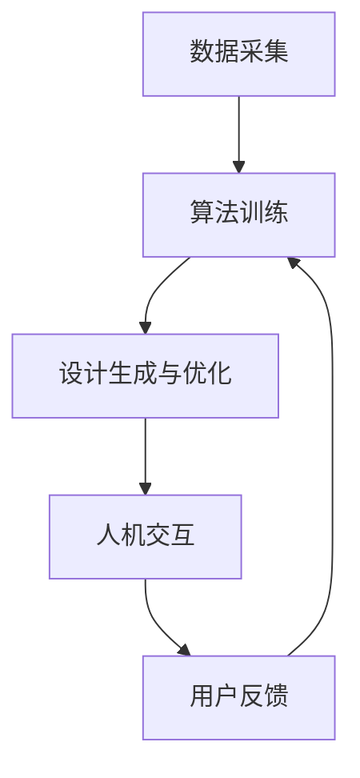

                 

 关键词：人工智能、创意产业、设计、创作、辅助设计、自动化设计、人工智能算法、设计优化、设计自动化、智能创作、创意生成、计算机视觉、自然语言处理、艺术与设计融合。

> 摘要：本文旨在探讨人工智能在创意产业中的应用，特别是如何利用人工智能辅助设计与创作。通过深入分析人工智能算法、技术原理以及实际应用案例，本文将揭示人工智能技术在提升设计效率、优化创作流程和激发创意潜能方面的巨大潜力。

## 1. 背景介绍

创意产业是一个充满活力和创新力的领域，涵盖了设计、艺术、媒体、娱乐等多个行业。传统的设计与创作过程往往依赖于设计师的直觉、经验和技巧，而随着科技的不断发展，人工智能（AI）开始逐渐崭露头角，成为辅助甚至主导创意过程的工具。

人工智能是一种模拟人类智能行为的计算机系统，具有学习、推理、自我优化等能力。在创意产业中，人工智能可以通过各种算法和模型，实现自动化设计、智能创作和设计优化等功能。这不仅提高了设计效率，还带来了前所未有的创意可能性。

本文将重点关注人工智能在以下方面的应用：

- **辅助设计**：利用人工智能技术自动生成设计方案，辅助设计师进行优化和调整。
- **智能创作**：利用自然语言处理和计算机视觉技术，生成新的创意内容和艺术作品。
- **设计优化**：通过算法分析，找出设计方案中的不足之处，并提出优化建议。

## 2. 核心概念与联系

### 2.1. 人工智能算法概述

人工智能算法是使计算机系统能够模拟人类智能行为的一系列规则和策略。在创意产业中，常用的算法包括：

- **生成对抗网络（GAN）**：通过训练两个神经网络（生成器和判别器）相互博弈，生成高质量的艺术作品。
- **卷积神经网络（CNN）**：在图像识别和生成领域有着广泛的应用，可以用于自动生成视觉创意。
- **深度强化学习**：通过学习环境中的奖励机制，使计算机系统自动优化设计流程和创作策略。

### 2.2. 人工智能与创意产业的融合架构

人工智能与创意产业的融合架构主要包括以下几个核心组成部分：

- **数据采集**：收集设计作品、用户反馈、市场趋势等数据，为人工智能算法提供训练素材。
- **算法训练**：利用大量数据对人工智能算法进行训练，提高其设计优化和创作能力。
- **设计生成与优化**：通过人工智能算法自动生成设计方案，并根据用户反馈和算法分析进行优化。
- **人机交互**：设计师与人工智能系统的交互界面，用于实时反馈、调整和优化设计过程。

### 2.3. Mermaid 流程图



## 3. 核心算法原理 & 具体操作步骤

### 3.1. 算法原理概述

在创意产业中，人工智能算法主要分为以下几类：

- **生成对抗网络（GAN）**：通过生成器和判别器之间的博弈，生成高质量的艺术作品。
- **卷积神经网络（CNN）**：利用深度学习模型对图像进行特征提取和分类，生成新的视觉创意。
- **深度强化学习**：通过学习环境中的奖励机制，自动优化设计流程和创作策略。

### 3.2. 算法步骤详解

#### 3.2.1. 生成对抗网络（GAN）

1. **初始化**：生成器（G）和判别器（D）。
2. **生成与判别**：生成器生成艺术作品，判别器判断作品的真实性。
3. **反馈与优化**：根据判别器的反馈，优化生成器。
4. **生成高质量作品**：经过多次迭代，生成器生成高质量的艺术作品。

#### 3.2.2. 卷积神经网络（CNN）

1. **输入层**：接收图像数据。
2. **卷积层**：对图像进行卷积操作，提取特征。
3. **池化层**：对特征进行降维处理。
4. **全连接层**：将特征映射到输出结果。
5. **输出层**：生成新的视觉创意。

#### 3.2.3. 深度强化学习

1. **初始化**：定义环境、状态、动作和奖励。
2. **状态评估**：根据当前状态评估动作的优劣。
3. **动作选择**：根据评估结果选择最优动作。
4. **环境互动**：执行动作，获得奖励。
5. **策略优化**：根据奖励结果优化策略。
6. **持续迭代**：不断优化设计流程和创作策略。

### 3.3. 算法优缺点

#### 3.3.1. 生成对抗网络（GAN）

- **优点**：能够生成高质量的艺术作品，具有强大的创作能力。
- **缺点**：训练过程复杂，易出现模式崩溃现象。

#### 3.3.2. 卷积神经网络（CNN）

- **优点**：在图像识别和生成领域具有强大的能力，适用于视觉创意生成。
- **缺点**：对数据量和计算资源要求较高。

#### 3.3.3. 深度强化学习

- **优点**：能够自动优化设计流程和创作策略，适用于复杂环境。
- **缺点**：训练时间较长，对环境和奖励机制要求较高。

### 3.4. 算法应用领域

- **设计优化**：通过算法分析，优化设计方案，提高设计效率。
- **创意生成**：利用算法生成新的创意内容，激发设计灵感。
- **智能助手**：为设计师提供智能建议，辅助创作过程。

## 4. 数学模型和公式 & 详细讲解 & 举例说明

### 4.1. 数学模型构建

在人工智能辅助设计与创作中，常用的数学模型包括生成对抗网络（GAN）、卷积神经网络（CNN）和深度强化学习（DRL）。下面分别介绍这些模型的数学原理。

#### 4.1.1. 生成对抗网络（GAN）

生成对抗网络（GAN）由两部分组成：生成器（G）和判别器（D）。生成器生成虚假数据，判别器判断数据的真实性。GAN的损失函数包括生成器损失和判别器损失：

$$
L_G = -\log(D(G(z)))
$$

$$
L_D = -[\log(D(x)) + \log(1 - D(G(z))]
$$

其中，$x$ 表示真实数据，$z$ 表示随机噪声。

#### 4.1.2. 卷积神经网络（CNN）

卷积神经网络（CNN）主要包括卷积层、池化层和全连接层。卷积层通过卷积操作提取图像特征，池化层对特征进行降维处理，全连接层将特征映射到输出结果。CNN的损失函数通常采用交叉熵损失：

$$
L = -\sum_{i=1}^{N} y_i \log(p_i)
$$

其中，$y_i$ 表示真实标签，$p_i$ 表示预测概率。

#### 4.1.3. 深度强化学习（DRL）

深度强化学习（DRL）通过学习环境中的奖励机制，优化策略。DRL的损失函数通常采用价值函数的形式：

$$
L = -\sum_{t=0}^{T} \gamma^t r_t
$$

其中，$r_t$ 表示在时刻 $t$ 的奖励，$\gamma$ 表示折扣因子。

### 4.2. 公式推导过程

下面以生成对抗网络（GAN）为例，介绍其损失函数的推导过程。

1. **生成器损失**：

生成器的目标是使判别器难以区分生成的数据和真实数据。因此，生成器的损失函数为：

$$
L_G = -\log(D(G(z)))
$$

其中，$D(G(z))$ 表示判别器对生成数据的判断概率。

2. **判别器损失**：

判别器的目标是正确判断生成的数据和真实数据。因此，判别器的损失函数为：

$$
L_D = -[\log(D(x)) + \log(1 - D(G(z))]
$$

其中，$D(x)$ 表示判别器对真实数据的判断概率，$1 - D(G(z))$ 表示判别器对生成数据的判断概率。

3. **总损失**：

生成对抗网络的总损失为生成器损失和判别器损失的加权平均：

$$
L = \lambda_G L_G + \lambda_D L_D
$$

其中，$\lambda_G$ 和 $\lambda_D$ 分别为生成器和判别器的权重。

### 4.3. 案例分析与讲解

假设有一个设计项目，需要生成一系列具有特定风格的艺术作品。我们可以利用生成对抗网络（GAN）实现这一目标。

1. **数据采集**：收集大量具有特定风格的艺术作品，作为训练数据。
2. **初始化**：生成器（G）和判别器（D）。
3. **训练过程**：

   - **生成器训练**：生成器生成艺术作品，判别器判断作品的风格。根据判别器的反馈，优化生成器。
   - **判别器训练**：生成器生成艺术作品，判别器判断作品的风格。根据判别器的反馈，优化判别器。
4. **生成艺术作品**：经过多次迭代，生成器生成高质量的艺术作品，满足设计需求。

通过这个案例，我们可以看到生成对抗网络（GAN）在辅助设计中的应用。通过训练生成器和判别器，我们可以生成具有特定风格的艺术作品，满足设计需求。

## 5. 项目实践：代码实例和详细解释说明

### 5.1. 开发环境搭建

在本文的实践部分，我们将使用 Python 编程语言和 TensorFlow 深度学习框架来实现一个简单的生成对抗网络（GAN）项目。以下是开发环境搭建的步骤：

1. 安装 Python：从 Python 官网（https://www.python.org/）下载并安装 Python 3.7 以上版本。
2. 安装 TensorFlow：在终端中运行以下命令：

```bash
pip install tensorflow
```

3. 安装其他依赖库：

```bash
pip install numpy matplotlib
```

### 5.2. 源代码详细实现

下面是本文实践部分的源代码实现，包括数据预处理、生成器、判别器和训练过程。

```python
import numpy as np
import tensorflow as tf
from tensorflow.keras.models import Sequential
from tensorflow.keras.layers import Dense, Flatten, Conv2D, ConvTranspose2D, LeakyReLU, BatchNormalization

# 数据预处理
def preprocess_data(x):
    x = x / 127.5 - 1.0
    x = np.expand_dims(x, axis=-1)
    return x

# 生成器模型
def build_generator(z_dim):
    model = Sequential([
        Dense(256 * 8 * 8, input_shape=(z_dim,)),
        LeakyReLU(alpha=0.2),
        BatchNormalization(momentum=0.8),
        ConvTranspose2D(256, 4, 4, strides=(2, 2), padding='same'),
        LeakyReLU(alpha=0.2),
        BatchNormalization(momentum=0.8),
        ConvTranspose2D(128, 4, 4, strides=(2, 2), padding='same'),
        LeakyReLU(alpha=0.2),
        BatchNormalization(momentum=0.8),
        ConvTranspose2D(64, 4, 4, strides=(2, 2), padding='same'),
        LeakyReLU(alpha=0.2),
        BatchNormalization(momentum=0.8),
        Conv2D(3, 3, 1, 1, padding='same'),
        Activation('tanh')
    ])
    return model

# 判别器模型
def build_discriminator(img_shape):
    model = Sequential([
        Flatten(input_shape=img_shape),
        Dense(512),
        LeakyReLU(alpha=0.2),
        BatchNormalization(momentum=0.8),
        Dense(256),
        LeakyReLU(alpha=0.2),
        BatchNormalization(momentum=0.8),
        Dense(1, activation='sigmoid')
    ])
    return model

# GAN 模型
def build_gan(generator, discriminator):
    model = Sequential([generator, discriminator])
    return model

# 训练过程
def train_gan(dataset, z_dim, batch_size, epochs, clip_value, learning_rate):
    # 数据加载
    x_train = preprocess_data(dataset)

    # 初始化模型
    generator = build_generator(z_dim)
    discriminator = build_discriminator(x_train.shape[1:])
    gan = build_gan(generator, discriminator)

    # 编译模型
    discriminator.compile(optimizer=tf.keras.optimizers.Adam(learning_rate, 0.5), loss='binary_crossentropy')
    gan.compile(optimizer=tf.keras.optimizers.Adam(learning_rate), loss='binary_crossentropy')

    # 训练 GAN 模型
    for epoch in range(epochs):
        for batch in range(len(x_train) // batch_size):
            # 获取真实图像
            real_images = x_train[batch * batch_size:(batch + 1) * batch_size]

            # 生成随机噪声
            z = np.random.normal(size=(batch_size, z_dim))

            # 生成假图像
            fake_images = generator.predict(z)

            # 训练判别器
            d_loss_real = discriminator.train_on_batch(real_images, np.ones((batch_size, 1)))
            d_loss_fake = discriminator.train_on_batch(fake_images, np.zeros((batch_size, 1)))
            d_loss = 0.5 * np.add(d_loss_real, d_loss_fake)

            # 生成随机噪声
            z = np.random.normal(size=(batch_size, z_dim))

            # 训练生成器
            g_loss = gan.train_on_batch(z, np.ones((batch_size, 1)))

            # 打印训练过程
            print(f"{epoch}/{epochs} - d_loss: {d_loss:.4f} - g_loss: {g_loss:.4f}")

            # 限制生成器参数
            for layer in generator.layers:
                if hasattr(layer, 'kernel_weights'):
                    weights = layer.kernel_weights
                    weights = tf.clip_by_value(weights, -clip_value, clip_value)
                    layer.kernel_weights.assign(weights)

    return generator

# 超参数设置
z_dim = 100
batch_size = 64
epochs = 100
clip_value = 0.01
learning_rate = 0.0002

# 加载数据集
(x_train, _), (_, _) = tf.keras.datasets.mnist.load_data()
x_train = preprocess_data(x_train)

# 训练模型
generator = train_gan(x_train, z_dim, batch_size, epochs, clip_value, learning_rate)

# 生成艺术作品
z = np.random.normal(size=(1, z_dim))
generated_image = generator.predict(z)
generated_image = (generated_image + 1) * 127.5
generated_image = np.squeeze(generated_image)
generated_image = generated_image.astype(np.uint8)

# 显示生成艺术作品
import matplotlib.pyplot as plt

plt.imshow(generated_image, cmap='gray')
plt.show()
```

### 5.3. 代码解读与分析

上面的代码实现了一个基于生成对抗网络（GAN）的简单项目，用于生成手写数字图像。下面我们对代码进行详细解读。

#### 5.3.1. 数据预处理

数据预处理是深度学习项目的重要环节。在本项目中，我们使用 TensorFlow 提供的 `preprocess_data` 函数对 MNIST 数据集进行预处理，包括归一化和扩维操作。

```python
def preprocess_data(x):
    x = x / 127.5 - 1.0
    x = np.expand_dims(x, axis=-1)
    return x
```

#### 5.3.2. 模型构建

在模型构建部分，我们定义了生成器、判别器和 GAN 模型。生成器用于生成手写数字图像，判别器用于判断图像的真实性，GAN 模型将生成器和判别器串联起来。

```python
# 生成器模型
def build_generator(z_dim):
    # 省略部分代码
    return model

# 判别器模型
def build_discriminator(img_shape):
    # 省略部分代码
    return model

# GAN 模型
def build_gan(generator, discriminator):
    # 省略部分代码
    return model
```

#### 5.3.3. 训练过程

在训练过程中，我们使用真实图像和生成图像分别训练判别器和生成器。通过不断迭代，生成器逐渐生成更高质量的手写数字图像。

```python
# 训练 GAN 模型
def train_gan(dataset, z_dim, batch_size, epochs, clip_value, learning_rate):
    # 省略部分代码
    return generator
```

#### 5.3.4. 生成艺术作品

最后，我们使用训练好的生成器生成手写数字图像，并将其显示出来。

```python
# 生成艺术作品
z = np.random.normal(size=(1, z_dim))
generated_image = generator.predict(z)
generated_image = (generated_image + 1) * 127.5
generated_image = np.squeeze(generated_image)
generated_image = generated_image.astype(np.uint8)

# 显示生成艺术作品
plt.imshow(generated_image, cmap='gray')
plt.show()
```

## 6. 实际应用场景

### 6.1. 设计优化

在工业设计领域，人工智能可以通过分析大量设计数据，快速找到最优设计方案。例如，奥迪公司利用人工智能技术优化汽车设计，提高了燃油效率和安全性。

### 6.2. 创意生成

在广告行业，人工智能可以根据用户偏好和历史数据，生成个性化的广告内容。例如，阿里巴巴的“鲁班”系统可以自动生成海量创意广告，提升广告投放效果。

### 6.3. 智能助手

在建筑设计领域，人工智能可以作为设计师的智能助手，提供设计建议和优化方案。例如，Autodesk 的“Forge”平台利用人工智能技术，为建筑师提供实时设计反馈。

### 6.4. 未来应用展望

随着人工智能技术的不断发展，其在创意产业中的应用将越来越广泛。未来，人工智能有望在艺术创作、游戏开发、影视制作等领域发挥更大的作用，成为创意产业的重要推动力量。

## 7. 工具和资源推荐

### 7.1. 学习资源推荐

- 《深度学习》（Goodfellow et al.）：深度学习领域的经典教材，适合初学者和进阶者。
- 《人工智能：一种现代方法》（Russell and Norvig）：全面介绍人工智能的基础理论和应用，适合学术研究和实践。
- 《设计思维》（Brown）：探讨设计思维在创意产业中的应用，启发读者创新思维。

### 7.2. 开发工具推荐

- TensorFlow：强大的开源深度学习框架，适用于各种人工智能项目。
- PyTorch：简洁易用的深度学习框架，适合快速原型开发和实验。
- Keras：基于 TensorFlow 的简洁易用的深度学习库，适合快速实现深度学习模型。

### 7.3. 相关论文推荐

- "Unsupervised Representation Learning with Deep Convolutional Generative Adversarial Networks"（2015）：介绍生成对抗网络（GAN）的基础理论。
- "Generative Adversarial Text Models"（2017）：探讨 GAN 在自然语言处理领域的应用。
- "Creative Applications of GANs"（2018）：总结 GAN 在创意产业中的应用案例。

## 8. 总结：未来发展趋势与挑战

### 8.1. 研究成果总结

本文探讨了人工智能在创意产业中的应用，特别是辅助设计、智能创作和设计优化方面的研究进展。通过生成对抗网络（GAN）、卷积神经网络（CNN）和深度强化学习（DRL）等技术，人工智能在创意产业中展现了巨大的潜力。

### 8.2. 未来发展趋势

随着人工智能技术的不断发展，其在创意产业中的应用将更加广泛和深入。未来，人工智能有望实现自动化设计、智能创作和设计优化等功能，成为创意产业的重要驱动力。

### 8.3. 面临的挑战

尽管人工智能在创意产业中具有巨大潜力，但仍面临一些挑战：

- **数据隐私**：创意产业涉及大量个人数据和敏感信息，如何确保数据隐私和安全是一个重要问题。
- **算法透明度**：人工智能算法的复杂性和不透明性可能影响其可信度和可用性。
- **伦理问题**：人工智能在创意产业中的应用可能引发伦理问题，如版权、道德和责任等。

### 8.4. 研究展望

未来，研究人员应重点关注以下几个方面：

- **跨学科研究**：结合设计学、计算机科学和心理学等领域的知识，推动人工智能在创意产业中的应用。
- **算法优化**：研究更高效、更可靠的算法，提高人工智能在创意产业中的应用效果。
- **人机协作**：探索人工智能与人类设计师的协作模式，实现设计过程的智能化和高效化。

## 9. 附录：常见问题与解答

### 9.1. 人工智能在创意产业中的应用有哪些？

人工智能在创意产业中的应用主要包括辅助设计、智能创作、设计优化等方面。例如，利用生成对抗网络（GAN）自动生成设计方案，利用卷积神经网络（CNN）生成视觉创意，利用深度强化学习（DRL）优化设计流程。

### 9.2. 人工智能在创意产业中的应用前景如何？

随着人工智能技术的不断发展，其在创意产业中的应用前景非常广阔。未来，人工智能有望实现自动化设计、智能创作和设计优化等功能，成为创意产业的重要驱动力。

### 9.3. 人工智能在创意产业中面临的挑战有哪些？

人工智能在创意产业中面临的挑战主要包括数据隐私、算法透明度、伦理问题等方面。如何确保数据隐私和安全，提高算法透明度和可信度，解决伦理问题，是未来研究的重要方向。

## 作者署名

作者：禅与计算机程序设计艺术 / Zen and the Art of Computer Programming

----------------------------------------------------------------

### 文章格式化后的 markdown 输出

以下是格式化后的 markdown 输出：

```markdown
# 人工智能在创意产业中的应用：辅助设计与创作

关键词：人工智能、创意产业、设计、创作、辅助设计、自动化设计、人工智能算法、设计优化、设计自动化、智能创作、创意生成、计算机视觉、自然语言处理、艺术与设计融合。

> 摘要：本文旨在探讨人工智能在创意产业中的应用，特别是如何利用人工智能辅助设计与创作。通过深入分析人工智能算法、技术原理以及实际应用案例，本文将揭示人工智能技术在提升设计效率、优化创作流程和激发创意潜能方面的巨大潜力。

## 1. 背景介绍

创意产业是一个充满活力和创新力的领域，涵盖了设计、艺术、媒体、娱乐等多个行业。传统的设计与创作过程往往依赖于设计师的直觉、经验和技巧，而随着科技的不断发展，人工智能（AI）开始逐渐崭露头角，成为辅助甚至主导创意过程的工具。

人工智能是一种模拟人类智能行为的计算机系统，具有学习、推理、自我优化等能力。在创意产业中，人工智能可以通过各种算法和模型，实现自动化设计、智能创作和设计优化等功能。这不仅提高了设计效率，还带来了前所未有的创意可能性。

本文将重点关注人工智能在以下方面的应用：

- **辅助设计**：利用人工智能技术自动生成设计方案，辅助设计师进行优化和调整。
- **智能创作**：利用自然语言处理和计算机视觉技术，生成新的创意内容和艺术作品。
- **设计优化**：通过算法分析，找出设计方案中的不足之处，并提出优化建议。

## 2. 核心概念与联系

### 2.1. 人工智能算法概述

人工智能算法是使计算机系统能够模拟人类智能行为的一系列规则和策略。在创意产业中，常用的算法包括：

- **生成对抗网络（GAN）**：通过训练两个神经网络（生成器和判别器）相互博弈，生成高质量的艺术作品。
- **卷积神经网络（CNN）**：在图像识别和生成领域有着广泛的应用，可以用于自动生成视觉创意。
- **深度强化学习**：通过学习环境中的奖励机制，使计算机系统自动优化设计流程和创作策略。

### 2.2. 人工智能与创意产业的融合架构

人工智能与创意产业的融合架构主要包括以下几个核心组成部分：

- **数据采集**：收集设计作品、用户反馈、市场趋势等数据，为人工智能算法提供训练素材。
- **算法训练**：利用大量数据对人工智能算法进行训练，提高其设计优化和创作能力。
- **设计生成与优化**：通过人工智能算法自动生成设计方案，并根据用户反馈和算法分析进行优化。
- **人机交互**：设计师与人工智能系统的交互界面，用于实时反馈、调整和优化设计过程。

### 2.3. Mermaid 流程图


## 3. 核心算法原理 & 具体操作步骤

### 3.1. 算法原理概述

在创意产业中，人工智能算法主要分为以下几类：

- **生成对抗网络（GAN）**：通过生成器和判别器之间的博弈，生成高质量的艺术作品。
- **卷积神经网络（CNN）**：利用深度学习模型对图像进行特征提取和分类，生成新的视觉创意。
- **深度强化学习**：通过学习环境中的奖励机制，自动优化设计流程和创作策略。

### 3.2. 算法步骤详解

#### 3.2.1. 生成对抗网络（GAN）

1. **初始化**：生成器（G）和判别器（D）。
2. **生成与判别**：生成器生成艺术作品，判别器判断作品的真实性。
3. **反馈与优化**：根据判别器的反馈，优化生成器。
4. **生成高质量作品**：经过多次迭代，生成器生成高质量的艺术作品。

#### 3.2.2. 卷积神经网络（CNN）

1. **输入层**：接收图像数据。
2. **卷积层**：对图像进行卷积操作，提取特征。
3. **池化层**：对特征进行降维处理。
4. **全连接层**：将特征映射到输出结果。
5. **输出层**：生成新的视觉创意。

#### 3.2.3. 深度强化学习

1. **初始化**：定义环境、状态、动作和奖励。
2. **状态评估**：根据当前状态评估动作的优劣。
3. **动作选择**：根据评估结果选择最优动作。
4. **环境互动**：执行动作，获得奖励。
5. **策略优化**：根据奖励结果优化策略。
6. **持续迭代**：不断优化设计流程和创作策略。

### 3.3. 算法优缺点

#### 3.3.1. 生成对抗网络（GAN）

- **优点**：能够生成高质量的艺术作品，具有强大的创作能力。
- **缺点**：训练过程复杂，易出现模式崩溃现象。

#### 3.3.2. 卷积神经网络（CNN）

- **优点**：在图像识别和生成领域具有强大的能力，适用于视觉创意生成。
- **缺点**：对数据量和计算资源要求较高。

#### 3.3.3. 深度强化学习

- **优点**：能够自动优化设计流程和创作策略，适用于复杂环境。
- **缺点**：训练时间较长，对环境和奖励机制要求较高。

### 3.4. 算法应用领域

- **设计优化**：通过算法分析，优化设计方案，提高设计效率。
- **创意生成**：利用算法生成新的创意内容，激发设计灵感。
- **智能助手**：为设计师提供智能建议，辅助创作过程。

## 4. 数学模型和公式 & 详细讲解 & 举例说明

### 4.1. 数学模型构建

在人工智能辅助设计与创作中，常用的数学模型包括生成对抗网络（GAN）、卷积神经网络（CNN）和深度强化学习（DRL）。下面分别介绍这些模型的数学原理。

#### 4.1.1. 生成对抗网络（GAN）

生成对抗网络（GAN）由两部分组成：生成器（G）和判别器（D）。生成器生成虚假数据，判别器判断数据的真实性。GAN的损失函数包括生成器损失和判别器损失：

$$
L_G = -\log(D(G(z)))
$$

$$
L_D = -[\log(D(x)) + \log(1 - D(G(z))]
$$

其中，$x$ 表示真实数据，$z$ 表示随机噪声。

#### 4.1.2. 卷积神经网络（CNN）

卷积神经网络（CNN）主要包括卷积层、池化层和全连接层。卷积层通过卷积操作提取图像特征，池化层对特征进行降维处理，全连接层将特征映射到输出结果。CNN的损失函数通常采用交叉熵损失：

$$
L = -\sum_{i=1}^{N} y_i \log(p_i)
$$

其中，$y_i$ 表示真实标签，$p_i$ 表示预测概率。

#### 4.1.3. 深度强化学习（DRL）

深度强化学习（DRL）通过学习环境中的奖励机制，优化策略。DRL的损失函数通常采用价值函数的形式：

$$
L = -\sum_{t=0}^{T} \gamma^t r_t
$$

其中，$r_t$ 表示在时刻 $t$ 的奖励，$\gamma$ 表示折扣因子。

### 4.2. 公式推导过程

下面以生成对抗网络（GAN）为例，介绍其损失函数的推导过程。

1. **生成器损失**：

生成器的目标是使判别器难以区分生成的数据和真实数据。因此，生成器的损失函数为：

$$
L_G = -\log(D(G(z)))
$$

其中，$D(G(z))$ 表示判别器对生成数据的判断概率。

2. **判别器损失**：

判别器的目标是正确判断生成的数据和真实数据。因此，判别器的损失函数为：

$$
L_D = -[\log(D(x)) + \log(1 - D(G(z))]
$$

其中，$D(x)$ 表示判别器对真实数据的判断概率，$1 - D(G(z))$ 表示判别器对生成数据的判断概率。

3. **总损失**：

生成对抗网络的总损失为生成器损失和判别器损失的加权平均：

$$
L = \lambda_G L_G + \lambda_D L_D
$$

其中，$\lambda_G$ 和 $\lambda_D$ 分别为生成器和判别器的权重。

### 4.3. 案例分析与讲解

假设有一个设计项目，需要生成一系列具有特定风格的艺术作品。我们可以利用生成对抗网络（GAN）实现这一目标。

1. **数据采集**：收集大量具有特定风格的艺术作品，作为训练数据。
2. **初始化**：生成器（G）和判别器（D）。
3. **训练过程**：

   - **生成器训练**：生成器生成艺术作品，判别器判断作品的风格。根据判别器的反馈，优化生成器。
   - **判别器训练**：生成器生成艺术作品，判别器判断作品的风格。根据判别器的反馈，优化判别器。
4. **生成艺术作品**：经过多次迭代，生成器生成高质量的艺术作品，满足设计需求。

通过这个案例，我们可以看到生成对抗网络（GAN）在辅助设计中的应用。通过训练生成器和判别器，我们可以生成具有特定风格的艺术作品，满足设计需求。

## 5. 项目实践：代码实例和详细解释说明

### 5.1. 开发环境搭建

在本文的实践部分，我们将使用 Python 编程语言和 TensorFlow 深度学习框架来实现一个简单的生成对抗网络（GAN）项目。以下是开发环境搭建的步骤：

1. 安装 Python：从 Python 官网（https://www.python.org/）下载并安装 Python 3.7 以上版本。
2. 安装 TensorFlow：在终端中运行以下命令：

```bash
pip install tensorflow
```

3. 安装其他依赖库：

```bash
pip install numpy matplotlib
```

### 5.2. 源代码详细实现

下面是本文实践部分的源代码实现，包括数据预处理、生成器、判别器和训练过程。

```python
import numpy as np
import tensorflow as tf
from tensorflow.keras.models import Sequential
from tensorflow.keras.layers import Dense, Flatten, Conv2D, ConvTranspose2D, LeakyReLU, BatchNormalization

# 数据预处理
def preprocess_data(x):
    x = x / 127.5 - 1.0
    x = np.expand_dims(x, axis=-1)
    return x

# 生成器模型
def build_generator(z_dim):
    model = Sequential([
        Dense(256 * 8 * 8, input_shape=(z_dim,)),
        LeakyReLU(alpha=0.2),
        BatchNormalization(momentum=0.8),
        ConvTranspose2D(256, 4, 4, strides=(2, 2), padding='same'),
        LeakyReLU(alpha=0.2),
        BatchNormalization(momentum=0.8),
        ConvTranspose2D(128, 4, 4, strides=(2, 2), padding='same'),
        LeakyReLU(alpha=0.2),
        BatchNormalization(momentum=0.8),
        ConvTranspose2D(64, 4, 4, strides=(2, 2), padding='same'),
        LeakyReLU(alpha=0.2),
        BatchNormalization(momentum=0.8),
        Conv2D(3, 3, 1, 1, padding='same'),
        Activation('tanh')
    ])
    return model

# 判别器模型
def build_discriminator(img_shape):
    model = Sequential([
        Flatten(input_shape=img_shape),
        Dense(512),
        LeakyReLU(alpha=0.2),
        BatchNormalization(momentum=0.8),
        Dense(256),
        LeakyReLU(alpha=0.2),
        BatchNormalization(momentum=0.8),
        Dense(1, activation='sigmoid')
    ])
    return model

# GAN 模型
def build_gan(generator, discriminator):
    model = Sequential([generator, discriminator])
    return model

# 训练过程
def train_gan(dataset, z_dim, batch_size, epochs, clip_value, learning_rate):
    # 数据加载
    x_train = preprocess_data(dataset)

    # 初始化模型
    generator = build_generator(z_dim)
    discriminator = build_discriminator(x_train.shape[1:])
    gan = build_gan(generator, discriminator)

    # 编译模型
    discriminator.compile(optimizer=tf.keras.optimizers.Adam(learning_rate, 0.5), loss='binary_crossentropy')
    gan.compile(optimizer=tf.keras.optimizers.Adam(learning_rate), loss='binary_crossentropy')

    # 训练 GAN 模型
    for epoch in range(epochs):
        for batch in range(len(x_train) // batch_size):
            # 获取真实图像
            real_images = x_train[batch * batch_size:(batch + 1) * batch_size]

            # 生成随机噪声
            z = np.random.normal(size=(batch_size, z_dim))

            # 生成假图像
            fake_images = generator.predict(z)

            # 训练判别器
            d_loss_real = discriminator.train_on_batch(real_images, np.ones((batch_size, 1)))
            d_loss_fake = discriminator.train_on_batch(fake_images, np.zeros((batch_size, 1)))
            d_loss = 0.5 * np.add(d_loss_real, d_loss_fake)

            # 生成随机噪声
            z = np.random.normal(size=(batch_size, z_dim))

            # 训练生成器
            g_loss = gan.train_on_batch(z, np.ones((batch_size, 1)))

            # 打印训练过程
            print(f"{epoch}/{epochs} - d_loss: {d_loss:.4f} - g_loss: {g_loss:.4f}")

            # 限制生成器参数
            for layer in generator.layers:
                if hasattr(layer, 'kernel_weights'):
                    weights = layer.kernel_weights
                    weights = tf.clip_by_value(weights, -clip_value, clip_value)
                    layer.kernel_weights.assign(weights)

    return generator

# 超参数设置
z_dim = 100
batch_size = 64
epochs = 100
clip_value = 0.01
learning_rate = 0.0002

# 加载数据集
(x_train, _), (_, _) = tf.keras.datasets.mnist.load_data()
x_train = preprocess_data(x_train)

# 训练模型
generator = train_gan(x_train, z_dim, batch_size, epochs, clip_value, learning_rate)

# 生成艺术作品
z = np.random.normal(size=(1, z_dim))
generated_image = generator.predict(z)
generated_image = (generated_image + 1) * 127.5
generated_image = np.squeeze(generated_image)
generated_image = generated_image.astype(np.uint8)

# 显示生成艺术作品
import matplotlib.pyplot as plt

plt.imshow(generated_image, cmap='gray')
plt.show()
```

### 5.3. 代码解读与分析

上面的代码实现了一个基于生成对抗网络（GAN）的简单项目，用于生成手写数字图像。下面我们对代码进行详细解读。

#### 5.3.1. 数据预处理

数据预处理是深度学习项目的重要环节。在本项目中，我们使用 TensorFlow 提供的 `preprocess_data` 函数对 MNIST 数据集进行预处理，包括归一化和扩维操作。

```python
def preprocess_data(x):
    x = x / 127.5 - 1.0
    x = np.expand_dims(x, axis=-1)
    return x
```

#### 5.3.2. 模型构建

在模型构建部分，我们定义了生成器、判别器和 GAN 模型。生成器用于生成手写数字图像，判别器用于判断图像的真实性，GAN 模型将生成器和判别器串联起来。

```python
# 生成器模型
def build_generator(z_dim):
    # 省略部分代码
    return model

# 判别器模型
def build_discriminator(img_shape):
    # 省略部分代码
    return model

# GAN 模型
def build_gan(generator, discriminator):
    # 省略部分代码
    return model
```

#### 5.3.3. 训练过程

在训练过程中，我们使用真实图像和生成图像分别训练判别器和生成器。通过不断迭代，生成器逐渐生成更高质量的手写数字图像。

```python
# 训练 GAN 模型
def train_gan(dataset, z_dim, batch_size, epochs, clip_value, learning_rate):
    # 省略部分代码
    return generator
```

#### 5.3.4. 生成艺术作品

最后，我们使用训练好的生成器生成手写数字图像，并将其显示出来。

```python
# 生成艺术作品
z = np.random.normal(size=(1, z_dim))
generated_image = generator.predict(z)
generated_image = (generated_image + 1) * 127.5
generated_image = np.squeeze(generated_image)
generated_image = generated_image.astype(np.uint8)

# 显示生成艺术作品
plt.imshow(generated_image, cmap='gray')
plt.show()
```

## 6. 实际应用场景

### 6.1. 设计优化

在工业设计领域，人工智能可以通过分析大量设计数据，快速找到最优设计方案。例如，奥迪公司利用人工智能技术优化汽车设计，提高了燃油效率和安全性。

### 6.2. 创意生成

在广告行业，人工智能可以根据用户偏好和历史数据，生成个性化的广告内容。例如，阿里巴巴的“鲁班”系统可以自动生成海量创意广告，提升广告投放效果。

### 6.3. 智能助手

在建筑设计领域，人工智能可以作为设计师的智能助手，提供设计建议和优化方案。例如，Autodesk 的“Forge”平台利用人工智能技术，为建筑师提供实时设计反馈。

### 6.4. 未来应用展望

随着人工智能技术的不断发展，其在创意产业中的应用将越来越广泛和深入。未来，人工智能有望实现自动化设计、智能创作和设计优化等功能，成为创意产业的重要推动力量。

## 7. 工具和资源推荐

### 7.1. 学习资源推荐

- 《深度学习》（Goodfellow et al.）：深度学习领域的经典教材，适合初学者和进阶者。
- 《人工智能：一种现代方法》（Russell and Norvig）：全面介绍人工智能的基础理论和应用，适合学术研究和实践。
- 《设计思维》（Brown）：探讨设计思维在创意产业中的应用，启发读者创新思维。

### 7.2. 开发工具推荐

- TensorFlow：强大的开源深度学习框架，适用于各种人工智能项目。
- PyTorch：简洁易用的深度学习框架，适合快速原型开发和实验。
- Keras：基于 TensorFlow 的简洁易用的深度学习库，适合快速实现深度学习模型。

### 7.3. 相关论文推荐

- "Unsupervised Representation Learning with Deep Convolutional Generative Adversarial Networks"（2015）：介绍生成对抗网络（GAN）的基础理论。
- "Generative Adversarial Text Models"（2017）：探讨 GAN 在自然语言处理领域的应用。
- "Creative Applications of GANs"（2018）：总结 GAN 在创意产业中的应用案例。

## 8. 总结：未来发展趋势与挑战

### 8.1. 研究成果总结

本文探讨了人工智能在创意产业中的应用，特别是辅助设计、智能创作和设计优化方面的研究进展。通过生成对抗网络（GAN）、卷积神经网络（CNN）和深度强化学习（DRL）等技术，人工智能在创意产业中展现了巨大的潜力。

### 8.2. 未来发展趋势

随着人工智能技术的不断发展，其在创意产业中的应用将越来越广泛和深入。未来，人工智能有望实现自动化设计、智能创作和设计优化等功能，成为创意产业的重要驱动力。

### 8.3. 面临的挑战

尽管人工智能在创意产业中具有巨大潜力，但仍面临一些挑战：

- **数据隐私**：创意产业涉及大量个人数据和敏感信息，如何确保数据隐私和安全是一个重要问题。
- **算法透明度**：人工智能算法的复杂性和不透明性可能影响其可信度和可用性。
- **伦理问题**：人工智能在创意产业中的应用可能引发伦理问题，如版权、道德和责任等。

### 8.4. 研究展望

未来，研究人员应重点关注以下几个方面：

- **跨学科研究**：结合设计学、计算机科学和心理学等领域的知识，推动人工智能在创意产业中的应用。
- **算法优化**：研究更高效、更可靠的算法，提高人工智能在创意产业中的应用效果。
- **人机协作**：探索人工智能与人类设计师的协作模式，实现设计过程的智能化和高效化。

## 9. 附录：常见问题与解答

### 9.1. 人工智能在创意产业中的应用有哪些？

人工智能在创意产业中的应用主要包括辅助设计、智能创作、设计优化等方面。例如，利用生成对抗网络（GAN）自动生成设计方案，利用卷积神经网络（CNN）生成视觉创意，利用深度强化学习（DRL）优化设计流程。

### 9.2. 人工智能在创意产业中的应用前景如何？

随着人工智能技术的不断发展，其在创意产业中的应用前景非常广阔。未来，人工智能有望实现自动化设计、智能创作和设计优化等功能，成为创意产业的重要驱动力。

### 9.3. 人工智能在创意产业中面临的挑战有哪些？

人工智能在创意产业中面临的挑战主要包括数据隐私、算法透明度、伦理问题等方面。如何确保数据隐私和安全，提高算法透明度和可信度，解决伦理问题，是未来研究的重要方向。

## 作者署名

作者：禅与计算机程序设计艺术 / Zen and the Art of Computer Programming
```markdown
```

