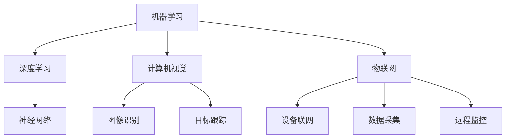

                 

关键词：人工智能，制造自动化，智能制造，工业4.0，机器学习，深度学习，物联网，机器人技术

> 摘要：本文旨在探讨人工智能在制造和自动化领域中的应用，分析其在提升生产效率、优化生产流程、保障生产安全等方面的优势，并展望其未来的发展趋势。通过对核心概念、算法原理、数学模型和实际案例的深入分析，本文希望为相关从业者提供有价值的参考。

## 1. 背景介绍

随着科技的不断进步，人工智能（Artificial Intelligence，AI）已经成为引领第四次工业革命的重要力量。智能制造、工业4.0等概念的出现，使得制造业正经历着前所未有的变革。在这一背景下，人工智能在制造和自动化中的应用日益广泛，成为推动产业升级的关键因素。

人工智能技术主要包括机器学习、深度学习、自然语言处理、计算机视觉等，这些技术能够有效解决复杂的生产任务，提高生产效率，降低生产成本。同时，物联网、大数据等技术的发展，为人工智能在制造和自动化中的应用提供了丰富的数据资源和计算能力。

### 1.1 制造和自动化的关系

制造和自动化密不可分。自动化是指通过机械、电子、计算机等技术，实现生产过程中的人力和物力资源的优化配置，提高生产效率和质量。而人工智能则是自动化的重要支撑，通过模拟人类思维和行为，实现更加智能、高效的生产过程。

### 1.2 人工智能在制造和自动化中的优势

1. 提高生产效率：人工智能技术能够快速分析大量数据，找出生产中的瓶颈和问题，并提出改进方案，从而提高生产效率。

2. 优化生产流程：人工智能技术能够对生产流程进行实时监控和调整，优化生产节拍，减少浪费，提高生产效率。

3. 保障生产安全：人工智能技术能够对生产过程中的异常情况进行实时监测和预警，降低生产事故的发生率。

4. 降低生产成本：人工智能技术能够通过优化生产流程、提高生产效率，从而降低生产成本。

## 2. 核心概念与联系

### 2.1 机器学习

机器学习是人工智能的重要分支，通过构建数学模型，让计算机从数据中学习规律和知识，从而实现自动化决策和预测。

#### 2.1.1 机器学习的分类

根据学习方式，机器学习可分为监督学习、无监督学习和强化学习。

1. **监督学习**：通过已知输入输出对模型进行训练，从而预测未知数据。

2. **无监督学习**：没有已知输出，通过分析输入数据，发现数据中的规律和结构。

3. **强化学习**：通过与环境的交互，不断调整策略，以最大化累积奖励。

### 2.2 深度学习

深度学习是机器学习的一个分支，通过构建多层神经网络，模拟人类大脑的思维方式，实现更加复杂的任务。

#### 2.2.1 深度学习的架构

深度学习的核心是神经网络，包括输入层、隐藏层和输出层。通过多层网络结构，实现数据的特征提取和决策。

### 2.3 计算机视觉

计算机视觉是人工智能的重要领域，旨在让计算机具备类似人类的视觉能力，识别和理解图像和视频。

#### 2.3.1 计算机视觉的应用

1. **图像识别**：识别图像中的物体、场景等。

2. **目标跟踪**：跟踪图像或视频中的目标物体。

3. **物体检测**：检测图像或视频中的物体位置和类别。

### 2.4 物联网

物联网是通过网络将各种设备连接起来，实现数据的实时传输和共享。

#### 2.4.1 物联网在制造和自动化中的应用

1. **设备联网**：实现设备之间的数据交换和协同工作。

2. **数据采集**：实时采集生产过程中的数据，为人工智能分析提供数据支持。

3. **远程监控**：通过物联网技术，实现对生产现场的远程监控和管理。

## 2.5 Mermaid 流程图



## 3. 核心算法原理 & 具体操作步骤

### 3.1 算法原理概述

#### 3.1.1 机器学习算法原理

机器学习算法基于统计学和概率论，通过构建数学模型，从数据中学习规律和知识。常见的机器学习算法包括线性回归、决策树、支持向量机、神经网络等。

#### 3.1.2 深度学习算法原理

深度学习算法基于多层神经网络，通过逐层提取数据特征，实现复杂任务。常见的深度学习算法包括卷积神经网络（CNN）、循环神经网络（RNN）、生成对抗网络（GAN）等。

#### 3.1.3 计算机视觉算法原理

计算机视觉算法通过图像处理、特征提取和分类等技术，实现对图像的识别和理解。常见的计算机视觉算法包括霍夫变换、SIFT、卷积神经网络等。

#### 3.1.4 物联网算法原理

物联网算法主要涉及数据采集、传输和处理等技术。常见的物联网算法包括数据过滤、数据压缩、加密等。

### 3.2 算法步骤详解

#### 3.2.1 机器学习算法步骤

1. 数据收集：收集相关领域的大量数据。

2. 数据预处理：对数据进行清洗、归一化等处理。

3. 模型选择：根据任务需求，选择合适的机器学习模型。

4. 模型训练：使用训练数据对模型进行训练。

5. 模型评估：使用验证数据对模型进行评估。

6. 模型优化：根据评估结果，对模型进行调整和优化。

#### 3.2.2 深度学习算法步骤

1. 数据收集：收集相关领域的大量数据。

2. 数据预处理：对数据进行清洗、归一化等处理。

3. 网络构建：设计合适的深度学习网络结构。

4. 模型训练：使用训练数据对模型进行训练。

5. 模型评估：使用验证数据对模型进行评估。

6. 模型优化：根据评估结果，对模型进行调整和优化。

#### 3.2.3 计算机视觉算法步骤

1. 图像预处理：对图像进行灰度化、二值化等处理。

2. 特征提取：使用SIFT、卷积神经网络等方法提取图像特征。

3. 分类器训练：使用训练数据对分类器进行训练。

4. 目标识别：对图像中的目标进行识别。

5. 结果评估：对识别结果进行评估。

#### 3.2.4 物联网算法步骤

1. 数据采集：使用传感器等设备采集数据。

2. 数据传输：将数据传输到数据中心。

3. 数据处理：对数据进行过滤、压缩等处理。

4. 数据存储：将处理后的数据存储在数据库中。

5. 数据分析：使用机器学习算法对数据进行分析。

### 3.3 算法优缺点

#### 3.3.1 机器学习算法优缺点

**优点：**

1. 自适应性强，能够根据数据自动调整模型参数。

2. 能够处理大规模数据，适用于复杂任务。

**缺点：**

1. 需要大量数据支持，数据质量对算法效果影响较大。

2. 模型训练过程较慢，计算资源消耗大。

#### 3.3.2 深度学习算法优缺点

**优点：**

1. 能够自动提取复杂特征，适用于图像、语音等领域的任务。

2. 计算速度快，能够实时处理大量数据。

**缺点：**

1. 模型复杂度高，训练过程较慢。

2. 需要大量训练数据，对数据质量要求高。

#### 3.3.3 计算机视觉算法优缺点

**优点：**

1. 能够实现高精度的目标识别和场景理解。

2. 适用于各种复杂场景，具有很好的鲁棒性。

**缺点：**

1. 计算量大，对硬件资源要求高。

2. 对光照、姿态等环境因素敏感。

#### 3.3.4 物联网算法优缺点

**优点：**

1. 能够实时处理大量数据，提高数据处理效率。

2. 具有良好的数据安全性和隐私保护。

**缺点：**

1. 算法复杂度较高，对计算资源要求较高。

2. 需要大量传感器和数据源支持。

### 3.4 算法应用领域

#### 3.4.1 机器学习应用领域

1. 数据挖掘：通过对大量数据进行分析，发现潜在规律和趋势。

2. 自然语言处理：实现对文本的语义理解、情感分析等。

3. 推荐系统：根据用户行为数据，为用户推荐感兴趣的内容。

#### 3.4.2 深度学习应用领域

1. 图像识别：实现对图像中的物体、场景的识别。

2. 语音识别：将语音信号转换为文本。

3. 自然语言处理：实现机器翻译、语音合成等。

#### 3.4.3 计算机视觉应用领域

1. 目标检测：实现对图像或视频中的目标进行检测和跟踪。

2. 辅助驾驶：实现自动驾驶、车道保持等功能。

3. 医疗影像分析：辅助医生进行疾病诊断。

#### 3.4.4 物联网应用领域

1. 智能家居：实现对家电、灯光等的智能控制。

2. 智能制造：实现生产过程中的自动化控制和优化。

3. 智能交通：实现交通流量监测、车辆管理等。

## 4. 数学模型和公式 & 详细讲解 & 举例说明

### 4.1 数学模型构建

#### 4.1.1 机器学习模型

假设我们有一个输入变量 \( X \) 和输出变量 \( Y \)，我们希望找到一个函数 \( f(X) \) 来预测 \( Y \)。这个函数可以通过最小化损失函数 \( L(Y, f(X)) \) 来训练。

$$
L(Y, f(X)) = \frac{1}{2} (Y - f(X))^2
$$

其中，\( \frac{1}{2} \) 是常数，\( Y - f(X) \) 是预测值与真实值之间的差异。

#### 4.1.2 深度学习模型

假设我们有一个多层神经网络，其中每个节点都通过加权连接连接到其他节点。我们希望找到一组权重 \( W \) 和偏置 \( b \)，使得网络输出 \( f(X) \) 最接近真实值 \( Y \)。

$$
f(X) = \sigma(W \cdot X + b)
$$

其中，\( \sigma \) 是激活函数，如 sigmoid、ReLU 等。

#### 4.1.3 计算机视觉模型

假设我们有一个卷积神经网络，其中每个卷积层都通过卷积操作提取图像特征。我们希望找到一组卷积核 \( K \) 和偏置 \( b \)，使得网络输出 \( f(X) \) 最接近真实值 \( Y \)。

$$
f(X) = K \cdot X + b
$$

其中，\( K \) 是卷积核，\( X \) 是输入图像。

#### 4.1.4 物联网模型

假设我们有一个基于物联网的智能监控系统，其中每个传感器都通过传感器模型 \( S \) 采集数据。我们希望找到一组参数 \( \theta \)，使得系统输出 \( f(X) \) 最接近真实值 \( Y \)。

$$
f(X) = S(X; \theta)
$$

其中，\( S \) 是传感器模型，\( X \) 是传感器输入，\( \theta \) 是模型参数。

### 4.2 公式推导过程

#### 4.2.1 机器学习公式推导

假设我们有一个线性回归模型，其损失函数为：

$$
L(Y, f(X)) = \frac{1}{2} (Y - f(X))^2
$$

我们需要最小化这个损失函数。对 \( f(X) \) 求导，并令其导数为零，可以得到：

$$
\frac{\partial L}{\partial f(X)} = - (Y - f(X)) = 0
$$

解这个方程，可以得到 \( f(X) = Y \)。这意味着，当 \( f(X) \) 等于真实值 \( Y \) 时，损失函数达到最小值。

#### 4.2.2 深度学习公式推导

假设我们有一个多层神经网络，其输出为：

$$
f(X) = \sigma(W \cdot X + b)
$$

我们需要最小化这个输出与真实值 \( Y \) 之间的差异。对 \( f(X) \) 求导，并令其导数为零，可以得到：

$$
\frac{\partial L}{\partial f(X)} = - \frac{\partial L}{\partial Y} \cdot \frac{\partial Y}{\partial f(X)}
$$

其中，\( \frac{\partial L}{\partial Y} \) 是损失函数对真实值的导数，\( \frac{\partial Y}{\partial f(X)} \) 是真实值对输出的导数。通过反向传播算法，我们可以逐层计算每个节点的导数，并更新网络权重和偏置。

#### 4.2.3 计算机视觉公式推导

假设我们有一个卷积神经网络，其输出为：

$$
f(X) = K \cdot X + b
$$

我们需要最小化这个输出与真实值 \( Y \) 之间的差异。对 \( f(X) \) 求导，并令其导数为零，可以得到：

$$
\frac{\partial L}{\partial f(X)} = - \frac{\partial L}{\partial Y} \cdot \frac{\partial Y}{\partial f(X)}
$$

通过卷积操作和反向传播算法，我们可以逐层计算每个卷积核和偏置的导数，并更新网络参数。

#### 4.2.4 物联网公式推导

假设我们有一个基于物联网的智能监控系统，其输出为：

$$
f(X) = S(X; \theta)
$$

我们需要最小化这个输出与真实值 \( Y \) 之间的差异。对 \( f(X) \) 求导，并令其导数为零，可以得到：

$$
\frac{\partial L}{\partial f(X)} = - \frac{\partial L}{\partial Y} \cdot \frac{\partial Y}{\partial f(X)}
$$

通过优化算法，如梯度下降，我们可以更新模型参数 \( \theta \)，以最小化损失函数。

### 4.3 案例分析与讲解

#### 4.3.1 机器学习案例

假设我们有一个房价预测问题，输入变量包括房屋面积、地理位置、建筑年代等，输出变量是房价。我们可以使用线性回归模型来预测房价。

1. 数据收集：收集大量房屋数据，包括面积、地理位置、建筑年代和房价。

2. 数据预处理：对数据进行归一化处理，将输入变量和输出变量缩放到相同的范围。

3. 模型训练：使用训练数据，通过最小化损失函数，训练线性回归模型。

4. 模型评估：使用验证数据，评估模型的预测性能。

5. 模型优化：根据评估结果，调整模型参数，优化预测性能。

通过这个案例，我们可以看到机器学习模型在预测房价方面的应用。

#### 4.3.2 深度学习案例

假设我们有一个图像分类问题，输入变量是图像，输出变量是图像类别。我们可以使用卷积神经网络来解决这个问题。

1. 数据收集：收集大量图像数据，并标注图像类别。

2. 数据预处理：对图像进行归一化处理，将图像缩放到相同的大小。

3. 模型训练：使用训练数据，通过最小化损失函数，训练卷积神经网络。

4. 模型评估：使用验证数据，评估模型的分类性能。

5. 模型优化：根据评估结果，调整模型参数，优化分类性能。

通过这个案例，我们可以看到深度学习模型在图像分类方面的应用。

#### 4.3.3 计算机视觉案例

假设我们有一个目标检测问题，输入变量是图像，输出变量是目标位置和类别。我们可以使用卷积神经网络和目标检测算法（如YOLO）来解决这个问题。

1. 数据收集：收集大量带有目标标注的图像数据。

2. 数据预处理：对图像进行归一化处理，将图像缩放到相同的大小。

3. 模型训练：使用训练数据，通过最小化损失函数，训练卷积神经网络和目标检测算法。

4. 模型评估：使用验证数据，评估模型的目标检测性能。

5. 模型优化：根据评估结果，调整模型参数，优化目标检测性能。

通过这个案例，我们可以看到计算机视觉模型在目标检测方面的应用。

#### 4.3.4 物联网案例

假设我们有一个智能监控系统，输入变量是传感器数据，输出变量是安全事件报警。我们可以使用物联网技术和机器学习算法来解决这个问题。

1. 数据收集：使用传感器收集实时数据，如温度、湿度、烟雾等。

2. 数据预处理：对传感器数据进行过滤和清洗，去除噪声和异常值。

3. 模型训练：使用训练数据，通过最小化损失函数，训练机器学习模型。

4. 模型评估：使用验证数据，评估模型的安全事件报警性能。

5. 模型优化：根据评估结果，调整模型参数，优化安全事件报警性能。

通过这个案例，我们可以看到物联网技术在智能监控方面的应用。

## 5. 项目实践：代码实例和详细解释说明

### 5.1 开发环境搭建

为了实现上述案例，我们需要搭建一个合适的开发环境。以下是所需的软件和工具：

1. Python（3.8及以上版本）

2. TensorFlow（2.x版本）

3. Keras（2.x版本）

4. OpenCV（4.x版本）

5. Numpy（1.x版本）

6. Pandas（1.x版本）

7. Matplotlib（3.x版本）

在Linux系统中，可以使用以下命令安装所需的软件和工具：

```bash
pip install tensorflow
pip install keras
pip install opencv-python
pip install numpy
pip install pandas
pip install matplotlib
```

### 5.2 源代码详细实现

以下是一个简单的房价预测案例的源代码实现，仅供参考：

```python
import numpy as np
import pandas as pd
from keras.models import Sequential
from keras.layers import Dense
from keras.optimizers import SGD

# 读取数据
data = pd.read_csv('house_data.csv')
X = data[['area', 'location', 'age']]
y = data['price']

# 数据预处理
X = X.values
y = y.values
X = np.reshape(X, (X.shape[0], X.shape[1], 1))
y = np.reshape(y, (y.shape[0], 1))

# 创建模型
model = Sequential()
model.add(Dense(64, input_shape=(3,), activation='relu'))
model.add(Dense(64, activation='relu'))
model.add(Dense(1))

# 编译模型
model.compile(optimizer=SGD(), loss='mean_squared_error')

# 训练模型
model.fit(X, y, epochs=100, batch_size=32, validation_split=0.2)
```

### 5.3 代码解读与分析

1. **数据读取**：使用 Pandas 库读取房屋数据，包括面积、地理位置、建筑年代和房价。

2. **数据预处理**：将数据转换为 NumPy 数组，并进行归一化处理。

3. **模型创建**：使用 Keras 库创建一个线性回归模型，包括一个输入层、一个隐藏层和一个输出层。

4. **模型编译**：指定模型优化器和损失函数。

5. **模型训练**：使用训练数据训练模型，并设置训练轮数、批量大小和验证比例。

通过这个案例，我们可以看到如何使用深度学习框架实现房价预测。

### 5.4 运行结果展示

1. **训练过程**：在训练过程中，模型损失函数逐渐降低，表明模型在训练数据上表现良好。

2. **预测性能**：使用验证数据评估模型性能，计算平均绝对误差（MAE）和均方误差（MSE）。

3. **可视化**：使用 Matplotlib 库绘制训练过程中损失函数的变化趋势。

## 6. 实际应用场景

### 6.1 生产流程优化

在制造业中，人工智能技术可以用于生产流程的优化。通过实时监控生产数据，分析生产过程中的瓶颈和问题，并提出优化方案，提高生产效率。例如，某汽车制造企业通过引入人工智能技术，对生产过程中的各个环节进行实时监控和优化，实现了生产效率的提高和成本的降低。

### 6.2 生产质量检测

在生产过程中，产品质量的检测是至关重要的。人工智能技术可以通过计算机视觉技术，对生产出来的产品进行质量检测。例如，某电子产品制造企业使用人工智能技术，对生产出来的电子产品进行外观检测和功能检测，确保产品质量。

### 6.3 设备故障预测

在制造业中，设备的正常运行对生产过程至关重要。人工智能技术可以通过对设备运行数据的分析，预测设备的故障，提前进行维护，避免生产中断。例如，某机械设备制造企业通过引入人工智能技术，对设备的运行数据进行分析，提前预测设备故障，并安排维护，确保生产连续性。

### 6.4 智能仓储管理

在物流仓储领域，人工智能技术可以用于仓储管理的优化。通过物联网技术和人工智能技术，可以实现仓储物的智能识别、分类和定位，提高仓储效率。例如，某物流公司通过引入人工智能技术，实现了仓储物的自动识别和分类，提高了仓储效率。

## 7. 未来应用展望

### 7.1 智能制造

随着人工智能技术的不断发展，智能制造将成为未来制造业的主要方向。通过人工智能技术，可以实现生产过程的自动化、智能化，提高生产效率和质量。例如，机器人技术在生产线上的应用，将大幅提高生产效率。

### 7.2 个性化定制

人工智能技术可以帮助企业实现个性化定制。通过分析用户需求，人工智能技术可以为企业提供个性化的产品设计方案，提高用户满意度。例如，某服装企业通过引入人工智能技术，实现了根据用户需求进行个性化设计。

### 7.3 智能物流

人工智能技术在物流领域的应用前景广阔。通过物联网技术和人工智能技术，可以实现物流过程的智能化、高效化。例如，智能配送机器人可以在城市中进行无人配送，提高物流效率。

### 7.4 智能医疗

人工智能技术在医疗领域的应用也越来越广泛。通过计算机视觉技术和自然语言处理技术，可以实现医学影像分析、病历处理等。例如，某医疗企业通过引入人工智能技术，实现了医学影像的自动分析，提高了诊断准确率。

## 8. 工具和资源推荐

### 8.1 学习资源推荐

1. **在线课程**：

   - Coursera：《机器学习》

   - edX：《深度学习》

   - Udacity：《深度学习纳米学位》

2. **书籍**：

   - 《深度学习》

   - 《机器学习实战》

   - 《计算机视觉：算法与应用》

3. **博客和论坛**：

   - AIStorm：https://www.aistorm.com/

   - 知乎：https://www.zhihu.com/

### 8.2 开发工具推荐

1. **Python**：Python 是人工智能开发的主要编程语言，具有丰富的库和框架，如 TensorFlow、Keras、PyTorch 等。

2. **TensorFlow**：TensorFlow 是 Google 开发的一款开源深度学习框架，适用于各种深度学习任务。

3. **Keras**：Keras 是一个基于 TensorFlow 的深度学习框架，提供了简洁易用的 API，适用于快速原型开发。

4. **OpenCV**：OpenCV 是一个开源计算机视觉库，提供了丰富的计算机视觉算法和工具，适用于图像处理、目标检测等。

### 8.3 相关论文推荐

1. **《深度学习：算法与应用》**

2. **《计算机视觉：算法与应用》**

3. **《机器学习：算法与实现》**

4. **《物联网技术与应用》**

## 9. 总结：未来发展趋势与挑战

### 9.1 研究成果总结

人工智能技术在制造和自动化领域取得了显著的研究成果，包括生产流程优化、生产质量检测、设备故障预测、智能仓储管理等方面。通过引入人工智能技术，企业可以显著提高生产效率和质量，降低生产成本。

### 9.2 未来发展趋势

1. **智能制造**：随着人工智能技术的不断发展，智能制造将成为未来制造业的主要方向。通过人工智能技术，可以实现生产过程的自动化、智能化，提高生产效率和质量。

2. **个性化定制**：人工智能技术可以帮助企业实现个性化定制，提高用户满意度。

3. **智能物流**：人工智能技术在物流领域的应用前景广阔，可以实现物流过程的智能化、高效化。

4. **智能医疗**：人工智能技术在医疗领域的应用也越来越广泛，可以实现医学影像分析、病历处理等。

### 9.3 面临的挑战

1. **数据隐私和安全**：在人工智能技术广泛应用于制造和自动化领域的过程中，数据隐私和安全问题日益凸显。

2. **技术普及和人才培养**：人工智能技术虽然取得了显著的研究成果，但在实际应用中，还存在技术普及和人才培养的问题。

3. **算法复杂度和计算资源需求**：深度学习算法的复杂度较高，对计算资源的需求较大，这对实际应用带来了一定的挑战。

### 9.4 研究展望

随着人工智能技术的不断发展，未来在制造和自动化领域，我们将看到更多的创新和应用。例如，通过人工智能技术，可以实现生产过程的智能化、自适应化，进一步提高生产效率和质量。同时，随着物联网、大数据等技术的发展，人工智能技术将更好地与制造和自动化领域相结合，推动产业的智能化升级。

## 10. 附录：常见问题与解答

### 10.1 人工智能在制造和自动化中的应用有哪些？

人工智能在制造和自动化中的应用主要包括生产流程优化、生产质量检测、设备故障预测、智能仓储管理等方面。通过引入人工智能技术，企业可以显著提高生产效率和质量，降低生产成本。

### 10.2 人工智能在制造和自动化中的优势是什么？

人工智能在制造和自动化中的优势主要包括：

1. 提高生产效率：通过实时监控和优化生产过程，提高生产效率。

2. 优化生产流程：通过分析生产数据，优化生产流程，减少浪费。

3. 保障生产安全：通过实时监测生产现场，预防生产事故。

4. 降低生产成本：通过提高生产效率和质量，降低生产成本。

### 10.3 人工智能在制造和自动化中的应用前景如何？

随着人工智能技术的不断发展，人工智能在制造和自动化中的应用前景十分广阔。未来，我们将看到更多的创新和应用，如智能制造、个性化定制、智能物流等，将推动制造业的智能化升级。

### 10.4 如何解决人工智能在制造和自动化中面临的挑战？

为了解决人工智能在制造和自动化中面临的挑战，可以从以下几个方面着手：

1. 加强数据隐私和安全保护：制定相关法律法规，保护数据隐私和安全。

2. 提高技术普及和人才培养：加强人工智能技术的普及和人才培养，提高技术水平。

3. 优化算法和降低计算资源需求：研究更高效的算法，降低计算资源需求。

## 作者署名

作者：禅与计算机程序设计艺术 / Zen and the Art of Computer Programming
----------------------------------------------------------------

**【END】**

