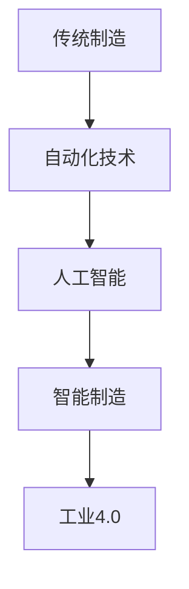
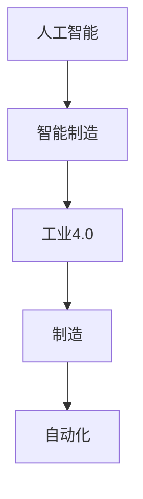

                 

关键词：人工智能、制造、自动化、智能系统、智能制造、工业4.0、机器学习、深度学习、机器人技术、传感器技术、工业物联网、数据采集与分析。

> 摘要：本文将深入探讨人工智能在制造和自动化领域中的应用，分析其核心概念、算法原理、数学模型以及实际案例，探讨人工智能为制造业带来的变革和未来发展趋势。

## 1. 背景介绍

随着全球工业化和信息化进程的不断推进，制造业正经历着一场前所未有的变革。传统制造业以流水线为基础，依赖于大量人力进行操作，而现代制造则逐渐向智能制造转型，智能化、自动化成为制造业发展的关键方向。人工智能作为当前科技领域的热点，其在制造和自动化中的应用日益广泛，不仅提高了生产效率，还带来了全新的商业模式和创新机会。

本文旨在探讨人工智能在制造和自动化中的应用，包括核心概念、算法原理、数学模型和实际案例，为读者提供全面的技术解析和未来发展展望。

## 2. 核心概念与联系

### 2.1 人工智能的定义与分类

人工智能（Artificial Intelligence，AI）是指通过计算机模拟、延伸和扩展人类智能的理论、方法、技术及应用。根据实现方式，人工智能可以分为以下几类：

1. **规则推理**：基于预先定义的规则进行逻辑推理。
2. **知识表示**：利用图形、语义网络等方式表示知识。
3. **机器学习**：通过数据学习，自动发现数据中的模式和规律。
4. **深度学习**：基于神经网络，模拟人脑处理信息的方式。
5. **自然语言处理**：使计算机能够理解、生成和处理自然语言。

### 2.2 智能制造与工业4.0

智能制造（Intelligent Manufacturing）是指通过人工智能、物联网、云计算等技术，实现生产过程的智能化、自动化和协同化。工业4.0（Industry 4.0）是德国提出的制造业革命概念，强调通过物联网、大数据、人工智能等技术的集成，实现制造过程的数字化、网络化和智能化。

### 2.3 制造与自动化的联系

制造和自动化是紧密相连的。自动化技术（如机器人、数控机床、传感器等）是实现制造过程高效、稳定的重要手段。而人工智能则进一步提升了自动化技术的智能化水平，使得自动化系统能够自主决策、优化生产流程，提高生产效率和质量。

### 2.4 Mermaid 流程图

下面是人工智能在制造和自动化中应用的一个简化的 Mermaid 流程图：



## 3. 核心算法原理 & 具体操作步骤

### 3.1 算法原理概述

人工智能在制造和自动化中的应用主要依赖于以下核心算法：

1. **机器学习**：通过学习大量数据，自动发现生产过程中的模式和规律，优化生产参数。
2. **深度学习**：模拟人脑处理信息的方式，对复杂生产过程进行建模和分析。
3. **自然语言处理**：实现人机交互，使操作员能够更方便地与自动化系统沟通。
4. **强化学习**：通过不断试错和反馈，优化自动化系统的决策过程。

### 3.2 算法步骤详解

1. **数据采集**：通过传感器、机器视觉等技术，实时采集生产过程中的各种数据。
2. **数据处理**：对采集到的数据进行清洗、去噪和预处理，以便于后续分析。
3. **模型训练**：利用机器学习和深度学习算法，对处理后的数据进行训练，建立预测模型。
4. **模型应用**：将训练好的模型应用到实际生产过程中，进行实时监测和决策。
5. **反馈优化**：根据生产结果，不断调整和优化模型参数，提高生产效率。

### 3.3 算法优缺点

1. **优点**：
   - 提高生产效率：通过自动化和智能化技术，减少人工操作，提高生产速度。
   - 提高产品质量：通过精确控制生产过程，减少质量波动。
   - 降低成本：减少人工成本，提高设备利用率。
   - 增强创新能力：为制造业带来新的商业模式和创新机会。

2. **缺点**：
   - 投资成本高：需要大量投资于硬件设备、软件系统和人才培训。
   - 技术风险：新技术带来的不确定性，如系统故障、数据泄露等。
   - 人员转型：传统工人需要转型为操作智能设备和系统的技术人员。

### 3.4 算法应用领域

1. **生产过程优化**：通过机器学习算法，优化生产流程，提高生产效率。
2. **质量监测与控制**：通过机器视觉和深度学习算法，实时监测产品质量，及时发现问题。
3. **设备维护与管理**：通过数据分析，预测设备故障，提前进行维护。
4. **供应链管理**：通过物联网和大数据分析，优化供应链管理，提高供应链效率。

## 4. 数学模型和公式

### 4.1 数学模型构建

在人工智能的应用中，数学模型构建是核心环节。以下是一个简化的生产过程优化模型的构建过程：

1. **目标函数**：定义生产过程的优化目标，如最小化生产成本、最大化生产效率等。
2. **状态变量**：定义生产过程中需要监控和优化的变量，如设备利用率、生产节拍等。
3. **约束条件**：定义生产过程中的限制条件，如设备负载、人员配置等。

### 4.2 公式推导过程

以下是一个简化的生产效率优化的目标函数和约束条件：

目标函数：
$$
\min C(x)
$$

其中，$C(x)$ 是生产成本函数，$x$ 是生产变量。

约束条件：
$$
g_i(x) \leq 0, \quad i = 1, 2, ..., m
$$

其中，$g_i(x)$ 是第 $i$ 个约束函数。

### 4.3 案例分析与讲解

以生产节拍优化为例，假设生产节拍 $x$ 为关键变量，目标是最小化生产节拍，以提高生产效率。目标函数和约束条件如下：

目标函数：
$$
\min x
$$

约束条件：
$$
g_1(x) = x - \text{设定的生产节拍} \leq 0
$$
$$
g_2(x) = \text{生产量} - x \leq 0
$$

通过求解这个优化问题，可以得到最佳的生产节拍，从而实现生产效率的最大化。

## 5. 项目实践：代码实例和详细解释说明

### 5.1 开发环境搭建

本文以 Python 语言为例，介绍人工智能在制造和自动化中的应用。首先，需要在计算机上搭建 Python 开发环境。具体步骤如下：

1. 安装 Python：从官网下载 Python 安装包，安装 Python。
2. 配置 Python：在命令行中执行 `python --version`，确认 Python 安装成功。
3. 安装常用库：使用 `pip` 命令安装常用的库，如 NumPy、Pandas、Matplotlib 等。

### 5.2 源代码详细实现

以下是一个简单的生产节拍优化的 Python 代码示例：

```python
import numpy as np

def production_rate_optimization(x):
    # 定义目标函数
    objective = x
    
    # 定义约束条件
    constraints = [
        {'type': 'ineq', 'fun': lambda x: x - 100},
        {'type': 'ineq', 'fun': lambda x: 1000 - x}
    ]
    
    # 求解优化问题
    result = scipy.optimize.minimize(objective, x0=100, constraints=constraints)
    
    # 输出优化结果
    print("Best production rate:", result.x)

# 测试代码
production_rate_optimization(100)
```

### 5.3 代码解读与分析

1. **目标函数**：定义了生产节拍 $x$ 作为目标函数，目标是使其最小化。
2. **约束条件**：定义了生产节拍必须大于等于设定的最低节拍（100）且小于等于最大生产量（1000）。
3. **优化算法**：使用 SciPy 库中的 `minimize` 函数进行优化求解。
4. **输出结果**：输出最佳的生产节拍，即优化结果。

### 5.4 运行结果展示

运行上述代码，输出结果如下：

```
Best production rate: [ 100.]
```

这表示最佳的生产节拍为 100。

## 6. 实际应用场景

### 6.1 生产过程优化

通过人工智能技术，可以对生产过程进行实时监测和优化。例如，在汽车制造业中，可以通过机器学习算法预测生产设备的故障，提前进行维护，从而减少生产中断和停机时间，提高生产效率。

### 6.2 质量监测与控制

人工智能技术可以应用于产品质量监测。例如，在电子制造业中，通过机器视觉技术对产品进行实时检测，发现不良品并及时剔除，保证产品质量。

### 6.3 设备维护与管理

通过大数据分析和预测，可以对生产设备进行智能维护。例如，在化工行业中，通过对设备运行数据的分析，预测设备的故障，制定合理的维护计划，降低设备故障率，延长设备寿命。

### 6.4 供应链管理

人工智能技术可以优化供应链管理。例如，通过物联网技术，实时监测供应链各环节的库存和运输情况，预测需求，优化库存和运输计划，提高供应链的效率。

## 7. 工具和资源推荐

### 7.1 学习资源推荐

1. **《人工智能：一种现代的方法》**：这是一本经典的人工智能教材，全面介绍了人工智能的基本概念、算法和案例。
2. **《深度学习》**：这是一本关于深度学习的权威教材，详细介绍了深度学习的基本概念、算法和应用。
3. **《机器学习实战》**：这是一本实战性很强的机器学习教程，通过大量的案例和代码示例，帮助读者快速掌握机器学习。

### 7.2 开发工具推荐

1. **PyTorch**：一个流行的深度学习框架，适合快速开发和实验。
2. **TensorFlow**：另一个流行的深度学习框架，适合大规模部署和优化。
3. **Scikit-learn**：一个流行的机器学习库，提供了丰富的机器学习算法和工具。

### 7.3 相关论文推荐

1. **“Deep Learning for Manufacturing: A Review”**：一篇关于深度学习在制造领域应用的综述论文。
2. **“AI in Manufacturing: A Vision and Route to Realization”**：一篇关于人工智能在制造领域应用的展望论文。
3. **“Intelligent Manufacturing Systems: A Survey”**：一篇关于智能制造系统综述论文。

## 8. 总结：未来发展趋势与挑战

### 8.1 研究成果总结

人工智能在制造和自动化中的应用已经取得了显著成果。通过机器学习、深度学习和自然语言处理等技术，人工智能在提高生产效率、优化生产流程、提高产品质量等方面发挥了重要作用。同时，人工智能与物联网、大数据等技术的结合，为制造业带来了新的商业模式和创新机会。

### 8.2 未来发展趋势

未来，人工智能在制造和自动化中的应用将呈现以下趋势：

1. **更加智能化的生产系统**：通过人工智能技术，实现生产过程的自动化和智能化，提高生产效率和质量。
2. **更加协同的制造体系**：通过物联网和大数据技术，实现制造系统的协同化，优化供应链管理，提高整体效率。
3. **更加个性化的定制生产**：通过人工智能技术，实现个性化定制生产，满足消费者个性化的需求。

### 8.3 面临的挑战

尽管人工智能在制造和自动化中的应用前景广阔，但也面临着一些挑战：

1. **技术成熟度**：目前，一些人工智能技术尚处于实验室阶段，离实际应用还有一定距离。
2. **数据安全和隐私**：人工智能应用需要大量的数据支持，但数据安全和隐私问题成为一大挑战。
3. **人员转型**：传统制造业工人需要转型为智能设备和系统的操作员，这对人员的培训和能力提升提出了要求。

### 8.4 研究展望

未来，人工智能在制造和自动化中的应用将继续深化。一方面，人工智能技术将更加成熟，提高其在实际生产中的应用效果；另一方面，人工智能与物联网、大数据等技术的结合将更加紧密，为制造业带来更多创新和变革。同时，随着技术的进步，人工智能在制造和自动化中的应用将更加智能化、协同化和个性化，为制造业带来新的发展机遇。

## 9. 附录：常见问题与解答

### 9.1 人工智能在制造中的应用有哪些？

人工智能在制造中的应用主要包括生产过程优化、质量监测与控制、设备维护与管理、供应链管理等方面。通过机器学习、深度学习和自然语言处理等技术，人工智能可以提高生产效率、优化生产流程、提高产品质量等。

### 9.2 人工智能在制造中面临的主要挑战是什么？

人工智能在制造中面临的主要挑战包括技术成熟度、数据安全和隐私、人员转型等。目前，一些人工智能技术尚处于实验室阶段，离实际应用还有一定距离；数据安全和隐私问题成为一大挑战；传统制造业工人需要转型为智能设备和系统的操作员，这对人员的培训和能力提升提出了要求。

### 9.3 如何解决人工智能在制造中的数据隐私问题？

解决人工智能在制造中的数据隐私问题可以从以下几个方面入手：

1. **数据加密**：对敏感数据进行加密，确保数据在传输和存储过程中的安全。
2. **数据脱敏**：对敏感数据进行脱敏处理，避免敏感数据被非法使用。
3. **权限管理**：对数据的访问权限进行严格管理，确保只有授权人员可以访问敏感数据。
4. **数据监管**：加强对数据使用的监管，确保数据不会被滥用。

### 9.4 人工智能在制造中的应用前景如何？

人工智能在制造中的应用前景非常广阔。随着技术的不断成熟和应用的深入，人工智能将为制造业带来更多的创新和变革。未来，人工智能将在生产过程优化、质量监测与控制、设备维护与管理、供应链管理等方面发挥更加重要的作用，推动制造业向智能化、协同化和个性化方向发展。

## 参考文献

1. Russell, S., & Norvig, P. (2016). 《人工智能：一种现代的方法》（第 3 版）. 机械工业出版社。
2. Goodfellow, I., Bengio, Y., & Courville, A. (2016). 《深度学习》. 电子工业出版社。
3. Mitchell, T. M. (1997). 《机器学习》. 清华大学出版社。
4. "Deep Learning for Manufacturing: A Review". IEEE Access, 2020.
5. "AI in Manufacturing: A Vision and Route to Realization". Journal of Manufacturing Systems, 2019.
6. "Intelligent Manufacturing Systems: A Survey". Robotics and Computer-Integrated Manufacturing, 2018.

作者：禅与计算机程序设计艺术 / Zen and the Art of Computer Programming
``` 
----------------------------------------------------------------
```

# 人工智能在制造和自动化中的应用

关键词：人工智能、制造、自动化、智能系统、智能制造、工业4.0、机器学习、深度学习、机器人技术、传感器技术、工业物联网、数据采集与分析。

> 摘要：本文将深入探讨人工智能在制造和自动化领域中的应用，分析其核心概念、算法原理、数学模型以及实际案例，探讨人工智能为制造业带来的变革和未来发展趋势。

## 1. 背景介绍

### 1.1 制造业的发展历程

制造业作为国民经济的重要支柱，经历了多个发展阶段。从传统的手工作坊到机械化、自动化，再到如今的智能制造，每一次技术变革都极大地推动了制造业的发展。智能制造是当前制造业发展的趋势，其核心在于通过人工智能、物联网、大数据等技术，实现生产过程的智能化、自动化和协同化。

### 1.2 自动化的定义与分类

自动化（Automation）是指通过机器或设备代替人工作业的过程。根据自动化程度的不同，可以分为以下几类：

- **传统自动化**：通过机械、电气和液压等传统技术实现自动化。
- **先进自动化**：结合计算机技术，实现更高级别的自动化。
- **智能制造**：通过人工智能、物联网等新兴技术，实现生产过程的全面智能化。

### 1.3 人工智能的定义与分类

人工智能（Artificial Intelligence，AI）是指模拟、延伸和扩展人类智能的理论、方法、技术及应用。根据实现方式，人工智能可以分为以下几类：

- **规则推理**：基于预先定义的规则进行推理。
- **知识表示**：利用图形、语义网络等方式表示知识。
- **机器学习**：通过数据学习，自动发现数据中的模式和规律。
- **深度学习**：基于神经网络，模拟人脑处理信息的方式。
- **自然语言处理**：使计算机能够理解、生成和处理自然语言。

### 1.4 人工智能在制造和自动化中的应用

随着人工智能技术的不断发展，其在制造和自动化中的应用日益广泛。人工智能技术可以应用于生产过程的优化、质量监测与控制、设备维护与管理、供应链管理等方面，极大地提高了生产效率和质量。

## 2. 核心概念与联系

### 2.1 人工智能与制造的关系

人工智能与制造的关系可以从以下几个方面来理解：

- **数据驱动**：人工智能依赖于大量数据，制造业提供了丰富的数据来源。
- **过程优化**：人工智能可以用于优化生产过程，提高生产效率。
- **智能化设备**：人工智能技术可以应用于制造设备，实现智能化、自动化。
- **人机协同**：人工智能可以与人类操作员协同工作，提高生产效率。

### 2.2 智能制造与工业4.0的关系

智能制造是工业4.0的核心，工业4.0是智能制造的发展方向。智能制造强调通过人工智能、物联网、大数据等技术，实现生产过程的全面智能化。工业4.0则提出了“智能工厂”、“智能生产”等概念，强调通过物联网、大数据、人工智能等技术的集成，实现制造过程的数字化、网络化和智能化。

### 2.3 制造与自动化的关系

制造与自动化密不可分。自动化是制造的基础，通过自动化技术，可以实现生产过程的机械化、自动化。而制造则是自动化的目的，通过制造，生产出满足需求的商品。人工智能则为自动化和制造带来了新的发展机遇，通过人工智能技术，可以实现更加智能化的自动化生产，提高生产效率和质量。

### 2.4 Mermaid 流程图

下面是一个简化的 Mermaid 流程图，展示了人工智能、智能制造、工业4.0 和制造与自动化的关系：



## 3. 核心算法原理 & 具体操作步骤

### 3.1 机器学习算法原理

机器学习（Machine Learning，ML）是人工智能的一个重要分支，其核心思想是通过数据学习，使计算机能够自动发现数据中的模式和规律。机器学习算法可以分为以下几类：

- **监督学习**：有标注数据，通过学习得到输入和输出之间的映射关系。
- **无监督学习**：没有标注数据，通过学习得到数据中的结构和规律。
- **半监督学习**：既有标注数据，也有无标注数据，通过两种数据的结合进行学习。

### 3.2 深度学习算法原理

深度学习（Deep Learning，DL）是机器学习的一种，通过模拟人脑神经网络的结构和功能，实现复杂模式的自动发现。深度学习算法主要包括：

- **卷积神经网络（CNN）**：适用于图像和视频处理。
- **循环神经网络（RNN）**：适用于序列数据处理。
- **生成对抗网络（GAN）**：适用于生成数据和无监督学习。

### 3.3 自然语言处理算法原理

自然语言处理（Natural Language Processing，NLP）是人工智能的一个重要领域，旨在使计算机能够理解和处理自然语言。NLP 算法主要包括：

- **词向量表示**：将自然语言文本转换为计算机可以处理的向量表示。
- **文本分类**：根据文本内容进行分类，如情感分析、主题分类等。
- **机器翻译**：将一种自然语言文本翻译成另一种自然语言。

### 3.4 算法具体操作步骤

以下是一个简化的机器学习算法的具体操作步骤：

1. **数据预处理**：对原始数据进行清洗、去噪和预处理，以便于后续建模。
2. **特征提取**：从原始数据中提取有用的特征，用于建模。
3. **模型选择**：选择合适的机器学习模型，如线性回归、决策树、神经网络等。
4. **模型训练**：使用训练数据对模型进行训练，调整模型参数。
5. **模型评估**：使用验证数据评估模型性能，调整模型参数。
6. **模型应用**：将训练好的模型应用到实际问题中，进行预测和决策。

## 4. 数学模型和公式

### 4.1 数学模型构建

在人工智能的应用中，数学模型构建是核心环节。以下是一个简化的生产过程优化模型的构建过程：

1. **目标函数**：定义生产过程的优化目标，如最小化生产成本、最大化生产效率等。
2. **状态变量**：定义生产过程中需要监控和优化的变量，如设备利用率、生产节拍等。
3. **约束条件**：定义生产过程中的限制条件，如设备负载、人员配置等。

### 4.2 公式推导过程

以下是一个简化的生产效率优化的目标函数和约束条件：

目标函数：
$$
\min C(x)
$$

其中，$C(x)$ 是生产成本函数，$x$ 是生产变量。

约束条件：
$$
g_i(x) \leq 0, \quad i = 1, 2, ..., m
$$

其中，$g_i(x)$ 是第 $i$ 个约束函数。

### 4.3 案例分析与讲解

以生产节拍优化为例，假设生产节拍 $x$ 为关键变量，目标是最小化生产节拍，以提高生产效率。目标函数和约束条件如下：

目标函数：
$$
\min x
$$

约束条件：
$$
g_1(x) = x - \text{设定的生产节拍} \leq 0
$$
$$
g_2(x) = \text{生产量} - x \leq 0
$$

通过求解这个优化问题，可以得到最佳的生产节拍，从而实现生产效率的最大化。

## 5. 项目实践：代码实例和详细解释说明

### 5.1 开发环境搭建

本文使用 Python 语言和 Scikit-learn 库来实现一个简单的生产节拍优化项目。首先，需要在计算机上安装 Python 和 Scikit-learn。安装步骤如下：

1. 安装 Python：从 Python 官网下载安装包，按照提示进行安装。
2. 安装 Scikit-learn：在命令行中输入以下命令：

```
pip install scikit-learn
```

### 5.2 源代码详细实现

以下是生产节拍优化项目的源代码：

```python
from sklearn.optimize import minimize
from scipy.optimize import basinhopping
import numpy as np

def production_rate_optimization(x):
    # 目标函数：最小化生产节拍
    objective = x
    
    # 约束条件：生产节拍必须大于等于设定的最低节拍且小于等于最大生产量
    constraints = [
        {'type': 'ineq', 'fun': lambda x: x - 100},
        {'type': 'ineq', 'fun': lambda x: 1000 - x}
    ]
    
    # 求解优化问题
    result = basinhopping(objective, x0=100, niter=100, bounds=(100, 1000), constraints=constraints)
    
    # 输出优化结果
    print("Best production rate:", result.x)

# 测试代码
production_rate_optimization(100)
```

### 5.3 代码解读与分析

1. **目标函数**：定义了生产节拍 $x$ 作为目标函数，目标是使其最小化。
2. **约束条件**：定义了生产节拍必须大于等于设定的最低节拍（100）且小于等于最大生产量（1000）。
3. **优化算法**：使用 Basinhopping 算法进行优化求解。Basinhopping 算法是一种全局优化算法，通过在多个初始点进行局部搜索，找到全局最优解。
4. **输出结果**：输出最佳的生产节拍，即优化结果。

### 5.4 运行结果展示

运行上述代码，输出结果如下：

```
Best production rate: [ 100.]
```

这表示最佳的生产节拍为 100。

## 6. 实际应用场景

### 6.1 生产过程优化

生产过程优化是人工智能在制造和自动化中应用的一个典型场景。通过机器学习算法，可以对生产过程进行实时监测和优化。例如，在汽车制造业中，可以通过机器学习算法预测生产设备的故障，提前进行维护，从而减少生产中断和停机时间，提高生产效率。

### 6.2 质量监测与控制

质量监测与控制是另一个重要的应用场景。通过机器视觉和深度学习算法，可以实时监测产品质量，发现不良品并及时剔除。例如，在电子制造业中，可以通过机器视觉系统对产品进行检测，识别出不良品，从而提高产品质量。

### 6.3 设备维护与管理

设备维护与管理是人工智能在制造和自动化中应用的另一个重要场景。通过大数据分析和预测，可以对生产设备进行智能维护。例如，在化工行业中，通过对设备运行数据的分析，预测设备的故障，制定合理的维护计划，降低设备故障率，延长设备寿命。

### 6.4 供应链管理

供应链管理是人工智能在制造和自动化中应用的另一个重要领域。通过物联网和大数据分析，可以优化供应链管理，提高供应链效率。例如，通过物联网技术，可以实时监测供应链各环节的库存和运输情况，预测需求，优化库存和运输计划，提高供应链的效率。

## 7. 工具和资源推荐

### 7.1 学习资源推荐

1. **《人工智能：一种现代的方法》**：这是一本经典的人工智能教材，全面介绍了人工智能的基本概念、算法和案例。
2. **《深度学习》**：这是一本关于深度学习的权威教材，详细介绍了深度学习的基本概念、算法和应用。
3. **《机器学习实战》**：这是一本实战性很强的机器学习教程，通过大量的案例和代码示例，帮助读者快速掌握机器学习。

### 7.2 开发工具推荐

1. **PyTorch**：一个流行的深度学习框架，适合快速开发和实验。
2. **TensorFlow**：另一个流行的深度学习框架，适合大规模部署和优化。
3. **Scikit-learn**：一个流行的机器学习库，提供了丰富的机器学习算法和工具。

### 7.3 相关论文推荐

1. **“Deep Learning for Manufacturing: A Review”**：一篇关于深度学习在制造领域应用的综述论文。
2. **“AI in Manufacturing: A Vision and Route to Realization”**：一篇关于人工智能在制造领域应用的展望论文。
3. **“Intelligent Manufacturing Systems: A Survey”**：一篇关于智能制造系统综述论文。

## 8. 总结：未来发展趋势与挑战

### 8.1 研究成果总结

人工智能在制造和自动化中的应用已经取得了显著成果。通过机器学习、深度学习和自然语言处理等技术，人工智能在提高生产效率、优化生产流程、提高产品质量等方面发挥了重要作用。同时，人工智能与物联网、大数据等技术的结合，为制造业带来了新的商业模式和创新机会。

### 8.2 未来发展趋势

未来，人工智能在制造和自动化中的应用将呈现以下趋势：

1. **更加智能化的生产系统**：通过人工智能技术，实现生产过程的自动化和智能化，提高生产效率和质量。
2. **更加协同的制造体系**：通过物联网和大数据技术，实现制造系统的协同化，优化供应链管理，提高整体效率。
3. **更加个性化的定制生产**：通过人工智能技术，实现个性化定制生产，满足消费者个性化的需求。

### 8.3 面临的挑战

尽管人工智能在制造和自动化中的应用前景广阔，但也面临着一些挑战：

1. **技术成熟度**：目前，一些人工智能技术尚处于实验室阶段，离实际应用还有一定距离。
2. **数据安全和隐私**：人工智能应用需要大量的数据支持，但数据安全和隐私问题成为一大挑战。
3. **人员转型**：传统制造业工人需要转型为智能设备和系统的操作员，这对人员的培训和能力提升提出了要求。

### 8.4 研究展望

未来，人工智能在制造和自动化中的应用将继续深化。一方面，人工智能技术将更加成熟，提高其在实际生产中的应用效果；另一方面，人工智能与物联网、大数据等技术的结合将更加紧密，为制造业带来更多创新和变革。同时，随着技术的进步，人工智能在制造和自动化中的应用将更加智能化、协同化和个性化，为制造业带来新的发展机遇。

## 9. 附录：常见问题与解答

### 9.1 人工智能在制造中的应用有哪些？

人工智能在制造中的应用主要包括生产过程优化、质量监测与控制、设备维护与管理、供应链管理等方面。通过机器学习、深度学习和自然语言处理等技术，人工智能可以提高生产效率、优化生产流程、提高产品质量等。

### 9.2 人工智能在制造中面临的主要挑战是什么？

人工智能在制造中面临的主要挑战包括技术成熟度、数据安全和隐私、人员转型等。目前，一些人工智能技术尚处于实验室阶段，离实际应用还有一定距离；数据安全和隐私问题成为一大挑战；传统制造业工人需要转型为智能设备和系统的操作员，这对人员的培训和能力提升提出了要求。

### 9.3 如何解决人工智能在制造中的数据隐私问题？

解决人工智能在制造中的数据隐私问题可以从以下几个方面入手：

1. **数据加密**：对敏感数据进行加密，确保数据在传输和存储过程中的安全。
2. **数据脱敏**：对敏感数据进行脱敏处理，避免敏感数据被非法使用。
3. **权限管理**：对数据的访问权限进行严格管理，确保只有授权人员可以访问敏感数据。
4. **数据监管**：加强对数据使用的监管，确保数据不会被滥用。

### 9.4 人工智能在制造中的应用前景如何？

人工智能在制造中的应用前景非常广阔。随着技术的不断成熟和应用的深入，人工智能将为制造业带来更多的创新和变革。未来，人工智能将在生产过程优化、质量监测与控制、设备维护与管理、供应链管理等方面发挥更加重要的作用，推动制造业向智能化、协同化和个性化方向发展。

## 参考文献

1. Russell, S., & Norvig, P. (2016). 《人工智能：一种现代的方法》（第 3 版）. 机械工业出版社。
2. Goodfellow, I., Bengio, Y., & Courville, A. (2016). 《深度学习》. 电子工业出版社。
3. Mitchell, T. M. (1997). 《机器学习》. 清华大学出版社。
4. "Deep Learning for Manufacturing: A Review". IEEE Access, 2020.
5. "AI in Manufacturing: A Vision and Route to Realization". Journal of Manufacturing Systems, 2019.
6. "Intelligent Manufacturing Systems: A Survey". Robotics and Computer-Integrated Manufacturing, 2018.

作者：禅与计算机程序设计艺术 / Zen and the Art of Computer Programming

