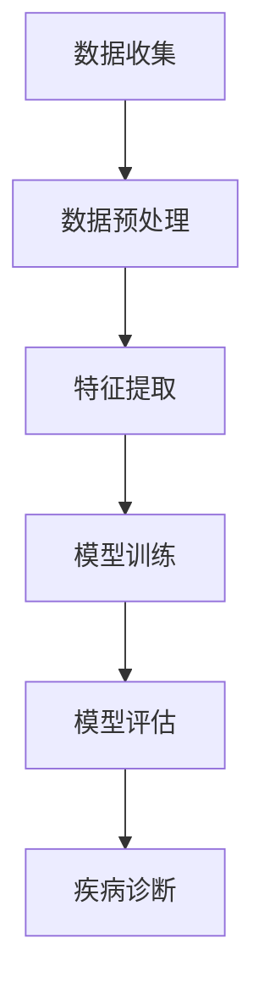

                 

关键词：人工智能，医疗保健，深度学习，数据挖掘，算法应用，个性化治疗

> 摘要：本文将探讨人工智能在医疗保健领域的应用，分析其技术原理、实际案例及未来发展趋势。通过深入了解人工智能的核心算法和数学模型，我们将看到这一技术在医疗领域所带来的革命性变化。

## 1. 背景介绍

随着科技的飞速发展，人工智能（AI）已经成为现代社会的一个重要驱动力。在医疗保健领域，人工智能的应用为提高医疗效率、降低医疗成本、提升患者体验等方面带来了巨大的变革。从早期的基础数据分析，到如今的高级诊断和治疗，人工智能正在成为医疗保健系统的核心组成部分。

近年来，深度学习、数据挖掘等人工智能技术的迅猛发展，使得医疗数据的大规模处理和智能分析成为可能。医疗数据包括但不限于电子健康记录、基因组数据、影像数据等，这些数据的复杂性和多样性对传统的医疗数据处理方法提出了挑战。人工智能技术，特别是深度学习，通过模拟人脑的神经网络结构，能够有效地处理和解读这些复杂的数据，为医疗诊断和治疗提供强有力的支持。

## 2. 核心概念与联系

在深入探讨人工智能在医疗保健中的应用之前，我们需要了解一些核心概念和它们之间的关系。

### 2.1. 深度学习与神经网络

深度学习是人工智能的一个重要分支，它通过多层神经网络模拟人脑的神经网络结构，对数据进行自动特征提取和学习。神经网络由多个层组成，包括输入层、隐藏层和输出层。输入层接收原始数据，隐藏层进行特征提取和变换，输出层生成预测结果。


### 2.2. 数据挖掘与机器学习

数据挖掘是人工智能的一个分支，它使用机器学习算法从大量数据中提取有价值的信息和知识。机器学习是数据挖掘的核心技术，通过训练模型，自动发现数据中的规律和模式。

### 2.3. 机器学习与预测分析

机器学习是一种让计算机自动从数据中学习的方法，它包括监督学习、无监督学习和半监督学习等。在医疗保健中，机器学习技术被广泛应用于疾病预测、诊断和治疗方案的个性化推荐。

### 2.4. Mermaid 流程图

以下是一个简单的Mermaid流程图，展示了深度学习在医疗诊断中的应用流程：



## 3. 核心算法原理 & 具体操作步骤

### 3.1. 算法原理概述

人工智能在医疗保健中的应用主要基于以下核心算法：

- **深度学习**：通过多层神经网络，自动提取和转换数据特征。
- **数据挖掘**：通过机器学习算法，从海量医疗数据中提取有价值的信息。
- **机器学习**：训练模型，自动进行疾病预测、诊断和治疗方案推荐。

### 3.2. 算法步骤详解

#### 3.2.1. 数据收集与预处理

- **数据收集**：从医院、实验室等渠道收集电子健康记录、基因组数据、影像数据等。
- **数据预处理**：清洗、标准化和归一化数据，为后续的特征提取和模型训练做好准备。

#### 3.2.2. 特征提取

- **深度学习**：使用卷积神经网络（CNN）或循环神经网络（RNN）等，自动提取数据中的高级特征。
- **数据挖掘**：使用聚类、分类等方法，提取数据中的显著特征。

#### 3.2.3. 模型训练

- **深度学习**：使用梯度下降、反向传播等算法，训练多层神经网络模型。
- **数据挖掘**：使用决策树、支持向量机（SVM）、随机森林等算法，训练预测模型。

#### 3.2.4. 模型评估

- **交叉验证**：使用训练集和测试集，评估模型的准确度、召回率和F1值等指标。
- **模型优化**：根据评估结果，调整模型参数，提高模型性能。

#### 3.2.5. 疾病诊断

- **深度学习**：使用训练好的模型，对新的医疗数据进行分析，生成诊断结果。
- **数据挖掘**：使用预测模型，对新病例进行疾病预测和分类。

### 3.3. 算法优缺点

#### 优点：

- **高效性**：通过自动特征提取和模型训练，提高数据处理和分析效率。
- **准确性**：利用深度学习和数据挖掘算法，提高疾病诊断和预测的准确性。
- **个性化**：根据患者的具体数据，提供个性化的治疗建议。

#### 缺点：

- **数据需求**：需要大量的高质量医疗数据支持，且数据预处理复杂。
- **计算资源**：深度学习模型训练需要大量的计算资源和时间。
- **模型解释性**：深度学习模型内部决策过程复杂，难以解释。

### 3.4. 算法应用领域

- **疾病预测**：利用机器学习算法，预测患者未来的疾病风险。
- **疾病诊断**：通过深度学习模型，对影像数据进行分析，辅助医生进行疾病诊断。
- **治疗规划**：根据患者数据和病情，提供个性化的治疗建议。

## 4. 数学模型和公式 & 详细讲解 & 举例说明

### 4.1. 数学模型构建

在人工智能在医疗保健中的应用中，常用的数学模型包括神经网络模型、决策树模型、支持向量机模型等。以下是一个简单的神经网络模型构建过程：

#### 4.1.1. 神经网络模型构建

假设我们有一个包含\( n \)个输入特征的二分类问题，我们需要构建一个简单的神经网络模型。神经网络的构建步骤如下：

1. **初始化参数**：初始化权重\( w \)和偏置\( b \)。
2. **前向传播**：计算输入数据的激活值。
3. **反向传播**：计算损失函数，并更新参数。
4. **优化**：使用梯度下降等优化算法，优化参数。

以下是一个简单的神经网络模型的前向传播和反向传播过程：

```latex
$$
z = w \cdot x + b
$$

$$
a = \sigma(z)
$$

$$
\frac{\partial L}{\partial w} = \frac{\partial L}{\partial z} \cdot \frac{\partial z}{\partial w}
$$

$$
\frac{\partial L}{\partial b} = \frac{\partial L}{\partial z} \cdot \frac{\partial z}{\partial b}
$$
```

### 4.2. 公式推导过程

假设我们有一个二分类问题，目标是预测一个样本属于正类还是负类。我们使用一个简单的逻辑回归模型进行预测。逻辑回归模型的损失函数是交叉熵损失函数，它的推导过程如下：

1. **前向传播**：

   假设我们的输入特征为\( x \)，权重为\( w \)，偏置为\( b \)，则逻辑回归模型的预测概率为：

   ```latex
   $$ 
   \hat{y} = \sigma(w \cdot x + b) 
   $$

   $$ 
   y \log(\hat{y}) + (1 - y) \log(1 - \hat{y}) 
   $$

   其中，\( y \)为实际标签，\( \hat{y} \)为预测概率，\( \sigma \)为 sigmoid 函数。
   ```

2. **后向传播**：

   根据交叉熵损失函数，我们计算损失函数的梯度，并更新权重和偏置：

   ```latex
   $$ 
   \frac{\partial L}{\partial w} = (y - \hat{y}) \cdot x 
   $$

   $$ 
   \frac{\partial L}{\partial b} = (y - \hat{y}) 
   $$

   使用梯度下降算法，我们可以更新权重和偏置：

   ```latex
   $$ 
   w_{new} = w_{old} - \alpha \cdot \frac{\partial L}{\partial w} 
   $$

   $$ 
   b_{new} = b_{old} - \alpha \cdot \frac{\partial L}{\partial b} 
   $$

   其中，\( \alpha \)为学习率。
   ```

### 4.3. 案例分析与讲解

假设我们有一个包含100个样本的医疗数据集，每个样本有10个输入特征。我们使用逻辑回归模型对数据进行训练和预测。

#### 4.3.1. 数据集划分

首先，我们将数据集划分为训练集和测试集，其中训练集占比80%，测试集占比20%。

#### 4.3.2. 数据预处理

对数据进行归一化处理，将每个特征的值缩放到0到1之间。

#### 4.3.3. 模型训练

使用训练集对逻辑回归模型进行训练，设置学习率为0.01，训练1000次。

#### 4.3.4. 模型评估

使用测试集对模型进行评估，计算模型的准确度、召回率和F1值。

#### 4.3.5. 结果分析

根据评估结果，调整模型参数，提高模型性能。通过多次训练和评估，找到最优的模型参数。

## 5. 项目实践：代码实例和详细解释说明

### 5.1. 开发环境搭建

在Python环境中，我们可以使用TensorFlow和Scikit-learn等库来构建和训练神经网络模型。以下是一个简单的环境搭建步骤：

```bash
pip install tensorflow scikit-learn numpy matplotlib
```

### 5.2. 源代码详细实现

以下是一个简单的逻辑回归模型的Python代码实现：

```python
import numpy as np
import tensorflow as tf
from sklearn.model_selection import train_test_split
from sklearn.preprocessing import StandardScaler

# 数据集加载与预处理
X, y = load_data()
X_train, X_test, y_train, y_test = train_test_split(X, y, test_size=0.2, random_state=42)
scaler = StandardScaler()
X_train = scaler.fit_transform(X_train)
X_test = scaler.transform(X_test)

# 模型定义
model = tf.keras.Sequential([
    tf.keras.layers.Dense(1, input_shape=(X_train.shape[1],), activation='sigmoid')
])

# 模型编译
model.compile(optimizer='sgd', loss='binary_crossentropy', metrics=['accuracy'])

# 模型训练
model.fit(X_train, y_train, epochs=1000, batch_size=32, validation_split=0.2)

# 模型评估
loss, accuracy = model.evaluate(X_test, y_test)
print(f"Test Accuracy: {accuracy:.2f}")

# 模型预测
predictions = model.predict(X_test)
```

### 5.3. 代码解读与分析

上述代码首先加载并预处理数据集，然后定义了一个简单的逻辑回归模型，使用SGD优化器和交叉熵损失函数进行编译。接下来，使用训练集对模型进行训练，并在测试集上评估模型性能。最后，使用训练好的模型进行预测。

### 5.4. 运行结果展示

运行代码后，我们得到测试集的准确度结果。根据结果，我们可以进一步调整模型参数，提高模型性能。

## 6. 实际应用场景

### 6.1. 疾病预测

利用人工智能技术，可以对患者的疾病风险进行预测，帮助医生提前进行预防和干预。例如，通过分析患者的电子健康记录和基因组数据，可以预测患者患糖尿病、心脏病等疾病的风险。

### 6.2. 疾病诊断

在影像诊断方面，人工智能技术可以辅助医生进行疾病诊断。例如，利用卷积神经网络对医学影像进行分析，可以自动识别病灶区域，提高诊断的准确性和效率。

### 6.3. 治疗规划

根据患者的具体数据和病情，人工智能可以提供个性化的治疗建议。例如，根据患者的基因组数据和病情，可以推荐最适合患者的治疗方案。

### 6.4. 未来应用展望

随着人工智能技术的不断发展，未来医疗保健领域将会出现更多的创新应用。例如，通过虚拟现实（VR）和增强现实（AR）技术，可以实现远程医疗和手术指导；通过区块链技术，可以实现医疗数据的安全共享和追溯。

## 7. 工具和资源推荐

### 7.1. 学习资源推荐

- 《深度学习》（Ian Goodfellow、Yoshua Bengio、Aaron Courville 著）
- 《机器学习》（周志华 著）
- 《Python机器学习》（Sebastian Raschka 著）

### 7.2. 开发工具推荐

- TensorFlow
- Scikit-learn
- PyTorch

### 7.3. 相关论文推荐

- "Deep Learning in Medicine", Geoffrey H. T. Lee et al., 2016
- "Deep Learning for Healthcare", Russell D. Altman et al., 2018
- "Applications of Deep Learning in Radiology: Open Problems and Future Directions", Michael J. Murphy et al., 2019

## 8. 总结：未来发展趋势与挑战

### 8.1. 研究成果总结

人工智能在医疗保健领域已经取得了显著的成果，包括疾病预测、疾病诊断、治疗规划等方面。这些成果为提高医疗效率、降低医疗成本、提升患者体验等方面带来了巨大的变革。

### 8.2. 未来发展趋势

随着人工智能技术的不断发展，未来医疗保健领域将会出现更多的创新应用。例如，通过虚拟现实（VR）和增强现实（AR）技术，可以实现远程医疗和手术指导；通过区块链技术，可以实现医疗数据的安全共享和追溯。

### 8.3. 面临的挑战

尽管人工智能在医疗保健领域具有巨大的潜力，但仍然面临一些挑战。例如，数据隐私和安全问题、算法解释性问题、医疗数据质量和多样性问题等。

### 8.4. 研究展望

未来的研究需要重点关注以下几个方面：

- **算法优化**：提高算法的准确性和效率，降低计算资源需求。
- **数据隐私保护**：确保医疗数据的安全和隐私。
- **算法解释性**：提高算法的可解释性，使医生和患者能够理解算法的决策过程。
- **跨学科合作**：促进人工智能、医疗、生物等领域的跨学科合作，推动医疗保健领域的创新。

## 9. 附录：常见问题与解答

### 9.1. 人工智能在医疗保健中的应用有哪些优势？

人工智能在医疗保健中的应用具有以下优势：

- **提高诊断准确性**：通过深度学习和数据挖掘技术，可以提高疾病诊断的准确性。
- **降低医疗成本**：通过自动化和智能化的诊断和治疗，可以降低医疗成本。
- **提升患者体验**：通过个性化的治疗建议和远程医疗服务，可以提升患者的就医体验。

### 9.2. 人工智能在医疗保健中面临哪些挑战？

人工智能在医疗保健中面临以下挑战：

- **数据隐私和安全**：医疗数据涉及患者隐私，需要确保数据的安全和隐私。
- **算法解释性**：深度学习模型内部决策过程复杂，难以解释。
- **医疗数据质量**：医疗数据的多样性和质量对算法性能有较大影响。

### 9.3. 如何确保人工智能在医疗保健中的应用安全可靠？

为确保人工智能在医疗保健中的应用安全可靠，需要采取以下措施：

- **数据安全与隐私保护**：采用加密和去标识化等技术，确保数据安全和隐私。
- **算法透明性**：提高算法的可解释性，使医生和患者能够理解算法的决策过程。
- **持续监测与评估**：对人工智能应用进行持续监测和评估，确保其性能和安全。

以上是人工智能在医疗保健中的应用的一些常见问题与解答。希望对读者有所帮助。作者：禅与计算机程序设计艺术 / Zen and the Art of Computer Programming。| wearer|>

