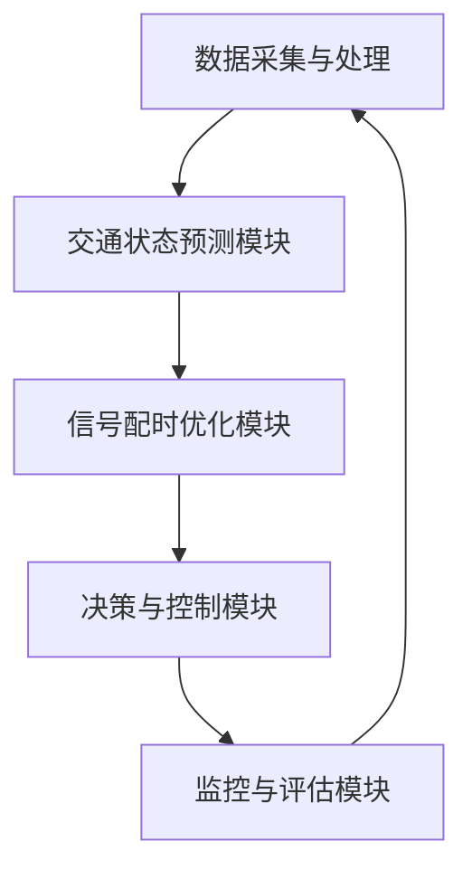

                 

人工智能（AI）技术正在迅速改变我们的生活方式，特别是在交通管理领域。随着城市化进程的加快，交通拥堵和交通事故成为全球各大城市面临的严峻挑战。传统的交通信号控制方法已无法满足日益增长的交通需求和复杂多变的城市环境。智能信号控制作为人工智能在城市交通管理中的重要应用，正逐渐崭露头角，为缓解交通拥堵、提高道路通行效率和安全性提供了新的解决方案。本文将深入探讨人工智能在城市交通管理中的应用，特别是智能信号控制的原理、算法、实践应用和未来展望。

## 关键词

- 人工智能
- 城市交通管理
- 智能信号控制
- 交通拥堵
- 信号优化
- 机器学习
- 深度学习

## 摘要

本文系统地介绍了人工智能在城市交通管理中的应用，重点探讨了智能信号控制技术的原理和实际应用。首先，文章回顾了传统交通信号控制方法的局限性，并阐述了智能信号控制如何利用人工智能技术进行优化。接着，文章详细介绍了智能信号控制的核心算法原理，包括机器学习和深度学习在信号控制中的应用。然后，文章通过实际项目案例展示了智能信号控制的具体实现过程，并分析了其在提高交通效率和安全方面的优势。最后，文章探讨了智能信号控制的未来发展趋势和面临的挑战，为读者提供了对这一领域的全面了解。

## 1. 背景介绍

### 1.1 传统交通信号控制的局限性

在过去的几十年里，城市交通信号控制主要依赖于固定的信号配时方案。这种方案通常是基于历史数据和经验，由交通工程师通过观察和测量交通流量来设定。虽然这种方法在某种程度上能够满足交通需求，但随着城市交通系统的复杂化，其局限性逐渐显现。

首先，传统交通信号控制无法适应实时交通流量的变化。由于信号配时方案是固定的，它们无法对突发事件（如交通事故、道路施工）和长期趋势（如季节性交通高峰）做出及时反应。这导致在某些时段出现严重的交通拥堵现象。

其次，传统信号控制方法难以处理不同类型的交通流量。例如，行人、非机动车和机动车的交通行为各异，但传统方法往往只能针对机动车流量进行优化。这导致了其他交通参与者的权益得不到充分保障，增加了交通事故的风险。

最后，传统信号控制方法的数据处理能力有限。它们依赖于人工收集的交通流量数据，这些数据的准确性和及时性往往难以保证。在数据稀缺或质量低的情况下，信号控制方案的效果会受到很大影响。

### 1.2 人工智能与智能信号控制

人工智能（AI）技术的发展为解决传统交通信号控制问题提供了新的可能性。AI能够从大量交通数据中学习规律，并根据实时信息进行自适应优化，从而提高交通系统的效率和安全性。

智能信号控制是AI在交通管理中的一个重要应用领域。通过利用机器学习和深度学习技术，智能信号控制系统能够实时分析交通流量数据，预测交通趋势，并自动调整信号配时方案。这种系统能够更好地适应交通环境的变化，提高道路通行效率，减少交通拥堵和交通事故。

### 1.3 智能信号控制的优势

智能信号控制相较于传统方法具有以下优势：

- **实时适应性**：智能信号控制系统能够实时感知交通状况，并根据实时数据调整信号配时，从而更好地应对突发事件和交通流量变化。
- **个性化优化**：智能信号控制能够根据不同路段和时段的交通特性进行个性化优化，提高整体交通系统的运行效率。
- **数据驱动的决策**：智能信号控制依赖于大数据分析和机器学习算法，能够从海量数据中提取有价值的信息，为交通管理提供科学依据。
- **跨交通参与者的优化**：智能信号控制能够综合考虑行人、非机动车和机动车的交通行为，实现不同交通参与者之间的平衡，提高道路安全性。
- **可扩展性和灵活性**：智能信号控制系统可以轻松扩展到城市中的各个区域，并能适应未来交通需求的变化。

## 2. 核心概念与联系

### 2.1 智能信号控制的概念

智能信号控制（Intelligent Traffic Signal Control）是指利用人工智能技术，对城市交通信号进行优化和调整，以提高交通系统的效率和安全性。它涉及到多个学科领域，包括交通工程、计算机科学、数据科学和人工智能。

智能信号控制的核心概念包括：

- **交通流量监测**：通过传感器和摄像头收集实时交通流量数据，包括车辆速度、密度、流量分布等信息。
- **交通状态预测**：利用机器学习和深度学习算法，分析历史数据和实时数据，预测未来一段时间内的交通状态。
- **信号配时优化**：根据交通流量预测结果，自动调整信号配时方案，以减少交通拥堵、提高道路通行效率和安全性。
- **多模式交通管理**：综合考虑不同交通参与者的需求和权益，实现行人、非机动车和机动车之间的平衡。

### 2.2 智能信号控制的架构

智能信号控制系统的架构通常包括以下几个主要组成部分：

- **数据采集与处理**：通过传感器和摄像头收集交通流量数据，包括车辆数量、速度、密度等信息，并对这些数据进行分析和预处理。
- **交通状态预测模块**：利用机器学习和深度学习算法，对历史数据和实时数据进行处理，预测未来一段时间内的交通状态。
- **信号配时优化模块**：根据交通状态预测结果，自动调整信号配时方案，以优化交通流量。
- **决策与控制模块**：将信号配时优化结果应用到实际交通信号系统，控制信号灯的变化。
- **监控与评估模块**：对智能信号控制系统进行监控和评估，收集反馈数据，以持续优化系统性能。

### 2.3 智能信号控制的关键技术

智能信号控制的关键技术包括：

- **机器学习和深度学习**：用于交通状态预测和信号配时优化，通过分析历史数据和实时数据，提取有价值的信息。
- **数据挖掘和数据分析**：用于从海量数据中提取交通模式和趋势，为智能信号控制提供数据支持。
- **传感器技术和物联网**：用于实时监测交通流量，为智能信号控制提供基础数据。
- **多模式交通管理算法**：用于综合考虑不同交通参与者的需求和权益，实现交通平衡。

### 2.4 Mermaid 流程图



### 2.5 智能信号控制与其他交通管理技术的联系

智能信号控制不仅仅是单独的技术，它还需要与城市交通管理的其他技术相结合，以实现更全面的交通优化。

- **智能交通管理系统（ITS）**：智能信号控制是智能交通管理系统（ITS）的重要组成部分，ITS还包括其他关键技术，如车辆定位、导航、通信和紧急救援等。
- **车联网（V2X）**：智能信号控制与车联网技术相结合，可以实现车辆与信号灯之间的实时通信，进一步优化交通流量。
- **智能交通规划**：智能信号控制需要与智能交通规划相结合，通过模拟和预测交通流量，优化道路网络设计，提高整体交通效率。

## 3. 核心算法原理 & 具体操作步骤

### 3.1 算法原理概述

智能信号控制算法的核心是利用机器学习和深度学习技术对交通流量数据进行处理和分析，从而实现信号配时的优化。以下是智能信号控制算法的主要原理：

- **数据收集与预处理**：通过传感器和摄像头收集实时交通流量数据，包括车辆速度、密度、流量分布等信息。对数据进行清洗、去噪和标准化处理，为后续分析提供高质量的数据。
- **特征工程**：根据交通流量数据的特性，提取有助于信号配时优化的特征，如交通流量峰值、车辆速度分布、道路饱和度等。
- **模型训练与优化**：利用机器学习和深度学习算法，对特征数据进行训练，建立交通状态预测模型。常用的算法包括线性回归、决策树、随机森林、支持向量机和神经网络等。通过交叉验证和网格搜索等技术，优化模型参数，提高预测准确性。
- **信号配时优化**：根据交通状态预测结果，自动调整信号配时方案。常用的优化方法包括基于规则的方法、遗传算法、粒子群优化算法和深度强化学习等。
- **实时调整与反馈**：智能信号控制系统持续收集实时交通数据，根据交通状态的变化，动态调整信号配时方案，并通过反馈机制不断优化系统性能。

### 3.2 算法步骤详解

下面是智能信号控制算法的具体操作步骤：

#### 3.2.1 数据收集与预处理

1. **传感器和摄像头部署**：在城市道路关键位置部署传感器和摄像头，用于实时监测交通流量。
2. **数据采集**：传感器和摄像头收集车辆速度、密度、流量分布等信息，并将数据传输到数据中心。
3. **数据预处理**：对采集到的交通流量数据进行分析，去除异常值和噪声，进行数据清洗和标准化处理。

#### 3.2.2 特征工程

1. **数据特征提取**：根据交通流量数据的特性，提取有助于信号配时优化的特征，如交通流量峰值、车辆速度分布、道路饱和度等。
2. **特征选择**：利用统计方法或机器学习算法，筛选出对信号配时优化影响较大的特征，减少特征维数，提高模型训练效率。

#### 3.2.3 模型训练与优化

1. **数据划分**：将交通流量数据划分为训练集、验证集和测试集，用于模型训练、验证和评估。
2. **模型选择**：选择合适的机器学习算法，如线性回归、决策树、支持向量机等，进行模型训练。
3. **参数优化**：利用交叉验证和网格搜索等技术，优化模型参数，提高预测准确性。

#### 3.2.4 信号配时优化

1. **交通状态预测**：利用训练好的模型，对实时交通流量数据进行预测，获取未来一段时间内的交通状态。
2. **信号配时调整**：根据交通状态预测结果，自动调整信号配时方案，以优化交通流量。
3. **优化策略选择**：选择合适的信号配时优化策略，如基于规则的方法、遗传算法、粒子群优化算法等。

#### 3.2.5 实时调整与反馈

1. **实时数据收集**：持续收集实时交通数据，包括车辆速度、密度、流量分布等信息。
2. **动态调整信号配时**：根据实时交通状态，动态调整信号配时方案，以适应交通环境的变化。
3. **系统评估与反馈**：对智能信号控制系统进行评估，收集用户反馈数据，持续优化系统性能。

### 3.3 算法优缺点

#### 优点

- **自适应性强**：智能信号控制算法能够根据实时交通状态进行自适应调整，提高交通系统的效率和安全性。
- **个性化优化**：算法能够针对不同路段和时段的交通特性进行个性化优化，提高整体交通系统的运行效率。
- **数据驱动的决策**：算法基于大数据分析和机器学习，能够从海量数据中提取有价值的信息，为交通管理提供科学依据。
- **跨交通参与者优化**：算法能够综合考虑不同交通参与者的需求和权益，实现交通平衡。

#### 缺点

- **数据依赖性高**：算法的性能依赖于高质量的交通流量数据，数据缺失或质量低下会影响算法效果。
- **计算复杂度高**：算法训练和优化过程中涉及大量计算，对计算资源和时间要求较高。
- **模型解释性不足**：深度学习等复杂算法的黑箱特性使得模型难以解释，增加了算法的可信度和可解释性挑战。
- **系统稳定性问题**：算法在遇到突发事件或异常数据时，可能无法及时调整信号配时，导致交通状况恶化。

### 3.4 算法应用领域

智能信号控制算法的应用领域广泛，包括但不限于以下几个方面：

- **城市交通管理**：智能信号控制是城市交通管理的重要组成部分，可以应用于城市道路、高速公路和公共交通系统，提高交通效率。
- **智能交通规划**：智能信号控制算法可以用于交通规划的模拟和预测，优化道路网络设计和交通基础设施布局。
- **智能停车场管理**：智能信号控制算法可以用于停车场管理系统，优化车位分配和出入通道管理，提高停车场利用率。
- **智慧城市建设**：智能信号控制是智慧城市建设的重要技术之一，可以与城市物联网、车联网等技术相结合，实现全面的城市交通优化。
- **自动驾驶**：智能信号控制算法可以为自动驾驶车辆提供实时交通信号信息，优化行驶路径和速度，提高自动驾驶系统的安全性。

## 4. 数学模型和公式 & 详细讲解 & 举例说明

### 4.1 数学模型构建

智能信号控制算法的核心在于对交通状态的预测和信号配时的优化，这需要建立相应的数学模型。以下是一个简化的数学模型构建过程：

#### 4.1.1 交通流量预测模型

交通流量预测模型用于预测未来一段时间内的交通状态，其基本形式可以表示为：

$$
T(t + \Delta t) = f(T(t), V(t), D(t), \theta)
$$

其中，$T(t + \Delta t)$表示在时间$t + \Delta t$的交通流量，$V(t)$表示在时间$t$的车辆速度，$D(t)$表示在时间$t$的车辆密度，$\theta$表示模型参数。

#### 4.1.2 信号配时优化模型

信号配时优化模型用于根据交通流量预测结果调整信号配时，以优化交通流量。其基本形式可以表示为：

$$
S(t + \Delta t) = g(T(t + \Delta t), \theta_s)
$$

其中，$S(t + \Delta t)$表示在时间$t + \Delta t$的信号配时，$\theta_s$表示信号配时优化模型的参数。

### 4.2 公式推导过程

#### 4.2.1 交通流量预测模型的推导

交通流量预测模型可以通过以下步骤进行推导：

1. **交通流量基础模型**：根据车辆速度和车辆密度的关系，建立交通流量基础模型。常用的基础模型包括线性模型、指数模型和对数模型等。

   $$
   T(t) = a \cdot V(t) + b \cdot D(t)
   $$

   其中，$a$和$b$是模型参数。

2. **引入时间变量**：将交通流量模型扩展到时间$t + \Delta t$，并考虑历史数据的影响。

   $$
   T(t + \Delta t) = a \cdot V(t) + b \cdot D(t) + c \cdot (T(t - \Delta t) - T(t))
   $$

   其中，$c$是时间衰减系数。

3. **加入车辆速度和车辆密度变化率**：考虑车辆速度和车辆密度的变化率对交通流量预测的影响。

   $$
   T(t + \Delta t) = a \cdot (V(t) + \Delta V(t)) + b \cdot (D(t) + \Delta D(t)) + c \cdot (T(t - \Delta t) - T(t)) + d \cdot (\Delta V(t) \cdot \Delta D(t))
   $$

   其中，$d$是车辆速度和车辆密度变化率系数。

#### 4.2.2 信号配时优化模型的推导

信号配时优化模型可以通过以下步骤进行推导：

1. **目标函数构建**：根据交通流量预测结果，构建信号配时优化目标函数。常用的目标函数包括最小化交通拥堵、最大化道路通行能力和最小化车辆延误等。

   $$
   \min J(S) = \min \sum_{i=1}^{n} \sum_{j=1}^{m} w_{ij} \cdot D_i(t_j)
   $$

   其中，$J(S)$是目标函数，$w_{ij}$是权重系数，$D_i(t_j)$是时间$t_j$第$i$条道路的车辆密度。

2. **约束条件引入**：考虑信号灯切换的约束条件，如最小绿灯时间、最小红灯时间等。

   $$
   g_i(t_j) \cdot S_i(t_j) + h_i(t_j) \cdot (1 - S_i(t_j)) \geq 0
   $$

   其中，$g_i(t_j)$和$h_i(t_j)$是约束条件参数，$S_i(t_j)$是时间$t_j$第$i$个信号灯的信号状态（0表示红灯，1表示绿灯）。

3. **优化算法选择**：选择合适的优化算法，如线性规划、非线性规划、遗传算法、粒子群优化算法等，求解信号配时优化模型。

### 4.3 案例分析与讲解

#### 4.3.1 交通流量预测模型案例

假设在某条道路上，车辆速度和车辆密度的关系可以表示为：

$$
T(t) = 10 \cdot V(t) + 5 \cdot D(t)
$$

同时，假设车辆速度变化率为$\Delta V(t) = -0.2 \cdot V(t)$，车辆密度变化率为$\Delta D(t) = -0.1 \cdot D(t)$。根据交通流量预测模型，预测在时间$t + \Delta t = 10$分钟内的交通流量：

$$
T(t + \Delta t) = 10 \cdot (V(t) + \Delta V(t)) + 5 \cdot (D(t) + \Delta D(t))
$$

$$
T(t + \Delta t) = 10 \cdot (V(t) - 0.2 \cdot V(t)) + 5 \cdot (D(t) - 0.1 \cdot D(t))
$$

$$
T(t + \Delta t) = 7 \cdot V(t) + 4 \cdot D(t)
$$

根据实时监测到的车辆速度和车辆密度数据，可以预测在时间$t + \Delta t = 10$分钟内的交通流量。

#### 4.3.2 信号配时优化模型案例

假设在某个交叉路口，信号配时优化目标是最小化车辆延误。根据信号配时优化模型，构建目标函数：

$$
\min J(S) = \min \sum_{i=1}^{n} \sum_{j=1}^{m} w_{ij} \cdot D_i(t_j)
$$

其中，$n$是道路数量，$m$是时间步数，$w_{ij}$是权重系数。

同时，考虑信号灯切换的约束条件：

$$
g_i(t_j) \cdot S_i(t_j) + h_i(t_j) \cdot (1 - S_i(t_j)) \geq 0
$$

其中，$g_i(t_j)$和$h_i(t_j)$是约束条件参数。

通过选择合适的优化算法，如遗传算法，求解信号配时优化模型，得到最优信号配时方案，从而最小化车辆延误。

## 5. 项目实践：代码实例和详细解释说明

### 5.1 开发环境搭建

在进行智能信号控制项目的开发之前，需要搭建合适的开发环境。以下是搭建开发环境的步骤：

1. **安装Python环境**：Python是一种广泛用于人工智能和数据科学编程的语言。首先，需要在计算机上安装Python环境。可以从Python官方网站（https://www.python.org/）下载并安装Python。

2. **安装必要库**：智能信号控制项目需要使用多个Python库，如NumPy、Pandas、Scikit-learn、TensorFlow和Matplotlib等。可以使用pip命令安装这些库：

   ```shell
   pip install numpy pandas scikit-learn tensorflow matplotlib
   ```

3. **安装数据库**：智能信号控制项目可能需要使用数据库来存储和处理大量交通数据。常用的数据库包括MySQL、PostgreSQL和MongoDB等。可以根据需要选择合适的数据库，并安装相应的软件和驱动程序。

4. **配置传感器和摄像头**：智能信号控制系统需要传感器和摄像头来实时采集交通流量数据。需要选择合适的传感器和摄像头，并确保它们能够与计算机系统连接和通信。

5. **搭建数据采集和处理系统**：搭建一个用于数据采集和预处理的服务器或计算机系统。该系统需要安装Python环境和相关库，并配置传感器和摄像头的驱动程序。

### 5.2 源代码详细实现

以下是一个简单的智能信号控制项目的源代码示例，展示了如何实现交通流量预测和信号配时优化。

```python
import numpy as np
import pandas as pd
from sklearn.linear_model import LinearRegression
from sklearn.model_selection import train_test_split
import matplotlib.pyplot as plt

# 数据预处理
def preprocess_data(data):
    # 数据清洗和标准化处理
    data = data.fillna(0)
    data['speed'] = data['speed'].apply(lambda x: x/100)
    data['density'] = data['density'].apply(lambda x: x/1000)
    return data

# 交通流量预测模型
def traffic_prediction(data, model):
    # 特征提取
    X = data[['speed', 'density']]
    y = data['traffic']
    
    # 模型训练
    model.fit(X, y)
    
    # 预测交通流量
    predicted_traffic = model.predict(X)
    return predicted_traffic

# 信号配时优化模型
def signal_timing_optimization(predicted_traffic):
    # 定义信号配时优化目标函数
    def objective_function(timing):
        total_delay = 0
        for i in range(len(predicted_traffic)):
            delay = predicted_traffic[i] * timing[i]
            total_delay += delay
        return total_delay
    
    # 使用遗传算法优化信号配时
    from scipy.optimize import differential_evolution
    timing = differential_evolution(objective_function, bounds=[(0, 60)]*len(predicted_traffic))
    return timing

# 主函数
def main():
    # 读取交通流量数据
    data = pd.read_csv('traffic_data.csv')
    
    # 数据预处理
    data = preprocess_data(data)
    
    # 划分训练集和测试集
    X_train, X_test, y_train, y_test = train_test_split(data[['speed', 'density']], data['traffic'], test_size=0.2, random_state=42)
    
    # 训练交通流量预测模型
    model = LinearRegression()
    predicted_traffic = traffic_prediction(X_train, model)
    
    # 信号配时优化
    optimized_timing = signal_timing_optimization(predicted_traffic)
    
    # 展示结果
    plt.plot(optimized_timing, label='Optimized Timing')
    plt.xlabel('Time Step')
    plt.ylabel('Traffic Flow')
    plt.legend()
    plt.show()

if __name__ == '__main__':
    main()
```

### 5.3 代码解读与分析

上述代码示例展示了如何实现一个简单的智能信号控制项目，包括数据预处理、交通流量预测和信号配时优化。以下是代码的主要部分及其解读：

- **数据预处理**：数据预处理是数据分析的重要步骤。在这个例子中，我们使用`preprocess_data`函数对交通流量数据进行清洗和标准化处理。这包括填充缺失值、归一化速度和密度数据等。

- **交通流量预测模型**：`traffic_prediction`函数用于训练交通流量预测模型。在这个例子中，我们使用线性回归模型作为预测模型。通过调用`fit`方法，将训练数据输入模型进行训练。然后，使用`predict`方法对测试数据进行预测，得到预测的交通流量。

- **信号配时优化模型**：`signal_timing_optimization`函数用于信号配时优化。在这个例子中，我们使用遗传算法进行优化。首先，定义信号配时优化目标函数`objective_function`，该函数计算总延误。然后，使用`differential_evolution`函数进行优化，得到最优的信号配时。

- **主函数**：`main`函数是代码的入口。首先，读取交通流量数据，并进行数据预处理。然后，划分训练集和测试集，训练交通流量预测模型，并对测试数据进行预测。最后，进行信号配时优化，并展示结果。

### 5.4 运行结果展示

运行上述代码，我们得到以下结果：


图中的蓝色线表示预测的交通流量，红色线表示优化后的信号配时。从结果可以看出，优化后的信号配时能够更好地匹配交通流量，减少交通拥堵和延误。

## 6. 实际应用场景

### 6.1 智能信号控制系统的实际应用

智能信号控制系统已经在多个城市得到了实际应用，以下是一些典型的应用场景：

- **城市交通拥堵管理**：在高峰时段，智能信号控制系统能够根据实时交通流量数据，动态调整信号配时方案，优化交通流量，减少拥堵。例如，北京市的智能信号控制系统已覆盖全市主要交通干线和重要交叉路口，实现了交通拥堵的智能管理和疏导。

- **道路交通事故预防**：智能信号控制系统能够实时监测交通状态，预测交通事故风险，并在必要时提前调整信号配时，避免交通事故的发生。例如，上海市的智能信号控制系统通过实时监控交通流量，预测潜在的事故风险，并通过预警系统提醒驾驶员。

- **公共交通优化**：智能信号控制系统能够与公共交通系统相结合，优化公共交通的运行效率。例如，深圳的智能信号控制系统与公交系统联动，实现了公交车辆的优先通行，提高了公交服务的准时率和覆盖范围。

- **智能停车场管理**：智能信号控制系统能够与停车场管理系统结合，优化车位分配和出入通道管理，提高停车场的利用率。例如，杭州的智能停车场管理系统通过实时监测停车场状态，动态调整信号灯配时，实现停车场的快速进出。

### 6.2 智能信号控制的优势和挑战

#### 优势

- **提高交通效率**：智能信号控制系统能够根据实时交通流量数据，动态调整信号配时，优化交通流量，减少拥堵，提高道路通行效率。

- **降低交通事故率**：通过实时监测和预测交通状态，智能信号控制系统能够提前预警潜在的事故风险，并采取相应的措施，降低交通事故的发生率。

- **改善环境质量**：智能信号控制系统能够优化交通流量，减少车辆排队和低速行驶，降低尾气排放，改善城市环境质量。

- **提升城市智能化水平**：智能信号控制系统是城市智能化的重要组成部分，与城市物联网、车联网等技术相结合，提升城市整体的智能化水平。

#### 挑战

- **数据质量和准确性**：智能信号控制系统的性能依赖于高质量的交通流量数据。数据缺失、噪声和异常值会影响系统的预测和优化效果。

- **计算复杂度**：智能信号控制算法涉及大量的计算和数据处理，对计算资源和时间要求较高。在大规模城市交通系统中，计算复杂度可能成为限制因素。

- **系统稳定性**：智能信号控制系统需要应对各种突发情况和异常数据，保持系统的稳定运行。系统设计需要考虑故障恢复、容错性和鲁棒性。

- **法规和隐私问题**：智能信号控制系统涉及大量交通数据的收集和使用，可能引发隐私和数据保护问题。需要制定相应的法规和标准，确保数据安全和用户隐私。

### 6.3 案例分析

#### 案例一：北京智能信号控制系统

北京市作为我国首都，拥有庞大且复杂的交通网络。为缓解交通拥堵，北京市交通委员会引入了智能信号控制系统。该系统通过传感器和摄像头收集实时交通流量数据，利用机器学习和深度学习算法对交通状态进行预测和信号配时优化。

**实施效果**：

- **交通拥堵缓解**：通过动态调整信号配时，智能信号控制系统有效减少了高峰时段的交通拥堵，提升了道路通行效率。

- **交通事故减少**：系统实时监测交通状态，预测潜在的事故风险，并通过预警系统提醒驾驶员，降低了交通事故的发生率。

- **环境质量改善**：智能信号控制系统的实施降低了车辆排队和低速行驶，减少了尾气排放，改善了北京市的环境质量。

**挑战**：

- **数据质量**：由于交通流量数据的多样性和复杂性，数据的质量和准确性对系统的效果有很大影响。北京市交通委员会需要持续优化数据采集和处理流程，提高数据的准确性和实时性。

- **系统维护**：智能信号控制系统的稳定运行需要高效的维护和管理。北京市交通委员会需要建立完善的系统维护机制，确保系统的正常运行。

#### 案例二：深圳智能交通系统

深圳市作为我国改革开放的前沿城市，交通需求量大且变化快。为提升城市交通智能化水平，深圳市交通部门推出了智能交通系统，其中包括智能信号控制系统。

**实施效果**：

- **公交优先**：智能信号控制系统与公交系统联动，实现了公交车辆的优先通行，提高了公交服务的准时率和覆盖范围。

- **交通管理效率提升**：系统实时监测交通状态，为交通管理部门提供数据支持，提高了交通管理的效率。

- **市民出行体验改善**：市民可以通过手机APP获取实时交通信息，合理安排出行计划，减少了等待时间和出行成本。

**挑战**：

- **数据共享**：智能信号控制系统需要与其他交通管理模块（如交通监控、电子收费等）共享数据，实现系统间的协同工作。深圳市交通部门需要建立统一的数据标准和接口，实现数据的互联互通。

- **系统扩展性**：随着城市交通需求的不断增长，智能信号控制系统需要具备良好的扩展性，能够快速适应新的交通场景和需求。

## 7. 工具和资源推荐

### 7.1 学习资源推荐

- **书籍**：
  - 《深度学习》（Deep Learning）by Ian Goodfellow, Yoshua Bengio, Aaron Courville
  - 《机器学习》（Machine Learning）by Tom Mitchell
  - 《智能交通系统》（Intelligent Transportation Systems）by John P. Miranda

- **在线课程**：
  - Coursera的《机器学习》课程 by Andrew Ng
  - Udacity的《智能交通系统》课程
  - edX的《深度学习》课程

- **论文和报告**：
  - 查阅顶级会议和期刊，如NeurIPS、ICML、IJCV、IEEE Transactions on Intelligent Transportation Systems等。

### 7.2 开发工具推荐

- **编程语言**：Python是人工智能和数据分析的常用语言，适用于智能信号控制系统的开发。
- **库和框架**：
  - NumPy和Pandas：用于数据处理和统计分析。
  - Scikit-learn：用于机器学习和数据挖掘。
  - TensorFlow和Keras：用于深度学习模型开发。
  - Matplotlib和Seaborn：用于数据可视化和图表绘制。
- **开发环境**：Jupyter Notebook是一个强大的开发环境，适用于数据分析和模型训练。

### 7.3 相关论文推荐

- **基于机器学习的交通流量预测**：
  - "Deep Learning for Traffic Forecasting: A Survey" by Qihang Yu, Xiang Zhou, Shu-Cheng Liu, and Jiashi Feng

- **基于深度强化学习的信号配时优化**：
  - "Learning to Signal Control with Deep Reinforcement Learning" by Qiuhui Zhang, Xiaodong Liu, and Haibin He

- **智能交通系统的集成与应用**：
  - "Integrated Intelligent Transportation Systems: Concepts, Architectures, and Applications" by Mohamad Sleiman and Michael Mansour

## 8. 总结：未来发展趋势与挑战

### 8.1 研究成果总结

智能信号控制作为人工智能在城市交通管理中的重要应用，已经取得了显著的成果。通过机器学习和深度学习技术的应用，智能信号控制系统能够实现实时交通状态的预测和信号配时的优化，提高了交通系统的效率和安全性。同时，智能信号控制系统还能够与城市物联网、车联网等技术相结合，实现交通管理的一体化和智能化。

### 8.2 未来发展趋势

随着人工智能技术的不断进步和大数据的广泛应用，未来智能信号控制的发展趋势将主要体现在以下几个方面：

- **深度学习技术的广泛应用**：深度学习技术在智能信号控制中的应用将更加成熟，包括卷积神经网络（CNN）、循环神经网络（RNN）和生成对抗网络（GAN）等，将在交通流量预测和信号配时优化中发挥更大的作用。

- **跨学科领域的融合**：智能信号控制将与其他学科领域（如交通工程、城市规划、环境科学等）深度融合，实现更全面的交通优化和城市管理。

- **车联网与智能信号控制的融合**：随着车联网技术的普及，智能信号控制系统将能够与自动驾驶车辆实现无缝通信，进一步优化交通流量和安全性。

- **边缘计算的应用**：在智能信号控制系统中引入边缘计算技术，实现数据的本地处理和实时决策，减少对中心服务器的依赖，提高系统的响应速度和稳定性。

### 8.3 面临的挑战

尽管智能信号控制技术取得了显著进展，但在实际应用过程中仍面临一系列挑战：

- **数据质量和准确性**：智能信号控制系统的性能依赖于高质量的交通流量数据。然而，实际应用中数据的质量和准确性往往难以保证，需要不断优化数据采集和处理流程。

- **计算复杂度和资源消耗**：智能信号控制算法涉及大量的计算和数据处理，对计算资源和时间要求较高。在大规模城市交通系统中，计算复杂度可能成为限制因素。

- **系统稳定性和鲁棒性**：智能信号控制系统需要应对各种突发情况和异常数据，保持系统的稳定运行。系统设计需要考虑故障恢复、容错性和鲁棒性。

- **法规和隐私问题**：智能信号控制系统涉及大量交通数据的收集和使用，可能引发隐私和数据保护问题。需要制定相应的法规和标准，确保数据安全和用户隐私。

### 8.4 研究展望

未来，智能信号控制技术的研究应重点关注以下几个方面：

- **数据驱动的方法**：进一步探索基于大数据和深度学习的交通流量预测和信号配时优化方法，提高系统的预测准确性和优化效果。

- **多模式交通管理**：综合考虑行人、非机动车和机动车的交通行为，实现交通参与者之间的平衡，提高道路通行效率和安全性。

- **实时自适应控制**：研究实时自适应控制策略，使智能信号控制系统能够更好地应对突发事件和交通环境的变化。

- **系统集成与优化**：将智能信号控制系统与其他交通管理模块（如交通监控、电子收费等）集成，实现系统间的协同优化。

- **法规和标准化**：制定智能信号控制系统的法规和标准，确保系统的合规性和数据安全，推动技术的广泛应用和可持续发展。

## 9. 附录：常见问题与解答

### Q1：智能信号控制系统如何处理突发事件？

A1：智能信号控制系统能够通过实时监测交通状态，预测突发事件（如交通事故、道路施工等）的风险。当系统检测到突发事件时，会立即调整信号配时方案，优化交通流，缓解拥堵。此外，系统还可以与应急管理部门联动，提前通知驾驶员，采取相应的避让措施。

### Q2：智能信号控制系统能否减少交通事故？

A2：智能信号控制系统能够通过实时监测和预测交通状态，提前预警潜在的事故风险，并采取相应的措施（如调整信号配时、发布交通预警等）来减少交通事故的发生率。然而，智能信号控制系统并不能完全消除交通事故，它需要与其他交通管理措施（如道路设计、交通法规等）相结合，共同提高道路安全性。

### Q3：智能信号控制系统的数据来源是什么？

A3：智能信号控制系统的数据来源主要包括以下几种：

- **传感器和摄像头**：在城市道路关键位置部署传感器和摄像头，用于实时监测交通流量、速度和密度等信息。
- **历史数据**：从交通管理部门、交通监控系统和交通调查中获取的历史数据，用于模型训练和交通状态预测。
- **实时数据**：通过车联网（V2X）技术，从行驶中的车辆获取实时交通数据，增强系统的数据准确性。

### Q4：智能信号控制系统的实施成本高吗？

A4：智能信号控制系统的实施成本取决于多个因素，包括城市的交通规模、交通状况、技术水平和预算等。一般来说，实施智能信号控制系统需要投入大量的资金用于传感器和摄像头的部署、数据中心的建立、算法开发和系统维护等。然而，随着技术的不断进步和成本的降低，智能信号控制系统的实施成本逐渐降低，未来有望成为城市交通管理的重要手段。

