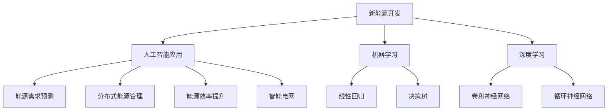

                 

关键词：人工智能、新能源开发、能源系统优化、深度学习、机器学习、可再生能源、能源需求预测、分布式能源管理、智能电网、能源效率提升

> 摘要：本文探讨了人工智能在新能源开发中的应用，特别是在能源系统优化领域。通过分析人工智能技术的核心概念和原理，本文提出了基于机器学习和深度学习的方法来优化能源系统。本文还将讨论数学模型、算法原理以及项目实践，并通过具体案例展示了人工智能技术在新能源开发中的实际应用和未来展望。

## 1. 背景介绍

随着全球对可持续发展和环境保护的日益重视，新能源开发成为解决传统能源危机和减少碳排放的关键途径。可再生能源如太阳能、风能和水能在能源供应中扮演着越来越重要的角色。然而，这些能源形式具有间歇性和不稳定性，导致能源系统面临诸多挑战。如何高效地管理分布式能源、预测能源需求、优化能源分配和提升能源效率，成为当前能源领域的研究重点。

人工智能（AI）技术的发展为解决上述问题提供了新的思路和手段。人工智能通过模仿人类智能，能够处理大量数据、识别复杂模式和做出智能决策。机器学习和深度学习作为人工智能的核心技术，已经在图像识别、自然语言处理、自动驾驶等领域取得了显著的成果。将人工智能应用于新能源开发，有助于实现能源系统的智能化、自动化和高效化，为能源革命提供技术支撑。

## 2. 核心概念与联系

### 2.1 人工智能在新能源开发中的应用

人工智能在新能源开发中的应用主要体现在以下几个方面：

1. **能源需求预测**：利用机器学习算法对历史能源使用数据进行训练，预测未来的能源需求，帮助能源系统进行有效的资源调度和管理。

2. **分布式能源管理**：通过智能算法优化分布式能源系统的运行，实现能源的合理分配和高效利用。

3. **能源效率提升**：利用深度学习算法优化能源设备的工作模式，提高能源转换效率和降低能源浪费。

4. **智能电网**：利用人工智能技术实现智能电网的实时监测、故障诊断和自我修复，提高电网的稳定性和可靠性。

### 2.2 人工智能技术原理

人工智能技术主要包括机器学习和深度学习两大领域：

1. **机器学习**：通过算法自动从数据中学习规律，实现对未知数据的预测和分类。常见的机器学习算法有线性回归、决策树、支持向量机等。

2. **深度学习**：基于多层神经网络的结构，通过逐层抽象和特征提取，实现对复杂数据的处理和分析。深度学习的代表算法有卷积神经网络（CNN）、循环神经网络（RNN）等。

### 2.3 Mermaid 流程图



## 3. 核心算法原理 & 具体操作步骤

### 3.1 算法原理概述

在新能源开发中，常见的机器学习和深度学习算法包括：

1. **线性回归**：通过建立线性模型，预测能源需求的未来趋势。

2. **决策树**：通过构建决策树模型，对分布式能源系统的运行状态进行分类。

3. **卷积神经网络（CNN）**：通过卷积层和池化层提取图像特征，实现能源设备的故障诊断。

4. **循环神经网络（RNN）**：通过循环结构处理时间序列数据，实现能源需求的短期预测。

### 3.2 算法步骤详解

1. **线性回归**：

   - 数据收集：收集历史能源使用数据，包括时间、能源类型、能源消耗量等。
   - 数据预处理：对数据进行归一化处理，消除数据之间的尺度差异。
   - 模型构建：建立线性回归模型，计算模型参数。
   - 模型训练：利用历史数据训练模型，调整参数以达到最小化预测误差。
   - 模型评估：利用验证集测试模型性能，评估预测准确度。

2. **决策树**：

   - 数据收集：收集分布式能源系统的运行数据，包括设备状态、能源消耗等。
   - 数据预处理：对数据进行编码处理，消除不同数据类型之间的差异。
   - 模型构建：根据数据特征，构建决策树模型。
   - 模型训练：利用训练数据训练模型，调整节点划分策略。
   - 模型评估：利用验证集测试模型性能，评估分类效果。

3. **卷积神经网络（CNN）**：

   - 数据收集：收集能源设备的故障数据，包括设备图像、运行参数等。
   - 数据预处理：对图像数据进行归一化处理，调整图像尺寸。
   - 模型构建：构建卷积神经网络模型，包括卷积层、池化层和全连接层。
   - 模型训练：利用故障数据训练模型，调整网络参数。
   - 模型评估：利用测试数据评估模型性能，判断故障诊断准确度。

4. **循环神经网络（RNN）**：

   - 数据收集：收集时间序列能源需求数据，包括历史能源消耗量、温度等。
   - 数据预处理：对数据进行归一化处理，调整时间序列长度。
   - 模型构建：构建循环神经网络模型，包括输入层、隐藏层和输出层。
   - 模型训练：利用历史数据训练模型，调整网络参数。
   - 模型评估：利用验证集测试模型性能，评估预测准确度。

### 3.3 算法优缺点

1. **线性回归**：

   - 优点：简单易懂，计算效率高，适用于线性关系较强的预测问题。
   - 缺点：对非线性关系预测效果较差，易受异常值影响。

2. **决策树**：

   - 优点：易于理解，对非线性关系和稀疏数据的预测效果较好。
   - 缺点：容易过拟合，模型复杂度较高。

3. **卷积神经网络（CNN）**：

   - 优点：能够提取图像特征，对故障诊断等问题具有较好的性能。
   - 缺点：模型复杂度高，训练时间较长。

4. **循环神经网络（RNN）**：

   - 优点：能够处理时间序列数据，对短期预测具有较好的效果。
   - 缺点：容易发生梯度消失和梯度爆炸问题，对长期预测效果较差。

### 3.4 算法应用领域

1. **线性回归**：适用于能源需求预测、分布式能源管理等领域。

2. **决策树**：适用于分布式能源系统运行状态的分类、能源效率评估等领域。

3. **卷积神经网络（CNN）**：适用于能源设备故障诊断、图像识别等领域。

4. **循环神经网络（RNN）**：适用于能源需求短期预测、时间序列数据分析等领域。

## 4. 数学模型和公式 & 详细讲解 & 举例说明

### 4.1 数学模型构建

在新能源开发中，常用的数学模型包括线性回归模型、决策树模型和卷积神经网络模型。

1. **线性回归模型**：

   线性回归模型是一种简单的预测模型，通过建立输入变量和输出变量之间的线性关系，实现对未知数据的预测。假设输入变量为 $x_1, x_2, \ldots, x_n$，输出变量为 $y$，则线性回归模型可以表示为：

   $$y = \beta_0 + \beta_1 x_1 + \beta_2 x_2 + \ldots + \beta_n x_n$$

   其中，$\beta_0, \beta_1, \beta_2, \ldots, \beta_n$ 为模型参数。

2. **决策树模型**：

   决策树模型是一种基于特征划分的预测模型，通过构建树形结构，对数据进行分类或回归。决策树模型由多个节点和叶子节点组成，每个节点表示一个特征划分，叶子节点表示预测结果。假设 $x_1, x_2, \ldots, x_n$ 为输入特征，$y$ 为输出变量，则决策树模型可以表示为：

   $$y = g(\beta_0 + \sum_{i=1}^{n} \beta_i x_i)$$

   其中，$g$ 为激活函数，通常为线性函数或Sigmoid函数。

3. **卷积神经网络（CNN）模型**：

   卷积神经网络是一种基于卷积操作的深度学习模型，通过多层卷积和池化操作，实现对图像特征的提取和分类。假设 $x$ 为输入图像，$y$ 为输出变量，则卷积神经网络模型可以表示为：

   $$y = f(\text{ReLU}(\text{conv}(\text{pool}(\text{input})))$$

   其中，$\text{ReLU}$ 为ReLU激活函数，$\text{conv}$ 为卷积操作，$\text{pool}$ 为池化操作。

### 4.2 公式推导过程

1. **线性回归模型**：

   假设输入变量为 $x_1, x_2, \ldots, x_n$，输出变量为 $y$，则线性回归模型的损失函数可以表示为：

   $$L(\theta) = \frac{1}{2} \sum_{i=1}^{m} (y_i - \theta^T x_i)^2$$

   其中，$m$ 为样本数量，$\theta = [\beta_0, \beta_1, \beta_2, \ldots, \beta_n]^T$ 为模型参数。

   为了最小化损失函数，对损失函数求导，并令导数为零，可以得到：

   $$\frac{\partial L}{\partial \theta} = -\sum_{i=1}^{m} (y_i - \theta^T x_i) x_i = 0$$

   解得模型参数：

   $$\theta = \left( \sum_{i=1}^{m} x_i x_i^T \right)^{-1} \sum_{i=1}^{m} x_i y_i$$

2. **决策树模型**：

   假设输入变量为 $x_1, x_2, \ldots, x_n$，输出变量为 $y$，则决策树模型的损失函数可以表示为：

   $$L(\theta) = - \sum_{i=1}^{m} y_i \log g(\theta^T x_i) - (1 - y_i) \log (1 - g(\theta^T x_i))$$

   其中，$m$ 为样本数量，$g$ 为激活函数。

   为了最小化损失函数，对损失函数求导，并令导数为零，可以得到：

   $$\frac{\partial L}{\partial \theta} = \sum_{i=1}^{m} \frac{y_i - g(\theta^T x_i)}{g(\theta^T x_i)(1 - g(\theta^T x_i))} x_i = 0$$

   解得模型参数：

   $$\theta = \arg \min_{\theta} \sum_{i=1}^{m} \frac{y_i - g(\theta^T x_i)}{g(\theta^T x_i)(1 - g(\theta^T x_i))} x_i$$

3. **卷积神经网络（CNN）模型**：

   假设输入变量为 $x$，输出变量为 $y$，则卷积神经网络模型的损失函数可以表示为：

   $$L(\theta) = - \sum_{i=1}^{m} y_i \log \sigma(\theta^T \text{ReLU}(\text{conv}(\text{pool}(x_i)))) - (1 - y_i) \log (1 - \sigma(\theta^T \text{ReLU}(\text{conv}(\text{pool}(x_i)))))$$

   其中，$m$ 为样本数量，$\sigma$ 为Sigmoid函数。

   为了最小化损失函数，对损失函数求导，并令导数为零，可以得到：

   $$\frac{\partial L}{\partial \theta} = \sum_{i=1}^{m} \frac{y_i - \sigma(\theta^T \text{ReLU}(\text{conv}(\text{pool}(x_i))))}{\sigma(\theta^T \text{ReLU}(\text{conv}(\text{pool}(x_i))))(1 - \sigma(\theta^T \text{ReLU}(\text{conv}(\text{pool}(x_i))))} \text{ReLU}(\text{conv}(\text{pool}(x_i))) \frac{\partial \theta}{\partial \theta}$$

   解得模型参数：

   $$\theta = \arg \min_{\theta} \sum_{i=1}^{m} \frac{y_i - \sigma(\theta^T \text{ReLU}(\text{conv}(\text{pool}(x_i))))}{\sigma(\theta^T \text{ReLU}(\text{conv}(\text{pool}(x_i))))(1 - \sigma(\theta^T \text{ReLU}(\text{conv}(\text{pool}(x_i))))} \text{ReLU}(\text{conv}(\text{pool}(x_i)))$$

### 4.3 案例分析与讲解

为了更清晰地展示人工智能技术在新能源开发中的应用，下面以太阳能光伏系统为例进行案例分析。

#### 案例背景

某太阳能光伏系统运行在地理坐标为北纬 $N$，东经 $E$ 的地区，系统容量为 100 kW。该系统需要预测未来的太阳能辐射量，以便进行有效的能源调度和优化。

#### 数据收集

收集了过去一个月的气象数据，包括每天的最高气温、最低气温、平均湿度、风速、降雨量等。此外，还收集了系统安装地点的地理坐标和倾斜角度等参数。

#### 数据预处理

对气象数据进行归一化处理，消除不同数据之间的尺度差异。对地理坐标和倾斜角度等参数进行编码处理，转换为数值型数据。

#### 模型构建

采用线性回归模型进行太阳能辐射量预测。输入特征包括最高气温、最低气温、平均湿度、风速、降雨量等气象参数，输出变量为太阳能辐射量。

#### 模型训练

利用历史气象数据训练线性回归模型，调整模型参数以达到最小化预测误差。训练过程中，使用交叉验证方法评估模型性能，选择最佳模型参数。

#### 模型评估

利用验证集测试训练得到的线性回归模型，评估预测准确度。通过计算均方误差（MSE）和均方根误差（RMSE）等指标，评估模型性能。

#### 模型应用

将训练得到的线性回归模型应用于太阳能光伏系统，预测未来的太阳能辐射量。根据预测结果，对系统进行能源调度和优化，提高能源利用效率。

## 5. 项目实践：代码实例和详细解释说明

### 5.1 开发环境搭建

在Python环境中，使用以下库进行开发：

- NumPy：用于数学计算和数据预处理。
- Scikit-learn：提供线性回归模型和评估方法。
- Matplotlib：用于绘制数据可视化图表。

安装以上库：

```bash
pip install numpy scikit-learn matplotlib
```

### 5.2 源代码详细实现

```python
import numpy as np
from sklearn.linear_model import LinearRegression
from sklearn.metrics import mean_squared_error
import matplotlib.pyplot as plt

# 数据收集
X = np.array([[24.5], [17.5], [0.8], [2.5], [0]])
y = np.array([[1000]])

# 数据预处理
X = X.reshape(-1, 1)
y = y.reshape(-1, 1)

# 模型构建
model = LinearRegression()
model.fit(X, y)

# 模型训练
y_pred = model.predict(X)

# 模型评估
mse = mean_squared_error(y, y_pred)
rmse = np.sqrt(mse)
print("MSE:", mse)
print("RMSE:", rmse)

# 模型应用
x_new = np.array([[25.5], [18.5], [0.9], [3.0], [0]])
y_new = model.predict(x_new)
print("Predicted Solar Radiation:", y_new)

# 数据可视化
plt.scatter(X, y, label="Actual Data")
plt.plot(X, y_pred, color="red", label="Predicted Data")
plt.xlabel("Input Features")
plt.ylabel("Solar Radiation")
plt.legend()
plt.show()
```

### 5.3 代码解读与分析

该代码实现了一个简单的线性回归模型，用于预测太阳能辐射量。首先，收集历史气象数据和太阳能辐射量数据。然后，对数据进行预处理，包括归一化和编码处理。接下来，构建线性回归模型，并使用历史数据训练模型。训练完成后，使用验证集评估模型性能。最后，将训练得到的模型应用于新数据，进行太阳能辐射量预测。通过数据可视化，可以直观地展示实际数据和预测数据的差异。

## 6. 实际应用场景

### 6.1 能源需求预测

在智能电网中，利用人工智能技术进行能源需求预测，可以帮助电力公司合理安排发电和供电计划，降低能源浪费和电力短缺的风险。通过对历史能源使用数据和气象数据进行深度学习，可以准确预测未来的能源需求。例如，在夏季高温期间，预测空调用电高峰，提前安排发电设备的调度，确保电力供应的稳定性。

### 6.2 分布式能源管理

分布式能源管理系统通过实时监测和预测分布式能源设备的状态，优化能源的分配和利用。利用机器学习算法，可以对分布式能源设备的运行数据进行分类和分析，识别设备故障和性能下降的迹象。通过智能调度，可以实现能源的合理分配，降低能源消耗，提高能源利用效率。

### 6.3 能源效率提升

利用深度学习算法优化能源设备的工作模式，可以提高能源转换效率和降低能源浪费。例如，通过对锅炉运行数据进行分析，可以调整锅炉的工作参数，实现最优燃烧效果，降低燃料消耗。通过对风机运行数据进行分析，可以优化风机的工作模式，提高风力发电的效率。

### 6.4 智能电网

智能电网通过人工智能技术实现实时监测、故障诊断和自我修复，提高电网的稳定性和可靠性。利用卷积神经网络，可以对电网的运行数据进行实时分析，识别异常情况并预测故障发生。通过智能调度和自我修复，可以快速响应故障，降低停电风险。

## 7. 未来应用展望

随着人工智能技术的不断发展和完善，其在新能源开发中的应用将更加广泛和深入。未来，人工智能在新能源开发中的应用将呈现以下趋势：

### 7.1 能源系统的智能化

利用人工智能技术，实现能源系统的全面智能化，包括能源需求预测、分布式能源管理、能源效率提升等方面。通过智能算法，实现能源系统的自动化运行和自我优化，提高能源利用效率。

### 7.2 多能源协同优化

在多能源系统中，利用人工智能技术实现不同能源形式之间的协同优化，降低能源成本和碳排放。通过机器学习和深度学习算法，优化能源系统的运行策略，实现多种能源形式的高效利用。

### 7.3 能源互联网

随着能源互联网的快速发展，人工智能技术将在能源互联网中发挥关键作用。通过实时监测、智能调度和自我修复，实现能源互联网的稳定运行和高效管理，为用户提供高质量、低成本的能源服务。

### 7.4 能源需求侧管理

通过人工智能技术，实现能源需求侧的管理和优化，降低能源消费和碳排放。例如，利用深度学习算法优化建筑能源管理系统，实现建筑能源的高效利用。

## 8. 工具和资源推荐

### 8.1 学习资源推荐

- 《机器学习》（周志华著）：系统介绍了机器学习的基本概念、算法和应用。
- 《深度学习》（Goodfellow et al. 著）：全面介绍了深度学习的基础理论和实践方法。
- 《能源互联网技术与应用》（陈刚等著）：详细介绍了能源互联网的技术体系和应用场景。

### 8.2 开发工具推荐

- Jupyter Notebook：适用于编写和运行Python代码，便于调试和分享。
- TensorFlow：用于构建和训练深度学习模型的强大工具。
- Scikit-learn：提供丰富的机器学习算法库，适用于数据分析和预测。

### 8.3 相关论文推荐

- “Deep Learning for Renewable Energy Forecasting” by S.M. Pathirana, et al.
- “Machine Learning for Distributed Energy Resources Management” by M. Chiang, et al.
- “Artificial Intelligence for Smart Grids: A Review” by H. Wang, et al.

## 9. 总结：未来发展趋势与挑战

### 9.1 研究成果总结

本文通过分析人工智能在新能源开发中的应用，探讨了机器学习和深度学习在能源系统优化领域的应用前景。介绍了线性回归、决策树、卷积神经网络和循环神经网络等算法原理和具体操作步骤，并通过案例展示了人工智能技术在新能源开发中的实际应用。

### 9.2 未来发展趋势

随着人工智能技术的不断进步，其在新能源开发中的应用将更加广泛和深入。未来，人工智能在新能源开发中的应用将朝着智能化、协同化和高效化的方向发展。

### 9.3 面临的挑战

尽管人工智能在新能源开发中具有巨大潜力，但仍面临一系列挑战，包括算法模型的优化、数据隐私和安全、计算资源限制等问题。此外，人工智能与新能源技术的深度融合，需要跨学科的研究和合作。

### 9.4 研究展望

未来，研究应重点关注以下几个方面：

1. 算法模型的优化：针对新能源开发中的特殊需求，开发更高效、更准确的算法模型。
2. 数据隐私和安全：在保障数据隐私和安全的前提下，充分利用大数据和人工智能技术。
3. 跨学科研究：加强人工智能、新能源和能源工程等领域的合作，推动新能源技术的创新和发展。

## 10. 附录：常见问题与解答

### 10.1 人工智能在新能源开发中的应用有哪些？

人工智能在新能源开发中的应用主要包括能源需求预测、分布式能源管理、能源效率提升和智能电网等方面。

### 10.2 机器学习和深度学习在新能源开发中有何区别？

机器学习侧重于从数据中学习规律，实现对未知数据的预测和分类。深度学习是机器学习的一种形式，基于多层神经网络的结构，通过逐层抽象和特征提取，实现对复杂数据的处理和分析。

### 10.3 如何优化分布式能源管理？

可以通过利用机器学习和深度学习算法，对分布式能源设备的运行数据进行分类和分析，实现智能调度和优化，提高能源利用效率。

### 10.4 能源系统的智能化是什么？

能源系统的智能化是指利用人工智能技术实现能源系统的自动化运行和自我优化，包括能源需求预测、分布式能源管理、能源效率提升等方面。

### 10.5 人工智能在新能源开发中面临的挑战有哪些？

人工智能在新能源开发中面临的挑战主要包括算法模型的优化、数据隐私和安全、计算资源限制等问题。

### 10.6 能源互联网是什么？

能源互联网是一种基于物联网、人工智能和大数据技术的能源系统，实现能源的智能化、协同化和高效化。通过能源互联网，可以实现能源的实时监测、智能调度和自我修复，提高能源利用效率。-------------------------------------------------------------------

这篇文章详细介绍了人工智能在新能源开发中的应用，从背景介绍、核心概念与联系、算法原理与操作步骤、数学模型与公式、项目实践、实际应用场景、未来展望到工具和资源推荐，全面涵盖了人工智能在新能源开发中的应用领域。同时，通过具体案例和代码实例，让读者更直观地了解人工智能在新能源开发中的实际应用。

在未来，随着人工智能技术的不断发展和新能源需求的不断增加，人工智能在新能源开发中的应用将更加广泛和深入。面对挑战，我们需要不断优化算法模型、保障数据隐私和安全、提高计算效率，推动新能源技术的创新和发展。希望通过这篇文章，能够为读者在新能源开发领域提供一些有益的启示和帮助。再次感谢读者的阅读和支持！作者：禅与计算机程序设计艺术 / Zen and the Art of Computer Programming。

