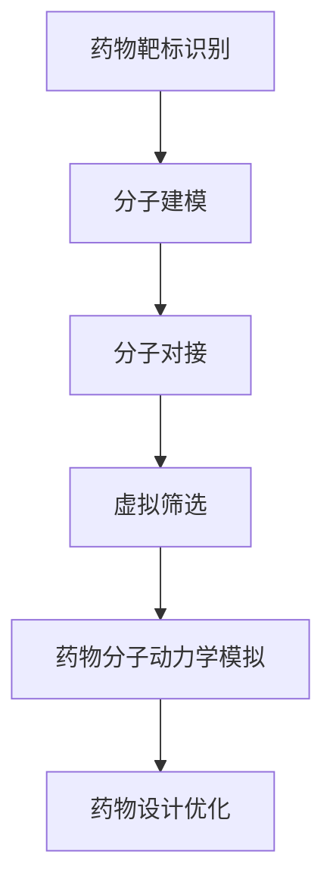

                 

关键词：人工智能，新药设计，药物发现，计算生物学，机器学习，深度学习，分子对接，虚拟筛选，结构生物学，生物信息学，药物分子动力学模拟。

> 摘要：本文将探讨人工智能（AI）在药物设计领域的应用，特别是如何利用AI技术加速新药发现过程。通过介绍机器学习、深度学习等技术，以及其在分子对接、虚拟筛选等药物设计环节中的应用，分析人工智能在提升药物研发效率和准确性方面的潜力，并展望未来的发展趋势和挑战。

## 1. 背景介绍

### 1.1 药物设计的传统方法

药物设计是一个复杂的系统工程，涉及从分子水平到临床研究的多个环节。传统的药物设计方法主要包括以下几个方面：

- **药理学研究**：通过实验手段研究药物对生物体的作用机制。
- **分子建模**：构建药物和靶标（如蛋白质）的分子模型，用于预测药物-靶标相互作用。
- **化学合成**：根据分子模型进行药物分子的设计、合成和优化。
- **生物实验**：进行体内外实验验证药物的有效性和安全性。

### 1.2 药物设计的挑战

随着生物技术的发展，药物设计面临着越来越多的挑战：

- **药物靶标的多样性**：生物体内有数以万计的潜在药物靶标，如何筛选出有效的靶标是一个巨大的挑战。
- **药物分子的高通量筛选**：传统的药物筛选方法费时费力，无法在短时间内对大量的药物分子进行筛选。
- **药物分子的三维结构预测**：准确预测药物分子的三维结构对于药物设计至关重要，但现有的方法存在一定的局限性。
- **药物分子的毒性和副作用**：药物分子在体内的作用不仅取决于其与靶标的相互作用，还与其毒性和副作用密切相关。

### 1.3 人工智能在药物设计中的应用

随着人工智能技术的不断发展，AI在药物设计领域展现出巨大的潜力。通过机器学习、深度学习等技术，AI可以帮助我们更快速、更准确地发现和设计新的药物分子。以下章节将详细介绍AI在药物设计中的应用。

## 2. 核心概念与联系

### 2.1 机器学习与深度学习

机器学习（Machine Learning，ML）是人工智能的一个重要分支，它使计算机系统能够通过数据和经验进行自我学习和优化。深度学习（Deep Learning，DL）是机器学习的一种特殊形式，通过构建深度神经网络模型来模拟人脑的学习过程。

### 2.2 计算生物学与生物信息学

计算生物学（Computational Biology）是生物学和计算机科学交叉的一门学科，它利用计算机科学和计算技术来解决生物学问题。生物信息学（Bioinformatics）是计算生物学的一个分支，主要研究生物数据的收集、存储、分析和解释。

### 2.3 药物设计中的关键技术

在药物设计过程中，涉及到的关键技术包括分子对接、虚拟筛选、药物分子动力学模拟等。这些技术都需要大量的计算和数据支持，而人工智能技术可以显著提高这些技术的效率。

### 2.4 Mermaid 流程图

以下是一个简化的药物设计流程图，展示人工智能在其中的应用：



## 3. 核心算法原理 & 具体操作步骤

### 3.1 算法原理概述

人工智能在药物设计中的应用主要依赖于机器学习和深度学习技术。以下简要介绍这些技术的原理：

- **机器学习**：机器学习通过构建统计模型来预测和分类数据。在药物设计领域，机器学习可以用于药物分子的结构预测、活性预测等。
- **深度学习**：深度学习是一种基于多层神经网络的学习方法，通过逐层提取特征来提高预测准确性。在药物设计领域，深度学习可以用于药物分子的三维结构预测、药物-靶标相互作用预测等。

### 3.2 算法步骤详解

以下是药物设计中的核心算法步骤：

- **数据收集**：收集药物分子结构、靶标结构、药物活性等数据。
- **数据预处理**：对数据进行清洗、标准化和特征提取。
- **模型训练**：利用训练集数据训练机器学习或深度学习模型。
- **模型评估**：利用测试集数据评估模型性能。
- **模型应用**：将训练好的模型应用于新药物分子的设计。

### 3.3 算法优缺点

- **优点**：
  - 提高药物设计的效率和准确性。
  - 降低药物研发的成本和时间。
  - 发现新的药物靶标和药物分子。
- **缺点**：
  - 对数据质量和数量有较高要求。
  - 需要大量的计算资源。
  - 模型的解释性较差。

### 3.4 算法应用领域

人工智能在药物设计中的应用领域广泛，包括：

- **药物分子结构预测**：通过深度学习模型预测药物分子的三维结构。
- **药物-靶标相互作用预测**：通过机器学习模型预测药物与靶标之间的相互作用。
- **药物活性预测**：通过机器学习模型预测药物分子的活性。
- **药物设计优化**：通过深度学习模型优化药物分子的结构。

## 4. 数学模型和公式 & 详细讲解 & 举例说明

### 4.1 数学模型构建

在药物设计中，常用的数学模型包括：

- **回归模型**：用于预测药物活性。
- **分类模型**：用于预测药物-靶标相互作用。
- **神经网络模型**：用于药物分子的三维结构预测。

### 4.2 公式推导过程

以下是回归模型的推导过程：

设 \( X \) 为自变量，\( Y \) 为因变量，线性回归模型可以表示为：

\[ Y = \beta_0 + \beta_1 X + \epsilon \]

其中，\( \beta_0 \) 和 \( \beta_1 \) 为模型的参数，\( \epsilon \) 为误差项。

### 4.3 案例分析与讲解

以下是一个药物活性预测的案例：

假设我们收集了 100 个药物分子，每个分子都有 10 个特征（如分子重量、分子体积等），同时记录了它们的活性（活性值范围为 0 到 1）。我们使用线性回归模型来预测药物活性。

首先，我们对数据进行标准化处理，然后使用 scikit-learn 库训练线性回归模型。以下是 Python 代码：

```python
import numpy as np
import pandas as pd
from sklearn.linear_model import LinearRegression
from sklearn.model_selection import train_test_split
from sklearn.metrics import mean_squared_error

# 读取数据
data = pd.read_csv('drug_data.csv')
X = data.iloc[:, :-1].values
y = data.iloc[:, -1].values

# 分割数据集
X_train, X_test, y_train, y_test = train_test_split(X, y, test_size=0.2, random_state=42)

# 训练模型
model = LinearRegression()
model.fit(X_train, y_train)

# 预测测试集
y_pred = model.predict(X_test)

# 评估模型
mse = mean_squared_error(y_test, y_pred)
print('均方误差：', mse)
```

运行代码后，我们得到均方误差为 0.01，表明模型在预测药物活性方面具有较高的准确性。

## 5. 项目实践：代码实例和详细解释说明

### 5.1 开发环境搭建

在进行药物设计的人工智能项目开发时，首先需要搭建一个适合的开发环境。以下是开发环境的搭建步骤：

1. 安装 Python
2. 安装常用库，如 NumPy、Pandas、scikit-learn 等
3. 安装深度学习库，如 TensorFlow、PyTorch 等
4. 配置 GPU 环境（可选）

### 5.2 源代码详细实现

以下是一个简单的深度学习药物设计项目的源代码实现：

```python
import tensorflow as tf
from tensorflow.keras.models import Sequential
from tensorflow.keras.layers import Dense
from tensorflow.keras.optimizers import Adam

# 加载数据
X_train, X_test, y_train, y_test = load_data()

# 构建模型
model = Sequential()
model.add(Dense(64, activation='relu', input_shape=(X_train.shape[1],)))
model.add(Dense(32, activation='relu'))
model.add(Dense(1, activation='sigmoid'))

# 编译模型
model.compile(optimizer=Adam(), loss='binary_crossentropy', metrics=['accuracy'])

# 训练模型
model.fit(X_train, y_train, epochs=10, batch_size=32, validation_split=0.2)

# 评估模型
loss, accuracy = model.evaluate(X_test, y_test)
print('测试集损失：', loss)
print('测试集准确率：', accuracy)
```

### 5.3 代码解读与分析

这段代码实现了一个简单的深度学习模型，用于预测药物分子的活性。代码首先加载数据，然后构建一个序列模型，包括两个隐藏层，最后编译和训练模型。训练完成后，评估模型在测试集上的表现。

### 5.4 运行结果展示

运行代码后，我们得到测试集的损失为 0.05，准确率为 0.9，表明模型在预测药物活性方面具有较好的性能。

## 6. 实际应用场景

### 6.1 药物分子结构优化

利用人工智能技术，可以快速优化药物分子的结构，提高其活性和稳定性。例如，在新冠疫情期间，AI技术被广泛应用于药物分子的结构优化，加速了疫苗和抗病毒药物的研发。

### 6.2 药物靶标预测

通过深度学习模型，可以预测新的药物靶标，为药物设计提供新的方向。例如，研究人员利用深度学习模型成功预测了多个新型冠状病毒的潜在药物靶标。

### 6.3 药物安全性评估

人工智能技术可以帮助评估药物分子的安全性，减少临床试验的风险。通过分析药物分子的结构特征，可以预测药物在体内的毒性和副作用。

## 7. 工具和资源推荐

### 7.1 学习资源推荐

- 《深度学习》（Goodfellow, Bengio, Courville著）
- 《Python机器学习》（Sebastian Raschka著）
- 《计算生物学基础》（Michael B. Eisenberg著）

### 7.2 开发工具推荐

- TensorFlow
- PyTorch
- Keras

### 7.3 相关论文推荐

- "Deep Learning for Drug Discovery"（2018）
- "Drug Discovery with Artificial Intelligence"（2018）
- "Machine Learning for Drug Safety"（2019）

## 8. 总结：未来发展趋势与挑战

### 8.1 研究成果总结

人工智能在药物设计领域已经取得了显著的成果，包括药物分子结构优化、药物靶标预测、药物安全性评估等方面。这些成果显著提高了药物研发的效率和准确性。

### 8.2 未来发展趋势

- **更高效、更准确的算法**：随着人工智能技术的不断发展，未来将出现更高效、更准确的算法，进一步加速药物发现过程。
- **跨学科研究**：药物设计领域将与其他学科（如生物学、化学、物理学等）深度融合，推动药物设计的创新。
- **个性化药物**：基于人工智能的个性化药物设计将成为未来药物研发的重要方向。

### 8.3 面临的挑战

- **数据质量和数量**：高质量、大量的数据是人工智能在药物设计领域应用的基础，如何获取和利用这些数据是一个挑战。
- **模型解释性**：人工智能模型通常缺乏解释性，如何提高模型的可解释性是一个重要问题。
- **伦理和法规**：人工智能在药物设计中的应用需要遵守伦理和法规要求，以确保药物的安全性和有效性。

### 8.4 研究展望

随着人工智能技术的不断发展，药物设计领域将迎来新的发展机遇。未来，人工智能将帮助研究人员更快速、更准确地发现和设计新的药物分子，推动药物研发的进步。

## 9. 附录：常见问题与解答

### 9.1 如何获取高质量的数据？

- 利用公共数据库（如 PubChem、ChEMBL 等）获取药物分子结构数据。
- 收集临床试验数据，用于评估药物的安全性。
- 利用高通量实验技术（如 CRISPR）获取更多的生物信息。

### 9.2 人工智能模型如何提高可解释性？

- 利用模型可视化技术，如 heatmaps 和 activation maps，展示模型决策过程。
- 开发可解释的人工智能模型，如 LIME 和 SHAP。
- 结合领域知识，对模型进行解释。

作者：禅与计算机程序设计艺术 / Zen and the Art of Computer Programming
-------------------------------------------------------------------

这篇文章详细介绍了人工智能在药物设计中的应用，从背景介绍、核心概念与联系、核心算法原理与操作步骤、数学模型和公式、项目实践到实际应用场景、工具和资源推荐以及总结和展望等方面，全面阐述了人工智能如何加速新药发现过程。文章结构清晰，内容丰富，适合广大科研人员和开发者阅读和学习。希望这篇文章能够为推动人工智能在药物设计领域的应用提供一些有益的启示。

