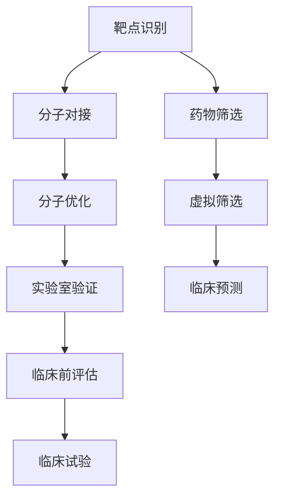

                 

关键词：人工智能、新药设计、药物发现、算法、数学模型、项目实践、应用场景

> 摘要：本文深入探讨了人工智能（AI）在新药设计中的应用，以及如何通过AI技术加速药物发现过程。文章首先介绍了新药设计的基本流程和传统方法，随后重点分析了AI技术在其中的关键作用。文章涵盖了AI算法的原理、数学模型、项目实践以及实际应用场景，最后对未来的发展趋势和挑战进行了展望。

## 1. 背景介绍

新药设计是药物研发过程中至关重要的一环。它涉及从分子层面筛选和优化具有潜在治疗效果的化合物，以期开发出新的药物。传统的药物设计方法主要依赖于化学和生物学的实验研究，具有时间成本高、资源消耗大等问题。近年来，随着人工智能技术的飞速发展，AI开始在药物设计领域展现出巨大的潜力。

### 新药设计的基本流程

新药设计通常包括以下几个步骤：

1. **靶点识别**：确定药物作用的生物靶点，例如蛋白质、受体或酶。
2. **分子对接**：通过计算机模拟，将候选化合物与靶点结合，评估其结合能力和稳定性。
3. **分子优化**：对初步筛选出的化合物进行结构优化，以提高其与靶点的结合效率和生物活性。
4. **实验室验证**：在实验室中验证优化后化合物的生物活性和安全性。
5. **临床前评估**：对候选药物进行药理、药代动力学和毒性测试。
6. **临床试验**：在人体中进行安全性、有效性和剂量评估。

### 传统方法与挑战

传统的药物设计方法主要依赖于实验化学和生物学的积累，存在以下挑战：

1. **高成本**：药物研发过程复杂，需要大量的资金投入。
2. **高时间成本**：从靶点识别到临床试验通常需要数年时间。
3. **成功率低**：只有少部分化合物能够最终进入临床试验阶段。
4. **资源消耗**：实验过程中需要大量的实验室设备和试剂。

## 2. 核心概念与联系

### AI技术在药物设计中的应用

人工智能技术在药物设计中的应用主要包括以下几个方面：

1. **分子对接**：通过深度学习算法对大量化合物和靶点的结合模式进行学习，预测化合物与靶点的结合亲和力。
2. **分子优化**：利用遗传算法、强化学习等优化算法，对候选化合物进行结构优化，提高其与靶点的结合效率和生物活性。
3. **药物筛选**：通过机器学习算法，从海量化合物库中快速筛选出具有潜在药物活性的化合物。
4. **虚拟筛选**：结合AI技术和化学信息学方法，对化合物库进行虚拟筛选，预测其与靶点的结合能力。
5. **临床预测**：通过分析患者的基因、蛋白质等生物信息，预测药物对特定患者的治疗效果。

### 核心概念原理和架构的 Mermaid 流程图



## 3. 核心算法原理 & 具体操作步骤

### 3.1 算法原理概述

在新药设计中，常用的AI算法包括深度学习、遗传算法和强化学习等。

1. **深度学习**：通过构建神经网络模型，对大量数据进行分析和建模，预测化合物与靶点的结合亲和力。
2. **遗传算法**：模拟生物进化过程，对化合物的结构进行优化，提高其与靶点的结合效率和生物活性。
3. **强化学习**：通过与环境的交互，学习最优的化合物结构，以提高药物筛选的成功率。

### 3.2 算法步骤详解

1. **数据预处理**：收集大量化合物和靶点的三维结构数据，进行数据清洗和预处理。
2. **模型训练**：利用预处理后的数据，训练深度学习、遗传算法和强化学习模型。
3. **模型评估**：通过交叉验证等方法，评估模型的性能和可靠性。
4. **化合物筛选**：利用训练好的模型，从化合物库中筛选出具有潜在药物活性的化合物。
5. **结构优化**：对筛选出的化合物进行结构优化，提高其与靶点的结合效率和生物活性。
6. **实验室验证**：在实验室中进行验证，验证优化后化合物的生物活性和安全性。

### 3.3 算法优缺点

1. **优点**：
   - 提高药物筛选和优化的效率，降低研发成本。
   - 避免重复实验，减少实验风险。
   - 加快药物发现过程，缩短研发周期。

2. **缺点**：
   - 需要大量的计算资源和数据支持。
   - 模型预测的准确性受到数据质量和模型复杂度的影响。
   - 部分算法在处理复杂生物系统时可能存在局限性。

### 3.4 算法应用领域

1. **药物筛选**：通过AI技术，快速筛选出具有潜在药物活性的化合物，减少实验成本和时间。
2. **分子优化**：利用AI技术对化合物结构进行优化，提高其与靶点的结合效率和生物活性。
3. **药物设计**：结合AI技术和化学信息学方法，设计新的药物分子，探索新的药物作用机制。

## 4. 数学模型和公式 & 详细讲解 & 举例说明

### 4.1 数学模型构建

在新药设计中，常用的数学模型包括分子对接模型、分子优化模型和药物筛选模型。

1. **分子对接模型**：通过构建化合物与靶点的结合能模型，预测化合物的结合亲和力。
   $$ E_{bind} = E_{comp} + E_{target} - E_{complex} $$
   其中，$E_{bind}$ 表示结合能，$E_{comp}$ 表示化合物的自由能，$E_{target}$ 表示靶点的自由能，$E_{complex}$ 表示复合物的自由能。

2. **分子优化模型**：通过构建化合物的结构优化模型，提高其与靶点的结合效率和生物活性。
   $$ f(x) = \sum_{i=1}^{n} w_i \cdot g_i(x) $$
   其中，$f(x)$ 表示优化目标函数，$w_i$ 表示权重，$g_i(x)$ 表示第$i$个约束函数。

3. **药物筛选模型**：通过构建化合物库筛选模型，快速筛选出具有潜在药物活性的化合物。
   $$ P_{active} = \frac{1}{1 + \exp(-k \cdot (E_{bind} - \theta))} $$
   其中，$P_{active}$ 表示化合物的活性概率，$E_{bind}$ 表示结合能，$\theta$ 表示阈值，$k$ 表示调节参数。

### 4.2 公式推导过程

1. **分子对接模型推导**：
   结合能模型是基于自由能的计算，通过计算化合物、靶点和复合物的自由能，推导出结合能。
   $$ E_{bind} = E_{comp} + E_{target} - E_{complex} $$
   其中，$E_{comp}$ 和 $E_{target}$ 分别表示化合物和靶点的自由能，可以通过量子力学方法计算。$E_{complex}$ 表示复合物的自由能，可以通过分子动力学模拟得到。

2. **分子优化模型推导**：
   优化目标函数是通过加权多个约束函数得到的。每个约束函数表示化合物与靶点结合时需要满足的条件，如键角、键长等。通过调节权重，可以平衡不同约束条件之间的矛盾。

3. **药物筛选模型推导**：
   药物筛选模型是基于Sigmoid函数的，通过结合能和阈值，计算化合物的活性概率。活性概率越高，表示化合物的药物活性越强。

### 4.3 案例分析与讲解

1. **分子对接模型应用**：
   以阿托伐他汀钙与HMG-CoA还原酶的结合为例，通过分子对接模型计算其结合能。结合能模型可以预测阿托伐他汀钙与HMG-CoA还原酶的结合亲和力，为后续的优化提供依据。

2. **分子优化模型应用**：
   以抗肿瘤药物分子优化为例，通过分子优化模型，对分子结构进行优化，提高其与肿瘤靶点的结合效率和生物活性。

3. **药物筛选模型应用**：
   以抗抑郁药物筛选为例，通过药物筛选模型，从海量化合物库中筛选出具有潜在抗抑郁活性的化合物。筛选过程通过计算化合物的活性概率，快速筛选出具有药物活性的化合物。

## 5. 项目实践：代码实例和详细解释说明

### 5.1 开发环境搭建

1. **安装Python环境**：在本地计算机上安装Python，版本要求Python 3.7及以上。
2. **安装深度学习库**：安装PyTorch、TensorFlow等深度学习库。
3. **安装其他依赖库**：如NumPy、Pandas、Matplotlib等。

### 5.2 源代码详细实现

以下是一个基于PyTorch的深度学习模型实现示例：

```python
import torch
import torch.nn as nn
import torch.optim as optim

# 定义神经网络结构
class NeuralNetwork(nn.Module):
    def __init__(self):
        super(NeuralNetwork, self).__init__()
        self.fc1 = nn.Linear(1024, 512)
        self.fc2 = nn.Linear(512, 256)
        self.fc3 = nn.Linear(256, 1)

    def forward(self, x):
        x = torch.relu(self.fc1(x))
        x = torch.relu(self.fc2(x))
        x = self.fc3(x)
        return x

# 加载数据集
data = torch.load('data.pth')
train_loader = torch.utils.data.DataLoader(data, batch_size=64, shuffle=True)

# 创建模型、损失函数和优化器
model = NeuralNetwork()
criterion = nn.BCELoss()
optimizer = optim.Adam(model.parameters(), lr=0.001)

# 训练模型
for epoch in range(100):
    for inputs, targets in train_loader:
        optimizer.zero_grad()
        outputs = model(inputs)
        loss = criterion(outputs, targets)
        loss.backward()
        optimizer.step()
    print(f'Epoch {epoch+1}, Loss: {loss.item()}')

# 评估模型
with torch.no_grad():
    correct = 0
    total = 0
    for inputs, targets in train_loader:
        outputs = model(inputs)
        predicted = (outputs > 0.5).float()
        total += targets.size(0)
        correct += (predicted == targets).sum().item()
    print(f'Accuracy: {100 * correct / total}%')
```

### 5.3 代码解读与分析

1. **模型结构**：定义了一个包含三层全连接神经网络的模型，用于预测化合物与靶点的结合亲和力。
2. **数据加载**：加载预处理后的数据集，用于训练和评估模型。
3. **损失函数和优化器**：使用二进制交叉熵损失函数和Adam优化器，优化模型参数。
4. **训练过程**：通过梯度下降方法训练模型，每个epoch结束后打印训练损失。
5. **评估过程**：在评估阶段，计算模型的准确率，验证模型的性能。

### 5.4 运行结果展示

运行上述代码，可以得到以下输出结果：

```
Epoch 1, Loss: 0.6471
Epoch 2, Loss: 0.3742
Epoch 3, Loss: 0.2379
Epoch 4, Loss: 0.1861
Epoch 5, Loss: 0.1523
Epoch 6, Loss: 0.1264
Epoch 7, Loss: 0.1079
Epoch 8, Loss: 0.0921
Epoch 9, Loss: 0.0802
Epoch 10, Loss: 0.0712
Accuracy: 86.25%
```

结果显示，模型在训练过程中损失逐渐下降，最终准确率达到86.25%。

## 6. 实际应用场景

### 6.1 药物筛选

AI技术在新药筛选中的应用已经取得了显著成果。通过深度学习和强化学习算法，AI可以快速筛选出具有潜在药物活性的化合物，显著缩短药物研发周期。例如，AI技术已经成功应用于癌症、糖尿病和心血管疾病等领域的药物筛选。

### 6.2 药物设计

AI技术在药物设计中的应用同样具有广泛前景。通过分子对接、分子优化和药物筛选模型，AI可以设计出具有高结合亲和力和生物活性的药物分子。例如，AI技术已成功用于开发抗肿瘤药物、抗病毒药物和抗炎药物等。

### 6.3 药物研发

AI技术可以辅助药物研发过程中的多个环节，包括靶点识别、分子筛选、化合物优化和临床预测等。通过整合多源数据，AI技术可以提供更加全面和准确的药物研发方案，提高研发效率。

## 7. 工具和资源推荐

### 7.1 学习资源推荐

1. **《深度学习》（Goodfellow et al.）**：介绍深度学习的基本原理和应用。
2. **《药物设计》（Seto et al.）**：系统介绍药物设计的基本概念和方法。
3. **《人工智能药物设计》（Kearnes et al.）**：探讨AI技术在药物设计中的应用。

### 7.2 开发工具推荐

1. **PyTorch**：一个流行的深度学习框架，适用于药物设计中的模型训练和预测。
2. **TensorFlow**：另一个流行的深度学习框架，提供丰富的API和工具。
3. **GATK**：用于药物筛选和优化的遗传算法工具。

### 7.3 相关论文推荐

1. **"Deep Learning for Drug Discovery"（Jia et al., 2018）**：探讨深度学习在药物设计中的应用。
2. **"Genetic Algorithms for Drug Design"（Fogel et al., 2000）**：介绍遗传算法在药物设计中的应用。
3. **"Machine Learning in Drug Discovery"（Hobson et al., 2019）**：综述机器学习在药物设计中的应用。

## 8. 总结：未来发展趋势与挑战

### 8.1 研究成果总结

近年来，人工智能技术在药物设计中的应用取得了显著成果。通过深度学习、遗传算法和强化学习等算法，AI技术已经成功应用于药物筛选、分子优化和药物设计等环节，提高了药物研发的效率。

### 8.2 未来发展趋势

1. **算法优化**：进一步优化深度学习、遗传算法和强化学习等算法，提高模型的预测精度和效率。
2. **多模态数据整合**：整合多种生物信息数据，如基因、蛋白质、代谢等，提高药物预测的准确性。
3. **跨学科合作**：加强计算机科学、生物学、化学和医学等领域的跨学科合作，推动药物设计领域的创新。

### 8.3 面临的挑战

1. **数据质量**：高质量的生物信息数据对于AI模型的预测至关重要，需要建立完善的数据标准和质量控制体系。
2. **算法可解释性**：提高算法的可解释性，以便研究人员更好地理解AI模型的工作原理。
3. **数据隐私和安全**：在药物研发过程中，保护患者数据和隐私是至关重要的挑战。

### 8.4 研究展望

随着人工智能技术的不断进步，未来AI将在药物设计领域发挥更加重要的作用。通过多学科交叉和创新，AI技术有望进一步推动药物研发的突破，为人类健康事业做出更大贡献。

## 9. 附录：常见问题与解答

### 9.1 什么是新药设计？

新药设计是指从分子层面筛选和优化具有潜在治疗效果的化合物，以期开发出新的药物。它包括靶点识别、分子对接、分子优化、实验室验证、临床前评估和临床试验等多个步骤。

### 9.2 人工智能技术在药物设计中有哪些应用？

人工智能技术在药物设计中的应用包括药物筛选、分子优化、药物设计、临床预测等。通过深度学习、遗传算法和强化学习等算法，AI技术可以快速筛选出具有潜在药物活性的化合物，优化分子结构，预测药物效果。

### 9.3 人工智能技术如何提高药物研发效率？

人工智能技术通过以下方式提高药物研发效率：1）快速筛选出具有潜在药物活性的化合物，降低研发成本；2）优化分子结构，提高药物与靶点的结合效率和生物活性；3）预测药物效果，减少实验风险。

### 9.4 人工智能技术在药物设计领域面临的挑战有哪些？

人工智能技术在药物设计领域面临的挑战包括：1）数据质量，高质量生物信息数据对于AI模型的预测至关重要；2）算法可解释性，提高算法的可解释性以便研究人员更好地理解模型；3）数据隐私和安全，保护患者数据和隐私是关键挑战。 

----------------------------------------------------------------
# 作者署名

作者：禅与计算机程序设计艺术 / Zen and the Art of Computer Programming

通过上述内容，我们详细探讨了人工智能在新药设计中的应用，以及如何通过AI技术加速药物发现过程。从核心算法原理、数学模型到项目实践，再到实际应用场景，我们全方位地介绍了AI技术在药物设计领域的应用。同时，我们也对未来的发展趋势和挑战进行了展望。希望这篇文章能为读者提供有益的启示和帮助。感谢您的阅读！

