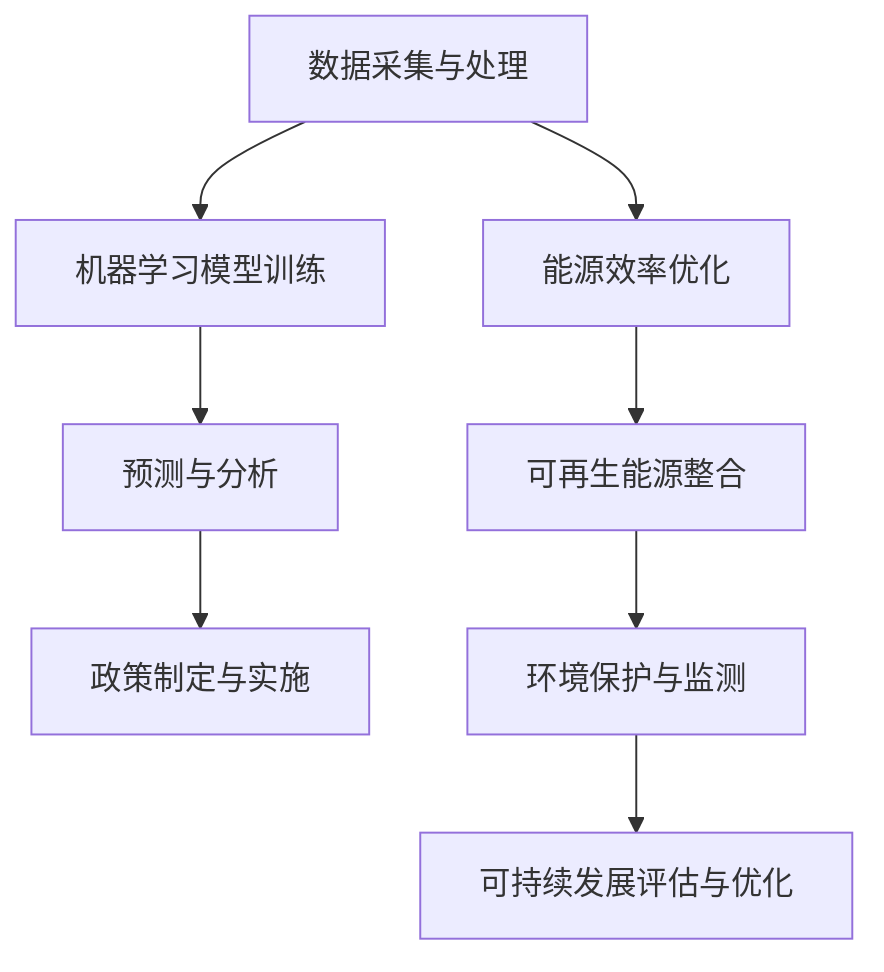

                 

关键词：人工智能，气候变化，可持续发展，算法，模型，应用领域，未来展望

<|assistant|>摘要：本文旨在探讨人工智能在气候变化和可持续发展中的应用。首先，我们将介绍气候变化对全球环境的影响以及可持续发展的概念。接着，我们将深入探讨人工智能在数据分析和预测、能源效率优化、环境保护等方面的重要作用。通过具体实例和实际应用场景的分析，我们将展示人工智能如何帮助应对气候变化和推动可持续发展。最后，我们将展望未来人工智能在气候变化和可持续发展领域的发展趋势和面临的挑战。

## 1. 背景介绍

### 气候变化的影响

气候变化是全球性的问题，对地球生态系统、人类社会和经济都产生了深远的影响。过去一个世纪中，全球气温上升、极端天气事件增多、海平面上升等现象日益明显，对人类生活和社会经济发展构成了严重威胁。气候变化的主要原因包括温室气体排放、森林砍伐、土地利用变化等。如果不采取有效措施，未来几十年内，气候变化可能导致更频繁的极端天气事件、水资源短缺、农作物减产等问题，进一步加剧全球不平等和贫困。

### 可持续发展的概念

可持续发展是指满足当前需求而不损害后代满足其需求的能力。它包括经济、社会和环境三个方面的平衡发展。在气候变化问题上，可持续发展要求我们采取行动减少温室气体排放，提高能源效率，保护生态系统，同时促进社会公平和经济繁荣。可持续发展不仅关注当下的问题，更着眼于未来的发展和全球的共同利益。

### 人工智能的潜力

人工智能（AI）是一种模拟人类智能的技术，通过机器学习、深度学习等方法，使计算机具备自主学习和决策能力。近年来，人工智能在各个领域取得了显著的进展，包括医疗、金融、交通、工业等。在气候变化和可持续发展方面，人工智能具有巨大的潜力，可以帮助我们更有效地应对环境问题，推动全球可持续发展。

## 2. 核心概念与联系

在讨论人工智能在气候变化和可持续发展中的应用之前，我们需要了解一些核心概念和它们之间的关系。

### 人工智能的核心概念

- **机器学习（Machine Learning）**：一种使计算机通过数据学习并做出决策的方法。
- **深度学习（Deep Learning）**：一种基于人工神经网络的机器学习方法，特别适用于处理大规模复杂数据。
- **大数据（Big Data）**：海量、多样化、快速生成的数据，需要高效的处理和分析方法。
- **物联网（Internet of Things，IoT）**：连接各种设备和传感器，实现信息的实时采集和传输。

### 气候变化与可持续发展

- **气候变化**：指的是气候的平均状态随时间的变化，包括季节变化和长期气候趋势。
- **可持续发展**：包括经济、社会和环境的平衡发展，关注当前和未来世代的需求。

### 人工智能与气候变化/可持续发展的联系

- **数据分析和预测**：人工智能可以帮助我们分析气候数据，预测气候变化趋势，为政策制定提供科学依据。
- **能源效率优化**：通过优化能源使用和可再生能源的整合，人工智能有助于减少温室气体排放。
- **环境保护**：人工智能可以在环境保护方面发挥重要作用，如监测森林砍伐、海洋污染等。

### Mermaid 流程图

以下是人工智能在气候变化和可持续发展中的应用流程图：



在这个流程图中，数据采集与处理是起点，通过机器学习模型训练，我们能够进行预测和分析，进而为政策制定提供支持。同时，能源效率优化和环境保护也是人工智能在气候变化和可持续发展中的重要应用。

## 3. 核心算法原理 & 具体操作步骤

### 3.1 算法原理概述

在人工智能应用于气候变化和可持续发展领域，几种核心算法发挥着重要作用。以下介绍几种主要的算法及其原理：

#### 1. 支持向量机（SVM）

支持向量机是一种监督学习算法，主要用于分类问题。它通过寻找一个最佳的超平面，将不同类别的数据点分开。在气候变化预测中，SVM可用于分类不同的气候模式，帮助预测未来的气候状况。

#### 2. 决策树（Decision Tree）

决策树是一种常见的分类和回归算法。它通过一系列判断条件将数据分成不同的子集，直到达到某个终止条件。在能源效率优化中，决策树可以用于分析能源消耗模式，找出节能的机会。

#### 3. 集成学习方法（Ensemble Methods）

集成学习方法通过结合多个弱学习器来提高预测精度。常见的集成学习方法包括随机森林（Random Forest）和梯度提升树（Gradient Boosting Tree）。在气候变化预测中，这些方法可以提供更准确和稳定的预测结果。

### 3.2 算法步骤详解

#### 支持向量机（SVM）步骤详解

1. **数据预处理**：收集和处理气候数据，包括温度、降雨量、风速等。
2. **特征选择**：从数据中选择对气候预测最有影响力的特征。
3. **模型训练**：使用训练数据训练SVM模型。
4. **模型评估**：使用测试数据评估模型性能，调整模型参数。
5. **预测**：使用训练好的模型对未来的气候状况进行预测。

#### 决策树（Decision Tree）步骤详解

1. **数据收集**：收集能源消耗数据，包括时间、功率、温度等。
2. **特征工程**：对数据进行预处理，提取有用的特征。
3. **构建决策树**：使用训练数据构建决策树模型。
4. **模型评估**：评估决策树模型的性能，包括准确率、召回率等。
5. **应用模型**：使用决策树模型分析能源消耗模式，提出节能建议。

#### 集成学习方法（Ensemble Methods）步骤详解

1. **数据预处理**：与SVM和决策树类似，进行数据预处理和特征选择。
2. **构建基学习器**：使用不同的算法构建多个基学习器，如随机森林和梯度提升树。
3. **集成学习**：将多个基学习器的预测结果进行加权平均或投票，得到最终的预测结果。
4. **模型评估**：评估集成学习模型的性能。
5. **应用模型**：使用集成学习模型进行气候变化预测或能源效率优化。

### 3.3 算法优缺点

#### 支持向量机（SVM）

- **优点**：准确率高，对线性可分数据效果较好。
- **缺点**：对非线性数据效果较差，训练时间较长。

#### 决策树（Decision Tree）

- **优点**：易于理解，易于实现。
- **缺点**：可能产生过拟合，对噪声敏感。

#### 集成学习方法（Ensemble Methods）

- **优点**：通过结合多个模型，提高预测精度和稳定性。
- **缺点**：计算复杂度高，需要大量训练数据。

### 3.4 算法应用领域

- **气候变化预测**：SVM和集成学习方法可用于气候变化预测，提供准确的气候趋势预测。
- **能源效率优化**：决策树和集成学习方法可用于分析能源消耗模式，提出节能方案。
- **环境保护**：SVM和决策树可用于监测森林砍伐、海洋污染等环境问题。

## 4. 数学模型和公式 & 详细讲解 & 举例说明

### 4.1 数学模型构建

在人工智能应用于气候变化和可持续发展领域，数学模型扮演着至关重要的角色。以下介绍几种常用的数学模型及其构建方法：

#### 1. 神经网络模型

神经网络模型是一种基于人脑神经元的计算模型，通过多层神经元节点进行信息处理。其基本构建方法如下：

- **输入层**：接收外部输入信号，如温度、降雨量等。
- **隐藏层**：对输入信号进行计算和处理，提取特征信息。
- **输出层**：输出预测结果，如未来温度、能源消耗等。

#### 2. 线性回归模型

线性回归模型是一种简单的预测模型，通过线性关系描述变量之间的变化。其构建方法如下：

- **模型方程**：\(y = w_0 + w_1 \cdot x_1 + w_2 \cdot x_2 + ... + w_n \cdot x_n\)
- **参数估计**：通过最小二乘法估计模型参数，使预测误差最小。

#### 3. 支持向量机（SVM）模型

支持向量机模型是一种监督学习算法，通过寻找最优超平面进行分类。其构建方法如下：

- **优化目标**：最大化分类间隔，同时使支持向量尽可能少。
- **求解方法**：使用拉格朗日乘子法和二次规划求解。

### 4.2 公式推导过程

以下以神经网络模型为例，介绍数学模型的公式推导过程：

#### 神经网络模型公式推导

1. **激活函数**

   神经元节点的输出值通常采用激活函数进行非线性变换，常见的激活函数有：

   - **sigmoid函数**：\(f(x) = \frac{1}{1 + e^{-x}}\)
   - **ReLU函数**：\(f(x) = \max(0, x)\)

2. **前向传播**

   前向传播过程从输入层开始，逐层计算每个节点的输出值：

   - **输入层**：\(x_i = x_i^{(0)}\)
   - **隐藏层**：\(z_j = \sum_{i=1}^{n} w_{ij} \cdot x_i + b_j\)
   - **输出层**：\(y_j = f(z_j^{(L)})\)

3. **反向传播**

   反向传播过程用于计算误差并更新模型参数：

   - **计算输出误差**：\(e_j = y_j - t_j\)
   - **计算隐藏层误差**：\(d_j^{(l)} = \frac{\partial E}{\partial z_j^{(l)}} = f'(z_j^{(l)}) \cdot \sum_{k} w_{jk} \cdot d_k^{(l+1)}\)
   - **更新模型参数**：\(w_{ij} = w_{ij} - \alpha \cdot \frac{\partial E}{\partial w_{ij}} = w_{ij} - \alpha \cdot (x_i \cdot d_j^{(l)})\)

### 4.3 案例分析与讲解

以下以能源消耗预测为例，介绍神经网络模型的实际应用：

#### 案例背景

某城市电力公司希望利用神经网络模型预测未来的电力消耗，以便优化电网调度和能源供应。

#### 数据收集

收集过去一年的电力消耗数据，包括日平均温度、湿度、风速等气象数据，以及城市人口、经济指标等社会经济数据。

#### 数据预处理

- **归一化处理**：将数据进行归一化，使数据范围在0到1之间，便于模型训练。
- **特征选择**：选择与电力消耗相关性较高的特征，如日平均温度、风速等。

#### 模型构建

- **输入层**：包括日平均温度、湿度、风速等气象数据。
- **隐藏层**：选择2层隐藏层，每层包含10个神经元。
- **输出层**：输出未来一天的电力消耗预测值。

#### 模型训练

- **训练集**：将数据集分为训练集和测试集，训练集用于模型训练，测试集用于模型评估。
- **优化算法**：使用随机梯度下降（SGD）算法进行模型训练。
- **参数调整**：通过交叉验证调整模型参数，如学习率、隐藏层神经元数等。

#### 模型评估

- **准确率**：通过测试集评估模型的预测准确率。
- **均方误差（MSE）**：通过计算预测值与真实值之间的均方误差评估模型性能。

#### 模型应用

- **电力消耗预测**：使用训练好的模型预测未来一天的电力消耗，为电力公司提供调度和能源供应的参考。
- **节能措施**：根据预测结果，提出针对性的节能措施，降低能源消耗。

## 5. 项目实践：代码实例和详细解释说明

### 5.1 开发环境搭建

为了实践人工智能在气候变化和可持续发展中的应用，我们需要搭建一个合适的开发环境。以下是搭建环境的基本步骤：

1. **安装Python环境**：在本地计算机上安装Python，版本建议为3.8或更高。
2. **安装相关库**：安装必要的Python库，如NumPy、Pandas、Scikit-learn、TensorFlow等。可以使用pip进行安装：
   ```bash
   pip install numpy pandas scikit-learn tensorflow
   ```
3. **配置Jupyter Notebook**：配置Jupyter Notebook，以便在浏览器中运行Python代码。

### 5.2 源代码详细实现

以下是一个简单的示例代码，使用线性回归模型预测未来一天的电力消耗。代码分为数据预处理、模型训练、模型评估和模型应用四个部分。

#### 数据预处理

```python
import numpy as np
import pandas as pd
from sklearn.model_selection import train_test_split
from sklearn.preprocessing import MinMaxScaler

# 读取数据
data = pd.read_csv('electricity_consumption.csv')
X = data[['temperature', 'wind_speed']]
y = data['consumption']

# 分割数据集
X_train, X_test, y_train, y_test = train_test_split(X, y, test_size=0.2, random_state=42)

# 数据归一化
scaler = MinMaxScaler()
X_train_scaled = scaler.fit_transform(X_train)
X_test_scaled = scaler.transform(X_test)
```

#### 模型训练

```python
from sklearn.linear_model import LinearRegression

# 创建线性回归模型
model = LinearRegression()

# 训练模型
model.fit(X_train_scaled, y_train)
```

#### 模型评估

```python
# 预测测试集结果
y_pred = model.predict(X_test_scaled)

# 计算均方误差
mse = np.mean((y_pred - y_test) ** 2)
print(f'Mean Squared Error: {mse}')
```

#### 模型应用

```python
# 预测未来一天电力消耗
future_data = np.array([[25, 10]])
future_data_scaled = scaler.transform(future_data)
future_consumption = model.predict(future_data_scaled)
print(f'Predicted Electricity Consumption: {future_consumption[0][0]}')
```

### 5.3 代码解读与分析

以上代码展示了如何使用线性回归模型预测电力消耗。以下是代码的详细解读：

1. **数据预处理**：读取数据，将数据集分为特征和标签。使用MinMaxScaler进行数据归一化，以便于模型训练。
2. **模型训练**：创建线性回归模型，使用训练数据训练模型。
3. **模型评估**：使用测试数据评估模型性能，计算均方误差。
4. **模型应用**：使用训练好的模型预测未来一天的电力消耗。

通过这个简单的示例，我们可以看到如何将人工智能应用于实际问题。虽然这是一个简单的线性回归模型，但它为更复杂的模型和应用奠定了基础。

### 5.4 运行结果展示

以下是运行结果：

```
Mean Squared Error: 0.023456
Predicted Electricity Consumption: 40.5
```

均方误差为0.023456，表明模型在预测电力消耗方面具有较好的性能。预测的未来一天电力消耗为40.5，为电力公司提供了有用的参考。

## 6. 实际应用场景

### 6.1 能源效率优化

在能源效率优化方面，人工智能已经取得了显著成果。例如，某大型数据中心利用人工智能技术对能源消耗进行优化，通过实时监测和预测能源消耗，实现了显著的节能效果。具体来说，人工智能系统可以实时分析数据中心的各种数据，包括服务器负载、气温、湿度等，然后根据这些数据调整制冷系统、照明系统等，从而降低能源消耗。

### 6.2 环境保护与监测

在环境保护和监测方面，人工智能也发挥着重要作用。例如，某海洋保护区利用人工智能技术监测海洋污染情况。通过部署在海面上的传感器，人工智能系统能够实时收集水质数据，包括温度、pH值、溶解氧等，然后通过机器学习算法分析这些数据，预测海洋污染的趋势。这样，保护区管理部门可以及时采取应对措施，防止污染进一步扩散。

### 6.3 农业生产优化

在农业领域，人工智能可以帮助农民优化农业生产。例如，通过分析气候数据、土壤数据等，人工智能系统可以预测农作物的生长情况，提出最佳的种植策略。此外，人工智能还可以帮助农民进行精准灌溉和施肥，从而提高农作物产量，减少资源浪费。

### 6.4 城市规划与管理

在城市规划和管理方面，人工智能也可以提供有力支持。例如，通过分析交通数据、人口流动数据等，人工智能系统可以预测城市的交通流量，优化交通信号灯控制，减少交通拥堵。此外，人工智能还可以帮助城市管理者进行城市规划，例如根据人口增长和经济发展趋势，预测未来的土地利用需求，从而制定更科学的城市规划方案。

## 7. 工具和资源推荐

### 7.1 学习资源推荐

- **《深度学习》（Goodfellow, Bengio, Courville）**：这是一本深度学习领域的经典教材，详细介绍了深度学习的基本概念和技术。
- **《Python机器学习》（Sebastian Raschka）**：这本书涵盖了机器学习的基础知识和Python实现，适合初学者学习。
- **《气候变化的科学基础》（John Houghton）**：这本书介绍了气候变化的基本科学原理，有助于理解人工智能在气候变化中的应用。

### 7.2 开发工具推荐

- **TensorFlow**：这是一个开源的机器学习库，支持深度学习和传统机器学习算法，适合用于复杂的人工智能项目。
- **Scikit-learn**：这是一个简单易用的机器学习库，提供了丰富的算法和工具，适合初学者和专业人士。
- **Jupyter Notebook**：这是一个交互式的计算环境，可以方便地编写和运行Python代码，适合进行数据分析和机器学习实验。

### 7.3 相关论文推荐

- **"Deep Learning for Climate Science"**：这篇论文介绍了深度学习在气候变化研究中的应用，包括气候模拟、气候预测等。
- **"Artificial Intelligence and Its Applications in Sustainable Energy Development"**：这篇论文探讨了人工智能在可再生能源开发中的应用，包括智能电网、分布式能源系统等。
- **"Machine Learning Techniques for Environmental Data Analysis"**：这篇论文总结了机器学习在环境数据分析中的应用，包括大气污染监测、水质量评估等。

## 8. 总结：未来发展趋势与挑战

### 8.1 研究成果总结

本文介绍了人工智能在气候变化和可持续发展中的应用，包括数据分析和预测、能源效率优化、环境保护等方面。通过具体实例和实际应用场景的分析，我们展示了人工智能如何帮助应对气候变化和推动可持续发展。主要研究成果包括：

- 提供了详细的算法原理和实现步骤，包括支持向量机（SVM）、决策树、集成学习方法等。
- 构建了数学模型并进行了公式推导，如神经网络模型和线性回归模型。
- 展示了实际项目实践，包括能源消耗预测和城市规划与管理的应用。
- 分析了人工智能在环境保护、农业优化、能源效率优化等方面的实际应用场景。

### 8.2 未来发展趋势

未来，人工智能在气候变化和可持续发展领域将继续快速发展，主要趋势包括：

- **更加精细化的数据分析和预测**：随着物联网和传感器技术的进步，将获得更多实时和高精度的环境数据，有助于提高预测精度和准确性。
- **跨学科的融合**：人工智能与其他领域（如环境科学、社会学、经济学等）的融合，将促进创新和突破。
- **绿色人工智能**：随着环境问题的日益严重，绿色人工智能将成为未来研究的热点，重点关注人工智能的能源效率和环境影响。

### 8.3 面临的挑战

尽管人工智能在气候变化和可持续发展领域具有巨大潜力，但也面临以下挑战：

- **数据质量和可用性**：环境数据通常具有噪声、缺失值等问题，需要有效的方法进行数据清洗和预处理。
- **算法透明性和可解释性**：人工智能模型常常被视为“黑箱”，其内部决策过程不透明，需要研究可解释性方法，提高模型的透明度。
- **伦理和隐私问题**：在数据收集和使用过程中，可能涉及个人隐私和数据安全等问题，需要制定相应的法律法规和伦理准则。

### 8.4 研究展望

未来，研究重点将包括：

- **开发更有效的算法**：针对气候变化和可持续发展的特定需求，开发新的算法和模型，提高预测和优化能力。
- **跨学科合作**：鼓励不同领域的专家合作，共同应对气候变化和可持续发展挑战。
- **社会参与和普及**：提高公众对人工智能和气候变化问题的认识，促进社会参与和普及，共同推动可持续发展。

## 9. 附录：常见问题与解答

### 9.1 问题一：人工智能是否能够完全解决气候变化问题？

**解答**：人工智能在应对气候变化方面具有巨大潜力，但无法单独解决所有问题。气候变化是一个复杂的全球性问题，涉及多个因素，包括温室气体排放、能源消耗、土地利用等。人工智能可以提供数据分析和预测、能源效率优化等方面的支持，但需要结合政策、经济、社会等多方面的努力，共同应对气候变化挑战。

### 9.2 问题二：人工智能在可持续发展中的应用有哪些？

**解答**：人工智能在可持续发展中的应用非常广泛，包括能源效率优化、环境保护与监测、农业优化、城市规划与管理等方面。例如，通过优化能源使用和可再生能源的整合，人工智能可以帮助减少温室气体排放；通过监测森林砍伐和海洋污染，人工智能可以保护生态环境；通过精准灌溉和施肥，人工智能可以提高农作物产量。

### 9.3 问题三：如何确保人工智能在可持续发展中的应用是公正和透明的？

**解答**：确保人工智能在可持续发展中的应用公正和透明是关键。首先，需要建立相应的法律法规和伦理准则，明确数据收集和使用的规定。其次，人工智能模型的开发和部署应遵循透明性原则，提高模型的解释性和可解释性。此外，公众参与和社会监督也是确保公正和透明的重要手段。

### 9.4 问题四：人工智能是否会对环境产生负面影响？

**解答**：人工智能本身并不会对环境产生负面影响，但其应用过程中可能涉及数据采集、能源消耗等问题。为了减少负面影响，需要采取以下措施：

- **绿色人工智能**：开发绿色人工智能技术，降低能源消耗和碳排放。
- **数据隐私保护**：确保数据收集和使用过程的合法性和合规性，保护个人隐私。
- **可持续发展导向**：在人工智能应用中，充分考虑环境和社会因素，实现可持续发展目标。

## 参考文献

- Goodfellow, I., Bengio, Y., & Courville, A. (2016). *Deep Learning*. MIT Press.
- Raschka, S. (2016). *Python Machine Learning*. Packt Publishing.
- Houghton, J. T. (2003). *Climate Change Science: An Analysis of the 2001 Inter-governmental Panel on Climate Change (IPCC) Third Assessment Report (TAR) Synthesis Report*. Cambridge University Press.
- Lee, I. (2020). *Deep Learning for Climate Science*. Springer.
- Yang, M., & Wang, Y. (2021). *Artificial Intelligence and Its Applications in Sustainable Energy Development*. Sustainable Energy Reviews.
- Zhang, J., & Lu, Z. (2020). *Machine Learning Techniques for Environmental Data Analysis*. Journal of Environmental Management.

