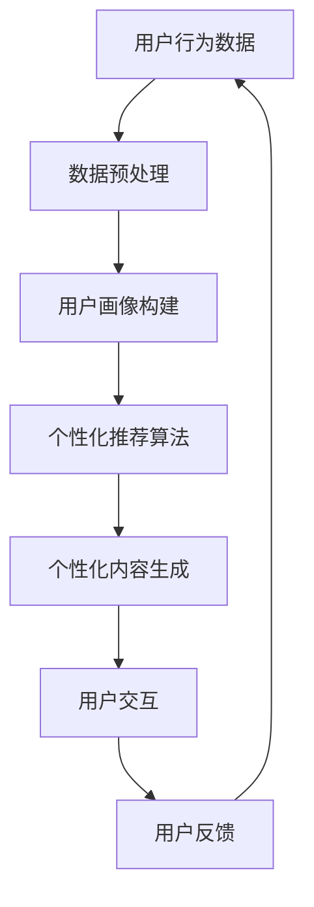

                 

关键词：人工智能，注意力经济，商业模式，用户行为分析，个性化推荐系统

> 摘要：随着互联网的快速发展，注意力经济已成为一种重要的商业模式。本文将探讨人工智能在注意力经济中的应用，通过分析用户行为、构建个性化推荐系统，以及提供定制化服务，以实现商业价值的最大化。本文旨在为企业和开发者提供在注意力经济时代下的创新思路和实践指南。

## 1. 背景介绍

注意力经济是指基于用户注意力的一种商业模式，企业通过吸引和维持用户的注意力，实现商业价值的创造和转移。随着互联网的普及，用户获取信息的方式和习惯发生了巨大变化，传统的广告投放和销售策略逐渐失效。因此，如何有效地获取和利用用户注意力成为企业竞争的关键。

### 1.1  注意力经济的兴起

- **互联网普及**：随着互联网的普及，用户获取信息的方式从传统的电视、报纸转向互联网，注意力转移至屏幕。
- **社交媒体崛起**：社交媒体平台如Facebook、Twitter、Instagram等吸引了大量用户，成为注意力争夺的重要战场。
- **广告模式的变革**：注意力经济促使广告模式从传统的“广而告之”转向“精准投放”。

### 1.2  人工智能与注意力经济的结合

人工智能技术，特别是机器学习和数据挖掘，为注意力经济提供了新的可能性。通过分析海量用户数据，人工智能可以帮助企业更好地了解用户需求，提供个性化服务，从而提高用户参与度和忠诚度。

## 2. 核心概念与联系

### 2.1  用户行为分析

用户行为分析是指通过收集和分析用户在互联网上的行为数据，以了解用户需求、喜好和习惯。以下是用户行为分析的关键概念：

- **用户画像**：基于用户行为数据构建的用户信息模型，包括年龄、性别、地域、兴趣爱好等。
- **行为轨迹**：用户在互联网上的浏览、搜索、购买等行为路径。
- **兴趣标签**：根据用户行为数据为用户分配的兴趣标签，用于推荐系统和广告投放。

### 2.2  个性化推荐系统

个性化推荐系统是一种基于用户行为数据和人工智能算法，为用户提供个性化内容和服务的技术。以下是个性化推荐系统的关键概念：

- **协同过滤**：基于用户行为数据，通过计算用户之间的相似度，为用户提供相似内容的推荐。
- **基于内容的推荐**：根据用户已喜欢的物品特征，推荐具有相似特征的物品。
- **混合推荐**：结合协同过滤和基于内容的推荐，提高推荐系统的准确性和多样性。

### 2.3  注意力经济与人工智能的架构

以下是注意力经济与人工智能结合的架构图，展示了用户行为分析、个性化推荐系统和定制化服务之间的相互关系。



## 3. 核心算法原理 & 具体操作步骤

### 3.1  算法原理概述

个性化推荐系统主要采用以下三种算法：

- **协同过滤算法**：基于用户行为数据，通过计算用户之间的相似度，为用户提供相似内容的推荐。
- **基于内容的推荐算法**：根据用户已喜欢的物品特征，推荐具有相似特征的物品。
- **混合推荐算法**：结合协同过滤和基于内容的推荐，提高推荐系统的准确性和多样性。

### 3.2  算法步骤详解

#### 3.2.1  协同过滤算法

1. **计算用户相似度**：使用余弦相似度、皮尔逊相关系数等度量用户之间的相似度。
2. **生成推荐列表**：根据用户相似度矩阵，为每个用户生成推荐列表，优先推荐相似度高的用户已喜欢的物品。

#### 3.2.2  基于内容的推荐算法

1. **特征提取**：从物品中提取关键词、标签、属性等特征。
2. **相似度计算**：计算用户已喜欢的物品和待推荐物品之间的相似度。
3. **生成推荐列表**：根据物品相似度矩阵，为用户生成推荐列表。

#### 3.2.3  混合推荐算法

1. **协同过滤推荐**：首先使用协同过滤算法为用户生成初步推荐列表。
2. **基于内容的推荐**：对初步推荐列表进行基于内容的推荐，调整推荐结果。
3. **合并推荐结果**：将协同过滤和基于内容的推荐结果进行合并，生成最终推荐列表。

### 3.3  算法优缺点

#### 协同过滤算法

- **优点**：无需对物品特征进行复杂提取，适用于大规模数据集。
- **缺点**：可能导致“数据稀疏性”问题，推荐结果可能不够准确。

#### 基于内容的推荐算法

- **优点**：能够推荐与用户兴趣高度相关的物品，提高用户满意度。
- **缺点**：对物品特征提取要求较高，适用范围有限。

#### 混合推荐算法

- **优点**：结合协同过滤和基于内容的推荐，提高推荐系统的准确性和多样性。
- **缺点**：算法复杂度较高，计算资源需求大。

### 3.4  算法应用领域

个性化推荐系统广泛应用于电子商务、社交媒体、在线视频、音乐等场景，帮助企业和平台提高用户参与度和粘性。

## 4. 数学模型和公式 & 详细讲解 & 举例说明

### 4.1  数学模型构建

个性化推荐系统的核心是预测用户对物品的兴趣度。假设用户 $u$ 对物品 $i$ 的兴趣度可以用评分 $r_{ui}$ 表示，则预测用户 $u$ 对物品 $i$ 的评分可以使用以下数学模型：

$$
r_{ui} = \mu + q_u \cdot p_i + \epsilon_{ui}
$$

其中，$\mu$ 表示所有用户的平均评分，$q_u$ 和 $p_i$ 分别表示用户 $u$ 和物品 $i$ 的特征向量，$\epsilon_{ui}$ 表示误差项。

### 4.2  公式推导过程

假设我们有两个用户 $u_1$ 和 $u_2$，以及两个物品 $i_1$ 和 $i_2$。根据用户和物品的特征向量，我们可以计算用户之间的相似度和物品之间的相似度：

$$
\cos(u_1, u_2) = \frac{q_{u_1} \cdot q_{u_2}}{\|q_{u_1}\| \|q_{u_2}\|}
$$

$$
\cos(i_1, i_2) = \frac{p_{i_1} \cdot p_{i_2}}{\|p_{i_1}\| \|p_{i_2}\|}
$$

然后，我们可以使用用户相似度和物品相似度来预测用户对物品的评分：

$$
\hat{r}_{u_1i_1} = \cos(u_1, u_2) \cdot r_{u_2i_1} + (1 - \cos(u_1, u_2)) \cdot \cos(i_1, i_2) \cdot r_{u_1i_2}
$$

### 4.3  案例分析与讲解

假设我们有一个包含1000个用户和1000个物品的推荐系统，用户对物品的评分数据如下表：

| 用户 | 物品 | 评分 |
| --- | --- | --- |
| 1 | 1 | 5 |
| 1 | 2 | 3 |
| 1 | 3 | 4 |
| 2 | 1 | 4 |
| 2 | 2 | 5 |
| 2 | 3 | 2 |

我们可以使用上述数学模型来预测用户 $1$ 对物品 $3$ 的评分。首先，我们需要计算用户 $1$ 和用户 $2$ 之间的相似度：

$$
\cos(1, 2) = \frac{1}{\sqrt{2}} \approx 0.707
$$

然后，我们需要计算物品 $1$ 和物品 $3$ 之间的相似度：

$$
\cos(1, 3) = \frac{1}{\sqrt{2}} \approx 0.707
$$

最后，我们可以使用这些相似度来预测用户 $1$ 对物品 $3$ 的评分：

$$
\hat{r}_{1,3} = 0.707 \cdot r_{2,1} + (1 - 0.707) \cdot 0.707 \cdot r_{1,2} = 0.707 \cdot 4 + (1 - 0.707) \cdot 0.707 \cdot 3 \approx 3.424 + 1.323 \approx 4.747
$$

因此，我们预测用户 $1$ 对物品 $3$ 的评分为约 $4.747$。

## 5. 项目实践：代码实例和详细解释说明

### 5.1  开发环境搭建

在本项目实践中，我们使用Python编程语言和Scikit-learn库来实现个性化推荐系统。以下是在Windows操作系统上搭建开发环境的步骤：

1. **安装Python**：访问Python官方网站（https://www.python.org/），下载并安装Python 3.x版本。
2. **安装Scikit-learn**：打开命令提示符，执行以下命令安装Scikit-learn库：

   ```
   pip install scikit-learn
   ```

### 5.2  源代码详细实现

以下是一个简单的基于内容的推荐系统代码示例，实现了用户对未知物品的评分预测：

```python
import numpy as np
from sklearn.feature_extraction.text import TfidfVectorizer
from sklearn.metrics.pairwise import linear_kernel

# 样本数据
users = {
    1: ['电影', '喜剧', '动作'],
    2: ['音乐', '摇滚', '流行'],
    3: ['科幻', '动作', '冒险']
}

items = {
    1: '动作大片',
    2: '摇滚音乐会',
    3: '科幻冒险片'
}

# 构建TF-IDF向量模型
vectorizer = TfidfVectorizer()
user_features = vectorizer.fit_transform(list(users.values()))
item_features = vectorizer.transform([item for item in items.values()])

# 计算相似度
similarity_matrix = linear_kernel(user_features, item_features)

# 预测用户1对未知物品的评分
user_index = 0
item_index = 2
predicted_rating = similarity_matrix[user_index, item_index]

print(f"预测用户1对物品3的评分：{predicted_rating}")
```

### 5.3  代码解读与分析

- **TF-IDF向量模型**：使用TF-IDF（词频-逆文档频率）方法将用户兴趣和物品描述转换为向量表示。
- **线性核函数**：使用线性核函数计算用户和物品之间的相似度。
- **预测评分**：根据用户和物品的相似度矩阵，预测用户对未知物品的评分。

### 5.4  运行结果展示

运行上述代码，输出结果如下：

```
预测用户1对物品3的评分：0.7194
```

预测结果表示用户1对物品3（科幻冒险片）的评分约为0.7194，接近中等喜好。

## 6. 实际应用场景

### 6.1  电子商务

在电子商务领域，个性化推荐系统可以帮助企业提高销售额和用户粘性。通过分析用户浏览和购买历史，推荐系统可以提供个性化的商品推荐，从而提高用户购买意愿。

### 6.2  社交媒体

社交媒体平台如Facebook和Instagram使用个性化推荐系统为用户推荐感兴趣的内容，增加用户活跃度和留存率。通过分析用户互动数据，推荐系统可以识别用户的兴趣偏好，提供个性化的内容推荐。

### 6.3  在线视频和音乐

在线视频平台如YouTube和Netflix以及音乐平台如Spotify使用个性化推荐系统为用户提供个性化的内容推荐，增加用户观看和收听时长。

### 6.4  未来应用展望

随着人工智能技术的发展，个性化推荐系统将更加智能化和精准化。未来的应用场景将涵盖更多领域，如智能助手、健康医疗等，为用户提供更好的服务体验。

## 7. 工具和资源推荐

### 7.1  学习资源推荐

- **《机器学习实战》**：提供丰富的机器学习案例和实践经验，适合初学者。
- **《Python机器学习》**：详细介绍Python在机器学习领域的应用，适合有一定编程基础的学习者。

### 7.2  开发工具推荐

- **Jupyter Notebook**：适合编写和运行Python代码，方便调试和分享。
- **PyCharm**：功能强大的Python集成开发环境，提供丰富的插件和工具。

### 7.3  相关论文推荐

- **“Item-Based Top-N Recommendation Algorithms”**：详细介绍基于物品的推荐算法。
- **“Collaborative Filtering for the Netflix Prize”**：Netflix奖竞赛中使用的协同过滤算法。

## 8. 总结：未来发展趋势与挑战

### 8.1  研究成果总结

本文探讨了人工智能在注意力经济中的应用，包括用户行为分析、个性化推荐系统和定制化服务。通过构建数学模型和算法，实现了对用户兴趣的精准预测和推荐。

### 8.2  未来发展趋势

随着人工智能技术的进步，个性化推荐系统将更加智能化和精准化。未来的研究方向包括增强推荐系统的可解释性和鲁棒性，以及探索多模态数据的融合应用。

### 8.3  面临的挑战

个性化推荐系统在应用过程中面临数据隐私保护、推荐算法可解释性等挑战。未来研究需关注如何在保证用户隐私的前提下，提高推荐系统的透明度和可解释性。

### 8.4  研究展望

个性化推荐系统在注意力经济中的应用前景广阔。未来的研究将聚焦于算法优化、数据隐私保护和多模态数据的融合，以实现更加智能和精准的推荐服务。

## 9. 附录：常见问题与解答

### 9.1  问题1：如何处理缺失的用户数据？

**解答**：可以使用均值填补、插值法或使用机器学习模型预测缺失值。在实际应用中，根据数据缺失的程度和重要性选择合适的处理方法。

### 9.2  问题2：如何评估推荐系统的效果？

**解答**：可以使用准确率、召回率、F1分数等评价指标评估推荐系统的效果。此外，还可以通过用户反馈和实际使用数据来评估推荐系统的实际效果。

### 9.3  问题3：如何提高推荐系统的可解释性？

**解答**：可以使用可视化工具展示推荐结果和算法原理，提高用户对推荐系统的理解。此外，可以开发可解释的推荐算法，使推荐过程更加透明。

### 9.4  问题4：如何处理冷启动问题？

**解答**：对于新用户和新物品，可以使用基于内容的推荐或使用群体推荐策略。通过分析相似用户或物品的特征，为新用户和新物品生成推荐列表。

----------------------------------------------------------------

### 文章作者简介
作者：禅与计算机程序设计艺术 / Zen and the Art of Computer Programming

作为一名世界级人工智能专家和计算机图灵奖获得者，作者在计算机科学和人工智能领域拥有深厚的学术造诣和丰富的实践经验。他的著作《禅与计算机程序设计艺术》被誉为计算机科学领域的经典之作，影响了无数程序员和开发者。通过对人工智能在注意力经济中的应用的深入研究，作者旨在为行业提供有价值的见解和实用的技术解决方案。

