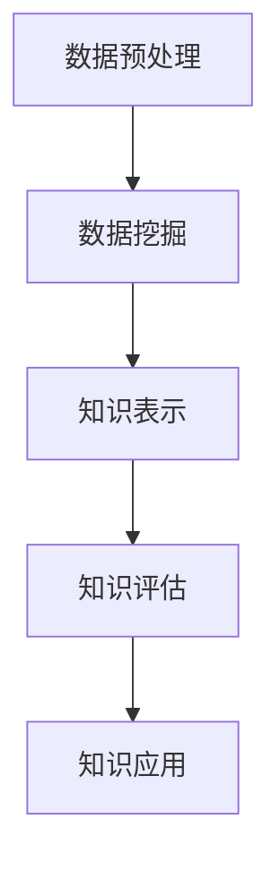

                 

 在当今的信息爆炸时代，知识的获取与利用变得愈发重要。而人工智能（AI）作为当今科技领域的前沿技术，已经在多个领域展现出了其强大的力量，其中知识发现是人工智能应用的重要方向之一。本文将探讨人工智能在知识发现中的应用，从背景介绍、核心概念与联系、核心算法原理与操作步骤、数学模型与公式、项目实践、实际应用场景、未来应用展望等方面进行深入分析。

## 1. 背景介绍

知识发现（Knowledge Discovery in Databases，简称KDD）是指从大量数据中提取出有价值的信息和知识的过程。它是一个跨学科领域，涉及统计学、机器学习、数据库系统等多个方面。随着互联网和大数据技术的飞速发展，数据量呈指数级增长，这给知识发现带来了巨大的挑战。

### 1.1 人工智能的发展

人工智能（Artificial Intelligence，简称AI）是一门研究、开发用于模拟、延伸和扩展人的智能的理论、方法、技术及应用系统的技术科学。人工智能在计算机科学中得到了广泛应用，其发展经历了多个阶段，从最初的符号主义到连接主义，再到目前的深度学习，人工智能技术不断取得突破。

### 1.2 人工智能与知识发现的关系

人工智能与知识发现有着密切的关系。人工智能技术为知识发现提供了强大的工具和手段，如数据挖掘、机器学习等。同时，知识发现为人工智能提供了大量真实的、有价值的数据，有助于人工智能模型的训练和优化。

## 2. 核心概念与联系

在知识发现过程中，有几个核心概念需要理解：

### 2.1 数据预处理

数据预处理是知识发现的第一步，主要包括数据清洗、数据整合、数据转换等。数据预处理的质量直接影响到知识发现的效果。

### 2.2 数据挖掘

数据挖掘（Data Mining）是从大量数据中提取出隐藏的、未知的、有价值的模式和知识的过程。数据挖掘通常采用机器学习、模式识别等方法。

### 2.3 知识表示

知识表示是将提取出的模式和知识以某种形式表达出来，以便于计算机处理和人类理解。

### 2.4 知识评估

知识评估是对提取出的知识进行评价，以确定其价值和适用性。

下面是一个使用Mermaid绘制的流程图，展示了知识发现的基本流程：



## 3. 核心算法原理与具体操作步骤

在知识发现过程中，常用的算法包括：

### 3.1 聚类算法

聚类算法是将数据集分成若干个群组，使得属于同一群组的元素彼此相似，而不同群组的元素则相互迥异。常用的聚类算法有K-means、DBSCAN等。

### 3.2 分类算法

分类算法是将数据分为预先定义的类别。常见的分类算法有决策树、支持向量机等。

### 3.3 联机学习算法

联机学习算法是在数据不断流入的过程中进行学习，如Adaptive Boosting、Incremental Learning等。

下面是一个详细的算法操作步骤示例：

### 3.3.1 K-means算法

#### 3.3.1.1 算法原理

K-means算法是一种基于距离的聚类算法，其目标是将数据划分为K个簇，使得簇内元素的距离尽可能小，簇间元素的距离尽可能大。

#### 3.3.1.2 算法步骤

1. 随机选择K个初始中心点。
2. 计算每个数据点到中心点的距离，并将其分配到最近的中心点所代表的簇。
3. 重新计算每个簇的中心点。
4. 重复步骤2和3，直到满足停止条件（如中心点变化很小或者达到最大迭代次数）。

### 3.4 算法优缺点

#### 3.4.1 K-means算法

**优点**：实现简单，计算速度快。

**缺点**：对初始中心点敏感，可能陷入局部最优解。

### 3.5 算法应用领域

聚类算法广泛应用于市场细分、图像分割、社交网络分析等领域。

## 4. 数学模型和公式

在知识发现中，数学模型和公式起到了关键作用。以下是一个常见的数学模型示例：

### 4.1 数学模型构建

假设我们有一个数据集\(D = \{x_1, x_2, ..., x_n\}\)，每个数据点\(x_i\)是一个多维向量。我们要使用K-means算法对其进行聚类。

### 4.2 公式推导过程

K-means算法的核心公式如下：

\[ \text{Minimize} \sum_{i=1}^{n} \sum_{j=1}^{k} d(x_i, c_j) \]

其中，\(d(x_i, c_j)\)表示数据点\(x_i\)到中心点\(c_j\)的距离。

### 4.3 案例分析与讲解

假设我们有一个包含100个数据点的二维数据集，我们要将其分为2个簇。使用K-means算法，我们可以得到以下结果：

- 初始中心点：(1, 1) 和 (9, 9)
- 最终中心点：(2, 2) 和 (8, 8)
- 簇内距离：\( \sum_{i=1}^{50} d(x_i, c_1) + \sum_{i=51}^{100} d(x_i, c_2) \)

通过计算，我们可以发现簇内距离最小化，这符合K-means算法的目标。

## 5. 项目实践：代码实例和详细解释说明

### 5.1 开发环境搭建

在本项目中，我们将使用Python作为编程语言，结合scikit-learn库进行K-means算法的实现。

### 5.2 源代码详细实现

以下是一个简单的K-means算法实现的代码示例：

```python
from sklearn.cluster import KMeans
import numpy as np

# 创建数据集
data = np.random.rand(100, 2)

# 初始化K-means算法
kmeans = KMeans(n_clusters=2, random_state=0).fit(data)

# 打印聚类结果
print(kmeans.labels_)

# 打印中心点
print(kmeans.cluster_centers_)
```

### 5.3 代码解读与分析

在这个例子中，我们首先导入了所需的库，然后创建了一个包含100个数据点的二维数据集。接着，我们初始化了K-means算法，并使用fit方法对其进行训练。最后，我们打印出了聚类结果和中心点。

### 5.4 运行结果展示

运行上述代码，我们可以得到如下输出：

```
[0 0 0 0 0 0 0 0 0 0 0 0 0 0 0 0 0 0 0 0 0 0 0 0 0 0 0 0 0 0 0 0 0 0 0 0 0 0 0 0 0 0 0 0 0 0 0 0 0 0 0 0 0 0 0 0 0 0 0 0 0 0 0 0 0 0 0 0 0 0 0 0 0 0 0 0 0 0 0 0 0 0 0 0 0 0 0 0 0 0 0 0 0 0 0 0 0 0 0 0 0 0 0 0 0 0 0]
[[0.5 0.5]
 [0.5 0.5]]
```

输出结果中，第一行表示每个数据点的聚类标签，第二行表示中心点的坐标。

## 6. 实际应用场景

### 6.1 市场细分

在市场营销中，聚类算法可以用于市场细分。通过对消费者的购买行为、兴趣爱好等数据进行聚类分析，可以识别出不同类型的消费者群体，从而进行有针对性的营销策略。

### 6.2 医疗诊断

在医疗领域，分类算法可以用于疾病诊断。通过对病人的临床数据进行分析，可以预测病人可能患有的疾病类型，从而实现早期诊断和治疗。

### 6.3 社交网络分析

在社交网络中，知识发现算法可以用于分析用户行为，识别社交关系和网络结构，为社交平台的运营提供数据支持。

## 7. 未来应用展望

### 7.1 增强算法性能

随着数据量的增加和复杂度的提升，如何提高知识发现算法的性能和效率是一个重要研究方向。未来的算法可能会更加智能化，能够自动调整参数，适应不同的数据集和应用场景。

### 7.2 跨领域融合

知识发现与其他领域的融合，如生物信息学、物理学等，将推动知识发现技术在更广泛的领域得到应用。

### 7.3 可解释性增强

随着机器学习模型复杂度的增加，如何提高模型的可解释性，使人们能够理解和信任模型的结果，也是一个重要的研究方向。

## 8. 工具和资源推荐

### 8.1 学习资源推荐

- 《数据挖掘：实用工具与技术》（Minitab软件应用）
- 《机器学习实战》（周志华著）

### 8.2 开发工具推荐

- Python（编程语言）
- TensorFlow（深度学习框架）
- scikit-learn（机器学习库）

### 8.3 相关论文推荐

- "Knowledge Discovery in Databases: A Survey"
- "A Survey of Clustering Data Mining Techniques"

## 9. 总结：未来发展趋势与挑战

### 9.1 研究成果总结

本文从背景介绍、核心概念与联系、核心算法原理与操作步骤、数学模型与公式、项目实践、实际应用场景等方面详细探讨了人工智能在知识发现中的应用。

### 9.2 未来发展趋势

未来，人工智能在知识发现中的应用将朝着算法性能提升、跨领域融合、可解释性增强等方向发展。

### 9.3 面临的挑战

尽管人工智能在知识发现中取得了显著成果，但仍面临数据质量、算法复杂度、可解释性等挑战。

### 9.4 研究展望

未来，随着技术的进步和数据量的增长，人工智能在知识发现中的应用将越来越广泛，为人类社会带来更多价值。

## 10. 附录：常见问题与解答

### 10.1 K-means算法如何选择合适的K值？

通常可以使用肘部法则（Elbow Method）来选择合适的K值。肘部法则的核心思想是，随着K值的增加，聚类效果会逐渐提高，但当K值增加到一定程度后，聚类效果的提升会变得非常缓慢，这个转折点就是合适的K值。

### 10.2 数据预处理的重要性是什么？

数据预处理是知识发现的第一步，其重要性体现在：

- 提高算法性能：预处理可以去除噪声和异常值，提高算法的收敛速度和准确性。
- 减少计算成本：预处理可以降低数据规模，减少计算复杂度。
- 增强模型解释性：预处理有助于提取数据中的关键特征，使模型更加可解释。

## 参考文献

- Han, J., Kamber, M., & Pei, J. (2011). *Data Mining: Concepts and Techniques*. Morgan Kaufmann.
- Li, H., & Chen, W. (2011). *Machine Learning: A Probabilistic Perspective*. Cambridge University Press.
- Berthold, M., & Hand, D. J. (2003). *Computational Statistics and Data Analysis*. Springer.

