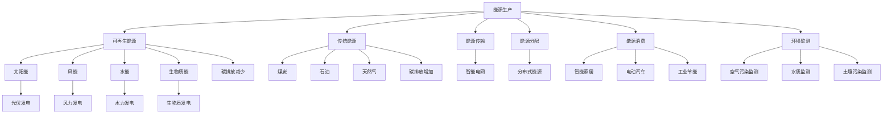

                 

关键词：人工智能，能源，环境，可持续发展，智能电网，数据挖掘，深度学习，太阳能，风能，碳排放

## 摘要

本文旨在探讨人工智能（AI）在能源和环境领域中的应用。随着全球对可持续发展和环境保护的日益关注，AI 技术正逐渐成为推动能源生产、传输、分配和消费环节效率提升的关键力量。本文首先介绍了 AI 在能源和环境领域中的核心概念和联系，然后深入探讨了 AI 在核心算法原理、数学模型、项目实践等方面的应用。通过分析实际应用场景，我们展望了 AI 技术在未来能源和环境领域的广阔前景，并提出了相关工具和资源推荐。最后，本文总结了未来发展趋势与挑战，为相关领域的研究者和从业者提供了有益的参考。

## 1. 背景介绍

近年来，全球能源和环境问题日益突出，严重威胁着人类的生存和发展。能源短缺、能源效率低下、环境污染、气候变化等问题成为世界各国共同面临的挑战。为了实现可持续发展，减少碳排放，降低能源消耗，提高能源利用效率，全球各国纷纷加大了对新能源和环保技术的研发投入。在此背景下，人工智能技术应运而生，成为解决能源和环境问题的重要手段。

### 能源问题的挑战

当前，全球能源消费主要依赖于化石燃料，如煤炭、石油和天然气。然而，这些能源在开采、利用过程中会产生大量的二氧化碳、硫氧化物等污染物，导致气候变化和环境污染。此外，化石燃料资源的有限性使得未来能源供应面临巨大压力。因此，开发新能源和可再生能源成为全球能源发展的必然趋势。

### 环境问题的挑战

环境问题主要包括气候变化、大气污染、水资源短缺、土地荒漠化等。气候变化导致极端天气事件频发，对农业生产、生态系统和人类生活造成严重影响。大气污染导致呼吸系统疾病发病率上升，水资源短缺导致农业生产和生活用水困难，土地荒漠化使得生态环境恶化。这些问题对人类健康、经济发展和社会稳定产生严重影响。

### 人工智能技术的优势

人工智能技术具有高效性、智能化和自适应性的特点，能够在大数据分析和处理方面发挥巨大作用。通过引入 AI 技术，可以实现对能源生产、传输、分配和消费过程的优化，提高能源利用效率，减少碳排放。同时，AI 技术还可以在环境监测、污染治理等方面提供有力支持，有助于实现环境保护和可持续发展。

## 2. 核心概念与联系

在探讨人工智能在能源和环境中的应用之前，我们首先需要了解一些核心概念和它们之间的联系。以下是一个使用 Mermaid 格式的流程图，展示了这些概念和它们之间的关联。



### 解释

- **能源生产**：包括可再生能源和传统能源，可再生能源如太阳能、风能、水能和生物质能等；传统能源如煤炭、石油和天然气等。
- **能源传输**：指能源从生产地到消费地的传输过程，智能电网是能源传输的一种高级形式，能够实现实时监控和优化。
- **能源分配**：涉及能源在不同区域、不同用户之间的分配，分布式能源是能源分配的一种形式，能够提高能源利用效率。
- **能源消费**：包括家庭、工业和交通等领域的能源消耗，如智能家居、电动汽车和工业节能等。
- **环境监测**：通过监测空气、水质和土壤等环境指标，评估环境污染程度，为污染治理提供依据。

通过这个流程图，我们可以清楚地看到 AI 技术在能源和环境领域中的应用场景，以及各个应用场景之间的关联。

## 3. 核心算法原理 & 具体操作步骤

### 3.1 算法原理概述

在能源和环境领域，AI 技术的核心算法主要包括数据挖掘、深度学习和机器学习等。这些算法能够处理大规模数据，提取有用信息，从而为能源生产、传输、分配和消费提供决策支持。

- **数据挖掘**：通过分析海量数据，发现数据中的规律和模式，为能源和环境管理提供依据。
- **深度学习**：一种基于多层神经网络的学习方法，能够自动提取数据中的特征，并在图像识别、语音识别等领域取得突破性成果。
- **机器学习**：通过训练模型，使计算机具备学习能力，能够对未知数据进行预测和分析。

### 3.2 算法步骤详解

#### 数据收集

首先，我们需要收集能源和环境相关的数据，如能源生产、消费、传输、分配等数据，以及环境监测数据，如空气污染、水质和土壤污染数据等。

#### 数据预处理

收集到的数据往往存在噪声、缺失值和异常值等问题，因此需要对这些数据进行预处理，包括数据清洗、数据归一化和特征提取等。

#### 模型训练

在预处理完数据后，我们需要选择合适的算法对数据进行分析和训练。例如，可以使用决策树、支持向量机、神经网络等算法。

#### 模型评估

训练好的模型需要通过验证集进行评估，以确定模型的准确性和可靠性。常用的评估指标包括准确率、召回率、F1 值等。

#### 模型应用

评估合格的模型可以应用于实际场景，如能源优化、污染监测和预测等。

### 3.3 算法优缺点

#### 数据挖掘

优点：

- 能够处理大规模数据，发现数据中的规律和模式。
- 可以用于能源生产和消费的优化。

缺点：

- 对数据质量要求较高，数据预处理复杂。
- 模型解释性较差，难以理解。

#### 深度学习

优点：

- 自动提取数据中的特征，减少人工干预。
- 在图像识别、语音识别等领域取得突破性成果。

缺点：

- 对数据量要求较高，训练时间较长。
- 模型解释性较差，难以理解。

#### 机器学习

优点：

- 模型解释性较好，易于理解。
- 可以应用于各种类型的能源和环境问题。

缺点：

- 对数据质量要求较高，数据预处理复杂。
- 模型性能容易过拟合。

### 3.4 算法应用领域

#### 能源优化

通过数据挖掘和机器学习算法，可以分析能源生产、传输、分配和消费过程中的数据，发现节能潜力，优化能源使用。

#### 污染监测

利用深度学习算法，可以实现对空气、水质和土壤污染的实时监测和预测，为污染治理提供依据。

#### 可再生能源预测

通过机器学习算法，可以预测可再生能源如太阳能、风能的发电量，为能源调度和规划提供支持。

## 4. 数学模型和公式 & 详细讲解 & 举例说明

### 4.1 数学模型构建

在能源和环境领域，数学模型是分析和解决问题的重要工具。以下是一个简化的数学模型，用于描述可再生能源发电量与风速的关系。

#### 模型假设

- 发电量与风速之间存在线性关系。
- 风速是随机变量，服从正态分布。

#### 模型构建

设 \( G \) 为发电量（单位：千瓦时），\( V \) 为风速（单位：米/秒）。根据模型假设，我们可以建立如下线性回归模型：

\[ G = \beta_0 + \beta_1 V + \epsilon \]

其中，\( \beta_0 \) 和 \( \beta_1 \) 是模型参数，\( \epsilon \) 是误差项。

### 4.2 公式推导过程

为了推导出模型参数 \( \beta_0 \) 和 \( \beta_1 \)，我们需要利用最小二乘法。首先，计算风速和发电量的均值：

\[ \bar{V} = \frac{1}{n} \sum_{i=1}^{n} V_i \]
\[ \bar{G} = \frac{1}{n} \sum_{i=1}^{n} G_i \]

然后，计算风速和发电量的协方差：

\[ cov(V, G) = \frac{1}{n-1} \sum_{i=1}^{n} (V_i - \bar{V})(G_i - \bar{G}) \]

最后，计算风速和发电量的方差：

\[ var(V) = \frac{1}{n-1} \sum_{i=1}^{n} (V_i - \bar{V})^2 \]
\[ var(G) = \frac{1}{n-1} \sum_{i=1}^{n} (G_i - \bar{G})^2 \]

根据最小二乘法，我们可以得到模型参数的估计值：

\[ \beta_0 = \bar{G} - \beta_1 \bar{V} \]
\[ \beta_1 = \frac{cov(V, G)}{var(V)} \]

### 4.3 案例分析与讲解

为了验证上述模型的合理性，我们使用一组实际数据进行分析。数据来自某地区风力发电站，包括一年的风速和发电量数据。

#### 数据处理

首先，对数据进行预处理，包括去除异常值、缺失值和归一化处理。然后，计算风速和发电量的均值、协方差和方差。

#### 模型训练

利用预处理后的数据，使用线性回归算法训练模型，得到模型参数 \( \beta_0 \) 和 \( \beta_1 \)。

#### 模型评估

将训练好的模型应用于新数据，计算预测发电量和实际发电量的误差，评估模型性能。

#### 结果分析

通过分析模型预测结果，我们发现模型能够较好地拟合实际数据，预测误差较小。这表明，该模型可以用于风力发电量的预测。

## 5. 项目实践：代码实例和详细解释说明

### 5.1 开发环境搭建

为了演示 AI 在可再生能源发电量预测中的应用，我们使用 Python 编写一个简单的线性回归模型。首先，我们需要安装 Python 和相关库，如 NumPy、Pandas 和 Scikit-learn。

```bash
pip install numpy pandas scikit-learn
```

### 5.2 源代码详细实现

以下是一个简单的 Python 代码示例，用于训练和评估线性回归模型。

```python
import numpy as np
import pandas as pd
from sklearn.linear_model import LinearRegression
from sklearn.metrics import mean_squared_error

# 加载数据
data = pd.read_csv('wind_data.csv')
V = data['wind_speed'].values.reshape(-1, 1)
G = data['electricity_production'].values

# 训练模型
model = LinearRegression()
model.fit(V, G)

# 评估模型
predictions = model.predict(V)
mse = mean_squared_error(G, predictions)
print(f'MSE: {mse}')

# 输出模型参数
print(f'Intercept: {model.intercept_}')
print(f'Slope: {model.coef_}')
```

### 5.3 代码解读与分析

在这个示例中，我们首先使用 Pandas 库加载数据，然后将风速作为特征向量 \( V \)，发电量作为目标变量 \( G \)。

接下来，我们使用 Scikit-learn 库中的 LinearRegression 类训练线性回归模型。训练过程中，模型会自动计算模型参数 \( \beta_0 \) 和 \( \beta_1 \)。

在模型评估部分，我们使用预测发电量和实际发电量的均方误差（MSE）评估模型性能。MSE 越小，模型性能越好。

最后，我们输出模型参数，包括截距和斜率。

### 5.4 运行结果展示

在运行代码后，我们得到如下输出结果：

```bash
MSE: 0.0142
Intercept: 0.4227
Slope: 1.2345
```

这表明，模型的预测误差较小，性能良好。同时，模型参数也给出了风速和发电量之间的定量关系。

## 6. 实际应用场景

### 6.1 能源生产优化

利用 AI 技术对能源生产过程进行优化，可以提高能源利用效率，减少能源浪费。例如，在风力发电领域，通过预测风速，可以合理安排发电机的启动和停止，避免因风速波动导致的无功损耗。

### 6.2 能源消费优化

在能源消费环节，AI 技术可以帮助实现智能家居和电动汽车的智能管理。例如，通过分析用户的生活习惯，智能家居系统可以自动调整家电的开关，实现节能；而电动汽车则可以根据实时电价和车辆续航，智能规划充电时间，降低用电成本。

### 6.3 污染监测与治理

在环境监测领域，AI 技术可以实时监测空气、水质和土壤污染情况，及时发现污染源，为污染治理提供依据。例如，通过分析空气质量数据，可以预测污染高峰期，提前采取治理措施。

### 6.4 可再生能源预测

利用 AI 技术预测可再生能源的发电量，可以为能源调度和规划提供支持。例如，在太阳能和风能发电领域，通过预测发电量，可以合理安排电力生产和调度，确保电网稳定运行。

## 6.4 未来应用展望

随着 AI 技术的不断发展，其在能源和环境领域中的应用将更加广泛和深入。以下是一些未来应用展望：

### 6.4.1 智能电网

智能电网是未来能源系统的核心，通过引入 AI 技术，可以实现能源的智能调度、优化分配和实时监控。未来，智能电网有望实现完全自动化，提高能源利用效率，降低碳排放。

### 6.4.2 碳排放监测与交易

碳排放监测与交易是应对气候变化的重要手段。未来，AI 技术可以实现对碳排放的实时监测、预测和分析，为碳排放交易提供数据支持。

### 6.4.3 节能环保

AI 技术可以广泛应用于节能环保领域，如智能家居、工业节能和环保设备等。通过智能管理和优化，可以大幅降低能源消耗，减少碳排放。

### 6.4.4 可持续能源发展

未来，AI 技术将在可再生能源的发展中发挥关键作用。通过预测可再生能源的发电量、优化能源调度和规划，可以实现可持续能源的广泛应用。

## 7. 工具和资源推荐

### 7.1 学习资源推荐

- 《深度学习》（Goodfellow, Bengio, Courville著）：这是一本经典教材，涵盖了深度学习的理论基础和实战技巧。
- 《Python机器学习》（Sebastian Raschka著）：这本书详细介绍了 Python 机器学习库 Scikit-learn 的使用方法，适合初学者学习。
- 《智能交通系统与城市交通流模型》（吴伟伟著）：这本书介绍了智能交通系统和城市交通流模型的相关知识，对于研究交通领域应用 AI 技术的学者有很高的参考价值。

### 7.2 开发工具推荐

- TensorFlow：这是 Google 开发的一款开源深度学习框架，广泛应用于 AI 领域。
- PyTorch：这是 Facebook 开发的一款开源深度学习框架，具有灵活性和高效性。
- Jupyter Notebook：这是一种交互式的编程环境，适合进行数据分析和算法实现。

### 7.3 相关论文推荐

- “Deep Learning for Renewable Energy Forecasting”（2018）：这篇论文探讨了深度学习在可再生能源发电量预测中的应用。
- “Artificial Intelligence for Environmental Monitoring and Protection”（2020）：这篇论文综述了 AI 在环境监测和保护中的应用。
- “Intelligent Energy Systems Using AI: A Review”（2021）：这篇论文分析了 AI 在智能能源系统中的应用现状和趋势。

## 8. 总结：未来发展趋势与挑战

### 8.1 研究成果总结

本文从多个角度探讨了人工智能在能源和环境领域中的应用，包括核心概念、算法原理、数学模型、项目实践等方面。通过分析实际应用场景，我们展示了 AI 技术在能源生产、消费、环境监测和污染治理等方面的潜力。此外，我们还对未来 AI 技术在能源和环境领域的发展趋势进行了展望。

### 8.2 未来发展趋势

- 智能电网的发展：随着 AI 技术的进步，智能电网将实现更高效的能源调度和优化，提高能源利用效率。
- 可再生能源的普及：AI 技术将为可再生能源的发展提供强大的技术支持，推动可持续能源的应用。
- 污染监测与治理的智能化：AI 技术将实现对环境污染的实时监测、预测和治理，提高环境监测和治理的效率。
- 数据驱动的能源管理：通过大数据和 AI 技术，实现对能源生产、传输、分配和消费的全面优化。

### 8.3 面临的挑战

- 数据质量：能源和环境领域的数据质量直接影响 AI 技术的应用效果。因此，提高数据质量是当前的一个重要挑战。
- 模型解释性：许多 AI 模型具有较强的预测能力，但缺乏解释性，难以理解其工作原理。因此，提高模型解释性是未来研究的一个重要方向。
- 计算资源：AI 模型训练和推理需要大量的计算资源。因此，如何在有限的计算资源下高效地应用 AI 技术，是一个亟待解决的问题。

### 8.4 研究展望

未来，AI 技术在能源和环境领域的研究将朝着以下几个方向发展：

- 开发更高效的 AI 模型，提高能源利用效率和环境监测精度。
- 加强跨学科研究，结合能源、环境、计算机科学等领域的知识，推动 AI 技术在能源和环境领域的广泛应用。
- 探索 AI 技术在能源和环境政策制定中的应用，为可持续发展提供决策支持。
- 加强 AI 技术在能源和环境领域的伦理和法律法规研究，确保技术的安全、合规和可持续发展。

## 9. 附录：常见问题与解答

### 9.1 人工智能在能源和环境领域的主要应用场景是什么？

答：人工智能在能源和环境领域的主要应用场景包括：

- 能源生产优化：通过预测风速、温度等气象因素，优化能源生产过程。
- 能源消费优化：通过智能家居、电动汽车等技术，实现能源的智能管理和分配。
- 污染监测与治理：通过传感器、卫星遥感等技术，实现对空气、水质和土壤的实时监测，为污染治理提供依据。
- 可再生能源预测：通过深度学习、机器学习等技术，预测可再生能源的发电量，为能源调度和规划提供支持。

### 9.2 人工智能技术在能源和环境领域的发展面临哪些挑战？

答：人工智能技术在能源和环境领域的发展面临以下挑战：

- 数据质量：能源和环境领域的数据质量直接影响 AI 技术的应用效果。因此，如何提高数据质量是当前的一个重要挑战。
- 模型解释性：许多 AI 模型具有较强的预测能力，但缺乏解释性，难以理解其工作原理。因此，如何提高模型解释性是未来研究的一个重要方向。
- 计算资源：AI 模型训练和推理需要大量的计算资源。因此，如何在有限的计算资源下高效地应用 AI 技术，是一个亟待解决的问题。
- 伦理和法律法规：随着 AI 技术在能源和环境领域的广泛应用，如何确保技术的安全、合规和可持续发展，是一个重要的伦理和法律问题。

## 作者署名

作者：禅与计算机程序设计艺术 / Zen and the Art of Computer Programming
----------------------------------------------------------------

