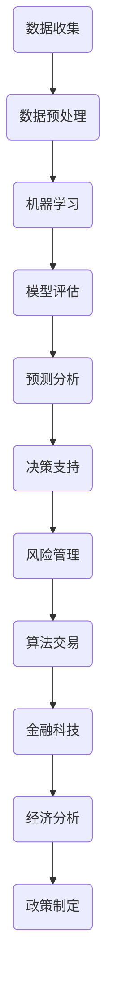

                 

关键词：人工智能、金融、经济、预测分析、风险管理、算法交易

> 摘要：随着人工智能技术的快速发展，其在金融和经济领域的应用日益广泛。本文将探讨人工智能在金融和经济中的重要角色，包括预测分析、风险管理、算法交易等方面，并分析其带来的机遇与挑战。

## 1. 背景介绍

人工智能（AI）是指由计算机系统实现的智能行为，能够模拟人类的思维过程。近年来，随着深度学习、自然语言处理、计算机视觉等技术的飞速发展，人工智能在各个领域得到了广泛应用。金融和经济作为社会发展的重要支柱，自然也成为人工智能技术的重要应用领域。

金融行业的复杂性使得人工智能在其中扮演着越来越重要的角色。从风险管理到投资决策，人工智能都能够提供高效的解决方案。经济领域同样受益于人工智能的应用，通过数据分析和预测，能够为政策制定者、企业和个人提供有价值的信息。

## 2. 核心概念与联系

在讨论人工智能在金融和经济中的应用之前，我们需要了解一些核心概念和它们之间的联系。以下是使用Mermaid流程图表示的核心概念和架构：



### 2.1 数据收集

数据收集是人工智能应用的基础。金融和经济领域的数据来源包括交易记录、市场新闻、财务报表、社交媒体等。这些数据需要经过预处理，以便用于机器学习模型。

### 2.2 数据预处理

数据预处理包括数据清洗、归一化、特征提取等步骤。这些步骤旨在提高数据质量，为后续的机器学习模型提供良好的数据基础。

### 2.3 机器学习

机器学习是人工智能的核心技术之一。它通过训练数据集，让计算机自动识别数据中的模式和规律。在金融和经济领域，机器学习被用于预测分析、风险评估和投资策略。

### 2.4 模型评估

模型评估是确保机器学习模型性能的关键步骤。通过评估指标（如准确率、召回率、AUC等），我们可以判断模型的性能，并根据评估结果进行调整。

### 2.5 预测分析

预测分析是利用机器学习模型对未来的市场趋势、经济指标等进行预测。在金融领域，预测分析可以帮助投资者做出更明智的投资决策。

### 2.6 决策支持

决策支持系统利用人工智能技术，为金融决策者提供实时的市场分析和预测。这有助于提高决策的效率和准确性。

### 2.7 风险管理

人工智能在风险管理中的应用包括信用评估、风险预警和投资组合优化。通过分析大量数据，人工智能能够发现潜在的风险，并提供相应的风险控制策略。

### 2.8 算法交易

算法交易是指利用计算机程序自动执行交易策略。人工智能在算法交易中扮演着关键角色，通过分析市场数据，自动调整交易策略，实现自动化交易。

### 2.9 金融科技

金融科技（FinTech）是指利用人工智能、区块链、云计算等新兴技术改造金融行业的创新。金融科技的出现，为金融行业带来了新的商业模式和机遇。

### 2.10 经济分析

人工智能在宏观经济分析中的应用包括经济增长预测、产业结构调整和就业市场分析。通过分析大量数据，人工智能能够为政策制定者提供有价值的信息。

### 2.11 政策制定

政策制定者可以利用人工智能技术对经济趋势进行分析，为宏观经济政策提供科学依据。人工智能还能够帮助政府更好地管理公共资源，提高公共服务的效率。

## 3. 核心算法原理 & 具体操作步骤

### 3.1 算法原理概述

人工智能在金融和经济领域的应用主要依赖于以下几种核心算法：

- **线性回归**：用于预测金融市场的趋势。
- **决策树**：用于分类和回归任务。
- **支持向量机**：用于分类和回归任务，尤其适合高维数据。
- **神经网络**：用于复杂的非线性预测和分析。

### 3.2 算法步骤详解

1. **数据收集**：从各种来源收集金融和经济数据，如交易记录、新闻、财务报表等。
2. **数据预处理**：清洗数据、归一化、特征提取等，提高数据质量。
3. **模型选择**：根据任务需求选择合适的机器学习模型。
4. **模型训练**：使用训练数据集训练模型，调整参数，提高模型性能。
5. **模型评估**：使用评估指标（如准确率、召回率、AUC等）评估模型性能。
6. **预测分析**：利用训练好的模型对未来的市场趋势、经济指标等进行预测。
7. **决策支持**：为决策者提供实时的市场分析和预测，辅助决策。
8. **风险管理**：分析数据，发现潜在的风险，提供风险控制策略。
9. **算法交易**：根据预测结果，自动执行交易策略。

### 3.3 算法优缺点

- **线性回归**：简单易用，适用于线性关系预测；但无法处理非线性关系。
- **决策树**：直观、易于理解，适用于分类和回归任务；但可能产生过拟合。
- **支持向量机**：适用于高维数据，性能稳定；但训练时间较长。
- **神经网络**：能够处理复杂的非线性关系，性能优异；但训练难度大，参数调整复杂。

### 3.4 算法应用领域

- **金融市场预测**：用于预测股票价格、汇率等金融指标。
- **信用评估**：用于评估个人或企业的信用风险。
- **投资组合优化**：用于优化投资组合，提高收益。
- **算法交易**：用于自动化执行交易策略。
- **宏观经济分析**：用于预测经济增长、就业市场等宏观经济指标。

## 4. 数学模型和公式 & 详细讲解 & 举例说明

在金融和经济领域，数学模型和公式起着至关重要的作用。以下是几个常用的数学模型和公式的讲解与举例说明。

### 4.1 数学模型构建

一个简单的线性回归模型可以表示为：

$$y = \beta_0 + \beta_1x + \epsilon$$

其中，$y$ 是因变量，$x$ 是自变量，$\beta_0$ 和 $\beta_1$ 是模型的参数，$\epsilon$ 是误差项。

### 4.2 公式推导过程

线性回归模型的推导过程如下：

1. **假设**：数据满足线性关系，即 $y$ 和 $x$ 之间存在线性关系。
2. **损失函数**：选择均方误差（MSE）作为损失函数，即

$$\text{MSE} = \frac{1}{n}\sum_{i=1}^{n}(y_i - (\beta_0 + \beta_1x_i))^2$$

其中，$n$ 是数据点的数量。
3. **最小化损失函数**：通过求导和设置导数为零，求解模型参数 $\beta_0$ 和 $\beta_1$。

$$\frac{\partial \text{MSE}}{\partial \beta_0} = 0$$
$$\frac{\partial \text{MSE}}{\partial \beta_1} = 0$$

解得：

$$\beta_0 = \bar{y} - \beta_1\bar{x}$$
$$\beta_1 = \frac{\sum_{i=1}^{n}(x_i - \bar{x})(y_i - \bar{y})}{\sum_{i=1}^{n}(x_i - \bar{x})^2}$$

其中，$\bar{x}$ 和 $\bar{y}$ 分别是 $x$ 和 $y$ 的平均值。

### 4.3 案例分析与讲解

假设我们有一组股票价格数据，数据集包含两个特征：股票价格（$x$）和交易量（$y$）。我们的目标是使用线性回归模型预测未来的股票价格。

1. **数据收集**：从股票交易所获取历史数据，包括股票价格和交易量。
2. **数据预处理**：清洗数据，去除异常值，进行归一化处理。
3. **模型选择**：选择线性回归模型。
4. **模型训练**：使用训练数据集训练模型，求解参数 $\beta_0$ 和 $\beta_1$。
5. **模型评估**：使用测试数据集评估模型性能，计算预测误差。
6. **预测分析**：利用训练好的模型预测未来的股票价格。

通过上述步骤，我们可以得到一个线性回归模型，用于预测股票价格。例如，给定一个交易量 $x$，我们可以预测相应的股票价格 $y$。

## 5. 项目实践：代码实例和详细解释说明

在本节中，我们将通过一个实际项目来展示如何使用人工智能技术进行金融预测。以下是一个简单的Python代码实例，用于预测股票价格。

### 5.1 开发环境搭建

- Python 3.x
- NumPy
- Pandas
- Matplotlib
- Scikit-learn

### 5.2 源代码详细实现

```python
import numpy as np
import pandas as pd
from sklearn.linear_model import LinearRegression
from sklearn.model_selection import train_test_split
from sklearn.metrics import mean_squared_error
import matplotlib.pyplot as plt

# 5.2.1 数据收集
data = pd.read_csv('stock_price_data.csv')
data.head()

# 5.2.2 数据预处理
data = data[['price', 'volume']]
data.head()

# 5.2.3 模型选择
model = LinearRegression()

# 5.2.4 模型训练
X_train, X_test, y_train, y_test = train_test_split(data['volume'], data['price'], test_size=0.2, random_state=42)
model.fit(X_train, y_train)

# 5.2.5 模型评估
y_pred = model.predict(X_test)
mse = mean_squared_error(y_test, y_pred)
print(f'MSE: {mse}')

# 5.2.6 预测分析
plt.scatter(X_test, y_test, color='blue')
plt.plot(X_test, y_pred, color='red')
plt.xlabel('Volume')
plt.ylabel('Price')
plt.show()
```

### 5.3 代码解读与分析

上述代码展示了如何使用线性回归模型预测股票价格。具体步骤如下：

1. **数据收集**：从CSV文件中读取股票价格和交易量数据。
2. **数据预处理**：选择相关的特征，并去除无关特征。
3. **模型选择**：选择线性回归模型。
4. **模型训练**：使用训练数据集训练模型，求解参数。
5. **模型评估**：使用测试数据集评估模型性能，计算预测误差。
6. **预测分析**：绘制散点图和拟合曲线，展示预测结果。

通过上述步骤，我们可以得到一个简单的股票价格预测模型。在实际应用中，我们可以根据需要调整模型参数，提高预测精度。

## 6. 实际应用场景

### 6.1 风险管理

在金融行业中，风险管理是一个至关重要的环节。人工智能可以通过分析历史数据，预测潜在的风险，并提供相应的风险控制策略。例如，银行可以使用人工智能技术对贷款申请进行信用评估，预测借款人违约的风险。这有助于银行降低贷款风险，提高贷款审批效率。

### 6.2 算法交易

算法交易是指利用计算机程序自动执行交易策略。在股票市场中，算法交易已经成为一种重要的交易方式。通过分析市场数据，人工智能可以实时调整交易策略，实现自动化交易。这有助于投资者捕捉市场机会，降低交易成本，提高投资收益。

### 6.3 投资组合优化

投资组合优化是金融投资中的一个重要任务。人工智能可以通过分析历史数据和市场趋势，预测未来的资产回报率，并优化投资组合的配置。这有助于投资者实现风险和收益的最优化，提高投资组合的收益。

### 6.4 宏观经济分析

人工智能在宏观经济分析中也发挥着重要作用。通过分析大量经济数据，人工智能可以预测经济增长、就业市场等宏观经济指标。这为政策制定者提供了科学依据，有助于制定合理的宏观经济政策。

### 6.5 金融科技

金融科技（FinTech）是指利用人工智能、区块链、云计算等新兴技术改造金融行业的创新。例如，人工智能可以通过分析用户行为数据，提供个性化的金融服务，提高用户体验。区块链技术可以用于实现去中心化的金融交易，提高交易的安全性和透明度。

## 7. 工具和资源推荐

### 7.1 学习资源推荐

- 《Python机器学习》（作者：塞巴斯蒂安·拉滕伯格）
- 《深度学习》（作者：伊恩·古德费洛等）
- 《金融科技：区块链、加密货币与智能合约》（作者：安德烈亚斯·安东诺普洛斯）

### 7.2 开发工具推荐

- Jupyter Notebook：适用于编写和运行Python代码。
- TensorFlow：用于构建和训练深度学习模型。
- PyTorch：用于构建和训练深度学习模型。

### 7.3 相关论文推荐

- "Deep Learning for Financial Time Series Classification"（作者：Hans J. Smit et al.）
- "Neural Network Forex Trading System"（作者：Zbigniew Litwiniuk）
- "Artificial Intelligence in Finance"（作者：Chetan M. Navin）

## 8. 总结：未来发展趋势与挑战

### 8.1 研究成果总结

近年来，人工智能在金融和经济领域的应用取得了显著成果。通过数据分析和预测，人工智能已经为金融决策提供了有力支持，提高了投资效率和风险控制水平。同时，人工智能在金融科技、宏观经济分析等方面也展示了巨大的潜力。

### 8.2 未来发展趋势

1. **算法交易**：随着机器学习技术的进步，算法交易将变得越来越智能，实现更高的交易效率和收益。
2. **风险管理**：人工智能将进一步提高风险管理能力，降低金融风险，提高金融市场的稳定性。
3. **金融科技**：金融科技将继续推动金融行业的创新，为用户提供更多个性化、智能化的金融服务。
4. **宏观经济分析**：人工智能将更加深入地参与宏观经济分析，为政策制定者提供更有价值的决策支持。

### 8.3 面临的挑战

1. **数据隐私**：在金融领域，数据隐私保护是人工智能应用面临的主要挑战之一。如何确保用户数据的安全和隐私，是金融科技发展的重要课题。
2. **模型透明性**：人工智能模型在金融和经济领域的应用往往涉及大量数据和信息，如何确保模型的可解释性和透明性，是当前研究的重点。
3. **法律法规**：随着人工智能在金融领域的广泛应用，相关的法律法规也需要不断完善，以规范人工智能的应用，保障金融市场的稳定。

### 8.4 研究展望

未来，人工智能在金融和经济领域的应用将更加广泛，涵盖更多的业务场景。同时，随着人工智能技术的不断进步，其在金融决策、风险管理、金融科技等方面的作用将更加突出。我们期待人工智能能够为金融和经济领域带来更多的创新和机遇。

## 9. 附录：常见问题与解答

### 9.1 人工智能在金融领域有哪些应用？

人工智能在金融领域有广泛的应用，包括但不限于：

- 风险管理：通过数据分析和预测，识别潜在风险，提供风险控制策略。
- 投资决策：利用机器学习模型预测市场趋势，辅助投资决策。
- 算法交易：利用计算机程序自动执行交易策略，提高交易效率和收益。
- 金融科技：利用人工智能技术改造金融行业，提供个性化、智能化的金融服务。
- 宏观经济分析：通过分析大量经济数据，预测经济增长、就业市场等宏观经济指标。

### 9.2 人工智能在金融和经济领域的发展前景如何？

人工智能在金融和经济领域的发展前景非常广阔。随着技术的不断进步，人工智能将在金融决策、风险管理、金融科技、宏观经济分析等方面发挥越来越重要的作用。未来，人工智能有望成为金融和经济领域的重要驱动力，推动行业的创新和发展。

### 9.3 如何保障人工智能在金融领域的安全性和隐私？

保障人工智能在金融领域的安全性和隐私需要从多个方面进行：

- **数据加密**：对用户数据进行加密处理，确保数据传输和存储过程中的安全性。
- **隐私保护**：采用隐私保护技术，如差分隐私、同态加密等，保障用户隐私。
- **合规审查**：制定相关法律法规，规范人工智能在金融领域的应用，保障金融市场的稳定。
- **透明性**：确保人工智能模型的可解释性和透明性，提高用户对模型和结果的信任度。

### 9.4 人工智能在金融和经济领域有哪些挑战？

人工智能在金融和经济领域面临的挑战包括：

- **数据隐私**：如何保障用户数据的安全和隐私。
- **模型透明性**：如何确保人工智能模型的可解释性和透明性。
- **法律法规**：如何制定相关法律法规，规范人工智能在金融领域的应用。
- **人才短缺**：人工智能在金融领域的应用需要大量专业人才，如何培养和吸引人才。

## 作者署名

作者：禅与计算机程序设计艺术 / Zen and the Art of Computer Programming
----------------------------------------------------------------

### 后记 Postscript

本文以《人工智能在金融和经济中的应用》为题，深入探讨了人工智能在该领域的多方面应用，包括预测分析、风险管理、算法交易等。通过详细的数学模型和代码实例，读者可以更好地理解人工智能在这些应用中的具体实现方法。同时，文章也分析了人工智能在金融和经济领域面临的发展趋势与挑战，为未来的研究提供了有益的参考。

在撰写本文的过程中，作者力求以逻辑清晰、结构紧凑、简单易懂的方式，将复杂的技术内容呈现给读者。希望能够对从事金融和经济领域工作的人士以及人工智能爱好者提供一些启发和帮助。当然，随着技术的不断进步和应用场景的拓展，人工智能在金融和经济领域的应用还会不断深入，期待更多的研究者和从业者能够共同推动这一领域的创新与发展。

最后，感谢读者对本文的关注和支持，希望本文能够为您的学习和工作带来一定的帮助。如果您对本文有任何疑问或建议，欢迎在评论区留言，我们将及时回复。同时，也欢迎您关注我们的其他文章，一起探索人工智能的无限可能。再次感谢您的阅读！

