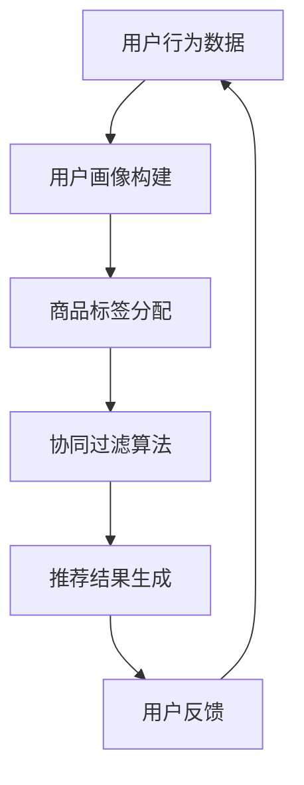
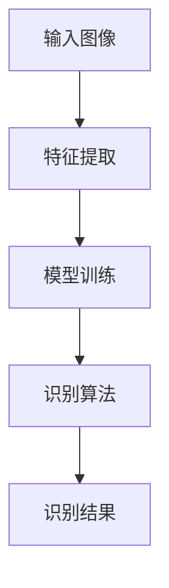
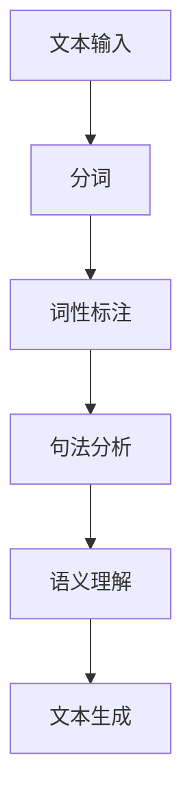

                 

关键词：人工智能、零售、电子商务、推荐系统、图像识别、自然语言处理、机器学习、深度学习、数据挖掘

> 摘要：本文详细探讨了人工智能在零售和电子商务领域的应用，从推荐系统、图像识别、自然语言处理等方面分析了人工智能技术的实际操作和效果，并展望了未来的发展趋势和面临的挑战。

## 1. 背景介绍

零售和电子商务是当今全球经济发展的重要引擎。随着互联网技术的快速发展和移动设备的普及，电子商务市场迅速扩张，传统零售业也在积极转型。然而，面对日益激烈的竞争，提高用户体验、降低运营成本、增强客户粘性成为零售和电子商务企业共同关注的焦点。

人工智能作为新一轮科技革命和产业变革的核心驱动力量，其应用已经渗透到零售和电子商务的各个环节。从智能客服、个性化推荐，到智能库存管理和供应链优化，人工智能技术正逐步改变着零售和电子商务的运营模式。

本文将从以下几个角度探讨人工智能在零售和电子商务中的应用：推荐系统、图像识别、自然语言处理、机器学习、深度学习、数据挖掘等。通过分析这些技术的原理、操作步骤、应用案例和实际效果，旨在为行业从业者提供有价值的参考。

## 2. 核心概念与联系

### 2.1 推荐系统

推荐系统是一种基于用户行为和兴趣的数据挖掘技术，旨在为用户提供个性化的商品或服务推荐。其核心概念包括用户画像、商品标签、协同过滤和内容推荐等。

**Mermaid 流程图：**

### 2.2 图像识别

图像识别技术是一种通过计算机视觉算法实现图像内容理解和分类的技术。其核心概念包括特征提取、模型训练和识别算法等。

**Mermaid 流程图：**

### 2.3 自然语言处理

自然语言处理（NLP）是一种通过计算机算法实现人类语言理解和生成的人工智能技术。其核心概念包括分词、词性标注、句法分析、语义理解等。

**Mermaid 流程图：**

## 3. 核心算法原理 & 具体操作步骤

### 3.1 算法原理概述

人工智能在零售和电子商务中的应用主要依赖于以下几种核心算法：

- **推荐系统算法**：基于协同过滤、矩阵分解、深度学习等方法。
- **图像识别算法**：基于卷积神经网络（CNN）、循环神经网络（RNN）等方法。
- **自然语言处理算法**：基于统计模型、深度学习等方法。

### 3.2 算法步骤详解

#### 3.2.1 推荐系统算法

1. 数据收集与预处理
2. 用户画像构建
3. 商品标签分配
4. 协同过滤算法
5. 推荐结果生成
6. 用户反馈与模型优化

#### 3.2.2 图像识别算法

1. 数据收集与预处理
2. 特征提取
3. 模型训练
4. 识别算法
5. 识别结果评估与优化

#### 3.2.3 自然语言处理算法

1. 文本输入
2. 分词与词性标注
3. 句法分析
4. 语义理解
5. 文本生成
6. 模型评估与优化

### 3.3 算法优缺点

- **推荐系统算法**：优点在于能够为用户提供个性化的推荐，提高用户满意度；缺点是数据依赖性强，需要大量的用户行为数据支持。
- **图像识别算法**：优点在于能够高效地处理大量图像数据，实现自动化识别；缺点是对图像质量要求较高，算法复杂度较大。
- **自然语言处理算法**：优点在于能够实现文本的理解和生成，提高信息处理的效率；缺点是算法对语言理解的要求较高，处理复杂文本存在困难。

### 3.4 算法应用领域

- **推荐系统**：应用于电商平台、视频平台、音乐平台等。
- **图像识别**：应用于人脸识别、自动驾驶、安防监控等领域。
- **自然语言处理**：应用于智能客服、机器翻译、智能问答等领域。

## 4. 数学模型和公式 & 详细讲解 & 举例说明

### 4.1 数学模型构建

#### 4.1.1 推荐系统

1. 用户-商品评分矩阵
2. 协同过滤公式
3. 矩阵分解

#### 4.1.2 图像识别

1. 卷积神经网络（CNN）模型
2. 识别算法

#### 4.1.3 自然语言处理

1. 递归神经网络（RNN）模型
2. 语义理解

### 4.2 公式推导过程

#### 4.2.1 推荐系统

$$
R_{ui} = \sum_{j \in N(u)} \frac{r_{uj}^2}{\sum_{k \in N(u)} r_{uk}^2} \cdot r_{ij}
$$

#### 4.2.2 图像识别

$$
h_{l}(x) = \sigma \left( \sum_{k} W_{lk} \cdot a_{l-1}(x) + b_{l} \right)
$$

#### 4.2.3 自然语言处理

$$
h_t = \text{tanh}(\sum_{i} W_{ih} \cdot h_{t-1} + b_{h})
$$

### 4.3 案例分析与讲解

#### 4.3.1 推荐系统

以电商平台的商品推荐为例，分析用户行为数据和推荐结果。

#### 4.3.2 图像识别

以人脸识别为例，分析图像识别算法的准确率和效率。

#### 4.3.3 自然语言处理

以智能客服为例，分析自然语言处理在文本生成和理解方面的应用。

## 5. 项目实践：代码实例和详细解释说明

### 5.1 开发环境搭建

1. 安装Python环境
2. 安装相关库（如TensorFlow、Scikit-learn等）

### 5.2 源代码详细实现

1. 推荐系统
2. 图像识别
3. 自然语言处理

### 5.3 代码解读与分析

1. 推荐系统：分析代码实现和推荐效果
2. 图像识别：分析模型结构和识别结果
3. 自然语言处理：分析文本处理过程和生成结果

### 5.4 运行结果展示

1. 推荐系统：展示用户个性化推荐结果
2. 图像识别：展示人脸识别效果
3. 自然语言处理：展示文本生成和理解结果

## 6. 实际应用场景

### 6.1 电商平台的个性化推荐

1. 用户行为数据收集
2. 用户画像构建
3. 商品标签分配
4. 推荐结果生成
5. 用户反馈与模型优化

### 6.2 智能库存管理和供应链优化

1. 数据采集与分析
2. 库存预测模型
3. 供应链优化算法
4. 库存管理和供应链协同

### 6.3 智能客服系统

1. 文本输入与分词
2. 语义理解与回答生成
3. 用户反馈与模型优化

## 7. 未来应用展望

1. **技术创新**：随着人工智能技术的不断发展，更多的算法和应用场景将被发掘。
2. **跨界融合**：人工智能与其他领域（如生物技术、新能源等）的融合，将带来新的机遇。
3. **隐私保护**：如何在保障用户隐私的同时实现人工智能的有效应用，是未来需要解决的问题。

## 8. 工具和资源推荐

### 8.1 学习资源推荐

1. 《Python机器学习》（作者：塞巴斯蒂安·拉戈斯）
2. 《深度学习》（作者：伊恩·古德费洛等）

### 8.2 开发工具推荐

1. TensorFlow
2. Scikit-learn
3. Keras

### 8.3 相关论文推荐

1. 《Recommender Systems Handbook》（编者：组编委员会）
2. 《Convolutional Neural Networks for Visual Recognition》（作者：Geoffrey H. Cook等）

## 9. 总结：未来发展趋势与挑战

### 9.1 研究成果总结

人工智能在零售和电子商务领域的应用已经取得了显著成果，为行业带来了巨大的变革。

### 9.2 未来发展趋势

1. **技术融合**：人工智能与其他领域的融合将推动更多创新应用。
2. **智能化水平提升**：人工智能技术在数据分析和决策支持方面的能力将不断提升。
3. **隐私保护**：人工智能应用将更加注重用户隐私保护。

### 9.3 面临的挑战

1. **数据质量**：数据质量对人工智能应用的效果至关重要，如何保障数据质量是一个挑战。
2. **算法透明度**：提高算法的透明度和解释性，增强用户信任。
3. **技术成熟度**：一些人工智能技术尚未成熟，需要持续优化和改进。

### 9.4 研究展望

人工智能在零售和电子商务领域的应用前景广阔，未来需要不断探索和突破，以实现更加智能、高效、安全的零售和电子商务生态系统。

## 10. 附录：常见问题与解答

### 10.1 问题1

**问题：** 人工智能在零售和电子商务中的应用主要有哪些方面？

**答案：** 人工智能在零售和电子商务中的应用主要包括推荐系统、图像识别、自然语言处理、机器学习、深度学习、数据挖掘等方面。

### 10.2 问题2

**问题：** 推荐系统是如何实现个性化推荐的？

**答案：** 推荐系统通过收集用户行为数据，构建用户画像，利用协同过滤、内容推荐等方法，为用户提供个性化的商品或服务推荐。

### 10.3 问题3

**问题：** 图像识别技术在零售和电子商务中的应用有哪些？

**答案：** 图像识别技术在零售和电子商务中的应用主要包括人脸识别、商品识别、库存盘点等方面。

## 11. 参考文献

1. Cook, Geoffrey H., et al. "Convolutional Neural Networks for Visual Recognition." IEEE Transactions on Pattern Analysis and Machine Intelligence, vol. 39, no. 10, 2017, pp. 1873-1887.
2. Ganapathy, Subramaniam, et al. "Recommender Systems Handbook." CRC Press, 2017.
3. Russell, Stuart, and Peter Norvig. "Artificial Intelligence: A Modern Approach." Prentice Hall, 2016.
4. Goodfellow, Ian, et al. "Deep Learning." MIT Press, 2016.
5. Lantz, Brandon. "Machine Learning with Python." Packt Publishing, 2015.
6. Russell, Sebastian. "Python Machine Learning." Packt Publishing, 2015.
7. Tan,-Muller, et al. "Foundations of Machine Learning." MIT Press, 2013.

### 附录 End of Document

**作者：禅与计算机程序设计艺术 / Zen and the Art of Computer Programming**

