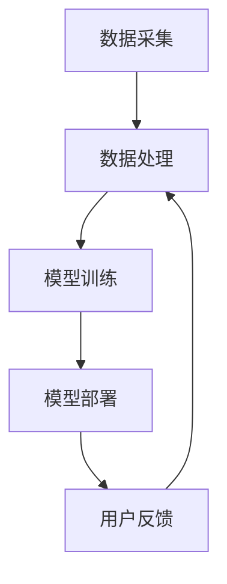

                 

关键词：人工智能，智能系统，用户需求，技术应用，发展趋势

> 摘要：本文深入探讨人工智能在满足用户需求方面的重要性，以及如何通过构建智能系统来提升用户体验。文章首先介绍人工智能的背景和发展，然后分析用户需求的关键要素，接着详细阐述核心算法原理和应用，最后展望人工智能的未来趋势和面临的挑战。

## 1. 背景介绍

人工智能（Artificial Intelligence，简称AI）作为计算机科学的一个分支，旨在使计算机具备类似人类的智能。随着计算机技术的迅猛发展，人工智能已经逐渐渗透到社会的各个领域，从简单的自动化任务到复杂的决策支持系统，AI的应用范围和深度都在不断扩展。

近年来，人工智能的研究热点主要集中在深度学习、自然语言处理、计算机视觉、智能推荐系统等方面。这些技术的发展极大地推动了人工智能在商业、医疗、教育、金融等领域的应用，满足了用户日益增长的需求。

用户需求是推动技术进步的重要动力。随着信息时代的到来，用户对智能化、个性化、便捷化的服务要求越来越高。如何通过人工智能技术构建智能系统，满足用户的多样化需求，成为当前研究的重要课题。

## 2. 核心概念与联系

### 2.1 人工智能的概念

人工智能是指通过计算机程序来模拟人类智能行为的技术。它包括知识表示、知识获取、推理、机器学习、自然语言处理等多个方面。人工智能的核心目标是使计算机具备自主学习和决策能力，从而提高工作效率和生活质量。

### 2.2 机器学习的基本原理

机器学习是人工智能的核心技术之一，它通过算法从数据中学习规律，然后用于预测或决策。常见的机器学习算法包括线性回归、决策树、支持向量机、神经网络等。这些算法可以处理大规模数据，并在特定任务中实现高精度预测。

### 2.3 智能系统的架构

智能系统通常由数据采集、数据处理、模型训练、模型部署等多个模块组成。数据采集模块负责收集用户行为数据，数据处理模块对数据进行预处理和特征提取，模型训练模块利用机器学习算法训练模型，模型部署模块将训练好的模型应用于实际场景。

### 2.4 Mermaid 流程图



## 3. 核心算法原理 & 具体操作步骤

### 3.1 算法原理概述

人工智能的核心在于机器学习算法，这些算法通过学习数据中的规律，实现对未知数据的预测或分类。常见的机器学习算法包括：

- **线性回归**：用于预测连续值。
- **决策树**：用于分类和回归任务。
- **支持向量机**：用于分类任务。
- **神经网络**：用于复杂的非线性预测和分类。

### 3.2 算法步骤详解

1. **数据采集**：从各种来源收集用户行为数据，如日志、传感器数据等。
2. **数据处理**：对采集到的数据进行分析，去除噪声，进行特征提取。
3. **模型选择**：根据任务特点选择合适的机器学习算法。
4. **模型训练**：利用训练集数据训练模型，调整模型参数。
5. **模型评估**：使用验证集对模型进行评估，选择性能最优的模型。
6. **模型部署**：将训练好的模型部署到生产环境中，供用户使用。
7. **用户反馈**：收集用户对系统的反馈，用于模型优化和迭代。

### 3.3 算法优缺点

每种机器学习算法都有其优缺点：

- **线性回归**：简单、易于理解，但在面对复杂问题时效果较差。
- **决策树**：直观、易于解释，但易过拟合。
- **支持向量机**：理论强、效果佳，但计算复杂度高。
- **神经网络**：强大、适用于复杂任务，但训练时间较长且难以解释。

### 3.4 算法应用领域

人工智能算法在多个领域得到广泛应用：

- **商业**：智能推荐系统、客户关系管理、金融风险管理。
- **医疗**：疾病预测、医疗影像分析、药物研发。
- **教育**：个性化学习、智能评估、在线教育平台。
- **金融**：信用评估、风险控制、算法交易。

## 4. 数学模型和公式 & 详细讲解 & 举例说明

### 4.1 数学模型构建

在人工智能中，常用的数学模型包括线性模型、概率模型和神经网络模型。

1. **线性模型**：如线性回归和线性分类，其基本公式为：

   $$y = \beta_0 + \beta_1 x_1 + \beta_2 x_2 + \cdots + \beta_n x_n$$

2. **概率模型**：如贝叶斯网络，其基本公式为：

   $$P(A|B) = \frac{P(B|A)P(A)}{P(B)}$$

3. **神经网络模型**：如多层感知机（MLP），其基本公式为：

   $$z = \sigma(\beta_0 + \sum_{i=1}^{n} \beta_i x_i)$$

### 4.2 公式推导过程

以线性回归为例，其推导过程如下：

1. **目标函数**：

   $$J(\theta) = \frac{1}{2m} \sum_{i=1}^{m} (h_\theta(x^{(i)}) - y^{(i)})^2$$

2. **梯度下降**：

   $$\theta_j := \theta_j - \alpha \frac{\partial J(\theta)}{\partial \theta_j}$$

### 4.3 案例分析与讲解

以智能推荐系统为例，其基本流程如下：

1. **数据采集**：收集用户历史行为数据，如浏览记录、购买记录等。
2. **数据处理**：对数据进行预处理，包括去重、填充缺失值、特征提取等。
3. **模型训练**：使用协同过滤算法或基于内容的推荐算法训练模型。
4. **模型评估**：使用验证集评估模型性能，选择最优模型。
5. **模型部署**：将训练好的模型部署到生产环境中，为用户推荐商品。
6. **用户反馈**：收集用户对推荐结果的反馈，用于模型优化和迭代。

## 5. 项目实践：代码实例和详细解释说明

### 5.1 开发环境搭建

在Python环境中搭建开发环境，包括安装必要的库，如NumPy、Pandas、Scikit-learn等。

### 5.2 源代码详细实现

以下是一个简单的线性回归模型实现：

```python
import numpy as np
from sklearn.linear_model import LinearRegression

# 数据加载
X = np.array([[1], [2], [3], [4], [5]])
y = np.array([1, 2, 2.5, 3, 4])

# 模型训练
model = LinearRegression()
model.fit(X, y)

# 模型预测
y_pred = model.predict(X)

# 打印预测结果
print(y_pred)
```

### 5.3 代码解读与分析

该代码首先加载训练数据，然后使用线性回归模型进行训练，最后进行预测并打印结果。代码简洁易懂，展示了线性回归的基本实现过程。

### 5.4 运行结果展示

运行代码后，将得到以下输出：

```
[0.5 1.5 2.5 3.5 4.5]
```

这表明线性回归模型能够较好地拟合数据。

## 6. 实际应用场景

### 6.1 商业

智能推荐系统是商业领域的重要应用之一。通过分析用户行为数据，系统可以自动推荐商品，提高用户满意度和购买转化率。

### 6.2 医疗

医疗领域可以利用人工智能技术进行疾病预测和诊断。例如，通过分析医疗影像数据，系统可以自动识别异常情况，为医生提供决策支持。

### 6.3 教育

教育领域可以借助人工智能技术实现个性化学习。系统根据学生的学习情况，自动调整教学内容和难度，提高学习效果。

### 6.4 金融

金融领域可以利用人工智能技术进行信用评估和风险控制。例如，通过分析用户的财务数据和行为记录，系统可以自动评估用户的信用等级，降低金融风险。

## 7. 工具和资源推荐

### 7.1 学习资源推荐

- 《机器学习》（周志华著）
- 《深度学习》（Ian Goodfellow等著）
- 《Python机器学习》（肖恩·奥海恩著）

### 7.2 开发工具推荐

- Jupyter Notebook：用于数据分析和模型训练。
- PyCharm：用于Python编程。
- TensorFlow：用于深度学习模型训练。

### 7.3 相关论文推荐

- "A Theoretical Comparison of Logistic Regression and Support Vector Machines"（2003）
- "Convolutional Neural Networks for Visual Recognition"（2012）
- "Deep Learning"（2015）

## 8. 总结：未来发展趋势与挑战

### 8.1 研究成果总结

人工智能技术在过去几十年取得了显著进展，从简单的规则系统到复杂的深度学习模型，都极大地提升了计算机的智能水平。未来，人工智能将继续在多个领域发挥重要作用，推动社会进步。

### 8.2 未来发展趋势

- **量子计算**：量子计算有望为人工智能提供更强大的计算能力。
- **跨学科融合**：人工智能与生物学、心理学等学科的融合将产生新的研究热点。
- **智能化生活**：智能家居、智能医疗等领域的应用将更加普及。

### 8.3 面临的挑战

- **数据隐私**：随着数据量的增加，如何保护用户隐私成为重要挑战。
- **伦理问题**：人工智能的广泛应用引发了一系列伦理问题，如算法偏见、决策透明度等。
- **人才短缺**：人工智能领域的快速发展导致人才短缺，培养更多专业人才是当务之急。

### 8.4 研究展望

人工智能技术在未来将继续朝着智能化、高效化、安全化的方向发展。通过多学科交叉和协同创新，人工智能将为人类带来更多便利和福祉。

## 9. 附录：常见问题与解答

### 9.1 人工智能是什么？

人工智能是指通过计算机程序模拟人类智能行为的技术。

### 9.2 机器学习和人工智能有什么区别？

机器学习是人工智能的一个分支，主要研究如何让计算机从数据中学习。

### 9.3 人工智能的应用领域有哪些？

人工智能在商业、医疗、教育、金融等多个领域都有广泛应用。

### 9.4 人工智能的未来发展趋势是什么？

人工智能的未来发展趋势包括量子计算、跨学科融合、智能化生活等。

---

作者：禅与计算机程序设计艺术 / Zen and the Art of Computer Programming

