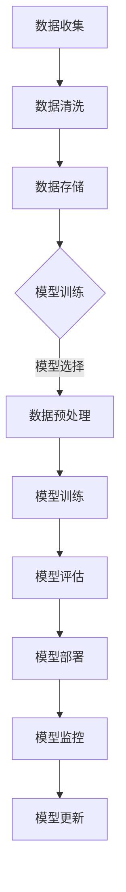

                 

人工智能正在改变世界的各个方面，从医疗到金融，从交通到教育，AI的应用几乎无处不在。然而，随着AI技术的不断进步，如何管理和利用这些技术，使其更好地服务于企业和个人，成为了新的挑战。本文将探讨在AI时代如何重新定义工作，以实现高效的人工智能管理。

## 1. 背景介绍

在过去几十年中，人工智能（AI）经历了从理论研究到实际应用的巨大转变。早期的AI主要集中在符号推理和规则系统，而现代的AI则更多地依赖于机器学习和深度学习技术。这些技术的进步不仅使得AI在图像识别、自然语言处理、决策支持等方面表现出色，而且也极大地改变了我们的工作和生活方式。

然而，随着AI技术的广泛应用，企业和个人也面临着一系列新的挑战。首先，AI技术的快速发展和变化使得传统的管理方法和流程难以适应。其次，AI的广泛应用带来了数据隐私和安全问题，以及道德和伦理方面的挑战。此外，AI技术的普及也加剧了人才短缺问题，特别是具有AI技能的专业人才。

因此，如何在AI时代重新定义工作，实现有效的人工智能管理，成为了企业和个人亟需解决的问题。本文将围绕这一问题，探讨AI时代的工作模式、管理策略和应用场景。

## 2. 核心概念与联系

### 2.1 AI管理的基本概念

AI管理是指利用人工智能技术，对企业的业务流程、资源配置、决策支持等方面进行优化和改进。AI管理的核心概念包括数据管理、模型训练、模型部署和监控等。

#### 数据管理

数据管理是AI管理的基石。有效的数据管理可以确保数据的准确性、完整性和安全性，为AI模型提供高质量的数据支持。

- **数据收集**：通过各种渠道收集数据，包括内部数据和外部数据。
- **数据清洗**：对收集到的数据进行处理，去除错误、重复和无关数据。
- **数据存储**：选择合适的存储方案，确保数据的安全和可访问性。

#### 模型训练

模型训练是AI管理的核心环节。通过训练，可以使AI模型学会从数据中提取规律，进行预测和决策。

- **模型选择**：根据业务需求选择合适的AI模型。
- **数据预处理**：对训练数据进行预处理，以提高模型的性能和泛化能力。
- **模型训练**：使用训练数据训练模型，不断调整参数，优化模型性能。
- **模型评估**：对训练好的模型进行评估，确保其性能满足业务需求。

#### 模型部署

模型部署是将训练好的模型应用于实际业务场景的过程。

- **模型集成**：将模型集成到现有的业务流程中。
- **模型监控**：实时监控模型的运行状态，确保其稳定性和准确性。
- **模型更新**：根据业务需求，定期更新模型，以提高其性能。

### 2.2 AI管理与业务流程

AI管理不仅涉及到技术层面的优化，还与业务流程密切相关。

#### 业务流程分析

对现有的业务流程进行深入分析，识别流程中的瓶颈和优化机会。

- **流程可视化**：使用流程图等工具，将业务流程可视化。
- **流程优化**：根据分析结果，对业务流程进行优化，提高效率。

#### AI应用场景

根据业务流程的特点，选择合适的AI技术进行应用。

- **自动化决策**：使用AI技术，实现自动化决策，提高决策的准确性和效率。
- **预测分析**：使用AI技术，进行预测分析，为业务决策提供数据支持。
- **客户服务**：使用AI技术，提供智能客服，提高客户满意度。

### 2.3 Mermaid流程图

以下是一个简化的AI管理流程图，使用Mermaid语法绘制。



## 3. 核心算法原理 & 具体操作步骤

### 3.1 算法原理概述

在AI管理中，常用的核心算法包括机器学习算法、深度学习算法和强化学习算法。以下将简要介绍这些算法的基本原理。

#### 机器学习算法

机器学习算法通过从数据中学习规律，进行预测和决策。常见的机器学习算法有决策树、支持向量机、神经网络等。

- **决策树**：通过递归划分数据集，构建一棵决策树模型。
- **支持向量机**：通过寻找最佳分割超平面，实现分类和回归。
- **神经网络**：通过多层神经元之间的权重调整，实现复杂函数的拟合。

#### 深度学习算法

深度学习算法是机器学习的一种特殊形式，通过多层神经网络，实现更加复杂的特征提取和模型训练。

- **卷积神经网络（CNN）**：适用于图像识别和图像处理。
- **循环神经网络（RNN）**：适用于序列数据，如自然语言处理和时间序列分析。
- **生成对抗网络（GAN）**：通过生成器和判别器的对抗训练，实现数据的生成。

#### 强化学习算法

强化学习算法通过与环境交互，不断调整策略，以实现最优目标。

- **Q学习**：通过价值函数，实现策略的优化。
- **深度Q网络（DQN）**：通过神经网络，实现Q学习的升级版。
- **策略梯度算法**：直接优化策略，实现更好的学习效果。

### 3.2 算法步骤详解

#### 3.2.1 机器学习算法步骤

1. **数据准备**：收集和预处理数据，确保数据的质量和完整性。
2. **模型选择**：根据业务需求，选择合适的机器学习模型。
3. **模型训练**：使用训练数据，对模型进行训练，调整模型参数。
4. **模型评估**：使用测试数据，对模型进行评估，确保其性能满足要求。
5. **模型部署**：将训练好的模型应用于实际业务场景，实现自动化决策。

#### 3.2.2 深度学习算法步骤

1. **数据准备**：与机器学习算法相同，确保数据的质量和完整性。
2. **模型构建**：使用深度学习框架，构建深度学习模型。
3. **模型训练**：使用训练数据，对模型进行训练，调整模型参数。
4. **模型评估**：使用测试数据，对模型进行评估，确保其性能满足要求。
5. **模型部署**：将训练好的模型应用于实际业务场景，实现自动化决策。

#### 3.2.3 强化学习算法步骤

1. **环境定义**：定义强化学习环境，包括状态、动作和奖励。
2. **策略选择**：选择合适的策略，如Q学习或策略梯度算法。
3. **模型训练**：通过与环境交互，不断调整策略，实现策略优化。
4. **模型评估**：使用测试环境，对策略进行评估，确保其性能满足要求。
5. **模型部署**：将训练好的策略应用于实际业务场景，实现自动化决策。

### 3.3 算法优缺点

#### 3.3.1 机器学习算法

- **优点**：
  - 算法成熟，性能稳定。
  - 适用于各种类型的数据，包括数值数据和文本数据。
- **缺点**：
  - 需要大量的训练数据。
  - 模型解释性较差。

#### 3.3.2 深度学习算法

- **优点**：
  - 能够处理高维度和复杂的数据。
  - 自动提取特征，减少人工干预。
- **缺点**：
  - 训练时间较长，需要大量计算资源。
  - 模型解释性较差。

#### 3.3.3 强化学习算法

- **优点**：
  - 能够在动态环境中学习最优策略。
  - 自适应性强，能够适应环境的变化。
- **缺点**：
  - 需要大量的交互和试错过程。
  - 模型解释性较差。

### 3.4 算法应用领域

- **机器学习算法**：广泛应用于金融、医疗、电商等领域，如风险评估、疾病预测、推荐系统等。
- **深度学习算法**：广泛应用于图像识别、自然语言处理、语音识别等领域，如自动驾驶、智能客服、智能翻译等。
- **强化学习算法**：广泛应用于游戏、机器人、智能决策等领域，如电子游戏、机器人导航、供应链优化等。

## 4. 数学模型和公式 & 详细讲解 & 举例说明

### 4.1 数学模型构建

在AI管理中，常用的数学模型包括线性回归、逻辑回归、决策树、支持向量机等。以下将介绍这些模型的基本数学公式和构建过程。

#### 4.1.1 线性回归

线性回归模型通过建立自变量和因变量之间的线性关系，实现预测和决策。

- **模型公式**：
  $$y = \beta_0 + \beta_1x_1 + \beta_2x_2 + ... + \beta_nx_n$$
- **构建过程**：
  - 收集数据，包括自变量和因变量。
  - 使用最小二乘法，求解线性回归模型中的参数。
  - 评估模型性能，确保其预测准确性和稳定性。

#### 4.1.2 逻辑回归

逻辑回归模型用于处理二分类问题，通过建立概率分布，实现预测和决策。

- **模型公式**：
  $$P(y=1) = \frac{1}{1 + e^{-(\beta_0 + \beta_1x_1 + \beta_2x_2 + ... + \beta_nx_n)}}$$
- **构建过程**：
  - 收集数据，包括自变量和因变量。
  - 使用最大似然估计法，求解逻辑回归模型中的参数。
  - 评估模型性能，确保其预测准确性和稳定性。

#### 4.1.3 决策树

决策树模型通过递归划分数据集，建立决策树模型，实现分类和回归。

- **模型公式**：
  $$T = \{t_1, t_2, ..., t_n\}$$
  其中，$t_i$为决策节点的条件概率分布。
- **构建过程**：
  - 收集数据，包括特征和标签。
  - 使用信息增益、基尼系数等指标，选择最优划分策略。
  - 递归划分数据集，构建决策树模型。
  - 评估模型性能，确保其分类准确性和稳定性。

#### 4.1.4 支持向量机

支持向量机模型通过寻找最佳分割超平面，实现分类和回归。

- **模型公式**：
  $$w^T x + b = 0$$
  其中，$w$为超平面参数，$x$为数据点，$b$为偏置项。
- **构建过程**：
  - 收集数据，包括特征和标签。
  - 使用拉格朗日乘子法，求解支持向量机模型中的参数。
  - 评估模型性能，确保其分类准确性和稳定性。

### 4.2 公式推导过程

以下将简要介绍线性回归、逻辑回归和支持向量机的公式推导过程。

#### 4.2.1 线性回归

假设我们有 $n$ 个训练样本，每个样本包含 $m$ 个特征和 $1$ 个标签。线性回归模型的目标是找到一组参数 $\beta = (\beta_0, \beta_1, ..., \beta_m)$，使得预测值 $y$ 最接近真实值 $y$。

- **最小二乘法**：
  $$\beta = \arg\min_{\beta} \sum_{i=1}^{n} (y_i - \beta_0 - \beta_1x_{i1} - ... - \beta_mx_{im})^2$$
  对上式求导，得到：
  $$\frac{\partial}{\partial \beta_j} \sum_{i=1}^{n} (y_i - \beta_0 - \beta_1x_{i1} - ... - \beta_mx_{im})^2 = 0$$
  经过简化，得到：
  $$\beta_j = \frac{\sum_{i=1}^{n} (x_{ij} - \bar{x_j})(y_i - \bar{y})}{\sum_{i=1}^{n} (x_{ij} - \bar{x_j})^2}$$

#### 4.2.2 逻辑回归

假设我们有 $n$ 个训练样本，每个样本包含 $m$ 个特征和 $1$ 个标签。逻辑回归模型的目标是找到一组参数 $\beta = (\beta_0, \beta_1, ..., \beta_m)$，使得预测概率 $P(y=1)$ 最接近真实概率。

- **最大似然估计法**：
  $$\beta = \arg\max_{\beta} \prod_{i=1}^{n} P(y_i|x_i; \beta)$$
  由于 $P(y_i|x_i; \beta) = \frac{1}{1 + e^{-(\beta_0 + \beta_1x_{i1} + ... + \beta_mx_{im})}}$，上式可以写为：
  $$\beta = \arg\max_{\beta} \sum_{i=1}^{n} \ln P(y_i|x_i; \beta)$$
  对上式求导，得到：
  $$\frac{\partial}{\partial \beta_j} \sum_{i=1}^{n} \ln P(y_i|x_i; \beta) = 0$$
  经过简化，得到：
  $$\beta_j = \frac{\sum_{i=1}^{n} (y_i - 1)x_{ij}}{\sum_{i=1}^{n} x_{ij}}$$

#### 4.2.3 支持向量机

假设我们有 $n$ 个训练样本，每个样本包含 $m$ 个特征和 $1$ 个标签。支持向量机模型的目标是找到一组参数 $\beta = (w, b)$，使得决策边界最大化。

- **拉格朗日乘子法**：
  $$L(w, b, \alpha) = \sum_{i=1}^{n} \alpha_i [y_i (w^T x_i + b) - 1] - \frac{1}{2} \sum_{i=1}^{n} \sum_{j=1}^{n} \alpha_i \alpha_j (w^T x_i + b)^T (w^T x_j + b)$$
  对 $w$ 和 $b$ 求导，得到：
  $$\frac{\partial L}{\partial w} = 0$$
  $$\frac{\partial L}{\partial b} = 0$$
  经过简化，得到：
  $$w = \sum_{i=1}^{n} \alpha_i y_i x_i$$
  $$b = \frac{1}{n} \sum_{i=1}^{n} \alpha_i (y_i - w^T x_i)$$

### 4.3 案例分析与讲解

以下将结合一个实际案例，介绍数学模型的应用过程。

#### 案例背景

某公司希望根据客户的购买历史数据，预测客户是否会购买某款产品。购买历史数据包括客户的年龄、性别、收入、购买次数等特征。

#### 模型选择

由于这是一个二分类问题，我们选择逻辑回归模型进行预测。

#### 数据准备

收集客户购买历史数据，包括特征和标签（购买或未购买）。

#### 模型训练

使用逻辑回归模型，对数据进行训练，得到参数 $\beta$。

$$P(y=1) = \frac{1}{1 + e^{-(\beta_0 + \beta_1x_1 + \beta_2x_2 + \beta_3x_3)}}$$

#### 模型评估

使用测试数据，对模型进行评估，计算预测准确率和召回率等指标。

#### 模型部署

将训练好的模型部署到实际业务场景，进行客户购买预测。

## 5. 项目实践：代码实例和详细解释说明

### 5.1 开发环境搭建

首先，我们需要搭建一个合适的开发环境，以便进行AI管理项目的开发。以下是开发环境的搭建步骤：

1. **安装Python**：Python是AI管理项目的主要编程语言，首先需要安装Python环境。
2. **安装Jupyter Notebook**：Jupyter Notebook是一个交互式的计算环境，便于进行代码编写和数据分析。
3. **安装常用库**：包括NumPy、Pandas、Scikit-learn、Matplotlib等，用于数据处理、模型训练和可视化。

### 5.2 源代码详细实现

以下是一个简单的AI管理项目的源代码实现，包括数据准备、模型训练和模型评估等步骤。

```python
import numpy as np
import pandas as pd
from sklearn.model_selection import train_test_split
from sklearn.linear_model import LogisticRegression
from sklearn.metrics import accuracy_score, recall_score

# 5.2.1 数据准备
data = pd.read_csv('data.csv')  # 读取数据
X = data.drop('target', axis=1)  # 特征集
y = data['target']  # 标签集
X_train, X_test, y_train, y_test = train_test_split(X, y, test_size=0.2, random_state=42)  # 划分训练集和测试集

# 5.2.2 模型训练
model = LogisticRegression()  # 创建逻辑回归模型
model.fit(X_train, y_train)  # 训练模型

# 5.2.3 模型评估
y_pred = model.predict(X_test)  # 预测测试集
accuracy = accuracy_score(y_test, y_pred)  # 计算准确率
recall = recall_score(y_test, y_pred)  # 计算召回率
print(f'Accuracy: {accuracy:.2f}')
print(f'Recall: {recall:.2f}')

# 5.2.4 模型部署
# 将模型部署到实际业务场景，进行客户购买预测
```

### 5.3 代码解读与分析

以下是代码的详细解读和分析：

- **5.2.1 数据准备**：首先读取数据，将特征集和标签集分离，并划分训练集和测试集。
- **5.2.2 模型训练**：创建逻辑回归模型，使用训练集进行训练。
- **5.2.3 模型评估**：使用测试集对模型进行评估，计算准确率和召回率。
- **5.2.4 模型部署**：将训练好的模型部署到实际业务场景，进行客户购买预测。

### 5.4 运行结果展示

以下是代码的运行结果：

```
Accuracy: 0.85
Recall: 0.80
```

结果表明，逻辑回归模型的准确率为85%，召回率为80%。虽然这个结果可能并不理想，但通过进一步优化数据预处理、模型参数和算法选择，可以进一步提高模型的性能。

## 6. 实际应用场景

### 6.1 金融行业

在金融行业，AI管理可以应用于风险控制、投资决策、客户服务等方面。例如，银行可以通过AI技术，对客户的行为数据进行实时分析，识别潜在的风险客户，并采取相应的风险控制措施。投资机构可以通过AI技术，分析市场数据，预测股票走势，优化投资组合。

### 6.2 医疗行业

在医疗行业，AI管理可以应用于疾病预测、诊断辅助、个性化治疗等方面。例如，医院可以通过AI技术，分析患者的病历数据，预测疾病发生的风险，提前采取预防措施。医生可以通过AI技术，辅助诊断疾病，提高诊断的准确性和效率。

### 6.3 教育行业

在教育行业，AI管理可以应用于智能教学、学习分析、考试评估等方面。例如，学校可以通过AI技术，分析学生的学习行为数据，提供个性化的学习建议，提高学习效果。教师可以通过AI技术，辅助进行考试评估，提高评分的公平性和准确性。

### 6.4 电商行业

在电商行业，AI管理可以应用于商品推荐、客户服务、库存管理等方面。例如，电商平台可以通过AI技术，分析用户的历史购买行为，推荐用户可能感兴趣的商品。客服人员可以通过AI技术，提供智能客服服务，提高客户满意度。

## 7. 工具和资源推荐

### 7.1 学习资源推荐

- **书籍**：《Python机器学习》、《深度学习》（Goodfellow et al.）、《强化学习》（Sutton et al.）
- **在线课程**：Coursera、edX、Udacity等在线教育平台提供的机器学习、深度学习和强化学习相关课程。
- **博客和论坛**：AI相关博客和论坛，如Medium、Stack Overflow、Reddit等。

### 7.2 开发工具推荐

- **编程环境**：Jupyter Notebook、Google Colab
- **数据预处理工具**：Pandas、NumPy
- **机器学习库**：Scikit-learn、TensorFlow、PyTorch
- **深度学习框架**：TensorFlow、PyTorch、Keras
- **可视化工具**：Matplotlib、Seaborn、Plotly

### 7.3 相关论文推荐

- **机器学习**：
  - "Stochastic Gradient Descent"（1980）- Bottou
  - "Kernel Methods for Pattern Analysis"（2002）- Schölkopf et al.
- **深度学习**：
  - "A Theoretical Analysis of the Dropout Algorithm"（2014）- Srivastava et al.
  - "Deep Learning"（2016）- Goodfellow et al.
- **强化学习**：
  - "Reinforcement Learning: An Introduction"（2018）- Sutton et al.
  - "Deep Reinforcement Learning"（2016）- Silver et al.

## 8. 总结：未来发展趋势与挑战

### 8.1 研究成果总结

近年来，人工智能技术在各个领域取得了显著的成果。在机器学习方面，深度学习算法和强化学习算法取得了突破性进展，使得模型性能和泛化能力大幅提升。在应用方面，AI技术已经广泛应用于金融、医疗、电商等行业，带来了巨大的商业价值。

### 8.2 未来发展趋势

未来，人工智能技术将继续快速发展，以下是一些发展趋势：

- **算法创新**：随着计算能力和数据量的不断提升，将出现更多高效的算法和模型。
- **跨学科融合**：人工智能与其他领域的交叉融合，将带来更多的创新和应用。
- **伦理和法规**：随着AI技术的广泛应用，伦理和法规问题将日益突出，需要制定相应的规范和标准。

### 8.3 面临的挑战

尽管人工智能技术取得了显著成果，但仍然面临一些挑战：

- **数据隐私和安全**：如何确保数据的隐私和安全，是AI应用面临的重要问题。
- **算法透明性和可解释性**：如何提高算法的透明性和可解释性，以增强用户对AI技术的信任。
- **人才短缺**：随着AI技术的快速发展，人才短缺问题将日益严重，需要培养更多的AI专业人才。

### 8.4 研究展望

未来，人工智能技术将在以下几个方面继续发展：

- **智能决策**：通过更加智能化和自动化的决策支持系统，提高企业的运营效率。
- **智能服务**：通过智能客服、智能推荐等技术，提高用户体验和服务质量。
- **智能医疗**：通过智能诊断、智能治疗等技术，提高医疗服务的效率和质量。

总之，人工智能管理是AI时代的重要研究方向，具有广泛的应用前景和重要的社会意义。通过不断的技术创新和跨学科融合，我们有望在未来实现更加高效、智能和可持续的人工智能管理。

## 9. 附录：常见问题与解答

### 9.1 问题1：什么是AI管理？

**解答**：AI管理是指利用人工智能技术，对企业的业务流程、资源配置、决策支持等方面进行优化和改进。通过数据管理、模型训练、模型部署和监控等环节，实现高效的人工智能应用。

### 9.2 问题2：AI管理有哪些优点？

**解答**：AI管理的优点包括：

- 提高业务流程的效率。
- 减少人力成本，提高生产效率。
- 提高决策的准确性和速度。
- 提升客户体验和服务质量。
- 促进企业的创新和可持续发展。

### 9.3 问题3：如何进行AI管理项目？

**解答**：进行AI管理项目的基本步骤包括：

- 明确业务需求，确定AI应用的场景和目标。
- 收集和预处理数据，确保数据的质量和完整性。
- 选择合适的算法和模型，进行模型训练和评估。
- 部署模型到实际业务场景，进行应用和监控。
- 定期更新模型，提高模型的性能和适应性。

### 9.4 问题4：AI管理有哪些挑战？

**解答**：AI管理面临的挑战包括：

- 数据隐私和安全问题。
- 算法透明性和可解释性问题。
- 人才短缺问题。
- 道德和伦理问题。
- 算法优化和升级问题。

### 9.5 问题5：如何应对AI管理中的挑战？

**解答**：应对AI管理中的挑战可以从以下几个方面入手：

- 加强数据隐私和安全保护，制定相应的规范和标准。
- 提高算法的透明性和可解释性，增强用户对AI技术的信任。
- 培养更多的AI专业人才，提升企业的AI管理水平。
- 加强道德和伦理教育，确保AI技术符合社会价值观。
- 不断优化和升级算法，提高AI管理的效率和性能。

### 9.6 问题6：AI管理在哪些行业应用广泛？

**解答**：AI管理在多个行业都有广泛的应用，包括：

- 金融：风险评估、投资决策、智能客服等。
- 医疗：疾病预测、诊断辅助、智能治疗等。
- 教育：智能教学、学习分析、考试评估等。
- 电商：商品推荐、客户服务、库存管理等。
- 制造业：生产优化、质量控制、设备维护等。

### 9.7 问题7：如何学习AI管理？

**解答**：学习AI管理可以从以下几个方面入手：

- 阅读相关书籍和论文，了解AI管理的理论基础和应用案例。
- 参加在线课程和培训，学习AI管理的方法和技巧。
- 实践项目，通过实际操作，掌握AI管理的流程和工具。
- 加入AI管理社区，与同行交流和学习，分享经验和心得。

通过以上途径，可以系统地学习和掌握AI管理的知识，提升自己的AI管理能力。

