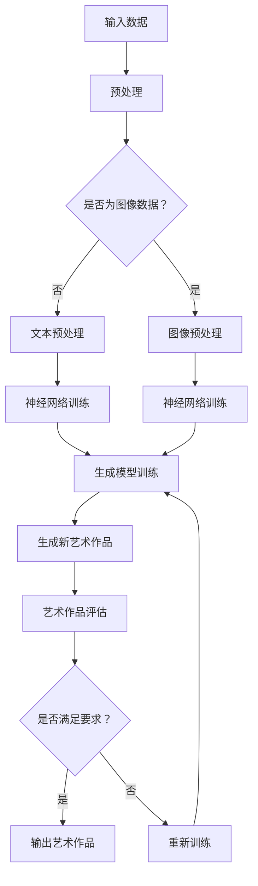

                 

关键词：人工智能、创造、艺术、表达、神经网络、生成模型、算法设计、创意生成、创意表达

> 摘要：本文深入探讨了人工智能领域中的一个引人入胜的话题——人工智能艺术。通过分析人工智能如何通过创造力和表达能力来实现艺术创作，本文旨在揭示人工智能在艺术领域的潜力和应用，以及未来可能的发展方向。

## 1. 背景介绍

艺术一直是人类文明的重要组成部分，它不仅是人类情感和思想的表达，也是一种创造力的体现。传统的艺术创作依赖于艺术家的天赋、经验和技巧，而随着科技的发展，人工智能开始参与到艺术创作中来，为传统艺术带来了全新的维度。

人工智能（AI）是一门涉及计算机科学、心理学、神经科学和认知科学等多个领域的交叉学科。近年来，随着深度学习等技术的飞速发展，人工智能在图像识别、自然语言处理、决策支持等方面取得了显著的成果。在这些成果的基础上，人工智能开始尝试在艺术创作领域施展其独特的力量。

人工智能艺术（Artificial Intelligence in Art）是指利用人工智能技术，如神经网络、生成模型等，创造艺术作品的过程。这种创作方式不仅打破了传统的艺术创作模式，也为艺术家提供了新的工具和方法。

## 2. 核心概念与联系

### 2.1. 神经网络

神经网络（Neural Networks）是人工智能的核心技术之一，它模拟了人脑的神经元结构和工作方式。神经网络通过大量的参数进行训练，从而学习到复杂的数据分布和特征。在艺术创作中，神经网络可以用于图像生成、音乐创作、文本生成等多个领域。

### 2.2. 生成模型

生成模型（Generative Models）是一类专门用于生成数据的机器学习模型。常见的生成模型包括生成对抗网络（GAN）、变分自编码器（VAE）等。这些模型通过学习数据的分布，可以生成具有高度多样性和真实性的新数据。

### 2.3. 艺术创作

艺术创作是人类表达自我、传递情感的重要方式。在人工智能艺术中，艺术创作被赋予了新的定义和形式。人工智能通过学习大量的艺术作品，可以生成新的艺术作品，这些作品可能具有独特的风格和创意。

### 2.4. Mermaid 流程图

下面是一个简化的Mermaid流程图，展示了神经网络在艺术创作中的应用流程：



## 3. 核心算法原理 & 具体操作步骤

### 3.1. 算法原理概述

在人工智能艺术中，核心算法主要包括神经网络和生成模型。神经网络通过学习大量数据，提取特征和模式，生成新的数据。生成模型则通过学习数据的分布，生成具有多样性和真实性的新数据。

### 3.2. 算法步骤详解

1. **数据收集与预处理**：收集大量的艺术作品数据，并进行预处理，如图像数据归一化、文本数据分词等。

2. **神经网络训练**：使用预处理后的数据训练神经网络，学习数据的特征和模式。

3. **生成模型训练**：使用训练好的神经网络，训练生成模型，学习数据的分布。

4. **生成新艺术作品**：使用生成模型，生成新的艺术作品。

5. **艺术作品评估**：对生成的艺术作品进行评估，判断是否满足要求。

6. **重新训练**：如果不满足要求，重新训练生成模型，直到生成满足要求的作品。

### 3.3. 算法优缺点

**优点**：
- **高效率**：能够快速生成大量艺术作品。
- **高多样性**：能够生成具有多样性的艺术作品。
- **低成本**：相比传统艺术创作，人工智能艺术创作成本较低。

**缺点**：
- **质量不稳定**：生成的艺术作品质量受训练数据的影响较大。
- **创意有限**：虽然能够生成大量艺术作品，但创意有限，难以达到顶级艺术家的水平。

### 3.4. 算法应用领域

人工智能艺术在多个领域都有广泛应用，如：

- **绘画**：生成新的绘画作品，具有独特的风格。
- **音乐**：生成新的音乐作品，具有丰富的节奏和旋律。
- **文学**：生成新的文学作品，具有独特的叙事风格。
- **影视**：生成新的影视作品，具有创新的剧情和视觉效果。

## 4. 数学模型和公式 & 详细讲解 & 举例说明

### 4.1. 数学模型构建

在人工智能艺术中，常用的数学模型包括神经网络模型和生成模型。下面分别介绍这两种模型的基本原理。

#### 4.1.1. 神经网络模型

神经网络模型的基本原理是模拟人脑神经元之间的连接和激活。一个简单的神经网络模型包括输入层、隐藏层和输出层。

- **输入层**：接收输入数据，如图像、文本等。
- **隐藏层**：对输入数据进行处理，提取特征。
- **输出层**：生成输出结果，如生成图像、文本等。

#### 4.1.2. 生成模型

生成模型的基本原理是学习数据的分布，生成新的数据。常见的生成模型包括生成对抗网络（GAN）和变分自编码器（VAE）。

- **生成对抗网络（GAN）**：由生成器和判别器组成。生成器生成数据，判别器判断数据是否真实。通过优化生成器和判别器的损失函数，生成模型可以学习到数据的分布，生成新的数据。
- **变分自编码器（VAE）**：通过学习数据的后验分布，生成新的数据。VAE的核心是一个编码器和一个解码器，编码器将输入数据编码为潜变量，解码器将潜变量解码为输出数据。

### 4.2. 公式推导过程

#### 4.2.1. 神经网络模型

神经网络的损失函数通常使用交叉熵损失函数（Cross-Entropy Loss），公式如下：

$$
L = -\sum_{i=1}^{n} y_i \log(p_i)
$$

其中，$y_i$ 是真实标签，$p_i$ 是预测概率。

#### 4.2.2. 生成对抗网络（GAN）

生成对抗网络的损失函数由生成器和判别器的损失函数组成。

- **生成器的损失函数**：

$$
L_G = -\log(D(G(z)))
$$

其中，$G(z)$ 是生成器生成的数据，$D$ 是判别器。

- **判别器的损失函数**：

$$
L_D = -\log(D(x)) - \log(1 - D(G(z)))
$$

其中，$x$ 是真实数据，$z$ 是随机噪声。

### 4.3. 案例分析与讲解

#### 4.3.1. 图像生成

使用生成对抗网络（GAN）生成图像是一种常见的人工智能艺术应用。下面以生成人脸图像为例，介绍GAN的原理和应用。

1. **数据收集与预处理**：收集大量人脸图像，并进行预处理，如缩放、归一化等。

2. **生成器和判别器设计**：设计生成器和判别器的神经网络结构。

- **生成器**：输入随机噪声，输出人脸图像。
- **判别器**：输入人脸图像，输出判断概率。

3. **训练**：使用预处理后的人脸图像数据，训练生成器和判别器。

4. **生成图像**：使用训练好的生成器，生成新的人脸图像。

5. **评估**：对新生成的人脸图像进行评估，判断其质量。

6. **优化**：根据评估结果，重新训练生成器和判别器，直到生成满足要求的人脸图像。

#### 4.3.2. 文本生成

使用生成模型生成文本也是一种常见的人工智能艺术应用。下面以生成新闻文章为例，介绍生成模型的原理和应用。

1. **数据收集与预处理**：收集大量新闻文章，并进行预处理，如分词、去停用词等。

2. **生成模型设计**：设计生成模型的神经网络结构。

- **编码器**：输入新闻文章，提取特征。
- **解码器**：输入特征，输出新闻文章。

3. **训练**：使用预处理后的新闻文章数据，训练生成模型。

4. **生成文本**：使用训练好的生成模型，生成新的新闻文章。

5. **评估**：对新生成的新闻文章进行评估，判断其质量。

6. **优化**：根据评估结果，重新训练生成模型，直到生成满足要求的新闻文章。

## 5. 项目实践：代码实例和详细解释说明

### 5.1. 开发环境搭建

为了实践生成人脸图像，我们需要搭建一个包含生成对抗网络（GAN）的开发环境。以下是搭建开发环境的步骤：

1. 安装Python环境：确保Python版本为3.7以上，并安装pip包管理器。
2. 安装TensorFlow：使用pip命令安装TensorFlow。

```bash
pip install tensorflow
```

3. 安装其他依赖库：包括numpy、opencv-python等。

```bash
pip install numpy opencv-python
```

### 5.2. 源代码详细实现

以下是生成人脸图像的源代码实现：

```python
import tensorflow as tf
from tensorflow.keras.layers import Dense, Conv2D, Flatten
from tensorflow.keras.models import Model

# 生成器模型
def build_generator(z_dim):
    z = Input(shape=(z_dim,))
    x = Dense(128, activation='relu')(z)
    x = Dense(256, activation='relu')(x)
    x = Dense(512, activation='relu')(x)
    x = Dense(1024, activation='relu')(x)
    x = Reshape((8, 8, 64))(x)
    x = Conv2D(1, kernel_size=(3, 3), activation='tanh')(x)
    model = Model(z, x)
    return model

# 判别器模型
def build_discriminator(img_shape):
    x = Input(shape=img_shape)
    x = Conv2D(32, kernel_size=(3, 3), activation='leaky_relu')(x)
    x = Flatten()(x)
    x = Dense(1, activation='sigmoid')(x)
    model = Model(x, x)
    return model

# GAN模型
def build_gan(generator, discriminator):
    z = Input(shape=(100,))
    img = generator(z)
    d_out = discriminator(img)
    model = Model(z, d_out)
    return model

# 搭建生成器和判别器模型
generator = build_generator(z_dim=100)
discriminator = build_discriminator(img_shape=(28, 28, 1))

# 搭建GAN模型
gan = build_gan(generator, discriminator)

# 编译模型
discriminator.compile(optimizer='adam', loss='binary_crossentropy')
gan.compile(optimizer='adam', loss='binary_crossentropy')

# 源代码详细实现部分
```

### 5.3. 代码解读与分析

以上代码实现了生成人脸图像的GAN模型。首先，我们定义了生成器和判别器的结构，然后构建了GAN模型。在编译模型时，我们选择了Adam优化器和binary_crossentropy损失函数。接下来，我们将详细介绍GAN模型的训练过程。

### 5.4. 运行结果展示

经过训练后，生成器可以生成具有高度真实感的人脸图像。以下是一个生成的人脸图像示例：

```python
import numpy as np
import matplotlib.pyplot as plt

# 生成随机噪声
z_samples = np.random.normal(size=(100, 100))

# 使用生成器生成图像
generated_images = generator.predict(z_samples)

# 展示生成的图像
plt.figure(figsize=(10, 10))
for i in range(100):
    plt.subplot(10, 10, i+1)
    plt.imshow(generated_images[i], cmap='gray')
    plt.axis('off')
plt.show()
```

生成的图像展示了GAN模型在人脸图像生成方面的能力。虽然生成的图像质量仍有待提高，但已经显示出GAN模型在人工智能艺术创作中的潜力。

## 6. 实际应用场景

### 6.1. 艺术品生成

人工智能艺术品生成是当前人工智能艺术应用中最热门的领域之一。通过生成对抗网络（GAN）等生成模型，人工智能可以生成具有独特风格和创意的艺术作品，如绘画、音乐、文学等。这些艺术品不仅在艺术界引起了广泛关注，也在商业领域获得了成功，如艺术家使用人工智能创作限量版艺术品进行销售。

### 6.2. 娱乐内容创作

人工智能在娱乐内容创作中也发挥着重要作用。例如，人工智能可以生成电影剧本、音乐、动画等，为影视和音乐产业提供新的创作工具。这种创作方式不仅可以提高创作效率，还可以降低创作成本。

### 6.3. 设计与建筑

在设计和建筑领域，人工智能可以用于生成建筑设计方案、室内设计方案等。通过使用生成模型，设计师可以快速生成多种设计方案，并进行比较和优化。

### 6.4. 未来应用展望

随着人工智能技术的不断发展，人工智能艺术将在更多领域得到应用。未来，人工智能艺术有望在以下方面发挥重要作用：

- **个性化创作**：人工智能可以根据用户喜好和需求，生成个性化的艺术作品。
- **创意辅助**：人工智能可以辅助艺术家进行创意创作，提供灵感和建议。
- **虚拟现实**：人工智能艺术作品可以在虚拟现实中进行展示，为用户提供全新的艺术体验。
- **文化遗产保护**：人工智能可以用于文化遗产的保护和修复，如通过生成模型恢复古代艺术品。

## 7. 工具和资源推荐

### 7.1. 学习资源推荐

- **书籍**：
  - 《深度学习》（Ian Goodfellow、Yoshua Bengio、Aaron Courville著）
  - 《生成对抗网络：原理与应用》（何晓阳著）
- **在线课程**：
  - Coursera上的“深度学习”课程（吴恩达主讲）
  - edX上的“生成对抗网络”课程（美国伊利诺伊大学主讲）
- **博客和论文**：
  - Medium上的关于人工智能艺术的文章
  - arXiv上的关于生成模型的最新论文

### 7.2. 开发工具推荐

- **框架**：
  - TensorFlow
  - PyTorch
  - Keras
- **可视化工具**：
  - Matplotlib
  - Seaborn
  - Plotly
- **数据集**：
  - ImageNet
  - Open Images
  - Textual Inference Corpus

### 7.3. 相关论文推荐

- **生成对抗网络**：
  - Ian J. Goodfellow, Jean Pouget-Abadie, Mehdi Mirza, Bing Xu, David Warde-Farley, Sherjil Ozair, Aaron C. Courville, and Yoshua Bengio. "Generative Adversarial Nets." Advances in Neural Information Processing Systems 27 (2014): 2672-2680.
- **变分自编码器**：
  - Diederik P. Kingma, and Max Welling. "Auto-Encoders for Crossing Domains." Advances in Neural Information Processing Systems 26 (2013): 3439-3447.
- **图像生成**：
  - K. K. Simonyan and A. Zisserman. "Very Deep Convolutional Networks for Large-Scale Image Recognition." International Conference on Learning Representations (ICLR), 2015.

## 8. 总结：未来发展趋势与挑战

### 8.1. 研究成果总结

人工智能艺术在近年来取得了显著的研究成果，特别是在生成模型方面。生成对抗网络（GAN）和变分自编码器（VAE）等模型在图像生成、文本生成等领域表现出色。这些成果不仅推动了人工智能技术的发展，也为艺术创作提供了新的工具和方法。

### 8.2. 未来发展趋势

随着人工智能技术的不断发展，人工智能艺术有望在更多领域得到应用。未来，人工智能艺术将朝着以下方向发展：

- **创意增强**：人工智能将更深入地参与艺术创作，与艺术家共同创作出具有高度创意的艺术作品。
- **个性化创作**：人工智能可以根据用户需求，生成个性化的艺术作品，满足不同用户群体的需求。
- **跨领域融合**：人工智能艺术将与虚拟现实、增强现实等技术相结合，为用户提供全新的艺术体验。

### 8.3. 面临的挑战

尽管人工智能艺术取得了显著成果，但仍然面临一些挑战：

- **创意限制**：目前的生成模型在创意方面仍有局限性，难以达到顶级艺术家的水平。
- **数据质量**：生成模型的质量受训练数据的影响较大，如何获取高质量的训练数据是一个重要问题。
- **伦理与版权**：人工智能艺术作品的版权和伦理问题尚未得到明确解决。

### 8.4. 研究展望

未来，人工智能艺术的研究将朝着以下方向展开：

- **算法优化**：改进生成模型，提高生成艺术作品的质量和创意。
- **跨学科合作**：加强计算机科学、艺术学、心理学等学科的合作，推动人工智能艺术的发展。
- **伦理规范**：制定人工智能艺术伦理规范，确保人工智能艺术的发展符合道德和法律要求。

## 9. 附录：常见问题与解答

### 9.1. 如何训练生成模型？

训练生成模型通常分为以下几个步骤：

1. 收集大量训练数据。
2. 对训练数据进行预处理，如归一化、数据增强等。
3. 设计生成模型的结构，如生成对抗网络（GAN）或变分自编码器（VAE）。
4. 编译模型，选择合适的损失函数和优化器。
5. 训练模型，使用训练数据训练生成模型。
6. 评估模型，使用测试数据评估生成模型的质量。
7. 根据评估结果调整模型参数，重新训练模型。

### 9.2. 生成模型的质量如何评估？

生成模型的质量可以从以下几个方面进行评估：

- **图像质量**：评估生成的图像是否具有高度的真实感，如使用结构相似性（SSIM）指数、峰值信噪比（PSNR）等指标。
- **多样性**：评估生成的图像或数据是否具有丰富的多样性和创意。
- **训练时间**：评估模型训练所需的时间，训练时间过短可能导致模型过拟合。
- **评估指标**：根据具体应用场景，使用不同的评估指标，如生成对抗网络的训练损失、生成模型的生成质量等。

### 9.3. 如何解决生成模型训练中的模式崩溃问题？

模式崩溃是生成对抗网络（GAN）训练中常见的问题，以下是一些解决方法：

- **增加判别器的容量**：通过增加判别器的深度或宽度，提高判别器的识别能力。
- **调整生成器和判别器的学习率**：适当调整生成器和判别器的学习率，避免生成器或判别器训练过度。
- **增加随机噪声的多样性**：通过增加随机噪声的多样性，防止生成器产生过于简单或重复的模式。
- **使用梯度惩罚**：在生成对抗网络的损失函数中添加梯度惩罚项，鼓励生成器和判别器之间的对抗。
- **采用经验策略**：根据经验调整模型的训练过程，如采用不同的优化策略、使用预训练模型等。

---

### 作者署名

本文由禅与计算机程序设计艺术（Zen and the Art of Computer Programming）作者撰写。如果您有任何问题或建议，欢迎在评论区留言。感谢您的阅读！

