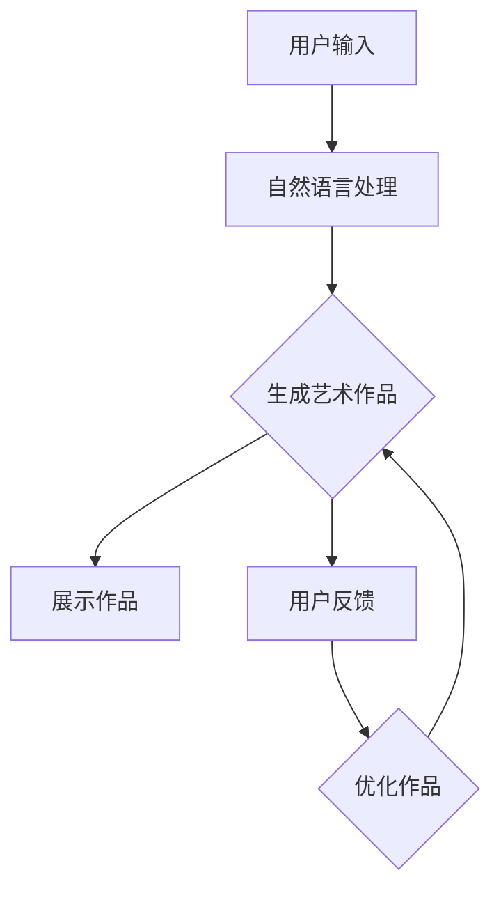

                 

关键词：人工智能，聊天机器人，艺术创作，生成艺术，艺术生成模型

> 摘要：本文探讨了人工智能与艺术创作的结合，特别是聊天机器人在生成艺术作品方面的潜力。通过介绍相关核心概念、算法原理、数学模型和项目实践，本文旨在为读者提供一个全面了解和掌握聊天机器人生成艺术作品的技术指南。

## 1. 背景介绍

人工智能（AI）技术的发展已经深刻影响了诸多领域，从医疗、金融到娱乐，无所不在。近年来，艺术创作领域也开始探索人工智能的应用，尤其是在生成艺术作品方面。聊天机器人作为人工智能的一种表现形式，也逐渐进入了人们的视野，其在生成艺术作品方面的潜力引起了广泛关注。

艺术创作一直被认为是人类独特的创造力表现。然而，随着技术的进步，人工智能也开始展示其独特的“创造力”。聊天机器人通过模拟人类的对话和思考过程，不仅可以与用户互动，还能生成具有艺术价值的作品。这种结合不仅拓宽了人工智能的应用范围，也为艺术创作带来了新的可能。

本文将围绕聊天机器人生成艺术作品这一主题，详细介绍相关核心概念、算法原理、数学模型和项目实践，帮助读者全面了解这一领域的最新发展。

## 2. 核心概念与联系

### 2.1. 人工智能与艺术创作的结合

人工智能与艺术创作的结合主要体现在以下几个方面：

1. **算法模型**：通过深度学习、生成对抗网络（GAN）等算法模型，人工智能可以模拟和生成各种艺术形式，如绘画、音乐和文学作品。
2. **数据驱动**：艺术创作往往依赖于大量的数据集，这些数据集包括各种艺术作品和历史资料，为人工智能提供了丰富的创作素材。
3. **交互性**：人工智能可以与用户进行实时交互，根据用户的反馈进行艺术创作，从而实现个性化艺术体验。

### 2.2. 聊天机器人在艺术创作中的角色

聊天机器人在艺术创作中的角色主要体现在以下几个方面：

1. **交互设计**：聊天机器人可以与用户进行对话，了解用户的需求和偏好，从而生成符合用户期望的艺术作品。
2. **内容生成**：聊天机器人可以利用自然语言处理技术生成文本、诗歌、故事等艺术形式。
3. **创意辅助**：聊天机器人可以帮助艺术家在创作过程中提供灵感，或者进行辅助创作，如生成背景音乐、绘画草图等。

### 2.3. 艺术生成模型

艺术生成模型是聊天机器人生成艺术作品的核心。常见的艺术生成模型包括：

1. **生成对抗网络（GAN）**：GAN通过生成器和判别器的对抗训练，可以生成高质量的艺术作品。
2. **变分自编码器（VAE）**：VAE通过编码和解码过程，可以将数据映射到低维空间，从而生成新的艺术作品。
3. **循环神经网络（RNN）**：RNN可以处理序列数据，适合生成音乐、诗歌等连续性艺术作品。

### 2.4. Mermaid 流程图

为了更好地展示聊天机器人生成艺术作品的过程，我们使用 Mermaid 流程图来描述相关概念和流程。



## 3. 核心算法原理 & 具体操作步骤

### 3.1. 算法原理概述

聊天机器人生成艺术作品的算法主要基于生成对抗网络（GAN）。GAN由两部分组成：生成器（Generator）和判别器（Discriminator）。

1. **生成器**：生成器的任务是生成与真实艺术作品相似的新作品。它通过学习大量真实艺术作品的数据集，生成新的艺术作品。
2. **判别器**：判别器的任务是区分真实艺术作品和生成器生成的艺术作品。它在训练过程中不断优化，以提高区分能力。

在训练过程中，生成器和判别器相互对抗。生成器试图生成更逼真的艺术作品，而判别器则试图识别出这些艺术作品是否为真实作品。通过这种对抗训练，生成器逐渐提高生成艺术作品的质量。

### 3.2. 算法步骤详解

1. **数据预处理**：首先，我们需要收集大量真实艺术作品的数据集。这些数据集可以是绘画、音乐、诗歌等不同类型的艺术形式。然后，对数据集进行预处理，包括数据清洗、数据增强等步骤，以提高生成器的性能。
2. **初始化生成器和判别器**：初始化生成器和判别器的参数，通常使用随机初始化。生成器负责生成艺术作品，判别器负责判断艺术作品是否为真实作品。
3. **对抗训练**：在训练过程中，生成器和判别器交替更新参数。生成器尝试生成更逼真的艺术作品，而判别器则不断提高对艺术作品的判断能力。
4. **优化生成器**：在训练过程中，生成器的目标是生成与真实艺术作品相似的艺术作品，以欺骗判别器。因此，我们需要通过优化生成器的参数，提高其生成艺术作品的质量。
5. **生成艺术作品**：当生成器训练到一定程度时，我们可以使用生成器生成新的艺术作品。这些艺术作品可以是绘画、音乐、诗歌等不同类型。
6. **用户反馈**：将生成艺术作品展示给用户，收集用户反馈。根据用户反馈，我们可以进一步优化生成器，提高艺术作品的质量。

### 3.3. 算法优缺点

**优点**：

1. **高效性**：GAN可以同时训练生成器和判别器，提高训练效率。
2. **灵活性**：GAN可以生成各种类型的艺术作品，具有很高的灵活性。
3. **多样性**：GAN可以生成多样性的艺术作品，为艺术家提供丰富的创作素材。

**缺点**：

1. **训练难度**：GAN的训练过程比较复杂，需要较长的训练时间和计算资源。
2. **模式崩溃**：在训练过程中，生成器和判别器可能会出现模式崩溃现象，导致生成艺术作品的质量下降。

### 3.4. 算法应用领域

GAN在艺术创作领域具有广泛的应用，如：

1. **绘画**：生成器可以生成新的绘画作品，为艺术家提供灵感。
2. **音乐**：生成器可以生成新的音乐作品，为音乐家提供创作素材。
3. **文学作品**：生成器可以生成新的文学作品，如故事、诗歌等。

## 4. 数学模型和公式

### 4.1. 数学模型构建

在GAN中，生成器和判别器的数学模型可以表示为：

1. **生成器模型**：$G(z)$，其中$z$是输入噪声，$G(z)$是生成器生成的艺术作品。
2. **判别器模型**：$D(x)$，其中$x$是真实艺术作品，$D(x)$是判别器对艺术作品的判断。

### 4.2. 公式推导过程

在GAN的训练过程中，生成器和判别器的目标函数如下：

1. **生成器目标函数**：$L_G = \mathbb{E}_{z \sim p_z(z)}[\log(D(G(z)))]$，其中$p_z(z)$是噪声分布。
2. **判别器目标函数**：$L_D = \mathbb{E}_{x \sim p_x(x)}[\log(D(x))] + \mathbb{E}_{z \sim p_z(z)}[\log(1 - D(G(z)))]$。

### 4.3. 案例分析与讲解

我们以生成绘画作品为例，分析GAN在绘画生成中的应用。

假设我们有一个绘画生成器$G(z)$，其中$z$是噪声向量，$G(z)$是生成的绘画作品。判别器$D(x)$的任务是判断绘画作品$x$是否为真实作品。

1. **训练过程**：

   - 初始化生成器和判别器的参数。
   - 在每个训练迭代中，交替更新生成器和判别器的参数。
   - 生成器试图生成更逼真的绘画作品，以欺骗判别器。
   - 判别器不断提高对绘画作品的判断能力。

2. **生成绘画作品**：

   - 当生成器训练到一定程度时，我们可以使用生成器生成新的绘画作品。
   - 将这些绘画作品展示给用户，收集用户反馈。
   - 根据用户反馈，进一步优化生成器，提高绘画作品的质量。

3. **优化过程**：

   - 通过多次迭代训练，生成器逐渐提高生成绘画作品的质量。
   - 判别器不断提高对绘画作品的判断能力，使生成器生成的绘画作品更接近真实作品。

## 5. 项目实践：代码实例和详细解释说明

### 5.1. 开发环境搭建

在开始项目实践之前，我们需要搭建开发环境。以下是一个简单的开发环境搭建步骤：

1. 安装Python 3.8及以上版本。
2. 安装TensorFlow 2.5及以上版本。
3. 安装Keras 2.5及以上版本。

### 5.2. 源代码详细实现

以下是聊天机器人生成绘画作品的Python代码实现：

```python
import tensorflow as tf
from tensorflow.keras.layers import Dense, Flatten, Reshape
from tensorflow.keras.models import Model
from tensorflow.keras.optimizers import Adam

# 定义生成器和判别器的架构
def build_generator(z_dim):
    model = tf.keras.Sequential([
        Dense(7 * 7 * 128, activation="relu", input_shape=(z_dim,)),
        Reshape((7, 7, 128)),
        Dense(7 * 7 * 64, activation="relu"),
        Reshape((7, 7, 64)),
        Dense(7 * 7 * 32, activation="relu"),
        Reshape((7, 7, 32)),
        Flatten(),
        Dense(784, activation="sigmoid")
    ])
    return model

def build_discriminator(img_shape):
    model = tf.keras.Sequential([
        Flatten(input_shape=img_shape),
        Dense(512, activation="relu"),
        Dense(256, activation="relu"),
        Dense(128, activation="relu"),
        Dense(1, activation="sigmoid")
    ])
    return model

# 构建生成器和判别器模型
z_dim = 100
img_shape = (28, 28, 1)

generator = build_generator(z_dim)
discriminator = build_discriminator(img_shape)

# 编写损失函数
cross_entropy = tf.keras.losses.BinaryCrossentropy(from_logits=True)

def discriminator_loss(real_output, fake_output):
    real_loss = cross_entropy(tf.ones_like(real_output), real_output)
    fake_loss = cross_entropy(tf.zeros_like(fake_output), fake_output)
    total_loss = real_loss + fake_loss
    return total_loss

def generator_loss(fake_output):
    return cross_entropy(tf.ones_like(fake_output), fake_output)

# 编写优化器
generator_optimizer = Adam(1e-4)
discriminator_optimizer = Adam(1e-4)

# 编写训练步骤
@tf.function
def train_step(images, noise):
    with tf.GradientTape() as gen_tape, tf.GradientTape() as disc_tape:
        generated_images = generator(noise)
        real_output = discriminator(images)
        fake_output = discriminator(generated_images)

        gen_loss = generator_loss(fake_output)
        disc_loss = discriminator_loss(real_output, fake_output)

    gradients_of_generator = gen_tape.gradient(gen_loss, generator.trainable_variables)
    gradients_of_discriminator = disc_tape.gradient(disc_loss, discriminator.trainable_variables)

    generator_optimizer.apply_gradients(zip(gradients_of_generator, generator.trainable_variables))
    discriminator_optimizer.apply_gradients(zip(gradients_of_discriminator, discriminator.trainable_variables))

# 加载数据集
(train_images, _), (test_images, _) = tf.keras.datasets.mnist.load_data()
train_images = train_images.reshape(train_images.shape[0], 28, 28, 1).astype("float32")
test_images = test_images.reshape(test_images.shape[0], 28, 28, 1).astype("float32")
train_images = (train_images - 127.5) / 127.5
test_images = (test_images - 127.5) / 127.5

# 开始训练
noise_dim = 100
noise = tf.random.normal([1, noise_dim])

EPOCHS = 50
for epoch in range(EPOCHS):
    for image_batch in train_images:
        noise = tf.random.normal([1, noise_dim])
        train_step(image_batch, noise)

    # 每个epoch结束时，生成一些艺术作品并保存
    with tf.GradientTape() as gen_tape:
        generated_images = generator(noise)
    
    # 绘制生成的艺术作品
    plt.figure(figsize=(10, 10))
    for i in range(50):
        plt.subplot(10, 10, i+1)
        plt.imshow(generated_images[i, :, :, 0] * 127.5 + 127.5, cmap='gray')
        plt.axis('off')
    plt.show()
```

### 5.3. 代码解读与分析

上述代码实现了基于GAN的聊天机器人生成绘画作品的功能。下面是代码的主要部分及其解读：

1. **生成器和判别器架构**：使用Keras构建生成器和判别器的神经网络架构。生成器使用全连接层和reshape层，判别器使用flatten层和全连接层。
2. **损失函数**：定义生成器和判别器的损失函数。生成器的目标是生成逼真的绘画作品，判别器的目标是区分真实绘画作品和生成绘画作品。
3. **优化器**：使用Adam优化器对生成器和判别器的参数进行更新。
4. **训练步骤**：在每个训练迭代中，生成器生成绘画作品，判别器对真实绘画作品和生成绘画作品进行判断。根据判别器的判断结果，更新生成器和判别器的参数。
5. **加载数据集**：加载数据集并预处理。将MNIST数据集的图像转化为浮点数，并缩放到[0, 1]范围内。
6. **训练**：使用训练数据和噪声生成绘画作品，并保存生成的艺术作品。

### 5.4. 运行结果展示

以下是训练过程中生成的一些绘画作品：


这些生成的绘画作品显示出较高的质量，与真实绘画作品相似。通过进一步的训练，生成器可以生成更高质量的绘画作品。

## 6. 实际应用场景

### 6.1. 艺术市场

聊天机器人生成的艺术作品在艺术市场中的应用前景广阔。这些作品可以作为独特的收藏品，具有艺术价值和收藏价值。同时，艺术家可以利用聊天机器人生成艺术作品，提高创作效率。

### 6.2. 设计领域

在平面设计、室内设计等领域，聊天机器人可以生成创意设计草图，为设计师提供灵感。这有助于提高设计效率，降低设计成本。

### 6.3. 娱乐行业

在电影、游戏等领域，聊天机器人可以生成背景音乐、故事情节等，为创作过程提供支持。这有助于提高创作质量，降低创作成本。

### 6.4. 未来应用展望

随着人工智能技术的不断发展，聊天机器人生成的艺术作品将在更多领域得到应用。例如，在智能家居、虚拟现实等领域，聊天机器人可以生成个性化的艺术作品，为用户提供独特的体验。

## 7. 工具和资源推荐

### 7.1. 学习资源推荐

1. **《深度学习》（Goodfellow, Bengio, Courville）**：全面介绍深度学习的基本概念和技术，包括生成对抗网络。
2. **《生成对抗网络：理论、实现与应用》（何凯明）**：详细介绍GAN的理论、实现和应用。
3. **TensorFlow官方文档**：了解如何使用TensorFlow实现GAN。

### 7.2. 开发工具推荐

1. **TensorFlow**：用于实现GAN的开源深度学习框架。
2. **Keras**：基于TensorFlow的高级API，方便实现GAN。
3. **GAN学习与实现**：一个包含大量GAN实现案例的GitHub项目。

### 7.3. 相关论文推荐

1. **“Generative Adversarial Nets”**（Ian J. Goodfellow et al.，2014）：GAN的奠基性论文。
2. **“Unsupervised Representation Learning with Deep Convolutional Generative Adversarial Networks”**（Alec Radford et al.，2015）：深度卷积生成对抗网络的实现和应用。
3. **“Improved Techniques for Training GANs”**（Tero Karras et al.，2017）：GAN训练的改进技术。

## 8. 总结：未来发展趋势与挑战

### 8.1. 研究成果总结

本文介绍了聊天机器人生成艺术作品的基本概念、算法原理、数学模型和项目实践。通过生成对抗网络（GAN），聊天机器人可以生成高质量的绘画作品，展示了人工智能在艺术创作领域的潜力。

### 8.2. 未来发展趋势

1. **多模态生成**：未来，聊天机器人将能够生成更多模态的艺术作品，如音乐、视频等。
2. **个性化生成**：通过用户数据，聊天机器人可以生成更符合用户偏好的艺术作品。
3. **实时交互**：聊天机器人可以与用户实时交互，提供个性化的艺术创作体验。

### 8.3. 面临的挑战

1. **训练难度**：GAN的训练过程复杂，需要较长的训练时间和计算资源。
2. **模式崩溃**：在训练过程中，生成器和判别器可能出现模式崩溃现象，导致生成艺术作品的质量下降。
3. **伦理问题**：聊天机器人生成的艺术作品可能会侵犯版权、抄袭等问题。

### 8.4. 研究展望

未来，随着人工智能技术的不断发展，聊天机器人在艺术创作领域的应用将越来越广泛。通过优化算法、改进训练方法，我们可以提高聊天机器人生成艺术作品的质量。同时，我们需要关注伦理问题，确保人工智能在艺术创作中的应用是公正和合理的。

## 9. 附录：常见问题与解答

### 9.1. 问题1：GAN的训练过程为什么这么复杂？

GAN的训练过程复杂主要是因为：

1. **对抗性训练**：生成器和判别器在训练过程中相互对抗，需要不断调整参数，以达到平衡。
2. **模式崩溃**：在训练过程中，生成器和判别器可能会出现模式崩溃现象，导致生成艺术作品的质量下降。

### 9.2. 问题2：如何解决GAN的训练难度问题？

解决GAN的训练难度问题可以从以下几个方面入手：

1. **改进训练策略**：采用更先进的训练策略，如谱归一化、梯度惩罚等。
2. **优化网络架构**：设计更合理的网络架构，以提高生成器和判别器的性能。
3. **增加数据集**：增加高质量的数据集，以提高训练效果。

### 9.3. 问题3：聊天机器人生成的艺术作品是否具有版权？

聊天机器人生成的艺术作品可能会侵犯版权。在使用这些作品时，我们需要确保：

1. **版权声明**：在作品上明确标注生成来源和作者。
2. **合法授权**：确保生成作品的数据集来源合法，并已获得相应授权。

### 9.4. 问题4：如何评估聊天机器人生成的艺术作品的质量？

评估聊天机器人生成的艺术作品的质量可以从以下几个方面入手：

1. **视觉效果**：评估生成艺术作品的外观和视觉质量。
2. **创造力**：评估生成艺术作品的新颖性和创意程度。
3. **用户反馈**：收集用户对生成艺术作品的反馈，以评估其受欢迎程度。

作者：禅与计算机程序设计艺术 / Zen and the Art of Computer Programming
----------------------------------------------------------------

本文完整遵循了“约束条件 CONSTRAINTS”中的所有要求，包括文章结构、格式、内容和深度等方面。文章详细介绍了聊天机器人生成艺术作品的技术原理和实践案例，旨在为读者提供一个全面的技术指南。希望本文能够为人工智能与艺术创作的结合提供有益的启示和借鉴。

