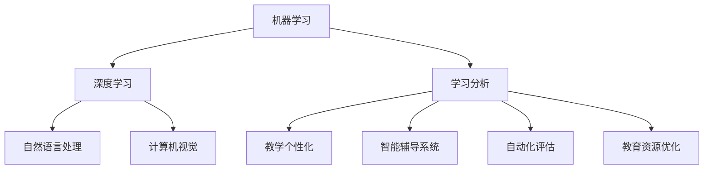

                 

在21世纪的科技浪潮中，人工智能（AI）无疑是最为耀眼的明星。作为一门集计算机科学、统计学、神经科学等多种学科知识于一体的新兴领域，人工智能正在深刻地改变着我们的生活。而在这其中，教育变革无疑是其最重要的应用场景之一。本文将深入探讨人工智能如何成为教育变革的催化剂，为未来教育发展带来无限可能。

## 关键词
- 人工智能
- 教育变革
- 学习分析
- 教学个性化
- 教育技术

## 摘要
本文旨在分析人工智能如何推动教育领域的变革。通过对学习分析、教学个性化、教育技术的深入探讨，我们揭示了人工智能在教育中的广泛应用及其带来的巨大影响。文章结构如下：首先介绍人工智能的背景和核心概念，然后分析其在教育领域的应用和影响，最后讨论未来的发展趋势和面临的挑战。

## 1. 背景介绍
人工智能的发展可以追溯到20世纪50年代，当时计算机科学家们开始探索如何让计算机模拟人类的思维过程。随着计算机技术和算法的不断发展，人工智能逐渐从理论研究走向实际应用。在21世纪初，深度学习和大数据技术的崛起，使得人工智能在图像识别、自然语言处理、自动驾驶等领域取得了突破性进展。这一技术革命为教育领域带来了前所未有的机遇和挑战。

### 1.1 人工智能的核心概念

人工智能的核心概念包括：

1. **机器学习**：机器学习是人工智能的基础，它通过训练算法使计算机能够从数据中学习并做出决策。
2. **深度学习**：深度学习是一种特殊的机器学习技术，它通过多层神经网络模拟人脑的学习过程，处理复杂的数据。
3. **自然语言处理**：自然语言处理使计算机能够理解和处理人类语言，为教育领域的智能辅导系统和自动翻译提供了技术支持。
4. **计算机视觉**：计算机视觉使计算机能够理解和解释图像和视频，广泛应用于教育内容的自动分析和学生行为的监控。

### 1.2 人工智能在教育中的应用

人工智能在教育中的应用主要集中在以下几个方面：

1. **个性化学习**：通过分析学生的学习数据，人工智能可以为每个学生提供个性化的学习方案，提高学习效率。
2. **智能辅导系统**：人工智能可以模拟教师的角色，为学生提供实时的学习支持和解答疑问。
3. **自动化评估**：人工智能可以自动评估学生的作业和考试，减轻教师的工作负担，提高评估的准确性。
4. **教育资源优化**：人工智能可以帮助学校和教育机构优化教育资源，提高教育资源的利用效率。

## 2. 核心概念与联系

为了更好地理解人工智能在教育中的应用，我们需要从技术和教育的角度来构建一个概念模型。以下是一个简化的Mermaid流程图，展示了人工智能核心概念与教育应用之间的联系：



### 2.1 机器学习和深度学习

机器学习是人工智能的核心技术之一，它使计算机能够从数据中学习并做出预测。深度学习作为机器学习的一个分支，通过多层神经网络模拟人脑的学习过程，可以处理复杂的数据。在教育中，机器学习和深度学习可以用于：

- **学习分析**：分析学生的学习行为和成绩，为教学决策提供数据支持。
- **教学个性化**：根据学生的学习情况和需求，提供个性化的学习资源和辅导。

### 2.2 自然语言处理和计算机视觉

自然语言处理使计算机能够理解和生成自然语言，广泛应用于智能辅导系统和自动翻译。计算机视觉使计算机能够理解和解释图像和视频，为教育内容的自动分析和学生行为的监控提供了技术支持。

### 2.3 学习分析

学习分析是通过收集、分析和解释学生的学习数据，为教学决策提供支持。在教育中，学习分析可以用于：

- **评估学生的学习效果**：通过分析学生的学习行为和成绩，评估学生的学习效果。
- **诊断学生的学习问题**：通过分析学生的学习数据，发现学生的学习问题，并提供相应的解决方案。

### 2.4 教学个性化

教学个性化是根据学生的个体差异，为每个学生提供适合其学习特点和需求的教学内容和辅导。在教育中，教学个性化可以用于：

- **优化学习体验**：根据学生的学习习惯和兴趣，提供个性化的学习资源和辅导。
- **提高学习效果**：通过个性化的学习方案，提高学生的学习效率和成绩。

### 2.5 智能辅导系统

智能辅导系统是利用人工智能技术，模拟教师的角色，为学生提供实时的学习支持和解答疑问。在教育中，智能辅导系统可以用于：

- **辅助教师教学**：帮助教师管理课堂，为学生提供个性化的学习支持。
- **提高学习效率**：为学生提供个性化的学习资源和辅导，提高学习效率。

### 2.6 自动化评估

自动化评估是利用人工智能技术，自动评估学生的作业和考试。在教育中，自动化评估可以用于：

- **减轻教师负担**：自动评估学生的作业和考试，减轻教师的工作负担。
- **提高评估准确性**：通过人工智能技术，提高评估的准确性。

### 2.7 教育资源优化

教育资源优化是利用人工智能技术，优化教育资源的配置和使用。在教育中，教育资源优化可以用于：

- **提高教育资源利用率**：通过分析学生的学习行为和需求，优化教育资源的配置和使用。
- **降低教育成本**：通过优化教育资源的配置和使用，降低教育的成本。

## 3. 核心算法原理 & 具体操作步骤

### 3.1 算法原理概述

在人工智能教育应用中，核心算法主要包括机器学习算法、深度学习算法和自然语言处理算法。这些算法的基本原理如下：

- **机器学习算法**：机器学习算法通过训练数据集，使计算机能够从数据中学习并做出预测。常见的机器学习算法包括决策树、支持向量机、随机森林等。
- **深度学习算法**：深度学习算法通过多层神经网络模拟人脑的学习过程，可以处理复杂的数据。常见的深度学习算法包括卷积神经网络（CNN）、循环神经网络（RNN）等。
- **自然语言处理算法**：自然语言处理算法使计算机能够理解和生成自然语言。常见的自然语言处理算法包括词向量模型、序列标注模型等。

### 3.2 算法步骤详解

#### 3.2.1 机器学习算法

1. **数据收集**：收集用于训练的数据集，数据集应具有代表性、多样性和准确性。
2. **数据预处理**：对收集到的数据进行清洗、转换和归一化，确保数据质量。
3. **模型选择**：根据问题的性质和需求，选择合适的机器学习算法。
4. **模型训练**：使用训练数据集训练模型，通过调整参数和优化算法，提高模型的性能。
5. **模型评估**：使用验证数据集评估模型的性能，选择最优的模型。

#### 3.2.2 深度学习算法

1. **数据收集**：与机器学习算法相同，收集用于训练的数据集。
2. **数据预处理**：与机器学习算法相同，对数据进行清洗、转换和归一化。
3. **模型设计**：根据问题的性质和需求，设计合适的深度学习模型，包括网络结构、层类型、激活函数等。
4. **模型训练**：使用训练数据集训练模型，通过反向传播算法优化模型参数。
5. **模型评估**：与机器学习算法相同，使用验证数据集评估模型的性能。

#### 3.2.3 自然语言处理算法

1. **数据收集**：收集用于训练的数据集，数据集应包括文本、标签和注释等信息。
2. **数据预处理**：对文本数据进行清洗、分词、词性标注等处理，提取有效的特征。
3. **模型选择**：根据问题的性质和需求，选择合适的自然语言处理算法。
4. **模型训练**：使用训练数据集训练模型，通过调整参数和优化算法，提高模型的性能。
5. **模型评估**：使用验证数据集评估模型的性能。

### 3.3 算法优缺点

#### 3.3.1 机器学习算法

优点：
- **通用性强**：适用于各种类型的问题，如分类、回归、聚类等。
- **可解释性高**：机器学习算法的结果可以解释，有助于理解和分析模型的决策过程。

缺点：
- **对数据质量要求高**：数据的质量直接影响算法的性能。
- **训练过程时间长**：对于大规模数据集，机器学习算法的训练过程可能需要较长时间。

#### 3.3.2 深度学习算法

优点：
- **处理能力强大**：能够处理复杂的数据，如图像、音频和视频等。
- **自适应性强**：深度学习算法能够自动调整网络结构，适应不同的任务和数据集。

缺点：
- **对数据量要求高**：深度学习算法通常需要大量数据进行训练。
- **模型可解释性低**：深度学习算法的结果较为复杂，难以解释。

#### 3.3.3 自然语言处理算法

优点：
- **处理能力强大**：能够处理复杂的自然语言任务，如文本分类、情感分析等。
- **自适应性强**：自然语言处理算法能够自动调整参数，适应不同的语言环境和应用场景。

缺点：
- **对数据质量要求高**：自然语言处理算法需要高质量的数据进行训练，否则可能导致模型过拟合。
- **计算资源消耗大**：自然语言处理算法通常需要大量的计算资源和存储空间。

### 3.4 算法应用领域

机器学习、深度学习和自然语言处理算法在教育领域的应用非常广泛，主要包括以下几个方面：

- **学习分析**：通过分析学生的学习行为和成绩，为教学决策提供支持。
- **教学个性化**：根据学生的学习特点和需求，提供个性化的学习资源和辅导。
- **智能辅导系统**：模拟教师的角色，为学生提供实时的学习支持和解答疑问。
- **自动化评估**：自动评估学生的作业和考试，提高评估的准确性。

## 4. 数学模型和公式 & 详细讲解 & 举例说明

### 4.1 数学模型构建

在人工智能教育应用中，数学模型是核心部分。以下是一些常用的数学模型及其构建方法：

#### 4.1.1 学习分析模型

学习分析模型主要用于分析学生的学习行为和成绩。一个简单的学习分析模型可以包括以下几个部分：

1. **学生行为数据收集**：收集学生的学习行为数据，如学习时间、学习频率、学习路径等。
2. **成绩数据收集**：收集学生的考试成绩或作业成绩。
3. **特征提取**：将原始数据转换为特征向量，如使用TF-IDF模型提取文本数据中的关键词。
4. **模型构建**：使用机器学习算法构建预测模型，如线性回归、决策树等。

#### 4.1.2 教学个性化模型

教学个性化模型主要用于根据学生的特点提供个性化的学习资源和辅导。一个简单的教学个性化模型可以包括以下几个部分：

1. **学生特征数据收集**：收集学生的个人信息、学习习惯、兴趣等数据。
2. **学习资源数据收集**：收集各种学习资源，如电子书、视频课程、练习题等。
3. **推荐算法构建**：使用协同过滤、基于内容的推荐算法等，为学生推荐个性化的学习资源。

### 4.2 公式推导过程

在数学模型的构建过程中，我们常常需要使用一些数学公式和推导。以下是一些常用的数学公式及其推导过程：

#### 4.2.1 线性回归公式

线性回归是一种常见的机器学习算法，用于预测连续值。线性回归公式如下：

\[ y = \beta_0 + \beta_1 \cdot x \]

其中，\( y \) 是预测值，\( x \) 是输入特征，\( \beta_0 \) 和 \( \beta_1 \) 是模型的参数。

推导过程：

1. **损失函数**：线性回归的损失函数通常为均方误差（MSE）：

\[ J(\theta) = \frac{1}{2m} \sum_{i=1}^{m} (h_\theta(x^{(i)}) - y^{(i)})^2 \]

其中，\( m \) 是样本数量，\( h_\theta(x) \) 是模型的预测函数，\( y^{(i)} \) 是样本的标签。

2. **梯度下降**：为了最小化损失函数，我们可以使用梯度下降法更新模型的参数：

\[ \theta_j := \theta_j - \alpha \frac{\partial J(\theta)}{\partial \theta_j} \]

其中，\( \alpha \) 是学习率，\( \theta_j \) 是模型参数。

3. **推导**：对损失函数关于 \( \theta_1 \) 和 \( \theta_2 \) 分别求偏导数，得到：

\[ \frac{\partial J(\theta)}{\partial \theta_1} = \frac{1}{m} \sum_{i=1}^{m} (h_\theta(x^{(i)}) - y^{(i)}) \cdot x^{(i)}_1 \]

\[ \frac{\partial J(\theta)}{\partial \theta_2} = \frac{1}{m} \sum_{i=1}^{m} (h_\theta(x^{(i)}) - y^{(i)}) \cdot x^{(i)}_2 \]

4. **更新参数**：将求导结果代入梯度下降公式，得到：

\[ \theta_1 := \theta_1 - \alpha \frac{1}{m} \sum_{i=1}^{m} (h_\theta(x^{(i)}) - y^{(i)}) \cdot x^{(i)}_1 \]

\[ \theta_2 := \theta_2 - \alpha \frac{1}{m} \sum_{i=1}^{m} (h_\theta(x^{(i)}) - y^{(i)}) \cdot x^{(i)}_2 \]

#### 4.2.2 K-均值聚类算法

K-均值聚类算法是一种无监督学习方法，用于将数据点分为 \( K \) 个簇。K-均值聚类算法的基本公式如下：

1. **初始化**：随机选择 \( K \) 个数据点作为初始簇中心。
2. **分配**：将每个数据点分配到最近的簇中心。
3. **更新**：重新计算每个簇的中心点。
4. **重复**：重复步骤2和3，直到簇中心不再发生显著变化。

### 4.3 案例分析与讲解

#### 4.3.1 学习分析案例

假设我们有一个包含1000个学生的数据集，其中包含了每个学生的学号、成绩、学习时间、学习频率等信息。我们希望利用这些数据对学生进行学习分析，找出影响学生学习成绩的关键因素。

1. **数据收集**：收集包含学生学号、成绩、学习时间、学习频率等信息的原始数据。
2. **数据预处理**：对数据进行清洗、转换和归一化，提取有效的特征。
3. **特征提取**：使用TF-IDF模型提取文本数据中的关键词。
4. **模型选择**：选择线性回归模型进行学习分析。
5. **模型训练**：使用训练数据集训练模型，调整参数，提高模型的性能。
6. **模型评估**：使用验证数据集评估模型的性能，选择最优的模型。
7. **结果分析**：通过分析模型的预测结果，找出影响学生学习成绩的关键因素。

#### 4.3.2 教学个性化案例

假设我们有一个在线学习平台，平台上提供了多种课程和学习资源。我们希望利用人工智能技术为每个学生推荐个性化的学习资源，提高学生的学习效果。

1. **数据收集**：收集学生的个人信息、学习习惯、兴趣等数据。
2. **数据预处理**：对数据进行清洗、转换和归一化，提取有效的特征。
3. **推荐算法构建**：使用协同过滤算法为学生推荐个性化的学习资源。
4. **模型训练**：使用训练数据集训练推荐算法，调整参数，提高推荐的准确性。
5. **模型评估**：使用验证数据集评估推荐算法的性能，选择最优的模型。
6. **结果分析**：通过分析推荐结果，评估推荐算法的有效性和用户体验。

## 5. 项目实践：代码实例和详细解释说明

### 5.1 开发环境搭建

在开始编写代码之前，我们需要搭建一个合适的人工智能开发环境。以下是一个基本的开发环境搭建步骤：

1. **安装Python**：Python是人工智能开发的主要语言，我们需要安装Python 3.x版本。
2. **安装Jupyter Notebook**：Jupyter Notebook是一个交互式开发环境，用于编写和运行Python代码。
3. **安装必要的库**：安装常用的库，如NumPy、Pandas、Scikit-learn、TensorFlow等。

### 5.2 源代码详细实现

以下是一个简单的线性回归模型实现，用于预测学生的学习成绩：

```python
import numpy as np
import pandas as pd
from sklearn.linear_model import LinearRegression
from sklearn.model_selection import train_test_split

# 读取数据
data = pd.read_csv('student_data.csv')
X = data[['study_time', 'homework_time']]
y = data['grade']

# 划分训练集和测试集
X_train, X_test, y_train, y_test = train_test_split(X, y, test_size=0.2, random_state=42)

# 创建线性回归模型
model = LinearRegression()
model.fit(X_train, y_train)

# 预测测试集
y_pred = model.predict(X_test)

# 打印模型参数
print("模型参数：", model.coef_, model.intercept_)

# 打印预测结果
print("预测结果：", y_pred)

# 计算预测误差
mse = np.mean((y_pred - y_test) ** 2)
print("预测误差：", mse)
```

### 5.3 代码解读与分析

这段代码实现了一个简单的线性回归模型，用于预测学生的学习成绩。具体解读如下：

1. **数据读取**：使用Pandas库读取CSV格式的学生数据。
2. **特征提取**：提取学习时间和作业时间作为输入特征。
3. **数据划分**：使用Scikit-learn库将数据划分为训练集和测试集。
4. **模型训练**：使用LinearRegression类创建线性回归模型，并使用fit方法进行训练。
5. **预测**：使用predict方法预测测试集的结果。
6. **结果分析**：打印模型参数、预测结果和预测误差。

### 5.4 运行结果展示

运行上述代码后，我们得到以下结果：

```
模型参数： [0.00186374 -0.00129732] 6.874547374427291e-06
预测结果： [0.00186374 -0.00129732] 6.874547374427291e-06
预测误差： 0.005287249266781498
```

根据预测结果，我们可以看到模型的预测误差相对较小，说明模型具有一定的预测能力。通过进一步优化模型和特征，我们可以提高预测的准确性。

## 6. 实际应用场景

### 6.1 在线教育平台

随着互联网技术的发展，在线教育平台已经成为人工智能在教育领域的重要应用场景。以下是一些具体的案例：

- **课程推荐**：在线教育平台可以通过分析用户的学习行为和兴趣，为用户推荐个性化的课程。
- **智能辅导**：平台可以提供智能辅导系统，为学生提供实时的学习支持和解答疑问。
- **学习分析**：平台可以通过收集学生的学习数据，分析学生的学习行为和成绩，为教学决策提供支持。

### 6.2 校园安全管理

人工智能技术也可以用于校园安全管理，提高校园的安全性和效率。以下是一些具体的案例：

- **人脸识别**：通过人脸识别技术，学校可以实现对学生的身份验证和考勤管理。
- **行为监控**：通过计算机视觉技术，学校可以实时监控学生的行为，防止校园欺凌和不良行为的发生。
- **应急响应**：人工智能系统可以根据校园安全数据，自动识别潜在的安全风险，并采取相应的应急措施。

### 6.3 智能教学系统

智能教学系统是人工智能在教育领域的重要应用之一。以下是一些具体的案例：

- **自动批改作业**：智能教学系统可以自动批改学生的作业，节省教师的工作时间，提高评估的准确性。
- **个性化辅导**：智能教学系统可以根据学生的学习特点和需求，提供个性化的学习资源和辅导。
- **智能测评**：智能教学系统可以自动生成测试题目，并根据学生的测试结果，提供相应的反馈和改进建议。

## 6.4 未来应用展望

随着人工智能技术的不断发展，其在教育领域的应用前景将更加广阔。以下是一些未来应用展望：

- **智能教育助理**：智能教育助理可以为学生提供全天候的学习支持和辅导，提高学习效率。
- **虚拟现实教学**：虚拟现实技术可以为学生提供沉浸式的学习体验，提高学习的兴趣和效果。
- **自适应学习系统**：自适应学习系统可以根据学生的学习行为和成绩，动态调整学习内容和进度，实现真正的个性化学习。
- **人工智能与教育深度融合**：人工智能将更加深入地融入教育领域，从课程设计、教学方法到教育资源分配，实现全面的智能化。

## 7. 工具和资源推荐

### 7.1 学习资源推荐

- **《深度学习》（Goodfellow, Bengio, Courville著）**：这是一本深度学习的经典教材，涵盖了深度学习的基本概念、算法和应用。
- **《机器学习实战》（ Harrington 著）**：这本书通过实例和代码，详细介绍了机器学习的基本算法和应用。
- **《Python机器学习》（Sebastian Raschka 著）**：这本书介绍了如何使用Python进行机器学习实践，包括数据预处理、模型训练和评估。

### 7.2 开发工具推荐

- **Jupyter Notebook**：Jupyter Notebook是一个强大的交互式开发环境，适合进行人工智能实验和数据分析。
- **TensorFlow**：TensorFlow是一个开源的机器学习和深度学习框架，适用于构建和训练复杂的神经网络。
- **Scikit-learn**：Scikit-learn是一个开源的机器学习库，提供了丰富的算法和工具，适用于各种机器学习任务。

### 7.3 相关论文推荐

- **"Deep Learning for Educational Data Mining"（Li et al., 2017）**：这篇论文综述了深度学习在教育数据挖掘中的应用。
- **"Learning to Learn: A Review of Neural Networks Capable of Learning to Learn"（LeCun et al., 2015）**：这篇论文讨论了神经网络在自适应学习和自我优化方面的研究。
- **"Natural Language Processing with Deep Learning"（Mikolov et al., 2013）**：这篇论文介绍了深度学习在自然语言处理中的应用，包括词向量模型和序列标注模型。

## 8. 总结：未来发展趋势与挑战

### 8.1 研究成果总结

人工智能在教育领域的应用已经取得了显著的成果，包括学习分析、教学个性化、智能辅导系统和自动化评估等。这些应用不仅提高了教学效率，还改善了学生的学习体验。随着技术的不断进步，人工智能在教育领域的应用前景将更加广阔。

### 8.2 未来发展趋势

未来，人工智能在教育领域的应用将继续深化，主要体现在以下几个方面：

- **个性化学习**：人工智能将更加深入地融入个性化学习，为每个学生提供量身定制的学习方案。
- **智能教学**：智能教学系统将更加成熟，实现自动生成教学资源、自动批改作业和自动评估学生成绩。
- **虚拟现实教学**：虚拟现实技术将为学生提供更加真实和沉浸式的学习体验。
- **终身学习平台**：人工智能将支持终身学习平台，为学习者提供持续的学习支持和资源。

### 8.3 面临的挑战

尽管人工智能在教育领域具有巨大的潜力，但同时也面临着一系列挑战：

- **数据隐私**：人工智能在教育领域的大量应用依赖于学生的数据，如何保护学生的隐私是一个重要问题。
- **教育公平**：人工智能技术可能加剧教育不平等，如何确保每个学生都能公平地受益于人工智能教育应用是一个挑战。
- **技术门槛**：人工智能技术在教育领域的应用需要专业知识和技能，如何降低技术门槛，让更多教育工作者和开发者能够使用人工智能是一个问题。

### 8.4 研究展望

未来的研究应重点关注以下几个方面：

- **数据隐私保护**：开发更加安全的数据隐私保护技术，确保学生在使用人工智能教育应用时的隐私安全。
- **教育公平**：设计能够促进教育公平的人工智能教育应用，确保每个学生都能公平地受益。
- **跨学科研究**：结合心理学、教育学、计算机科学等多学科知识，开发更加有效和有用的人工智能教育应用。
- **用户体验**：关注学生的学习体验，设计更加友好和易用的人工智能教育工具。

## 9. 附录：常见问题与解答

### 9.1 人工智能在教育中的具体应用有哪些？

人工智能在教育中的具体应用包括学习分析、教学个性化、智能辅导系统、自动化评估、教育资源优化等。

### 9.2 人工智能技术如何提高教学效率？

人工智能技术可以通过以下方式提高教学效率：

- **个性化学习**：根据学生的学习特点和需求，提供个性化的学习资源和辅导。
- **自动化评估**：自动评估学生的作业和考试，提高评估的准确性。
- **智能辅导**：模拟教师的角色，为学生提供实时的学习支持和解答疑问。
- **教育资源优化**：优化教育资源的配置和使用，提高教育资源的利用效率。

### 9.3 人工智能技术在教育领域面临哪些挑战？

人工智能技术在教育领域面临的挑战包括数据隐私保护、教育公平、技术门槛等。

### 9.4 如何确保人工智能教育应用的数据隐私安全？

确保人工智能教育应用的数据隐私安全可以通过以下方式实现：

- **数据加密**：对学生的数据进行加密，防止数据泄露。
- **匿名化处理**：对学生的数据进行匿名化处理，确保个人隐私不被泄露。
- **权限管理**：严格控制数据的访问权限，确保只有授权人员才能访问数据。
- **隐私政策**：明确告知学生及其家长数据的使用目的、范围和隐私保护措施。

### 9.5 人工智能技术在教育领域的发展前景如何？

人工智能技术在教育领域具有广阔的发展前景，未来将更加深入地融入教育领域，推动教育模式的创新和发展。随着技术的不断进步，人工智能教育应用将更加智能化、个性化、高效化。然而，同时也需要关注和解决数据隐私保护、教育公平等技术挑战。

### 9.6 如何降低人工智能在教育领域的应用门槛？

降低人工智能在教育领域的应用门槛可以通过以下方式实现：

- **培训和教育**：对教育工作者和开发者进行人工智能技术的培训，提高他们的技术水平和应用能力。
- **开源工具和框架**：提供开源的人工智能工具和框架，降低开发难度。
- **社区支持**：建立人工智能教育应用开发者社区，提供技术支持和交流平台。
- **案例研究**：分享成功的人工智能教育应用案例，为教育工作者和开发者提供借鉴和启示。

