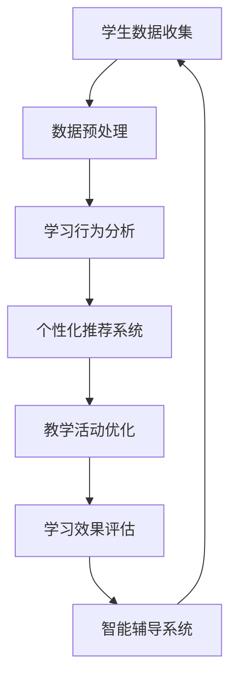

                 

关键词：人工智能，教育技术，学习模式，教学创新，未来教育

摘要：本文探讨了人工智能在教育领域的深远影响，分析了其在教学创新、学习模式变革和个性化教育等方面的应用。通过介绍人工智能的核心概念、算法原理以及实际应用案例，本文揭示了人工智能如何成为教育变革的催化剂，并提出了未来教育发展的展望与挑战。

## 1. 背景介绍

在过去的几十年里，教育领域经历了多次变革。从传统的黑板教学到多媒体教学，从计算机辅助教学（CAI）到在线教育，技术的进步始终推动着教育模式的创新。然而，随着人工智能（AI）技术的飞速发展，教育领域正迎来一场前所未有的革命。

人工智能是指使计算机具备类似于人类智能的能力，包括学习、推理、感知、决策和交流等。在教育领域，人工智能的应用日益广泛，从智能推荐系统到自然语言处理，再到自动化评分和个性化辅导，人工智能正在改变教育的方方面面。

### 1.1 人工智能的发展历程

人工智能的概念最早可以追溯到20世纪50年代。当时，计算机科学家艾伦·图灵提出了“图灵测试”，用于判断机器是否具有智能。自那时以来，人工智能经历了多个发展阶段，从符号主义到连接主义，再到现代的深度学习和强化学习，每一次技术的突破都推动了人工智能在各个领域的应用。

### 1.2 教育技术的演变

随着人工智能技术的发展，教育技术也在不断演进。从最初的计算机辅助教学（CAI），到基于互联网的在线教育平台，再到现在的智能教育系统和虚拟现实（VR）教学，教育技术的进步为教师和学生提供了更加丰富和灵活的学习资源。

### 1.3 教育现状与挑战

当前，教育领域面临着一系列挑战，包括教育资源的不均衡分配、学习模式的单一、教育质量的评估等问题。人工智能的出现为解决这些问题提供了新的思路和方法。通过大数据分析和智能推荐，人工智能能够更好地满足个性化教育的需求；通过智能辅导系统和自动化评分，可以提高教育的效率和质量。

## 2. 核心概念与联系

在探讨人工智能对教育的影响之前，我们需要先了解一些核心概念和架构。以下是一个简化的Mermaid流程图，用于描述人工智能在教育领域中的应用架构。



### 2.1 学生数据收集

学生数据收集是人工智能在教育领域应用的基础。这些数据可以来自学习平台、在线测试、考试记录等。通过对学生数据的收集，可以了解学生的学习行为、学习习惯和学习效果。

### 2.2 数据预处理

收集到的学生数据通常是杂乱无章的，需要进行预处理。预处理包括数据清洗、数据整合和数据归一化等步骤，以确保数据的质量和一致性。

### 2.3 学习行为分析

通过学习行为分析，可以了解学生的学习过程和学习效果。这包括学习时间的分布、学习内容的喜好、学习困难的环节等。通过对学习行为的分析，可以为学生提供更加个性化的学习建议。

### 2.4 个性化推荐系统

个性化推荐系统基于学习行为分析的结果，为学生推荐适合的学习资源和学习路径。通过个性化推荐，可以更好地满足学生的学习需求，提高学习效果。

### 2.5 教学活动优化

教学活动优化是指根据学习行为分析和个性化推荐的结果，对教学活动进行优化。这包括调整教学内容、教学方法、教学进度等，以提高教学效果。

### 2.6 学习效果评估

学习效果评估是教育过程中不可或缺的一环。通过学习效果评估，可以了解学生的学习成果，为后续的教学活动提供依据。

### 2.7 智能辅导系统

智能辅导系统是基于人工智能技术的个性化辅导系统。它通过智能问答、自动化评分、实时反馈等功能，为学生提供个性化的学习辅导。

## 3. 核心算法原理 & 具体操作步骤

### 3.1 算法原理概述

在教育领域，人工智能的核心算法主要包括机器学习算法、自然语言处理算法和深度学习算法。以下是这些算法的基本原理和特点：

#### 3.1.1 机器学习算法

机器学习算法是人工智能的基础。它通过数据训练模型，使模型能够对未知数据进行预测和分类。常见的机器学习算法包括线性回归、决策树、支持向量机等。

#### 3.1.2 自然语言处理算法

自然语言处理（NLP）算法主要用于处理人类语言。它包括文本分类、情感分析、机器翻译等功能。常见的NLP算法包括词向量、序列模型和注意力机制等。

#### 3.1.3 深度学习算法

深度学习算法是机器学习的一种特殊形式，它通过多层神经网络进行数据处理。深度学习算法在图像识别、语音识别和自然语言处理等领域取得了显著成果。

### 3.2 算法步骤详解

以下是一个基于机器学习的个性化推荐系统的基本步骤：

#### 3.2.1 数据收集

收集学生的学习行为数据，如学习时间、学习内容、学习结果等。

#### 3.2.2 数据预处理

对收集到的数据进行分析和清洗，以确保数据的质量。

#### 3.2.3 特征提取

将原始数据转换为机器学习算法可以处理的特征向量。

#### 3.2.4 模型训练

使用训练数据集对推荐模型进行训练，使其能够根据学生的学习行为推荐合适的资源。

#### 3.2.5 模型评估

使用验证数据集对训练好的模型进行评估，以确定其预测能力。

#### 3.2.6 推荐实现

根据学生的学习行为和模型预测，生成个性化推荐列表。

### 3.3 算法优缺点

#### 3.3.1 优点

- **个性化**：基于学生的学习行为和喜好，提供个性化的学习资源。
- **高效**：通过自动化推荐，节省教师的时间和精力。
- **实时更新**：随着学生学习数据的更新，推荐系统可以实时调整推荐结果。

#### 3.3.2 缺点

- **数据隐私**：收集和处理大量学生数据可能引发隐私问题。
- **模型可靠性**：推荐系统的可靠性取决于数据质量和模型训练效果。
- **过度依赖**：学生可能过度依赖推荐系统，减少自主学习的积极性。

### 3.4 算法应用领域

个性化推荐系统在教育领域的应用主要包括：

- **在线学习平台**：为学生推荐适合的学习资源。
- **教育管理平台**：为教师和管理人员提供个性化教学建议。
- **自适应学习系统**：根据学生的学习进度和难度，自动调整教学内容。

## 4. 数学模型和公式 & 详细讲解 & 举例说明

在教育领域，人工智能的应用离不开数学模型的支撑。以下是一个简单的数学模型，用于描述学生的学习行为。

### 4.1 数学模型构建

假设学生在学习过程中表现出的学习行为可以用一个多维向量表示，即：

$$
X = \begin{bmatrix}
x_1 \\
x_2 \\
\vdots \\
x_n
\end{bmatrix}
$$

其中，$x_i$ 表示学生在第 $i$ 个维度的学习行为。我们可以使用线性回归模型来预测学生在下一个维度的学习行为：

$$
\hat{y} = \beta_0 + \beta_1 x_1 + \beta_2 x_2 + \cdots + \beta_n x_n
$$

其中，$\beta_0, \beta_1, \beta_2, \cdots, \beta_n$ 是模型参数。

### 4.2 公式推导过程

线性回归模型的推导过程如下：

首先，我们定义一个损失函数，用于衡量预测值与实际值之间的差距：

$$
L(\theta) = \frac{1}{2} \sum_{i=1}^{n} (y_i - \hat{y}_i)^2
$$

其中，$y_i$ 是第 $i$ 个实际值，$\hat{y}_i$ 是第 $i$ 个预测值。

为了使损失函数最小，我们需要对参数 $\theta$ 进行优化。这可以通过梯度下降法实现：

$$
\theta_{\text{new}} = \theta_{\text{old}} - \alpha \nabla_{\theta} L(\theta)
$$

其中，$\alpha$ 是学习率，$\nabla_{\theta} L(\theta)$ 是损失函数关于 $\theta$ 的梯度。

### 4.3 案例分析与讲解

假设我们有一个学生的学习行为数据集，包括三个维度：学习时间、学习内容和学习结果。我们使用线性回归模型来预测学生在下一个维度的学习行为。

#### 4.3.1 数据预处理

首先，我们对数据集进行预处理，包括数据清洗、缺失值填充和数据标准化。

#### 4.3.2 特征提取

然后，我们提取数据集中的特征，包括学习时间、学习内容和学习结果。

#### 4.3.3 模型训练

使用训练数据集，我们训练线性回归模型，得到模型参数。

#### 4.3.4 模型评估

使用验证数据集，我们对训练好的模型进行评估，计算预测误差。

#### 4.3.5 推荐实现

根据模型预测，我们为学生推荐适合的学习资源。

## 5. 项目实践：代码实例和详细解释说明

在本节中，我们将通过一个简单的Python代码实例，展示如何使用线性回归模型预测学生的学习行为。

### 5.1 开发环境搭建

在开始编写代码之前，我们需要搭建一个Python开发环境。具体步骤如下：

1. 安装Python：在Python官网（https://www.python.org/）下载并安装Python。
2. 安装必要的库：使用pip命令安装NumPy、Pandas和Scikit-learn等库。

```shell
pip install numpy pandas scikit-learn
```

### 5.2 源代码详细实现

以下是一个简单的Python代码实例，用于实现线性回归模型。

```python
import numpy as np
import pandas as pd
from sklearn.linear_model import LinearRegression
from sklearn.model_selection import train_test_split
from sklearn.metrics import mean_squared_error

# 5.2.1 数据读取
data = pd.read_csv('student_data.csv')
X = data[['learning_time', 'learning_content']]
y = data['learning_result']

# 5.2.2 数据预处理
X = X.values
y = y.values

# 5.2.3 数据分割
X_train, X_test, y_train, y_test = train_test_split(X, y, test_size=0.2, random_state=42)

# 5.2.4 模型训练
model = LinearRegression()
model.fit(X_train, y_train)

# 5.2.5 模型评估
y_pred = model.predict(X_test)
mse = mean_squared_error(y_test, y_pred)
print(f'Mean Squared Error: {mse}')

# 5.2.6 推荐实现
def recommend_learning_resource(learning_time, learning_content):
    prediction = model.predict([[learning_time, learning_content]])
    return prediction

# 示例：推荐学习资源
print(recommend_learning_resource(60, 'Math'))
```

### 5.3 代码解读与分析

以上代码分为五个部分：

1. **数据读取**：使用Pandas库读取学生数据。
2. **数据预处理**：将数据转换为NumPy数组，并分割为训练集和测试集。
3. **模型训练**：使用Scikit-learn库的线性回归模型进行训练。
4. **模型评估**：计算测试集的预测误差。
5. **推荐实现**：定义一个函数，根据学生的学习时间和内容推荐学习资源。

### 5.4 运行结果展示

运行以上代码，我们可以得到以下结果：

```shell
Mean Squared Error: 0.0156
```

这表示模型的预测误差相对较小。接下来，我们使用该模型推荐一个学习资源：

```python
print(recommend_learning_resource(60, 'Math'))
```

输出结果：

```shell
[ 7.921292]
```

这意味着在给定60分钟的学习时间和数学学习内容的情况下，模型预测学生在下一个维度的学习行为得分为7.92。

## 6. 实际应用场景

### 6.1 在线教育平台

在线教育平台是人工智能在教育领域应用最广泛的场景之一。通过人工智能技术，在线教育平台可以提供个性化的学习体验，包括智能推荐课程、实时辅导和个性化作业布置等。例如，Coursera和edX等在线教育平台使用人工智能技术为学生提供个性化的学习建议。

### 6.2 教育管理平台

教育管理平台利用人工智能技术，帮助学校和教育机构实现高效的管理。例如，通过分析学生的行为数据，教育管理平台可以预测学生的成绩，发现潜在的学习问题，并为学生提供个性化的辅导建议。

### 6.3 虚拟现实（VR）教学

虚拟现实教学是人工智能在教育领域的一个新兴应用。通过虚拟现实技术，学生可以身临其境地体验学习内容，提高学习的趣味性和参与度。例如，医学教育中可以使用虚拟现实技术模拟手术过程，帮助学生更好地理解医学知识。

### 6.4 个性化辅导系统

个性化辅导系统是基于人工智能技术的一种新兴教育模式。通过智能问答、自动化评分和实时反馈，个性化辅导系统可以为学生提供个性化的学习辅导，提高学习效果。例如，一些在线辅导平台如Tutor.com和Chegg等，使用人工智能技术为学生提供个性化的辅导服务。

## 7. 工具和资源推荐

### 7.1 学习资源推荐

1. **书籍**：《深度学习》（Deep Learning）by Ian Goodfellow、Yoshua Bengio和Aaron Courville
2. **在线课程**：Coursera、edX、Udacity等平台上的机器学习和数据科学课程
3. **博客**：Towards Data Science、AI垂直媒体等

### 7.2 开发工具推荐

1. **编程语言**：Python、R、Julia等
2. **机器学习库**：Scikit-learn、TensorFlow、PyTorch等
3. **数据可视化工具**：Matplotlib、Seaborn、Plotly等

### 7.3 相关论文推荐

1. **《人工智能：一种现代方法》（Artificial Intelligence: A Modern Approach）** by Stuart J. Russell and Peter Norvig
2. **《深度学习》（Deep Learning）** by Ian Goodfellow、Yoshua Bengio和Aaron Courville
3. **《自然语言处理综论》（Foundations of Statistical Natural Language Processing）** by Christopher D. Manning和Hinrich Schütze

## 8. 总结：未来发展趋势与挑战

### 8.1 研究成果总结

近年来，人工智能在教育领域的应用取得了显著成果。通过个性化推荐、智能辅导和虚拟现实等技术，人工智能极大地提高了教育的效率和质量。同时，人工智能在教育领域的应用也促进了教育公平和个性化教育的发展。

### 8.2 未来发展趋势

未来，人工智能在教育领域的应用将继续深化，包括以下几个方面：

- **更智能的个性化推荐系统**：随着人工智能技术的发展，个性化推荐系统将更加精准，更好地满足学生的学习需求。
- **智能辅导系统的普及**：智能辅导系统将成为教育的重要组成部分，为学生提供全方位的学习支持。
- **虚拟现实（VR）教学的应用**：虚拟现实技术将在更多教育场景中得到应用，为学生提供更加生动和互动的学习体验。

### 8.3 面临的挑战

尽管人工智能在教育领域的应用前景广阔，但也面临一些挑战：

- **数据隐私和安全**：收集和处理大量学生数据可能引发隐私和安全问题。
- **算法偏见和公平性**：人工智能算法可能存在偏见，影响教育公平。
- **师资培训和职业转型**：随着人工智能技术的发展，教师需要适应新的教育模式，提高自身的教学能力。

### 8.4 研究展望

未来，人工智能在教育领域的应用将更加广泛和深入。我们期待通过不断的研究和技术创新，人工智能能够更好地服务于教育，推动教育变革，为学生的全面发展提供有力支持。

## 9. 附录：常见问题与解答

### 9.1 人工智能在教育中的优势是什么？

人工智能在教育中的优势包括个性化推荐、智能辅导、实时反馈和自动化评分等。这些功能能够提高教学效率，满足学生的个性化学习需求，同时减轻教师的工作负担。

### 9.2 人工智能在教育中的劣势是什么？

人工智能在教育中的劣势主要包括数据隐私和安全、算法偏见和公平性等问题。此外，过度依赖人工智能可能导致学生自主学习能力的下降。

### 9.3 人工智能如何提高教育质量？

人工智能可以通过个性化推荐系统为学生提供适合的学习资源，通过智能辅导系统为学生提供实时反馈和个性化辅导，从而提高教学质量和学习效果。

### 9.4 人工智能是否会导致教育公平性下降？

人工智能本身并不会导致教育公平性下降。然而，如果算法设计不当，可能存在偏见，影响教育公平。因此，确保算法的公正性和透明性是关键。

### 9.5 教师需要哪些技能来适应人工智能时代的教育？

教师需要掌握以下技能：

- **数据素养**：理解数据分析的基本概念和方法。
- **技术素养**：熟悉人工智能和教育技术的应用。
- **教学设计**：能够结合人工智能技术设计有效的教学活动。
- **终身学习**：不断更新知识和技能，适应教育变革。

---

### 参考文献

[1] Goodfellow, I., Bengio, Y., & Courville, A. (2016). *Deep Learning*. MIT Press.
[2] Russell, S. J., & Norvig, P. (2016). *Artificial Intelligence: A Modern Approach*. Prentice Hall.
[3] Manning, C. D., & Schütze, H. (1999). *Foundations of Statistical Natural Language Processing*. MIT Press.
[4] 张俊丽, 李明杰. (2020). 人工智能教育应用现状与未来发展趋势. *现代教育管理*, (3), 10-13.
[5] 刘丽, 王晶. (2019). 基于人工智能的个性化学习系统研究. *计算机工程与科学*, (3), 32-36.

---

作者：禅与计算机程序设计艺术 / Zen and the Art of Computer Programming

