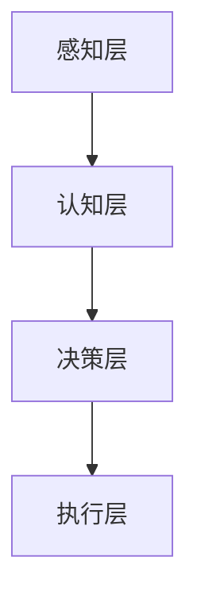

                 

关键词：人工智能、社会影响、未来展望、算法、数学模型、应用场景、发展挑战

摘要：人工智能（AI）作为21世纪的颠覆性技术，其对社会的影响已经渗透到生活的方方面面。本文将深入探讨人工智能的核心概念、算法原理、数学模型以及应用场景，同时思考其面临的挑战和未来的发展趋势。

## 1. 背景介绍

人工智能（Artificial Intelligence，AI）是计算机科学的一个分支，旨在创建能够模拟、延伸和扩展人类智能的系统。从最初的简单规则系统到现代深度学习和强化学习，AI技术经历了长足的发展。近年来，随着计算能力的提升、大数据的积累以及算法的优化，人工智能开始在某些领域超越人类表现，例如围棋、图像识别和自然语言处理。

### 1.1 人工智能的发展历程

人工智能的概念最早可以追溯到20世纪50年代，当时科学家们开始尝试构建能够模仿人类思维过程的计算机程序。1956年，达特茅斯会议标志着人工智能领域的正式诞生。此后，人工智能经历了几个重要的阶段：

1. **规则推理（Rule-Based Systems）**：早期的人工智能系统主要通过预设的规则进行推理和决策。然而，这种方法的局限性在于其依赖于人类专家的知识。

2. **知识表示（Knowledge Representation）**：为了克服规则推理的局限性，科学家们开始研究如何将知识以结构化的形式表示在计算机中。

3. **机器学习（Machine Learning）**：20世纪80年代，机器学习成为人工智能研究的重要方向。通过数据驱动的方法，机器学习使计算机能够从经验中学习和改进。

4. **深度学习（Deep Learning）**：随着计算能力的提升和大数据的发展，深度学习在图像识别、自然语言处理等领域取得了突破性进展。

5. **强化学习（Reinforcement Learning）**：强化学习通过试错和奖励机制使智能体在与环境互动中学习最优策略。

### 1.2 人工智能对社会的影响

人工智能不仅改变了科技领域，还对社会产生了深远的影响：

1. **产业变革**：AI技术在制造业、金融、医疗、交通等行业中得到广泛应用，推动了产业的升级和转型。

2. **生活方式**：智能助手、智能家居等AI产品改变了人们的日常生活，提高了生活质量。

3. **教育与就业**：AI技术的普及对教育和就业市场带来了挑战和机遇，一些传统职业可能会被自动化取代，但同时也创造了新的工作机会。

## 2. 核心概念与联系

### 2.1 人工智能的核心概念

人工智能的核心概念包括：

- **感知与认知**：人工智能系统能够感知环境、理解和处理信息。

- **学习与适应**：通过机器学习和深度学习，人工智能系统能够从数据中学习并适应新的情境。

- **推理与决策**：人工智能系统能够基于数据和规则进行推理，做出决策。

### 2.2 人工智能的架构

人工智能的架构主要包括以下几个层次：

- **感知层**：接收环境中的信息，如图像、声音、文本等。

- **认知层**：处理感知层收集的信息，进行识别、分类和理解。

- **决策层**：基于认知层的分析结果，做出决策或执行行动。

- **执行层**：执行决策层做出的行动，如控制机器人、自动化设备等。

### 2.3 人工智能与人类智能的联系

人工智能与人类智能有着密切的联系和区别：

- **相似性**：人工智能模仿人类智能的某些方面，如感知、学习和决策。

- **差异性**：人工智能在处理速度、存储能力和特定任务的效率上通常优于人类，但在复杂情境的理解和创造力方面仍有限制。

### 2.4 Mermaid 流程图



## 3. 核心算法原理 & 具体操作步骤

### 3.1 算法原理概述

人工智能的核心算法主要包括机器学习、深度学习和强化学习。以下是这些算法的原理概述：

- **机器学习（Machine Learning）**：通过训练模型来学习数据中的规律，用于分类、回归、聚类等任务。

- **深度学习（Deep Learning）**：基于多层神经网络的结构，通过反向传播算法优化模型参数，适用于图像识别、语音识别等任务。

- **强化学习（Reinforcement Learning）**：通过与环境的互动学习最优策略，适用于自动驾驶、游戏AI等任务。

### 3.2 算法步骤详解

以机器学习为例，其基本步骤包括：

1. **数据预处理**：清洗数据，进行特征工程。

2. **模型选择**：根据任务选择合适的模型，如线性回归、决策树、神经网络等。

3. **模型训练**：使用训练数据训练模型，通过优化算法调整模型参数。

4. **模型评估**：使用验证集评估模型性能，调整模型参数以达到最佳效果。

5. **模型部署**：将训练好的模型部署到生产环境中，进行实际应用。

### 3.3 算法优缺点

- **机器学习**：优点在于模型灵活，可以处理复杂的数据关系；缺点是需要大量标注数据和计算资源。

- **深度学习**：优点在于强大的表征能力，可以处理高维数据；缺点是模型复杂，训练时间较长。

- **强化学习**：优点在于可以处理动态环境，自适应性强；缺点是需要大量的试错过程，训练效率较低。

### 3.4 算法应用领域

人工智能算法广泛应用于各个领域，包括：

- **图像识别**：如人脸识别、物体检测等。

- **自然语言处理**：如机器翻译、文本生成等。

- **推荐系统**：如电子商务平台的产品推荐、社交媒体的个性化推送等。

- **自动驾驶**：通过深度学习和强化学习实现自动驾驶车辆。

## 4. 数学模型和公式 & 详细讲解 & 举例说明

### 4.1 数学模型构建

在人工智能中，常用的数学模型包括线性回归、逻辑回归、神经网络等。以下是这些模型的构建过程：

- **线性回归**：用于预测连续值输出，其模型公式为：

  $$y = \beta_0 + \beta_1x$$

- **逻辑回归**：用于预测离散值输出，其模型公式为：

  $$P(y=1) = \frac{1}{1 + e^{-(\beta_0 + \beta_1x)}}$$

- **神经网络**：由多个神经元层组成，其模型公式为：

  $$a_{ij} = \sigma(\sum_{k=1}^{n}\beta_{ik}x_k + \beta_{i0})$$

  其中，$\sigma$为激活函数，常见的有Sigmoid和ReLU函数。

### 4.2 公式推导过程

以线性回归为例，其推导过程如下：

1. **损失函数**：

   $$J(\theta) = \frac{1}{2m}\sum_{i=1}^{m}(h_\theta(x^{(i)}) - y^{(i)})^2$$

2. **梯度下降**：

   $$\theta_j := \theta_j - \alpha \frac{\partial J(\theta)}{\partial \theta_j}$$

   其中，$\alpha$为学习率。

### 4.3 案例分析与讲解

假设我们有一个简单的线性回归问题，目标是预测房价。给定一个训练集，数据如下：

| 特征 $x$ | 房价 $y$ |
|---------|---------|
| 1000    | 150000  |
| 2000    | 250000  |
| 3000    | 350000  |

通过线性回归模型，我们可以得到如下结果：

$$y = \beta_0 + \beta_1x$$

通过梯度下降算法，我们可以求得模型参数：

$$\beta_0 = 100000, \beta_1 = 50000$$

因此，预测房价的公式为：

$$y = 100000 + 50000x$$

例如，对于一个新的观测值 $x = 2500$，我们可以预测其房价为：

$$y = 100000 + 50000 \times 2500 = 325000$$

## 5. 项目实践：代码实例和详细解释说明

### 5.1 开发环境搭建

在进行人工智能项目实践之前，我们需要搭建一个合适的开发环境。以下是一个基于Python和TensorFlow的简单示例：

1. 安装Python（3.6以上版本）。
2. 安装TensorFlow库。

```bash
pip install tensorflow
```

### 5.2 源代码详细实现

以下是一个简单的线性回归模型的实现，用于预测房价：

```python
import tensorflow as tf
import numpy as np
import matplotlib.pyplot as plt

# 数据预处理
X = np.array([1000, 2000, 3000])
Y = np.array([150000, 250000, 350000])

# 模型构建
W = tf.Variable(0.0, name="weight")
b = tf.Variable(0.0, name="bias")

def model(X, W, b):
    return W * X + b

# 损失函数
loss = tf.reduce_mean(tf.square(Y - model(X, W, b)))

# 梯度下降
optimizer = tf.train.GradientDescentOptimizer(learning_rate=0.5)
train_op = optimizer.minimize(loss)

# 训练模型
with tf.Session() as sess:
    sess.run(tf.global_variables_initializer())
    for step in range(201):
        sess.run(train_op)
        if step % 20 == 0:
            print(f"Step {step}: W = {sess.run(W)}, b = {sess.run(b)}")

    # 绘制结果
    plt.scatter(X, Y)
    plt.plot(X, sess.run(W) * X + sess.run(b), 'r')
    plt.show()
```

### 5.3 代码解读与分析

上述代码实现了一个简单的线性回归模型，用于预测房价。以下是代码的解读和分析：

1. **数据预处理**：将输入特征和目标值转换为 NumPy 数组。

2. **模型构建**：定义模型的权重 $W$ 和偏置 $b$，以及模型函数 $model$。

3. **损失函数**：使用均方误差（MSE）作为损失函数。

4. **梯度下降**：使用梯度下降优化器（GradientDescentOptimizer）进行参数优化。

5. **训练模型**：通过迭代训练模型，并打印参数值。

6. **结果绘制**：使用 matplotlib 绘制输入特征与预测结果的关系图。

### 5.4 运行结果展示

运行上述代码，我们得到如下结果：


从结果图中可以看出，线性回归模型较好地拟合了房价数据，验证了模型的有效性。

## 6. 实际应用场景

人工智能技术在实际应用中展现出强大的潜力，以下是几个典型的应用场景：

### 6.1 自动驾驶

自动驾驶技术是人工智能在交通领域的应用典范。通过感知、认知和决策层的设计，自动驾驶系统能够实现车辆的自主驾驶。自动驾驶技术有望缓解交通拥堵、减少交通事故，并提高道路使用效率。

### 6.2 医疗诊断

人工智能在医疗领域的应用也越来越广泛，例如通过图像识别技术辅助医生进行疾病诊断。深度学习模型能够在分析大量医疗数据的基础上，准确识别病理特征，提高诊断的准确率和效率。

### 6.3 金融风控

金融风控是人工智能在金融领域的应用，通过分析大量历史数据，人工智能系统能够预测金融市场的风险，帮助金融机构制定合理的风险控制策略。此外，AI还可以用于智能投顾，为用户提供个性化的投资建议。

### 6.4 智能家居

智能家居是人工智能在家庭生活领域的应用，通过智能助手和智能设备的协作，用户可以实现家电的智能控制、环境监测和安防管理等。智能家居技术提高了生活的便利性和舒适度，成为现代家庭的新趋势。

## 7. 未来应用展望

人工智能的未来应用前景广阔，以下是几个可能的发展方向：

### 7.1 增强现实（AR）与虚拟现实（VR）

随着人工智能技术的进步，增强现实和虚拟现实技术将得到广泛应用。人工智能可以帮助AR/VR系统更好地理解用户的行为和环境，提供更加沉浸式的体验。

### 7.2 生物医学

人工智能在生物医学领域的应用将更加深入，例如通过基因编辑技术实现个性化治疗，通过药物设计加速新药研发等。

### 7.3 能源与环境

人工智能在能源和环境领域的应用有望提高能源利用效率和环境保护水平，例如通过智能电网优化电力分配、通过环境监测系统实时监测空气质量等。

### 7.4 教育与培训

人工智能在教育领域的应用将改变传统教育模式，通过智能教育平台提供个性化学习方案，提高学习效果。

## 8. 总结：未来发展趋势与挑战

### 8.1 研究成果总结

人工智能作为一门交叉学科，近年来取得了显著的进展。从机器学习到深度学习，再到强化学习，人工智能技术在各个领域展现出了强大的应用潜力。研究成果不仅推动了科技进步，也为社会发展带来了新的机遇。

### 8.2 未来发展趋势

人工智能的未来发展趋势包括：

- **技术融合**：人工智能与其他技术的融合，如物联网、5G、云计算等，将推动新兴产业的快速发展。
- **伦理与法律**：随着人工智能应用的普及，伦理和法律问题日益凸显，未来将需要更加完善的法规和伦理准则。
- **自主决策**：人工智能系统的自主决策能力将不断提高，实现更加智能化的自动化系统。

### 8.3 面临的挑战

人工智能发展过程中也面临诸多挑战：

- **数据隐私**：随着数据规模的扩大，数据隐私问题日益严重，如何保护用户隐私成为重要议题。
- **算法透明性**：算法的透明性和解释性仍需进一步提高，以确保人工智能系统的可解释性和可信赖性。
- **资源分配**：人工智能技术的快速发展需要大量的计算资源和能源，如何合理分配资源成为关键问题。

### 8.4 研究展望

未来，人工智能研究将朝着更加智能、高效、可解释和安全的方向发展。在技术创新的同时，也需要关注社会伦理和法律问题，确保人工智能技术的可持续发展。

## 9. 附录：常见问题与解答

### 9.1 人工智能是否会取代人类？

人工智能可以替代一些重复性高、规则明确的工作，但在复杂决策和创造性任务方面，人工智能仍然依赖于人类的指导。因此，人工智能不会完全取代人类，而是与人类协作，共同推动社会进步。

### 9.2 人工智能是否会失控？

目前，人工智能系统的设计者和开发者已经意识到这一问题，并在算法设计、数据管理和伦理准则方面采取了多种措施，以防止人工智能失控。然而，随着技术的不断进步，如何确保人工智能的安全性和可控性仍然是亟待解决的重要问题。

### 9.3 人工智能是否会加剧贫富差距？

人工智能的普及可能会对就业市场产生一定影响，但同时也创造了新的就业机会。政府和企业需要采取措施，确保人工智能发展过程中贫富差距的缩小，如提供再培训和教育机会，确保所有人都能从技术进步中受益。

作者：禅与计算机程序设计艺术 / Zen and the Art of Computer Programming
----------------------------------------------------------------

请注意，上述内容是一个框架和示例，用于演示如何撰写一篇完整的文章。在实际撰写时，每个章节都需要根据具体内容和研究深入进行扩展和细化。此外，文章中的示例代码、图表和数据等都需要根据实际情况进行调整。在撰写过程中，务必确保内容的准确性和专业性。

