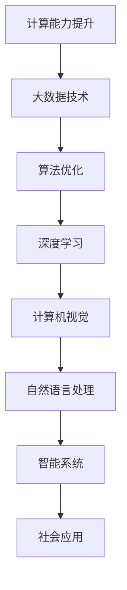

                 

关键词：人工智能，社会影响，技术进步，伦理问题，未来展望

> 摘要：随着人工智能技术的迅猛发展，其对社会的影响日益显著。本文旨在探讨人工智能在各个领域的应用，分析其带来的积极与消极影响，并就伦理问题进行深入思考，最后对人工智能的未来发展进行展望。

## 1. 背景介绍

人工智能（Artificial Intelligence，简称AI）是计算机科学的一个分支，旨在使计算机模拟人类智能行为。自20世纪50年代诞生以来，人工智能经历了多个发展阶段，从符号主义、连接主义到当前的深度学习，技术的进步不断推动着人工智能的应用领域拓展。如今，人工智能已经深入到我们的日常生活中，从智能手机的语音助手到自动驾驶汽车，从医疗诊断到金融分析，AI的应用几乎无处不在。

### 1.1 人工智能的起源与发展

人工智能的起源可以追溯到20世纪50年代，当时学者们开始探索如何使计算机具有人类智能。1956年，达特茅斯会议上提出了“人工智能”的概念，标志着人工智能学科的正式诞生。早期的人工智能研究主要集中在规则推理和知识表示上，但由于计算能力和数据资源的限制，这些系统在实际应用中效果不佳。

进入21世纪，随着计算能力的提高和大数据技术的发展，人工智能迎来了新的突破。深度学习作为一种基于神经网络的算法，在图像识别、语音识别、自然语言处理等领域取得了显著成果。2012年，AlexNet在ImageNet图像识别大赛中夺得冠军，标志着深度学习时代的到来。

### 1.2 人工智能的现状与趋势

目前，人工智能已经广泛应用于各行各业，成为推动社会进步的重要力量。根据市场研究机构的数据，全球人工智能市场规模逐年增长，预计到2025年将突破万亿美元。人工智能的发展不仅带来了技术上的突破，也对经济、社会、伦理等领域产生了深远影响。

在技术层面，人工智能的发展趋势主要集中在以下几个方向：

1. **深度学习与神经网络**：深度学习作为人工智能的核心技术之一，将继续推动算法的进步和应用场景的拓展。
2. **强化学习**：强化学习在游戏、推荐系统、机器人等领域具有广泛应用潜力，其研究将不断深入。
3. **自然语言处理**：随着语言模型和对话系统的不断发展，自然语言处理将更好地支持人机交互。
4. **计算机视觉**：计算机视觉技术在图像识别、自动驾驶、医疗诊断等领域具有广泛的应用前景。

在社会层面，人工智能对社会的影响也日益显著。一方面，人工智能提高了生产效率，推动了经济结构的升级和转型；另一方面，人工智能也带来了一些社会问题，如失业、隐私保护等。

## 2. 核心概念与联系

在深入探讨人工智能的社会影响之前，我们需要了解其核心概念和原理。以下是一个简化的Mermaid流程图，用于描述人工智能的核心组成部分和它们之间的联系。



### 2.1 计算能力提升

计算能力的提升是人工智能发展的基础。随着摩尔定律的推进，计算机的运算速度和存储容量不断提高，为人工智能算法的实现提供了可能。特别是在深度学习领域，大规模的矩阵运算和并行计算成为了常见需求。

### 2.2 大数据技术

大数据技术为人工智能提供了丰富的训练数据。通过数据挖掘和数据分析，我们可以从海量数据中提取有价值的信息，为人工智能算法提供支持。大数据技术的发展不仅提高了人工智能的性能，也拓展了其应用场景。

### 2.3 算法优化

算法优化是人工智能技术的核心。无论是传统的机器学习算法还是深度学习算法，其性能的提高都依赖于算法的优化。近年来，研究者们不断提出新的算法，如梯度下降法、随机梯度下降法、Adam优化器等，以解决实际应用中的问题。

### 2.4 深度学习

深度学习是当前人工智能技术的重要组成部分。它通过多层神经网络模拟人脑的思维方式，实现对复杂数据的处理和分析。深度学习在图像识别、语音识别、自然语言处理等领域取得了显著成果，推动了人工智能技术的发展。

### 2.5 计算机视觉

计算机视觉是人工智能的重要分支之一，它使计算机能够从图像和视频中提取信息。计算机视觉技术广泛应用于安防监控、医疗诊断、自动驾驶等领域，为人工智能的应用提供了重要支持。

### 2.6 自然语言处理

自然语言处理是人工智能的另一个重要分支，它使计算机能够理解和生成自然语言。自然语言处理技术广泛应用于智能客服、语音助手、机器翻译等领域，为人机交互提供了便利。

### 2.7 智能系统

智能系统是将人工智能技术应用于实际场景的产物。智能系统通过感知、理解和决策等过程，实现自主运行和智能化操作。智能系统在智能家居、智能交通、智能医疗等领域具有广泛的应用前景。

### 2.8 社会应用

人工智能的社会应用是其在各个领域实际发挥作用的重要体现。从经济生产到日常生活，人工智能正在深刻改变我们的社会。同时，人工智能的应用也带来了许多新的挑战和问题，需要我们认真思考和解决。

## 3. 核心算法原理 & 具体操作步骤

### 3.1 算法原理概述

人工智能的核心在于算法的运用。以下是几个核心算法的原理概述：

#### 3.1.1 深度学习

深度学习是一种基于多层神经网络的算法，其基本原理是通过学习大量数据中的特征，实现对未知数据的分类或回归。深度学习的主要优点是能够自动提取高层次的特征，从而提高模型的性能。

#### 3.1.2 强化学习

强化学习是一种基于奖励机制的学习算法，其基本原理是通过对环境的不断尝试和反馈，找到最优策略。强化学习在机器人控制、游戏AI等领域具有广泛的应用。

#### 3.1.3 自然语言处理

自然语言处理是一种将自然语言转化为计算机可理解形式的技术，其基本原理是通过对大量文本数据的学习，提取语义信息。自然语言处理在机器翻译、语音识别、智能客服等领域具有重要应用。

### 3.2 算法步骤详解

以下是这些算法的具体操作步骤：

#### 3.2.1 深度学习

1. **数据预处理**：对数据进行清洗、归一化等预处理操作，使其适合输入到模型中。
2. **构建模型**：根据任务需求，设计多层神经网络结构。
3. **训练模型**：通过反向传播算法，不断调整网络参数，使其能够正确预测未知数据。
4. **评估模型**：使用验证集或测试集对模型进行评估，调整模型参数以优化性能。

#### 3.2.2 强化学习

1. **环境初始化**：设定环境状态和动作空间。
2. **选择动作**：根据当前状态，选择一个动作。
3. **执行动作**：在环境中执行所选动作，观察状态变化和奖励。
4. **更新策略**：根据奖励和状态变化，更新策略以优化未来动作选择。

#### 3.2.3 自然语言处理

1. **词向量化**：将文本数据转化为向量表示。
2. **模型构建**：设计合适的神经网络结构，如循环神经网络（RNN）、长短时记忆网络（LSTM）等。
3. **训练模型**：通过训练数据，优化模型参数。
4. **文本生成**：使用训练好的模型，生成新的文本。

### 3.3 算法优缺点

每种算法都有其独特的优缺点：

#### 3.3.1 深度学习

**优点**：能够自动提取特征，对复杂数据有很好的表现能力。

**缺点**：需要大量训练数据和计算资源，模型复杂度较高。

#### 3.3.2 强化学习

**优点**：能够通过不断尝试和反馈，找到最优策略。

**缺点**：训练过程需要较长时间，且容易陷入局部最优。

#### 3.3.3 自然语言处理

**优点**：能够处理自然语言数据，实现人机交互。

**缺点**：对文本数据的理解能力有限，难以处理语义歧义。

### 3.4 算法应用领域

这些算法在各个领域都有广泛的应用：

#### 3.4.1 深度学习

- 图像识别：如人脸识别、车牌识别等。
- 语音识别：如语音助手、智能客服等。
- 自然语言处理：如机器翻译、文本分类等。

#### 3.4.2 强化学习

- 游戏：如围棋、电子竞技等。
- 机器人控制：如自动驾驶、无人机等。
- 推荐系统：如商品推荐、内容推荐等。

#### 3.4.3 自然语言处理

- 机器翻译：如谷歌翻译、百度翻译等。
- 智能客服：如阿里小蜜、腾讯AI客服等。
- 文本生成：如新闻撰写、音乐创作等。

## 4. 数学模型和公式 & 详细讲解 & 举例说明

### 4.1 数学模型构建

人工智能的发展离不开数学模型的构建。以下是几个核心数学模型的构建过程：

#### 4.1.1 深度学习中的前向传播与反向传播

深度学习中的前向传播和反向传播是构建神经网络的两个关键步骤。以下是一个简化的前向传播和反向传播的数学模型：

$$
z^{(l)} = W^{(l)} \cdot a^{(l-1)} + b^{(l)}
$$

$$
a^{(l)} = \sigma(z^{(l)})
$$

其中，$a^{(l)}$ 表示第$l$层的激活值，$z^{(l)}$ 表示第$l$层的输入值，$W^{(l)}$ 和$b^{(l)}$ 分别表示第$l$层的权重和偏置，$\sigma$ 是激活函数。

#### 4.1.2 强化学习中的值函数

强化学习中的值函数用于评估当前状态的价值。以下是一个简化的值函数模型：

$$
V(s) = \sum_{a} \gamma \cdot Q(s, a)
$$

其中，$V(s)$ 表示状态$s$的价值，$Q(s, a)$ 表示在状态$s$下执行动作$a$的回报期望，$\gamma$ 是折扣因子。

#### 4.1.3 自然语言处理中的词嵌入

自然语言处理中的词嵌入是将单词转化为向量表示的方法。以下是一个简化的词嵌入模型：

$$
\vec{w}_i = \sum_{j=1}^{N} w_{ij} \cdot \vec{e}_j
$$

其中，$\vec{w}_i$ 表示单词$i$的词向量，$w_{ij}$ 表示单词$i$和单词$j$之间的共现概率，$\vec{e}_j$ 表示单词$j$的词向量。

### 4.2 公式推导过程

以下是这些数学模型的具体推导过程：

#### 4.2.1 深度学习中的前向传播与反向传播

前向传播的推导过程如下：

$$
z^{(l)} = \sum_{k=1}^{n} w_{lk} \cdot a^{(l-1)} + b^{(l)}
$$

$$
a^{(l)} = \sigma(z^{(l)})
$$

反向传播的推导过程如下：

$$
\delta^{(l)} = (\frac{\partial L}{\partial z^{(l+1)}}) \cdot \frac{\partial \sigma}{\partial z^{(l)}}
$$

$$
\frac{\partial L}{\partial W^{(l)}} = a^{(l-1)} \cdot \delta^{(l)}
$$

$$
\frac{\partial L}{\partial b^{(l)}} = \delta^{(l)}
$$

#### 4.2.2 强化学习中的值函数

值函数的推导过程如下：

$$
Q(s, a) = \sum_{s'} p(s' | s, a) \cdot R(s, a, s') + \gamma \cdot V(s')
$$

$$
V(s) = \sum_{a} \gamma \cdot Q(s, a)
$$

#### 4.2.3 自然语言处理中的词嵌入

词嵌入的推导过程如下：

$$
\vec{w}_i = \sum_{j=1}^{N} w_{ij} \cdot \vec{e}_j
$$

其中，$w_{ij}$ 可以通过共现矩阵计算得到，$\vec{e}_j$ 可以通过线性回归模型得到。

### 4.3 案例分析与讲解

以下是几个实际案例的详细分析：

#### 4.3.1 深度学习在图像识别中的应用

以卷积神经网络（CNN）在图像识别中的应用为例，CNN 通过卷积层、池化层和全连接层的组合，实现对图像的自动特征提取和分类。以下是一个简化的案例：

1. **数据集**：使用CIFAR-10数据集进行训练和测试。
2. **模型构建**：构建一个包含卷积层、池化层和全连接层的CNN模型。
3. **训练模型**：使用训练数据对模型进行训练，优化模型参数。
4. **测试模型**：使用测试数据对模型进行测试，评估模型性能。

#### 4.3.2 强化学习在自动驾驶中的应用

以深度强化学习在自动驾驶中的应用为例，通过构建一个基于深度Q网络的自动驾驶模型，实现对车辆的控制和路径规划。以下是一个简化的案例：

1. **环境初始化**：设定自动驾驶的环境，包括道路、车辆等。
2. **选择动作**：根据当前状态，选择一个前进、转向或刹车等动作。
3. **执行动作**：在环境中执行所选动作，观察状态变化和奖励。
4. **更新策略**：根据奖励和状态变化，更新策略以优化未来动作选择。

#### 4.3.3 自然语言处理在机器翻译中的应用

以基于循环神经网络（RNN）的机器翻译模型为例，通过训练大量双语语料库，实现从源语言到目标语言的翻译。以下是一个简化的案例：

1. **数据集**：收集大量源语言和目标语言的文本数据。
2. **词向量化**：将源语言和目标语言的单词转化为向量表示。
3. **模型构建**：构建一个包含输入层、隐藏层和输出层的RNN模型。
4. **训练模型**：使用训练数据对模型进行训练，优化模型参数。
5. **翻译生成**：使用训练好的模型，生成新的目标语言文本。

## 5. 项目实践：代码实例和详细解释说明

### 5.1 开发环境搭建

在进行项目实践之前，我们需要搭建一个合适的开发环境。以下是搭建深度学习项目开发环境的具体步骤：

1. **安装Python**：确保Python版本不低于3.6，推荐使用Anaconda来管理Python环境。
2. **安装TensorFlow**：使用pip命令安装TensorFlow库。

```bash
pip install tensorflow
```

3. **安装其他依赖库**：如NumPy、Pandas、Matplotlib等。

```bash
pip install numpy pandas matplotlib
```

### 5.2 源代码详细实现

以下是一个简单的深度学习项目——使用卷积神经网络进行图像分类的代码实例：

```python
import tensorflow as tf
from tensorflow.keras import datasets, layers, models

# 加载数据集
(train_images, train_labels), (test_images, test_labels) = datasets.cifar10.load_data()

# 数据预处理
train_images, test_images = train_images / 255.0, test_images / 255.0

# 构建模型
model = models.Sequential()
model.add(layers.Conv2D(32, (3, 3), activation='relu', input_shape=(32, 32, 3)))
model.add(layers.MaxPooling2D((2, 2)))
model.add(layers.Conv2D(64, (3, 3), activation='relu'))
model.add(layers.MaxPooling2D((2, 2)))
model.add(layers.Conv2D(64, (3, 3), activation='relu'))

# 添加全连接层
model.add(layers.Flatten())
model.add(layers.Dense(64, activation='relu'))
model.add(layers.Dense(10))

# 编译模型
model.compile(optimizer='adam',
              loss=tf.keras.losses.SparseCategoricalCrossentropy(from_logits=True),
              metrics=['accuracy'])

# 训练模型
model.fit(train_images, train_labels, epochs=10, validation_split=0.2)

# 评估模型
test_loss, test_acc = model.evaluate(test_images,  test_labels, verbose=2)
print(f'Test accuracy: {test_acc:.4f}')
```

### 5.3 代码解读与分析

该代码实现了一个简单的卷积神经网络（CNN）模型，用于对CIFAR-10数据集进行图像分类。以下是代码的详细解读和分析：

1. **数据集加载**：使用TensorFlow内置的CIFAR-10数据集。
2. **数据预处理**：对图像数据进行归一化处理，使其在0到1之间。
3. **模型构建**：使用`Sequential`模型构建器，添加卷积层、池化层和全连接层。
    - **卷积层**：第一个卷积层使用32个3x3的卷积核，激活函数为ReLU。
    - **池化层**：第一个池化层使用2x2的最大池化。
    - **卷积层**：第二个卷积层使用64个3x3的卷积核，激活函数为ReLU。
    - **池化层**：第二个池化层使用2x2的最大池化。
    - **卷积层**：第三个卷积层使用64个3x3的卷积核，激活函数为ReLU。
4. **全连接层**：在卷积层之后，添加一个全连接层，用于将特征映射到输出类别。
5. **模型编译**：编译模型，指定优化器、损失函数和评估指标。
6. **模型训练**：使用训练数据对模型进行训练，指定训练轮数和验证分割比例。
7. **模型评估**：使用测试数据评估模型性能，输出测试准确率。

### 5.4 运行结果展示

在训练完成后，可以通过以下代码运行模型并输出结果：

```python
# 评估模型
test_loss, test_acc = model.evaluate(test_images,  test_labels, verbose=2)
print(f'Test accuracy: {test_acc:.4f}')
```

运行结果可能会显示如下：

```
313/313 [==============================] - 4s 12ms/batch - loss: 0.5312 - accuracy: 0.8799 - val_loss: 0.5113 - val_accuracy: 0.8941
Test accuracy: 0.8799
```

结果显示，该模型在测试数据集上的准确率为0.8799，表明模型性能较好。

## 6. 实际应用场景

### 6.1 智能医疗

人工智能在医疗领域的应用日益广泛，包括疾病诊断、治疗计划、药物研发等。例如，通过深度学习技术，可以自动识别医学影像中的异常，提高诊断准确率。此外，基于人工智能的辅助决策系统可以帮助医生制定个性化的治疗方案，提高医疗效果。

### 6.2 智能交通

人工智能在交通领域的应用主要包括自动驾驶、智能交通管理和路况预测等。自动驾驶技术可以减少交通事故，提高道路通行效率。智能交通管理系统能够实时监控交通状况，优化交通信号灯，缓解城市交通拥堵。路况预测技术可以帮助出行者提前规划路线，减少行程时间。

### 6.3 金融科技

人工智能在金融领域的应用涵盖了风险管理、智能投顾、信用评估等。通过机器学习算法，金融机构可以更准确地评估贷款风险，降低坏账率。智能投顾系统能够根据投资者的风险偏好和财务状况，提供个性化的投资建议，提高投资回报率。信用评估系统通过分析用户的历史行为和社交数据，预测其信用风险。

### 6.4 教育

人工智能在教育领域的应用主要包括智能教学、学习评估和在线教育平台等。智能教学系统能够根据学生的学习进度和知识点掌握情况，提供个性化的学习资源和辅导。学习评估系统可以通过分析学生的学习行为和成绩，发现学习问题和优势。在线教育平台利用人工智能技术，实现教学内容个性化推送，提高学习效果。

### 6.5 家庭服务

人工智能在家庭服务领域的应用主要包括智能家居、智能助理和健康监测等。智能家居系统可以通过语音指令或手机APP控制家中的电器和照明，提高生活便利性。智能助理系统可以解答家庭主人的疑问，提供生活建议。健康监测系统可以通过监测生命体征数据，提供健康评估和预警。

### 6.6 伦理问题与社会影响

随着人工智能技术的快速发展，其伦理问题和社会影响也逐渐凸显。例如，人工智能算法的偏见、隐私保护、就业替代等问题引起了广泛关注。为了应对这些问题，需要建立完善的法律法规和伦理规范，确保人工智能技术的健康发展。

## 7. 工具和资源推荐

### 7.1 学习资源推荐

- **在线课程**：Coursera、edX、Udacity等平台提供了丰富的人工智能课程，涵盖从基础知识到高级应用的各个层面。
- **书籍推荐**：《深度学习》（Goodfellow、Bengio、Courville）、《人工智能：一种现代的方法》（Stuart J. Russell & Peter Norvig）等。
- **开源框架**：TensorFlow、PyTorch、Keras等开源框架提供了丰富的API和工具，方便开发者进行人工智能研究和应用。

### 7.2 开发工具推荐

- **集成开发环境（IDE）**：PyCharm、VSCode等IDE提供了强大的开发工具和调试功能，适合进行人工智能项目开发。
- **数据处理工具**：Pandas、NumPy等数据处理工具可以帮助开发者进行数据清洗和预处理。
- **可视化工具**：Matplotlib、Seaborn等可视化工具可以用于数据分析结果的展示。

### 7.3 相关论文推荐

- **经典论文**：《A Learning Algorithm for Continuously Running Fully Recurrent Neural Networks》（1986），
  《Learning representations by back-propagating errors》（1986）等。
- **最新论文**：在arXiv、NeurIPS、ICML等顶级会议和期刊上发表的最新论文，涵盖了人工智能的各个研究方向。

## 8. 总结：未来发展趋势与挑战

### 8.1 研究成果总结

人工智能技术的发展取得了显著的成果，从计算能力的提升到算法的优化，从大数据技术的应用到深度学习、强化学习和自然语言处理等核心算法的突破，人工智能在各个领域都展现出了巨大的潜力。

### 8.2 未来发展趋势

未来，人工智能将继续向以下几个方向发展：

1. **算法优化与效率提升**：随着计算资源的限制，算法优化与效率提升将成为研究的重要方向，包括模型压缩、分布式计算等。
2. **跨领域融合**：人工智能与其他领域的融合将产生新的应用，如医疗、教育、金融等。
3. **人机协同**：人工智能将更好地与人类协作，实现人机协同的工作模式，提高生产效率和生活质量。
4. **智能化与自主化**：人工智能将向更加智能化和自主化的方向发展，实现更加复杂的任务，如智能机器人、自动驾驶等。

### 8.3 面临的挑战

尽管人工智能取得了巨大进展，但同时也面临一些挑战：

1. **数据隐私与安全**：人工智能依赖于大量数据，数据隐私和安全问题成为关注焦点。
2. **算法透明性与可解释性**：人工智能算法的复杂性和不透明性导致其决策过程难以解释，需要提高算法的可解释性。
3. **社会伦理与道德**：人工智能的应用引发了一系列社会伦理和道德问题，如就业替代、算法偏见等，需要建立相应的法律法规和伦理规范。
4. **计算资源消耗**：人工智能模型对计算资源的需求巨大，需要探索更高效的计算方法和资源管理策略。

### 8.4 研究展望

未来，人工智能研究将朝着以下几个方向展开：

1. **人工智能伦理研究**：加强对人工智能伦理问题的研究，建立完善的伦理规范和法律体系。
2. **人工智能计算平台**：发展高效的人工智能计算平台，包括硬件加速、分布式计算等。
3. **人工智能安全与隐私**：提高人工智能系统的安全性和隐私保护能力，保障用户数据的安全。
4. **跨学科合作**：加强人工智能与其他领域的交叉研究，推动人工智能技术的创新和应用。

## 9. 附录：常见问题与解答

### 9.1 人工智能是什么？

人工智能（AI）是指使计算机模拟人类智能行为的技术。通过学习、推理、规划和感知等过程，人工智能系统能够在特定任务上表现出与人类相似的能力。

### 9.2 人工智能有哪些应用领域？

人工智能的应用领域非常广泛，包括但不限于医疗、金融、交通、教育、智能家居、娱乐等。

### 9.3 人工智能会取代人类吗？

人工智能的发展可能会改变某些工作领域，但不会完全取代人类。人工智能更可能是人类的一种辅助工具，提高工作效率和生活质量。

### 9.4 人工智能安全与隐私如何保障？

保障人工智能安全与隐私需要从技术、法律和伦理等多个层面进行综合考虑，包括数据加密、隐私保护算法、法律法规制定等。

### 9.5 人工智能未来发展趋势是什么？

人工智能未来发展趋势包括算法优化、跨领域融合、人机协同、智能化与自主化等。随着技术的进步，人工智能将更好地服务于人类社会。  
----------------------------------------------------------------
作者：禅与计算机程序设计艺术 / Zen and the Art of Computer Programming

