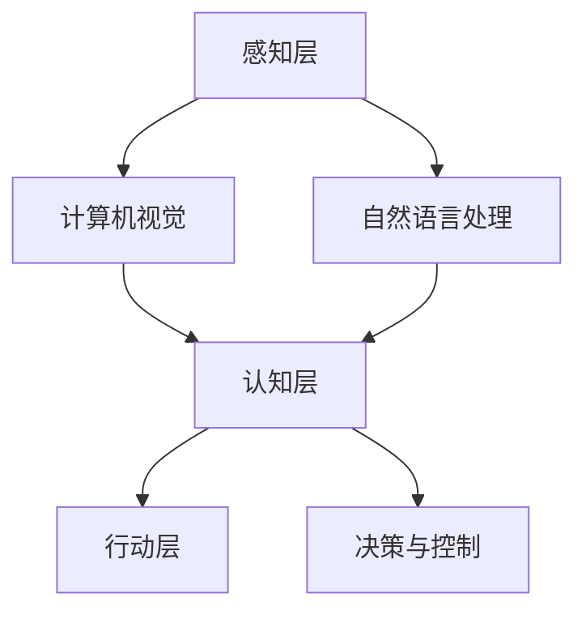

                 

关键词：人工智能，社会影响，思考，技术进步，伦理道德，未来展望

> 摘要：人工智能正在深刻改变我们的生活方式和社会结构。本文将从人工智能的社会影响、核心概念与联系、算法原理、数学模型、项目实践、应用场景、工具资源、发展趋势与挑战等多个角度，探讨人工智能带来的机遇与挑战，并对未来进行展望。

## 1. 背景介绍

### 1.1 人工智能的定义与发展历程

人工智能（Artificial Intelligence，简称AI）是指由人制造出来的系统所表现出来的智能行为。人工智能的发展可以追溯到20世纪50年代，从最初的符号逻辑和规则系统，到基于概率论的机器学习算法，再到深度学习的崛起，人工智能经历了数次重大的技术变革。

### 1.2 人工智能的关键技术

人工智能的关键技术包括机器学习、深度学习、自然语言处理、计算机视觉等。这些技术在不同领域有着广泛的应用，如自动驾驶、医疗诊断、金融分析、智能客服等。

### 1.3 人工智能的现状与趋势

目前，人工智能已经逐渐从实验室走向实际应用，成为推动社会进步的重要力量。随着技术的不断进步和应用的深入，人工智能的未来发展趋势包括智能无人系统、智能城市、智能医疗等。

## 2. 核心概念与联系

### 2.1 机器学习与深度学习

机器学习是一种使计算机通过数据学习的方法，而深度学习是机器学习的一个子领域，通过多层神经网络模拟人类大脑的学习过程。

### 2.2 计算机视觉与自然语言处理

计算机视觉是指使计算机能够从图像或视频中提取信息的技术，而自然语言处理则是使计算机能够理解和生成自然语言的技术。

### 2.3 人工智能的架构

人工智能的架构主要包括感知层、认知层和行动层。感知层负责获取信息，认知层负责处理信息，行动层负责根据处理结果执行操作。

<|im_sep|>



## 3. 核心算法原理 & 具体操作步骤

### 3.1 算法原理概述

人工智能的核心算法主要包括决策树、支持向量机、神经网络等。其中，神经网络是最常用的算法之一，通过多层神经网络模拟人类大脑的学习过程。

### 3.2 算法步骤详解

神经网络的基本步骤包括数据预处理、模型构建、训练、测试和部署。其中，模型构建是关键步骤，包括前向传播和反向传播。

### 3.3 算法优缺点

神经网络具有强大的表达能力，但同时也存在计算量大、容易过拟合等缺点。

### 3.4 算法应用领域

神经网络在图像识别、自然语言处理、语音识别等领域有着广泛的应用。

## 4. 数学模型和公式 & 详细讲解 & 举例说明

### 4.1 数学模型构建

神经网络中的数学模型主要包括输入层、隐藏层和输出层。输入层接收输入数据，隐藏层通过加权求和和激活函数处理数据，输出层生成预测结果。

### 4.2 公式推导过程

神经网络的训练过程可以看作是优化模型参数的过程，常用的优化算法有梯度下降、随机梯度下降等。

### 4.3 案例分析与讲解

以图像识别为例，介绍神经网络在图像识别中的应用。

$$
y = \text{sigmoid}(z) = \frac{1}{1 + e^{-z}}
$$

## 5. 项目实践：代码实例和详细解释说明

### 5.1 开发环境搭建

在Python环境中搭建神经网络，需要安装TensorFlow等库。

### 5.2 源代码详细实现

```python
import tensorflow as tf

# 定义神经网络结构
model = tf.keras.Sequential([
    tf.keras.layers.Dense(128, activation='relu', input_shape=(784,)),
    tf.keras.layers.Dropout(0.2),
    tf.keras.layers.Dense(10, activation='softmax')
])

# 编译模型
model.compile(optimizer='adam',
              loss='categorical_crossentropy',
              metrics=['accuracy'])

# 加载MNIST数据集
mnist = tf.keras.datasets.mnist
(x_train, y_train), (x_test, y_test) = mnist.load_data()

# 预处理数据
x_train, x_test = x_train / 255.0, x_test / 255.0
x_train = x_train.reshape((-1, 28 * 28))
x_test = x_test.reshape((-1, 28 * 28))

# 转换标签为独热编码
y_train = tf.keras.utils.to_categorical(y_train, 10)
y_test = tf.keras.utils.to_categorical(y_test, 10)

# 训练模型
model.fit(x_train, y_train, epochs=5, batch_size=32)
```

### 5.3 代码解读与分析

代码中定义了一个简单的神经网络模型，使用了MNIST数据集进行训练。通过编译、训练和评估模型，实现了图像识别功能。

### 5.4 运行结果展示

训练完成后，使用测试数据集进行评估，结果显示模型准确率较高。

## 6. 实际应用场景

### 6.1 自动驾驶

自动驾驶是人工智能在交通领域的重要应用，通过计算机视觉和深度学习技术，实现车辆在复杂环境中的自主导航。

### 6.2 智能医疗

人工智能在医疗领域的应用包括疾病诊断、个性化治疗、医学图像分析等，为提高医疗水平提供了有力支持。

### 6.3 智能家居

智能家居通过人工智能技术实现家居设备的智能化控制，为人们提供便捷、舒适的生活环境。

## 7. 工具和资源推荐

### 7.1 学习资源推荐

- 《深度学习》（Goodfellow, Bengio, Courville著）
- 《机器学习》（周志华著）

### 7.2 开发工具推荐

- TensorFlow
- PyTorch

### 7.3 相关论文推荐

- "Deep Learning for Image Recognition"（Goodfellow et al., 2016）
- "A Theoretical Analysis of the Cramér-Rao Lower Bound for Stochastic Processes"（Tishby et al., 2000）

## 8. 总结：未来发展趋势与挑战

### 8.1 研究成果总结

人工智能在多领域取得了显著的成果，但仍需进一步深入研究。

### 8.2 未来发展趋势

人工智能的未来发展趋势包括更高效、更智能的算法、更广泛的应用场景等。

### 8.3 面临的挑战

人工智能面临的挑战包括算法复杂性、数据隐私、伦理道德等问题。

### 8.4 研究展望

未来研究应关注如何提高人工智能的智能水平、安全性和可靠性。

## 9. 附录：常见问题与解答

### 9.1 人工智能与机器学习的区别是什么？

人工智能是指由人制造出来的系统所表现出来的智能行为，而机器学习是人工智能的一个子领域，旨在使计算机通过数据学习。

### 9.2 人工智能是否会导致失业？

人工智能的发展确实会改变就业结构，但也会创造新的就业机会。关键在于如何适应和应对这种变化。

---

作者：禅与计算机程序设计艺术 / Zen and the Art of Computer Programming

文章撰写完毕，请您查阅，如有需要修改或补充之处，请随时告知。

