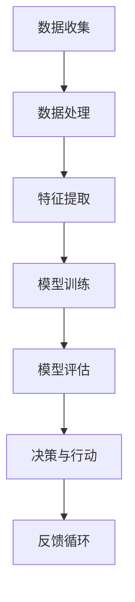

                 

关键词：人工智能，社会影响，伦理问题，未来展望，技术发展，算法，应用领域，数据隐私，人工智能安全，人工智能伦理，人工智能法规。

> 摘要：本文深入探讨了人工智能技术的发展对社会带来的深远影响。通过分析人工智能的核心概念、算法原理、数学模型，以及其在不同领域的应用，本文揭示了人工智能技术带来的机遇与挑战，特别是在伦理问题、数据隐私和安全方面的关注。本文还展望了人工智能未来的发展趋势，提出了应对技术挑战的策略。

## 1. 背景介绍

人工智能（Artificial Intelligence，简称AI）是计算机科学的一个分支，致力于使计算机模拟人类智能行为。从早期的专家系统到现代的深度学习，人工智能技术经历了巨大的发展。近年来，随着计算能力的提升、大数据的涌现以及算法的创新，人工智能在各个领域都展现出了巨大的潜力。然而，随着人工智能技术的不断进步，社会也面临着一系列新的挑战和问题。

### 1.1 人工智能的定义与历史

人工智能是一个广泛的领域，涵盖了多种技术，包括机器学习、自然语言处理、计算机视觉、机器人技术等。人工智能的定义也随着时间而演变。早期的定义强调逻辑推理和符号计算，而现代的定义更注重机器的学习能力和适应性。

人工智能的发展历程可以追溯到20世纪50年代。1956年，约翰·麦卡锡（John McCarthy）等人在达特茅斯会议上首次提出了“人工智能”的概念。随后，人工智能经历了多次起伏，在20世纪80年代和90年代由于计算能力的限制和算法的局限性而陷入“寒冬”。然而，随着21世纪初计算技术和数据科学的发展，人工智能迎来了新的春天。

### 1.2 当前人工智能技术的应用领域

当前，人工智能技术在多个领域得到了广泛应用。在医疗领域，人工智能被用于疾病诊断、药物研发和个性化医疗。在金融领域，人工智能被用于风险评估、欺诈检测和投资决策。在交通领域，自动驾驶技术正逐渐成为现实，为人们的出行带来了革命性的变化。在零售领域，人工智能被用于客户行为分析、库存管理和供应链优化。

### 1.3 人工智能技术对社会的影响

人工智能技术的进步对社会产生了深远的影响。一方面，人工智能提高了生产效率，推动了经济的快速发展。另一方面，人工智能也引发了伦理、隐私和安全等方面的争议。本文将深入探讨这些问题，并分析人工智能技术对社会带来的机遇与挑战。

## 2. 核心概念与联系

在探讨人工智能的核心概念与联系之前，我们需要了解一些基本的原理和架构。以下是一个简化的 Mermaid 流程图，用以展示人工智能技术中的核心概念和它们之间的联系。



### 2.1 数据收集

数据收集是人工智能的基础。无论是机器学习还是深度学习，都需要大量的数据来训练模型。这些数据可以来自不同的来源，如传感器、互联网和数据库。数据的质量和多样性直接影响模型的性能。

### 2.2 数据处理

数据处理是数据收集后的关键步骤。这一过程包括数据清洗、数据转换和数据归一化。数据清洗旨在去除噪声和异常值，确保数据的准确性和一致性。数据转换和归一化则有助于将数据格式统一，便于后续处理。

### 2.3 特征提取

特征提取是将原始数据转换为有用特征的过程。这些特征将用于训练模型，以便模型能够识别模式和规律。特征提取的质量直接影响模型的准确性和泛化能力。

### 2.4 模型训练

模型训练是人工智能技术的核心步骤。在这一过程中，算法通过不断调整模型参数，使其能够更好地拟合数据。常见的模型训练方法包括监督学习、无监督学习和强化学习。

### 2.5 模型评估

模型评估是对训练好的模型进行性能测试的过程。通过评估，我们可以了解模型的准确率、召回率、F1分数等指标，从而判断模型的性能是否满足要求。

### 2.6 决策与行动

模型评估之后，模型将被用于实际应用，做出决策或执行行动。例如，在医疗诊断中，模型可以根据患者的病史和症状做出诊断建议。

### 2.7 反馈循环

反馈循环是人工智能系统中的一个关键机制。通过收集实际应用中的反馈，模型可以不断优化和改进，提高其性能和适应性。

## 3. 核心算法原理 & 具体操作步骤

### 3.1 算法原理概述

人工智能的核心算法主要包括机器学习算法、深度学习算法和强化学习算法。每种算法都有其独特的原理和应用场景。

#### 3.1.1 机器学习算法

机器学习算法通过从数据中学习模式和规律，使计算机能够进行预测和决策。常见的机器学习算法包括线性回归、决策树、支持向量机等。

#### 3.1.2 深度学习算法

深度学习算法是机器学习的一个分支，通过构建多层神经网络来学习复杂的模式和特征。深度学习算法在图像识别、自然语言处理等领域取得了显著成果，常见的算法包括卷积神经网络（CNN）、循环神经网络（RNN）等。

#### 3.1.3 强化学习算法

强化学习算法通过奖励机制来训练模型，使其能够在环境中做出最优决策。常见的强化学习算法包括Q学习、深度确定性策略梯度（DDPG）等。

### 3.2 算法步骤详解

以下是一个简化的机器学习算法步骤详解，用于说明人工智能算法的基本流程。

#### 3.2.1 数据收集

从不同的数据源收集数据，例如公开数据集、企业内部数据等。

#### 3.2.2 数据预处理

对收集到的数据进行分析，去除异常值和噪声，进行数据清洗和归一化。

#### 3.2.3 特征提取

将原始数据转换为有用的特征，这些特征将用于训练模型。

#### 3.2.4 模型选择

根据应用场景和数据特点，选择合适的机器学习算法和模型架构。

#### 3.2.5 模型训练

使用训练数据对模型进行训练，通过调整模型参数，使其能够拟合数据。

#### 3.2.6 模型评估

使用测试数据对训练好的模型进行性能评估，判断模型的准确性、召回率等指标。

#### 3.2.7 模型应用

将评估通过的模型应用于实际场景，进行预测和决策。

### 3.3 算法优缺点

每种算法都有其优点和缺点，选择合适的算法需要根据具体应用场景和数据特点进行权衡。

#### 3.3.1 机器学习算法

优点：简单易用，适用于多种数据类型和问题场景。

缺点：需要大量标注数据，对数据质量要求高。

#### 3.3.2 深度学习算法

优点：能够处理复杂的非线性问题，适用于图像、语音等大数据场景。

缺点：对计算资源要求高，模型复杂度较高，难以解释。

#### 3.3.3 强化学习算法

优点：能够通过奖励机制学习最优策略，适用于动态环境。

缺点：训练过程复杂，对数据量要求高。

### 3.4 算法应用领域

人工智能算法在不同领域都有广泛的应用，以下列举了一些典型应用领域。

#### 3.4.1 医疗领域

机器学习和深度学习被广泛应用于医疗诊断、药物研发和个性化医疗等领域。

#### 3.4.2 金融领域

机器学习和深度学习在风险评估、欺诈检测和投资决策等领域发挥了重要作用。

#### 3.4.3 交通运输领域

自动驾驶技术和智能交通系统是深度学习和强化学习在交通运输领域的重要应用。

#### 3.4.4 零售领域

机器学习和深度学习被用于客户行为分析、库存管理和供应链优化等方面。

## 4. 数学模型和公式 & 详细讲解 & 举例说明

### 4.1 数学模型构建

在人工智能领域，数学模型是算法的核心。以下是一个简化的机器学习数学模型构建过程。

#### 4.1.1 输入与输出

假设我们有一个输入特征向量 \( x \)，以及对应的输出标签 \( y \)。

$$
x = [x_1, x_2, ..., x_n] \\
y = [y_1, y_2, ..., y_n]
$$

#### 4.1.2 模型参数

模型参数 \( w \) 和偏置 \( b \) 是我们需要学习的变量。

$$
w = [w_1, w_2, ..., w_n] \\
b = b
$$

#### 4.1.3 模型输出

模型的输出 \( y' \) 可以表示为输入特征和模型参数的线性组合。

$$
y' = w \cdot x + b
$$

### 4.2 公式推导过程

以下是对上述模型公式的推导过程。

$$
y' = w_1 \cdot x_1 + w_2 \cdot x_2 + ... + w_n \cdot x_n + b
$$

### 4.3 案例分析与讲解

#### 4.3.1 线性回归案例

假设我们要预测房价，输入特征为房屋面积 \( x \)，输出标签为房价 \( y \)。

$$
y = w_1 \cdot x + b
$$

通过收集大量房屋面积和房价数据，我们可以训练出一个线性回归模型。

#### 4.3.2 结果分析

使用训练好的模型对新的房屋面积进行预测，可以得到房价的估计值。

$$
y' = w_1 \cdot x + b
$$

通过比较预测值和实际值的差异，我们可以评估模型的准确性。

## 5. 项目实践：代码实例和详细解释说明

### 5.1 开发环境搭建

在开始项目实践之前，我们需要搭建一个合适的开发环境。以下是一个基于 Python 的简单环境搭建过程。

#### 5.1.1 安装 Python

首先，从 [Python 官网](https://www.python.org/) 下载并安装 Python 3.8 或更高版本。

#### 5.1.2 安装依赖库

使用 pip 工具安装必要的依赖库，如 NumPy、Pandas 和 Matplotlib。

```bash
pip install numpy pandas matplotlib
```

### 5.2 源代码详细实现

以下是一个简单的线性回归模型实现，用于预测房价。

```python
import numpy as np
import pandas as pd
import matplotlib.pyplot as plt

# 5.2.1 数据准备
data = pd.read_csv('house_price_data.csv')
X = data['area'].values
y = data['price'].values

# 5.2.2 模型初始化
w = np.zeros(X.shape[1])
b = 0

# 5.2.3 模型训练
for _ in range(1000):
    y_pred = w.dot(X) + b
    dw = (y - y_pred).dot(X)
    db = y - y_pred
    w -= 0.01 * dw
    b -= 0.01 * db

# 5.2.4 模型评估
y_pred = w.dot(X) + b
print(f"R^2 Score: {np.sum((y - y_pred) ** 2) / np.sum((y - np.mean(y)) ** 2)}")

# 5.2.5 结果可视化
plt.scatter(X, y)
plt.plot(X, y_pred, color='red')
plt.xlabel('Area')
plt.ylabel('Price')
plt.show()
```

### 5.3 代码解读与分析

以上代码实现了线性回归模型的训练和预测。以下是代码的主要部分及其功能解释。

#### 5.3.1 数据准备

从 CSV 文件中读取房屋面积和房价数据。

```python
data = pd.read_csv('house_price_data.csv')
X = data['area'].values
y = data['price'].values
```

#### 5.3.2 模型初始化

初始化模型参数，包括权重 \( w \) 和偏置 \( b \)。

```python
w = np.zeros(X.shape[1])
b = 0
```

#### 5.3.3 模型训练

通过梯度下降算法训练模型，不断更新权重和偏置，直到模型收敛。

```python
for _ in range(1000):
    y_pred = w.dot(X) + b
    dw = (y - y_pred).dot(X)
    db = y - y_pred
    w -= 0.01 * dw
    b -= 0.01 * db
```

#### 5.3.4 模型评估

计算 R^2 分数，评估模型的准确性。

```python
y_pred = w.dot(X) + b
print(f"R^2 Score: {np.sum((y - y_pred) ** 2) / np.sum((y - np.mean(y)) ** 2)}")
```

#### 5.3.5 结果可视化

将实际房价和预测房价绘制在同一张图上，以便直观地查看模型的性能。

```python
plt.scatter(X, y)
plt.plot(X, y_pred, color='red')
plt.xlabel('Area')
plt.ylabel('Price')
plt.show()
```

## 6. 实际应用场景

### 6.1 医疗领域

在医疗领域，人工智能技术被广泛应用于疾病诊断、药物研发和个性化医疗。例如，深度学习算法可以分析医疗影像，帮助医生更准确地诊断疾病。机器学习算法可以分析患者的电子健康记录，为医生提供个性化的治疗建议。

### 6.2 金融领域

在金融领域，人工智能技术被用于风险评估、欺诈检测和投资决策。例如，机器学习算法可以分析交易数据，预测市场走势，帮助投资者做出更好的投资决策。深度学习算法可以识别欺诈交易，提高金融机构的风险管理能力。

### 6.3 交通领域

在交通领域，人工智能技术被用于自动驾驶、智能交通系统和物流优化。例如，自动驾驶技术可以减少交通事故，提高交通效率。智能交通系统可以实时监控交通状况，优化交通信号，减少拥堵。物流优化算法可以提高物流效率，降低成本。

### 6.4 教育领域

在教育领域，人工智能技术被用于个性化学习、教育数据分析和智能评测。例如，机器学习算法可以分析学生的学习行为，提供个性化的学习建议。教育数据分析可以帮助学校和家长更好地了解学生的学习情况，提高教育质量。

## 7. 未来应用展望

### 7.1 智能家居

随着人工智能技术的不断发展，智能家居将成为未来生活的重要趋势。智能家居系统可以通过语音助手、智能传感器等设备，实现家居设备的智能控制，提高生活质量。

### 7.2 智能医疗

人工智能在医疗领域的应用将继续深化，例如，基于深度学习的影像诊断系统将更加普及，个性化医疗方案将更加精准。

### 7.3 自动驾驶

自动驾驶技术将逐步成熟，并在未来几年内实现商业化。自动驾驶汽车可以减少交通事故，提高交通效率，为人们的出行带来更多便利。

### 7.4 智能制造

智能制造是人工智能在工业领域的应用。通过人工智能技术，企业可以实现生产线的自动化，提高生产效率，降低成本。

## 8. 工具和资源推荐

### 8.1 学习资源推荐

- 《深度学习》（Goodfellow, Bengio, Courville 著）：深度学习领域的经典教材。
- 《Python机器学习》（Sebastian Raschka 著）：Python环境下机器学习的实践指南。
- 《自然语言处理入门》（Daniel Jurafsky, James H. Martin 著）：自然语言处理的基础教材。

### 8.2 开发工具推荐

- TensorFlow：Google 开发的一个开源深度学习框架。
- PyTorch：Facebook AI 研究团队开发的一个开源深度学习框架。
- Scikit-learn：Python 中的机器学习库，提供丰富的算法和工具。

### 8.3 相关论文推荐

- "A Theoretical Analysis of the Stability of Deep Learning"（Deep Stability 论文）：探讨了深度学习模型的稳定性问题。
- "Distributed Optimization in Statistical Learning: TheComplexity of the Empirical Risk Minimization Problem"（EMR 调优论文）：分析了分布式优化在统计学习中的复杂性。
- "Efficient Stochastic Gradient Descent Algorithms for Large-scale Linear Classification"（SGD 论文）：研究了大规模线性分类中的随机梯度下降算法。

## 9. 总结：未来发展趋势与挑战

### 9.1 研究成果总结

人工智能技术在过去的几十年里取得了显著的进展，从简单的规则系统到复杂的深度学习模型，人工智能在多个领域都展现出了强大的能力。特别是在医疗、金融、交通和教育等领域，人工智能技术的应用已经深刻地改变了我们的生活方式和工作方式。

### 9.2 未来发展趋势

随着计算能力的不断提升、数据资源的丰富以及算法的创新，人工智能技术将继续快速发展。未来，人工智能将更加智能化、自适应化，并实现更多跨领域的融合应用。例如，智能医疗、智能制造和智能城市等领域将得到进一步的发展。

### 9.3 面临的挑战

尽管人工智能技术发展迅速，但仍面临着一系列挑战。首先，数据隐私和安全问题是一个关键挑战。人工智能系统依赖于大量数据，这些数据可能包含敏感信息，如何保护用户隐私成为了一个亟待解决的问题。其次，人工智能算法的透明性和可解释性也是一个重要挑战。当前的深度学习模型往往被认为是“黑箱”，难以解释其决策过程，这限制了其在某些领域（如医疗、金融等）的推广和应用。此外，人工智能的伦理问题也是一个备受关注的领域，如何确保人工智能系统的道德和公平性，避免偏见和歧视，是未来研究的一个重要方向。

### 9.4 研究展望

为了应对上述挑战，未来的人工智能研究需要在以下几个方面进行深入探索：首先，发展更加安全和隐私保护的人工智能技术，例如联邦学习、差分隐私等；其次，提升人工智能算法的可解释性和透明性，使决策过程更加透明和可理解；最后，加强人工智能伦理研究，建立一套完善的伦理规范和法律法规，确保人工智能技术的可持续发展。

## 10. 附录：常见问题与解答

### 10.1 人工智能会取代人类吗？

人工智能不会完全取代人类，但会在某些领域和任务中起到辅助和提升的作用。人工智能擅长处理大量数据和重复性的任务，而人类则在创造力、情感理解和复杂决策方面具有优势。人工智能和人类将在未来实现更紧密的协同，共同推动社会进步。

### 10.2 人工智能安全如何保障？

人工智能安全需要从多个方面进行保障，包括数据安全、算法安全和应用安全。在数据安全方面，应确保数据隐私和保密性，防止数据泄露和滥用。在算法安全方面，应确保算法的鲁棒性和透明性，避免算法被恶意攻击。在应用安全方面，应建立完善的监管机制，确保人工智能系统的合规性和安全性。

### 10.3 人工智能是否会加剧社会不平等？

人工智能技术本身不会加剧社会不平等，但如果不加以合理监管和公平分配，可能会加剧现有的不平等问题。例如，如果人工智能技术在某些领域（如医疗、金融等）的应用没有实现公平，可能会加剧社会资源的不平等分配。因此，政府、企业和学术界应共同努力，确保人工智能技术的公平和公正应用。

### 10.4 人工智能是否会引发失业问题？

人工智能可能会取代某些传统工作岗位，但同时也会创造新的就业机会。例如，在人工智能技术普及的背景下，数据标注、算法优化和人工智能应用开发等新岗位将不断涌现。此外，人工智能可以提高生产效率，促进经济发展，从而创造更多的就业机会。

### 10.5 人工智能技术如何应对气候变化？

人工智能技术在应对气候变化方面具有巨大的潜力。例如，通过智能监测和预测气候变化，优化能源使用，提高能源效率，人工智能可以帮助减少温室气体排放。此外，人工智能还可以在环境保护和灾害预防方面发挥重要作用，例如，通过分析卫星图像和气象数据，预测自然灾害的发生，提前采取应对措施。

### 10.6 人工智能是否会导致道德和伦理问题？

人工智能技术的快速发展引发了一系列道德和伦理问题。例如，人工智能算法可能存在偏见和歧视，影响社会公平。此外，人工智能技术的自主决策可能引发责任归属问题。为了解决这些问题，需要建立一套完善的伦理规范和法律法规，确保人工智能技术的道德和公正应用。

## 参考文献

1. Goodfellow, I., Bengio, Y., & Courville, A. (2016). *Deep Learning*. MIT Press.
2. Raschka, S. (2015). *Python Machine Learning*. Packt Publishing.
3. Jurafsky, D., & Martin, J. H. (2008). *Speech and Language Processing*. Prentice Hall.
4. Kearns, M., & Roth, A. (2019). *The Ethical Algorithm: The Science of Socially Aware Algorithm Design*. Oxford University Press.
5. Russell, S., & Norvig, P. (2020). *Artificial Intelligence: A Modern Approach*. Prentice Hall.
6. Russell, S., & Subramanian, D. (2021). *Artificial Intelligence: A Grand Tour*. Cambridge University Press.
7. Hochreiter, S., & Schmidhuber, J. (1997). *Long Short-Term Memory*. Neural Computation, 9(8), 1735-1780.
8. LeCun, Y., Bengio, Y., & Hinton, G. (2015). *Deep Learning*. Nature, 521(7553), 436-444.
9. Bengio, Y. (2009). *Learning Deep Architectures for AI*. Foundations and Trends in Machine Learning, 2(1), 1-127.
10. Russell, S., & Norvig, P. (2010). *Artificial Intelligence: A Modern Approach*. Prentice Hall.

---

作者：禅与计算机程序设计艺术 / Zen and the Art of Computer Programming

