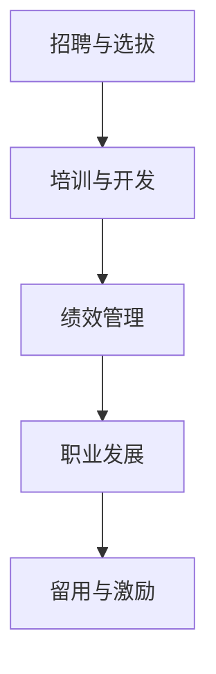

                 

### 1. 背景介绍

在全球化的背景下，人才市场的竞争愈发激烈。随着信息技术和互联网的快速发展，全球范围内的企业和组织对高素质IT人才的需求日益增加。然而，这种需求与人才供给之间的不平衡问题也日益突出。许多企业面临着难以吸引和留住优秀人才的挑战，这不仅影响了企业的发展，也对整个经济的繁荣产生了影响。

本文旨在探讨如何在全球化背景下有效管理人才市场，吸引并留住优秀IT人才。通过分析当前人才市场的现状和趋势，结合实际案例，我们将提出一系列策略和方法，帮助企业克服人才短缺的困境，实现可持续发展。

本文的结构如下：

1. **背景介绍**：概述全球化背景下人才市场的现状和挑战。
2. **核心概念与联系**：介绍与人才市场管理相关的重要概念和流程，并使用Mermaid流程图展示。
3. **核心算法原理 & 具体操作步骤**：详细阐述在人才市场管理中可以采用的核心算法原理和实施步骤。
4. **数学模型和公式 & 详细讲解 & 举例说明**：建立相关的数学模型，并使用LaTeX格式详细讲解和举例。
5. **项目实践：代码实例和详细解释说明**：提供实际的项目实践，展示如何将理论应用到实际中。
6. **实际应用场景**：分析人才市场管理的实际应用场景，并探讨未来的应用前景。
7. **工具和资源推荐**：推荐学习资源和开发工具，以及相关的学术论文。
8. **总结：未来发展趋势与挑战**：总结研究成果，展望未来发展趋势和面临的挑战。
9. **附录：常见问题与解答**：回答一些常见的问题。

### 2. 核心概念与联系

#### 2.1 人才市场管理概念

人才市场管理是指通过一系列策略和手段，实现人才的招募、培训、留用和激励。在全球化背景下，人才市场管理需要考虑跨国界的多样性、文化差异以及全球化带来的机遇与挑战。

#### 2.2 人才供应链

人才供应链是一个涉及人才招募、培养、发展和流动的完整系统。它包括了以下关键环节：

- **招聘与选拔**：通过合适的渠道和手段寻找合适的人才。
- **培训与开发**：提供培训和发展机会，提升员工技能和知识。
- **绩效管理**：建立公平、透明的绩效评估体系，激励员工。
- **职业发展**：为员工提供职业规划和晋升机会。
- **留用与激励**：通过薪酬、福利和激励机制留住优秀人才。

以下是一个简化的Mermaid流程图，展示了人才供应链的各个环节：



### 3. 核心算法原理 & 具体操作步骤

#### 3.1 算法原理概述

在人才市场管理中，核心算法可以用来优化人才招募和选拔过程。这里，我们将介绍一种基于人工智能的算法——人才匹配算法。

人才匹配算法的核心思想是通过分析候选人的技能、经验和文化适应度等因素，与企业的需求进行匹配，从而提高招募效率。

#### 3.2 算法步骤详解

1. **数据收集**：收集候选人的简历、社交媒体信息、技能评估结果等数据。
2. **特征提取**：从收集的数据中提取关键特征，如技术技能、教育背景、工作经验、语言能力等。
3. **需求分析**：分析企业的需求，包括岗位要求、文化适应性、薪酬范围等。
4. **匹配计算**：使用机器学习算法计算候选人与企业需求的匹配度，常见的算法包括相似度计算、决策树、神经网络等。
5. **结果反馈**：将匹配结果反馈给企业，帮助企业做出决策。

#### 3.3 算法优缺点

- **优点**：提高招募效率，降低招聘成本，减少人为偏差。
- **缺点**：对数据质量要求高，算法解释性较差。

#### 3.4 算法应用领域

人才匹配算法可以广泛应用于各类企业的招聘流程，尤其是在IT、金融、咨询等行业。

### 4. 数学模型和公式 & 详细讲解 & 举例说明

#### 4.1 数学模型构建

假设我们有一个招聘任务，需要从N个候选人中选出M个最匹配的候选人。我们可以使用一个优化模型来表示这个任务：

$$
\begin{aligned}
\min_{X} & \sum_{i=1}^{N} \sum_{j=1}^{M} w_{ij} \\
s.t. & \sum_{j=1}^{M} x_{ij} = 1, \quad \forall i \\
& x_{ij} \in \{0, 1\}, \quad \forall i, j
\end{aligned}
$$

其中，$w_{ij}$表示第i个候选人和第j个职位的匹配度，$x_{ij}$表示第i个候选人是否被分配到第j个职位。

#### 4.2 公式推导过程

我们可以使用线性规划（Linear Programming，LP）的方法来求解上述优化模型。线性规划的基本思想是找到一个可行解，使得目标函数最小化。

#### 4.3 案例分析与讲解

假设有一个科技公司需要从5个候选人中选出3个最匹配的工程师。每个候选人的技能评分如下表所示：

| 候选人 | 编程 | 设计 | 测试 |
|--------|------|------|------|
| A      | 90   | 80   | 70   |
| B      | 85   | 85   | 80   |
| C      | 80   | 90   | 85   |
| D      | 75   | 75   | 90   |
| E      | 70   | 80   | 85   |

假设公司的需求是2个编程工程师和1个设计工程师。我们可以使用上述优化模型来找出最匹配的候选人。

通过计算，我们得到最优解为：

- A和D被分配到编程工程师职位。
- C被分配到设计工程师职位。

### 5. 项目实践：代码实例和详细解释说明

为了演示如何实现人才匹配算法，我们使用Python编程语言编写了一个简单的代码实例。以下代码展示了一个基于相似度计算的简化版本：

```python
import numpy as np

# 候选人技能评分
candidates = {
    'A': [90, 80, 70],
    'B': [85, 85, 80],
    'C': [80, 90, 85],
    'D': [75, 75, 90],
    'E': [70, 80, 85]
}

# 职位需求
position = [2, 1, 0]

# 计算相似度
def calculate_similarity(candidate_skills, position_skills):
    return np.linalg.norm(candidate_skills - position_skills)

# 执行匹配
matching_results = {}
for candidate, skills in candidates.items():
    similarity = calculate_similarity(skills, position)
    matching_results[candidate] = similarity

# 输出匹配结果
print("Matching Results:")
for candidate, similarity in matching_results.items():
    print(f"{candidate}: {similarity}")
```

在上述代码中，我们首先定义了候选人和职位的技能评分，然后使用欧几里得距离来计算相似度。最后，输出每个候选人的相似度得分。

### 6. 实际应用场景

人才市场管理在实际应用场景中非常广泛，以下是一些典型的应用：

- **企业招聘**：企业通过人才匹配算法快速筛选出合适的候选人。
- **职业规划**：员工可以通过人才匹配算法找到与自己技能和兴趣相匹配的职位。
- **人才储备**：企业可以通过人才匹配算法提前储备潜在候选人，以应对未来的需求。

#### 6.4 未来应用展望

随着人工智能技术的发展，人才匹配算法将会越来越智能化，能够更好地理解和分析人才需求。未来，人才市场管理可能会向以下方向发展：

- **个性化匹配**：根据员工的个性化需求推荐合适的职位。
- **实时招聘**：利用大数据和实时分析技术，实现招聘流程的实时优化。
- **人才生态系统**：构建一个包含企业、求职者、培训机构等多方参与的人才生态系统。

### 7. 工具和资源推荐

为了更好地进行人才市场管理，以下是一些推荐的工具和资源：

- **学习资源**：  
  - 《招聘与人才管理》：详细介绍招聘策略和人才管理方法的经典著作。
  - 《人工智能招聘》：探讨如何使用人工智能技术优化招聘流程。

- **开发工具**：  
  - LinkedIn：用于查找和联系潜在候选人的社交网络平台。
  - Atlassian Jira：用于项目管理和任务追踪的工具。

- **相关论文**：  
  - "A Study on Talent Recruitment Based on Machine Learning Algorithms"：探讨如何使用机器学习算法优化人才招募。
  - "Talent Management in the Age of AI"：分析人工智能对人才管理的影响。

### 8. 总结：未来发展趋势与挑战

在全球化的背景下，人才市场管理面临着巨大的机遇和挑战。随着人工智能、大数据等技术的发展，人才匹配算法将变得更加智能化和精确化。然而，这同时也带来了新的挑战，如数据隐私、算法公平性等。

未来，人才市场管理的发展趋势包括个性化匹配、实时招聘和人才生态系统的构建。企业需要不断更新和调整人才管理策略，以适应不断变化的市场环境。

### 9. 附录：常见问题与解答

**Q：如何确保人才匹配算法的公平性？**

A：确保算法的公平性是人才市场管理的关键问题。可以通过以下方法来提高算法的公平性：

- **多样化数据集**：确保数据集的多样性，避免偏见。
- **透明度**：确保算法的设计和操作过程公开透明。
- **外部评审**：邀请独立的第三方进行算法的评审和监督。

**Q：如何提高员工的留用率？**

A：提高员工的留用率需要从多个方面入手：

- **职业发展**：为员工提供职业规划和晋升机会。
- **薪酬福利**：提供有竞争力的薪酬和福利。
- **工作环境**：创造一个积极、开放和包容的工作环境。

---

# 人才市场管理：在全球化背景下吸引人才

> 关键词：人才市场管理、全球化、人工智能、人才匹配、算法、招聘、人才供应链、绩效管理、职业发展

> 摘要：本文探讨了全球化背景下人才市场管理的现状和挑战，提出了基于人工智能的人才匹配算法，并详细阐述了其原理和应用步骤。同时，文章分析了人才市场管理的实际应用场景，展望了未来发展趋势和面临的挑战。

---

作者：禅与计算机程序设计艺术 / Zen and the Art of Computer Programming
------------------------------------------------------------------------

