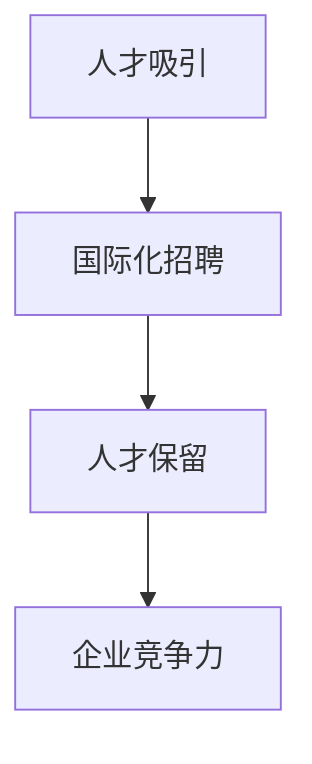

                 

在当今的全球化时代，人才市场管理的重要性愈发凸显。企业不仅要在本地市场招募优秀的员工，还需要在全球范围内寻找并吸引顶尖人才。本文将探讨在全球化背景下如何有效地管理人才市场，以吸引和保留优秀的国际人才。

> 关键词：人才市场管理、全球化、人才吸引、国际化招聘、人才保留

> 摘要：本文首先介绍了全球化对人才市场的影响，然后详细讨论了人才吸引、国际化招聘和人才保留的策略。最后，文章总结了在全球化背景下进行人才市场管理的未来趋势和挑战。

## 1. 背景介绍

全球化带来了市场竞争的加剧，企业需要具备全球视野和竞争力。在这种背景下，人才成为企业最重要的资产。如何在全球范围内吸引、招聘和保留顶尖人才，成为企业人才市场管理的核心问题。

### 全球化对人才市场的影响

- **人才流动性增加**：全球化使人才流动性增加，员工更愿意跨国工作，寻找更好的职业机会。
- **国际化竞争加剧**：企业面临来自全球的竞争对手，需要拥有国际视野和跨国运营能力。
- **文化多样性**：全球化带来了文化多样性，企业需要管理多元化团队，解决文化冲突和沟通问题。
- **人才竞争**：全球顶尖人才竞争激烈，企业需要提供有吸引力的薪酬、福利和工作环境来吸引和留住人才。

### 人才市场管理的重要性

- **企业竞争力**：拥有优秀的人才队伍是企业保持竞争力的关键。
- **创新动力**：多元化的人才能够带来新的想法和视角，推动企业创新。
- **全球化运营**：国际化人才能够帮助企业更好地适应不同市场的需求和挑战。
- **可持续发展**：合理的人才市场管理有助于企业的长期可持续发展。

## 2. 核心概念与联系

### 核心概念原理

- **人才吸引**：通过提供有吸引力的薪酬、福利和职业发展机会，吸引优秀人才。
- **国际化招聘**：在全球范围内寻找和选择最适合企业的人才。
- **人才保留**：通过提供良好的工作环境和职业发展路径，留住优秀人才。

### 架构的 Mermaid 流程图



## 3. 核心算法原理 & 具体操作步骤

### 3.1 算法原理概述

人才市场管理可以看作是一个优化问题，目标是最小化人才流失率，最大化企业竞争力。核心算法包括：

- **人才吸引算法**：基于薪酬、福利和职业发展潜力评估人才吸引力。
- **国际化招聘算法**：结合人才需求和市场供给，选择最适合的人才。
- **人才保留算法**：通过工作环境、职业发展路径和员工满意度评估留住人才。

### 3.2 算法步骤详解

#### 3.2.1 人才吸引算法

1. 收集潜在候选人的信息，包括教育背景、工作经验、技能和职业目标。
2. 使用薪酬调查和市场数据评估候选人的市场价值。
3. 根据候选人的市场价值和职业目标，提供有吸引力的薪酬、福利和职业发展机会。

#### 3.2.2 国际化招聘算法

1. 分析企业的人才需求，确定所需技能和经验。
2. 结合国际人才市场数据，识别潜在的候选人。
3. 对候选人进行初步筛选和面试，选择最适合的人才。

#### 3.2.3 人才保留算法

1. 定期进行员工满意度调查，了解员工的工作环境和职业发展需求。
2. 提供灵活的工作安排和职业发展路径，满足员工的需求。
3. 通过培训和激励计划提高员工的满意度和忠诚度。

### 3.3 算法优缺点

#### 优点

- **高效招聘**：算法可以快速筛选和选择最适合的人才，提高招聘效率。
- **数据驱动**：基于数据和模型进行招聘和保留决策，减少主观判断。
- **全球视野**：国际化招聘算法可以帮助企业在全球范围内寻找最适合的人才。

#### 缺点

- **数据质量**：算法的准确性取决于数据的质量，需要投入大量时间和资源进行数据收集和清洗。
- **适应性强**：算法需要不断调整和优化，以适应不断变化的市场环境和人才需求。
- **文化差异**：国际化招聘中需要考虑文化差异，确保人才能够融入企业文化和团队。

### 3.4 算法应用领域

- **跨国企业**：跨国企业可以利用算法进行全球招聘和人才管理。
- **高科技行业**：高科技行业需要具备专业技能和国际视野的人才，算法可以帮助企业快速筛选和留住人才。
- **新兴市场**：新兴市场的人才市场管理面临挑战，算法可以提供有效的解决方案。

## 4. 数学模型和公式

### 4.1 数学模型构建

人才市场管理的数学模型可以分为以下几个部分：

1. **人才吸引模型**：基于候选人的市场价值和职业目标，计算人才吸引力分数。
2. **国际化招聘模型**：结合企业人才需求和人才市场数据，计算候选人的适合度分数。
3. **人才保留模型**：通过员工满意度调查和职业发展评估，计算员工的保留概率。

### 4.2 公式推导过程

#### 4.2.1 人才吸引模型

人才吸引力分数（TAF）可以通过以下公式计算：

$$ TAF = w_1 \cdot CV + w_2 \cdot WF + w_3 \cdot PD $$

其中，$CV$ 表示候选人的市场价值，$WF$ 表示候选人的福利待遇，$PD$ 表示候选人的职业发展潜力。$w_1, w_2, w_3$ 分别是权重系数，可以根据实际情况调整。

#### 4.2.2 国际化招聘模型

候选人适合度分数（CF）可以通过以下公式计算：

$$ CF = \frac{TD}{TS} $$

其中，$TD$ 表示候选人所需的技能和经验，$TS$ 表示候选人在市场上的供给。

#### 4.2.3 人才保留模型

员工保留概率（RP）可以通过以下公式计算：

$$ RP = \frac{S + D - C}{S + D} $$

其中，$S$ 表示员工的满意度，$D$ 表示员工的职业发展机会，$C$ 表示员工流失成本。

### 4.3 案例分析与讲解

#### 4.3.1 人才吸引案例

某跨国企业希望通过人才吸引模型评估一个候选人的吸引力。根据市场数据，该候选人的市场价值（$CV$）为100,000美元，福利待遇（$WF$）为每年10,000美元，职业发展潜力（$PD$）为80%。假设权重系数分别为$w_1 = 0.5, w_2 = 0.3, w_3 = 0.2$，则人才吸引力分数（$TAF$）为：

$$ TAF = 0.5 \cdot 100,000 + 0.3 \cdot 10,000 + 0.2 \cdot 80 = 53,600 $$

#### 4.3.2 国际化招聘案例

某跨国企业需要招聘一名具备软件开发经验的工程师。根据市场数据，该职位所需的技能和经验（$TD$）为5年，市场上可供选择的工程师数量（$TS$）为100人。则候选人适合度分数（$CF$）为：

$$ CF = \frac{5}{100} = 0.05 $$

#### 4.3.3 人才保留案例

某企业的员工满意度（$S$）为80%，员工的职业发展机会（$D$）为70%，员工流失成本（$C$）为50,000美元。则员工保留概率（$RP$）为：

$$ RP = \frac{80 + 70 - 50}{80 + 70} = \frac{100}{150} = 0.67 $$

## 5. 项目实践：代码实例

### 5.1 开发环境搭建

- **编程语言**：Python
- **工具**：Jupyter Notebook

### 5.2 源代码详细实现

以下是一个简单的Python代码实例，用于计算人才吸引力分数（$TAF$）、候选人适合度分数（$CF$）和员工保留概率（$RP$）。

```python
import pandas as pd

# 人才吸引模型参数
w1 = 0.5
w2 = 0.3
w3 = 0.2

# 国际化招聘模型参数
TD = 5
TS = 100

# 人才保留模型参数
S = 80
D = 70
C = 50000

# 人才吸引模型计算
CV = 100000
WF = 10000
PD = 80
TAF = w1 * CV + w2 * WF + w3 * PD
print("人才吸引力分数（TAF）:", TAF)

# 国际化招聘模型计算
CF = TD / TS
print("候选人适合度分数（CF）:", CF)

# 人才保留模型计算
RP = (S + D - C) / (S + D)
print("员工保留概率（RP）:", RP)
```

### 5.3 代码解读与分析

- **参数设置**：首先设置各个模型的参数，包括人才吸引模型的权重系数（$w_1, w_2, w_3$），国际化招聘模型所需的技能和经验（$TD$）和市场供给（$TS$），以及人才保留模型的员工满意度（$S$）、职业发展机会（$D$）和流失成本（$C$）。
- **计算过程**：根据参数计算人才吸引力分数（$TAF$）、候选人适合度分数（$CF$）和员工保留概率（$RP$）。
- **输出结果**：将计算结果输出到控制台，以便分析和决策。

## 6. 实际应用场景

### 6.1 跨国企业招聘

跨国企业可以利用人才市场管理算法进行全球招聘。例如，某跨国公司在欧洲市场招聘一名软件开发工程师，通过国际化招聘模型筛选合适的候选人，并使用人才吸引模型评估候选人的吸引力，最终选择最适合的人才。

### 6.2 高科技行业人才保留

高科技行业需要保留具备专业技能和国际视野的人才。通过人才保留模型，企业可以评估员工的保留概率，并根据员工满意度、职业发展机会和流失成本制定相应的保留策略。

### 6.3 新兴市场人才管理

在新兴市场，人才市场管理面临挑战。通过数据驱动的算法，企业可以更有效地招聘和留住人才，提高市场竞争力和创新能力。

## 7. 未来应用展望

### 7.1 人工智能与大数据

人工智能和大数据技术的不断发展将进一步提升人才市场管理的效果。通过深度学习和大数据分析，企业可以更精准地预测人才需求和人才流失，制定更有效的招聘和保留策略。

### 7.2 文化多样性管理

全球化带来了文化多样性，企业需要更好地管理多元化团队。未来的研究可以关注如何利用人工智能和大数据技术进行文化多样性分析和管理，提高团队的协作和创新能力。

### 7.3 个性化人才发展

未来的企业将更加注重个性化人才发展，通过个性化推荐系统和人才发展模型，为企业员工提供量身定制的职业发展路径和培训计划。

## 8. 工具和资源推荐

### 8.1 学习资源推荐

- 《人工智能招聘：构建数据驱动的招聘系统》
- 《人才管理：吸引、招聘和保留顶尖人才》

### 8.2 开发工具推荐

- **编程语言**：Python、Java、R
- **数据分析工具**：Pandas、NumPy、Scikit-learn
- **机器学习框架**：TensorFlow、PyTorch、Keras

### 8.3 相关论文推荐

- “AI for Talent Management: A Survey”
- “Big Data and Talent Management: A Research Agenda”
- “Cultural Diversity in the Workplace: The Impact of AI and Analytics”

## 9. 总结：未来发展趋势与挑战

### 9.1 研究成果总结

本文介绍了人才市场管理在全球化背景下的重要性，探讨了人才吸引、国际化招聘和人才保留的策略，并提出了基于数学模型的算法。这些研究成果为企业提供了有效的人才市场管理工具和参考。

### 9.2 未来发展趋势

- **数据驱动**：未来的人才市场管理将更加依赖于数据分析和人工智能技术。
- **文化多样性**：企业将更加关注文化多样性管理，提高团队协作和创新能力。
- **个性化发展**：企业将提供更个性化的职业发展路径和培训计划。

### 9.3 面临的挑战

- **数据质量**：算法的准确性取决于数据的质量，需要投入大量时间和资源进行数据收集和清洗。
- **适应性强**：算法需要不断调整和优化，以适应不断变化的市场环境和人才需求。
- **文化差异**：国际化招聘中需要考虑文化差异，确保人才能够融入企业文化和团队。

### 9.4 研究展望

未来的研究可以关注如何利用人工智能和大数据技术提高人才市场管理的效率和效果，以及如何更好地管理多元化团队和提供个性化的职业发展路径。

## 10. 附录：常见问题与解答

### 问题1：人才吸引模型中的权重系数如何确定？

**解答**：权重系数可以根据企业的具体情况和人才市场环境进行调整。一般建议通过数据分析和专家咨询确定权重系数，以最大化人才吸引力分数。

### 问题2：国际化招聘算法如何处理文化差异？

**解答**：国际化招聘算法可以通过文化差异分析工具和跨文化培训提高候选人的文化适应性。同时，在面试过程中，可以关注候选人的跨文化沟通能力和团队协作能力。

### 问题3：人才保留模型中的员工满意度如何评估？

**解答**：员工满意度可以通过定期调查、员工反馈和绩效评估等多种方式进行评估。企业可以根据实际情况选择合适的评估方法，以确保员工满意度数据的准确性和可靠性。

----------------------------------------------------------------

**作者署名**：禅与计算机程序设计艺术 / Zen and the Art of Computer Programming

