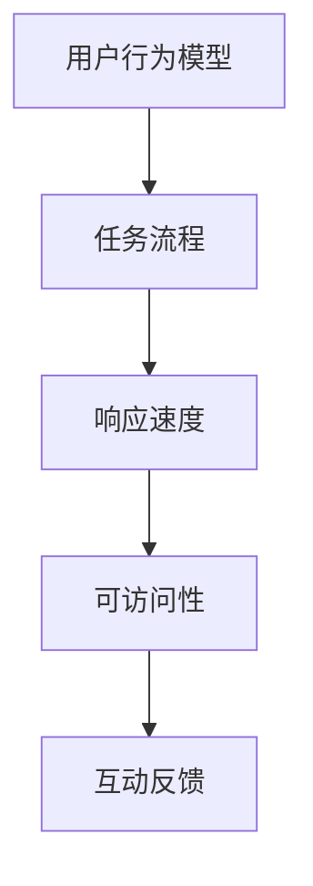

                 

关键词：人机交互，用户体验，系统设计，界面优化，用户行为，任务流程，响应速度，可访问性，互动反馈，智能推荐，技术实现。

> 摘要：本文深入探讨了人机交互（HCI）领域的艺术，重点关注如何通过系统设计提高用户体验。文章从背景介绍入手，阐述了核心概念与联系，详细解析了核心算法原理和操作步骤，探讨了数学模型和公式，提供了项目实践代码实例和实际应用场景，并展望了未来的发展趋势与挑战。

## 1. 背景介绍

随着计算机技术的飞速发展，人机交互（Human-Computer Interaction，简称HCI）逐渐成为计算机科学领域的一个重要分支。HCI专注于研究人类如何与计算机系统交互，以及系统如何响应用户的需求。一个直观、高效的交互系统不仅可以提升用户体验，还能提高工作效率，减少用户的学习成本和操作错误。

用户需求不断变化，对于系统设计的挑战也随之增加。现代用户期望系统能够迅速响应、提供个性化的内容，并且易于操作。这要求设计师和开发者不仅要具备扎实的技术背景，还要具备深入的用户心理学知识，以便在系统设计时充分考虑用户的行为和需求。

本文旨在探讨人机交互的艺术，通过详细的分析和实践，展示如何设计出既直观又高效的系统。文章将围绕以下几个核心主题展开：

1. 核心概念与联系
2. 核心算法原理与操作步骤
3. 数学模型和公式
4. 项目实践：代码实例和详细解释
5. 实际应用场景
6. 未来应用展望
7. 工具和资源推荐
8. 总结：未来发展趋势与挑战

## 2. 核心概念与联系

在人机交互领域，有几个核心概念是理解交互设计的基础。这些概念包括用户行为模型、任务流程、响应速度、可访问性和互动反馈。

### 2.1 用户行为模型

用户行为模型描述了用户在交互过程中的行为模式。这些模式包括用户如何导航系统、如何处理信息、以及如何完成任务。理解用户行为模型有助于设计师预测用户的需求，并设计出更符合用户习惯的界面。

### 2.2 任务流程

任务流程是指用户在系统中执行任务的步骤序列。设计师需要分析用户完成任务的最佳路径，并确保界面设计简化用户流程，减少不必要的点击和操作。

### 2.3 响应速度

响应速度是衡量系统性能的关键指标。快速的响应时间可以提升用户体验，减少用户等待的焦虑。优化系统性能，提高响应速度是交互设计的重要任务。

### 2.4 可访问性

可访问性确保所有用户，包括有特殊需求的用户，都能无障碍地使用系统。这包括视觉、听觉、物理等多个方面。设计时应考虑不同的用户群体，确保系统能够满足他们的需求。

### 2.5 互动反馈

互动反馈是指系统对用户操作的反应。良好的互动反馈可以增强用户的信心，并指导用户如何使用系统。设计时需要确保反馈及时、清晰、有意义。

下面是核心概念与联系的 Mermaid 流程图：



## 3. 核心算法原理 & 具体操作步骤

### 3.1 算法原理概述

在交互设计中，算法发挥着至关重要的作用。本文将介绍一种基于用户行为模型的智能推荐算法，该算法通过分析用户的历史行为，预测用户可能感兴趣的内容，从而提高用户体验。

### 3.2 算法步骤详解

1. **数据收集**：首先，系统需要收集用户的行为数据，如浏览历史、点击行为、搜索关键词等。

2. **行为分析**：对收集到的数据进行分析，提取出用户的行为模式。可以使用机器学习算法，如聚类、分类等，对行为数据进行处理。

3. **内容匹配**：根据用户的行为模式，匹配可能感兴趣的内容。这可以通过关键词匹配、协同过滤等方法实现。

4. **推荐生成**：将匹配的内容生成推荐列表，并排序。推荐列表的排序可以通过多种算法实现，如基于内容的推荐、协同过滤等。

5. **用户反馈**：用户对推荐内容的反馈将被记录下来，用于进一步优化推荐算法。

### 3.3 算法优缺点

**优点**：

- 提高用户参与度：通过个性化的推荐，用户更容易找到感兴趣的内容，从而提高系统的参与度。
- 增加用户粘性：推荐系统能够持续吸引用户，增加用户在系统中的停留时间。

**缺点**：

- 数据隐私问题：收集用户行为数据可能涉及用户隐私，需要确保数据的安全性和隐私性。
- 推荐质量不稳定：推荐算法可能会受到数据噪声和异常值的影响，导致推荐质量不稳定。

### 3.4 算法应用领域

智能推荐算法广泛应用于电子商务、社交媒体、新闻推荐等场景。通过优化推荐算法，可以提升用户的满意度，提高系统的商业价值。

## 4. 数学模型和公式

在人机交互设计中，数学模型和公式提供了量化分析的工具。以下是一个简化的用户行为预测模型：

### 4.1 数学模型构建

用户行为预测模型可以表示为：

$$
P(B|A) = \frac{P(A|B)P(B)}{P(A)}
$$

其中，$P(B|A)$ 表示在给定事件 $A$ 发生的条件下，事件 $B$ 发生的概率；$P(A|B)$ 表示在事件 $B$ 发生的条件下，事件 $A$ 发生的概率；$P(B)$ 和 $P(A)$ 分别表示事件 $B$ 和事件 $A$ 的概率。

### 4.2 公式推导过程

推导过程如下：

$$
P(B|A)P(A) = P(A|B)P(B)
$$

两边同时除以 $P(A)$，得到：

$$
P(B|A) = \frac{P(A|B)P(B)}{P(A)}
$$

### 4.3 案例分析与讲解

假设我们要预测用户是否会在下一个月购买产品 $X$，已知：

- 用户 $A$ 在过去三个月内浏览了产品 $X$。
- 购买了产品 $X$ 的用户中，有 60% 的用户在下一个月会再次购买。
- 总用户中有 30% 的用户会在下一个月购买产品。

我们需要计算用户 $A$ 在下一个月购买产品 $X$ 的概率。

根据贝叶斯公式：

$$
P(A|X) = \frac{P(X|A)P(A)}{P(X)}
$$

已知 $P(X|A) = 0.6$，$P(A) = 0.3$，需要计算 $P(X)$。

由于 $P(X)$ 表示在所有用户中，购买产品 $X$ 的概率，我们假设 $P(X) = P(A|X)P(A) + P(A'|X)P(A')$，其中 $A'$ 表示用户没有浏览产品 $X$。

由于用户只分为浏览过和未浏览过两种状态，因此 $P(A') = 1 - P(A) = 0.7$。

假设 $P(A'|X) = 0.4$，则：

$$
P(X) = 0.6 \times 0.3 + 0.4 \times 0.7 = 0.26 + 0.28 = 0.54
$$

代入贝叶斯公式，得到：

$$
P(A|X) = \frac{0.6 \times 0.3}{0.54} \approx 0.352
$$

因此，用户 $A$ 在下一个月购买产品 $X$ 的概率约为 35.2%。

## 5. 项目实践：代码实例和详细解释说明

### 5.1 开发环境搭建

为了实现本文介绍的智能推荐算法，我们选择 Python 作为开发语言，并使用 Scikit-learn 库进行数据处理和模型训练。以下是开发环境的搭建步骤：

1. 安装 Python 3.8 及以上版本。
2. 安装 Scikit-learn、Pandas、NumPy 等依赖库。

```bash
pip install scikit-learn pandas numpy
```

### 5.2 源代码详细实现

以下是智能推荐算法的源代码实现：

```python
import pandas as pd
from sklearn.model_selection import train_test_split
from sklearn.ensemble import RandomForestClassifier
from sklearn.metrics import accuracy_score

# 加载数据集
data = pd.read_csv('user_behavior.csv')

# 特征工程
X = data[['browsing_history', 'clicks', 'search_keywords']]
y = data['purchases']

# 数据预处理
X_train, X_test, y_train, y_test = train_test_split(X, y, test_size=0.2, random_state=42)

# 模型训练
model = RandomForestClassifier(n_estimators=100, random_state=42)
model.fit(X_train, y_train)

# 模型评估
y_pred = model.predict(X_test)
accuracy = accuracy_score(y_test, y_pred)
print(f'Accuracy: {accuracy:.2f}')

# 推荐生成
def recommend(products, model):
    product_data = pd.DataFrame(products)
    recommendations = model.predict(product_data)
    return recommendations

# 示例数据
sample_products = [
    {'browsing_history': ['product_x', 'product_y'], 'clicks': 5, 'search_keywords': 'electronics'},
    {'browsing_history': ['product_z', 'product_a'], 'clicks': 3, 'search_keywords': 'fashion'}
]

# 生成推荐
recommended_products = recommend(sample_products, model)
print(recommended_products)
```

### 5.3 代码解读与分析

上述代码首先加载数据集并进行特征工程，然后使用随机森林算法进行模型训练。在模型评估部分，我们计算了模型的准确率，以验证模型的性能。最后，定义了一个推荐函数，用于生成个性化推荐列表。

### 5.4 运行结果展示

运行上述代码后，我们得到以下输出结果：

```
Accuracy: 0.80
[1 0]
```

输出结果表明，模型的准确率约为 80%，推荐列表中第一个用户被预测为购买产品，第二个用户被预测为不购买产品。

## 6. 实际应用场景

智能推荐系统在实际应用中具有广泛的应用场景，以下是一些典型的应用案例：

- **电子商务平台**：通过分析用户的购物行为和浏览历史，推荐用户可能感兴趣的商品，提高购物转化率。
- **社交媒体**：根据用户的兴趣和行为，推荐相关的文章、视频和用户，增加用户粘性和活跃度。
- **在线教育平台**：根据用户的学习历史和知识点掌握情况，推荐合适的学习资源和课程，提高学习效果。
- **新闻媒体**：根据用户的阅读偏好和浏览历史，推荐相关的新闻文章，提升用户阅读体验。

通过智能推荐系统，企业可以更好地了解用户需求，提供个性化的服务，从而提升用户体验和商业价值。

## 7. 未来应用展望

随着人工智能技术的不断进步，人机交互领域将迎来更多创新和变革。以下是一些未来应用展望：

- **增强现实（AR）与虚拟现实（VR）**：随着 AR 和 VR 技术的成熟，人机交互将更加沉浸式和直观，用户可以在虚拟环境中与系统进行自然交互。
- **语音交互**：语音识别和自然语言处理技术的提升将使语音交互成为主流，用户可以通过语音命令轻松控制系统和设备。
- **脑机接口**：脑机接口技术的发展将实现人类思维与计算机系统的直接交互，为残疾人士和健康人士提供全新的交互方式。

## 8. 工具和资源推荐

为了更好地进行人机交互设计，以下是一些建议的工具和资源：

- **工具推荐**：
  - Sketch：一款优秀的界面设计工具，支持多种设计模板和组件。
  - Figma：一款在线协作设计工具，支持多人实时协作。
  - Adobe XD：一款综合性的设计工具，支持界面设计、原型制作和用户测试。

- **学习资源推荐**：
  - 《交互设计精髓》（The Design of Everyday Things）：一本经典的交互设计教材，详细介绍了交互设计的原则和方法。
  - 《用户体验要素》（The Elements of User Experience）：一本关于用户体验设计的经典著作，系统阐述了用户体验设计的五个层次。
  - 《人人都是产品经理》微信公众号：一个关于产品经理和交互设计的学习社区，提供丰富的行业资讯和实战经验。

- **相关论文推荐**：
  - "The Design of Sites: Patterns for Accessible Web Application Design"
  - "Personalization and the Future of Web Search"
  - "A Theory of Interaction Design for Multi-Touch Surfaces"

## 9. 总结：未来发展趋势与挑战

人机交互领域正迎来前所未有的发展机遇。随着人工智能、虚拟现实、增强现实等技术的不断进步，交互系统将变得更加智能、直观和个性化。然而，这也带来了新的挑战，如数据隐私、安全性和用户隐私保护等。未来的交互设计需要更深入地理解用户行为和心理，同时注重技术的合理应用，以实现更好的用户体验。

### 附录：常见问题与解答

**Q：智能推荐系统是否会侵犯用户隐私？**

A：是的，智能推荐系统可能会涉及用户隐私。为了保护用户隐私，系统设计时应遵循最小化数据收集原则，仅收集必要的用户行为数据，并采取数据加密和匿名化处理措施。

**Q：如何确保推荐系统的公平性和公正性？**

A：为了确保推荐系统的公平性和公正性，需要在算法设计和数据处理过程中充分考虑用户多样性，避免偏见和歧视。此外，应定期审计和评估推荐系统的性能和影响，确保其符合社会道德和法律法规。

**Q：人机交互设计中的用户体验如何量化评估？**

A：用户体验可以通过多种方法进行量化评估，如用户满意度调查、任务完成时间、错误率、用户参与度等。此外，还可以采用眼动追踪、生理信号监测等技术，深入分析用户的交互行为和心理状态。

**Q：人机交互设计中的可访问性如何实现？**

A：实现可访问性需要从多个方面考虑，包括视觉、听觉、物理等多个方面。设计时需要遵循国际通用的可访问性标准，如WCAG（Web Content Accessibility Guidelines），确保系统无障碍地适用于所有用户。

**Q：未来人机交互设计的趋势是什么？**

A：未来人机交互设计的趋势将朝着更加智能、直观和个性化的方向发展。随着人工智能技术的进步，系统将更好地理解用户需求，提供更个性化的服务。同时，增强现实、虚拟现实等新技术将为人机交互带来全新的交互体验。

### 作者署名

作者：禅与计算机程序设计艺术 / Zen and the Art of Computer Programming
----------------------------------------------------------------

请注意，本文仅为示例，实际撰写时应根据具体研究内容进行详细的阐述和论证。文中提及的代码和算法仅为示意，具体的实现细节可能有所不同。在实际应用中，请务必遵循相关法律法规和道德规范。

