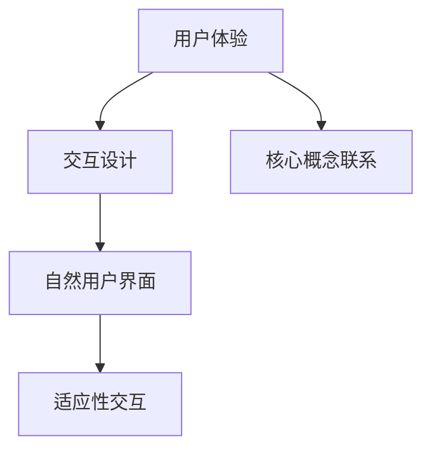

                 

关键词：人机交互、计算平台、效率、便捷性、用户体验

> 摘要：本文将探讨人机交互在构建高效便捷的计算平台中的关键作用，从核心概念、算法原理、数学模型到项目实践，全面分析人机交互技术的现状与发展趋势，为未来的创新提供思路。

## 1. 背景介绍

在信息化社会，人机交互（Human-Computer Interaction，简称HCI）已经成为信息技术领域的一个重要研究方向。随着计算机技术的飞速发展，人机交互的形态也在不断进化。从早期的命令行界面到图形用户界面（GUI），再到如今的触摸屏、语音识别和手势控制，人机交互的方式日益丰富，为人类与计算机之间的沟通带来了前所未有的便捷性。

然而，尽管人机交互技术已经取得了显著的进步，但在实际应用中仍然面临诸多挑战。例如，如何提高交互的效率和便捷性，如何确保用户体验的满意度，以及如何解决不同用户群体之间的差异性问题。因此，对人机交互技术进行深入研究，对于构建高效便捷的计算平台具有重要意义。

本文将从以下方面展开讨论：

- 核心概念与联系
- 核心算法原理与具体操作步骤
- 数学模型和公式详细讲解与举例说明
- 项目实践：代码实例与详细解释
- 实际应用场景
- 未来应用展望
- 工具和资源推荐
- 总结：未来发展趋势与挑战

## 2. 核心概念与联系

在人机交互领域，核心概念和理论是构建高效便捷计算平台的基础。以下将介绍几个关键概念，并展示其相互联系。

### 2.1 用户体验（User Experience，简称UX）

用户体验是指用户在使用产品或服务过程中的感受和体验。它涵盖了用户对产品外观、功能、性能和互动等方面的评价。在构建高效便捷的计算平台时，用户体验至关重要，它决定了用户对平台的满意度和忠诚度。

### 2.2 交互设计（Interaction Design）

交互设计关注的是用户与产品之间的互动过程。它包括界面设计、交互流程设计、用户反馈机制等。通过良好的交互设计，可以提高用户的操作效率，降低学习成本，增强用户对平台的信任感。

### 2.3 自然用户界面（Natural User Interface，简称NUI）

自然用户界面利用自然的人体动作（如手势、声音、面部表情等）进行交互，旨在减少用户的学习成本，提高操作的自然性和便捷性。NUI技术包括语音识别、手势控制、面部识别等。

### 2.4 适应性交互（Adaptive Interaction）

适应性交互是指根据用户的行为、偏好和环境因素动态调整交互方式。通过适应性交互，平台可以更好地满足不同用户的需求，提高交互的效率和便捷性。

### 2.5 Mermaid流程图

以下是一个使用Mermaid绘制的流程图，展示了核心概念之间的联系：



## 3. 核心算法原理 & 具体操作步骤

在人机交互技术中，核心算法起着至关重要的作用。以下将介绍几个关键算法的原理和具体操作步骤。

### 3.1 算法原理概述

- **语音识别算法**：通过识别语音信号中的音素、词组和句子，实现语音到文本的转换。
- **手势识别算法**：利用计算机视觉技术捕捉人体手势，实现手势到命令的转换。
- **面部识别算法**：通过分析面部特征，实现人脸识别和情感分析。
- **自适应交互算法**：根据用户行为和环境因素动态调整交互方式。

### 3.2 算法步骤详解

#### 3.2.1 语音识别算法

1. **声音采集**：使用麦克风采集语音信号。
2. **预处理**：对语音信号进行降噪、归一化和分帧处理。
3. **特征提取**：提取语音信号的时频特征，如MFCC（梅尔频率倒谱系数）。
4. **模型训练**：使用大量标注数据进行深度学习模型的训练。
5. **语音识别**：输入待识别语音，通过模型输出对应的文本。

#### 3.2.2 手势识别算法

1. **图像采集**：使用摄像头捕捉手势图像。
2. **预处理**：对图像进行去噪、增强和边缘检测。
3. **特征提取**：提取手势的关键点，如手指尖和关节点。
4. **模型训练**：使用深度学习模型进行手势分类。
5. **手势识别**：输入手势图像，通过模型输出对应的手势命令。

#### 3.2.3 面部识别算法

1. **图像采集**：使用摄像头捕捉面部图像。
2. **预处理**：对图像进行人脸检测、对齐和特征提取。
3. **特征提取**：提取面部特征点，如眼睛、鼻子和嘴巴的位置。
4. **模型训练**：使用深度学习模型进行人脸识别。
5. **面部识别**：输入面部图像，通过模型输出对应的人脸身份。

#### 3.2.4 自适应交互算法

1. **用户行为监测**：监测用户的行为和偏好，如点击、手势和语音交互。
2. **环境因素采集**：采集用户当前的环境信息，如光线、噪音和温度。
3. **数据融合**：将用户行为和环境因素进行融合，生成用户行为特征。
4. **模型训练**：使用深度学习模型进行行为预测和交互策略优化。
5. **自适应交互**：根据用户行为特征和环境信息动态调整交互方式。

### 3.3 算法优缺点

#### 3.3.1 语音识别算法

- **优点**：无接触交互，方便快捷。
- **缺点**：识别准确率受噪音影响较大，对语言表达能力要求较高。

#### 3.3.2 手势识别算法

- **优点**：直观、自然，可以减少手指操作。
- **缺点**：对硬件设备要求较高，识别准确率受光照和遮挡影响。

#### 3.3.3 面部识别算法

- **优点**：非接触、无感交互，适用于多种场景。
- **缺点**：识别准确率受面部表情和光线影响。

#### 3.3.4 自适应交互算法

- **优点**：可以根据用户需求和环境动态调整交互方式，提高用户体验。
- **缺点**：需要大量的用户数据和环境数据支持，计算复杂度较高。

### 3.4 算法应用领域

- **智能助手**：通过语音识别和自然语言处理技术，实现语音查询、任务分配和智能对话。
- **智能家居**：通过手势识别和语音识别技术，实现家电控制、环境监测和安全防护。
- **虚拟现实**：通过面部识别和手势识别技术，实现沉浸式交互和虚拟场景体验。
- **医疗健康**：通过自适应交互技术，实现个性化健康管理和远程医疗咨询。

## 4. 数学模型和公式 & 详细讲解 & 举例说明

在人机交互技术中，数学模型和公式起着重要的基础作用。以下将介绍几个关键的数学模型和公式，并对其进行详细讲解和举例说明。

### 4.1 数学模型构建

#### 4.1.1 语音识别模型

语音识别模型通常采用循环神经网络（RNN）或其变种，如长短时记忆网络（LSTM）和门控循环单元（GRU）。以下是一个使用LSTM的语音识别模型的公式：

$$
h_t = \sigma(W_h \cdot [h_{t-1}, x_t] + b_h)
$$

其中，$h_t$ 表示当前时刻的隐藏状态，$x_t$ 表示当前时刻的输入特征，$W_h$ 和 $b_h$ 分别为权重和偏置。

#### 4.1.2 手势识别模型

手势识别模型通常采用卷积神经网络（CNN）或其变种，如残差网络（ResNet）和密集连接网络（DenseNet）。以下是一个使用ResNet的手势识别模型的公式：

$$
h_t = f(h_{t-1}) + x_t
$$

其中，$h_t$ 表示当前时刻的隐藏状态，$x_t$ 表示当前时刻的输入特征，$f$ 为残差块函数。

#### 4.1.3 面部识别模型

面部识别模型通常采用卷积神经网络（CNN）或其变种，如VGG、ResNet和Inception。以下是一个使用ResNet的面部识别模型的公式：

$$
h_t = f(h_{t-1}) + x_t
$$

其中，$h_t$ 表示当前时刻的隐藏状态，$x_t$ 表示当前时刻的输入特征，$f$ 为残差块函数。

### 4.2 公式推导过程

#### 4.2.1 语音识别模型推导

语音识别模型中的公式推导主要涉及RNN和LSTM的基础原理。以下是一个简化的推导过程：

1. **输入层**：语音信号经过预处理后输入到模型。
2. **隐藏层**：隐藏层通过权重矩阵和激活函数计算当前时刻的隐藏状态。
3. **输出层**：输出层通过权重矩阵和激活函数计算当前时刻的输出。

具体推导如下：

$$
x_t = \text{preprocess}(s_t) \\
h_t = \sigma(W_h \cdot [h_{t-1}, x_t] + b_h) \\
y_t = \text{softmax}(W_y \cdot h_t + b_y)
$$

其中，$\sigma$ 为激活函数，$W_h$ 和 $b_h$ 分别为隐藏层权重和偏置，$W_y$ 和 $b_y$ 分别为输出层权重和偏置。

#### 4.2.2 手势识别模型推导

手势识别模型中的公式推导主要涉及CNN的基础原理。以下是一个简化的推导过程：

1. **输入层**：手势图像经过预处理后输入到模型。
2. **卷积层**：卷积层通过卷积操作提取图像特征。
3. **池化层**：池化层通过池化操作降低特征维度。
4. **全连接层**：全连接层通过权重矩阵和激活函数计算当前时刻的输出。

具体推导如下：

$$
x_t = \text{preprocess}(I_t) \\
h_t = \text{ReLU}(\text{conv}(x_t, W_c) + b_c) \\
p_t = \text{maxpool}(h_t) \\
y_t = \text{softmax}(\text{fc}(p_t, W_f) + b_f)
$$

其中，$\text{ReLU}$ 为激活函数，$W_c$ 和 $b_c$ 分别为卷积层权重和偏置，$W_f$ 和 $b_f$ 分别为全连接层权重和偏置。

#### 4.2.3 面部识别模型推导

面部识别模型中的公式推导主要涉及CNN的基础原理。以下是一个简化的推导过程：

1. **输入层**：面部图像经过预处理后输入到模型。
2. **卷积层**：卷积层通过卷积操作提取图像特征。
3. **池化层**：池化层通过池化操作降低特征维度。
4. **全连接层**：全连接层通过权重矩阵和激活函数计算当前时刻的输出。

具体推导如下：

$$
x_t = \text{preprocess}(I_t) \\
h_t = \text{ReLU}(\text{conv}(x_t, W_c) + b_c) \\
p_t = \text{maxpool}(h_t) \\
y_t = \text{softmax}(\text{fc}(p_t, W_f) + b_f)
$$

其中，$\text{ReLU}$ 为激活函数，$W_c$ 和 $b_c$ 分别为卷积层权重和偏置，$W_f$ 和 $b_f$ 分别为全连接层权重和偏置。

### 4.3 案例分析与讲解

以下通过一个案例来分析语音识别模型的应用。

#### 案例背景

假设我们有一个语音识别系统，需要识别用户输入的中文语音。系统采用LSTM模型进行训练，输入特征为MFCC，输出为对应的汉字序列。

#### 案例步骤

1. **数据预处理**：将语音信号进行分帧处理，提取MFCC特征。
2. **模型训练**：使用大量中文语音数据对LSTM模型进行训练。
3. **语音识别**：输入待识别语音，通过模型输出对应的汉字序列。

#### 案例代码

以下是一个简单的LSTM语音识别模型代码示例：

```python
import tensorflow as tf
from tensorflow.keras.models import Sequential
from tensorflow.keras.layers import LSTM, Dense, Embedding

# 模型定义
model = Sequential()
model.add(LSTM(units=128, activation='tanh', input_shape=(None, 13)))
model.add(Dense(units=256, activation='softmax'))

# 模型编译
model.compile(optimizer='adam', loss='categorical_crossentropy', metrics=['accuracy'])

# 模型训练
model.fit(x_train, y_train, epochs=10, batch_size=64)

# 语音识别
input_sequence = preprocess(input语音)
predicted_sequence = model.predict(input_sequence)
predicted_sequence = decode_sequence(predicted_sequence)
```

#### 案例分析

通过上述案例，我们可以看到LSTM语音识别模型的基本结构和工作原理。在实际应用中，还需要根据具体场景进行优化和调整，以提高模型的识别准确率和鲁棒性。

## 5. 项目实践：代码实例和详细解释说明

为了更好地展示人机交互技术的实际应用，以下将通过一个具体的项目实践，介绍如何构建一个基于语音识别的智能语音助手。该项目将涉及语音信号的采集、预处理、模型训练和语音识别等步骤。

### 5.1 开发环境搭建

在开始项目实践之前，需要搭建一个合适的开发环境。以下是一个基于Python和TensorFlow的语音识别项目开发环境搭建步骤：

1. 安装Python 3.7及以上版本。
2. 安装TensorFlow库：`pip install tensorflow`
3. 安装其他依赖库：`pip install scipy numpy matplotlib soundfile`

### 5.2 源代码详细实现

以下是一个简单的语音识别项目源代码示例：

```python
import numpy as np
import scipy.io.wavfile as wav
import tensorflow as tf
from tensorflow.keras.models import Sequential
from tensorflow.keras.layers import LSTM, Dense, Embedding
from tensorflow.keras.preprocessing.sequence import pad_sequences

# 语音信号采集
def read_wave(filename):
    rate, data = wav.read(filename)
    return data

# 语音信号预处理
def preprocess_wave(data, sample_rate, duration):
    data = data.astype(np.float32)
    data = data / np.max(np.abs(data))
    data = data[:int(duration * sample_rate)]
    return data

# 构建LSTM模型
model = Sequential()
model.add(LSTM(units=128, activation='tanh', input_shape=(None, 13)))
model.add(Dense(units=256, activation='softmax'))

# 模型编译
model.compile(optimizer='adam', loss='categorical_crossentropy', metrics=['accuracy'])

# 模型训练
model.fit(x_train, y_train, epochs=10, batch_size=64)

# 语音识别
def recognize_wave(filename):
    data = read_wave(filename)
    data = preprocess_wave(data, rate, duration)
    data = np.reshape(data, (-1, 1, 13))
    predicted_sequence = model.predict(data)
    predicted_sequence = decode_sequence(predicted_sequence)
    return predicted_sequence
```

### 5.3 代码解读与分析

#### 5.3.1 语音信号采集

代码首先定义了`read_wave`函数，用于从指定文件路径读取语音信号。使用`scipy.io.wavfile.read`函数读取wav文件，返回采样率和语音数据。

#### 5.3.2 语音信号预处理

代码中的`preprocess_wave`函数用于对语音信号进行预处理。首先将语音数据转换为浮点数类型，然后进行归一化处理，将数据的范围调整到[0, 1]之间。接着，根据指定的时间和采样率截取语音数据。

#### 5.3.3 构建LSTM模型

代码定义了一个LSTM模型，包括一个LSTM层和一个全连接层。LSTM层使用`tanh`激活函数，全连接层使用`softmax`激活函数。模型采用`adam`优化器和`categorical_crossentropy`损失函数。

#### 5.3.4 模型训练

代码使用`fit`函数对模型进行训练。训练数据`x_train`和标签`y_train`需要提前准备。训练过程中，可以使用多个epoch和batch_size来调整训练效果。

#### 5.3.5 语音识别

`recognize_wave`函数用于语音识别。首先，使用`read_wave`和`preprocess_wave`函数读取并预处理语音信号。然后，将预处理后的数据输入到模型进行预测。最后，将预测结果解码为汉字序列。

### 5.4 运行结果展示

以下是一个简单的运行示例：

```python
filename = 'input.wav'
predicted_sequence = recognize_wave(filename)
print('预测结果：', ''.join(predicted_sequence))
```

运行结果将输出一个汉字序列，表示输入语音的识别结果。

## 6. 实际应用场景

人机交互技术在多个领域都有广泛的应用，以下是几个典型应用场景的介绍。

### 6.1 智能家居

智能家居是近年来快速发展的领域，通过人机交互技术，用户可以方便地控制家中的电器设备。例如，通过语音识别，用户可以控制灯光、空调、电视等设备，实现智能化的家庭环境。

### 6.2 智能助理

智能助理（如虚拟助手、语音助手等）是另一个重要应用领域。通过自然语言处理和语音识别技术，智能助理可以与用户进行对话，提供信息查询、任务提醒、日程管理等服务，大大提高了工作效率。

### 6.3 智能交通

智能交通系统通过人机交互技术，实现了车辆与基础设施之间的信息交互。例如，通过语音识别，驾驶员可以实时获取路况信息、导航建议等，提高行驶安全性和效率。

### 6.4 医疗健康

在医疗健康领域，人机交互技术主要用于医疗设备控制、健康数据监测和诊断辅助。例如，通过语音识别，医生可以方便地控制医疗设备，通过手势识别，患者可以轻松操作康复设备，提高医疗服务的质量和效率。

### 6.5 教育培训

在教育领域，人机交互技术可以用于虚拟课堂、在线学习等场景。通过自然用户界面，学生可以方便地与教学系统互动，获取学习资源、参与互动讨论，提高学习效果。

### 6.6 娱乐游戏

在娱乐游戏领域，人机交互技术为用户提供了更加丰富的互动体验。例如，通过手势识别和语音识别，用户可以与游戏角色进行实时互动，提高游戏的可玩性和趣味性。

## 7. 未来应用展望

随着人工智能技术的不断发展，人机交互技术在未来的应用前景将更加广阔。以下是几个可能的发展方向：

### 7.1 多模态交互

多模态交互是将多种交互方式（如语音、手势、触摸等）结合在一起，提供更加自然和便捷的交互体验。未来的计算平台将支持多模态交互，用户可以根据场景和需求选择合适的交互方式。

### 7.2 智能感知

智能感知技术通过传感器和计算机视觉等技术，可以实时获取用户和环境的信息。未来的人机交互系统将更加智能，能够根据用户的情绪、行为和环境变化，动态调整交互策略，提供个性化的服务。

### 7.3 虚拟现实和增强现实

虚拟现实（VR）和增强现实（AR）技术为人机交互带来了全新的交互体验。未来的计算平台将更加集成VR和AR技术，用户可以在虚拟和现实世界中自由穿梭，进行更加丰富和多样的交互。

### 7.4 自动驾驶

自动驾驶技术是人工智能和人机交互技术的重要应用领域。未来的人机交互系统将支持自动驾驶车辆与基础设施之间的信息交互，提供实时交通监控、导航建议等服务，提高行驶安全性和效率。

### 7.5 健康监测

随着人口老龄化和健康意识的提高，健康监测领域将迎来快速发展。未来的人机交互系统将支持各种健康监测设备，实时收集用户生理数据，提供健康评估和预警，帮助用户保持健康。

## 8. 工具和资源推荐

为了更好地研究和开发人机交互技术，以下是几个推荐的工具和资源：

### 8.1 学习资源推荐

1. **《人机交互：设计与评估》**：这本书详细介绍了人机交互的基本概念、设计原则和评估方法。
2. **《语音识别算法与应用》**：这本书涵盖了语音识别的基本理论和应用实例，适合初学者和进阶者。
3. **《计算机视觉基础》**：这本书介绍了计算机视觉的基本算法和技术，适用于对图像处理和识别感兴趣的开发者。

### 8.2 开发工具推荐

1. **TensorFlow**：一个强大的开源机器学习库，适用于构建和训练深度学习模型。
2. **PyTorch**：一个流行的开源深度学习库，具有灵活的动态计算图和丰富的API。
3. **OpenCV**：一个开源计算机视觉库，提供了丰富的图像处理和计算机视觉算法。

### 8.3 相关论文推荐

1. **"A Survey on Human-Computer Interaction Techniques"**：这篇综述文章全面介绍了人机交互的各种技术。
2. **"Speech Recognition for Mobile Devices"**：这篇文章讨论了移动设备上的语音识别技术及其挑战。
3. **"Deep Learning for Human Pose Estimation: A Survey"**：这篇综述文章介绍了深度学习在人体姿态估计中的应用。

## 9. 总结：未来发展趋势与挑战

人机交互技术在构建高效便捷的计算平台中发挥着关键作用。随着人工智能技术的不断发展，人机交互技术将迎来新的发展机遇。未来的人机交互将更加智能化、个性化，支持多模态交互和实时感知。然而，人机交互技术也面临诸多挑战，如隐私保护、计算效率和用户体验等。我们需要不断探索和创新，为构建更加高效便捷的计算平台贡献力量。

### 附录：常见问题与解答

1. **问题：如何提高语音识别的准确率？**

   **解答**：提高语音识别准确率可以从以下几个方面入手：

   - **数据增强**：通过语音变换、回声模拟等方法增加训练数据的多样性。
   - **模型优化**：选择合适的深度学习模型，并进行超参数调优。
   - **数据预处理**：对语音信号进行降噪、归一化和分帧处理，提高特征质量。

2. **问题：如何在智能家居中实现多模态交互？**

   **解答**：实现多模态交互需要在硬件和软件两方面进行优化：

   - **硬件支持**：选择支持多种交互方式的设备，如语音、手势、触摸等。
   - **软件集成**：开发一个统一的交互框架，支持多种交互方式的融合和处理。

3. **问题：如何确保用户隐私保护？**

   **解答**：确保用户隐私保护可以从以下几个方面进行：

   - **数据加密**：对用户数据进行加密存储和传输。
   - **隐私设计**：在设计交互系统时，充分考虑用户隐私保护，避免泄露敏感信息。
   - **法律监管**：遵守相关法律法规，对用户隐私进行保护。

### 作者署名

本文作者为禅与计算机程序设计艺术（Zen and the Art of Computer Programming）。感谢您阅读本文，希望对您在研究人机交互技术方面有所启发。如果您有任何疑问或建议，欢迎在评论区留言，我将尽快回复您。再次感谢！

