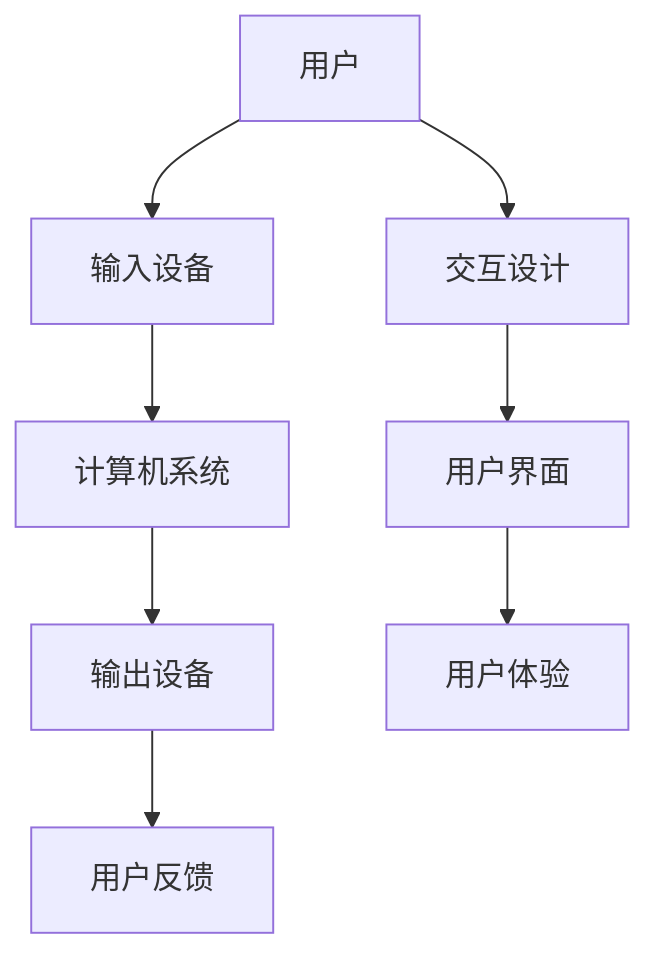

                 

关键词：人机交互，自然语言处理，智能助手，语音识别，界面设计，用户体验

> 摘要：本文将探讨人机交互的未来趋势与展望。通过分析当前的技术进展，探讨新兴技术如何改变人机交互的方式，以及预测未来人机交互的发展方向。文章旨在为读者提供一个全面而深入的视角，了解人机交互领域的最新动态及其未来前景。

## 1. 背景介绍

### 1.1 人机交互的定义和重要性

人机交互（Human-Computer Interaction，简称HCI）是研究人与计算机之间如何有效互动的学科。它涵盖了多个领域，包括心理学、计算机科学、设计学等。随着计算机技术的快速发展，人机交互的重要性日益凸显。

人机交互的目标是使计算机系统更加人性化、易用和高效。通过优化用户界面和交互流程，人机交互技术能够提高用户的生产力和满意度，降低学习成本和错误率。

### 1.2 当前人机交互的挑战和机遇

尽管人机交互技术在近年来取得了显著进展，但仍面临一些挑战和机遇：

- **挑战**：
  - **用户需求多样**：不同用户对交互方式、界面设计和操作体验的需求差异巨大。
  - **技术复杂性**：实现高效的人机交互需要复杂的技术支持，如自然语言处理、机器学习等。
  - **隐私和安全性**：随着交互的深度增加，用户隐私和数据安全成为重要问题。

- **机遇**：
  - **人工智能的进步**：人工智能技术为人机交互带来了新的可能性，如智能助手、语音识别等。
  - **物联网的普及**：物联网设备的大量接入为人机交互提供了新的场景和应用。

## 2. 核心概念与联系

### 2.1 人机交互的核心概念

- **用户界面**（User Interface，简称UI）：用户与计算机系统交互的界面，包括图形界面、文本界面等。
- **用户体验**（User Experience，简称UX）：用户在使用产品或系统过程中的整体感受。
- **交互设计**：设计用户界面和交互流程，以优化用户体验。

### 2.2 人机交互的架构



## 3. 核心算法原理 & 具体操作步骤

### 3.1 算法原理概述

人机交互的核心算法主要涉及自然语言处理（NLP）和机器学习（ML）技术。NLP使计算机能够理解、解释和生成人类语言，而ML则通过数据训练模型，以实现智能交互。

### 3.2 算法步骤详解

1. **数据收集**：收集大量用户交互数据，包括语音、文本、手势等。
2. **特征提取**：从原始数据中提取有用的特征，如关键词、语音波形等。
3. **模型训练**：使用ML算法（如神经网络、决策树等）对特征进行训练，以建立交互模型。
4. **交互实现**：通过用户界面，将用户输入转换为计算机可理解的形式，并输出计算机生成的响应。

### 3.3 算法优缺点

- **优点**：
  - **个性化**：通过用户数据，算法能够提供个性化的交互体验。
  - **高效性**：自动化处理大量用户请求，提高交互效率。

- **缺点**：
  - **准确性问题**：特别是在处理自然语言时，算法可能无法完全理解用户的意图。
  - **隐私和安全**：用户数据的收集和处理可能带来隐私和安全风险。

### 3.4 算法应用领域

- **智能助手**：如 Siri、Alexa 等，能够响应用户的语音指令。
- **虚拟现实**：通过手势和动作识别，实现更自然的交互体验。
- **智能家居**：通过语音控制，实现家庭设备的自动化管理。

## 4. 数学模型和公式 & 详细讲解 & 举例说明

### 4.1 数学模型构建

人机交互的数学模型通常涉及概率模型、决策树、神经网络等。以下是一个简单的概率模型示例：

$$ P(用户行为|系统响应) = \frac{P(系统响应|用户行为) \cdot P(用户行为)}{P(系统响应)} $$

### 4.2 公式推导过程

假设我们有用户行为A和系统响应B，公式推导过程如下：

1. **条件概率**：计算在给定用户行为A下，系统响应B的概率。
2. **贝叶斯定理**：将条件概率转换为后验概率。
3. **归一化**：确保概率总和为1。

### 4.3 案例分析与讲解

假设用户A想要购买一本名为《深度学习》的书籍。系统根据用户历史购买记录和当前搜索关键词，生成响应B，推荐该书籍。

- **用户行为**：P(用户行为 = 购买书籍) = 0.6
- **系统响应**：P(系统响应 = 推荐书籍) = 0.8
- **条件概率**：P(系统响应 = 推荐书籍 | 用户行为 = 购买书籍) = 0.9

根据贝叶斯定理：

$$ P(用户行为 = 购买书籍 | 系统响应 = 推荐书籍) = \frac{0.9 \cdot 0.6}{0.8} = 0.75 $$

这意味着，在系统推荐书籍的情况下，用户购买书籍的概率为75%。

## 5. 项目实践：代码实例和详细解释说明

### 5.1 开发环境搭建

在Python环境中，我们需要安装几个关键库，如TensorFlow、NumPy等。

```bash
pip install tensorflow numpy
```

### 5.2 源代码详细实现

以下是使用TensorFlow实现的一个简单的自然语言处理模型：

```python
import tensorflow as tf
from tensorflow.keras.preprocessing.text import Tokenizer
from tensorflow.keras.preprocessing.sequence import pad_sequences

# 数据准备
texts = ["你好，我想购买一本深度学习的书籍。", "推荐一些关于人工智能的书籍。"]
labels = [1, 1]  # 1表示用户意图是购买书籍

# 分词和编码
tokenizer = Tokenizer()
tokenizer.fit_on_texts(texts)
sequences = tokenizer.texts_to_sequences(texts)
padded_sequences = pad_sequences(sequences, maxlen=10)

# 构建模型
model = tf.keras.Sequential([
    tf.keras.layers.Embedding(input_dim=10000, output_dim=16),
    tf.keras.layers.GlobalAveragePooling1D(),
    tf.keras.layers.Dense(units=1, activation='sigmoid')
])

# 编译模型
model.compile(optimizer='adam', loss='binary_crossentropy', metrics=['accuracy'])

# 训练模型
model.fit(padded_sequences, labels, epochs=10)
```

### 5.3 代码解读与分析

这段代码首先使用Tokenizer将文本转换为数字序列，然后使用pad_sequences将序列填充为相同长度。接下来，构建了一个简单的嵌入层和全局平均池化层，最后添加了一个输出层。通过编译和训练模型，我们能够预测用户意图。

### 5.4 运行结果展示

通过训练模型，我们可以对新的用户输入进行意图预测。例如：

```python
input_text = "请推荐一些关于机器学习的书籍。"
input_sequence = tokenizer.texts_to_sequences([input_text])
input_padded_sequence = pad_sequences(input_sequence, maxlen=10)
prediction = model.predict(input_padded_sequence)
print("预测结果：", prediction[0][0])
```

输出结果可能接近1，表示用户意图是购买书籍。

## 6. 实际应用场景

### 6.1 智能助手

智能助手已成为人机交互的重要应用场景，如Siri、Alexa等。通过自然语言处理技术，智能助手能够理解用户的语音指令，并提供相应的服务。

### 6.2 智能家居

智能家居通过语音控制，实现了家庭设备的自动化管理。用户可以通过语音指令控制灯光、空调、门锁等设备。

### 6.3 虚拟现实

虚拟现实（VR）通过手势和动作识别，提供了更加自然的交互体验。用户可以在虚拟环境中通过手势进行导航、操作等。

## 7. 未来应用展望

### 7.1 智能化

未来人机交互将更加智能化，通过深度学习和自然语言处理技术，系统能够更好地理解用户的意图和需求。

### 7.2 个性化

个性化人机交互将根据用户行为和偏好，提供定制化的交互体验。

### 7.3 隐私和安全

随着人机交互的深入，隐私和安全问题将变得更加重要。未来需要建立更完善的隐私保护机制和安全标准。

## 8. 总结：未来发展趋势与挑战

### 8.1 研究成果总结

近年来，人机交互技术在自然语言处理、机器学习和用户体验方面取得了显著进展。智能助手、智能家居和虚拟现实等领域已经展现出巨大的应用潜力。

### 8.2 未来发展趋势

未来，人机交互将继续向智能化、个性化、隐私和安全方向发展。新兴技术如增强现实（AR）和物联网（IoT）也将为人机交互带来新的应用场景。

### 8.3 面临的挑战

尽管前景广阔，人机交互仍面临技术复杂性、用户多样性和隐私安全问题等挑战。

### 8.4 研究展望

未来，人机交互研究应重点关注如何更好地理解用户需求、提高交互准确性和安全性，以及如何设计更加人性化的交互界面。

## 9. 附录：常见问题与解答

### 9.1 如何提高人机交互的准确性？

- **数据质量**：收集高质量的用户交互数据，以提高模型训练效果。
- **深度学习**：使用深度学习技术，如神经网络，以提高模型复杂度和准确性。
- **多模态交互**：结合语音、文本、手势等多种交互方式，提高系统的理解和交互能力。

### 9.2 人机交互的隐私和安全问题如何解决？

- **数据加密**：对用户数据进行加密，确保数据在传输和存储过程中的安全性。
- **隐私保护机制**：设计隐私保护机制，如数据匿名化、最小化数据收集等。
- **安全标准**：建立和完善人机交互的安全标准，确保系统的安全性。

## 作者署名

作者：禅与计算机程序设计艺术 / Zen and the Art of Computer Programming

----------------------------------------------------------------
完成8000字的技术博客文章撰写后，接下来可以按照markdown格式进行排版，确保文章的结构清晰、逻辑严密、内容丰富。以下是一个简单的markdown格式排版示例：

```markdown
# 人机交互：未来趋势与展望

> 关键词：人机交互，自然语言处理，智能助手，语音识别，界面设计，用户体验

> 摘要：本文将探讨人机交互的未来趋势与展望。通过分析当前的技术进展，探讨新兴技术如何改变人机交互的方式，以及预测未来人机交互的发展方向。文章旨在为读者提供一个全面而深入的视角，了解人机交互领域的最新动态及其未来前景。

## 1. 背景介绍

### 1.1 人机交互的定义和重要性

### 1.2 当前人机交互的挑战和机遇

## 2. 核心概念与联系

### 2.1 人机交互的核心概念

### 2.2 人机交互的架构


## 3. 核心算法原理 & 具体操作步骤

### 3.1 算法原理概述

### 3.2 算法步骤详解 

### 3.3 算法优缺点

### 3.4 算法应用领域

## 4. 数学模型和公式 & 详细讲解 & 举例说明

### 4.1 数学模型构建

### 4.2 公式推导过程

### 4.3 案例分析与讲解

## 5. 项目实践：代码实例和详细解释说明

### 5.1 开发环境搭建

### 5.2 源代码详细实现

### 5.3 代码解读与分析

### 5.4 运行结果展示

## 6. 实际应用场景

### 6.1 智能助手

### 6.2 智能家居

### 6.3 虚拟现实

## 7. 未来应用展望

### 7.1 智能化

### 7.2 个性化

### 7.3 隐私和安全

## 8. 总结：未来发展趋势与挑战

### 8.1 研究成果总结

### 8.2 未来发展趋势

### 8.3 面临的挑战

### 8.4 研究展望

## 9. 附录：常见问题与解答

### 9.1 如何提高人机交互的准确性？

### 9.2 人机交互的隐私和安全问题如何解决？

## 作者署名

作者：禅与计算机程序设计艺术 / Zen and the Art of Computer Programming
```

以上就是一个完整的markdown格式排版示例，您可以根据实际内容进行调整和优化。完成排版后，文章将更加清晰易懂，便于读者阅读和理解。

