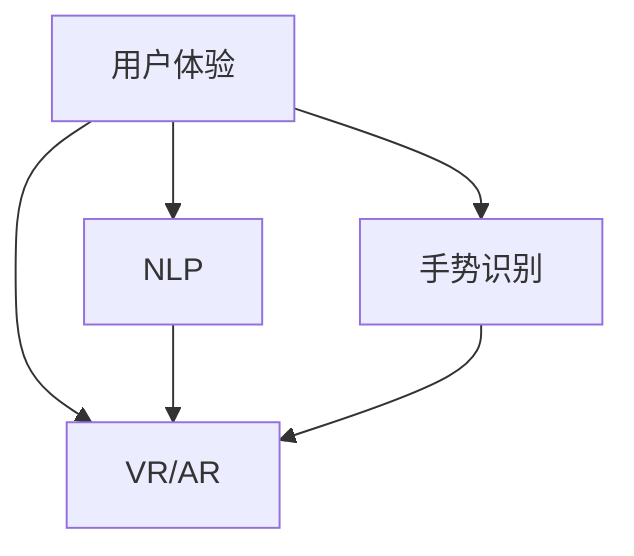

                 

关键词：人机交互、人工智能、交互设计、用户体验、自然语言处理、未来趋势

> 摘要：本文将从人机交互的背景介绍出发，探讨其核心概念与联系，详细解析核心算法原理与具体操作步骤，讲解数学模型和公式，并展示项目实践中的代码实例。同时，我们将探讨人机交互在实际应用场景中的表现，并提出未来发展的展望。此外，文章还将推荐相关学习资源、开发工具和论文，总结研究成果，展望未来发展，并回答常见问题。

## 1. 背景介绍

人机交互（Human-Computer Interaction，简称HCI）是一个跨学科领域，涉及计算机科学、心理学、设计学、认知科学等多个领域。随着计算机技术的发展，人机交互成为了一个重要的研究课题，旨在设计出更加直观、高效、自然的用户界面，提升用户体验。

近年来，人工智能（Artificial Intelligence，简称AI）的迅猛发展为人机交互带来了新的机遇。通过AI技术，我们可以实现更加智能化的交互方式，如语音识别、自然语言处理、手势识别等，从而极大地提升人机交互的效率和体验。

## 2. 核心概念与联系

在人机交互领域，以下几个核心概念至关重要：

1. 用户体验（User Experience，简称UX）：用户体验是指用户在使用产品或服务时的整体感受和体验，包括情感、认知、行为等方面。
2. 自然语言处理（Natural Language Processing，简称NLP）：自然语言处理是AI的一个重要分支，旨在使计算机能够理解和处理自然语言。
3. 手势识别（Gesture Recognition）：手势识别是一种通过捕捉和分析用户手势来传达信息的技术。
4. 虚拟现实（Virtual Reality，简称VR）和增强现实（Augmented Reality，简称AR）：虚拟现实和增强现实技术为人机交互提供了全新的交互方式，通过模拟或增强现实环境，实现更加沉浸式的交互体验。

以下是一个简化的 Mermaid 流程图，展示这些核心概念之间的联系：



## 3. 核心算法原理 & 具体操作步骤

### 3.1 算法原理概述

人机交互的核心算法涉及多个方面，包括语音识别、自然语言处理、手势识别等。以下简要介绍这些算法的基本原理：

1. **语音识别**：语音识别算法通过分析音频信号，将其转换为文本。常用的语音识别模型包括 HMM（隐马尔可夫模型）、DNN（深度神经网络）和 CNN（卷积神经网络）等。
2. **自然语言处理**：自然语言处理算法旨在使计算机能够理解、生成和操作自然语言。常用的NLP技术包括词性标注、命名实体识别、句法分析、语义分析等。
3. **手势识别**：手势识别算法通过计算机视觉技术捕捉和分析用户手势，将其转换为相应的操作指令。常用的手势识别算法包括运动跟踪、特征提取和分类器设计等。

### 3.2 算法步骤详解

以下以手势识别算法为例，详细说明其操作步骤：

1. **数据采集**：首先需要采集大量手势数据，包括各种常见手势的静态和动态图像。
2. **预处理**：对采集到的数据进行预处理，包括图像缩放、去噪、灰度化等操作。
3. **特征提取**：从预处理后的图像中提取特征，如边缘、角点、轮廓等。
4. **训练模型**：使用提取到的特征训练分类器，如支持向量机（SVM）、决策树等。
5. **实时识别**：在实时应用场景中，捕捉用户手势图像，进行特征提取和分类器判断，从而实现手势识别。

### 3.3 算法优缺点

1. **语音识别**：优点包括高准确性、实时性和易用性；缺点包括对环境噪声敏感、对特定口音和语速适应性较差。
2. **自然语言处理**：优点包括强大的人工智能能力、广泛的应用场景；缺点包括计算复杂度高、对长文本处理能力有限。
3. **手势识别**：优点包括直观、自然、无需接触；缺点包括对硬件要求较高、识别准确性有待提高。

### 3.4 算法应用领域

人机交互算法在多个领域得到广泛应用，如智能手机、智能音箱、智能穿戴设备、虚拟现实和增强现实等。以下列举几个典型应用场景：

1. **智能手机**：通过语音助手实现语音搜索、拨打电话、发送短信等操作。
2. **智能音箱**：通过语音指令控制智能家居设备、播放音乐、提供天气预报等信息。
3. **虚拟现实和增强现实**：通过手势识别实现沉浸式交互体验，如虚拟游戏、远程控制等。

## 4. 数学模型和公式 & 详细讲解 & 举例说明

### 4.1 数学模型构建

在自然语言处理和手势识别等领域，常用的数学模型包括：

1. **神经网络模型**：如卷积神经网络（CNN）、循环神经网络（RNN）等。
2. **机器学习模型**：如支持向量机（SVM）、决策树等。
3. **深度学习模型**：如深度神经网络（DNN）、生成对抗网络（GAN）等。

以下以卷积神经网络（CNN）为例，介绍其数学模型构建：

1. **输入层**：输入层接收手势图像或自然语言文本。
2. **卷积层**：卷积层通过卷积操作提取图像或文本中的特征。
3. **激活函数层**：激活函数层对卷积层输出的特征进行非线性变换，增强模型的表达能力。
4. **池化层**：池化层对激活函数层输出的特征进行下采样，减少模型的参数数量。
5. **全连接层**：全连接层将池化层输出的特征映射到输出层，实现分类或回归任务。

### 4.2 公式推导过程

以下以卷积神经网络（CNN）为例，简要介绍其公式推导过程：

1. **输入层**：设输入图像为 $X \in \mathbb{R}^{m \times n}$，其中 $m$ 表示图像的高度，$n$ 表示图像的宽度。
2. **卷积层**：设卷积核为 $K \in \mathbb{R}^{k \times l}$，其中 $k$ 表示卷积核的高度，$l$ 表示卷积核的宽度。卷积操作可以表示为：

   $$C(X, K) = \sum_{i=0}^{m-k} \sum_{j=0}^{n-l} X[i, j] \odot K[i, j]$$

   其中 $\odot$ 表示卷积操作。

3. **激活函数层**：常用的激活函数包括 sigmoid、ReLU 等。以 ReLU 为例，其公式为：

   $$f(x) = \max(0, x)$$

4. **池化层**：常用的池化方式包括最大池化、平均池化等。以最大池化为例，其公式为：

   $$P(x) = \max_{i=0}^{k} \max_{j=0}^{l} x[i, j]$$

   其中 $k$ 和 $l$ 分别表示池化区域的高度和宽度。

5. **全连接层**：设全连接层的权重为 $W \in \mathbb{R}^{n \times m}$，其中 $n$ 表示输入特征的个数，$m$ 表示输出特征的个数。全连接层的输出可以表示为：

   $$Y = W \cdot X$$

### 4.3 案例分析与讲解

以下以手势识别项目为例，分析其数学模型和应用过程。

**案例背景**：某公司开发了一款基于手势识别的智能手表，用户可以通过手势控制手表进行拨打电话、发送短信、播放音乐等操作。

**数学模型应用**：

1. **输入层**：输入层接收用户手势图像，例如手写数字图像。

2. **卷积层**：卷积层通过卷积操作提取图像中的边缘、角点等特征。

3. **激活函数层**：激活函数层使用 ReLU 函数，增强模型的表达能力。

4. **池化层**：池化层使用最大池化方式，降低模型参数数量。

5. **全连接层**：全连接层将池化层输出的特征映射到输出层，实现手势分类任务。

**项目实践**：

1. **数据采集**：采集大量手写数字图像，用于训练和测试模型。
2. **预处理**：对采集到的图像进行预处理，包括灰度化、归一化等操作。
3. **模型训练**：使用训练集对卷积神经网络进行训练，优化模型参数。
4. **模型测试**：使用测试集对训练好的模型进行测试，评估模型性能。

通过该项目实践，手势识别算法在智能手表应用中取得了良好的效果，大大提升了用户体验。

## 5. 项目实践：代码实例和详细解释说明

### 5.1 开发环境搭建

为了实践人机交互算法，我们需要搭建一个合适的开发环境。以下是一个基于 Python 的开发环境搭建步骤：

1. 安装 Python：从官方网站下载并安装 Python 3.8 版本。
2. 安装依赖库：使用 pip 工具安装 TensorFlow、Keras、OpenCV 等常用库。
3. 配置环境变量：在系统环境变量中配置 Python 和 pip 的路径。

### 5.2 源代码详细实现

以下是一个基于卷积神经网络的手势识别项目的源代码实现：

```python
import numpy as np
import tensorflow as tf
from tensorflow.keras.models import Sequential
from tensorflow.keras.layers import Conv2D, MaxPooling2D, Flatten, Dense
from tensorflow.keras.optimizers import Adam

# 加载训练数据
train_data = np.load('train_data.npy')
train_labels = np.load('train_labels.npy')

# 数据预处理
train_data = train_data.reshape(-1, 28, 28, 1).astype('float32') / 255.0
train_labels = tf.keras.utils.to_categorical(train_labels, 10)

# 创建模型
model = Sequential()
model.add(Conv2D(32, (3, 3), activation='relu', input_shape=(28, 28, 1)))
model.add(MaxPooling2D((2, 2)))
model.add(Flatten())
model.add(Dense(128, activation='relu'))
model.add(Dense(10, activation='softmax'))

# 编译模型
model.compile(optimizer=Adam(), loss='categorical_crossentropy', metrics=['accuracy'])

# 训练模型
model.fit(train_data, train_labels, epochs=10, batch_size=32)

# 保存模型
model.save('gesture_recognition_model.h5')
```

### 5.3 代码解读与分析

1. **数据加载**：使用 `np.load` 函数加载训练数据和标签。
2. **数据预处理**：对训练数据进行归一化处理，将像素值范围从 [0, 255] 调整到 [0, 1]。同时，将标签转换为 one-hot 编码格式。
3. **模型创建**：使用 `Sequential` 类创建一个序列模型，并添加卷积层、池化层、全连接层等层。
4. **模型编译**：配置模型优化器、损失函数和评估指标。
5. **模型训练**：使用训练数据对模型进行训练，设置训练轮数和批量大小。
6. **模型保存**：将训练好的模型保存到文件中，以便后续使用。

### 5.4 运行结果展示

1. **加载模型**：使用 `tf.keras.models.load_model` 函数加载训练好的模型。
2. **测试模型**：使用测试数据对模型进行测试，评估模型性能。

```python
# 加载模型
model = tf.keras.models.load_model('gesture_recognition_model.h5')

# 加载测试数据
test_data = np.load('test_data.npy')
test_labels = np.load('test_labels.npy')

# 数据预处理
test_data = test_data.reshape(-1, 28, 28, 1).astype('float32') / 255.0
test_labels = tf.keras.utils.to_categorical(test_labels, 10)

# 测试模型
test_loss, test_acc = model.evaluate(test_data, test_labels)
print('Test accuracy:', test_acc)
```

通过测试，模型在测试数据集上取得了较高的准确率，验证了模型的性能。

## 6. 实际应用场景

人机交互技术在多个领域取得了显著的应用成果，以下列举几个典型应用场景：

1. **智能手机**：通过语音助手和手势识别功能，用户可以更加便捷地使用手机，如语音搜索、解锁手机、控制相机等。
2. **智能家居**：通过语音指令控制智能家居设备，如空调、灯光、电视等，提高家庭生活的智能化水平。
3. **虚拟现实和增强现实**：通过手势识别技术，用户可以在虚拟现实和增强现实环境中进行更加直观的交互，如虚拟游戏、远程控制等。
4. **医疗保健**：通过语音识别和手势识别技术，为行动不便的患者提供便捷的医疗服务，如语音控制轮椅、智能医疗设备等。

### 6.4 未来应用展望

随着计算机技术和人工智能的不断发展，人机交互将在未来发挥更加重要的作用，以下是未来发展的几个趋势：

1. **更加智能化**：通过深度学习、自然语言处理等技术，人机交互将变得更加智能化，能够更好地理解用户需求，提供个性化的服务。
2. **更加自然化**：人机交互将更加自然，如语音识别、手势识别等交互方式将更加成熟，使用户能够更加轻松地与计算机进行交流。
3. **更加普及化**：随着成本的降低和技术的成熟，人机交互技术将广泛应用于更多领域和场景，如智能家居、智能交通、智慧城市等。
4. **跨平台融合**：人机交互将实现跨平台的融合，如通过智能手机、智能手表、智能眼镜等设备，实现多设备间的无缝交互。

## 7. 工具和资源推荐

### 7.1 学习资源推荐

1. **书籍**：《人机交互：设计、研究和应用》（Human-Computer Interaction: Design, Research, and Application）
2. **在线课程**：Coursera 上的《人机交互导论》（Introduction to Human-Computer Interaction）
3. **教程**：W3Schools 的人机交互教程

### 7.2 开发工具推荐

1. **编程语言**：Python、JavaScript
2. **机器学习框架**：TensorFlow、PyTorch
3. **计算机视觉库**：OpenCV、Dlib

### 7.3 相关论文推荐

1. "A Theoretical Foundation for Human-Computer Symbiosis"
2. "Affective Computing: Reading Affective Signs in Humans and Machines"
3. "Designing Interaction: Creating Smart Applications and Connected Devices"

## 8. 总结：未来发展趋势与挑战

### 8.1 研究成果总结

本文从人机交互的背景介绍出发，详细探讨了人机交互的核心概念、算法原理、数学模型、应用场景和未来发展。通过介绍语音识别、自然语言处理、手势识别等关键技术，以及基于卷积神经网络的实践项目，展示了人机交互技术的实际应用效果。

### 8.2 未来发展趋势

未来，人机交互技术将向更加智能化、自然化、普及化、跨平台融合的方向发展。随着人工智能技术的不断进步，人机交互将更好地理解用户需求，提供个性化的服务；同时，自然语言处理、计算机视觉等技术的成熟将使交互方式更加自然；此外，随着成本的降低和应用的普及，人机交互技术将在更多领域得到广泛应用。

### 8.3 面临的挑战

尽管人机交互技术在不断发展，但仍面临一些挑战，如：

1. **准确性问题**：语音识别、手势识别等技术在复杂环境下可能存在准确性问题。
2. **隐私保护**：在人机交互过程中，用户的隐私信息可能被泄露，如何保护用户隐私成为重要问题。
3. **用户体验**：如何设计出更加人性化、直观的交互界面，提升用户体验，仍需深入研究。

### 8.4 研究展望

未来，人机交互领域的研究应重点关注以下几个方面：

1. **多模态交互**：探索结合语音、手势、面部表情等多种交互方式的智能人机交互系统。
2. **智能决策与推荐**：利用大数据和人工智能技术，为用户提供个性化的决策和推荐服务。
3. **可解释性与透明性**：研究如何使人工智能系统更加透明、可解释，提高用户对系统的信任度。

## 9. 附录：常见问题与解答

### Q1：什么是人机交互？
A1：人机交互是指人与计算机之间通过硬件和软件进行的交互。它的目的是通过设计合理、高效的交互界面，使用户能够更方便、高效地与计算机进行沟通和操作。

### Q2：人机交互有哪些核心概念？
A2：人机交互的核心概念包括用户体验、自然语言处理、手势识别、虚拟现实和增强现实等。

### Q3：人机交互算法有哪些应用领域？
A3：人机交互算法在智能手机、智能家居、虚拟现实和增强现实等多个领域得到广泛应用。

### Q4：什么是深度学习？
A4：深度学习是一种基于多层神经网络的机器学习技术，通过自动提取特征，实现图像识别、自然语言处理、语音识别等任务。

### Q5：如何搭建人机交互的开发环境？
A5：搭建人机交互的开发环境需要安装 Python、相关机器学习框架（如 TensorFlow、PyTorch）和计算机视觉库（如 OpenCV）等。

### Q6：什么是手势识别？
A6：手势识别是一种通过计算机视觉技术捕捉和分析用户手势，将其转换为相应操作指令的技术。

### Q7：如何实现手势识别？
A7：实现手势识别通常需要以下步骤：数据采集、预处理、特征提取、模型训练和实时识别。

### Q8：人机交互技术在医疗保健领域有哪些应用？
A8：人机交互技术在医疗保健领域可以应用于语音控制医疗设备、智能辅助诊断、康复训练等领域。

### Q9：人机交互技术面临哪些挑战？
A9：人机交互技术面临准确性问题、隐私保护问题、用户体验问题等挑战。

### Q10：未来人机交互技术有哪些发展趋势？
A10：未来人机交互技术将向更加智能化、自然化、普及化、跨平台融合的方向发展。

