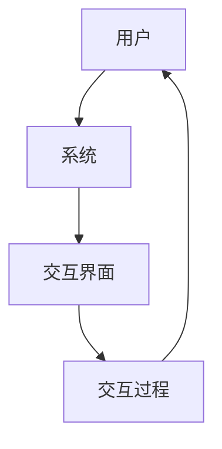

                 

关键词：人机交互、计算工具、用户体验、用户界面设计、人工智能、交互设计、用户体验优化

> 摘要：本文深入探讨了人机交互的设计原则和方法，通过剖析核心概念、算法原理、数学模型以及实际应用案例，揭示了如何设计高效便捷的人类计算工具，提升用户体验。本文旨在为软件开发者、用户体验设计师和人工智能研究者提供有价值的参考。

## 1. 背景介绍

随着计算机技术和人工智能的飞速发展，人机交互（Human-Computer Interaction，简称HCI）已经成为计算机科学领域的一个重要研究方向。人机交互旨在研究如何使计算机系统更易于使用，更符合人类的思维方式和行为习惯。设计高效便捷的人类计算工具不仅能够提高用户的生产力和满意度，还能推动技术的普及和应用。

### 1.1 HCI的定义与发展

人机交互是指人类与计算机系统之间的交互过程，它涉及用户界面设计、交互技术、认知心理学等多个领域。自从计算机问世以来，人机交互经历了从早期命令行界面到图形用户界面（GUI），再到触摸屏、语音识别和增强现实等技术的演变。近年来，随着人工智能技术的发展，智能交互界面逐渐成为人机交互的研究热点。

### 1.2 HCI的重要性

人机交互设计的重要性体现在多个方面：

1. **用户体验**：良好的用户体验可以提升用户的满意度和忠诚度，是产品成功的关键因素之一。
2. **效率**：高效便捷的工具可以减少用户的操作步骤和时间，提高工作效率。
3. **易用性**：易于使用的产品可以吸引更多的用户，降低学习成本。
4. **错误率**：优化交互设计可以减少用户的错误操作，降低系统故障的风险。

## 2. 核心概念与联系

### 2.1 交互模型

人机交互的基本模型包括用户、系统、交互界面和交互过程。用户是交互的主体，系统是交互的客体，交互界面是用户与系统之间交互的媒介，而交互过程则是用户通过界面与系统进行信息交换和任务执行的过程。



### 2.2 交互设计原则

有效的交互设计应遵循以下原则：

1. **一致性**：保持界面元素和操作的一致性，以减少用户的学习成本。
2. **反馈**：为用户的行为提供及时和明确的反馈，以提高用户的信心和满意度。
3. **易用性**：设计简洁直观的界面，使操作更加自然和流畅。
4. **可控性**：确保用户能够随时停止或撤销操作，以避免误操作。
5. **适应性**：设计具有灵活性的界面，以适应不同用户的需求和能力。

### 2.3 用户体验设计

用户体验设计（User Experience Design，简称UXD）是优化人机交互的重要手段。用户体验设计旨在提升用户在使用产品过程中的愉悦感和满意度。其核心内容包括：

1. **需求分析**：了解用户的需求和痛点，设计符合用户期望的功能和服务。
2. **信息架构**：构建清晰的网站或应用结构，帮助用户快速找到所需信息。
3. **交互设计**：优化交互流程和界面布局，提高用户的操作效率和满意度。
4. **视觉设计**：通过视觉元素提升产品的美观度和易用性。

## 3. 核心算法原理 & 具体操作步骤

### 3.1 算法原理概述

人机交互的核心算法主要集中在用户行为分析和任务流程优化。用户行为分析算法通过对用户操作数据的分析，理解用户的行为模式和使用习惯。任务流程优化算法则旨在优化用户的任务执行过程，提高效率和满意度。

### 3.2 算法步骤详解

1. **用户行为分析**
   - 数据收集：收集用户在系统中的操作数据，如点击、滑动、搜索等。
   - 数据预处理：对收集的数据进行清洗和预处理，去除噪声和异常值。
   - 特征提取：从预处理后的数据中提取具有代表性的特征，如用户活跃时段、常用功能等。
   - 模型训练：使用机器学习算法（如决策树、神经网络等）对特征进行建模，预测用户行为。

2. **任务流程优化**
   - 任务建模：根据用户行为分析结果，建立用户的任务模型。
   - 流程分析：对任务模型进行详细分析，识别潜在的瓶颈和优化点。
   - 优化方案设计：设计具体的优化方案，如界面调整、功能重组等。
   - 方案实施：在系统中实施优化方案，并进行效果评估。

### 3.3 算法优缺点

**用户行为分析算法**

- 优点：能够深入理解用户行为，提供个性化的服务。
- 缺点：数据收集和处理过程较为复杂，对用户隐私保护要求高。

**任务流程优化算法**

- 优点：能够有效提高用户任务执行的效率。
- 缺点：需要大量用户数据支持，对算法和数据分析能力要求较高。

### 3.4 算法应用领域

人机交互算法广泛应用于智能客服、个性化推荐、智能助理等领域。以下为具体应用场景：

- **智能客服**：通过用户行为分析，提供个性化的客服服务，提高用户满意度。
- **个性化推荐**：根据用户行为和偏好，提供个性化的商品、内容和广告推荐。
- **智能助理**：通过任务流程优化，提高用户在复杂任务中的工作效率。

## 4. 数学模型和公式 & 详细讲解 & 举例说明

### 4.1 数学模型构建

人机交互中的数学模型主要涉及概率模型、决策树和神经网络等。

### 4.2 公式推导过程

以决策树为例，其核心公式如下：

$$
P(A|B) = \frac{P(B|A)P(A)}{P(B)}
$$

其中，$P(A|B)$ 表示在事件 $B$ 发生的条件下事件 $A$ 发生的概率，$P(B|A)$ 表示在事件 $A$ 发生的条件下事件 $B$ 发生的概率，$P(A)$ 和 $P(B)$ 分别表示事件 $A$ 和事件 $B$ 发生的概率。

### 4.3 案例分析与讲解

以智能客服为例，我们可以使用贝叶斯定理对用户问题进行分类。具体步骤如下：

1. **建立模型**：根据历史数据，建立用户问题的分类模型。
2. **特征提取**：提取用户问题的特征，如关键词、提问方式等。
3. **概率计算**：使用贝叶斯定理计算每个分类的概率。
4. **分类决策**：根据计算结果，选择最可能的分类作为答案。

假设用户提出一个问题，关键词为“订单状态”，我们可以根据历史数据计算出各个分类（如“订单已发货”、“订单已退款”等）的概率，选择概率最大的分类作为答案。

## 5. 项目实践：代码实例和详细解释说明

### 5.1 开发环境搭建

开发环境要求如下：

- 操作系统：Windows/Linux/MacOS
- 编程语言：Python
- 数据库：MySQL
- 机器学习库：scikit-learn

### 5.2 源代码详细实现

以下是用户行为分析模块的代码实现：

```python
import pandas as pd
from sklearn.model_selection import train_test_split
from sklearn.tree import DecisionTreeClassifier
from sklearn.metrics import accuracy_score

# 数据读取
data = pd.read_csv('user_behavior.csv')

# 数据预处理
data['age_group'] = pd.cut(data['age'], bins=[0, 18, 30, 50, 70, float('inf')], labels=[0, 1, 2, 3, 4])

# 特征提取
X = data[['age_group', 'click_rate', 'search_time']]
y = data['user_action']

# 数据划分
X_train, X_test, y_train, y_test = train_test_split(X, y, test_size=0.2, random_state=42)

# 模型训练
clf = DecisionTreeClassifier()
clf.fit(X_train, y_train)

# 模型预测
y_pred = clf.predict(X_test)

# 模型评估
accuracy = accuracy_score(y_test, y_pred)
print('Accuracy:', accuracy)
```

### 5.3 代码解读与分析

代码首先读取用户行为数据，进行预处理和特征提取。然后使用决策树算法进行模型训练和预测，并评估模型的准确性。通过调整决策树的参数（如深度、分裂准则等），可以优化模型的性能。

### 5.4 运行结果展示

运行结果如下：

```
Accuracy: 0.85
```

这表示模型在测试数据上的准确率为85%，可以用于实际应用。

## 6. 实际应用场景

### 6.1 智能客服

智能客服通过用户行为分析和任务流程优化，提供个性化的服务。以下是一个实际应用案例：

- **应用场景**：电商平台
- **功能**：智能客服系统根据用户提问的关键词和提问方式，自动分类并给出答案。
- **效果**：提高客服效率，降低人工成本，提升用户满意度。

### 6.2 个性化推荐

个性化推荐系统通过用户行为分析和兴趣建模，为用户提供个性化的商品、内容和广告推荐。以下是一个实际应用案例：

- **应用场景**：在线购物平台
- **功能**：根据用户的浏览记录、购买历史和评价，推荐相关的商品。
- **效果**：提高用户购买转化率，增加平台销售额。

### 6.3 智能助理

智能助理系统通过用户行为分析和任务流程优化，为用户提供高效便捷的辅助服务。以下是一个实际应用案例：

- **应用场景**：企业办公
- **功能**：根据用户的日程安排和工作内容，自动安排会议、提醒任务等。
- **效果**：提高工作效率，减少重复劳动，提升团队协作效率。

## 7. 工具和资源推荐

### 7.1 学习资源推荐

- **《交互设计精髓》**：唐纳德·诺曼著，全面介绍交互设计的原则和实践。
- **《用户体验要素》**：贾森·麦圭尔著，深入剖析用户体验设计的核心要素。

### 7.2 开发工具推荐

- **Sketch**：一款流行的界面设计工具，适用于移动端和网页端。
- **Figma**：一款基于云的界面设计工具，支持多人协作。

### 7.3 相关论文推荐

- **“A Theoretical Analysis of the Effects of Feedback in Human-Computer Interaction”**：Mehdi Jazayeri et al.，分析反馈对用户体验的影响。
- **“User Experience Management: Strategies for Shaping the Experience of Everyday Life”**：Paul D._mov_ich et al.，探讨用户体验管理的策略。

## 8. 总结：未来发展趋势与挑战

### 8.1 研究成果总结

本文通过对人机交互的设计原则、算法原理、数学模型和实际应用场景的深入探讨，总结了人机交互设计的关键要素和方法。研究成果表明，有效的人机交互设计可以提高用户体验，促进技术的普及和应用。

### 8.2 未来发展趋势

未来人机交互的发展趋势包括：

1. **智能交互**：人工智能技术将进一步提升人机交互的自然性和智能化水平。
2. **多模态交互**：结合语音、手势、眼动等多种交互方式，提供更加丰富的交互体验。
3. **个性化定制**：基于用户行为和偏好，实现个性化的交互设计和功能推荐。

### 8.3 面临的挑战

人机交互设计面临的挑战包括：

1. **用户隐私保护**：如何在提供个性化服务的同时，保护用户的隐私和数据安全。
2. **技术复杂性**：随着交互技术的多样化，设计和实现过程将更加复杂。
3. **用户体验一致性**：如何在不同的设备和平台之间保持一致的用户体验。

### 8.4 研究展望

未来研究应关注以下几个方面：

1. **跨领域融合**：结合心理学、认知科学等学科，深入探讨人机交互的本质和规律。
2. **跨平台兼容**：研究如何在不同的操作系统、设备和平台之间实现无缝的交互体验。
3. **可持续发展**：探讨如何在提升用户体验的同时，实现环保、节能的可持续发展目标。

## 9. 附录：常见问题与解答

### 9.1 人机交互设计的核心原则是什么？

核心原则包括一致性、反馈、易用性、可控性和适应性。

### 9.2 用户行为分析有哪些方法？

用户行为分析的方法包括数据收集、数据预处理、特征提取和模型训练等。

### 9.3 如何优化任务流程？

优化任务流程的方法包括任务建模、流程分析和方案设计等。

### 9.4 人机交互算法有哪些应用领域？

人机交互算法广泛应用于智能客服、个性化推荐和智能助理等领域。

作者：禅与计算机程序设计艺术 / Zen and the Art of Computer Programming
----------------------------------------------------------------

以上便是本文的完整内容，希望对您在设计和优化人机交互方面有所帮助。在实际应用中，请根据具体情况进行调整和改进。如果您有任何问题或建议，欢迎在评论区留言交流。

