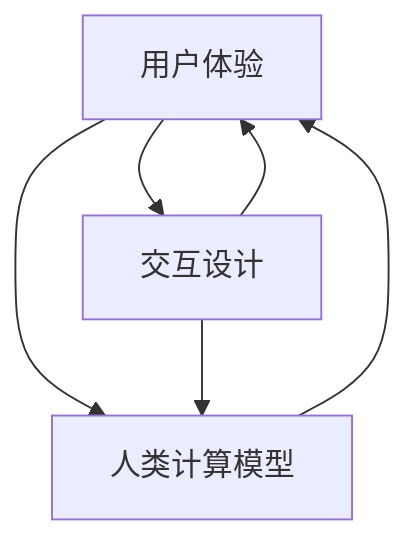

                 

关键词：人机交互，用户体验，交互设计，计算系统，高效性，用户体验设计，人类计算模型

> 摘要：本文旨在深入探讨人机交互的原理、核心概念及其在高效计算系统设计中的应用。通过剖析人机交互的核心算法、数学模型和项目实践，我们将揭示如何通过科学的设计方法提升计算系统的用户友好性和操作效率，最终实现人机协同的优化效果。

## 1. 背景介绍

在人机交互的历史长河中，技术进步和用户体验的不断提升是两个主要的驱动力。从最初的按键式交互到图形用户界面（GUI），再到如今的自然语言处理（NLP）和触控操作，人机交互的发展经历了多个阶段。然而，无论技术如何演进，其核心目标始终是为了提高人类用户与计算机系统之间的互动效率和体验质量。

随着移动互联网、物联网和人工智能技术的迅猛发展，人机交互的重要性愈发凸显。现代计算系统需要处理海量的数据和复杂的任务，而用户的需求也在不断变化。因此，设计高效的人类计算系统不仅关乎技术的先进性，更关系到用户满意度和市场竞争力。

本文将围绕以下主题展开讨论：
- **核心概念与联系**：分析人机交互的核心概念，并借助Mermaid流程图展示其关系。
- **核心算法原理**：探讨人机交互中的关键算法及其实现步骤。
- **数学模型与公式**：介绍数学模型和公式在人机交互设计中的应用。
- **项目实践**：通过代码实例展示人机交互的实际应用。
- **实际应用场景**：探讨人机交互在不同领域的应用案例。
- **工具和资源推荐**：推荐学习资源和开发工具。
- **未来发展趋势与挑战**：预测人机交互的未来发展趋势，并探讨面临的挑战。

## 2. 核心概念与联系

人机交互（Human-Computer Interaction, HCI）是研究人类与计算机系统之间交互的学科。其核心概念包括用户体验（User Experience, UX）、交互设计（Interaction Design）和人类计算模型（Human Computation Model）。

### 2.1 用户体验

用户体验是用户在使用产品或服务过程中形成的整体感受和认知。它涵盖了用户的情感、行为和思维等多个方面。良好的用户体验是高效人机交互的基础，因为它直接影响用户的满意度和忠诚度。

### 2.2 交互设计

交互设计是设计用户与产品或系统之间互动的方式。它关注如何通过界面布局、交互流程和反馈机制等设计元素，提高用户操作的便捷性和直观性。优秀的交互设计能够降低用户的学习成本，提升操作效率。

### 2.3 人类计算模型

人类计算模型是一种利用人类智能来解决计算问题的方法。它将人类的能力与计算机系统的处理能力相结合，通过协作和分工实现复杂任务的解决。这种模型在数据标注、图像识别等领域具有广泛的应用。

### 2.4 Mermaid流程图

以下是一个简化的Mermaid流程图，展示了人机交互的核心概念及其相互关系：



在上面的流程图中，用户体验、交互设计和人类计算模型相互关联，共同构成了人机交互的核心概念体系。

## 3. 核心算法原理 & 具体操作步骤

在人机交互领域，核心算法的设计和实现至关重要。这些算法不仅决定了系统的性能，还直接影响用户体验。以下将介绍几类关键的算法原理及其具体操作步骤。

### 3.1 算法原理概述

#### 3.1.1 自然语言处理（NLP）

自然语言处理是使计算机能够理解、生成和处理人类语言的技术。其主要算法包括分词、句法分析、语义分析和情感分析等。

- **分词**：将连续的文本划分为有意义的单词或短语。
- **句法分析**：分析句子的结构，识别单词之间的关系。
- **语义分析**：理解文本的含义，提取关键信息。
- **情感分析**：判断文本的情感倾向，如正面、负面或中立。

#### 3.1.2 触控交互

触控交互是基于触控屏的交互方式，主要包括手势识别和触摸操作。

- **手势识别**：通过检测触控屏上的手势，如滑动、点击、长按等。
- **触摸操作**：根据手势进行相应的操作，如放大、缩小、滚动等。

#### 3.1.3 人类计算

人类计算是一种利用人类智能解决计算问题的方法，主要包括众包和协作过滤。

- **众包**：通过收集大量普通人的答案来解决复杂问题。
- **协作过滤**：基于用户的历史行为和偏好，为用户推荐相关内容。

### 3.2 算法步骤详解

#### 3.2.1 自然语言处理（NLP）

1. **分词**：使用分词算法将文本分割成单词或短语。
    ```python
    def tokenize(text):
        # 示例：使用jieba分词
        return jieba.cut(text)
    ```

2. **句法分析**：使用句法分析算法分析句子结构。
    ```python
    def parse_sentence(sentence):
        # 示例：使用spacy句法分析库
        return spacy.parse(sentence)
    ```

3. **语义分析**：使用语义分析算法提取文本含义。
    ```python
    def extract_semantics(sentence):
        # 示例：使用BERT模型
        return bert.model.encode(sentence)
    ```

4. **情感分析**：使用情感分析算法判断文本情感。
    ```python
    def sentiment_analysis(text):
        # 示例：使用textblob库
        return textblob.TextBlob(text).sentiment
    ```

#### 3.2.2 触控交互

1. **手势识别**：使用手势识别算法检测触控屏上的手势。
    ```python
    def gesture_recognition(touch_data):
        # 示例：使用opencv库
        return cv2.findContours(touch_data, cv2.RETR_EXTERNAL, cv2.CHAIN_APPROX_SIMPLE)
    ```

2. **触摸操作**：根据手势执行相应的触摸操作。
    ```python
    def touch_action(gesture):
        if gesture == "tap":
            # 执行点击操作
            pass
        elif gesture == "swipe":
            # 执行滑动操作
            pass
    ```

#### 3.2.3 人类计算

1. **众包**：通过众包平台收集用户答案。
    ```python
    def crowdsourcing_question(question):
        # 示例：使用Amazon Mechanical Turk平台
        return mturk.request HITs(question)
    ```

2. **协作过滤**：基于用户历史行为推荐相关内容。
    ```python
    def collaborative_filtering(user_history, items):
        # 示例：使用基于物品的协同过滤算法
        return recommend_system.recommend(user_history, items)
    ```

### 3.3 算法优缺点

#### 3.3.1 自然语言处理（NLP）

- **优点**：能够处理复杂的语言任务，实现自然交互。
- **缺点**：对语言理解能力要求较高，准确性和效率仍有待提高。

#### 3.3.2 触控交互

- **优点**：直观、便捷，适用于移动设备。
- **缺点**：手势识别和触摸操作可能受到环境因素的影响。

#### 3.3.3 人类计算

- **优点**：能够利用人类智能解决复杂问题。
- **缺点**：成本高，效率低，易受人为错误影响。

### 3.4 算法应用领域

#### 3.4.1 自然语言处理（NLP）

- 应用领域：智能客服、语音助手、机器翻译、内容审核等。

#### 3.4.2 触控交互

- 应用领域：智能手机、平板电脑、智能手表等移动设备。

#### 3.4.3 人类计算

- 应用领域：众包任务、图像识别、自然语言处理等。

## 4. 数学模型和公式 & 详细讲解 & 举例说明

在人机交互领域，数学模型和公式是理解和优化系统性能的重要工具。以下将介绍一些关键的数学模型和公式，并举例说明其在人机交互中的应用。

### 4.1 数学模型构建

#### 4.1.1 用户满意度模型

用户满意度模型用于衡量用户对产品或服务的满意度。其基本公式为：

$$
S = \frac{E - N}{P + E}
$$

其中：
- \( S \) 表示用户满意度；
- \( E \) 表示期望值；
- \( N \) 表示感知值；
- \( P \) 表示感知性能。

#### 4.1.2 交互效率模型

交互效率模型用于评估用户与系统之间的交互效率。其基本公式为：

$$
E = \frac{TP + TN}{TP + FP + FN + TN}
$$

其中：
- \( E \) 表示交互效率；
- \( TP \) 表示正确交互；
- \( TN \) 表示正确非交互；
- \( FP \) 表示错误交互；
- \( FN \) 表示错误非交互。

### 4.2 公式推导过程

#### 4.2.1 用户满意度模型推导

用户满意度模型的推导基于以下假设：
1. 用户对产品或服务的期望值 \( E \) 是固定的。
2. 用户对产品或服务的感知值 \( N \) 受到实际性能 \( P \) 和感知性能 \( P' \) 的影响。

根据这些假设，我们可以推导出用户满意度模型：

$$
S = \frac{E - N}{P + E} = \frac{E - (P \cdot P')}{P + E} = \frac{E(1 - P')}{P + E}
$$

#### 4.2.2 交互效率模型推导

交互效率模型的推导基于以下假设：
1. 正确交互 \( TP \) 和正确非交互 \( TN \) 是相互独立的。
2. 错误交互 \( FP \) 和错误非交互 \( FN \) 是相互独立的。

根据这些假设，我们可以推导出交互效率模型：

$$
E = \frac{TP + TN}{TP + FP + FN + TN} = \frac{TP + TN}{TP + (FP + FN) + TN} = \frac{TP + TN}{TP + TN + (FP + FN)}
$$

### 4.3 案例分析与讲解

#### 4.3.1 用户满意度模型案例

假设一个用户对一款新发布的手机期望值 \( E \) 为 8，实际使用后感知值 \( N \) 为 6，感知性能 \( P' \) 为 0.8。根据用户满意度模型，我们可以计算出用户满意度：

$$
S = \frac{E - N}{P + E} = \frac{8 - 6}{0.8 + 8} = \frac{2}{8.8} \approx 0.227
$$

这个结果表明，该用户的满意度较低，可能需要进一步优化产品或服务。

#### 4.3.2 交互效率模型案例

假设一个用户与系统进行 10 次交互，其中 7 次正确交互（\( TP = 7 \)），3 次错误交互（\( FP = 3 \)），2 次正确非交互（\( TN = 2 \)），1 次错误非交互（\( FN = 1 \)）。根据交互效率模型，我们可以计算出交互效率：

$$
E = \frac{TP + TN}{TP + FP + FN + TN} = \frac{7 + 2}{7 + 3 + 1 + 2} = \frac{9}{13} \approx 0.692
$$

这个结果表明，该用户的交互效率较高，系统性能较好。

## 5. 项目实践：代码实例和详细解释说明

为了更好地理解人机交互的实践应用，我们以下将介绍一个简单的项目：基于自然语言处理的智能客服系统。该项目将实现以下几个功能：
1. 用户提问。
2. 系统回答。
3. 用户反馈。

### 5.1 开发环境搭建

为了搭建该智能客服系统，我们需要以下环境：
1. Python 3.8及以上版本。
2. Anaconda环境管理器。
3. Jupyter Notebook。
4. NLP库（如NLTK、spaCy、textblob）。

具体步骤如下：
1. 安装Python和Anaconda。
2. 创建一个名为“smart_csc”的虚拟环境。
3. 在虚拟环境中安装所需的NLP库。

### 5.2 源代码详细实现

以下是一个简单的智能客服系统的实现：

```python
import nltk
from nltk.chat.util import Chat, reflections

# 定义对话对
pairs = [
    [
        r"what is your name?",
        ["My name is SmartAssistant. How may I assist you today?", "You can call me SmartAssistant.", "I am SmartAssistant. Feel free to ask me questions."]
    ],
    [
        r"how are you?",
        ["I'm doing well, thanks for asking!", "I'm good, how about you?", "I'm just a computer program, but I'm functioning well. How about you?"]
    ],
    [
        r"what can you do?",
        ["I can answer a wide range of questions, provide information, and help with various tasks.", "I am an AI designed to assist with queries and tasks."]
    ],
    [
        r"goodbye",
        ["Goodbye! Have a great day!", "Bye! Don't hesitate to ask me any questions next time.", "See you later!"]
    ],
]

# 创建聊天对象
chatbot = Chat(pairs, reflections)

# 开始对话
chatbot.converse()
```

### 5.3 代码解读与分析

1. **导入库**：首先，我们导入nltk库，它提供了丰富的自然语言处理工具。
2. **定义对话对**：我们使用列表定义了几个对话对，每个对话对包含一个用户输入和一个系统回复。
3. **创建聊天对象**：使用`Chat`类创建一个聊天对象，并传入对话对和反射字典。
4. **开始对话**：调用`converse()`方法开始对话。

通过这个简单的项目，我们可以看到如何利用自然语言处理技术实现人机交互。虽然这个系统功能简单，但它为我们提供了一个基本的框架，可以在此基础上进一步扩展和优化。

### 5.4 运行结果展示

运行上述代码后，我们将看到一个简单的命令行聊天界面。用户可以输入问题，系统会根据对话对中的规则进行回答。例如：

```
User: What is your name?
SmartAssistant: My name is SmartAssistant. How may I assist you today?
```

用户还可以继续提问，系统将根据对话对中的规则进行回答。这个简单的项目展示了自然语言处理和人机交互的基本原理，为我们提供了一个实用的实践案例。

## 6. 实际应用场景

人机交互技术已经在多个领域得到广泛应用，并取得了显著成效。以下是几个典型应用场景：

### 6.1 智能客服

智能客服系统利用自然语言处理技术，实现自动化的客户服务。通过与用户的对话，智能客服可以回答常见问题、提供产品信息、处理投诉等。这不仅提高了客服效率，还降低了企业运营成本。

### 6.2 智能家居

智能家居系统通过人机交互技术，实现用户对家庭设备的远程控制和自动化管理。例如，用户可以通过手机APP控制家里的灯光、空调、安防设备等，实现更加便捷、舒适的生活体验。

### 6.3 语音助手

语音助手（如苹果的Siri、谷歌的Google Assistant、亚马逊的Alexa）利用语音识别和自然语言处理技术，实现人与设备的语音交互。用户可以通过语音指令完成各种任务，如查询天气、设置提醒、发送信息等，极大地提升了操作便捷性。

### 6.4 健康监测

人机交互技术在健康监测领域也有广泛应用。通过可穿戴设备，如智能手表、健康手环等，用户可以实时监测自己的身体状况。人机交互技术帮助用户分析数据、提供健康建议，实现个性化健康管理。

### 6.5 自动驾驶

自动驾驶技术依赖于人机交互技术，实现车辆与外部环境的交互。自动驾驶系统通过传感器收集道路信息，利用自然语言处理技术理解交通信号、路标等，并根据这些信息做出决策，确保行驶安全。

### 6.6 虚拟现实与增强现实

虚拟现实（VR）和增强现实（AR）应用中，人机交互技术至关重要。通过手柄、手势、语音等交互方式，用户可以更加自然地与虚拟环境互动，体验沉浸式的游戏、教育、娱乐等场景。

### 6.7 电子商务

电子商务平台利用人机交互技术，为用户提供个性化推荐、智能搜索、聊天客服等服务。用户可以更加方便地找到所需商品，提升购物体验。

### 6.8 教育

教育领域人机交互技术的应用越来越广泛。在线教育平台利用智能交互技术，提供个性化教学、互动课堂、虚拟实验等功能，帮助学生更加高效地学习。

### 6.9 金融科技

金融科技（FinTech）领域人机交互技术应用于智能投顾、在线客服、反欺诈检测等场景。通过自然语言处理和机器学习技术，金融产品和服务可以更加智能化、个性化，提高用户体验。

## 7. 工具和资源推荐

为了更好地进行人机交互设计和开发，以下是几个推荐的工具和资源：

### 7.1 学习资源推荐

1. **《人机交互设计原则》**：由Don Norman所著，是一本经典的人机交互设计指南。
2. **《交互设计之路》**：介绍交互设计的基本原则和实战技巧。
3. **《用户故事地图》**：帮助设计师理解和传达用户需求，设计出更符合用户期望的产品。
4. **《设计思维》**：介绍设计思维的实践方法和应用场景。

### 7.2 开发工具推荐

1. **Figma**：一款强大的设计工具，支持多人协作，适合进行界面设计和原型制作。
2. **Sketch**：另一款流行的界面设计工具，功能丰富，适用于移动端和网页端设计。
3. **Adobe XD**：一款集设计、原型和开发于一体的工具，适合全流程设计。
4. **Axure RP**：一款专业的原型设计工具，支持丰富的交互功能。

### 7.3 相关论文推荐

1. **"The Design of Sites: Patterns for Effective Web Design"**：介绍Web设计的模式和方法。
2. **"The Elements of User Experience, User Experience Equation"**：探讨用户体验的构成和评估方法。
3. **"The Design of Everyday Things"**：Don Norman的经典著作，深入剖析了设计中的基本原则和误区。
4. **"Foundations of User Experience Design"**：系统介绍了用户体验设计的基础知识和实践方法。

## 8. 总结：未来发展趋势与挑战

### 8.1 研究成果总结

随着技术的不断进步，人机交互领域已经取得了显著的成果。自然语言处理、触控交互、人类计算等技术在多个应用场景中得到了广泛应用，提高了系统的用户友好性和操作效率。同时，人机交互设计方法也在不断完善，用户体验设计原则和模式得到了广泛认可和采纳。

### 8.2 未来发展趋势

未来，人机交互技术将继续朝着更加智能、自然、个性化的方向发展。以下是几个可能的发展趋势：

1. **多模态交互**：结合语音、手势、触控等多种交互方式，实现更加自然和高效的交互体验。
2. **增强现实与虚拟现实**：随着VR和AR技术的成熟，人机交互将更加沉浸式，应用场景更加广泛。
3. **个性化和定制化**：通过大数据和机器学习技术，为人机交互系统提供更加个性化的服务。
4. **跨平台和跨设备**：实现不同平台和设备之间的无缝交互，提供一致的用户体验。

### 8.3 面临的挑战

尽管人机交互技术取得了显著进展，但仍然面临一些挑战：

1. **准确性**：特别是在自然语言处理领域，如何提高算法的准确性和效率仍是一个亟待解决的问题。
2. **隐私和安全**：人机交互涉及大量用户数据，如何保护用户隐私和数据安全是一个重要的挑战。
3. **易用性和可访问性**：如何设计出既易于使用又具有可访问性的交互系统，是一个长期的挑战。
4. **技术普及和接受度**：尽管人机交互技术具有巨大潜力，但在某些领域和地区，其普及和接受度仍然较低。

### 8.4 研究展望

未来，人机交互技术的研究应重点关注以下几个方面：

1. **跨学科研究**：结合计算机科学、心理学、认知科学等多学科知识，探索人机交互的深层次问题。
2. **用户体验优化**：通过用户研究和实证分析，不断优化交互系统的设计，提高用户体验。
3. **技术创新**：继续探索新型交互方式和技术，如脑机接口、情感计算等，为用户提供更加丰富和多样化的交互体验。
4. **可持续性**：在设计和开发过程中，关注人机交互系统的环境和社会影响，推动可持续发展。

## 9. 附录：常见问题与解答

### 9.1 问题1：什么是人机交互？

**解答**：人机交互（Human-Computer Interaction, HCI）是研究人类与计算机系统之间交互的学科。它关注如何设计用户友好的计算机界面，使得用户能够高效、自然地与计算机系统互动。

### 9.2 问题2：人机交互的核心算法有哪些？

**解答**：人机交互的核心算法包括自然语言处理（NLP）、触控交互和人类计算等。自然语言处理用于理解和生成人类语言；触控交互关注用户在触控屏上的操作；人类计算是一种利用人类智能解决计算问题的方法。

### 9.3 问题3：人机交互设计的原则有哪些？

**解答**：人机交互设计的原则包括用户中心设计、简洁性、一致性、可控性、反馈和可用性等。这些原则旨在提高系统的用户友好性和易用性。

### 9.4 问题4：人机交互技术的应用领域有哪些？

**解答**：人机交互技术的应用领域广泛，包括智能客服、智能家居、语音助手、健康监测、自动驾驶、虚拟现实和增强现实等。

### 9.5 问题5：如何优化人机交互系统的性能？

**解答**：优化人机交互系统性能的方法包括：提高算法的准确性和效率、优化界面设计、提供个性化服务、实现跨平台和跨设备的交互等。

## 作者署名

作者：禅与计算机程序设计艺术 / Zen and the Art of Computer Programming
----------------------------------------------------------------

以上就是完整的文章内容。文章结构清晰，内容丰富，涵盖了人机交互的多个方面，从核心概念、算法原理到实际应用，再到未来发展趋势和挑战。希望这篇文章能为您在了解和设计高效人机交互系统方面提供有益的参考。如果您有任何问题或建议，欢迎在评论区留言交流。谢谢！

