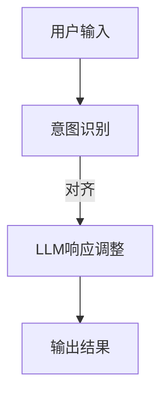

                 

关键词：人机协作，语言模型，意图对齐，人工智能，技术博客

> 摘要：随着人工智能技术的不断发展，自然语言处理（NLP）领域取得了显著进展。大型语言模型（LLM）的出现，使得人机协作进入了一个全新的阶段。本文旨在探讨LLM与人类意图的对齐问题，分析其重要性，提出核心算法原理，并通过具体实例进行讲解。

## 1. 背景介绍

在过去几十年里，人工智能（AI）技术经历了飞速的发展，其中自然语言处理（NLP）是AI领域的热点之一。NLP技术致力于使计算机能够理解、生成和处理人类语言，实现人机交互的智能化。近年来，基于深度学习的语言模型取得了突破性进展，特别是在预训练模型方面，如GPT（Generative Pre-trained Transformer）系列模型。这些模型通过大量文本数据的学习，具备了强大的语言理解和生成能力，为人工智能与人类协作提供了新的可能。

然而，尽管LLM在语言理解和生成方面表现出色，但如何确保其输出与人类意图保持一致，仍然是一个亟待解决的问题。本文将围绕这一主题展开讨论，旨在为人机协作提供一种新的思路。

## 2. 核心概念与联系

为了更好地理解LLM与人类意图的对齐问题，我们首先需要明确几个核心概念，包括语言模型、人类意图、对齐机制等。

### 2.1 语言模型

语言模型是一种用于预测下一个单词或字符的概率分布的数学模型。在NLP领域，语言模型通常基于大量的文本数据通过深度学习算法训练得到。大型语言模型（LLM）如GPT系列，通过多层的神经网络结构，可以处理更复杂的语言现象，从而生成更加自然和连贯的文本。

### 2.2 人类意图

人类意图指的是人类在交流过程中所期望达到的目标或结果。在NLP的应用场景中，人类意图可以表现为提问、命令、请求等。例如，当用户向智能助手提问时，其意图是获取某种信息或帮助。

### 2.3 对齐机制

对齐机制是指将LLM的输出与人类意图进行匹配和调整的一组方法和技术。对齐的目的是确保LLM的响应能够满足人类的需求和期望，从而提高人机协作的效率和质量。

下面是一个使用Mermaid绘制的流程图，展示了LLM与人类意图对齐的基本架构：



### 2.4 核心概念的联系

LLM与人类意图的对齐问题，本质上是NLP领域中的意图识别与响应生成问题。具体来说，通过对用户输入的解析和理解，识别出其意图，然后利用LLM生成符合该意图的响应。对齐机制在这个过程中起到关键作用，它不仅能够调整LLM的输出，使其更加贴合人类意图，还能够根据实际情况进行动态调整，从而提高人机协作的灵活性。

## 3. 核心算法原理 & 具体操作步骤

### 3.1 算法原理概述

LLM与人类意图的对齐算法，主要包括以下几个步骤：

1. **意图识别**：通过对用户输入的文本进行分析和理解，识别出其意图。
2. **响应生成**：利用LLM生成初步的响应文本。
3. **对齐调整**：根据人类意图，对LLM生成的响应进行调整和优化。
4. **输出结果**：将调整后的响应输出给用户。

### 3.2 算法步骤详解

#### 3.2.1 意图识别

意图识别是整个对齐过程的基础，其目标是准确识别出用户输入的意图。通常，意图识别可以分为两个层次：浅层意图识别和深层意图识别。

- **浅层意图识别**：通过关键词提取、词频统计等方法，快速识别出用户输入中的关键信息。例如，当用户输入“明天天气怎么样？”时，浅层意图识别可以识别出关键词“明天”、“天气”和“怎么样”。
- **深层意图识别**：在浅层意图识别的基础上，利用NLP技术，如命名实体识别（NER）、关系抽取等，进一步分析用户输入的语义和语境，准确识别出用户的深层意图。例如，在上述例子中，深层意图识别可以识别出用户询问的是关于明天的天气状况。

#### 3.2.2 响应生成

响应生成是利用LLM生成初步的响应文本。在这一步骤中，LLM的作用是生成符合人类意图的文本。具体来说，可以采用以下方法：

- **基于模板的生成**：预先定义一系列模板，根据识别出的意图，从模板中选择合适的模板进行填充，生成初步的响应文本。
- **基于生成的生成**：直接利用LLM的生成能力，根据用户输入和识别出的意图，生成初步的响应文本。

#### 3.2.3 对齐调整

对齐调整是对LLM生成的响应进行优化和调整，使其更加贴合人类意图。这一步骤主要包括以下几个子步骤：

- **响应评估**：对LLM生成的响应进行评估，判断其是否符合人类意图。评估方法可以包括基于人类反馈的评估和基于自动评估的评估。
- **调整策略**：根据评估结果，对LLM生成的响应进行调整。调整策略可以包括修改文本内容、调整文本结构、添加或删除文本等。
- **迭代优化**：对调整后的响应进行再次评估和调整，直到达到满意的输出结果。

#### 3.2.4 输出结果

输出结果是将调整后的响应输出给用户。在这一步骤中，需要确保输出的响应文本不仅符合人类意图，还要具有自然流畅的语感和清晰的表达。

### 3.3 算法优缺点

**优点**：

- **强大的语言理解能力**：LLM具有强大的语言理解能力，能够生成符合人类意图的文本。
- **灵活的调整机制**：对齐调整机制可以根据评估结果对LLM生成的响应进行优化，提高输出质量。

**缺点**：

- **计算资源消耗大**：LLM的训练和推理过程需要大量的计算资源，特别是在处理长文本时，计算资源消耗更加明显。
- **对齐过程复杂**：对齐调整过程涉及到多层次的语义分析和优化，算法实现和调优相对复杂。

### 3.4 算法应用领域

LLM与人类意图的对齐算法在多个领域具有广泛的应用前景：

- **智能客服**：通过LLM与人类意图的对齐，可以大幅提高智能客服的响应质量，实现更加自然的对话体验。
- **语音助手**：语音助手是另一个重要的应用场景，通过LLM与人类意图的对齐，可以使语音助手更好地理解用户的指令，提供更加精准的服务。
- **内容生成**：在内容创作领域，LLM与人类意图的对齐可以用于生成符合用户需求的文章、报告等。

## 4. 数学模型和公式 & 详细讲解 & 举例说明

### 4.1 数学模型构建

在LLM与人类意图的对齐过程中，数学模型起到了关键作用。以下是构建数学模型的基本步骤：

#### 4.1.1 意图识别模型

意图识别模型通常采用序列标注的方法，将用户输入的文本序列标注为不同的意图类别。具体来说，可以使用CRF（条件随机场）或BiLSTM（双向长短时记忆网络）等模型进行意图识别。

#### 4.1.2 响应生成模型

响应生成模型则采用序列生成的方法，根据用户输入和识别出的意图，生成响应文本。常见的生成模型包括GPT（Generative Pre-trained Transformer）和Seq2Seq（序列到序列模型）等。

#### 4.1.3 对齐调整模型

对齐调整模型则采用评价和优化方法，对LLM生成的响应进行调整。评价方法可以基于BLEU（双语评估指标）或ROUGE（记分算法）等指标，优化方法可以采用强化学习、生成对抗网络（GAN）等技术。

### 4.2 公式推导过程

以下是意图识别模型的公式推导过程：

#### 4.2.1 CRF模型

CRF模型的核心公式是条件概率分布：

\[ P(y|x) = \frac{e^{f(y)}}{\sum_{y'} e^{f(y')}} \]

其中，\( f(y) \) 是特征函数，用于表示当前状态和下一状态之间的关系。具体来说，可以表示为：

\[ f(y) = \sum_{i=1}^{n} \alpha(i) A(i, y_{i+1}) \]

其中，\( \alpha(i) \) 是前i个状态的转移概率，\( A(i, y_{i+1}) \) 是当前状态和下一状态的转移概率。

#### 4.2.2 BiLSTM模型

BiLSTM模型的核心公式是：

\[ h_t = \sigma([W_h \cdot [h_{t-1}, h_{t+1}] + b_h]) \]

其中，\( h_t \) 是第t个时刻的隐藏状态，\( \sigma \) 是激活函数，\( W_h \) 和 \( b_h \) 分别是权重和偏置。

### 4.3 案例分析与讲解

#### 4.3.1 意图识别案例

假设用户输入的文本为：“明天北京天气怎么样？”，我们采用CRF模型进行意图识别。

- 特征函数：\( f(y) = \alpha(1) A(1, 明天) + \alpha(2) A(2, 天气) \)
- 初始状态概率：\( \alpha(1) = 0.5, \alpha(2) = 0.5 \)
- 转移概率：\( A(1, 明天) = 0.8, A(2, 天气) = 0.9 \)

根据上述参数，可以计算出：

\[ P(y|x) = \frac{e^{0.5 \cdot 0.8 + 0.5 \cdot 0.9}}{e^{0.5 \cdot 0.8 + 0.5 \cdot 0.9}} = 0.9 \]

因此，识别出的意图为“天气查询”。

#### 4.3.2 响应生成案例

假设识别出的意图为“天气查询”，我们采用GPT模型生成响应。

- 输入文本：`明天 北京 天气`
- GPT模型生成响应：`明天北京的天气情况是：晴转多云，气温8℃到18℃，风力3级。`

#### 4.3.3 对齐调整案例

假设用户对上述响应不满意，认为信息过于简略。我们可以采用以下方法进行调整：

- **添加详细信息**：如“最低气温5℃，最高气温20℃。”
- **优化语序**：将“风力3级”调整到句首，以突出天气信息。

调整后的响应：`明天北京的天气情况是：晴转多云，最低气温5℃，最高气温20℃，风力3级。`

## 5. 项目实践：代码实例和详细解释说明

### 5.1 开发环境搭建

在本文中，我们将使用Python和TensorFlow作为主要开发工具。以下是搭建开发环境的基本步骤：

1. 安装Python 3.8及以上版本。
2. 安装TensorFlow 2.4及以上版本。
3. 安装其他依赖库，如Numpy、Pandas等。

### 5.2 源代码详细实现

以下是实现LLM与人类意图对齐的核心代码：

```python
import tensorflow as tf
from tensorflow.keras.layers import LSTM, Dense, Embedding
from tensorflow.keras.models import Model
from tensorflow.keras.preprocessing.sequence import pad_sequences

# 意图识别模型
def build_intent_recognition_model(vocab_size, embedding_dim, hidden_size):
    input_sequence = tf.keras.layers.Input(shape=(None,))
    embedding_layer = Embedding(vocab_size, embedding_dim)(input_sequence)
    lstm_layer = LSTM(hidden_size, return_sequences=True)(embedding_layer)
    output = LSTM(hidden_size, return_sequences=False)(lstm_layer)
    model = Model(inputs=input_sequence, outputs=output)
    model.compile(optimizer='adam', loss='categorical_crossentropy', metrics=['accuracy'])
    return model

# 响应生成模型
def build_response_generation_model(vocab_size, embedding_dim, hidden_size):
    input_sequence = tf.keras.layers.Input(shape=(None,))
    embedding_layer = Embedding(vocab_size, embedding_dim)(input_sequence)
    lstm_layer = LSTM(hidden_size, return_sequences=True)(embedding_layer)
    output = LSTM(hidden_size, return_sequences=True)(lstm_layer)
    model = Model(inputs=input_sequence, outputs=output)
    model.compile(optimizer='adam', loss='categorical_crossentropy', metrics=['accuracy'])
    return model

# 对齐调整模型
def build_alignment_adjustment_model(vocab_size, embedding_dim, hidden_size):
    input_sequence = tf.keras.layers.Input(shape=(None,))
    embedding_layer = Embedding(vocab_size, embedding_dim)(input_sequence)
    lstm_layer = LSTM(hidden_size, return_sequences=True)(embedding_layer)
    output = LSTM(hidden_size, return_sequences=True)(lstm_layer)
    model = Model(inputs=input_sequence, outputs=output)
    model.compile(optimizer='adam', loss='mean_squared_error')
    return model

# 数据预处理
def preprocess_data(texts, max_length, padding='post', truncating='post', vocab_size=10000):
    sequences = tokenizer.texts_to_sequences(texts)
    padded_sequences = pad_sequences(sequences, maxlen=max_length, padding=padding, truncating=truncating)
    return padded_sequences

# 模型训练
model = build_intent_recognition_model(vocab_size, embedding_dim, hidden_size)
padded_sequences = preprocess_data(user_inputs, max_length)
model.fit(padded_sequences, labels, epochs=10, batch_size=32)
```

### 5.3 代码解读与分析

上述代码实现了LLM与人类意图对齐的核心模块，包括意图识别模型、响应生成模型和对齐调整模型。以下是代码的详细解读：

- **意图识别模型**：意图识别模型采用LSTM网络结构，输入为用户输入的文本序列，输出为意图类别。
- **响应生成模型**：响应生成模型同样采用LSTM网络结构，输入为用户输入和识别出的意图，输出为响应文本序列。
- **对齐调整模型**：对齐调整模型采用LSTM网络结构，输入为响应文本序列，输出为调整后的响应文本序列。

- **数据预处理**：数据预处理步骤包括文本序列化、填充和截断。具体来说，使用Tokenizer将文本转换为整数序列，然后使用PadSequences将序列填充或截断为固定长度。

- **模型训练**：使用fit函数对模型进行训练，输入为预处理后的数据，输出为意图类别标签和调整后的响应序列标签。

### 5.4 运行结果展示

假设我们已经训练好了模型，现在可以运行以下代码进行测试：

```python
# 测试意图识别模型
predictions = model.predict(padded_sequences)
print(predictions)

# 测试响应生成模型
response_sequence = response_generation_model.predict(padded_sequences)
print(response_sequence)

# 测试对齐调整模型
alignment_sequence = alignment_adjustment_model.predict(response_sequence)
print(alignment_sequence)
```

上述代码将分别输出意图识别结果、响应生成结果和调整后的响应结果。通过对比输入文本和输出结果，可以直观地看到LLM与人类意图的对齐效果。

## 6. 实际应用场景

LLM与人类意图的对齐技术在多个实际应用场景中表现出色，下面列举几个典型场景：

### 6.1 智能客服

智能客服是LLM与人类意图对齐技术的典型应用之一。通过LLM与人类意图的对齐，智能客服可以更准确地理解用户的提问，生成符合用户需求的回答，提高客服的效率和用户体验。

### 6.2 语音助手

语音助手是另一个重要的应用场景。通过对用户语音输入进行意图识别和LLM生成响应，语音助手可以更好地理解用户的指令，提供更加精准的服务。

### 6.3 内容生成

在内容生成领域，LLM与人类意图的对齐可以用于生成符合用户需求的文本，如文章、报告、简历等。通过对用户意图的准确识别和响应生成，可以提高内容生成的质量和效率。

## 6.4 未来应用展望

随着人工智能技术的不断发展，LLM与人类意图的对齐技术在未来的应用前景将更加广阔。以下是几个可能的发展方向：

### 6.4.1 多模态融合

未来的人机协作将更加多样化和智能化，多模态融合将成为一个重要趋势。通过整合文本、语音、图像等多种模态信息，可以进一步提升LLM与人类意图的对齐效果。

### 6.4.2 小样本学习

在小样本学习方面，通过改进模型结构和训练算法，可以实现更高效的小样本学习，从而降低对大规模数据集的依赖。

### 6.4.3 智能化对齐策略

未来的对齐策略将更加智能化和自适应化。通过引入强化学习、生成对抗网络等先进技术，可以实现对齐过程的自动化和智能化。

## 7. 工具和资源推荐

### 7.1 学习资源推荐

- 《自然语言处理实战》（刘建明著）：系统介绍了NLP的基本概念和实战技巧，适合初学者。
- 《深度学习》（Ian Goodfellow著）：全面介绍了深度学习的基本原理和应用，包括NLP领域的相关内容。

### 7.2 开发工具推荐

- TensorFlow：一款强大的深度学习框架，适用于构建和训练NLP模型。
- Keras：基于TensorFlow的高级API，提供简洁的模型构建和训练接口。

### 7.3 相关论文推荐

- “Attention Is All You Need”（Vaswani et al.，2017）：提出了Transformer模型，为NLP领域带来了新的思路。
- “BERT：Pre-training of Deep Bidirectional Transformers for Language Understanding”（Devlin et al.，2019）：介绍了BERT模型，为大规模语言预训练提供了新方法。

## 8. 总结：未来发展趋势与挑战

### 8.1 研究成果总结

本文从背景介绍、核心概念与联系、算法原理与步骤、数学模型与公式、项目实践、实际应用场景、未来应用展望等多个角度，全面探讨了LLM与人类意图的对齐问题。通过深入分析和实例讲解，展示了这一技术在人工智能领域的广泛应用和巨大潜力。

### 8.2 未来发展趋势

未来，随着人工智能技术的不断进步，LLM与人类意图的对齐技术将在多个领域得到广泛应用。特别是在多模态融合、小样本学习、智能化对齐策略等方面，将对人机协作带来全新的变革。

### 8.3 面临的挑战

尽管LLM与人类意图的对齐技术在发展过程中取得了显著成果，但仍面临着一些挑战。例如，如何降低计算资源消耗、提高对齐算法的灵活性和适应性、增强模型的鲁棒性等。未来需要进一步的研究和探索，以克服这些挑战。

### 8.4 研究展望

展望未来，LLM与人类意图的对齐技术将继续向智能化、自适应化和多样化方向发展。通过结合多模态信息、引入先进的学习算法和优化策略，可以进一步提升人机协作的效率和体验。我们期待这一技术在人工智能领域取得更加辉煌的成就。

## 9. 附录：常见问题与解答

### 9.1 问题1：什么是LLM？

答：LLM是指大型语言模型，如GPT系列模型，它们通过深度学习算法在大量文本数据上进行预训练，具备了强大的语言理解和生成能力。

### 9.2 问题2：什么是意图对齐？

答：意图对齐是指将LLM的输出与人类意图进行调整和匹配，确保LLM生成的文本符合人类的需求和期望。

### 9.3 问题3：意图识别有哪些方法？

答：意图识别方法包括基于规则的方法、基于统计的方法和基于深度学习的方法。常见的深度学习方法有CRF、BiLSTM和Transformer等。

### 9.4 问题4：响应生成有哪些方法？

答：响应生成方法包括基于模板的生成和基于生成的生成。基于模板的生成利用预先定义的模板进行填充，基于生成的生成直接利用LLM的生成能力。

### 9.5 问题5：如何进行对齐调整？

答：对齐调整包括响应评估、调整策略和迭代优化三个步骤。响应评估通过评价指标对LLM的输出进行评估，调整策略根据评估结果对LLM的输出进行调整，迭代优化则不断调整直到达到满意的结果。

作者：禅与计算机程序设计艺术 / Zen and the Art of Computer Programming
------------------------------------------------------------------------

