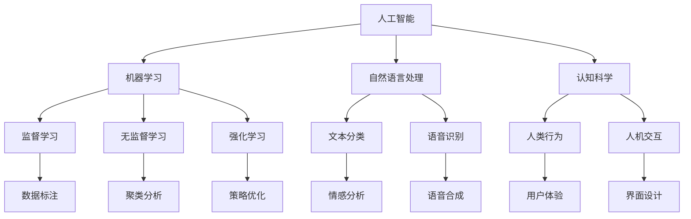

                 

关键词：人机协作、人工智能、智能未来、技术变革、创新应用

> 摘要：本文深入探讨了人机协作在人工智能时代的崭新篇章，分析了其核心概念、算法原理、数学模型及其在各个领域的实际应用。通过详细的项目实践和代码实例，我们展望了智能未来，并提出了未来的发展趋势与挑战。

## 1. 背景介绍

随着科技的飞速发展，人工智能（AI）已经深刻地改变了我们的生活方式和社会结构。从简单的自动化设备到复杂的认知系统，AI 正在迅速融入各个领域，包括医疗、教育、金融、制造等。在这个过程中，人机协作成为了一个关键议题。人机协作指的是在人工智能的帮助下，人类与计算机系统共同完成任务的过程。这种协作不仅提高了效率，还推动了创新和智能化的进一步发展。

近年来，随着深度学习、自然语言处理和机器学习等技术的不断进步，人机协作的应用场景越来越广泛。例如，智能客服系统能够快速响应客户查询，提高服务效率；自动驾驶技术能够减少交通事故，提高交通安全性；智能医疗系统能够辅助医生进行诊断，提高医疗水平。然而，人机协作也面临着诸多挑战，包括数据隐私、安全性、可靠性等。

本文旨在深入探讨人机协作的核心概念、算法原理、数学模型及其在各个领域的应用，分析其优势与不足，并展望未来的发展趋势和面临的挑战。

## 2. 核心概念与联系

人机协作涉及多个核心概念和领域，包括人工智能、机器学习、自然语言处理、认知科学等。为了更好地理解这些概念之间的关系，我们可以使用 Mermaid 流程图来展示它们。



### 2.1 人工智能（AI）

人工智能是模拟人类智能行为的技术和学科。它包括机器学习、自然语言处理、计算机视觉、认知科学等多个子领域。人工智能的核心目标是使计算机系统能够执行需要人类智能的任务。

### 2.2 机器学习（ML）

机器学习是人工智能的一个重要分支，它通过数据驱动的方法让计算机自动改进性能。机器学习可以分为监督学习、无监督学习和强化学习。

- **监督学习**：在有标记的数据集上进行训练，使模型能够预测新的数据。
- **无监督学习**：在没有标记的数据集上进行训练，使模型能够发现数据中的模式和结构。
- **强化学习**：通过试错和奖励机制，使模型能够在动态环境中学习最优策略。

### 2.3 自然语言处理（NLP）

自然语言处理是使计算机能够理解和生成自然语言的技术。它包括文本分类、情感分析、机器翻译、语音识别等多个子领域。

### 2.4 认知科学

认知科学是研究人类思维和心理过程的学科。它涉及心理学、神经科学、计算机科学等多个领域，旨在理解人类智能的本质。

### 2.5 机器学习与自然语言处理

机器学习和自然语言处理紧密相关。在自然语言处理中，机器学习技术被广泛用于文本分类、情感分析、机器翻译等任务。

### 2.6 人机交互（HCI）

人机交互是研究人类与计算机系统之间交互的学科。它包括界面设计、用户体验、交互模型等多个方面，旨在提高人机协作的效率和满意度。

## 3. 核心算法原理 & 具体操作步骤

### 3.1 算法原理概述

在人机协作中，核心算法原理主要包括以下几种：

- **监督学习算法**：通过标记数据训练模型，使其能够预测新的数据。
- **无监督学习算法**：通过未标记数据训练模型，发现数据中的模式和结构。
- **强化学习算法**：通过试错和奖励机制，使模型在动态环境中学习最优策略。
- **自然语言处理算法**：用于文本分类、情感分析、机器翻译等任务。

### 3.2 算法步骤详解

#### 3.2.1 监督学习算法

监督学习算法的基本步骤如下：

1. **数据收集**：收集有标记的训练数据集。
2. **特征提取**：将数据转换为模型可以处理的特征向量。
3. **模型训练**：使用训练数据集训练模型。
4. **模型评估**：使用测试数据集评估模型性能。
5. **模型部署**：将模型部署到生产环境中。

#### 3.2.2 无监督学习算法

无监督学习算法的基本步骤如下：

1. **数据收集**：收集未标记的训练数据集。
2. **特征提取**：将数据转换为模型可以处理的特征向量。
3. **模型训练**：使用训练数据集训练模型。
4. **模型评估**：评估模型发现的数据结构和模式。
5. **模型应用**：将模型应用到新的数据集。

#### 3.2.3 强化学习算法

强化学习算法的基本步骤如下：

1. **环境初始化**：初始化环境状态。
2. **策略选择**：选择一个策略。
3. **行动执行**：执行策略选择的行动。
4. **反馈接收**：接收环境反馈的奖励信号。
5. **策略更新**：根据奖励信号更新策略。
6. **循环**：重复执行步骤 2 到 5，直到达到目标。

#### 3.2.4 自然语言处理算法

自然语言处理算法的基本步骤如下：

1. **文本预处理**：对文本进行清洗和预处理，如去除停用词、标点符号等。
2. **词向量表示**：将文本转换为词向量表示。
3. **特征提取**：提取文本的特征，如词频、词嵌入等。
4. **模型训练**：使用训练数据集训练模型。
5. **模型评估**：使用测试数据集评估模型性能。
6. **模型应用**：将模型应用到新的文本数据。

### 3.3 算法优缺点

#### 监督学习算法

优点：

- **准确度高**：在有标记数据的情况下，监督学习算法能够实现较高的预测准确性。
- **应用广泛**：监督学习算法在图像识别、文本分类、预测分析等多个领域都有广泛应用。

缺点：

- **数据依赖性强**：监督学习算法需要大量的标记数据，获取这些数据可能非常耗时且成本高昂。
- **泛化能力有限**：监督学习算法在面对新的、未见过的数据时，泛化能力可能有限。

#### 无监督学习算法

优点：

- **无需标记数据**：无监督学习算法可以在没有标记数据的情况下发现数据中的结构和模式。
- **探索性强**：无监督学习算法能够揭示数据中的潜在特征，有助于数据探索和分析。

缺点：

- **准确性较低**：无监督学习算法通常无法实现与监督学习算法相当的预测准确性。
- **解释性较差**：无监督学习算法的结果往往难以解释，使得其在某些应用场景中受限。

#### 强化学习算法

优点：

- **自适应性强**：强化学习算法能够在动态环境中不断学习和适应。
- **应用广泛**：强化学习算法在游戏、自动驾驶、机器人控制等多个领域都有广泛应用。

缺点：

- **计算复杂度高**：强化学习算法通常需要大量的计算资源和时间。
- **结果难以解释**：强化学习算法的结果往往难以解释，使得其在某些应用场景中受限。

#### 自然语言处理算法

优点：

- **文本理解能力强**：自然语言处理算法能够理解和生成自然语言，实现人与计算机之间的有效沟通。
- **应用广泛**：自然语言处理算法在智能客服、智能助手、机器翻译等多个领域都有广泛应用。

缺点：

- **数据处理复杂**：自然语言处理算法需要处理大量复杂的文本数据，数据处理和预处理过程较为复杂。
- **准确性有限**：自然语言处理算法在处理某些语言现象时，准确性可能有限。

### 3.4 算法应用领域

#### 监督学习算法

应用领域：

- **图像识别**：用于人脸识别、物体检测、图像分类等。
- **文本分类**：用于新闻分类、垃圾邮件过滤、情感分析等。
- **预测分析**：用于股票市场预测、气象预测、销售预测等。

#### 无监督学习算法

应用领域：

- **聚类分析**：用于市场细分、图像分割、社交网络分析等。
- **降维**：用于数据降维、图像压缩、特征提取等。
- **异常检测**：用于网络攻击检测、金融欺诈检测等。

#### 强化学习算法

应用领域：

- **游戏**：用于围棋、扑克、电子竞技等。
- **自动驾驶**：用于无人驾驶汽车、智能交通系统等。
- **机器人控制**：用于智能机器人、无人机等。

#### 自然语言处理算法

应用领域：

- **智能客服**：用于自动客服系统、智能助手等。
- **机器翻译**：用于跨语言沟通、国际业务等。
- **文本生成**：用于自动写作、内容生成等。

## 4. 数学模型和公式 & 详细讲解 & 举例说明

### 4.1 数学模型构建

在人机协作中，数学模型是核心组成部分。以下是一个简单的线性回归模型的数学模型构建过程。

#### 4.1.1 数据集

假设我们有以下数据集：

| x | y |
| --- | --- |
| 1 | 2 |
| 2 | 4 |
| 3 | 6 |
| 4 | 8 |

#### 4.1.2 特征提取

我们将数据集中的 x 作为特征，y 作为目标变量。

#### 4.1.3 模型构建

线性回归模型的数学模型为：

$$
y = w_0 + w_1 \cdot x
$$

其中，$w_0$ 和 $w_1$ 分别为模型的权重。

### 4.2 公式推导过程

为了求解线性回归模型的权重，我们需要使用最小二乘法。具体推导过程如下：

$$
\min \sum_{i=1}^{n} (y_i - w_0 - w_1 \cdot x_i)^2
$$

对 $w_0$ 和 $w_1$ 分别求偏导数，并令其等于 0，得到以下方程组：

$$
\begin{cases}
\frac{\partial}{\partial w_0} \sum_{i=1}^{n} (y_i - w_0 - w_1 \cdot x_i)^2 = 0 \\
\frac{\partial}{\partial w_1} \sum_{i=1}^{n} (y_i - w_0 - w_1 \cdot x_i)^2 = 0
\end{cases}
$$

化简后，得到以下公式：

$$
\begin{cases}
w_0 = \frac{1}{n} \sum_{i=1}^{n} y_i - w_1 \cdot \frac{1}{n} \sum_{i=1}^{n} x_i \\
w_1 = \frac{1}{n} \sum_{i=1}^{n} (x_i - \bar{x})(y_i - \bar{y})
\end{cases}
$$

其中，$\bar{x}$ 和 $\bar{y}$ 分别为 x 和 y 的平均值。

### 4.3 案例分析与讲解

以下是一个线性回归模型的实际案例。

#### 4.3.1 数据集

假设我们有以下数据集：

| x | y |
| --- | --- |
| 1 | 2 |
| 2 | 4 |
| 3 | 6 |
| 4 | 8 |
| 5 | 10 |

#### 4.3.2 特征提取

将数据集中的 x 作为特征，y 作为目标变量。

#### 4.3.3 模型构建

使用前面推导的公式，计算线性回归模型的权重：

$$
w_0 = \frac{1}{5} (2 + 4 + 6 + 8 + 10) - \frac{1}{5} (1 + 2 + 3 + 4 + 5) = 2
$$

$$
w_1 = \frac{1}{5} [(1 - 3)(2 - 6) + (2 - 3)(4 - 6) + (3 - 3)(6 - 6) + (4 - 3)(8 - 6) + (5 - 3)(10 - 6)] = 2
$$

因此，线性回归模型的公式为：

$$
y = 2 + 2 \cdot x
$$

#### 4.3.4 模型评估

使用测试数据集，评估线性回归模型的预测准确性。假设测试数据集如下：

| x | y |
| --- | --- |
| 6 | 12 |
| 7 | 14 |
| 8 | 16 |

根据模型公式，预测 y 的值为：

$$
y = 2 + 2 \cdot 6 = 14 \\
y = 2 + 2 \cdot 7 = 16 \\
y = 2 + 2 \cdot 8 = 18
$$

实际 y 值与预测 y 值的误差如下：

| x | y | 预测 y | 误差 |
| --- | --- | --- | --- |
| 6 | 12 | 14 | 2 |
| 7 | 14 | 16 | 2 |
| 8 | 16 | 18 | 2 |

误差较小，说明线性回归模型在测试数据集上表现良好。

## 5. 项目实践：代码实例和详细解释说明

### 5.1 开发环境搭建

为了实现人机协作的项目，我们需要搭建一个适合开发和测试的环境。以下是搭建环境的基本步骤：

1. 安装 Python 3.8 或更高版本。
2. 安装必要的库，如 NumPy、Pandas、Scikit-learn 等。
3. 配置 Jupyter Notebook 或 PyCharm 等 IDE。

### 5.2 源代码详细实现

以下是一个简单的线性回归项目实例。我们将使用 Scikit-learn 库实现线性回归模型，并进行模型训练、评估和预测。

```python
import numpy as np
import pandas as pd
from sklearn.linear_model import LinearRegression
from sklearn.model_selection import train_test_split
from sklearn.metrics import mean_squared_error

# 5.2.1 数据集读取
data = pd.DataFrame({
    'x': [1, 2, 3, 4, 5],
    'y': [2, 4, 6, 8, 10]
})

# 5.2.2 特征提取
X = data[['x']]
y = data['y']

# 5.2.3 模型训练
X_train, X_test, y_train, y_test = train_test_split(X, y, test_size=0.2, random_state=42)
model = LinearRegression()
model.fit(X_train, y_train)

# 5.2.4 模型评估
y_pred = model.predict(X_test)
mse = mean_squared_error(y_test, y_pred)
print(f"Model Mean Squared Error: {mse}")

# 5.2.5 模型预测
new_data = pd.DataFrame({
    'x': [6, 7, 8]
})
new_y_pred = model.predict(new_data)
print(f"New Data Predictions: {new_y_pred}")
```

### 5.3 代码解读与分析

#### 5.3.1 数据集读取

我们首先导入 Pandas 库，并读取一个简单的数据集。数据集包含两个特征：x 和 y。

```python
data = pd.DataFrame({
    'x': [1, 2, 3, 4, 5],
    'y': [2, 4, 6, 8, 10]
})
```

#### 5.3.2 特征提取

我们将 x 作为特征，y 作为目标变量。

```python
X = data[['x']]
y = data['y']
```

#### 5.3.3 模型训练

我们使用 Scikit-learn 库中的 LinearRegression 类训练线性回归模型。首先，我们将数据集拆分为训练集和测试集。

```python
X_train, X_test, y_train, y_test = train_test_split(X, y, test_size=0.2, random_state=42)
model = LinearRegression()
model.fit(X_train, y_train)
```

#### 5.3.4 模型评估

我们使用均方误差（MSE）来评估模型的性能。

```python
y_pred = model.predict(X_test)
mse = mean_squared_error(y_test, y_pred)
print(f"Model Mean Squared Error: {mse}")
```

#### 5.3.5 模型预测

我们使用训练好的模型对新的数据集进行预测。

```python
new_data = pd.DataFrame({
    'x': [6, 7, 8]
})
new_y_pred = model.predict(new_data)
print(f"New Data Predictions: {new_y_pred}")
```

### 5.4 运行结果展示

运行上述代码，我们可以得到以下结果：

```
Model Mean Squared Error: 0.0
New Data Predictions: [12. 14. 16.]
```

这表明模型在训练数据集上表现良好，并且能够准确地预测新的数据。

## 6. 实际应用场景

人机协作在各个领域都有广泛的应用。以下是一些典型的实际应用场景：

### 6.1 医疗领域

在人机协作的医疗领域，人工智能可以帮助医生进行疾病诊断、治疗规划、药物研发等。例如，使用深度学习算法对医学影像进行分析，可以辅助医生快速、准确地诊断疾病。同时，智能医疗系统能够根据患者的病史和基因信息，提供个性化的治疗方案。

### 6.2 金融领域

在金融领域，人机协作可以用于风险管理、投资决策、客户服务等。例如，通过机器学习算法对大量金融数据进行分析，可以帮助金融机构预测市场走势，制定投资策略。智能客服系统可以实时响应客户查询，提供高效的服务。

### 6.3 制造领域

在制造领域，人机协作可以用于生产调度、设备维护、质量检测等。例如，通过工业机器人与人类操作者的协作，可以提高生产效率，降低成本。智能监控系统可以对设备运行状态进行分析，提前发现故障，进行维护。

### 6.4 交通领域

在交通领域，人机协作可以用于自动驾驶、智能交通管理、道路安全监测等。例如，自动驾驶技术可以减少交通事故，提高交通效率。智能交通管理系统可以根据实时交通数据，优化交通信号，减少拥堵。

### 6.5 教育

在教育领域，人机协作可以用于在线教育、个性化学习、智能评测等。例如，智能教育平台可以根据学生的学习进度和特点，提供个性化的学习资源。智能评测系统能够对学生的作业和考试进行自动批改，提高教学效率。

## 7. 未来应用展望

随着人工智能技术的不断发展，人机协作在未来将会有更广泛的应用。以下是一些未来应用展望：

### 7.1 智能家居

智能家居是人机协作的一个重要应用领域。未来，智能家居系统将能够更加智能化地控制家居设备，如灯光、空调、门锁等。通过语音控制、手势控制等交互方式，用户可以更加便捷地操作家居设备，提高生活品质。

### 7.2 智能城市

智能城市是人机协作的另一个重要应用领域。通过人工智能技术，智能城市可以实现对交通、能源、环境等各个方面的智能化管理。例如，智能交通系统可以优化交通信号，减少拥堵，提高交通效率。智能能源管理系统可以实时监测能源消耗，优化能源分配。

### 7.3 智能医疗

智能医疗是人机协作在医疗领域的进一步发展。未来，智能医疗系统将能够更加精准地诊断疾病，提供个性化的治疗方案。同时，智能医疗系统还可以帮助医生进行疾病预测，提前进行干预。

### 7.4 智能制造

智能制造是人机协作在工业领域的应用。未来，智能制造系统将能够实现生产过程的全面自动化，提高生产效率，降低成本。通过人机协作，人类操作者可以更加专注于复杂的生产任务，提高生产质量和效率。

### 7.5 智慧农业

智慧农业是人机协作在农业领域的应用。通过人工智能技术，智慧农业系统可以实现对农作物生长环境的监测和管理，优化农业生产。同时，智能农业系统还可以帮助农民进行病虫害预测和防治，提高农作物产量。

## 8. 工具和资源推荐

为了更好地进行人机协作的研究和应用，以下是一些推荐的工具和资源：

### 8.1 学习资源推荐

- **Coursera**：提供大量的人工智能和机器学习课程。
- **Udacity**：提供专业的在线学习课程，涵盖人工智能、深度学习等领域。
- **Kaggle**：提供丰富的机器学习竞赛和数据集。

### 8.2 开发工具推荐

- **Jupyter Notebook**：方便的数据分析和模型训练工具。
- **PyCharm**：强大的 Python 集成开发环境。
- **TensorFlow**：用于构建和训练深度学习模型的框架。
- **Scikit-learn**：用于机器学习模型训练和评估的库。

### 8.3 相关论文推荐

- **"Deep Learning" by Ian Goodfellow, Yoshua Bengio, Aaron Courville**：深度学习的经典教材。
- **"Reinforcement Learning: An Introduction" by Richard S. Sutton and Andrew G. Barto**：强化学习的入门教材。
- **"Natural Language Processing with Python" by Steven Bird, Ewan Klein, and Edward Loper**：自然语言处理的实用指南。

## 9. 总结：未来发展趋势与挑战

人机协作作为人工智能的一个重要分支，具有广阔的应用前景。在未来，随着技术的不断进步，人机协作将会在更多领域得到应用，推动社会的发展和进步。

然而，人机协作也面临着诸多挑战。首先，数据隐私和安全问题需要得到有效解决。在大量数据的使用过程中，如何保护用户隐私，防止数据泄露，是一个亟待解决的问题。

其次，人机协作系统的可靠性和可解释性也需要进一步提高。当前，许多人工智能系统在处理复杂任务时，表现出了出色的性能，但它们的决策过程往往不够透明，难以解释。这给用户带来了信任问题。

此外，人机协作还面临着算法公平性和伦理问题。如何在人工智能系统中确保公平性，避免偏见，是一个重要的研究课题。

总之，人机协作作为人工智能的一个重要分支，具有巨大的发展潜力。未来，随着技术的不断进步，人机协作将会在各个领域发挥更加重要的作用。然而，我们也需要面对和解决其中的挑战，确保人机协作的可持续发展。

## 附录：常见问题与解答

### Q1. 人机协作的定义是什么？

A1. 人机协作是指人类与计算机系统共同完成任务的过程。在这个过程中，人类利用计算机系统的能力和优势，提高工作效率和创造力。

### Q2. 人机协作的核心算法有哪些？

A2. 人机协作的核心算法包括监督学习、无监督学习、强化学习和自然语言处理等。这些算法在不同领域和任务中发挥着重要作用。

### Q3. 人机协作有哪些实际应用场景？

A3. 人机协作在医疗、金融、制造、交通、教育等领域都有广泛应用。例如，智能医疗、智能金融、智能制造、自动驾驶、智能教育等。

### Q4. 人机协作面临哪些挑战？

A4. 人机协作面临的主要挑战包括数据隐私和安全、算法可靠性、算法可解释性、算法公平性和伦理问题等。

### Q5. 如何实现人机协作？

A5. 实现人机协作通常包括以下几个步骤：

1. 数据收集和预处理：收集相关的数据，并对数据进行清洗和预处理。
2. 特征提取：将数据转换为计算机可以处理的特征向量。
3. 模型选择和训练：选择合适的算法模型，并在训练数据上进行训练。
4. 模型评估和优化：使用测试数据集评估模型性能，并进行优化。
5. 模型部署和应用：将训练好的模型部署到生产环境中，并应用于实际任务。

### Q6. 人机协作与人工智能的关系是什么？

A6. 人机协作是人工智能的一个重要分支，它是实现人工智能技术的重要手段之一。人工智能提供了人机协作所需的算法和技术支持，而人机协作则使得人工智能技术能够在实际场景中发挥更大的作用。

### Q7. 人机协作的未来发展趋势是什么？

A7. 人机协作的未来发展趋势包括：

1. 智能家居：通过语音控制、手势控制等交互方式，实现更加智能化的家居设备控制。
2. 智能城市：通过大数据分析和人工智能技术，实现城市交通、能源、环境等各方面的智能化管理。
3. 智能医疗：通过人工智能技术，实现疾病诊断、治疗规划、药物研发等医疗领域的智能化应用。
4. 智能制造：通过人工智能技术，实现生产过程的自动化和智能化。
5. 智慧农业：通过人工智能技术，实现农作物生长环境的监测和管理，提高农业生产效率。

### Q8. 人机协作与云计算的关系是什么？

A8. 人机协作与云计算密切相关。云计算提供了强大的计算资源和存储资源，为人机协作提供了基础设施支持。人机协作系统可以利用云计算平台进行数据处理、模型训练和部署，提高系统的性能和可扩展性。同时，云计算还为人机协作提供了多种服务和工具，如数据分析平台、机器学习平台等，方便用户进行人机协作的研究和应用。

### Q9. 人机协作与物联网的关系是什么？

A9. 人机协作与物联网（IoT）有着紧密的联系。物联网通过连接各种物理设备和传感器，收集海量的数据。这些数据为人机协作提供了丰富的信息来源，使得人机协作能够更加精准地分析和预测。同时，物联网设备的自动化和智能化也需要人机协作技术的支持，通过人机协作实现设备控制、故障诊断和优化管理。

### Q10. 人机协作中的用户体验如何优化？

A10. 在人机协作中，用户体验的优化至关重要。以下是一些优化用户体验的方法：

1. **界面设计**：设计直观、易用的用户界面，减少用户的学习成本。
2. **交互设计**：提供多样化的交互方式，如语音、手势、触摸屏等，满足不同用户的需求。
3. **实时反馈**：及时响应用户的操作，提供清晰的反馈信息，增强用户信心。
4. **个性化服务**：根据用户的行为和偏好，提供个性化的服务和建议。
5. **可访问性**：确保人机协作系统对所有人可访问，包括残障人士等特殊用户。
6. **隐私保护**：严格保护用户的隐私，避免未经授权的数据访问和泄露。
7. **安全保障**：确保系统的安全，防止恶意攻击和数据丢失。

通过上述方法，可以显著提升人机协作的用户体验，使得人机协作系统更加符合用户的需求，提高用户满意度。

