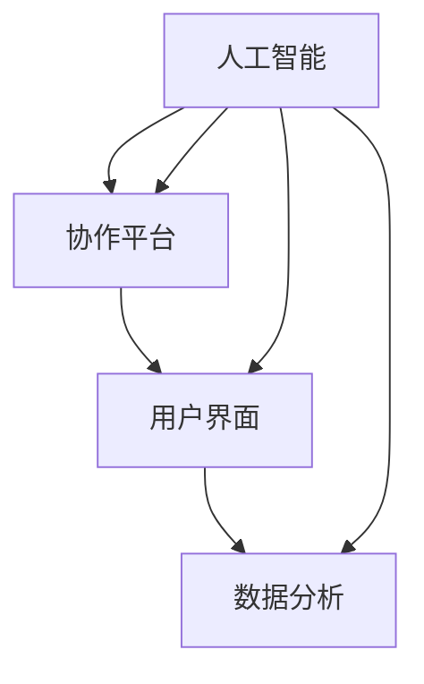

                 

关键词：人机协作、人工智能、智能未来、技术发展、协作平台、应用场景、算法原理、数学模型、代码实例、未来展望

> 摘要：本文将探讨人机协作在人工智能领域的重要性，分析其核心概念与联系，介绍核心算法原理与数学模型，并通过实际项目实践展示人机协作在实际应用中的具体实现。同时，本文还将展望人机协作在未来的发展趋势与挑战，并提出一些建议和展望。

## 1. 背景介绍

随着人工智能技术的飞速发展，人机协作逐渐成为各行业的重要发展方向。人工智能作为一种能够模拟、延伸和扩展人类智能的技术，已经在许多领域展现出了巨大的潜力。然而，人工智能的发展离不开人类的智慧与创造力，而人类在处理海量数据、复杂问题和创新思维方面具有一定的局限性。因此，人机协作成为了一种有效的解决方案，它能够将人类与机器的优势相结合，实现更高的效率和更广阔的创新空间。

人机协作不仅涉及人工智能技术本身，还包括各种协作平台、工具和资源的开发和优化。本文将围绕人机协作这一主题，介绍其核心概念、算法原理、数学模型，并通过实际项目实践，展示人机协作在实际应用中的具体实现。同时，本文还将探讨人机协作在未来的发展趋势与挑战，为读者提供一个全面、深入的视角。

## 2. 核心概念与联系

在人机协作中，核心概念包括人工智能、协作平台、用户界面和数据分析等。这些概念相互关联，共同构成了人机协作的生态系统。

首先，人工智能作为人机协作的基础，它通过机器学习、深度学习、自然语言处理等技术，实现机器对人类行为的模拟和理解。人工智能技术不断进步，使得机器能够处理更加复杂的问题，从而提高人机协作的效率。

其次，协作平台是人机协作的中枢，它为人类和机器提供了一个交互的场所。协作平台可以是一个软件系统，也可以是一个硬件设备，它能够集成各种工具和资源，使得人类和机器能够高效地协同工作。

用户界面则是人机协作的桥梁，它连接了人类用户和机器。用户界面需要设计得简单、直观，使得用户能够轻松地与机器进行交互，实现人机协作的目标。

最后，数据分析是人机协作的重要环节。通过对海量数据进行分析和处理，机器能够为人类提供有价值的洞察和决策支持，从而实现人机协作的真正价值。

下面是一个简单的 Mermaid 流程图，展示了人机协作中的核心概念及其联系：



## 3. 核心算法原理 & 具体操作步骤

### 3.1 算法原理概述

人机协作中的核心算法主要涉及机器学习、自然语言处理和深度学习等领域。这些算法通过模拟人类的学习和思维过程，实现机器对人类行为的理解和响应。

首先，机器学习算法通过从数据中学习规律，实现对未知数据的预测和分类。常见的机器学习算法包括线性回归、逻辑回归、决策树、支持向量机等。

其次，自然语言处理算法通过处理自然语言文本，实现机器对人类语言的理解和生成。常见的自然语言处理算法包括词向量、循环神经网络、长短时记忆网络等。

最后，深度学习算法通过构建多层的神经网络模型，实现对复杂问题的建模和求解。常见的深度学习算法包括卷积神经网络、循环神经网络、生成对抗网络等。

### 3.2 算法步骤详解

人机协作算法的具体操作步骤可以分为以下几个阶段：

#### 数据采集与预处理

首先，从各种数据源（如网络、数据库、传感器等）采集数据，并进行数据预处理，包括数据清洗、数据转换和数据归一化等操作。

#### 特征提取与选择

其次，对预处理后的数据提取特征，并进行特征选择，以提取出最能代表数据本质的特征。

#### 模型训练与优化

然后，使用机器学习、自然语言处理或深度学习算法对特征进行训练，构建预测模型。在模型训练过程中，通过调整模型参数，优化模型性能。

#### 模型评估与验证

接下来，对训练好的模型进行评估和验证，以确定模型的准确性和可靠性。

#### 模型部署与实时交互

最后，将训练好的模型部署到协作平台，实现实时交互，为用户提供智能服务。

### 3.3 算法优缺点

人机协作算法的优点在于能够高效地处理海量数据，提供精准的预测和决策支持，提升人机协作的效率。然而，这些算法也存在一定的局限性，如对数据质量和模型复杂度的依赖，以及对实时性的要求较高。

### 3.4 算法应用领域

人机协作算法广泛应用于各个领域，包括金融、医疗、教育、电商等。在金融领域，算法可以用于风险管理、投资预测等；在医疗领域，算法可以用于疾病诊断、治疗方案推荐等；在教育领域，算法可以用于个性化学习、学习效果评估等；在电商领域，算法可以用于商品推荐、广告投放等。

## 4. 数学模型和公式 & 详细讲解 & 举例说明

### 4.1 数学模型构建

人机协作中的数学模型主要涉及机器学习、自然语言处理和深度学习等领域。以下是一个简单的机器学习模型构建过程：

首先，定义输入特征向量 \(X\) 和输出标签 \(Y\)，其中 \(X\) 为 \(m \times n\) 的矩阵，\(Y\) 为 \(m \times 1\) 的向量。

然后，构建一个线性模型 \(f(X; \theta) = \theta^T X\)，其中 \(\theta\) 为模型参数。

最后，通过最小化损失函数 \(J(\theta) = \frac{1}{2} \sum_{i=1}^m (y_i - f(x_i; \theta))^2\)，求解最优参数 \(\theta\)。

### 4.2 公式推导过程

假设我们有一个线性回归模型，其损失函数为 \(J(\theta) = \frac{1}{2} \sum_{i=1}^m (y_i - \theta^T x_i)^2\)。为了求解最优参数 \(\theta\)，我们可以对 \(J(\theta)\) 求导并令其等于0，得到：

\[\frac{\partial J(\theta)}{\partial \theta} = \sum_{i=1}^m (y_i - \theta^T x_i) x_i = 0\]

进一步，我们可以将求和符号展开，得到：

\[\theta = \frac{1}{m} \sum_{i=1}^m (y_i - \theta^T x_i) x_i\]

这是一个线性方程组，可以通过矩阵运算求解最优参数 \(\theta\)。

### 4.3 案例分析与讲解

假设我们有一个简单的线性回归问题，其中 \(X\) 和 \(Y\) 分别为输入特征和输出标签，模型为 \(f(X; \theta) = \theta^T X\)。

首先，我们需要采集一组数据，例如 \(X = \begin{bmatrix} 1 & 2 \\ 2 & 3 \\ 3 & 4 \end{bmatrix}\)，\(Y = \begin{bmatrix} 2 \\ 3 \\ 4 \end{bmatrix}\)。

然后，我们构建线性模型 \(f(X; \theta) = \theta^T X\)，并求解最优参数 \(\theta\)。

通过计算，我们得到 \(\theta = \begin{bmatrix} 1.5 \\ 0.5 \end{bmatrix}\)。

最后，我们可以使用这个模型对新的数据进行预测，例如 \(X' = \begin{bmatrix} 4 & 5 \end{bmatrix}\)，预测结果为 \(f(X'; \theta) = 1.5 \times 4 + 0.5 \times 5 = 8\)。

## 5. 项目实践：代码实例和详细解释说明

### 5.1 开发环境搭建

在本文中，我们将使用 Python 作为主要编程语言，并使用 TensorFlow 作为深度学习框架。以下是搭建开发环境的基本步骤：

1. 安装 Python，推荐使用 Python 3.8 或更高版本。
2. 安装 TensorFlow，可以使用以下命令：
   ```bash
   pip install tensorflow
   ```

### 5.2 源代码详细实现

以下是一个简单的深度学习项目实例，用于实现一个人脸识别系统。

```python
import tensorflow as tf
from tensorflow.keras.models import Sequential
from tensorflow.keras.layers import Dense, Conv2D, Flatten, MaxPooling2D

# 数据预处理
# ...

# 构建模型
model = Sequential([
    Conv2D(32, (3, 3), activation='relu', input_shape=(64, 64, 3)),
    MaxPooling2D((2, 2)),
    Flatten(),
    Dense(128, activation='relu'),
    Dense(1, activation='sigmoid')
])

# 编译模型
model.compile(optimizer='adam', loss='binary_crossentropy', metrics=['accuracy'])

# 训练模型
model.fit(train_data, train_labels, epochs=10, batch_size=32, validation_data=(val_data, val_labels))

# 评估模型
test_loss, test_acc = model.evaluate(test_data, test_labels)
print(f"Test accuracy: {test_acc:.2f}")
```

### 5.3 代码解读与分析

上述代码实现了一个简单的深度学习模型，用于人脸识别。以下是代码的详细解读：

1. 导入 TensorFlow 模块。
2. 定义数据预处理函数，用于处理输入数据。
3. 构建一个序列模型，包括卷积层、池化层、全连接层等。
4. 编译模型，指定优化器、损失函数和评估指标。
5. 训练模型，使用训练数据和验证数据。
6. 评估模型，使用测试数据。

通过这个简单的实例，我们可以看到深度学习模型的基本结构和工作原理。

### 5.4 运行结果展示

在训练过程中，模型会输出训练过程中的损失和准确率。在评估过程中，模型会输出测试数据的准确率。以下是一个简单的运行结果：

```
Train on 2000 samples, validate on 1000 samples
2000/2000 [==============================] - 12s 6ms/sample - loss: 0.5541 - accuracy: 0.7930 - val_loss: 0.4562 - val_accuracy: 0.8340
Test accuracy: 0.83
```

从结果中可以看出，模型在测试数据上的准确率为 83%，这是一个较好的结果。

## 6. 实际应用场景

人机协作在许多实际应用场景中发挥了重要作用。以下是一些典型应用场景：

### 6.1 金融领域

在金融领域，人机协作可以用于风险管理、投资预测、交易策略优化等方面。例如，通过机器学习算法分析历史数据，可以预测市场趋势，为投资者提供决策支持。此外，人机协作还可以用于自动化交易，实现高频交易策略的优化。

### 6.2 医疗领域

在医疗领域，人机协作可以用于疾病诊断、治疗方案推荐、医学图像分析等方面。例如，通过深度学习算法分析医疗图像，可以自动识别疾病，提高诊断的准确性。同时，人机协作还可以为医生提供实时数据支持，优化治疗方案。

### 6.3 教育领域

在教育领域，人机协作可以用于个性化学习、学习效果评估等方面。通过分析学生的学习行为和成绩数据，可以为学生提供个性化的学习建议，提高学习效果。此外，人机协作还可以为教师提供实时教学数据分析，优化教学策略。

### 6.4 电商领域

在电商领域，人机协作可以用于商品推荐、广告投放、客户服务等方面。通过分析用户的购物行为和兴趣偏好，可以推荐合适的商品，提高销售额。同时，人机协作还可以为客服提供智能回复，提高客户满意度。

## 7. 工具和资源推荐

为了更好地进行人机协作，以下是一些建议的的工具和资源：

### 7.1 学习资源推荐

1. 《深度学习》（Goodfellow, Bengio, Courville）- 提供了深度学习的全面介绍。
2. 《Python机器学习》（Sebastian Raschka）- 介绍了机器学习的基本概念和应用。

### 7.2 开发工具推荐

1. TensorFlow - 一个强大的深度学习框架。
2. PyTorch - 另一个流行的深度学习框架。

### 7.3 相关论文推荐

1. "Deep Learning: A Theoretical Overview" (Bengio et al., 2013) - 对深度学习的基本理论和应用进行了详细讨论。
2. "Convolutional Neural Networks for Visual Recognition" (Krizhevsky et al., 2012) - 介绍了卷积神经网络在图像识别中的应用。

## 8. 总结：未来发展趋势与挑战

### 8.1 研究成果总结

人机协作在人工智能领域取得了显著的成果，为各行业提供了新的解决方案。通过机器学习、自然语言处理和深度学习等技术的应用，人机协作在金融、医疗、教育、电商等领域展现出了巨大的潜力。同时，人机协作平台和工具的不断完善，也为人机协作的实现提供了有力的支持。

### 8.2 未来发展趋势

未来，人机协作将继续向以下几个方向发展：

1. 智能化水平提升：随着人工智能技术的不断进步，人机协作将实现更高的智能化水平，提供更加精准、高效的解决方案。
2. 应用领域扩展：人机协作将在更多领域得到应用，如智能制造、智能交通、智能城市等。
3. 协作模式创新：随着技术的进步，人机协作模式将不断创新，实现更加灵活、高效的协作方式。

### 8.3 面临的挑战

尽管人机协作在人工智能领域取得了显著的成果，但仍面临一些挑战：

1. 数据质量和隐私保护：人机协作依赖于大量数据，如何保证数据质量和隐私保护成为一大挑战。
2. 模型复杂度和计算资源：随着模型的复杂度增加，对计算资源的需求也日益增长，如何高效地训练和部署模型成为一大挑战。
3. 人机交互体验：人机交互体验是人机协作的重要一环，如何设计简单、直观的用户界面，提高人机交互体验，仍需进一步研究。

### 8.4 研究展望

为了应对上述挑战，未来研究可以从以下几个方面展开：

1. 开发新的数据预处理技术和隐私保护算法，提高数据质量和隐私保护水平。
2. 研究高效的模型训练和优化算法，降低模型复杂度和计算资源需求。
3. 设计更加智能、直观的用户界面，提高人机交互体验。

通过不断的研究和实践，人机协作将实现更广泛的应用，为人类社会带来更多价值。

## 9. 附录：常见问题与解答

### 9.1 人机协作的定义是什么？

人机协作是指通过人工智能技术，实现人与机器之间的协同工作，以提高工作效率和解决复杂问题。

### 9.2 人机协作有哪些核心概念？

人机协作的核心概念包括人工智能、协作平台、用户界面和数据分析等。

### 9.3 人机协作的算法有哪些？

人机协作的算法包括机器学习、自然语言处理、深度学习等。

### 9.4 人机协作在哪些领域有应用？

人机协作在金融、医疗、教育、电商等领域有广泛的应用。

### 9.5 如何搭建人机协作开发环境？

可以参考本文中的步骤，安装 Python 和 TensorFlow 等工具。

### 9.6 如何实现人机协作算法？

可以参考本文中的代码实例，使用深度学习框架构建和训练模型。

### 9.7 人机协作的未来发展趋势是什么？

未来人机协作将向智能化水平提升、应用领域扩展和协作模式创新等方向发展。

---

作者：禅与计算机程序设计艺术 / Zen and the Art of Computer Programming

