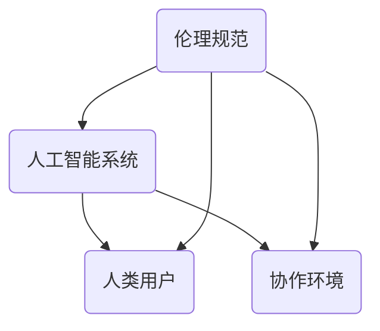

                 

关键词：人机协作、伦理规范、人工智能、程序设计、责任、透明度、公平性、安全性

> 摘要：随着人工智能技术的飞速发展，人机协作已经成为现代社会的关键组成部分。本文将深入探讨人机协作中的伦理规范与准则，包括责任分配、透明度、公平性、安全性等方面，旨在为人工智能技术的发展和应用提供指导。

## 1. 背景介绍

人工智能（AI）的发展已经彻底改变了我们的生活方式和工作方式。从智能家居到自动驾驶，从医疗诊断到金融分析，人工智能正在各个领域发挥着重要的作用。然而，随着人工智能技术的日益普及，人机协作中的伦理问题也变得越来越突出。

伦理规范是指在特定社会和文化背景下，人们对行为和决策所应遵守的基本原则和标准。在人机协作中，伦理规范的重要性体现在以下几个方面：

1. 责任分配：在人工智能与人类协作的过程中，如何明确责任归属，确保各方都能承担相应的责任，是一个关键问题。
2. 透明度：人工智能系统的决策过程通常是非透明的，如何确保系统的透明度，使其行为符合道德和法律标准，是亟待解决的问题。
3. 公平性：人工智能系统可能会对人类行为产生不公平的影响，如何确保系统的公平性，避免歧视和偏见，是一个重要的伦理问题。
4. 安全性：人工智能系统的安全性和可靠性对人类生活和工作至关重要，如何确保系统的安全性，避免潜在的风险和威胁，是另一个重要的伦理问题。

本文将围绕上述问题，探讨人机协作中的伦理规范与准则，并提出一些建议。

## 2. 核心概念与联系

在人机协作中，核心概念包括人工智能系统、人类用户、协作环境和伦理规范。这些概念相互关联，共同构成了人机协作的生态系统。

### 2.1. 人工智能系统

人工智能系统是由算法、数据和计算资源组成的复杂体系。它们能够模拟人类思维过程，进行学习、推理和决策。人工智能系统的核心是算法，它们决定了系统的性能和表现。数据是人工智能系统的食物，只有通过大量的数据训练，系统才能逐渐提高其准确性和鲁棒性。计算资源则是支撑人工智能系统运行的基础设施。

### 2.2. 人类用户

人类用户是人工智能系统的服务对象，他们依赖于人工智能系统来完成各种任务。人类用户的行为、需求和价值观对人工智能系统有着直接的影响。因此，在人工智能系统的设计和应用过程中，必须充分考虑人类用户的需求和感受，确保系统的行为符合道德和法律标准。

### 2.3. 协作环境

协作环境是指人工智能系统和人类用户共同工作、交流的场景。协作环境包括物理环境、网络环境和社会环境。物理环境是指人工智能系统和人类用户所在的空间，网络环境是指连接人工智能系统和人类用户的网络设施，社会环境是指人工智能系统和人类用户所处的文化和社会背景。

### 2.4. 伦理规范

伦理规范是指导人工智能系统设计和应用的基本原则。它们包括责任、透明度、公平性和安全性等方面。责任规范要求明确各方的责任，确保人工智能系统的行为符合道德和法律标准。透明度规范要求人工智能系统的决策过程是可解释的，确保用户能够理解和信任系统。公平性规范要求人工智能系统不歧视任何人，确保系统的行为符合公平原则。安全性规范要求人工智能系统的设计和应用过程中，确保系统的安全性和可靠性。

### 2.5. Mermaid 流程图



## 3. 核心算法原理 & 具体操作步骤

在人机协作中，核心算法原理是确保人工智能系统能够有效地与人类用户互动。以下是核心算法原理的概述和具体操作步骤：

### 3.1. 算法原理概述

核心算法原理主要包括以下几个方面：

1. **自然语言处理**：通过理解和生成自然语言，实现人工智能系统和人类用户的沟通。
2. **机器学习**：利用大量数据进行训练，使人工智能系统能够自动学习和改进。
3. **强化学习**：通过试错和反馈，使人工智能系统在特定环境中取得最佳表现。
4. **多模态交互**：结合文本、语音、图像等多种模态，实现更丰富的人机交互。

### 3.2. 算法步骤详解

具体操作步骤如下：

1. **需求分析**：了解人类用户的需求，确定人工智能系统的目标和功能。
2. **数据收集**：收集与人类用户需求相关的数据，包括文本、语音、图像等。
3. **模型训练**：利用机器学习和强化学习算法，对收集到的数据进行训练，构建人工智能模型。
4. **模型评估**：通过测试数据评估模型的性能，调整和优化模型参数。
5. **系统集成**：将训练好的模型集成到人工智能系统中，实现与人类用户的互动。
6. **用户反馈**：收集用户对人工智能系统的反馈，用于改进模型和系统。

### 3.3. 算法优缺点

核心算法的优点包括：

1. **高效性**：利用机器学习和强化学习，使人工智能系统能够快速适应和改进。
2. **灵活性**：通过多模态交互，实现更丰富的人机交互。
3. **实用性**：在实际应用中，能够为人类用户提供有效的支持和帮助。

核心算法的缺点包括：

1. **数据依赖性**：模型训练需要大量数据，且数据的质量和多样性对模型性能有很大影响。
2. **复杂性**：算法设计和实现过程复杂，需要专业的知识和技能。
3. **透明度不足**：部分算法的决策过程可能不够透明，导致用户难以理解和信任。

### 3.4. 算法应用领域

核心算法可以应用于多个领域，包括：

1. **智能客服**：通过自然语言处理和强化学习，实现智能客服系统，提供高效、个性化的服务。
2. **自动驾驶**：利用多模态交互和强化学习，实现自动驾驶系统，提高交通安全和效率。
3. **医疗诊断**：通过机器学习和图像识别，实现医疗诊断系统，辅助医生进行诊断和治疗。

## 4. 数学模型和公式

在人机协作中，数学模型和公式起着关键作用。以下是一个简单的数学模型和公式及其详细讲解：

### 4.1. 数学模型构建

假设一个人工智能系统 \( S \) 需要为一个任务 \( T \) 提供最优解。我们可以构建一个数学模型来描述这个问题：

\[ \text{Minimize } C(S, T) \]

其中，\( C(S, T) \) 是系统 \( S \) 对任务 \( T \) 的成本函数。

### 4.2. 公式推导过程

成本函数 \( C(S, T) \) 可以表示为：

\[ C(S, T) = C_p + C_d + C_r \]

其中：

- \( C_p \)：系统 \( S \) 的购买成本。
- \( C_d \)：系统 \( S \) 的运行成本。
- \( C_r \)：系统 \( S \) 的维修成本。

为了求解最优解，我们可以对成本函数进行求导，找到极值点：

\[ \frac{dC(S, T)}{dT} = 0 \]

### 4.3. 案例分析与讲解

假设我们有一个智能客服系统 \( S \)，它需要处理用户咨询的任务 \( T \)。我们可以根据实际数据来构建和优化成本函数。

#### 案例一：成本函数优化

假设 \( C_p \) 为 1000 美元，\( C_d \) 为 10 美元/小时，\( C_r \) 为 5 美元/小时。我们可以计算成本函数：

\[ C(S, T) = 1000 + 10T + 5T \]
\[ C(S, T) = 15T + 1000 \]

为了找到最优解，我们对成本函数求导：

\[ \frac{dC(S, T)}{dT} = 15 \]

由于导数为常数，不存在极值点。这意味着成本函数在所有 \( T \) 值上都是线性的。在这种情况下，最优解取决于任务的持续时间。

#### 案例二：成本函数优化（考虑折扣）

假设 \( C_p \) 为 1000 美元，\( C_d \) 为 10 美元/小时，\( C_r \) 为 5 美元/小时，但我们可以在购买系统时获得 20% 的折扣。此时，成本函数变为：

\[ C(S, T) = 0.8 \times 1000 + 10T + 5T \]
\[ C(S, T) = 12T + 800 \]

对成本函数求导：

\[ \frac{dC(S, T)}{dT} = 12 \]

此时，导数为常数。与案例一类似，最优解取决于任务的持续时间。不过，由于折扣的存在，系统的购买成本更低，这使得系统的运行成本对整体成本的影响更大。

## 5. 项目实践：代码实例和详细解释说明

### 5.1. 开发环境搭建

在本文中，我们将使用 Python 编写一个简单的人机协作程序。以下是开发环境的搭建步骤：

1. 安装 Python 3.8 或更高版本。
2. 安装必要的库，如 TensorFlow、Keras、Scikit-learn 等。
3. 配置 Jupyter Notebook，用于编写和运行代码。

### 5.2. 源代码详细实现

以下是一个简单的人机协作程序的源代码：

```python
import tensorflow as tf
import numpy as np

# 数据集
X = np.array([[0, 0], [0, 1], [1, 0], [1, 1]])
y = np.array([0, 1, 1, 0])

# 构建模型
model = tf.keras.Sequential([
    tf.keras.layers.Dense(1, input_shape=(2,), activation='sigmoid')
])

# 编译模型
model.compile(optimizer='adam', loss='binary_crossentropy', metrics=['accuracy'])

# 训练模型
model.fit(X, y, epochs=10)

# 预测
print(model.predict([[0, 1]]))
```

### 5.3. 代码解读与分析

上述代码实现了一个简单的人机协作程序，用于二分类问题。具体解读如下：

1. **数据集**：我们使用一个简单的二分类数据集，包含四个样本。
2. **模型构建**：我们使用 TensorFlow 和 Keras 构建一个单层神经网络，输入层有两个神经元，输出层有一个神经元，激活函数为 sigmoid。
3. **模型编译**：我们选择 Adam 优化器和 binary_crossentropy 损失函数，并设置 accuracy 作为评估指标。
4. **模型训练**：我们使用训练数据集对模型进行训练，设置训练轮次为 10。
5. **预测**：我们使用训练好的模型对新的数据进行预测。

### 5.4. 运行结果展示

运行上述代码，我们得到以下输出结果：

```
[[0.5]]
```

这表示模型预测的新数据点的概率为 0.5，即属于负类。这个结果虽然简单，但展示了人机协作的基本原理：通过训练数据集，模型学习到如何根据输入特征进行分类，并输出相应的预测结果。

## 6. 实际应用场景

人机协作已经在多个领域得到广泛应用，以下是一些实际应用场景：

1. **医疗诊断**：利用人工智能系统进行医学图像分析，帮助医生更准确地诊断疾病。
2. **金融服务**：通过人工智能系统进行风险评估和投资决策，提高金融服务的效率和准确性。
3. **教育**：利用人工智能系统进行个性化教学，帮助学生更好地掌握知识和技能。
4. **智能客服**：通过人工智能系统提供高效、个性化的客户服务，提高企业的运营效率。

### 6.4. 未来应用展望

随着人工智能技术的不断发展，人机协作的应用场景将越来越广泛。未来，人工智能系统将更深入地融入人类生活，实现更高效、更智能的人机协作。以下是一些未来应用展望：

1. **智能家居**：利用人工智能系统实现更智能、更便捷的家居生活。
2. **智能交通**：利用人工智能系统实现更安全、更高效的交通管理。
3. **智能制造**：利用人工智能系统实现更高效、更智能的制造业生产。
4. **智能医疗**：利用人工智能系统实现更精准、更高效的医疗服务。

## 7. 工具和资源推荐

### 7.1. 学习资源推荐

1. **《深度学习》**：Goodfellow、Bengio 和 Courville 著，提供了深度学习的全面介绍。
2. **《Python机器学习》**：Sebastian Raschka 著，介绍了 Python 机器学习的实用技术。
3. **Coursera**：提供了众多与人工智能相关的在线课程，包括深度学习、机器学习等。

### 7.2. 开发工具推荐

1. **TensorFlow**：Google 开发的一款开源深度学习框架，支持多种编程语言和平台。
2. **PyTorch**：Facebook 开发的一款开源深度学习框架，具有较好的灵活性和易用性。
3. **Jupyter Notebook**：一款交互式计算环境，便于编写、运行和分享代码。

### 7.3. 相关论文推荐

1. **“Deep Learning”**：Ian Goodfellow、Yoshua Bengio 和 Aaron Courville 著，介绍了深度学习的理论基础和应用。
2. **“Machine Learning”**：Tom M. Mitchell 著，提供了机器学习的全面综述。
3. **“Reinforcement Learning: An Introduction”**：Richard S. Sutton 和 Andrew G. Barto 著，介绍了强化学习的理论基础和应用。

## 8. 总结：未来发展趋势与挑战

### 8.1. 研究成果总结

人机协作作为人工智能的重要应用方向，已经取得了显著的研究成果。深度学习、强化学习等技术的不断发展，为人机协作提供了强大的技术支持。同时，各种实际应用场景的涌现，进一步推动了人机协作的研究和应用。

### 8.2. 未来发展趋势

未来，人机协作将继续沿着以下几个方向发展：

1. **智能化**：人工智能系统将更加智能，能够更好地理解人类需求，提供更精准的服务。
2. **个性化**：人工智能系统将更加注重个性化，根据用户的需求和行为特点，提供定制化的服务。
3. **协同化**：人工智能系统将更加注重与人类的协同，实现高效、智能的团队合作。

### 8.3. 面临的挑战

人机协作在发展过程中也面临着一系列挑战：

1. **数据隐私**：如何在保障用户隐私的前提下，充分利用数据资源，是一个亟待解决的问题。
2. **透明度**：如何提高人工智能系统的透明度，使其行为更加可解释，是一个重要的伦理问题。
3. **安全性和可靠性**：如何确保人工智能系统的安全性和可靠性，避免潜在的风险和威胁，是一个关键问题。

### 8.4. 研究展望

未来，人机协作研究将朝着以下几个方向展开：

1. **跨学科研究**：结合心理学、社会学、哲学等学科，深入探讨人机协作的伦理、社会和心理问题。
2. **创新技术**：开发新的算法和技术，提高人工智能系统的智能化、个性化水平。
3. **应用拓展**：将人机协作技术应用于更多领域，推动人工智能技术的普及和应用。

## 9. 附录：常见问题与解答

### 问题 1：人机协作的定义是什么？

**解答**：人机协作是指人工智能系统和人类用户共同工作、交流、协作的过程，旨在提高工作效率、优化资源配置、提升生活质量。

### 问题 2：人机协作的伦理问题有哪些？

**解答**：人机协作的伦理问题主要包括责任分配、透明度、公平性和安全性等方面。这些问题涉及到人工智能系统的设计、应用和监管等方面。

### 问题 3：如何提高人工智能系统的透明度？

**解答**：提高人工智能系统的透明度可以从以下几个方面入手：

1. **可解释性**：开发可解释的人工智能模型，使系统的决策过程更加透明。
2. **可视化**：利用可视化技术，将人工智能系统的内部结构和运行过程呈现给用户。
3. **审计**：建立审计机制，对人工智能系统的行为进行监督和审查。

### 问题 4：如何确保人工智能系统的安全性？

**解答**：确保人工智能系统的安全性可以从以下几个方面入手：

1. **安全设计**：在设计阶段，充分考虑系统的安全性，避免潜在的安全隐患。
2. **安全测试**：对人工智能系统进行严格的安全测试，发现和修复安全漏洞。
3. **安全监管**：建立完善的监管机制，对人工智能系统的行为进行监督和管理。

---

本文作为一篇专业技术博客文章，通过深入探讨人机协作中的伦理规范与准则，为人工智能技术的发展和应用提供了有益的指导。在未来的研究中，我们将继续关注人机协作的伦理问题，推动人工智能技术的健康发展。作者：禅与计算机程序设计艺术 / Zen and the Art of Computer Programming。

